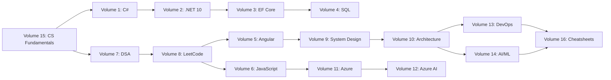

<div align="center">

# 🚀 2026 Software Engineering Interview Master Course

### The Most Comprehensive Interview Preparation Resource for FAANG & Top Tech Companies

[]()
[]()
[]()
[]()
[]()
[]()

---

> **From Zero to FAANG — Complete Interview Preparation for Freshers to Architects**

[](LICENSE)
[](CONTRIBUTING.md)


---

</div>

## 📚 Course Overview

This master course covers **16 comprehensive volumes** with **1500+ interview questions**, **complete system design guides**, **LeetCode solutions**, and **cheatsheets** — all updated for **2026** industry standards.

### 🎯 Who Is This For?

| Level | Focus Areas | Target Companies |
|-------|-------------|------------------|
| 🟢 **Freshers** | CS Fundamentals, DSA, Core Languages | Startups, Mid-size |
| 🔵 **Junior (1-3 yrs)** | DSA, OOP, SQL, Web Technologies | Product Companies |
| 🟡 **Mid-Level (3-6 yrs)** | System Design, Architecture, Cloud | FAANG, Unicorns |
| 🟠 **Senior (6-10 yrs)** | Distributed Systems, Scalability | FAANG, Big Tech |
| 🔴 **Lead/Architect (10+)** | Architecture, Strategy, Cost Optimization | FAANG, Enterprise |

---

## 📖 Volume Structure

<details open>
<summary><strong>📦 Volume 1 — C# Interview Questions</strong> (100+ Questions)</summary>

<br>

| # | Topic | Questions |
|---|-------|-----------|
| 1 | C# Basics & Syntax | 15 |
| 2 | OOP in C# | 12 |
| 3 | Delegates & Events | 8 |
| 4 | LINQ | 10 |
| 5 | Async/Await & TPL | 10 |
| 6 | Memory Management & GC | 8 |
| 7 | Reflection & Attributes | 6 |
| 8 | Generics | 6 |
| 9 | Collections | 8 |
| 10 | Advanced C# Features | 8 |
| 11 | C# 12/13 Features | 5 |
| 12 | Exception Handling | 4 |

</details>

<details>
<summary><strong>📦 Volume 2 — .NET 10 Interview Questions</strong> (100+ Questions)</summary>

<br>

| # | Topic | Questions |
|---|-------|-----------|
| 1 | .NET 10 Runtime & CLR | 12 |
| 2 | ASP.NET Core Fundamentals | 15 |
| 3 | Middleware Pipeline | 8 |
| 4 | Dependency Injection | 10 |
| 5 | Configuration & Options | 6 |
| 6 | Hosting & Startup | 6 |
| 7 | gRPC in .NET | 8 |
| 8 | Minimal APIs | 8 |
| 9 | Performance Optimization | 10 |
| 10 | Native AOT | 6 |
| 11 | .NET 10 New Features | 6 |
| 12 | Blazor & MAUI | 5 |

</details>

<details>
<summary><strong>📦 Volume 3 — Entity Framework Core Interview Questions</strong> (100+ Questions)</summary>

<br>

| # | Topic | Questions |
|---|-------|-----------|
| 1 | EF Core Fundamentals | 12 |
| 2 | Migrations | 8 |
| 3 | Querying & LINQ | 15 |
| 4 | Relationships | 10 |
| 5 | Performance Tuning | 12 |
| 6 | Change Tracker | 8 |
| 7 | Concurrency | 6 |
| 8 | Raw SQL & Stored Procs | 6 |
| 9 | Advanced Features | 10 |
| 10 | EF Core 10 Features | 8 |
| 11 | Database Providers | 5 |

</details>

<details>
<summary><strong>📦 Volume 4 — SQL Interview Questions</strong> (100+ Questions)</summary>

<br>

| # | Topic | Questions |
|---|-------|-----------|
| 1 | SQL Basics & DDL | 12 |
| 2 | Joins & Set Operations | 15 |
| 3 | Subqueries & CTEs | 10 |
| 4 | Window Functions | 10 |
| 5 | Indexing Strategy | 10 |
| 6 | Query Optimization | 12 |
| 7 | Transactions & Locking | 8 |
| 8 | Stored Procedures & Functions | 8 |
| 9 | Database Design & Normalization | 10 |
| 10 | Advanced SQL | 5 |

</details>

<details>
<summary><strong>📦 Volume 5 — Angular Interview Questions</strong> (100+ Questions)</summary>

<br>

| # | Topic | Questions |
|---|-------|-----------|
| 1 | Angular Architecture | 12 |
| 2 | Components & Templates | 15 |
| 3 | Directives & Pipes | 8 |
| 4 | Services & DI | 10 |
| 5 | RxJS & Observables | 15 |
| 6 | State Management | 8 |
| 7 | Routing & Navigation | 10 |
| 8 | Forms | 10 |
| 9 | Performance Optimization | 8 |
| 10 | Testing | 6 |
| 11 | Angular 19/20 Features | 8 |
| 12 | Signals & New APIs | 6 |

</details>

<details>
<summary><strong>📦 Volume 6 — JavaScript Interview Questions</strong> (100+ Questions)</summary>

<br>

| # | Topic | Questions |
|---|-------|-----------|
| 1 | JS Core Concepts | 15 |
| 2 | Execution Context & Hoisting | 10 |
| 3 | Closures & Scope | 10 |
| 4 | Prototypes & Inheritance | 8 |
| 5 | Async JS | 15 |
| 6 | Event Loop | 8 |
| 7 | ES6+ Features | 12 |
| 8 | Arrays & Objects | 10 |
| 9 | TypeScript Basics | 8 |
| 10 | Browser APIs | 4 |

</details>

<details>
<summary><strong>📦 Volume 7 — Data Structures & Algorithms</strong> (Complete)</summary>

<br>

| # | Topic | Coverage |
|---|-------|----------|
| 1 | Arrays & Strings | Complete |
| 2 | Linked Lists | Complete |
| 3 | Stacks & Queues | Complete |
| 4 | Trees & BST | Complete |
| 5 | Graphs | Complete |
| 6 | Hashing | Complete |
| 7 | Heaps & Priority Queues | Complete |
| 8 | Tries | Complete |
| 9 | Union-Find | Complete |
| 10 | Segment Trees & Fenwick | Complete |

</details>

<details>
<summary><strong>📦 Volume 8 — LeetCode Most Asked Questions</strong></summary>

<br>

| # | Category | Problems |
|---|----------|---------|
| 1 | Arrays | 15 |
| 2 | Strings | 10 |
| 3 | Two Pointers | 8 |
| 4 | Sliding Window | 6 |
| 5 | Binary Search | 8 |
| 6 | Trees | 12 |
| 7 | Graphs | 10 |
| 8 | Dynamic Programming | 15 |
| 9 | Backtracking | 6 |
| 10 | Greedy | 5 |
| 11 | Heaps | 5 |
| 12 | Tries | 3 |

</details>

<details>
<summary><strong>📦 Volume 9 — System Design Interview Guide</strong> (Complete)</summary>

<br>

| # | Design Problem | Companies |
|---|----------------|-----------|
| 1 | URL Shortener (tinyurl) | Google |
| 2 | Netflix | Netflix |
| 3 | YouTube | Google |
| 4 | WhatsApp | Meta |
| 5 | Uber | Uber |
| 6 | Twitter/X | All FAANG |
| 7 | Instagram | Meta |
| 8 | Facebook News Feed | Meta |
| 9 | ChatGPT/LLM Service | OpenAI |
| 10 | Banking System | All |
| 11 | E-Commerce (Amazon) | Amazon |
| 12 | Inventory System | All |

</details>

<details>
<summary><strong>📦 Volume 10 — System Architecture</strong></summary>

<br>

| # | Architecture Pattern | Coverage |
|---|---------------------|----------|
| 1 | Monolith | Pros, Cons, When |
| 2 | Modular Monolith | Transition Strategy |
| 3 | Microservices | Deep Dive |
| 4 | Event-Driven Architecture | Complete |
| 5 | CQRS | Complete |
| 6 | Event Sourcing | Complete |
| 7 | Clean Architecture | Complete |
| 8 | Onion Architecture | Complete |
| 9 | Hexagonal Architecture | Complete |
| 10 | Distributed Systems | Complete |

</details>

<details>
<summary><strong>📦 Volume 11 — Azure Interview Guide</strong></summary>

<br>

| # | Azure Service | Questions |
|---|---------------|-----------|
| 1 | Azure Compute (VMs, App Service, Functions) | 15 |
| 2 | Azure Storage | 10 |
| 3 | Azure SQL & Cosmos DB | 10 |
| 4 | Azure Networking | 8 |
| 5 | Azure DevOps | 8 |
| 6 | Azure Security (Entra ID, Key Vault) | 10 |
| 7 | Azure Monitoring | 6 |
| 8 | Azure Containers (AKS, ACR) | 8 |
| 9 | Azure Architecture (Well-Architected Framework) | 10 |
| 10 | Azure Migration | 5 |

</details>

<details>
<summary><strong>📦 Volume 12 — Azure AI Foundry</strong></summary>

<br>

| # | Topic | Coverage |
|---|-------|----------|
| 1 | Azure AI Foundry Overview | Complete |
| 2 | AI Studio & Prompt Flow | Complete |
| 3 | Azure OpenAI Service | Complete |
| 4 | RAG Pattern | Complete |
| 5 | AI Search | Complete |
| 6 | Content Safety | Complete |
| 7 | Fine-Tuning LLMs | Complete |
| 8 | AI Agents | Complete |
| 9 | Responsible AI | Complete |
| 10 | Interview Questions | 50+ |

</details>

<details>
<summary><strong>📦 Volume 13 — DevOps Interview Guide</strong></summary>

<br>

| # | Topic | Coverage |
|---|-------|----------|
| 1 | CI/CD Pipelines | Complete |
| 2 | Docker | Complete |
| 3 | Kubernetes | Complete |
| 4 | Infrastructure as Code | Complete |
| 5 | Monitoring & Logging | Complete |
| 6 | Git | Complete |
| 7 | GitHub Actions | Complete |
| 8 | Azure DevOps | Complete |
| 9 | SRE Principles | Complete |
| 10 | Interview Questions | 100+ |

</details>

<details>
<summary><strong>📦 Volume 14 — AI/ML Interview Guide</strong></summary>

<br>

| # | Topic | Coverage |
|---|-------|----------|
| 1 | ML Fundamentals | Complete |
| 2 | Deep Learning | Complete |
| 3 | NLP & LLMs | Complete |
| 4 | Computer Vision | Complete |
| 5 | MLOps | Complete |
| 6 | AI in Production | Complete |
| 7 | Interview Questions | 100+ |

</details>

<details>
<summary><strong>📦 Volume 15 — CS Fundamentals</strong></summary>

<br>

| # | Topic | Coverage |
|---|-------|----------|
| 1 | Operating Systems | Complete |
| 2 | Networking | Complete |
| 3 | How Computers Work | Complete |
| 4 | How Apps Run Internally | Complete |
| 5 | Memory Management | Complete |
| 6 | Concurrency & Parallelism | Complete |
| 7 | Compilers & Runtimes | Complete |
| 8 | Database Internals | Complete |

</details>

<details>
<summary><strong>📦 Volume 16 — Final Interview Cheatsheets</strong></summary>

<br>

| # | Cheatsheet | Coverage |
|---|------------|----------|
| 1 | 5-Min Quick Reference | All Subjects |
| 2 | 15-Min Revision | All Subjects |
| 3 | One-Page Summaries | Per Subject |
| 4 | Common Traps | All Levels |
| 5 | Senior-Level Deep Dives | System Design |
| 6 | Mnemonics & Memory Aids | All Subjects |
| 7 | Mind Maps | Architecture |
| 8 | Behavioral Questions | STAR Method |

</details>

---

## 🗺️ Learning Path



---

## 🏆 Features

| Feature | Description |
|---------|-------------|
| ✅ **100+ Questions Per Subject** | Deep coverage for every topic |
| ✅ **FAANG-Level Deep Dives** | Advanced concepts asked by top companies |
| ✅ **Step-by-Step Execution** | Trace through every layer |
| ✅ **Internal Working** | Runtime, memory, CPU, network impact |
| ✅ **Performance Analysis** | Time/Space complexity, tradeoffs |
| ✅ **Real-World Examples** | Practical code and scenarios |
| ✅ **C#, Angular, SQL, Azure Examples** | Multi-platform coverage |
| ✅ **Explain Like I'm 7** | Simple explanations for complex topics |
| ✅ **Follow-Up Questions** | Junior, Mid, Senior levels |
| ✅ **Revision Cheatsheets** | 5-min, 15-min, one-page summaries |
| ✅ **2026 Best Practices** | Latest frameworks and tools |
| ✅ **Interview Answer Format** | Ready-to-use responses |

---

## 🚀 Quick Start

```bash
# Clone the repository
git clone https://github.com/yourusername/2026-interview-master-course.git

# Navigate to the course
cd 2026-interview-master-course

# Start with fundamentals
open volumes/volume-15-cs-fundamentals/README.md
```

### Recommended Order

| Phase | Duration | Volumes |
|-------|----------|---------|
| **Phase 1: Foundation** | 2 weeks | 15 (CS Fundamentals), 7 (DSA) |
| **Phase 2: Language Mastery** | 3 weeks | 1 (C#), 2 (.NET 10), 6 (JavaScript) |
| **Phase 3: Data & Web** | 2 weeks | 3 (EF Core), 4 (SQL), 5 (Angular) |
| **Phase 4: Problem Solving** | 3 weeks | 8 (LeetCode), 9 (System Design) |
| **Phase 5: Advanced Topics** | 3 weeks | 10 (Architecture), 11 (Azure), 12 (AI Foundry) |
| **Phase 6: Modern Stack** | 2 weeks | 13 (DevOps), 14 (AI/ML) |
| **Phase 7: Final Prep** | 1 week | 16 (Cheatsheets) |

**Total: ~16 weeks**

---

## 📊 Progress Tracker

```markdown
- [ ] Volume 1: C# 
- [ ] Volume 2: .NET 10
- [ ] Volume 3: EF Core
- [ ] Volume 4: SQL
- [ ] Volume 5: Angular
- [ ] Volume 6: JavaScript
- [ ] Volume 7: DSA
- [ ] Volume 8: LeetCode
- [ ] Volume 9: System Design
- [ ] Volume 10: System Architecture
- [ ] Volume 11: Azure
- [ ] Volume 12: Azure AI Foundry
- [ ] Volume 13: DevOps
- [ ] Volume 14: AI/ML
- [ ] Volume 15: CS Fundamentals
- [ ] Volume 16: Cheatsheets
```

---

## 🤝 Contributing

Contributions are welcome! See [CONTRIBUTING.md](CONTRIBUTING.md) for guidelines.

### How to Contribute

1. Fork the repository
2. Create a feature branch: `git checkout -b feature/new-content`
3. Commit changes: `git commit -m 'Add new volume content'`
4. Push: `git push origin feature/new-content`
5. Open a Pull Request

---

## 📝 License

This project is licensed under the MIT License - see [LICENSE](LICENSE) for details.

---

## ⭐ Support

If you find this course helpful, please give it a star ⭐ and share with fellow engineers!

---

<div align="center">

### Happy Learning! 🎯

**May your interviews be successful and your offers be plenty!**

---

*Built with ❤️ for the global software engineering community*

</div>
