# �� System Architecture & Design Patterns — Interview Guide

[](https://shields.io/)
[](https://shields.io/)
[](https://shields.io/)
[](https://shields.io/)

> **Volume 10 of a 16-Volume Interview Preparation Series**

---

## 📑 Table of Contents

- [About This Guide](#about-this-guide)
- [Architecture Patterns](#architecture-patterns)
  - [1. Monolithic Architecture](#1-monolithic-architecture)
  - [2. Modular Monolith](#2-modular-monolith)
  - [3. Microservices Architecture](#3-microservices-architecture)
  - [4. Event-Driven Architecture](#4-event-driven-architecture)
  - [5. CQRS](#5-command-query-responsibility-segregation-cqrs)
  - [6. Event Sourcing](#6-event-sourcing)
  - [7. Clean Architecture](#7-clean-architecture-robert-c-martin)
  - [8. Onion Architecture](#8-onion-architecture)
  - [9. Hexagonal Architecture](#9-hexagonal-architecture-ports--adapters)
  - [10. Domain-Driven Design (DDD)](#10-domain-driven-design-ddd)
  - [11. Saga Pattern](#11-saga-pattern)
  - [12. Strangler Fig Pattern](#12-strangler-fig-pattern)
  - [13. BFF](#13-backend-for-frontend-bff)
  - [14. Sidecar Pattern](#14-sidecar-pattern)
  - [15. Ambassador Pattern](#15-ambassador-pattern)
  - [16. Repository Pattern](#16-repository-pattern)
  - [17. Unit of Work Pattern](#17-unit-of-work-pattern)
  - [18. Outbox Pattern](#18-outbox-pattern)
- [Cross-Cutting Concepts](#cross-cutting-concepts)
- [Final Cheatsheet](#final-cheatsheet)

---

## About This Guide

This volume covers **18 core architecture patterns**, cross-cutting concepts, and a comprehensive interview framework. Each pattern includes:

| Section | Description |
|---------|-------------|
| What It Is | Clear definition |
| Problem It Solves | The architectural pain point |
| When to Use / NOT to Use | Decision criteria |
| Structure/Diagram | Mermaid visualization |
| Pros / Cons | 5+ points each |
| Scalability | How and limitations |
| Trade-offs | Engineering trade-off analysis |
| Real-World Examples | FAANG and industry |
| C# / .NET Implementation | Code example |
| Interview Questions | Junior / Mid / Senior |
| Common Mistakes | Pitfalls to avoid |
| FAANG-Level Deep Dive | Advanced insights |

---

# Architecture Patterns

## 1. Monolithic Architecture

### What It Is

A single deployable unit where all application components (UI, business logic, data access) are packaged together into one process.

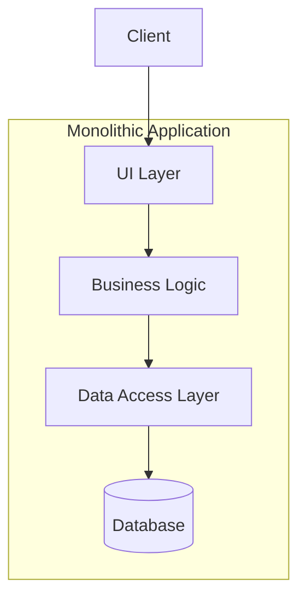

### Problem It Solves

**Simplicity of development, deployment, and operations** when the application scope is small-to-medium and team size is limited. Avoids distributed systems complexity.

### When to Use

- Early-stage startups / MVPs
- Small teams (< 10 developers)
- Applications with well-defined, stable boundaries
- When operational simplicity is paramount
- When latency is critical (no network hops between components)

### When NOT to Use

- Large teams needing independent deployability
- System requires independent scaling of components
- Need for polyglot technologies per component
- When different components have conflicting resource requirements (one CPU-bound, one memory-bound)

### Pros

1. **Simple development** — single codebase, straightforward debugging
2. **Simple deployment** — one artifact to deploy
3. **Simple testing** — end-to-end tests run in a single process
4. **Low latency** — in-process calls, no network overhead
5. **Atomic transactions** — ACID guarantees via single database
6. **Simpler operational monitoring** — one application to monitor

### Cons

1. **Scaling limitations** — must scale entire application, not just hot paths
2. **Technology lock-in** — hard to adopt new tech for specific components
3. **Deployment coupling** — any change requires full redeployment
4. **Codebase complexity** — grows without bound; IDE struggles
5. **Limited organizational scaling** — Conway's Law: monolith teams struggle to split work
6. **Single point of failure** — crash brings down everything

### Scalability

- **How it scales:** Vertical scaling (bigger machines) and horizontal via load-balanced instances
- **Limitations:** Cannot scale components independently; cache-unfriendly if different components have different access patterns

### Trade-offs

| Aspect | Monolith | Microservices |
|--------|----------|---------------|
| Development speed (early) | ? Faster | ? Slower |
| Development speed (late) | ? Slower | ? Faster |
| Deployment risk | ? High | ? Low |
| Operational complexity | ? Low | ? High |
| Team autonomy | ? Low | ? High |

### Real-World Examples

- **Shopify** — ran as monolith for years; scaled to handle Black Friday traffic
- **Etsy** — ran monolith until ~2015
- **Stack Overflow** — still largely a monolith serving 1B+ visits/month
- **Basecamp** — famously operates as monolith

### C# / .NET Implementation Example

```csharp
// Monolithic ASP.NET Core application - all layers in a single project
public class OrderController : ControllerBase
{
    private readonly OrderService _orderService;
    public OrderController(OrderService orderService) => _orderService = orderService;

    [HttpPost]
    public IActionResult CreateOrder(CreateOrderRequest request)
    {
        var result = _orderService.CreateOrder(request);
        return Ok(result);
    }
}

public class OrderService
{
    private readonly AppDbContext _db;
    public OrderService(AppDbContext db) => _db = db;

    public OrderResult CreateOrder(CreateOrderRequest request)
    {
        using var transaction = _db.Database.BeginTransaction();
        var order = new Order { CustomerId = request.CustomerId, Total = request.Total };
        _db.Orders.Add(order);
        _db.SaveChanges();
        transaction.Commit();
        return new OrderResult(order.Id);
    }
}
```

### Interview Questions

<details>
<summary><b>Junior</b></summary>

**Q1:** What is a monolithic architecture and when would you choose it?

> *Single deployable unit. Choose for simple apps, small teams, MVPs, or when operational simplicity is more valuable than scaling independence.*

**Q2:** What are the main disadvantages of monoliths?

> *Scaling inflexibility, technology lock-in, deployment coupling, codebase size management.*
</details>

<details>
<summary><b>Mid</b></summary>

**Q3:** How would you scale a monolithic application to handle 10x traffic?

> *Vertical scaling, then horizontal with load balancer. Add read replicas. Implement caching (Redis/Memcached). Consider CDN for static content. If still constrained, identify bounded contexts to extract.*

**Q4:** Explain how the Strangler Fig pattern relates to monolith migration.

> *Incrementally replace monolith functions with microservices. Route traffic to new or old system via a facade. Remove old code when migration is complete.*
</details>

<details>
<summary><b>Senior</b></summary>

**Q5:** You have a monolithic application with 500K LOC and 50 developers. What is your migration strategy, and what are the risks?

> *Identify bounded contexts via DDD. Extract as services using Strangler Fig. Route via API gateway. Risk: distributed transaction complexity, data consistency, network latency, team restructuring.*

**Q6:** Describe a situation where a monolith is still the better choice over microservices for a large application.

> *Real-time trading systems where microseconds matter: in-process calls beat network. Also, embedded systems where deployment is constrained. The operational cost of microservices must be justified.*
</details>

### Common Mistakes

1. **Premature extraction** — splitting before understanding domain boundaries
2. **Shared database** — keeping a single DB while splitting the code; creates hidden coupling
3. **No modular structure** — allowing the monolith to become a Big Ball of Mud
4. **Ignoring Conway's Law** — org structure must match architecture

### FAANG-Level Deep Dive

At **Google**, the monorepo monolith is still the standard. Their build system (Bazel) and code review tooling handle scale that would be impossible elsewhere. Key insight: **invest in tooling before splitting**. At **Amazon**, the famous "API mandate" forced all teams to communicate via APIs, which paved the way for eventual microservices. The real decision is not monolith vs microservices — it is **when and how** to transition.

> "You should not start a new project with microservices, even if you are sure your application will be big enough to make it worthwhile." — Martin Fowler

---

## 2. Modular Monolith

### What It Is

A single deployable unit with **strong module boundaries** enforced at the code level. Each module owns its data, logic, and domain. Modules communicate through well-defined interfaces.

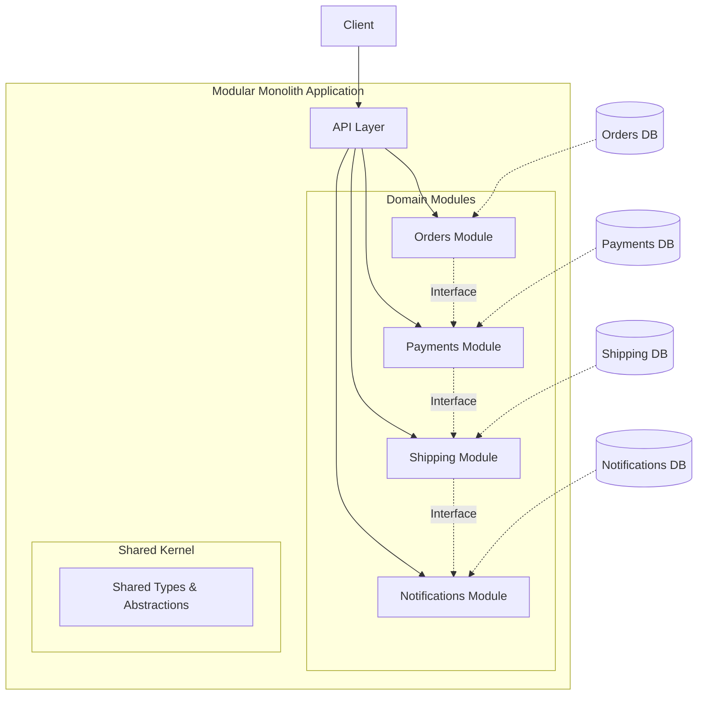

### Problem It Solves

The **monolith complexity problem** without paying the distributed systems tax. Enables domain isolation, clear boundaries, and a path to microservices when needed.

### When to Use

- Medium-to-large applications where a pure monolith is too chaotic
- Organizations planning eventual microservices migration
- Teams that want domain isolation without distributed deployment
- When you need strong boundaries but cannot justify network overhead

### When NOT to Use

- Teams need truly independent deployability
- Different modules need different scaling policies
- Polyglot persistence is required (different DB types)
- Startups in discovery phase (over-engineering)

### Pros

1. **Simpler deployment** — single artifact
2. **Strong module boundaries** — prevents Big Ball of Mud
3. **Clear migration path** to microservices
4. **In-process calls** — no network latency between modules
5. **Atomic transactions** across modules (within DB)
6. **Better team alignment** — each team owns a module

### Cons

1. **Deployment coupling** — one module change = full redeploy
2. **Technology coupling** — all modules share same tech stack
3. **Scaling coupling** — must scale entire application
4. **Self-discipline required** — boundaries can erode
5. **Module dependency management** — circular dependencies possible

### Scalability

- **How it scales:** Vertical scaling, horizontal with load-balanced instances
- **Limitations:** Cannot scale individual modules. If one module is hot, the whole app scales

### Trade-offs

- **Versus Monolith:** More upfront design, better long-term maintainability
- **Versus Microservices:** Simpler operations, less flexibility in scaling/deployment

### Real-World Examples

- **Microsoft Teams** — large modular monolith
- **Uber (early)** — modular monolith before microservices
- **SoundCloud** — started as monolith, evolved with modular structure

### C# / .NET Implementation Example

```csharp
// Modules are separate class library projects with shared abstractions

// Modules/Orders/OrderModule.cs
public class OrderModule
{
    private readonly IOrderRepository _repository;
    private readonly IPaymentGateway _paymentGateway;
    private readonly IMessageBus _messageBus;

    public OrderModule(IOrderRepository repo, IPaymentGateway pmt, IMessageBus bus)
    {
        _repository = repo;
        _paymentGateway = pmt;
        _messageBus = bus;
    }

    public OrderResult PlaceOrder(OrderRequest request)
    {
        var order = Order.Create(request.CustomerId, request.Items);
        _repository.Save(order);
        _messageBus.Publish(new OrderPlacedEvent(order.Id, order.Total));
        return new OrderResult(order.Id);
    }
}

// Contracts/Abstractions/IOrderRepository.cs
public interface IOrderRepository
{
    void Save(Order order);
    Order GetById(Guid id);
}
```

### Interview Questions

<details>
<summary><b>Junior</b></summary>

**Q1:** What distinguishes a modular monolith from a regular monolith?

> *Regular monoliths allow arbitrary cross-cutting. Modular monoliths enforce boundaries — each module has its own data, logic, and public interface. Modules communicate only through contracts.*

**Q2:** What is a "shared kernel"?

> *A small set of types and abstractions shared across modules. Examples: base types, common utility interfaces. Must be kept minimal and stable.*
</details>

<details>
<summary><b>Mid</b></summary>

**Q3:** How do modules communicate in a modular monolith?

> *Via in-process interfaces. Module A references Module B interface assembly. The composition root wires implementations. No direct coupling to implementation details.*

**Q4:** How does this pattern prepare for microservices?

> *Each module already owns its data and has a defined interface. Extracting to a separate service involves: (1) create service host, (2) replace in-process interface call with HTTP/messaging, (3) split the database.*
</details>

<details>
<summary><b>Senior</b></summary>

**Q5:** How do you prevent module boundary erosion in a large team?

> *Architecture tests (NetArchTest), code reviews, ADRs, module dependency graph enforcement. Use tools to validate dependency direction.*

**Q6:** You are extracting Module X from a modular monolith to a microservice. How do you handle shared transactions that cross module boundaries?

> *Use Saga pattern. The modular monolith local transaction becomes a distributed saga. Choreography via events or orchestration via a coordinator service.*
</details>

### Common Mistakes

1. **Leaky abstractions** — modules calling each others internals
2. **Shared database** — modules accessing each others tables
3. **Over-engineering** — building microservice-level infrastructure before splitting
4. **Circular references** — modules depending on each other

### FAANG-Level Deep Dive

At **Meta**, the monolith is famously massive. They invest heavily in tooling (static analysis, build systems) to maintain module boundaries at scale. The key insight: **module boundaries are social structures enforced by technical means**. At **Google**, the monorepo has thousands of modules — each with clear OWNERS files and visibility restrictions. The transition from monolith to modular monolith is the first step to microservices. **Most FAANG engineers agree: start modular, split later.**

---

## 3. Microservices Architecture

### What It Is

An architectural style where an application is composed of **small, independently deployable services** that own their data and communicate via lightweight protocols (HTTP, gRPC, messaging).

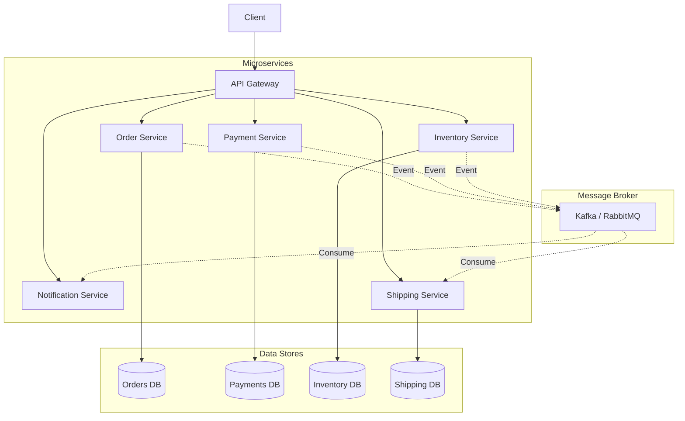

### Problem It Solves

**Independent deployability, scalability, and team autonomy.** Large applications become unmanageable as monoliths. Microservices allow each service to evolve, scale, and deploy independently.

### When to Use

- Large engineering organizations (50+ engineers)
- Need for independent deployment cycles
- Different scaling requirements per component
- Polyglot technology needs
- Multiple teams owning distinct business domains

### When NOT to Use

- Small teams (< 10)
- Early-stage products (MVPs)
- Simple CRUD applications
- Teams without DevOps maturity
- Latency-critical real-time systems

### Pros

1. **Independent deployability** — deploy services without coordination
2. **Independent scalability** — scale hot services only
3. **Technology diversity** — choose best tech per service
4. **Team autonomy** — teams own services end-to-end
5. **Fault isolation** — one service crash does not bring down the system
6. **Easier onboarding** — smaller codebases

### Cons

1. **Distributed systems complexity** — network, latency, partial failure
2. **Operational overhead** — monitoring, logging, deployment pipelines
3. **Data consistency challenges** — eventual consistency required
4. **Testing complexity** — integration and e2e tests are harder
5. **Inter-service communication** — serialization/deserialization overhead
6. **Debugging difficulty** — tracing across services

### Scalability

- **How it scales:** Each service independently horizontally. Hot services get more instances
- **Limitations:** Database scaling becomes the bottleneck. Eventual consistency complicates user-facing features

### Trade-offs

| Aspect | Monolith | Microservices |
|--------|----------|---------------|
| Dev velocity (early) | ? Fast | ? Slow |
| Dev velocity (mature) | ? Slow | ? Fast |
| Operational cost | ? Low | ? High |
| Data consistency | ? Strong | ? Eventual |
| Testing | ? Simple | ? Complex |
| Deployment risk | ? High | ? Low |

### Real-World Examples

- **Amazon** — pioneered internal services (API mandate, 2002)
- **Netflix** — 500+ microservices, massive chaos engineering
- **Uber** — 2200+ microservices
- **Spotify** — squad model, ~1000 services

### C# / .NET Implementation Example

```csharp
// OrderService (standalone ASP.NET service)
[ApiController]
[Route("api/[controller]")]
public class OrdersController : ControllerBase
{
    private readonly IOrderRepository _repository;
    private readonly IMessageBus _bus;

    [HttpPost]
    public async Task<IActionResult> Create(OrderRequest request)
    {
        var order = Order.Create(request.CustomerId, request.Items);
        await _repository.SaveAsync(order);
        await _bus.PublishAsync("order.created", new OrderPlacedEvent
        {
            OrderId = order.Id,
            CustomerId = order.CustomerId,
            Total = order.Total
        });
        return Ok(new { order.Id });
    }
}

// Program.cs
var builder = WebApplication.CreateBuilder(args);
builder.Services.AddScoped<IOrderRepository, OrderRepository>();
builder.Services.AddSingleton<IMessageBus, KafkaMessageBus>();
builder.Services.AddDbContext<OrderDbContext>();
builder.Services.AddHealthChecks()
    .AddDbContextCheck<OrderDbContext>();
```

### Interview Questions

<details>
<summary><b>Junior</b></summary>

**Q1:** What are microservices?

> *Small, independently deployable services that each own a business capability and communicate via APIs.*

**Q2:** How do microservices communicate?

> *Synchronously via HTTP/REST, gRPC; asynchronously via message queues (Kafka, RabbitMQ, SQS).*
</details>

<details>
<summary><b>Mid</b></summary>

**Q3:** How do you handle data consistency across microservices?

> *Use Saga pattern (choreography or orchestration), eventual consistency, Outbox pattern for reliable messaging. Avoid distributed transactions (2PC).*

**Q4:** Explain service discovery in microservices.

> *Services register with a registry (Consul, Eureka, K8s DNS). Clients query the registry to find service instances. Client-side or server-side load balancing.*
</details>

<details>
<summary><b>Senior</b></summary>

**Q5:** How do you decompose a monolith into microservices? Walk through your methodology.

> *(1) Identify bounded contexts via DDD (Event Storming). (2) Decompose by business capability. (3) Ensure each service owns its data. (4) Define service interfaces/contracts. (5) Implement Strangler Fig pattern. (6) Set up CI/CD, monitoring, tracing. (7) Gradually route traffic to new services.*

**Q6:** Your payment service is down. How do you prevent order failures?

> *Circuit breaker pattern. Queue orders for retry. Use fallback mechanisms. Idempotency keys for safe retries. Consider out-of-band manual reconciliation.*
</details>

### Common Mistakes

1. **Shared database** — services accessing each others DBs
2. **Too fine-grained** — chatty services with excessive network calls
3. **Ignoring DevOps** — microservices without CI/CD and monitoring is a nightmare
4. **Synchronous chains** — deep call chains that multiply latency and failure points
5. **Premature splitting** — microservices before understanding domain boundaries

### FAANG-Level Deep Dive

**Netflix** is the canonical reference. They pioneered: **Chaos Monkey** (randomly kills instances), **Hystrix** (circuit breaker), **Eureka** (service discovery), **Zuul** (gateway). Key insight: **design for failure** — every call must handle timeouts, retries, fallbacks. At **Amazon**, every team exposes APIs that any other team can call — no shared databases allowed. The **two-pizza team** rule directly maps to service ownership.

> "If you cannot build a monolith first, you do not understand your domain well enough to split it." — Martin Fowler

---

## 4. Event-Driven Architecture

### What It Is

An architecture where **services communicate through events** — significant state changes are published, and interested services consume and react to them. Involves an event broker (Kafka, RabbitMQ, Event Grid).

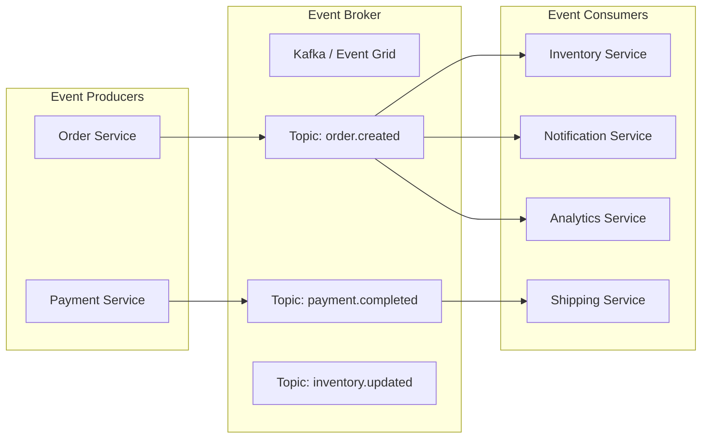

### Problem It Solves

**Tight coupling between services.** Synchronous HTTP calls create temporal coupling (caller and receiver must both be up). Event-driven architecture decouples producers from consumers, both in time and space.

### When to Use

- Systems needing loose coupling between components
- Real-time event processing / streaming
- Multi-service workflows that do not need immediate consistency
- Audit logging and event reconstruction
- When integrating heterogeneous systems

### When NOT to Use

- Simple CRUD applications
- Need for strong, immediate consistency
- Debugging without proper tooling (event tracing is hard)
- Small applications where event infrastructure overhead is not justified

### Pros

1. **Loose coupling** — producers do not know consumers
2. **Scalability** — consume events at own pace (backpressure)
3. **Resilience** — events persist in broker; consumers can replay
4. **Auditability** — complete log of all state changes
5. **Flexibility** — add new consumers without changing producers
6. **Async processing** — no blocking calls

### Cons

1. **Eventual consistency** — no immediate consistency guarantees
2. **Complex debugging** — hard to trace event chains
3. **Event schema management** — versioning challenges
4. **Exactly-once semantics** — hard to guarantee
5. **Event ordering** — ordering guarantees are complex in distributed systems
6. **Broker operational overhead** — Kafka clusters are non-trivial

### Scalability

- **How it scales:** Partition events across consumers. Kafka partitions scale horizontally. Each consumer group reads independent partitions
- **Limitations:** Ordering is limited to a partition. Hot partitions if partition key is poorly chosen

### Trade-offs

| Approach | Coupling | Consistency | Latency | Complexity |
|----------|----------|-------------|---------|------------|
| Sync HTTP | Tight | Strong | Low | Low |
| Async Events | Loose | Eventual | Medium | High |

### Real-World Examples

- **Netflix** — event processing pipeline for viewing, recommendations
- **Uber** — event-driven dispatch system
- **LinkedIn** — Kafka was invented here for activity streams
- **Stripe** — webhook-based event notifications

### C# / .NET Implementation Example

```csharp
// Producer
public class OrderService
{
    private readonly IEventBus _eventBus;

    public async Task<OrderResult> PlaceOrder(OrderRequest request)
    {
        var order = Order.Create(request);
        await _eventBus.PublishAsync(new OrderCreatedEvent
        {
            OrderId = order.Id,
            CustomerId = order.CustomerId,
            Items = order.Items,
            Timestamp = DateTime.UtcNow
        });
        return new OrderResult(order.Id);
    }
}

// Consumer
public class InventoryEventHandler : IEventHandler<OrderCreatedEvent>
{
    private readonly IInventoryRepository _repository;

    public async Task HandleAsync(OrderCreatedEvent @event)
    {
        foreach (var item in @event.Items)
            await _repository.ReserveStockAsync(item.ProductId, item.Quantity);
    }
}

// Event Bus abstraction
public interface IEventBus
{
    Task PublishAsync<T>(T @event) where T : class;
    Task SubscribeAsync<T>(string subName, Func<T, Task> handler) where T : class;
}
```

### Interview Questions

<details>
<summary><b>Junior</b></summary>

**Q1:** What is event-driven architecture?

> *Services communicate by publishing and subscribing to events, rather than direct API calls. An event represents a state change.*

**Q2:** What is the difference between pub/sub and message queues?

> *Pub/sub: one event, multiple consumers. Queues: one event, one consumer (competing consumers pattern).*
</details>

<details>
<summary><b>Mid</b></summary>

**Q3:** How do you handle duplicate events?

> *Idempotent consumers. Track processed event IDs. Use idempotency keys and upsert operations.*

**Q4:** How do you manage event schema evolution?

> *Schema Registry (Avro, Protobuf). Backward/forward compatibility rules. Never delete fields — only add optional ones.*
</details>

<details>
<summary><b>Senior</b></summary>

**Q5:** You need exactly-once semantics from Kafka to PostgreSQL. Design the solution.

> *Kafka Source Connect with idempotent writes. Track offset in target DB (transactional). Use upsert semantics. For exactly-once: Kafka transactions + idempotent producer + consumer that commits offset in same transaction as DB writes.*

**Q6:** How do you handle event ordering when a consumer must process events in sequence?

> *Partition key ensures ordering within a partition. Each entity (e.g., order ID) is a partition key. For cross-entity ordering, use a sequencer pattern. Accept that global ordering is expensive and rarely needed.*
</details>

### Common Mistakes

1. **Too many event types** — explosion of event types; use generic event shapes
2. **No schema management** — unversioned events break consumers
3. **Synchronous mindset** — treating events like RPC calls (fire-and-forget properly)
4. **Ignoring dead letter queues** — failed events get lost
5. **Over-relying on eventual consistency** — users may see stale data too often

### FAANG-Level Deep Dive

**Kafka** is the de-facto standard at FAANG for event streaming. At **LinkedIn** (where Kafka was born), it processes trillions of events daily. Key patterns: **Event Sourcing** (store events as truth), **CQRS** (separate read/write), **Saga** (distributed transactions). **Uber Ringpop** and **Netflix Mantis** show how to handle real-time event processing at scale. The most important FAANG insight: **events should be immutable facts, not commands**.

---

## 5. Command Query Responsibility Segregation (CQRS)

### What It Is

A pattern that **separates read operations (Queries) from write operations (Commands)** into different models, often different data stores.

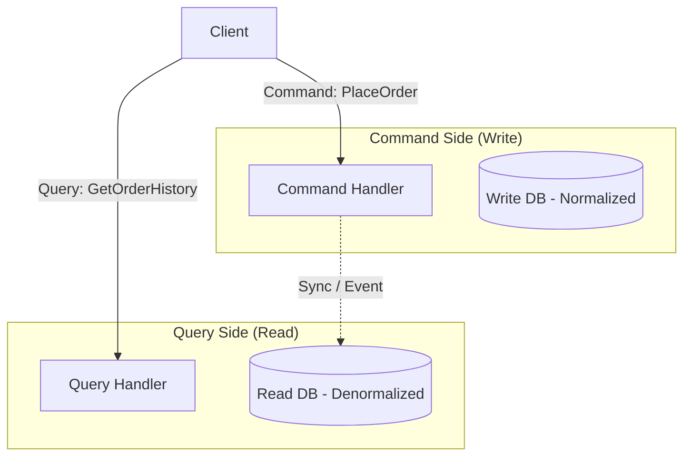

### Problem It Solves

Applications where **read and write workloads have different shapes and requirements**. In CRUD, a single model is often suboptimal for both reads and writes.

### When to Use

- Read-heavy vs write-heavy workloads differ significantly
- Complex domain logic on writes, simple projections on reads
- Different performance requirements (read latency vs write throughput)
- Teams need to optimize read/write independently
- When combined with Event Sourcing

### When NOT to Use

- Simple CRUD applications
- One-size-fits-all models work well enough
- Small teams that cannot justify dual model maintenance
- Real-time strong consistency requirements between read and write

### Pros

1. **Read/write optimization** — independent schemas optimized for each workload
2. **Performance** — read models can be denormalized, cached, indexed
3. **Scalability** — scale reads and writes independently
4. **Security** — expose different data in read vs write models
5. **Multiple read views** — different projections for different clients
6. **Complex domain handling** — commands can have rich validation

### Cons

1. **Complexity** — maintaining two models doubles surface area
2. **Eventual consistency** — read model lags behind write model
3. **Learning curve** — unfamiliar to CRUD-trained developers
4. **Overkill for CRUD** — unnecessary complexity for simple apps
5. **Synchronization overhead** — keeping read side in sync

### Scalability

- **How it scales:** Write side scales for transactional throughput; read side scales independently with caching, replicas, materialized views
- **Limitations:** Synchronization latency between write and read models

### Trade-offs

| Aspect | CRUD | CQRS |
|--------|------|------|
| Model complexity | Low | High |
| Read performance | Suboptimal | Optimal |
| Write performance | Suboptimal | Optimal |
| Consistency | Strong | Eventual |

### Real-World Examples

- **Microsoft CQRS Journey** — reference implementation
- **Event Store** — CQRS + Event Sourcing native
- **Walmart** — separated inventory reads/writes
- **Amazon** — product catalog: write (inventory) vs read (product page)

### C# / .NET Implementation Example

```csharp
// Write Model (Command side)
public class PlaceOrderCommand : ICommand<OrderResult>
{
    public Guid CustomerId { get; set; }
    public List<OrderItemDto> Items { get; set; }
}

public class PlaceOrderCommandHandler : ICommandHandler<PlaceOrderCommand, OrderResult>
{
    private readonly IWriteRepository<Order> _repository;
    private readonly IEventBus _eventBus;

    public async Task<OrderResult> Handle(PlaceOrderCommand cmd, CancellationToken ct)
    {
        var order = Order.Create(cmd.CustomerId, cmd.Items);
        await _repository.AddAsync(order, ct);
        await _eventBus.PublishAsync(new OrderCreatedEvent(order.Id, order.CustomerId));
        return new OrderResult(order.Id);
    }
}

// Read Model (Query side)
public class GetOrderHistoryQuery : IQuery<OrderHistoryDto>
{
    public Guid CustomerId { get; set; }
    public int Page { get; set; }
}

public class GetOrderHistoryHandler : IQueryHandler<GetOrderHistoryQuery, OrderHistoryDto>
{
    private readonly IReadRepository<OrderView> _repository;

    public async Task<OrderHistoryDto> Handle(GetOrderHistoryQuery q, CancellationToken ct)
    {
        return await _repository.FindAsync(o => o.CustomerId == q.CustomerId, q.Page, ct);
    }
}

// Separate DbContexts
public class WriteDbContext : DbContext
{
    public DbSet<Order> Orders { get; set; }
}

public class ReadDbContext : DbContext
{
    public DbSet<OrderView> OrderViews { get; set; } // denormalized
}
```

### Interview Questions

<details>
<summary><b>Junior</b></summary>

**Q1:** What does CQRS stand for and what is it?

> *Command Query Responsibility Segregation — separating read models from write models in an application.*

**Q2:** What problem does CQRS solve?

> *Single models often cannot optimize for both reads and writes. CQRS allows each side to be optimized independently.*
</details>

<details>
<summary><b>Mid</b></summary>

**Q3:** How do you keep the read model consistent with the write model in CQRS?

> *Typically via events. Write side publishes events; read side consumes and updates projections. This means eventual consistency.*

**Q4:** Is CQRS always eventual consistent? Can it be strongly consistent?

> *Not always. You can use synchronous updates (write updates read in same transaction), but that couples the models. Usually eventual consistency is accepted for the benefits.*
</details>

<details>
<summary><b>Senior</b></summary>

**Q5:** Design a CQRS system for an e-commerce catalog with 1M+ products and 10K writes/sec.

> *Write side: event-driven, sharded by product category. Read side: Elasticsearch for search, Redis for product detail cache. CDC from write DB to read DB via Debezium/Kafka. Materialized views for category pages. Each read model optimized for its specific query pattern.*

**Q6:** When would you use CQRS *without* Event Sourcing?

> *When you just need separate read/write models but do not need the event store. Example: admin writes to normalized DB, public API reads from denormalized cache. No need for full event history.*
</details>

### Common Mistakes

1. **Implementing CQRS for CRUD** — adds complexity without benefit
2. **Using same DB for both models** — defeats the purpose
3. **Exposing commands and queries through same interface**
4. **Forgetting eventual consistency** — designing as if read is always up-to-date

### FAANG-Level Deep Dive

At **Amazon**, the product detail page reads from dozens of services, each with its own read-optimized store. The write path (seller updates) goes through a completely different pipeline. This is CQRS at extreme scale. **Netflix** uses CQRS for viewing history: write path records every second of viewing with high throughput, read path serves summaries with low latency. The key is **you do not need a framework** — CQRS is a design principle, not a tool.

---

## 6. Event Sourcing

### What It Is

A pattern where **state changes are stored as an append-only event log**, rather than current state. The current state is derived by replaying events. The event store is the source of truth.

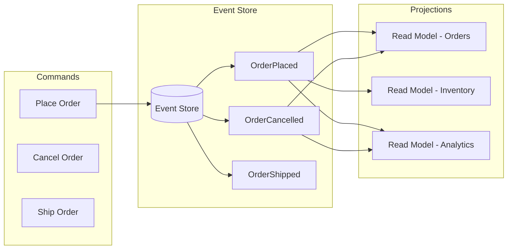

### Problem It Solves

Traditional CRUD loses historical state — you know current state but not *how* you got there. Event Sourcing captures every state change as an immutable event.

### When to Use

- Need complete audit trail (finance, compliance, healthcare)
- Temporal queries ("what was the state at time T?")
- Complex domain where state transitions matter
- When combining with CQRS
- Event-driven debugging (replay events to reproduce issues)

### When NOT to Use

- Simple CRUD applications
- Data that changes frequently and history is irrelevant
- Systems that need to delete data (GDPR right to erasure challenges)
- When current state is all you care about
- Teams unfamiliar with the pattern (steep learning curve)

### Pros

1. **Complete audit trail** — every state change recorded
2. **Temporal queries** — reconstruct state at any point in time
3. **Debugging** — replay events to reproduce bugs
4. **Flexible projections** — build any read model from events
5. **Event-driven** — naturally integrates with event-driven systems
6. **No O/R impedance mismatch** — events map well to domain

### Cons

1. **Event store complexity** — specialized infrastructure needed
2. **Snapshotting required** — replaying all events is slow
3. **Schema evolution** — events must be versioned carefully
4. **GDPR compliance** — hard to delete data (immutable log)
5. **Learning curve** — developers think in state, not events
6. **Event versioning** — as events evolve, backward compatibility is hard

### Scalability

- **How it scales:** Append-only writes are fast. Shard by aggregate ID. Projections consume asynchronously
- **Limitations:** Snapshots needed for aggregates with many events. Reconstructing state for read-heavy workloads requires efficient projections

### Trade-offs

| Aspect | CRUD | Event Sourcing |
|--------|------|----------------|
| History | Lost | Complete |
| Debugging | Hard | Easy (replay) |
| Complexity | Low | High |
| Write perf | Good | Excellent (append) |
| Read perf | Excellent | Requires projections |

### Real-World Examples

- **Event Store** — built on Event Sourcing
- **Banking systems** — every transaction is an event
- **Git** — event-sourced version control
- **Kafka** — itself event-sourced (log is the source of truth)
- **LMAX Exchange** — built on Event Sourcing + Disruptor

### C# / .NET Implementation Example

```csharp
// Domain Aggregate
public class OrderAggregate
{
    public Guid Id { get; private set; }
    public OrderState State { get; private set; }
    public decimal Total { get; private set; }
    public List<OrderItem> Items { get; private set; } = new();
    private List<object> _uncommittedEvents = new();
    public IReadOnlyList<object> UncommittedEvents => _uncommittedEvents;

    public static OrderAggregate Create(Guid customerId, List<OrderItem> items)
    {
        var aggregate = new OrderAggregate();
        aggregate.Apply(new OrderPlacedEvent(
            Guid.NewGuid(), customerId, items, items.Sum(i => i.Price * i.Quantity)));
        return aggregate;
    }

    public void Cancel(string reason)
    {
        EnsureState(OrderState.Placed);
        Apply(new OrderCancelledEvent(Id, reason));
    }

    private void Apply(object @event)
    {
        When(@event);
        _uncommittedEvents.Add(@event);
    }

    private void When(object @event)
    {
        switch (@event)
        {
            case OrderPlacedEvent e:
                Id = e.OrderId; State = OrderState.Placed;
                Items = e.Items; Total = e.Total; break;
            case OrderCancelledEvent e:
                State = OrderState.Cancelled; break;
        }
    }

    public void LoadFromHistory(IEnumerable<object> history)
    {
        foreach (var @event in history) When(@event);
    }
}
```

### Interview Questions

<details>
<summary><b>Junior</b></summary>

**Q1:** What is Event Sourcing?

> *Storing state changes as an append-only event log. Current state is derived by replaying events.*

**Q2:** How is Event Sourcing different from storing current state?

> *CRUD stores current state and loses history. Event Sourcing stores every state change, enabling full audit trail and temporal queries.*
</details>

<details>
<summary><b>Mid</b></summary>

**Q3:** Why do we need snapshots in Event Sourcing?

> *Replaying all events for an aggregate is slow with many events. Snapshots store the aggregate state at a point in time, so only events after the snapshot need to be replayed.*

**Q4:** How do you handle event schema versioning?

> *Use a Schema Registry. Events should be backward-compatible (new optional fields). Use upcasting to migrate old events. Consider using Protobuf or Avro for schema enforcement.*
</details>

<details>
<summary><b>Senior</b></summary>

**Q5:** Design an Event Sourcing system for a banking application handling millions of transactions daily.

> *Shard by account ID. Snapshot every N events (e.g., 100). Snapshot stored in separate table, loaded first. Events after snapshot replayed. For projections, use Kafka + Kafka Streams for real-time materialized views. Consider EventStoreDB for production. Handle concurrency via expected version checks (optimistic concurrency).*

**Q6:** How does Event Sourcing interact with GDPR right to erasure?

> *Challenge: events are immutable. Solutions: (1) Encrypt PII in events — delete key to make unreadable. (2) Anonymize events (replace PII with hash). (3) Use pointer events (store PII elsewhere, reference by ID — delete reference). (4) Tombstone events (append "forget" event).*
</details>

### Common Mistakes

1. **No snapshots** — performance death for aggregates with thousands of events
2. **Storing domain events in a relational table like a log** — use a proper event store
3. **Not versioning events** — breaking serialization compatibility
4. **Leaking infrastructure into domain events** — events should be business facts
5. **Forgetting schema evolution** — events live forever; plan for change

### FAANG-Level Deep Dive

**LMAX** built the highest-throughput trading platform using Event Sourcing + Disruptor (in-memory ring buffer). They process 6M+ events/sec on a single thread. Key insight: **append-only is the fastest write pattern**. At **Uber**, the Schemaless datastore has event-sourcing characteristics. The FAANG consensus: Event Sourcing is excellent for **core transactional domains** (orders, payments, ledgers) but overkill for **content management** (catalog, profiles). Always pair with CQRS.

---

## 7. Clean Architecture (Robert C. Martin)

### What It Is

An architecture that enforces a **dependency rule**: dependencies point inward. The innermost circle contains enterprise business rules; outer layers contain frameworks, UI, and infrastructure.

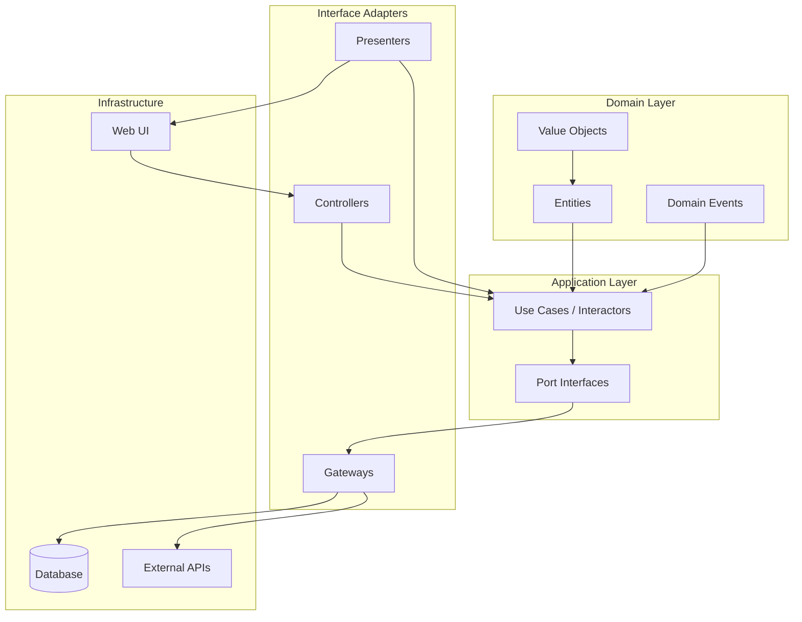

### Problem It Solves

**Framework coupling** — traditional applications are deeply coupled to frameworks (ASP.NET, EF Core), making them hard to test, evolve, or port.

### When to Use

- Long-lived applications that need to survive framework changes
- Complex business logic that should be independent of infrastructure
- Teams practicing TDD (frameworks are hard to mock without abstraction)
- Enterprise applications with strict testing requirements

### When NOT to Use

- Simple CRUD apps (over-engineering)
- Rapid prototyping / MVPs
- Small applications with simple logic
- When framework lock-in is acceptable (e.g., short-lived app)

### Pros

1. **Framework independence** — swap frameworks without changing business logic
2. **Testability** — business logic tests without infrastructure
3. **Separation of concerns** — clear layer responsibilities
4. **Dependency inversion** — high-level modules do not depend on low-level modules
5. **Use case centric** — business workflows are explicit
6. **Long-term maintainability** — adapts to technology changes

### Cons

1. **Boilerplate** — many interfaces and abstractions
2. **Complexity** — more files and indirection
3. **Learning curve** — team must understand the architecture
4. **Over-engineering risk** — inappropriate for simple apps
5. **Circular references risk** — if dependency rule is violated

### Scalability

- **How it scales:** The architecture does not dictate scaling. The clear separation makes it easier to extract performance-critical paths into separate services
- **Limitations:** Cannot overcome fundamental scaling limits; layer indirection adds negligible overhead

### Trade-offs

| Aspect | Clean Architecture | Traditional N-Layer |
|--------|-------------------|---------------------|
| Framework coupling | Minimal | Deeply coupled |
| Testability | Excellent | Poor |
| Dev speed (start) | Slower | Faster |
| Long-term velocity | Faster maintenance | Slower maintenance |

### Real-World Examples

- **Any complex enterprise .NET app** — Clean Architecture is very popular in .NET ecosystem
- **eShopOnContainers** (Microsoft reference app) — Clean Architecture-style
- **Various fintech apps** — where business logic must be framework-independent

### C# / .NET Implementation Example

```csharp
// ---- Domain Layer (innermost) ----
public class Order
{
    public Guid Id { get; }
    public OrderStatus Status { get; private set; }
    private readonly List<OrderItem> _items = new();
    public IReadOnlyList<OrderItem> Items => _items;

    public void AddItem(Product product, int quantity)
    {
        if (quantity <= 0) throw new DomainException("Quantity must be positive");
        _items.Add(new OrderItem(product, quantity));
    }
    public decimal TotalPrice => _items.Sum(i => i.TotalPrice);
}

// ---- Application Layer ----
public class PlaceOrderUseCase : IUseCase<PlaceOrderRequest, OrderResponse>
{
    private readonly IOrderRepository _repository;
    private readonly IUnitOfWork _unitOfWork;

    public async Task<OrderResponse> ExecuteAsync(PlaceOrderRequest request)
    {
        var order = new Order();
        foreach (var item in request.Items)
        {
            var product = await _repository.GetProductAsync(item.ProductId);
            order.AddItem(product, item.Quantity);
        }
        await _repository.SaveAsync(order);
        await _unitOfWork.CommitAsync();
        return new OrderResponse(order.Id);
    }
}

// ---- Interface Adapters ----
[ApiController, Route("orders")]
public class OrderController : ControllerBase
{
    private readonly IUseCase<PlaceOrderRequest, OrderResponse> _useCase;

    [HttpPost]
    public async Task<IActionResult> PlaceOrder(PlaceOrderRequest request)
    {
        var response = await _useCase.ExecuteAsync(request);
        return Ok(response);
    }
}
```

### Interview Questions

<details>
<summary><b>Junior</b></summary>

**Q1:** What is the Dependency Rule in Clean Architecture?

> *Source code dependencies can only point inward. Nothing in an inner circle can know about something in an outer circle.*

**Q2:** Name the four layers from innermost to outermost.

> *Entities (Domain), Use Cases (Application), Interface Adapters, Frameworks & Drivers.*
</details>

<details>
<summary><b>Mid</b></summary>

**Q3:** How does Clean Architecture achieve framework independence?

> *Frameworks are in the outermost layer. Inner layers define interfaces (ports) that outer layers implement. Dependency Injection wires everything at composition root.*

**Q4:** Difference between Clean Architecture and N-Layer?

> *N-Layer depends top-down (UI -> BL -> DAL). Clean Architecture inverts this — domain is isolated from infrastructure.*
</details>

<details>
<summary><b>Senior</b></summary>

**Q5:** Team complains Clean Architecture is "too much ceremony." How do you convince them?

> *Show testability benefits. Demonstrate swapping a database provider in 2 hours vs 2 weeks. Use a vertical slice approach to reduce ceremony. Show long-term velocity data from other teams.*

**Q6:** How would you structure a Clean Architecture solution in .NET to avoid massive solution files?

> *Use feature folders within layers. Consider modular monolith approach — each module has its own Clean Architecture layers. Use source generators to reduce boilerplate.*
</details>

### Common Mistakes

1. **Leaking EF Core references into domain layer** — domain should have NO dependency on infrastructure
2. **Over-abstracting** — interfaces for everything, even when there is only one implementation
3. **Anemic domain model** — entities with no behavior (just getters/setters)
4. **Circular dependencies** — outer layers injecting into inner layers
5. **Ignoring the Composition Root** — wiring dependencies throughout the app instead of one place

### FAANG-Level Deep Dive

**Uncle Bob** formalized Clean Architecture. At **Google**, they do not use Clean Architecture by name but enforce strict directory visibility rules (BUILD files) that achieve similar results. The **real FAANG lesson**: the specific architecture name matters less than the **dependency inversion principle**. Every FAANG has systems where domain logic is cleanly separated from infrastructure. **Testability is the true driver** — if you cannot unit test your business logic without infrastructure, your architecture is flawed.

---

## 8. Onion Architecture

### What It Is

A layered architecture with the **domain model at the center**, surrounded by application, infrastructure, and persistence layers. Dependencies point inward, similar to Clean Architecture.

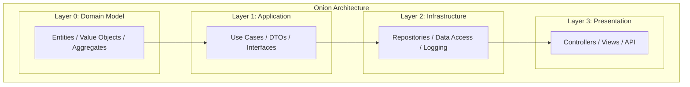

### Problem It Solves

Same as Clean Architecture — **framework and infrastructure coupling** — but with a specific emphasis on the domain model being the absolute center.

### When to Use

- Enterprise applications with rich domain logic
- Systems needing long-term maintainability
- Teams familiar with DDD (Onion pairs naturally with DDD)
- When you want clear separation between domain, application, and infrastructure

### When NOT to Use

- Simple CRUD applications
- When rapid prototyping trumps maintainability
- Small teams without DDD/architecture discipline
- Serverless functions (FaaS) where simplicity is paramount

### Pros

1. **Domain-centric** — business logic is the core, technology is peripheral
2. **Testability** — domain and application layers testable without infrastructure
3. **Dependency inversion** — infrastructure depends on application (not vice versa)
4. **Flexible infrastructure** — swap DB, messaging, etc. without domain changes
5. **Clear separation** — each layer has distinct responsibility
6. **DDD-friendly** — natural fit for aggregates, repositories, domain events

### Cons

1. **Boilerplate** — many interfaces and abstractions
2. **Learning curve** — developers must understand the architecture
3. **Initial productivity hit** — slower to build initially
4. **Not for simple apps** — over-engineering risk
5. **Can lead to layer caching** — data passed through multiple layers

### Scalability

- **How it scales:** Same as Clean Architecture. The architecture does not limit scaling; clear separation makes extraction to microservices cleaner
- **Limitations:** Not a scalability pattern per se; the clean separation can introduce minor overhead

### Real-World Examples

- **Microsoft eShopOnContainers** — uses Onion-like architecture
- **Jet.com (Walmart Labs)** — used Onion Architecture
- Many **financial services** applications

### C# / .NET Implementation Example

```csharp
// ---- Core / Domain ----
public class Product
{
    public Guid Id { get; }
    public string Name { get; private set; }
    public Money Price { get; private set; }
    public void UpdatePrice(Money newPrice)
    {
        if (newPrice.Amount <= 0) throw new DomainException("Price must be positive");
        Price = newPrice;
    }
}

// ---- Application Layer ----
public interface IProductRepository
{
    Task<Product> GetByIdAsync(Guid id);
    Task SaveAsync(Product product);
}

public class UpdateProductPriceUseCase
{
    private readonly IProductRepository _repository;
    private readonly IUnitOfWork _unitOfWork;

    public async Task ExecuteAsync(Guid productId, Money newPrice)
    {
        var product = await _repository.GetByIdAsync(productId);
        product.UpdatePrice(newPrice);
        await _repository.SaveAsync(product);
        await _unitOfWork.CommitAsync();
    }
}

// ---- Infrastructure / Persistence ----
public class EfProductRepository : IProductRepository
{
    private readonly AppDbContext _context;
    public async Task<Product> GetByIdAsync(Guid id) { /* EF Core implementation */ }
    public async Task SaveAsync(Product product) { /* EF Core implementation */ }
}
```

### Interview Questions

<details>
<summary><b>Junior</b></summary>

**Q1:** What is the Onion Architecture?

> *An architecture with the domain model at the center, surrounded by application, infrastructure, and presentation layers. Dependencies point inward.*

**Q2:** How does Onion differ from traditional layered architecture?

> *Traditional layers depend top-down (UI->BL->DAL). Onion inverts this — domain and application define interfaces; infrastructure implements them.*
</details>

<details>
<summary><b>Mid</b></summary>

**Q3:** Which layers should define interfaces for external dependencies?

> *The Application layer defines the interface. The Infrastructure layer implements it. This keeps domain and application free of infrastructure concerns.*

**Q4:** How do you handle cross-cutting concerns (logging, auth) in Onion Architecture?

> *Use decorators or middleware. Logging in Infrastructure layer via DI decoration. Auth is a use case concern (application layer).*
</details>

<details>
<summary><b>Senior</b></summary>

**Q5:** Your Onion Architecture app is slow due to mapping between layers. How do you optimize?

> *Use AutoMapper or source-generated mappers. Consider using same objects across layers if it does not violate boundaries. For hot paths, manual mapping is fastest.*

**Q6:** How does Onion Architecture support eventual microservices extraction?

> *Each bounded context is already isolated in its own module with clear interfaces. Extracting to a microservice: move module to its own project, replace in-process calls with HTTP/messaging, split data store.*
</details>

### Common Mistakes

1. **Putting interfaces in the wrong layer** — infrastructure interfaces defined in application layer
2. **Mapping everywhere** — over-mapping creates performance and maintenance issues
3. **Anemic domain model** — domain entities without behavior
4. **Layer skipping** — presentation directly accessing infrastructure

### FAANG-Level Deep Dive

The **Onion Architecture** was formalized by **Jeffrey Palermo** as a .NET-specific answer to domain-centric design. At **Microsoft**, many internal LOB applications use this pattern. The insight: it is essentially **Clean Architecture with a .NET accent**. FAANG companies do not debate Onion vs Clean — they debate **service boundaries** and **dependency management**. The specific layering scheme is less important than the **Dependency Inversion Principle** that both enforce.

---

## 9. Hexagonal Architecture (Ports & Adapters)

### What It Is

An architecture where the application core is **surrounded by ports** (interfaces) and **adapters** (implementations). Adapters are classified as **driving** (inbound) or **driven** (outbound).

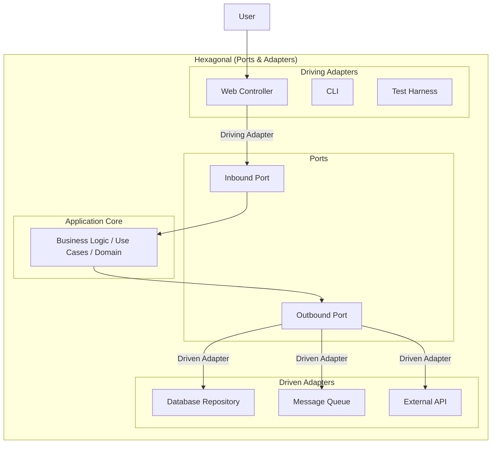

### Problem It Solves

**Technology lock-in and testability.** Traditional applications are tightly coupled to specific technologies. Hexagonal architecture makes the core completely technology-agnostic.

### When to Use

- Complex business logic that should be independent of infrastructure
- Applications needing high testability (business logic tests without infrastructure)
- Systems expected to outlive their initial technology choices
- Multi-channel applications (web, mobile, CLI sharing same core)

### When NOT to Use

- Simple CRUD applications
- Rapid prototyping
- When teams are not comfortable with abstraction layers
- Application where framework lock-in is not a concern

### Pros

1. **Complete isolation of business logic** — core has zero infrastructure dependencies
2. **Superior testability** — test core with mock adapters; no infrastructure setup
3. **Technology flexibility** — swap adapters (e.g., SQL to NoSQL) without touching core
4. **Multi-channel support** — driving adapters for web, CLI, API, tests
5. **Clear boundaries** — ports define explicit contracts
6. **Parallel development** — core and adapters can be built independently

### Cons

1. **Indirection** — many interfaces and abstractions
2. **Initial setup cost** — more upfront design
3. **Mapping overhead** — data often mapped between adapter and core formats
4. **Over-engineering risk** — not appropriate for simple apps
5. **Team buy-in required** — everyone must respect boundaries

### Scalability

- **How it scales:** Not a scalability pattern. The decoupling makes it easier to extract performance-critical paths into separate services
- **Limitations:** The abstraction layer may introduce minor overhead (usually negligible)

### Trade-offs

| Aspect | Hexagonal | Traditional Layered |
|--------|-----------|---------------------|
| Business logic isolation | ? Complete | ? Leaks |
| Testability | ? Excellent | ? Needs infra |
| Tech flexibility | ? High | ? Low |
| Dev speed (start) | ? Slower | ? Faster |

### Real-World Examples

- **ASP.NET Core** — naturally supports hexagonal via DI and middleware
- **Various fintech apps** — where business logic must be rigorously tested

### C# / .NET Implementation Example

```csharp
// ---- Application Core (no external dependencies) ----

// Inbound Port
public interface IOrderService
{
    Task<OrderResult> PlaceOrderAsync(PlaceOrderRequest request);
}

// Outbound Ports
public interface IOrderRepository
{
    Task<Order> GetByIdAsync(Guid id);
    Task SaveAsync(Order order);
}
public interface IPaymentGateway
{
    Task<PaymentResult> ChargeAsync(decimal amount, string currency);
}

// Core Business Logic
public class OrderService : IOrderService
{
    private readonly IOrderRepository _repository;
    private readonly IPaymentGateway _paymentGateway;

    public async Task<OrderResult> PlaceOrderAsync(PlaceOrderRequest request)
    {
        var order = new Order(request.CustomerId, request.Total);
        var payment = await _paymentGateway.ChargeAsync(order.Total, "USD");
        if (!payment.Success) throw new PaymentFailedException(payment.ErrorMessage);
        order.MarkAsPaid(payment.TransactionId);
        await _repository.SaveAsync(order);
        return new OrderResult(order.Id, payment.TransactionId);
    }
}

// ---- Driven Adapters ----
public class EfOrderRepository : IOrderRepository { /* ... */ }
public class StripePaymentGateway : IPaymentGateway { /* ... */ }

// ---- Driving Adapters ----
[ApiController, Route("api/orders")]
public class OrderController : ControllerBase
{
    private readonly IOrderService _orderService;
    [HttpPost]
    public async Task<IActionResult> PlaceOrder(PlaceOrderRequest request)
    {
        var result = await _orderService.PlaceOrderAsync(request);
        return Ok(result);
    }
}
```

### Interview Questions

<details>
<summary><b>Junior</b></summary>

**Q1:** What is a "port" in Hexagonal Architecture?

> *A port is an interface that defines how the core interacts with the outside world. Inbound ports receive calls, outbound ports make calls.*

**Q2:** Difference between driving and driven adapters?

> *Driving adapters initiate communication with the core (controllers, CLI). Driven adapters are called by the core (database repositories, message queues).*
</details>

<details>
<summary><b>Mid</b></summary>

**Q3:** How does Hexagonal Architecture improve testability?

> *The core depends only on interfaces. In tests, you provide mock/stub implementations. Tests run without database, HTTP, or any infrastructure.*

**Q4:** Can Hexagonal be combined with Clean Architecture?

> *They are essentially the same idea. Clean Architecture has 4 layers; Hexagonal has 3 zones (core, ports, adapters). Both follow the dependency rule.*
</details>

<details>
<summary><b>Senior</b></summary>

**Q5:** You need to add caching to an existing Hexagonal application. Where does the cache adapter go?

> *Cache can be a driven adapter that wraps the repository. Implement CachedRepository (decorator) implementing IRepository. No core changes needed.*

**Q6:** How to design a Hexagonal system where the same core serves a web API and a message-processing pipeline?

> *Two driving adapters (WebController and MessageHandler). Both inject the same inbound port(s). Core is technology-agnostic.*
</details>

### Common Mistakes

1. **Putting business logic in adapters** — adapters should only translate
2. **Port explosion** — too many fine-grained ports
3. **No domain model** — using same DTOs in core as in adapters
4. **Leaking infrastructure into ports** — e.g., HttpContext in a port interface

### FAANG-Level Deep Dive

**Alistair Cockburn** created Hexagonal Architecture in 2005. At **ThoughtWorks**, it became a standard recommendation for enterprise .NET/Java projects. FAANG does not name it directly but practices it: **every Google service has a clean core with gRPC ports and backend adapters**. The true value is **test-driven development** — you can write tests for the core before any adapter exists.

---

## 10. Domain-Driven Design (DDD)

### What It Is

A methodology for modeling complex software that **deeply aligns the software model with the business domain**. Key tactical patterns: bounded contexts, aggregates, value objects, domain events, repositories.

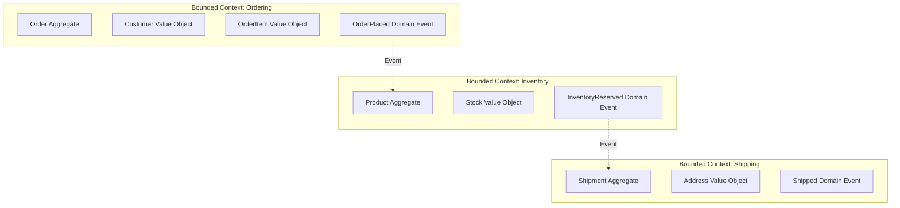

### Problem It Solves

**Complex business logic** that does not fit simple CRUD patterns. Without DDD, business rules leak across layers, become duplicated, and the model does not reflect the business domain.

### When to Use

- Complex business domains with non-trivial rules
- When business experts and developers need a shared language
- Long-lived enterprise applications
- When combined with CQRS, Event Sourcing, or Event-Driven Architecture
- Microservices decomposition (bounded contexts are natural service boundaries)

### When NOT to Use

- Simple CRUD applications (overkill)
- Small applications with straightforward business logic
- Teams without domain expert access
- Startups in heavy discovery mode (domain understanding is premature)

### Pros

1. **Shared understanding** — Ubiquitous Language bridges business and tech
2. **Model aligns with business** — code directly mirrors domain concepts
3. **Bounded contexts** — clear boundaries between subsystems
4. **Rich domain model** — behavior is in the domain, not services
5. **Evolvable** — model can grow with business understanding
6. **Natural service boundaries** — bounded contexts map to microservices

### Cons

1. **Learning curve** — DDD concepts are abstract and take practice
2. **Requires domain experts** — cannot do DDD without business collaboration
3. **Over-engineering risk** — tactical patterns can be misapplied
4. **Infrastructure complexity** — repositories, domain events, etc.
5. **Not for simple apps** — the overhead is not justified

### Key DDD Building Blocks

| Building Block | Description | Example |
|---------------|-------------|---------|
| Entity | Object with identity and lifecycle | `Order` |
| Value Object | Immutable object defined by attributes | `Address`, `Money` |
| Aggregate | Cluster of entities with a root | `Order` + `OrderItems` |
| Domain Event | Something that happened in the domain | `OrderPlaced` |
| Repository | Collection-like access to aggregates | `IOrderRepository` |
| Domain Service | Stateless operation not fitting an entity | `PricingService` |
| Bounded Context | Semantic boundary | `Ordering Context` |

### Real-World Examples

- **Amazon** — each checkout flow is a bounded context
- **Uber** — trip, payment, dispatch are bounded contexts
- **HSBC, Goldman Sachs** — DDD for trading systems

### C# / .NET Implementation Example

```csharp
// ---- Value Object ----
public sealed record Money(decimal Amount, string Currency)
{
    public Money Add(Money other)
    {
        if (Currency != other.Currency)
            throw new DomainException("Currency mismatch");
        return this with { Amount = Amount + other.Amount };
    }
}

// ---- Aggregate Root ----
public class Order : AggregateRoot
{
    private readonly List<OrderItem> _items = new();
    public Guid Id { get; private set; }
    public Guid CustomerId { get; private set; }
    public IReadOnlyList<OrderItem> Items => _items.AsReadOnly();
    public Money Total { get; private set; }
    public OrderStatus Status { get; private set; }

    public static Order Create(Guid customerId, List<(ProductId, int qty, Money price)> items)
    {
        var order = new Order { Id = Guid.NewGuid(), CustomerId = customerId, Status = OrderStatus.Pending };
        foreach (var (productId, quantity, price) in items)
            order._items.Add(new OrderItem(productId, quantity, price));
        order.Total = order._items.Select(i => i.Price.Multiply(i.Quantity)).Aggregate((a, b) => a.Add(b));
        order.AddDomainEvent(new OrderPlacedEvent(order.Id, order.CustomerId, order.Total));
        return order;
    }

    public void MarkAsPaid(string transactionId)
    {
        if (Status != OrderStatus.Pending) throw new DomainException("Can only mark pending orders as paid");
        Status = OrderStatus.Paid;
        AddDomainEvent(new OrderPaidEvent(Id, transactionId));
    }
}
```

### Interview Questions

<details>
<summary><b>Junior</b></summary>

**Q1:** What is a Bounded Context?

> *A semantic boundary within which a particular domain model applies. Inside a bounded context, terms have specific meanings.*

**Q2:** Difference between Entity and Value Object?

> *Entities have identity (two Orders are different). Value Objects are defined by attributes (two Addresses with same values are equal). VOs are immutable.*
</details>

<details>
<summary><b>Mid</b></summary>

**Q3:** What is an Aggregate and why is it important?

> *A cluster of domain objects treated as a unit. The Aggregate Root ensures consistency. External references only go to the root. Defines transaction boundaries.*

**Q4:** How do you handle communication between Bounded Contexts?

> *Via Domain Events (async), anti-corruption layer (translate models), or shared kernel (minimal shared model). Integration events for cross-context communication.*
</details>

<details>
<summary><b>Senior</b></summary>

**Q5:** How do you determine Aggregate boundaries? Walk through your process.

> *(1) Event Storming with domain experts. (2) Identify business invariants. (3) Design aggregates around consistency boundaries. (4) Rule of thumb: access from aggregate root only. (5) Keep aggregates small — reference other aggregates by ID. (6) Validate with business scenarios.*

**Q6:** Your team has an Anemic Domain Model. How do you migrate to a Rich Domain Model?

> *Incremental: (1) Identify bounded contexts. (2) Pick one context. (3) Move validation into entities. (4) Encapsulate collections. (5) Move behavior from services to entities. (6) Add domain events. (7) Repeat. Use characterization tests to prevent regressions.*
</details>

### Common Mistakes

1. **Anemic Domain Model** — entities without behavior, all logic in services
2. **Over-sized aggregates** — trying to root the entire database
3. **Infrastructure leak** — EF Core attributes in domain model
4. **Not involving domain experts** — DDD requires business collaboration
5. **Over-engineering** — tactical patterns applied where strategic DDD suffices

### FAANG-Level Deep Dive

**Eric Evans** wrote the "Blue Book" in 2003. At **Amazon**, DDD is implicitly practiced through the API mandate — each team owns a bounded context exposed via APIs. **Uber** explicitly uses DDD for their dispatch system. The FAANG pattern: **Strategic DDD** (mapping bounded contexts) is universally valuable. **Tactical DDD** (aggregates, repositories) is applied where complexity warrants it. **Event Storming** (Alberto Brandolini) is the preferred workshop format for discovering DDD models at scale.

---

## 11. Saga Pattern

### What It Is

A pattern for managing **distributed transactions** across multiple services. A saga is a sequence of local transactions where each step publishes an event that triggers the next step. If a step fails, **compensating transactions** undo previous steps.

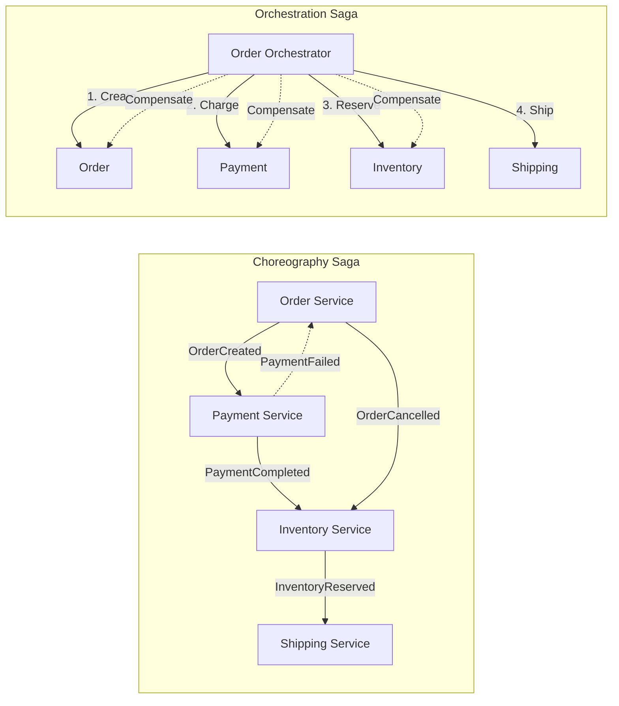

### Problem It Solves

**ACID transactions do not work across microservices** (they would require distributed locking, 2PC, which does not scale). Sagas provide data consistency without distributed transactions.

### When to Use

- Multi-service workflows that need consistency guarantees
- Systems that can accept eventual consistency
- E-commerce (order -> payment -> inventory -> shipping workflows)
- Distributed transaction coordination

### When NOT to Use

- Strong immediate consistency required
- Simple single-service workflows
- When compensating transactions are not feasible (e.g., sending email)
- Small systems where distributed transactions are not needed

### Pros

1. **No distributed locking** — high scalability
2. **Eventual consistency** — acceptable for most business workflows
3. **Resilience** — partial failures handled gracefully
4. **Flexibility** — choreography (decentralized) or orchestration (centralized)
5. **Observability** — saga state can be tracked
6. **Business alignment** — often mirrors business process flows

### Cons

1. **Complexity** — compensating transactions are non-trivial
2. **Eventual consistency** — inconsistent state windows exist
3. **Debugging difficulty** — tracing saga state across services
4. **Compensating logic** — every transaction needs a compensating action
5. **No isolation** — sagas lack ACID isolation (dirty reads possible)

### Choreography vs Orchestration

| Aspect | Choreography | Orchestration |
|--------|-------------|---------------|
| Coordination | Decentralized (events) | Central coordinator |
| Coupling | Lower | Higher |
| Visibility | Harder to see overall flow | Easy (state machine) |
| Complexity | Higher (event chains) | Lower (centralized) |
| Single point of failure | No | Yes (orchestrator) |
| Best for | Simple 2-3 step flows | Complex multi-step workflows |

### Real-World Examples

- **Amazon** — order fulfillment (choreography)
- **Netflix** — user onboarding, payment flows
- **Uber** — trip lifecycle (orchestration)
- **Airbnb** — booking flow (orchestration)

### C# / .NET Implementation Example

```csharp
// Orchestration Saga with MassTransit
public class OrderSaga : MassTransitStateMachine<OrderSagaState>
{
    public State? Submitted { get; set; }
    public State? PaymentProcessing { get; set; }
    public State? InventoryReserving { get; set; }
    public State? Completed { get; set; }
    public State? Failed { get; set; }

    public Event<OrderCreated>? OrderCreated { get; set; }
    public Event<PaymentCompleted>? PaymentCompleted { get; set; }
    public Event<PaymentFailed>? PaymentFailed { get; set; }

    public OrderSaga()
    {
        InstanceState(x => x.CurrentState);
        Initially(
            When(OrderCreated)
                .Then(ctx => ctx.Saga.CorrelationId = ctx.Message.OrderId)
                .TransitionTo(PaymentProcessing)
                .Send(new Uri("queue:payment-service"),
                    ctx => new ProcessPayment(ctx.Saga.CorrelationId)));

        During(PaymentProcessing,
            When(PaymentCompleted)
                .TransitionTo(InventoryReserving)
                .Send(new Uri("queue:inventory-service"),
                    ctx => new ReserveInventory(ctx.Saga.CorrelationId)),
            When(PaymentFailed)
                .TransitionTo(Failed));
    }
}

public class OrderSagaState : SagaStateMachineInstance
{
    public Guid CorrelationId { get; set; }
    public string? CurrentState { get; set; }
    public decimal Amount { get; set; }
}
```

### Interview Questions

<details>
<summary><b>Junior</b></summary>

**Q1:** What problem does the Saga pattern solve?

> *Distributed transactions. ACID does not work across microservices, so sagas provide consistency via local transactions + compensating actions.*

**Q2:** What is a compensating transaction?

> *An operation that undoes a previous transaction. E.g., refund a payment if inventory reservation fails.*
</details>

<details>
<summary><b>Mid</b></summary>

**Q3:** Compare choreography vs orchestration sagas.

> *Choreography: services react to events (low coupling, hard to track). Best for simple flows. Orchestration: central coordinator (state machine, SPOF). Best for complex workflows.*

**Q4:** What happens if the orchestrator crashes mid-saga?

> *Saga state is persisted. On restart, the orchestrator resumes from last known state. Use a durable saga store (database, event store).*
</details>

<details>
<summary><b>Senior</b></summary>

**Q5:** Design a saga for an airline booking system (flight, hotel, car — all or nothing).

> *Orchestration saga: (1) Create reservation hold. (2) Book flight. (3) Book hotel (failure -> rollback flight). (4) Book car (failure -> rollback hotel, flight). Use timeout on holds. Compensating: cancel, refund. Idempotency keys. Saga state in durable store.*

**Q6:** How do you handle the lack of isolation in sagas (dirty read problem)?

> *Countermeasures: (1) Semantic lock — mark record as "in saga". (2) Commutative updates — order independent. (3) Pivot transactions — accept intermediate states. (4) Reread before write — verify state at each step.*
</details>

### Common Mistakes

1. **No compensating transactions** — every step must have an undo
2. **Non-idempotent handlers** — retries cause duplicate effects
3. **Coordination logic in services** — choreography can create spaghetti
4. **Forgetting timeout handling** — sagas can stall indefinitely
5. **Ignoring the lost message problem** — use transactional outbox

### FAANG-Level Deep Dive

At **Amazon**, sagas run at massive scale for order fulfillment. Their Fulfillment Orchestration system coordinates dozens of services. Key insight: **accept eventual consistency at the business level**. **Netflix** runs payment sagas for billing. The most important FAANG lesson: **design compensating transactions as first-class business operations**, not technical afterthoughts.

---

## 12. Strangler Fig Pattern

### What It Is

A pattern for **incrementally migrating** a monolithic application to microservices by gradually replacing pieces with new services, routing traffic appropriately, and eventually removing the old code.

```mermaid
graph TB
    subgraph "Phase 1: Monolith with Strangler"
        Router[Routing Proxy]
        Mono[Monolith]
        NewSvc1[New Service - Orders]
        NewSvc2[New Service - Payments]
        Client --> Router
        Router -.->|Legacy Path| Mono
        Router -.->|New Path| NewSvc1
        Router -.->|New Path| NewSvc2
    end
    subgraph "Phase 2: Transition"
        Mono2[Monolith (shrinking)]
        NewSvc3[Orders Service]
        NewSvc4[Payments Service]
    end
    subgraph "Phase 3: Complete"
        NewSvc5[Orders Service]
        NewSvc6[Payments Service]
        NewSvc7[Shipping Service]
    end
```

### Problem It Solves

**Risk of big-bang rewrites.** Replacing a monolith with microservices in one go is extremely risky. The Strangler Fig allows incremental, low-risk migration.

### When to Use

- Migrating an existing monolith to microservices
- When a big-bang rewrite is too risky
- Need to deliver value incrementally during migration
- Legacy systems that cannot be replaced all at once

### When NOT to Use

- Small applications (just rewrite)
- When monolith is intentionally staying (no migration goal)
- When monolith changes need coordination with new services (too coupled)

### Pros

1. **Low risk** — incremental migration; rollback any feature
2. **Continuous delivery** — ship value during migration
3. **Learn as you go** — apply lessons from first migrations to subsequent ones
4. **Coexistence** — old and new systems run in parallel
5. **No big-bang release** — no single cutover risk event
6. **Testing in production** — compare old and new results

### Cons

1. **Routing complexity** — proxy/API gateway configuration complexity
2. **Data split complexity** — separating monolith database is hard
3. **Latency** — requests may traverse both old and new systems
4. **Incremental cost** — running both systems simultaneously costs more
5. **Feature parity pressure** — convincing stakeholders to fund migration alongside new features

### Scalability

- **How it scales:** Each extracted service can be scaled independently. The proxy/gateway routes to appropriate instances
- **Limitations:** Stuck monolith components may still bottleneck overall system

### Real-World Examples

- **Amazon** — migrated from monolith to services via Strangler Fig
- **Netflix** — incremental migration from data center to AWS
- **Uber** — migrated from monolith to 2200+ services

### C# / .NET Implementation Example

```csharp
// API Gateway with YARP reverse proxy
var builder = WebApplication.CreateBuilder(args);
builder.Services.AddReverseProxy()
    .LoadFromConfig(builder.Configuration.GetSection("ReverseProxy"));

// appsettings.json: route traffic to monolith or new service
{
  "ReverseProxy": {
    "Routes": {
      "legacy-orders": {
        "ClusterId": "monolith",
        "Match": { "Path": "/api/orders/{**catch-all}" }
      },
      "new-orders": {
        "ClusterId": "order-service",
        "Match": { "Path": "/api/orders/v2/{**catch-all}" }
      }
    },
    "Clusters": {
      "monolith": {
        "Destinations": {
          "m1": { "Address": "http://monolith:5000/" }
        }
      },
      "order-service": {
        "Destinations": {
          "s1": { "Address": "http://order-service:5001/" }
        }
      }
    }
  }
}
```

### Interview Questions

<details>
<summary><b>Junior</b></summary>

**Q1:** What is the Strangler Fig pattern?

> *Incrementally replace a monolith with microservices by gradually extracting pieces. Named after a fig plant that grows around and replaces a host tree.*

**Q2:** Why not just rewrite the monolith from scratch?

> *Big-bang rewrites are risky, take too long, and often fail. Strangler Fig delivers incremental value and reduces risk.*
</details>

<details>
<summary><b>Mid</b></summary>

**Q3:** How do you handle database migration in Strangler Fig?

> *Phase 1: monolith owns all data. Phase 2: duplicate data for extracted services (sync via CDC). Phase 3: split database — each service owns its data.*

**Q4:** What is a migration facade?

> *An API gateway or proxy that routes traffic to either the legacy monolith or new services based on feature flag or URL path. Allows gradual rollout.*
</details>

<details>
<summary><b>Senior</b></summary>

**Q5:** You are migrating a 1M LOC monolith. What is your extraction order?

> *(1) Extract services with clear boundaries and low dependencies. (2) Start with read-only services (easier, no write conflicts). (3) Extract services needing independent scaling. (4) Extract frequently changed services. (5) Leave core transaction-heavy services for last. Validate each with canary releases.*

**Q6:** How do you ensure data consistency during migration when data is split?

> *Use Outbox pattern. Monolith writes to DB + outbox. CDC process (Debezium) streams changes to Kafka. New services consume events. Eventually, monolith version is deprecated.*
</details>

### Common Mistakes

1. **Not extracting a complete bounded context** — leaving data/logic in monolith
2. **Shared database** — new services and monolith accessing same DB tables
3. **Long-running feature flag code** — leaving dead code paths indefinitely
4. **Ignoring data consistency** — split data without reconciliation strategy
5. **Too aggressive** — trying to extract everything at once

### FAANG-Level Deep Dive

**Amazon** pioneered this at scale. Their API mandate (2002) forced all teams to communicate via APIs — setting the stage for the Strangler Fig. **Netflix** used it to migrate from a monolith data center to AWS. The critical FAANG insight: **migration is a business process, not a technical project**. Each extraction must deliver measurable business value.

---

## 13. Backend for Frontend (BFF)

### What It Is

A dedicated backend layer for each **client type** (mobile, web, desktop, IoT). Each BFF is optimized for the specific needs of its client — data format, payload size, authentication, etc.

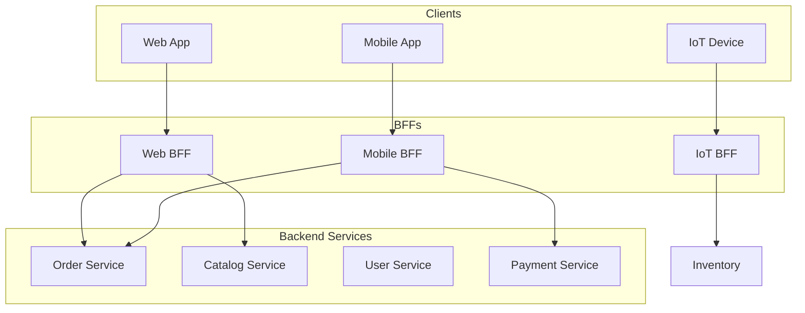

### Problem It Solves

**Generic backend APIs** do not serve all clients equally. A desktop web app needs different data shapes than a mobile app with limited bandwidth.

### When to Use

- Multiple client types (web, mobile, tablet, IoT)
- Clients with different data/performance requirements
- Need for client-specific authentication/authorization
- Reducing mobile data usage (smaller payloads)
- When general-purpose APIs cause chatty mobile clients

### When NOT to Use

- Single client type (web-only application)
- Simple applications where a general API works fine
- When BFF overhead (maintaining multiple BFFs) exceeds benefit
- When GraphQL is a better fit

### Pros

1. **Optimized payloads** — each client gets exactly what it needs
2. **Client-specific logic** — mobile vs web auth, caching, error handling
3. **Backend isolation** — mobile bugs do not affect web and vice versa
4. **Independent evolution** — each BFF can evolve separately
5. **Improved mobile performance** — less data, fewer requests
6. **Security boundaries** — BFF can implement client-specific auth

### Cons

1. **Duplication** — logic may be duplicated across BFFs
2. **Operational overhead** — deploy and maintain multiple services
3. **Consistency challenges** — different BFFs may behave differently
4. **Team coordination** — multiple teams may own BFFs inconsistently
5. **N+1 BFF problem** — too many BFFs if created per feature

### Trade-offs

| Aspect | BFF | General API | GraphQL |
|--------|-----|-------------|---------|
| Payload optimization | ? Best | ? Worst | ? Good |
| Backend complexity | ? Multiple BFFs | ? Single | ? Single |
| Client flexibility | ? Fixed per BFF | ? Fixed | ? Max |
| Caching | ? Easy | ? Easy | ? Hard |

### Real-World Examples

- **SoundCloud** — popularized BFF pattern
- **Netflix** — different BFFs for TV, mobile, web
- **Spotify** — per-platform API layers
- **Shopify** — Storefront API (BFF for mobile/web)

### C# / .NET Implementation Example

```csharp
// Mobile BFF — optimized for low bandwidth
[ApiController, Route("bff/mobile/v1/products")]
public class MobileProductsBffController : ControllerBase
{
    private readonly ICatalogClient _catalog;
    private readonly IInventoryClient _inventory;
    private readonly IPricingClient _pricing;

    [HttpGet("{id}")]
    public async Task<IActionResult> GetProduct(string id)
    {
        var catalogTask = _catalog.GetProductAsync(id);
        var inventoryTask = _inventory.GetStockAsync(id);
        var pricingTask = _pricing.GetPriceAsync(id);
        await Task.WhenAll(catalogTask, inventoryTask, pricingTask);

        return Ok(new MobileProductDto
        {
            Id = catalogTask.Result.Id,
            Name = catalogTask.Result.Name,
            Price = pricingTask.Result.Amount,
            InStock = inventoryTask.Result.Available > 0,
            ImageUrl = catalogTask.Result.ThumbnailUrl
        });
    }
}

// Web BFF — richer payload
[ApiController, Route("bff/web/v1/products")]
public class WebProductsBffController : ControllerBase
{
    [HttpGet("{id}")]
    public async Task<IActionResult> GetProduct(string id)
    {
        var product = await _catalog.GetProductFullAsync(id);
        var reviews = await _reviews.GetReviewsAsync(id);
        return Ok(new WebProductDetailDto { Product = product, Reviews = reviews });
    }
}
```

### Interview Questions

<details>
<summary><b>Junior</b></summary>

**Q1:** What is the BFF pattern?

> *Backend for Frontend — a dedicated backend service per client type, optimized for that clients specific needs.*

**Q2:** Why would a mobile app need a different backend than a web app?

> *Mobile has limited bandwidth, battery, and processing power. A mobile BFF can return smaller payloads, fewer API calls.*
</details>

<details>
<summary><b>Mid</b></summary>

**Q3:** How does BFF differ from API Gateway?

> *API Gateway routes requests to multiple services (generic). BFF is a dedicated backend with client-specific logic, aggregation, and transformation.*

**Q4:** When would you choose GraphQL over BFF?

> *When the number of client views is large and data needs vary per view. GraphQL lets clients specify exact data shapes. BFF is better for client-specific logic.*
</details>

<details>
<summary><b>Senior</b></summary>

**Q5:** You have 5 client types. Each BFF has 30% duplicate logic. How do you reduce duplication?

> *(1) Shared library for cross-cutting concerns. (2) Core service that BFFs call for common aggregations. (3) Consolidate similar BFFs (iOS + Android = mobile BFF). (4) Use composition.*

**Q6:** Design a BFF strategy for a global e-commerce platform with web, mobile, and smart speakers.

> *Web BFF: rich pages, SEO-friendly. Mobile BFF: compact payloads, offline queue. Smart Speaker BFF: voice-optimized, natural language parsing. Each talks to same backend services.*
</details>

### Common Mistakes

1. **One BFF per team/feature** — creates BFF explosion; group by client type
2. **BFF becomes a monolith** — the BFF itself grows unmanageable
3. **Duplicating business logic** — BFFs should only do client-specific work
4. **No clear ownership** — every team BFF becomes everyones problem

### FAANG-Level Deep Dive

**SoundCloud** coined the term BFF in 2015. **Netflix** runs separate BFFs for each device type (TV BFF is very different from mobile BFF). **Spotify** has different backend services for each platform. The FAANG insight: **BFF is a trade-off** — it optimizes for client experience at the cost of backend consistency. Best teams define strict BFF responsibilities (aggregation and transformation only — no business logic).

---

## 14. Sidecar Pattern

### What It Is

A sidecar is a **helper container/process** deployed alongside a service (in the same pod/host). It handles cross-cutting concerns like logging, monitoring, service mesh integration, and configuration, without modifying the main service code.

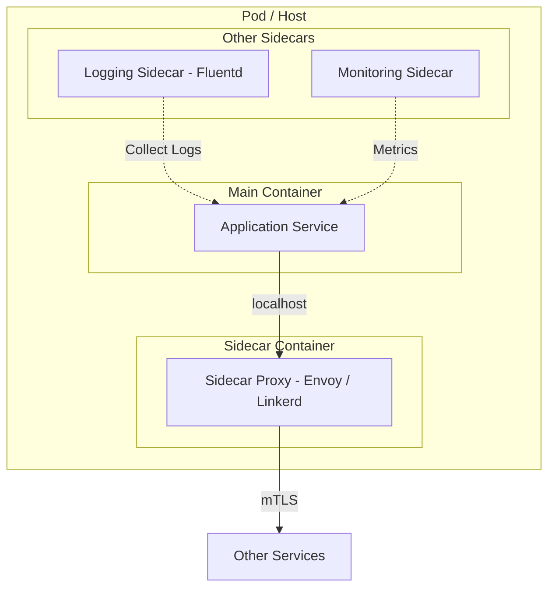

### Problem It Solves

**Cross-cutting concerns** (observability, networking, security) are mixed with business logic or duplicated across services. A sidecar offloads these without changing the service code.

### When to Use

- Kubernetes deployments where every service needs the same infrastructure capabilities
- Service mesh implementations (Istio, Linkerd)
- When you want to upgrade infrastructure capabilities without touching service code
- Heterogeneous services (different languages) needing common infrastructure

### When NOT to Use

- Single-process applications (outside container environments)
- Simple deployments where a library is sufficient
- When latency is critical (sidecar adds hop)
- When sidecar and service resource usage conflicts

### Pros

1. **Separation of concerns** — service code stays clean
2. **Language agnostic** — same sidecar works for Go, Java, C#, Python
3. **Independent lifecycle** — upgrade sidecar without redeploying service
4. **Consistency** — same sidecar configuration across all services
5. **Reusability** — logging, monitoring, auth across services
6. **Transparent upgrades** — update service mesh version without service changes

### Cons

1. **Resource overhead** — each sidecar consumes CPU/memory
2. **Latency** — extra network hop (localhost, but still)
3. **Debugging complexity** — troubleshooting requires understanding sidecar behavior
4. **Operational complexity** — managing many sidecar instances
5. **Configuration complexity** — service mesh configuration is complex

### Scalability

- **How it scales:** Each service instance gets its own sidecar. Scales linearly
- **Limitations:** Resource overhead per sidecar adds up at scale; sidecar startup time increases deployment latency

### Real-World Examples

- **Istio** — Envoy sidecar proxy for service mesh
- **Linkerd** — Rust-based sidecar proxy
- **Netflix Prana** — sidecar for non-JVM services
- **AWS App Mesh** — sidecar for AWS services

### C# / .NET Integration Example

```csharp
// All outbound traffic goes through the sidecar on localhost
var services = new ServiceCollection();
services.AddHttpClient("orders", client =>
{
    client.BaseAddress = new Uri("http://localhost:15001"); // Envoy sidecar
})
.AddHttpMessageHandler<CircuitBreakerHandler>()
.AddHttpMessageHandler<RetryHandler>();

// Health check that also checks sidecar
app.MapHealthChecks("/health", new HealthCheckOptions
{
    Predicate = check => check.Name switch
    {
        "app" => true,
        "sidecar" => true,
        _ => false
    }
});
```

### Interview Questions

<details>
<summary><b>Junior</b></summary>

**Q1:** What is the Sidecar pattern?

> *A helper container/process deployed alongside the main service that handles cross-cutting concerns (networking, logging, monitoring).*

**Q2:** What is a common example of a sidecar?

> *Envoy proxy in Istio service mesh. It handles traffic routing, load balancing, and mTLS without modifying the service code.*
</details>

<details>
<summary><b>Mid</b></summary>

**Q3:** How does a sidecar differ from a shared library?

> *Library: same language, version coupled to service, requires rebuild. Sidecar: language agnostic, independently deployable, no code changes.*

**Q4:** What cross-cutting concerns are typically handled by sidecars?

> *Service discovery, traffic routing, mTLS, circuit breaking, rate limiting, logging, metrics, tracing, configuration injection.*
</details>

<details>
<summary><b>Senior</b></summary>

**Q5:** Sidecar vs library for a new microservices platform — decision framework?

> *Libraries: deep integration needs (metrics instrumentation, context propagation). Sidecars: network-level concerns (traffic routing, mTLS, circuit breaking). Hybrid: library for instrumentation + sidecar for networking.*

**Q6:** What are the resource costs of sidecars at scale (1000 nodes)?

> *Envoy sidecar: ~50MB RAM + ~0.5 CPU per instance. 1000 instances = ~50GB RAM + 500 CPU cores. Factor into cluster capacity planning, startup time, config distribution.*
</details>

### Common Mistakes

1. **Duplicating concerns** — same logic in service and sidecar
2. **Ignoring resource overhead** — sidecars consume significant resources
3. **Using sidecar for business logic** — infrastructure concerns only
4. **Sidecar becoming SPOF** — misconfigured sidecar takes down service
5. **No health checking for sidecar** — service up but sidecar down

### FAANG-Level Deep Dive

**Istio** is the most popular sidecar-based service mesh (Google + IBM + Lyft). At **Google**, sidecars have been standard practice for years. **Netflix Prana** allowed non-JVM services to benefit from Netflix OSS ecosystem. Key insight: **sidecars are about operational consistency**. When every service runs the same Envoy proxy, uniform security, observability, and traffic policies are enforceable across a polyglot architecture.

---

## 15. Ambassador Pattern

### What It Is

An **outbound proxy** that handles cross-cutting concerns for service-to-service communication — circuit breaking, rate limiting, retries, authentication — offloading these concerns from the application.

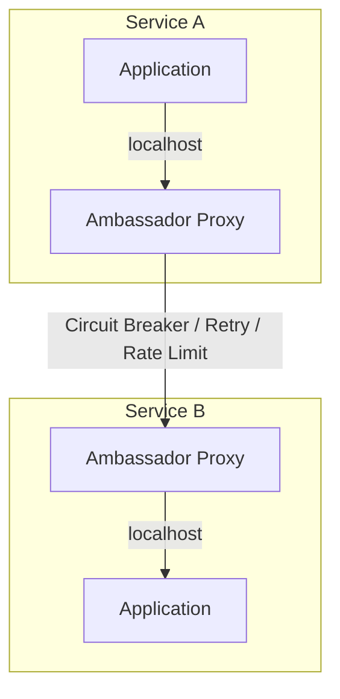

### Problem It Solves

**Repetitive boilerplate** in service-to-service communication. Without an ambassador, every service must implement circuit breakers, retries, timeout handling, and authentication.

### When to Use

- Polyglot environments where implementing resilience in every language is costly
- When you want to upgrade resilience policies without changing service code
- Microservices with complex communication patterns
- When circuit breaker and retry logic is standardized across services

### When NOT to Use

- Single-language ecosystem with good library support
- When latency is extremely critical (ambassador adds hops)
- Simple service communication with minimal cross-cutting concerns

### Pros

1. **Centralized resilience** — circuit breakers, retries, timeouts in one place
2. **Language agnostic** — one solution works for all services
3. **Independent upgrades** — update policies without service changes
4. **Consistent policies** — same retry/backoff strategy everywhere
5. **Observability** — central point for metrics on inter-service calls
6. **Decoupling** — services do not know about network topology

### Cons

1. **Latency** — extra network hop for every outbound call
2. **Resource overhead** — ambassador consumes CPU/memory
3. **Single point of failure risk** — config errors affect all calls
4. **Debugging complexity** — another layer to understand
5. **Configuration complexity** — ambassador rules must be maintained

### Ambassador vs Sidecar

| Aspect | Ambassador | Sidecar |
|--------|------------|---------|
| Direction | Outbound only | Inbound + Outbound |
| Scope | Client-side concerns | Service mesh (full proxy) |
| Complexity | Lower | Higher |
| Latency | One hop | Two hops (in + out) |

### Real-World Examples

- **Envoy** — can be deployed as an ambassador proxy
- **Netflix Zuul** — evolved from API gateway to include ambassador patterns
- **Google gRPC proxy** — ambassador for gRPC traffic

### C# / .NET Integration Example

```yaml
# Envoy config as ambassador (listens on localhost:9001)
static_resources:
  listeners:
  - name: ambassador
    address:
      socket_address: { address: 127.0.0.1, port_value: 9001 }
    filter_chains:
    - filters:
      - name: envoy.filters.network.http_connection_manager
        typed_config:
          "@type": type.googleapis.com/envoy.extensions.filters.network.http_connection_manager.v3.HttpConnectionManager
          route_config:
            name: local_route
            virtual_hosts:
            - name: backend
              domains: ["*"]
              routes:
              - match: { prefix: "/" }
                route:
                  cluster: backend_cluster
                  retry_policy:
                    retry_on: "5xx"
                    num_retries: 3
          http_filters:
          - name: envoy.filters.http.router
  clusters:
  - name: backend_cluster
    connect_timeout: 0.25s
    type: STRICT_DNS
    lb_policy: ROUND_ROBIN
    circuit_breakers:
      thresholds:
        - priority: DEFAULT
          max_connections: 100
          max_requests: 100
```

```csharp
// In the C# service, just call localhost ambassador
var client = new HttpClient { BaseAddress = new Uri("http://localhost:9001") };
// Ambassador handles retries, circuit breaking, etc.
var response = await client.PostAsJsonAsync("/api/orders", request);
```

### Interview Questions

<details>
<summary><b>Junior</b></summary>

**Q1:** What is the Ambassador pattern?

> *An outbound proxy that handles cross-cutting concerns (circuit breaking, retries, rate limiting) for service-to-service communication.*

**Q2:** How is Ambassador different from Sidecar?

> *Ambassador handles outbound traffic only (client side). Sidecar handles both inbound and outbound (full proxy).*
</details>

<details>
<summary><b>Mid</b></summary>

**Q3:** What concerns does an ambassador typically handle?

> *Circuit breaking, retry with backoff, rate limiting, timeout configuration, authentication, metrics collection for outbound calls.*

**Q4:** How do you test the ambassadors retry policy in development?

> *Use a mock/fake service that returns 5xx. Verify ambassador retries expected number of times with correct backoff.*
</details>

<details>
<summary><b>Senior</b></summary>

**Q5:** Design an ambassador-based architecture for a multi-region deployment.

> *Region-local ambassador for same-region calls. Cross-region layer: DNS routing to nearest region. Circuit breaker opens if cross-region latency > threshold. Fallback to local stale data. Use hedge requests (send to two regions, use fastest).*

**Q6:** When would you choose a library over an ambassador for resilience?

> *When latency requirements are extremely strict (<1ms overhead). When deep integration is needed (context propagation, app-aware retry). For most teams, library + ambassador hybrid works best.*
</details>

### Common Mistakes

1. **Running ambassador as a sidecar but calling it ambassador** — ambassador is for outbound
2. **Double retries** — ambassador + application retries = exponential explosion
3. **Ignoring ambassador health** — if ambassador is down, service cannot communicate
4. **Inconsistent configuration** — different versions of rules across services

### FAANG-Level Deep Dive

**Envoy** (from Lyft) is the most popular ambassador implementation. **Netflix** built their own with Hystrix + Zuul. At **Google**, gRPC has built-in retry and timeout policies reducing the need for a separate ambassador. The FAANG insight: **ambassador patterns are most valuable in polyglot environments**. In a pure .NET ecosystem, a NuGet package with Polly (circuit breaker + retry) is simpler.

---

## 16. Repository Pattern

### What It Is

A design pattern that **abstracts data access** behind a collection-like interface. Repositories mediate between the domain model and data mapping.

### Problem It Solves

**Data access coupling** — application code directly coupled to specific data access technology (EF Core, Dapper, ADO.NET). Repository provides a clean abstraction for testing and swapping data sources.

### When to Use

- Domain models that need persistence abstraction
- Unit testing (mock repositories)
- Multiple data source types
- Clean Architecture / Onion / Hexagonal (repository is a standard port)
- Complex querying that you want to centralize

### When NOT to Use

- Simple CRUD where EF Core DbSet already acts as repository
- Small applications where abstraction is not justified
- When ORM already provides the abstraction (EF Core IS a repository + Unit of Work)

### Structure

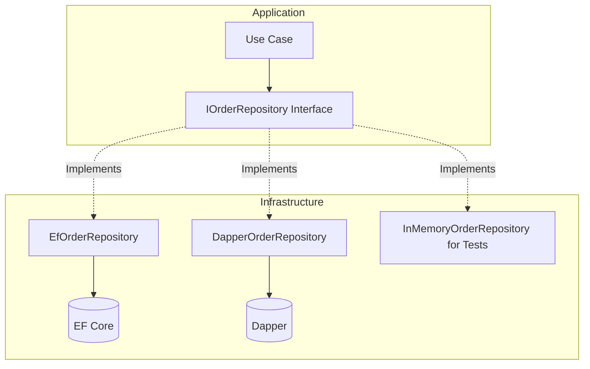

### Pros

1. **Testability** — mock repositories for unit tests
2. **Centralized query logic** — no scattered data access code
3. **Technology swapping** — switch EF Core to Dapper without changing application
4. **Domain focus** — repository methods speak the domain language
5. **Consistent access patterns** — all data access follows same pattern
6. **Caching layer insertion** — add caching transparently via decorator

### Cons

1. **Leaky abstraction** — ORM-specific features leak through
2. **Boilerplate** — many repositories with similar CRUD methods
3. **Abstraction overhead** — adds indirection for simple operations
4. **Query flexibility limitations** — complex queries may bypass repository
5. **Multiple aggregate loading** — cross-aggregate queries are awkward

### Scalability

- **How it scales:** Pattern does not inherently affect scalability. Abstraction allows caching layers, read replicas, CQRS read models transparently
- **Limitations:** Repositories that return IQueryable push query execution to caller, causing performance issues

### Real-World Examples

- **Almost every enterprise .NET application** — EF Core DbContext is a repository/UoW
- **eShopOnContainers** — uses Repository pattern
- **NopCommerce** — heavy repository usage

### C# / .NET Implementation Example

```csharp
// Interface
public interface IOrderRepository
{
    Task<Order?> GetByIdAsync(Guid id);
    Task<IEnumerable<Order>> GetByCustomerAsync(Guid customerId, int page, int pageSize);
    Task AddAsync(Order order);
    Task UpdateAsync(Order order);
    Task DeleteAsync(Guid id);
}

// EF Core Implementation
public class EfOrderRepository : IOrderRepository
{
    private readonly AppDbContext _context;
    public EfOrderRepository(AppDbContext context) => _context = context;

    public async Task<Order?> GetByIdAsync(Guid id)
        => await _context.Orders.Include(o => o.Items).FirstOrDefaultAsync(o => o.Id == id);

    public async Task<IEnumerable<Order>> GetByCustomerAsync(Guid customerId, int page, int pageSize)
        => await _context.Orders.Where(o => o.CustomerId == customerId)
            .OrderByDescending(o => o.CreatedAt)
            .Skip((page - 1) * pageSize).Take(pageSize).ToListAsync();

    public async Task AddAsync(Order order) => await _context.Orders.AddAsync(order);
    public Task UpdateAsync(Order order) { _context.Orders.Update(order); return Task.CompletedTask; }
    public async Task DeleteAsync(Guid id)
    {
        var order = await _context.Orders.FindAsync(id);
        if (order != null) _context.Orders.Remove(order);
    }
}

// In-Memory Implementation for Testing
public class InMemoryOrderRepository : IOrderRepository
{
    private readonly List<Order> _orders = new();
    public Task<Order?> GetByIdAsync(Guid id) => Task.FromResult(_orders.FirstOrDefault(o => o.Id == id));
    public Task AddAsync(Order order) { _orders.Add(order); return Task.CompletedTask; }
    // ... other implementations
}
```

### Interview Questions

<details>
<summary><b>Junior</b></summary>

**Q1:** What is the Repository pattern?

> *An abstraction over data access that makes it look like you are working with an in-memory collection. Centralizes query and persistence logic.*

**Q2:** Why use Repository instead of directly calling EF Core in controllers?

> *Testability (mock repository), abstraction (swap data source), centralized logic.*
</details>

<details>
<summary><b>Mid</b></summary>

**Q3:** Downsides of IQueryable in repository interfaces?

> *Exposes EF Core-specific capabilities. Testability suffers (real DB needed). Performance can degrade if callers add complex projections.*

**Q4:** Should every entity have a repository?

> *No. Only aggregates need repositories. Simple child entities accessed through aggregate root. Read-only reference data can use query service.*
</details>

<details>
<summary><b>Senior</b></summary>

**Q5:** Is EF Core DbContext already a Repository + Unit of Work? Do you need another layer?

> *Yes, DbSet is a repository and DbContext is a UoW. Another layer is valid for: testing, abstraction, aggregate boundaries. Overkill if committed to EF Core.*

**Q6:** How do you handle transactions across multiple repositories?

> *Unit of Work pattern. One DbContext shared across repositories. SaveChangesAsync commits atomically. For distributed, use Saga pattern.*
</details>

### Common Mistakes

1. **Generic repository for everything** — leads to anemic IRepository with basic CRUD
2. **Returning IQueryable** — leaky abstraction
3. **Repository per table** — should be per aggregate root
4. **Transaction management in repository** — belongs in Unit of Work
5. **Over-abstraction** — wrapping DbContext unnecessarily

### FAANG-Level Deep Dive

At **Amazon** and **Google**, explicit Repository pattern is less common — they use DAOs directly injected. The key FAANG insight: **the pattern matters less than the principle**. Whether called Repository, DAO, or Data Gateway, the important thing is: **your domain layer should not know about the database**.

---

## 17. Unit of Work Pattern

### What It Is

A pattern that **maintains a list of changes** (inserts, updates, deletes) and **commits them as a single transaction**. It ensures all changes are persisted atomically or rolled back together.

### Problem It Solves

**Transaction coordination** across multiple repository operations. Without Unit of Work, you would need to manually manage transactions, leading to inconsistent state if operations partially succeed.

### When to Use

- Multiple repository operations that must be atomic
- Domain-driven design (DDD) — aggregate consistency requires transactional boundaries
- Any operation that updates multiple entities
- When you need change tracking (explicit or implicit)

### When NOT to Use

- Read-only operations
- Single-entity operations where EF Core handles atomicity
- NoSQL databases without transaction support
- Eventual consistency models (microservices)

### Structure

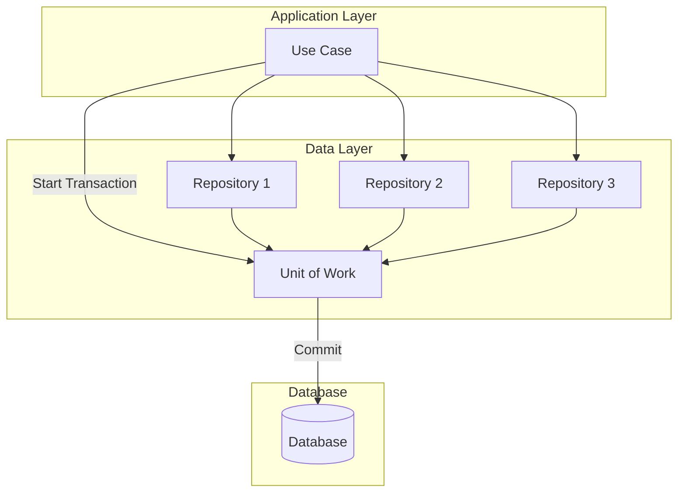

### Pros

1. **Atomic operations** — all-or-nothing transaction semantics
2. **Consistency** — changes are consistent at commit time
3. **Reduced database round-trips** — batch changes in one commit
4. **Change tracking** — unit of work can track what changed
5. **Domain events integration** — dispatch domain events before commit
6. **Rollback support** — discard changes without hitting DB

### Cons

1. **Long-running UoW** — holding transactions open too long causes lock contention
2. **Distributed systems limitation** — UoW only works within a single database
3. **Overhead** — change tracking has memory and performance cost
4. **Complexity with multiple DbContexts** — multiple UoWs cannot coordinate
5. **Implicit commits** — developers may forget to call SaveChanges

### Scalability

- **How it scales:** Best with short-lived transactions. Minimize transaction duration for high throughput
- **Limitations:** Cannot coordinate across microservices or multiple databases without distributed transactions

### Real-World Examples

- **Entity Framework Core** — DbContext IS a Unit of Work
- **NHibernate** — ISession is a Unit of Work
- **Dapper** — combined with custom UoW implementation

### C# / .NET Implementation Example

```csharp
// Custom Unit of Work
public interface IUnitOfWork : IDisposable
{
    IOrderRepository Orders { get; }
    ICustomerRepository Customers { get; }
    Task<int> SaveChangesAsync(CancellationToken ct = default);
    Task BeginTransactionAsync();
    Task CommitTransactionAsync();
    Task RollbackTransactionAsync();
}

public class UnitOfWork : IUnitOfWork
{
    private readonly AppDbContext _context;
    private IDbContextTransaction? _currentTransaction;

    public UnitOfWork(AppDbContext context, IOrderRepository orders, ICustomerRepository customers)
    {
        _context = context;
        Orders = orders;
        Customers = customers;
    }

    public IOrderRepository Orders { get; }
    public ICustomerRepository Customers { get; }

    public async Task<int> SaveChangesAsync(CancellationToken ct = default)
    {
        // Dispatch domain events before saving
        return await _context.SaveChangesAsync(ct);
    }

    public async Task BeginTransactionAsync()
        => _currentTransaction = await _context.Database.BeginTransactionAsync();

    public async Task CommitTransactionAsync()
    {
        try { await SaveChangesAsync(); await _currentTransaction!.CommitAsync(); }
        catch { await RollbackTransactionAsync(); throw; }
    }

    public async Task RollbackTransactionAsync()
    {
        if (_currentTransaction != null)
        {
            await _currentTransaction.RollbackAsync();
            _currentTransaction.Dispose();
            _currentTransaction = null;
        }
    }

    public void Dispose() => _context.Dispose();
}
```

### Interview Questions

<details>
<summary><b>Junior</b></summary>

**Q1:** What is the Unit of Work pattern?

> *Tracks changes to objects and commits all changes as a single transaction, ensuring atomicity.*

**Q2:** How does EF Core implement Unit of Work?

> *DbContext. Changes via SaveChangesAsync are committed atomically.*
</details>

<details>
<summary><b>Mid</b></summary>

**Q3:** How does Unit of Work relate to Repository?

> *Repositories handle data access for aggregates. Unit of Work coordinates multiple repository operations into a single transaction. Share same DbContext.*

**Q4:** How to handle multiple DbContexts in a single UoW?

> *Cannot with EF Core. Options: combine into one context, use distributed transaction (MSDTC), or accept eventual consistency via Saga/Outbox.*
</details>

<details>
<summary><b>Senior</b></summary>

**Q5:** Design a Unit of Work that works across a relational DB and Kafka.

> *Transactional Outbox pattern. Write to DB + outbox table in same transaction. Background process reads outbox and publishes to Kafka. UoW semantics across DB and broker without 2PC.*

**Q6:** How do you avoid long-running transactions with UoW?

> *Keep UoW short-lived — open, work, commit, dispose. For long-running processes, use Saga. Use optimistic concurrency. Batch work into smaller units.*
</details>

### Common Mistakes

1. **Holding UoW across multiple requests** — spans HTTP request incorrectly
2. **Nested UoW** — complex transaction handling
3. **Forgetting to call SaveChanges** — data silently lost
4. **Mixing UoW across bounded contexts** — violates aggregate boundaries
5. **Too many domain events in UoW** — unexpected side effects on commit

### FAANG-Level Deep Dive

EF Core DbContext is the most common UoW in .NET. At **Microsoft**, they designed it this way. The FAANG perspective: **UoW is essential for single-service transactional consistency**. For distributed systems, FAANG has moved from 2PC to **Sagas and Outbox patterns**. Key insight: **if you need a UoW across multiple services, your service boundaries are wrong**.

---

## 18. Outbox Pattern

### What It Is

A pattern that ensures **reliable message delivery** by storing messages in a database table (outbox) within the same transaction as the business operation. A separate process reads the outbox and publishes messages to the message broker.

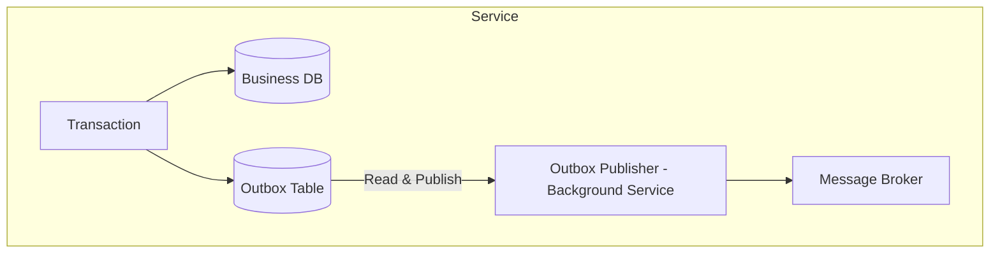

### Problem It Solves

**Message loss** — when a service updates its database and publishes a message in two separate operations, the service might crash after the DB update but before the message is published.

### When to Use

- Reliable messaging is critical (orders, payments, notifications)
- Dual-write scenarios (write to DB + publish event)
- Services that must guarantee message delivery
- When using eventual consistency between services

### When NOT to Use

- When best-effort messaging is acceptable
- Non-critical notifications where losing messages is ok
- When message broker supports distributed transactions

### Pros

1. **Guaranteed delivery** — messages survive crashes
2. **No distributed transaction** — uses local DB transaction only
3. **Exactly-once semantics** — outbox + idempotent consumers
4. **Ordering** — outbox can maintain message order
5. **Recovery** — failed messages can be retried
6. **Audit** — outbox provides a message history

### Cons

1. **Database overhead** — outbox table adds writes to DB
2. **Delivery latency** — polling interval adds delay
3. **Operational complexity** — monitoring outbox processing
4. **Duplicate handling** — consumer must handle duplicates
5. **Storage** — outbox records must be cleaned up

### CDC vs Polling Outbox

| Aspect | Polling Outbox | CDC Outbox |
|--------|---------------|------------|
| Implementation | Custom table + background job | Debezium, AWS DMS |
| Latency | Polling interval | Near real-time |
| DB Load | Polling queries | Transaction log reader |
| Complexity | Medium | High |

### Real-World Examples

- **Uber** — Schemaless outbox for ride events
- **Netflix** — outbox for billing events
- **Shopify** — order event outbox
- **Microsoft eShopOnContainers** — reference implementation

### C# / .NET Implementation Example

```csharp
// Outbox Table Entity
public class OutboxMessage
{
    public Guid Id { get; set; }
    public string Type { get; set; }  // Assembly-qualified type name
    public string Content { get; set; }  // JSON serialized
    public DateTime OccurredOn { get; set; }
    public DateTime? ProcessedOn { get; set; }
    public string? Error { get; set; }
    public int RetryCount { get; set; }
}

// Service Writing to Outbox
public class OrderService
{
    private readonly OrderDbContext _db;

    public async Task PlaceOrderAsync(PlaceOrderRequest request)
    {
        var order = new Order { Id = Guid.NewGuid(), CustomerId = request.CustomerId, Total = request.Total, Status = "Placed" };
        _db.Orders.Add(order);

        // Write to outbox in same transaction
        _db.OutboxMessages.Add(new OutboxMessage
        {
            Id = Guid.NewGuid(),
            Type = typeof(OrderPlacedEvent).AssemblyQualifiedName!,
            Content = JsonSerializer.Serialize(new OrderPlacedEvent(order.Id, order.CustomerId)),
            OccurredOn = DateTime.UtcNow
        });
        await _db.SaveChangesAsync(); // Single transaction
    }
}

// Outbox Publisher (Background Service)
public class OutboxPublisher : BackgroundService
{
    private readonly IServiceScopeFactory _scopeFactory;
    private readonly IMessageBus _messageBus;

    protected override async Task ExecuteAsync(CancellationToken stoppingToken)
    {
        while (!stoppingToken.IsCancellationRequested)
        {
            using var scope = _scopeFactory.CreateScope();
            var db = scope.ServiceProvider.GetRequiredService<OrderDbContext>();
            var messages = await db.OutboxMessages
                .Where(m => m.ProcessedOn == null && m.RetryCount < 5)
                .OrderBy(m => m.OccurredOn).Take(100).ToListAsync(stoppingToken);

            foreach (var message in messages)
            {
                try
                {
                    var @event = JsonSerializer.Deserialize(message.Content, Type.GetType(message.Type)!)!;
                    await _messageBus.PublishAsync(@event, stoppingToken);
                    message.ProcessedOn = DateTime.UtcNow;
                }
                catch (Exception ex)
                {
                    message.RetryCount++;
                    message.Error = ex.Message;
                }
            }
            await db.SaveChangesAsync(stoppingToken);
            await Task.Delay(TimeSpan.FromSeconds(5), stoppingToken);
        }
    }
}
```

### Interview Questions

<details>
<summary><b>Junior</b></summary>

**Q1:** What problem does the Outbox pattern solve?

> *The dual-write problem — ensuring a database write and message publish happen atomically. Without it, a crash after DB write but before publish loses the message.*

**Q2:** How does the Outbox pattern guarantee message delivery?

> *Messages written to outbox table in same DB transaction. Background process reads outbox and publishes. Retries on failure.*
</details>

<details>
<summary><b>Mid</b></summary>

**Q3:** Compare polling outbox vs CDC outbox.

> *Polling: custom table, background job, simple, configurable interval. CDC: DB transaction log (Debezium), near real-time, no DB query overhead.*

**Q4:** How do you ensure idempotent message processing?

> *Track processed message IDs in consumer. Use idempotency keys in events. Perform upsert operations (not insert).*
</details>

<details>
<summary><b>Senior</b></summary>

**Q5:** Design an outbox system that handles 10K events/sec with < 1 sec delivery latency.

> *Shard outbox table (by date or aggregate type). Use CDC (Debezium + Kafka) instead of polling. Multiple publisher instances with partition coordination. Batch publish to Kafka. Dead letter queue for failed messages. Exponential backoff for retries. Monitor outbox depth and age.*

**Q6:** How do you handle outbox cleanup to prevent unbounded growth?

> *Delete processed messages older than retention period (e.g., 7 days). Partition outbox table by date for efficient cleanup (DROP partition). Archive to cold storage for audit. Monitor outbox table size.*
</details>

### Common Mistakes

1. **Running publisher inline** — blocking the request thread to publish
2. **No retry limit** — infinite retries on poison messages
3. **Ignoring ordering** — messages processed out of sequence
4. **No dead letter queue** — failed messages block the queue
5. **Overloaded polling** — polling too frequently under load

### FAANG-Level Deep Dive

At **Uber**, the Schemaless datastore uses an outbox-like mechanism for reliable event publishing. **Netflix** uses outbox for billing events where loss is unacceptable. **Shopify** publishes every order event through an outbox. The FAANG consensus: **the Outbox pattern is the standard solution for guaranteed message delivery**. Combined with CDC (Debezium, AWS DMS), it can achieve sub-second latency at massive scale.

---

# Cross-Cutting Concepts

## Architecture Decision Records (ADRs)

### What Are ADRs?

A **lightweight documentation method** for capturing important architectural decisions and their context. Each ADR records a decision, its rationale, alternatives considered, and consequences.

### ADR Structure

```markdown
# ADR-001: Use PostgreSQL for Order Storage

## Status
Accepted

## Context
The Order service needs a relational database with ACID guarantees. We evaluated PostgreSQL, SQL Server, and Cosmos DB.

## Decision
Use PostgreSQL. Our team has deep PostgreSQL expertise. It provides the ACID guarantees we need at lower cost than SQL Server.

## Consequences
- Positive: Lower licensing cost, familiar tooling
- Negative: No managed .NET client (use Npgsql), less Azure integration
- Risks: Need to manage PostgreSQL clusters ourselves

## Alternatives Considered
1. SQL Server — higher licensing cost, but better Azure integration
2. Cosmos DB — good scaling, but limited transaction support
```

### ADR Best Practices

| Practice | Description |
|----------|-------------|
| Keep ADRs in version control | Same repo as the code |
| Number ADRs sequentially | ADR-001, ADR-002, etc. |
| Use consistent template | Status, Context, Decision, Consequences |
| Supersede, never delete | Mark superseded ADRs with "Superseded by ADR-NNN" |
| Everyone can propose | Not architect-only decisions |

### FAANG Perspective

At **Amazon**, ADRs are called **6-pagers** — six-page documents with narrative, data, and decision. At **Google**, design docs with similar structure are mandatory for any non-trivial change. **Netflix** uses RFC-style documents. The key principle: **write down why you decided what you decided** — your future self (and new team members) will thank you.

---

## CAP Theorem in Real-World Systems

### The Theorem

In a distributed data store, you can have at most **two** of three guarantees:

- **C**onsistency — every read receives the most recent write or an error
- **A**vailability — every request receives a non-error response (without guarantee it is the latest write)
- **P**artition Tolerance — the system continues to operate despite network partitions

### The Reality

```mermaid
graph TB
    subgraph "CAP Theorem"
        CP[CP Systems<br/>Consistency + Partition Tolerance<br/>HBase, MongoDB (single-node)]
        AP[AP Systems<br/>Availability + Partition Tolerance<br/>Cassandra, DynamoDB, Riak]
        CA[CA Systems<br/>Consistency + Availability<br/>Single-node RDBMS]
    end
    CP -->|Sacrifices Availability| TRADE1[Accepts downtime during partition]
    AP -->|Sacrifices Consistency| TRADE2[Accepts stale reads]
    CA -->|Cannot handle partitions| TRADE3[Network partition = system failure]
```

### Real-World CAP Choices

| System | Choice | Why |
|--------|--------|-----|
| **DynamoDB** | AP (eventual consistency) | Prioritizes availability for Amazon shopping cart |
| **Google Spanner** | CP (strong consistency) | External consistency via TrueTime |
| **Cassandra** | AP (tunable consistency) | Prioritizes availability, configurable consistency level |
| **MongoDB** | CP (primary) | Strong consistency from primary reads |
| **PostgreSQL** | CA (single-node) | ACID guarantees, no built-in partition tolerance |

### PACELC Extension

Beyond CAP (during Partition), consider **ELC** (Else — when no partition):

- **P**artition: trade off C vs A
- **E**lse (no partition): trade off **L**atency vs **C**onsistency

### FAANG Interview Tip

**Do not just recite CAP.** Discuss:
1. CAP applies at the system *boundary* — different subsystems can make different tradeoffs
2. PACELC is more practical — latency vs consistency matters more day-to-day than partitions
3. The real question is: "What does your *user* need?" — banking needs C, social media needs A

---

## Trade-off Analysis Methodology

### The Framework

When evaluating any architecture decision, use this structured approach:

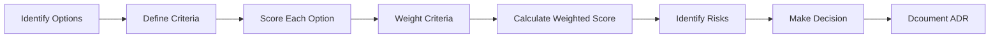

### Criteria Dimensions

| Dimension | Questions to Ask |
|-----------|-----------------|
| **Cost** | Infrastructure, licensing, team training, migration effort |
| **Complexity** | Learning curve, operational burden, debugging difficulty |
| **Scalability** | Can it handle 10x/100x growth? What is the bottleneck? |
| **Performance** | Latency P50/P99, throughput ceiling |
| **Reliability** | MTBF, MTTR, failure modes, blast radius |
| **Security** | Attack surface, compliance, audit requirements |
| **Team** | Existing expertise, hiring pool, developer experience |
| **Velocity** | Time to market, iteration speed, experimentation ease |

### Weighted Decision Matrix

| Criteria | Weight | Option A | Option B | Option C |
|----------|--------|----------|----------|----------|
| Cost | 0.2 | 3 (0.6) | 2 (0.4) | 1 (0.2) |
| Complexity | 0.15 | 2 (0.3) | 3 (0.45) | 1 (0.15) |
| Scalability | 0.25 | 1 (0.25) | 2 (0.5) | 3 (0.75) |
| Performance | 0.25 | 2 (0.5) | 3 (0.75) | 2 (0.5) |
| Team Fit | 0.15 | 3 (0.45) | 2 (0.3) | 3 (0.45) |
| **Total** | **1.0** | **2.10** | **2.40** | **2.05** |

### FAANG Approach

At **Amazon**, every architecture decision goes through:

1. **Written proposal** (1-6 pages) with data, alternatives, and recommendation
2. **Review meeting** with peers and senior engineers
3. **Disagree and commit** — once decided, the team commits fully even if they disagreed

The key FAANG insight: **trade-offs are never eliminated, only shifted**. Good architects make these shifts explicit and intentional.

---

## How to Present Architecture in Interviews

### The 4-Step Framework

```mermaid
graph LR
    S[1. Scope] --> H[2. High-Level Design]
    H --> D[3. Deep Dive]
    D --> T[4. Trade-offs]
```

### Step 1: Scope (2-3 minutes)
- **Clarify requirements** — ask: functional, non-functional, constraints
- **Define scale** — users, data volume, traffic patterns
- **Identify priorities** — consistency vs availability? Read-heavy vs write-heavy?

### Step 2: High-Level Design (3-5 minutes)
- **Draw boxes and arrows** — components, data flow, API endpoints
- **Name services** — consistent with their responsibilities
- **Explain data flow** — walk through a request end-to-end
- **Show data model** — entities, relationships, storage

### Step 3: Deep Dive (5-10 minutes)
- **Pick 2-3 areas** to dive deeper: data partitioning, consistency model, caching strategy
- **Discuss trade-offs** — why this approach over alternatives
- **Show depth** — sharding strategy, replication factor, CAP choices

### Step 4: Trade-offs (2-3 minutes)
- **What did you prioritize?** — Why?
- **What did you sacrifice?** — Latency? Consistency? Simplicity?
- **What would you change?** — With more time? Different constraints?

### Common Mistakes in Architecture Interviews

| Mistake | How to Avoid |
|---------|-------------|
| Starting with a solution | Clarify requirements first |
| Ignoring trade-offs | Always mention alternatives |
| Too high-level | Pick areas for deep dive |
| Too detailed | Dont design every API endpoint |
| No data model | Show entities and storage |
| Forgetting failure modes | Discuss what breaks and how |
| Ignoring interviewer hints | Watch for redirection cues |

### FAANG Interview Scoring

Interviewers evaluate on:
1. **Structure** — did you follow a clear framework?
2. **Scope** — did you clarify ambiguities?
3. **Depth** — do you understand trade-offs at scale?
4. **Communication** — were your diagrams and explanations clear?
5. **Practicality** — would your design work at their scale?

---

## Architecture Documentation (C4 Model)

### What Is C4?

A **hierarchical approach** to documenting software architecture at four levels of abstraction, created by Simon Brown.

```mermaid
graph TB
    C1[Context Diagram<br/>System boundaries, users, external systems]
    C2[Container Diagram<br/>Services, databases, message brokers]
    C3[Component Diagram<br/>Internal structure of each container]
    C4[Code Diagram<br/>Class-level details - optional]
    C1 --> C2
    C2 --> C3
    C3 --> C4
```

### Level 1: System Context

Shows the system boundaries, users, and external integrations.

```mermaid
graph LR
    User[User] --> System[Your System]
    System --> Ext1[Payment Gateway]
    System --> Ext2[Email Service]
    System --> Ext3[Analytics Platform]
```

### Level 2: Container

Shows the high-level technology choices — services, databases, message brokers.

```mermaid
graph TB
    WebApp[Web App<br/>SPA - React] --> API[API Gateway<br/>ASP.NET Core]
    Mobile[Mobile App<br/>iOS/Android] --> API
    API --> OrderSvc[Order Service<br/>ASP.NET Core]
    API --> CatalogSvc[Catalog Service<br/>ASP.NET Core]
    OrderSvc --> OrderDB[(PostgreSQL)]
    CatalogSvc --> CatalogDB[(MongoDB)]
    OrderSvc -.-> Queue[RabbitMQ]
    CataloSvc -.-> Queue
```

### Level 3: Component

Shows the internal structure of a single container — controllers, services, repositories.

Level 4: Code is optional and typically covered by code itself.

### C4 + ADR Integration

| C4 Level | Documented With | ADR Example |
|----------|----------------|-------------|
| Context | C1 diagram + ADRs | ADR-001: Use PostgreSQL |
| Container | C2 diagram + ADRs | ADR-002: Split Order service |
| Component | C3 diagram + ADRs | ADR-003: Repository pattern |
| Code | C4 diagram / code comments | Inline decisions |

### FAANG Perspective

**Google** uses internal equivalents of C4 — design docs with system diagrams, data flow, and trade-off analysis. **Amazon** uses 6-pagers with embedded diagrams. **Netflix** uses C4 for their microservices documentation. The key insight: **diagrams are communication tools, not deliverables**. The act of drawing clarifies thinking more than the final artifact.

---

# Final Cheatsheet

## Pattern Comparison Table

| # | Pattern | Primary Problem | Best For | Complexity | Distributed? |
|---|---------|----------------|----------|------------|-------------|
| 1 | Monolithic | Simplicity | Small apps, MVPs | Low | No |
| 2 | Modular Monolith | Code organization | Medium apps preparing for split | Medium | No |
| 3 | Microservices | Independent deployability | Large teams, complex domains | High | Yes |
| 4 | Event-Driven | Loose coupling | Streaming, async workflows | High | Yes |
| 5 | CQRS | Read/write optimization | Complex queries, high throughput | High | Optional |
| 6 | Event Sourcing | Audit trail | Finance, compliance | High | Optional |
| 7 | Clean Architecture | Framework coupling | Long-lived enterprise apps | Medium | No |
| 8 | Onion Architecture | Domain isolation | DDD-based .NET apps | Medium | No |
| 9 | Hexagonal | Technology isolation | Test-first development | Medium | No |
| 10 | DDD | Complex business logic | E-commerce, finance | High | Optional |
| 11 | Saga | Distributed transactions | Multi-service workflows | High | Yes |
| 12 | Strangler Fig | Monolith migration | Incremental decomposition | Medium | Yes |
| 13 | BFF | Client-specific APIs | Multi-client systems | Medium | Yes |
| 14 | Sidecar | Cross-cutting concerns | Service mesh, Kubernetes | Medium | Yes |
| 15 | Ambassador | Resilience offloading | Polyglot microservices | Medium | Yes |
| 16 | Repository | Data access abstraction | Testable data access | Low | No |
| 17 | Unit of Work | Transaction coordination | Atomic DB operations | Low | No |
| 18 | Outbox | Reliable messaging | Guaranteed event delivery | Medium | Yes |

## When to Use Which Pattern

### By Application Type

| Application Type | Recommended Patterns |
|-----------------|---------------------|
| **Startup / MVP** | Monolithic (start simple, add modules later) |
| **Enterprise SaaS** | Modular Monolith -> Microservices, DDD, CQRS, Event-Driven |
| **E-commerce** | Microservices, Saga, Outbox, Event-Driven, CQRS |
| **Fintech / Banking** | Event Sourcing, CQRS, DDD, Clean Architecture, Outbox |
| **Real-time Systems** | Event-Driven, Monolithic (for latency), CQRS |
| **Mobile App Backend** | BFF, Microservices, Event-Driven |
| **API Platform** | Hexagonal, Clean Architecture, Repository |
| **IoT** | Event-Driven, BFF, Sidecar |

### By Team Size

| Team Size | Pattern Strategy |
|-----------|-----------------|
| 1-5 devs | Monolithic (well-structured) |
| 5-15 devs | Modular Monolith + DDD |
| 15-50 devs | Microservices + API Gateway + Event-Driven |
| 50+ devs | Full distributed system with all patterns as needed |

### By Scale Requirements

| Scale | Approach |
|-------|----------|
| 1K users/day | Single server monolith |
| 10K users/day | Monolith + caching + read replicas |
| 100K users/day | Modular monolith + CDN + DB sharding plan |
| 1M users/day | Microservices + Event-Driven + CQRS |
| 10M+ users/day | Full FAANG-level: every pattern considered |

## Architecture Interview Framework

### The ANSWER Framework

```
A - Ask clarifying questions (scope, scale, constraints)
N - Name the components (services, databases, queues)
S - Sketch the architecture (diagrams, data flow)
W - Walk through scenarios (happy path, failure, scale)
E - Evaluate trade-offs (alternatives, sacrifices)
R - Review and refine (what would you change?)
```

### 15-Minute Architecture Interview Structure

```mermaid
graph LR
    A[0-3 min: Scope] --> B[3-8 min: High-Level]
    B --> C[8-13 min: Deep Dive]
    C --> D[13-15 min: Trade-offs]
```

### 45-Minute System Design Interview Structure

```mermaid
graph TB
    A[0-5 min: Requirements] --> B[5-10 min: Data Model]
    B --> C[10-20 min: High-Level Design]
    C --> D[20-35 min: Deep Dive]
    D --> E[35-40 min: Trade-offs & Scaling]
    E --> F[40-45 min: Summary & Next Steps]
```

### Key Phrases to Use

| Situation | Phrase |
|-----------|--------|
| Clarifying | "Let me make sure I understand the requirements..." |
| Trade-offs | "The trade-off here is between consistency and availability..." |
| Prioritizing | "Given the constraints, I would prioritize X over Y because..." |
| Admitting uncertainty | "I am not sure about X, but here is how I would approach it..." |
| Alternatives | "An alternative approach would be..., but that sacrifices..." |

---

## Common Architecture Interview Questions (30+)

### Foundational

<details>
<summary><b>Q1:</b> Design a URL shortener like TinyURL.</summary>

> *Key points: hash generation (base62), read-heavy optimization (cache), key generation service, sharding by hash prefix, 301 redirects, analytics tracking. Trade-off: hash collision strategy (retry vs distributed counter).*
</details>

<details>
<summary><b>Q2:</b> Design a web crawler.</summary>

> *Key points: BFS frontier, URL deduplication (Bloom filter), politeness policy (per-domain rate limiting), priority queue, distributed workers, content extraction. Trade-off: breadth vs depth-first, politeness vs throughput.*
</details>

<details>
<summary><b>Q3:</b> Design a CDN system.</summary>

> *Key points: edge servers, origin pull vs push, cache hierarchy, geographic routing (DNS-based), cache eviction (LRU), SSL termination, DDoS protection. Trade-off: cache hit rate vs storage cost.*
</details>

<details>
<summary><b>Q4:</b> Design a rate limiter.</summary>

> *Key points: token bucket vs sliding window vs leaky bucket, distributed counters (Redis), per-user vs per-IP, tiered rate limits, headers (X-RateLimit-*), graceful degradation. Trade-off: accuracy vs memory.*
</details>

<details>
<summary><b>Q5:</b> Design a key-value store (like Redis).</summary>

> *Key points: hash table vs B-tree, persistence (RDB/AOF), expiration policies, eviction policies (LRU/LFU), cluster mode (sharding + replication), consistent hashing. Trade-off: performance vs durability.*
</details>

### Social / Communication

<details>
<summary><b>Q6:</b> Design a chat system (like WhatsApp).</summary>

> *Key points: WebSocket long-polling, message persistence, last-seen indicators, delivery receipts, file sharing (CDN), end-to-end encryption, group chats, offline message storage. Trade-off: delivery guarantee vs latency.*
</details>

<details>
<summary><b>Q7:</b> Design a social media feed (like Twitter).</summary>

> *Key points: push vs pull (fanout on write vs fanout on read), timeline generation, ranking algorithm, feed storage (Redis sorted sets), pagination (cursor-based), real-time updates. Trade-off: write amplification (push) vs read amplification (pull).*
</details>

<details>
<summary><b>Q8:</b> Design a video streaming platform (like YouTube).</summary>

> *Key points: upload pipeline (transcoding queue), CDN distribution, adaptive bitrate streaming (HLS/DASH), video segmentation, recommendation engine, thumbnail generation, comment system. Trade-off: encoding speed vs quality.*
</details>

<details>
<summary><b>Q9:</b> Design a messaging queue (like Kafka).</summary>

> *Key points: append-only log, partitions, consumer groups, offset management, retention policies, replication (ISR), exactly-once semantics, schema registry. Trade-off: ordering vs parallelism (partition count).*
</details>

<details>
<summary><b>Q10:</b> Design a notification system.</summary>

> *Key points: multi-channel (email, SMS, push, in-app), template engine, batching, rate limiting, deduplication, delivery tracking, user preferences, fallback channels. Trade-off: delivery speed vs cost.*
</details>

### Data / Storage

<details>
<summary><b>Q11:</b> Design a distributed database (like DynamoDB).</summary>

> *Key points: consistent hashing, vector clocks, hinted handoff, read repair, gossip protocol, quorum consistency, multi-AZ replication. Trade-off: consistency level vs availability.*
</details>

<details>
<summary><b>Q12:</b> Design a payment system (like Stripe).</summary>

> *Key points: idempotency keys, double-entry ledger, payment gateway integration, fraud detection, reconciliation, 3D Secure, dispute handling. Trade-off: fraud accuracy vs false positives.*
</details>

<details>
<summary><b>Q13:</b> Design a taxi booking system (like Uber).</summary>

> *Key points: geo-spatial indexing (QuadTree, GeoHash), driver matching, surge pricing, ETA calculation, route optimization, event-driven state machine (trip lifecycle). Trade-off: matching accuracy vs latency.*
</details>

<details>
<summary><b>Q14:</b> Design a search autocomplete system.</summary>

> *Key points: trie data structure, top-K suggestions, ranking by frequency + recency, precomputation, incremental indexing, personalization. Trade-off: freshness vs precomputation cost.*
</details>

<details>
<summary><b>Q15:</b> Design a distributed cron scheduler.</summary>

> *Key points: centralized vs distributed scheduler, leader election (ZooKeeper/etcd), task persistence, exactly-once execution, missed task recovery, timezone handling. Trade-off: reliability vs simplicity.*
</details>

### E-Commerce / Business

<details>
<summary><b>Q16:</b> Design an e-commerce platform (like Amazon).</summary>

> *Key points: product catalog (CQRS), shopping cart (Redis), order processing (Saga), inventory management (eventual consistency), payment (idempotency), recommendation engine. Trade-off: consistency vs checkout throughput.*
</details>

<details>
<summary><b>Q17:</b> Design a parking lot system.</summary>

> *Key points: floor/slot hierarchy, pricing strategy (hourly, daily, event-based), reservation management, entry/exit processing, payment integration, real-time availability display. Trade-off: reservation guarantee vs no-show risk.*
</details>

<details>
<summary><b>Q18:</b> Design a hotel booking system.</summary>

> *Key points: inventory management (rooms), overbooking strategy, rate pricing, cancellation policy, channel management (OTAs), payment capture, calendar availability. Trade-off: revenue vs occupancy.*
</details>

<details>
<summary><b>Q19:</b> Design a food delivery app (like DoorDash).</summary>

> *Key points: restaurant catalog, order dispatch (nearest driver), ETA calculation, real-time tracking, driver assignment, surge pricing. Trade-off: delivery time vs driver utilization.*
</details>

<details>
<summary><b>Q20:</b> Design an online multiplayer game backend.</summary>

> *Key points: game state synchronization (WebSocket), room/match management, leaderboard (Redis sorted sets), anti-cheat, player matching (Elo/MMR), event-driven game loop. Trade-off: state consistency vs frame rate.*
</details>

### Infrastructure / DevOps

<details>
<summary><b>Q21:</b> Design a CI/CD pipeline.</summary>

> *Key points: source control integration, build agents, artifact repository, environment promotion (dev/staging/prod), automated testing, deployment strategies (blue-green, canary), rollback mechanism. Trade-off: deployment speed vs safety.*
</details>

<details>
<summary><b>Q22:</b> Design a logging and monitoring system.</summary>

> *Key points: log aggregation (ELK stack), metrics collection (Prometheus), distributed tracing (Jaeger/Zipkin), alerting, dashboard, retention policies, sampling. Trade-off: observability completeness vs storage cost.*
</details>

<details>
<summary><b>Q23:</b> Design a feature flag system.</summary>

> *Key points: flag storage (Redis/DB), targeting rules (user segments, percentage rollouts), SDK integration, A/B testing support, flag evaluation caching, gradual rollback. Trade-off: evaluation latency vs flag complexity.*
</details>

<details>
<summary><b>Q24:</b> Design a configuration management system.</summary>

> *Key points: hierarchical config (environment -> service -> instance), hot reload, secret management (Vault), versioning, audit, push vs pull distribution. Trade-off: consistency (all nodes same config) vs availability (graceful degradation).*
</details>

<details>
<summary><b>Q25:</b> Design a service mesh control plane (like Istio).</summary>

> *Key points: sidecar proxy injection (Envoy), traffic routing rules, circuit breaker configuration, mTLS certificate management, telemetry collection, control plane scalability (Pilot/Mixer). Trade-off: feature richness vs control plane complexity.*
</details>

### Architecture Design (Open-Ended)

<details>
<summary><b>Q26:</b> Design a system that processes 1M events per second.</summary>

> *Key points: Kafka partitioning, consumer group parallelism, batch processing, backpressure handling, stream processing (Kafka Streams/Flink), dead letter queues, monitoring throughput/lag. Trade-off: processing latency vs throughput.*
</details>

<details>
<summary><b>Q27:</b> How would you design a multi-tenant SaaS platform?</summary>

> *Key points: tenant isolation (database-per-tenant vs shared), tenant provisioning, tenant-aware routing, metering/billing, tenant-specific configuration, shared infrastructure management. Trade-off: isolation vs operational cost.*
</details>

<details>
<summary><b>Q28:</b> Design a global leaderboard for 100M users.</summary>

> *Key points: Redis sorted sets, sharding by score range, periodic leaderboard re-computation, real-time vs batch updates, tie-breaking strategy, Top-N vs rank-for-user queries. Trade-off: accuracy vs update frequency.*
</details>

<details>
<summary><b>Q29:</b> Design a distributed locking service.</summary>

> *Key points: Redis Redlock, ZooKeeper sequential ephemeral nodes, lease-based locks, fencing tokens, lock timeouts, deadlock detection. Trade-off: lock reliability vs availability (split-brain risk).*
</details>

<details>
<summary><b>Q30:</b> Design a system to migrate from a monolith to microservices.</summary>

> *Key points: identify bounded contexts (DDD Event Storming), Strangler Fig pattern, API gateway routing, data split strategy (CDC), feature flags, canary releases, rollback plan. Trade-off: migration speed vs risk.*
</details>

<details>
<summary><b>Q31:</b> Design a global-scale photo storage system (like Google Photos).</summary>

> *Key points: object storage (S3/Blob Storage), CDN for delivery, thumbnail generation pipeline, image recognition (ML), deduplication, compression, EXIF metadata indexing, sharing permissions. Trade-off: storage cost vs retrieval speed.*
</details>

<details>
<summary><b>Q32:</b> Design a distributed transaction system (like a bank transfer).</summary>

> *Key points: Saga pattern (orchestration), idempotency keys, ledger entries, reconciliation, error handling (retry + manual intervention), audit trail (Event Sourcing). Trade-off: ACID isolation vs distributed consistency.*
</details>

<details>
<summary><b>Q33:</b> Design a real-time collaboration tool (like Google Docs).</summary>

> *Key points: Operational Transformation (OT) vs CRDT, WebSocket connections, document versioning, conflict resolution, cursor presence, permission management. Trade-off: algorithmic complexity vs collaboration latency.*
</details>

<details>
<summary><b>Q34:</b> How do you choose between SQL and NoSQL for a new system?</summary>

> *SQL: strong consistency, complex queries, ACID transactions, structured data. NoSQL: flexible schema, horizontal scaling, high write throughput, simple queries. Decision factors: data relationships, consistency needs, scale, team expertise.*
</details>

<details>
<summary><b>Q35:</b> Design a distributed session management system.</summary>

> *Key points: centralized session store (Redis), session token (JWT vs opaque), sticky sessions vs stateless, session expiration/refresh, cross-datacenter replication, security considerations. Trade-off: stateless scalability vs stateful session control.*
</details>

---

> **End of Volume 10 — System Architecture & Design Patterns**
>
> *Next: Volume 11 — Distributed Systems & Scalability*
