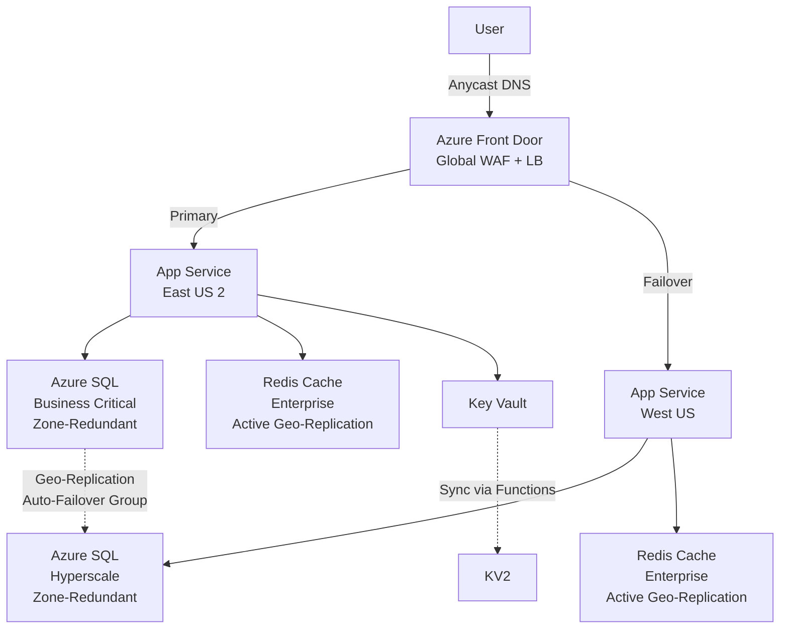
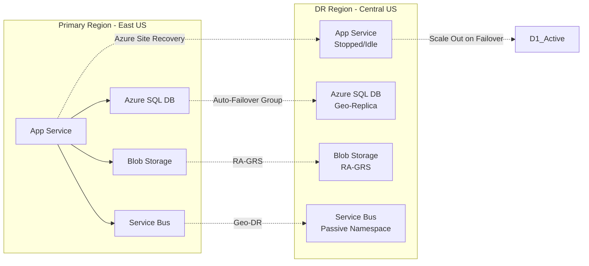
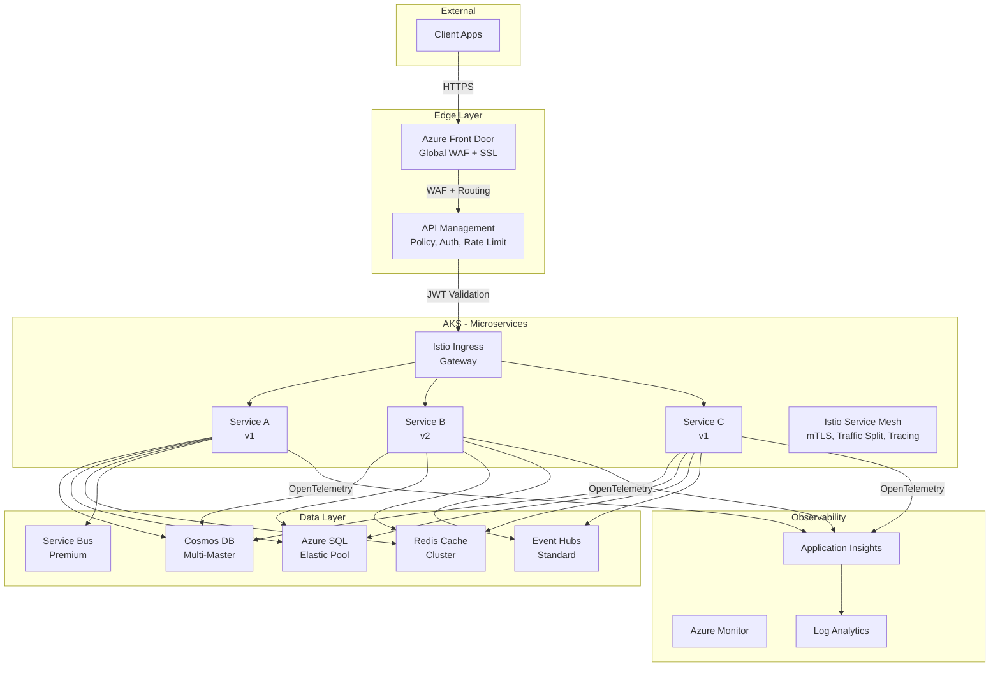
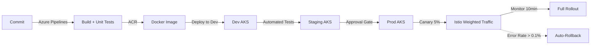
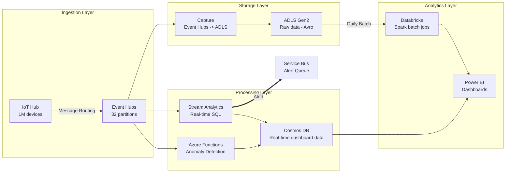
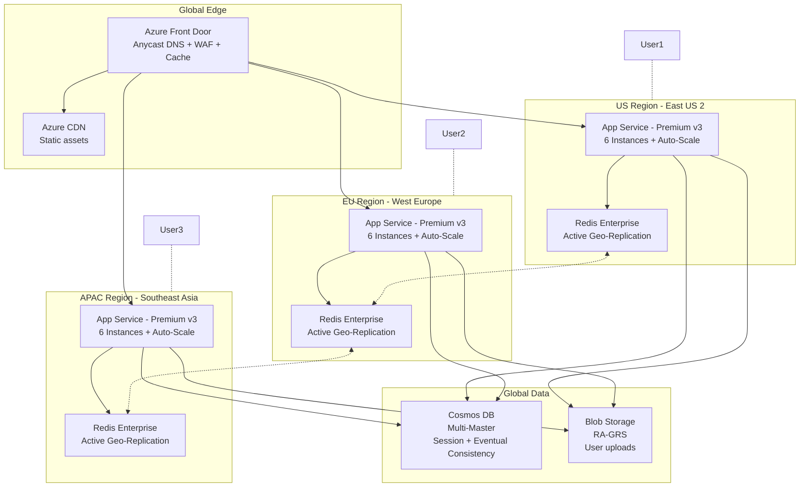

# Volume 11: Microsoft Azure — Complete Interview Preparation Guide (2026)

<p align="center">
  
  
  
  
</p>

---

## Table of Contents

- [How to Use This Guide](#how-to-use-this-guide)
- [Azure Services](#azure-services)
  - [1. Azure App Service](#1-azure-app-service)
  - [2. Azure Functions](#2-azure-functions)
  - [3. Azure Virtual Machines](#3-azure-virtual-machines)
  - [4. Azure Kubernetes Service (AKS)](#4-azure-kubernetes-service-aks)
  - [5. Azure Container Instances (ACI)](#5-azure-container-instances-aci)
  - [6. Azure Blob Storage](#6-azure-blob-storage)
  - [7. Azure Cosmos DB](#7-azure-cosmos-db)
  - [8. Azure SQL Database](#8-azure-sql-database)
  - [9. Azure Redis Cache](#9-azure-redis-cache)
  - [10. Azure Service Bus](#10-azure-service-bus)
  - [11. Azure Event Grid](#11-azure-event-grid)
  - [12. Azure Event Hubs](#12-azure-event-hubs)
  - [13. Azure API Management](#13-azure-api-management)
  - [14. Azure CDN / Front Door](#14-azure-cdn--front-door)
  - [15. Azure DNS](#15-azure-dns)
  - [16. Azure Virtual Network](#16-azure-virtual-network)
  - [17. Azure Load Balancer](#17-azure-load-balancer)
  - [18. Azure Application Gateway](#18-azure-application-gateway)
  - [19. Azure Traffic Manager](#19-azure-traffic-manager)
  - [20. Azure Active Directory / Entra ID](#20-azure-active-directory--entra-id)
  - [21. Azure Key Vault](#21-azure-key-vault)
  - [22. Azure Monitor](#22-azure-monitor)
  - [23. Azure Policy](#23-azure-policy)
  - [24. Azure Blueprints](#24-azure-blueprints)
  - [25. Azure Well-Architected Framework](#25-azure-well-architected-framework)
  - [26. Azure DevOps](#26-azure-devops)
  - [27. Azure AI Services](#27-azure-ai-services)
- [Architecture Design Questions](#microsoft-azure-architecture-interview)

---

## How to Use This Guide

| Role | Focus |
|------|-------|
| **Junior (0–2 yrs)** | What It Is, Problem It Solves, Key Features, Explain Like I'm 7 |
| **Mid (3–5 yrs)** | Above + Pricing Model, When to Use/Not Use, Internal Working, SLA, C# SDK |
| **Senior (6+ yrs)** | Above + FAANG-Level Deep Dive, Design Questions, Trade-offs, interview questions at your level |

---

# Azure Services

---

## 1. Azure App Service

### What It Is
Azure App Service is a fully managed Platform-as-a-Service (PaaS) for hosting web applications, RESTful APIs, and mobile backends. Supports .NET, Java, Node.js, Python, PHP, and Ruby.

### Why It Exists
To eliminate infrastructure management for web app hosting — no need to patch OS, manage IIS/nginx, or configure load balancers.

### Problem It Solves
Developers spend weeks configuring VMs, web servers, SSL certs, auto-scaling, and deployment pipelines. App Service collapses this to a single deployment step.

### Key Features
| Feature | Description |
|---------|-------------|
| Auto-scaling | Scale out/in based on rules or schedule |
| Deployment Slots | Staging → Swap → Production with zero-downtime |
| Linux Support | Run containers or native Linux stacks |
| Always On | Prevents app from being unloaded |
| VNet Integration | Connect to resources inside a VNet |
| Managed Certificates | Free SSL/TLS with automatic renewal |
| Authentication | Built-in auth (Microsoft, Google, GitHub, etc.) |
| Custom Domains | Bring your own domain with SNI SSL |

### Pricing Model
| Plan | Use Case | Key Traits |
|------|----------|------------|
| **Free / Shared** | Dev / test only | 1 GB storage, shared infra, no SLA |
| **Basic** | Low traffic production | Dedicated instances, up to 3 instances |
| **Standard** | Production apps | Auto-scale (up to 10 instances), slots, traffic manager |
| **Premium v3** | High density, low latency | Faster CPUs, up to 30 instances, private endpoints |
| **Isolated** | Enterprise, compliance | Dedicated App Service Environment (ASE), full isolation |

### When to Use
- CRUD web apps / REST APIs
- Internal line-of-business apps
- API backends for mobile apps
- Apps that benefit from automatic patching and scale

### When NOT to Use
- Long-running background jobs (use Azure Functions or Container Instances)
- Apps requiring custom Windows Server features (use VMs)
- Latency-sensitive real-time apps (use containers on AKS with proximity placement)
- Apps needing > 30 instances for single plan (split across plans or use ASE)

### Internal Working
`
User → Azure Front Door / Traffic Manager → App Service Plan (VM instances)
                                                   ↓
                                            App Service (sandbox: w3wp.exe / Kestrel)
                                                   ↓
                                            VNet Integration → DB / Storage / Redis
`
- Each App Service runs inside a sandbox (w3wp on Windows, Kestrel on Linux).
- The sandbox enforces resource quotas (CPU, RAM, network).
- App Service Plan defines the VM SKU and instance count.
- **Front-end role** routes HTTP requests to a **Stamp** (pods of 100s of VMs).
- Each stamp has a load balancer distributing requests to worker VMs.
- Deployment slots use **cookie affinity** (ARRAffinity) to pin users during swap warmup.

### SLA
- **99.95%** (Standard / Premium / Isolated)
- **Free / Shared**: No SLA

### Limitations
- Max 30 instances per App Service Plan (Standard), 100 (Premium)
- Max 500 MB temp storage per instance (Windows)
- 230-minute timeout for unresponsive requests
- 100 MB max file upload via default pipeline
- Cannot install custom IIS modules (Windows)

### C# / .NET SDK Example

`csharp
using Azure;
using Azure.Identity;
using Azure.ResourceManager.AppService;
using Azure.ResourceManager.AppService.Models;

var subscriptionId = "your-subscription-id";
var credential = new DefaultAzureCredential();
var client = new AppServiceManagementClient(subscriptionId, credential);

var app = await client.WebApps.CreateOrUpdateAsync(
    resourceGroupName: "rg-demo",
    name: "my-app-service",
    new WebSite
    {
        Location = AzureLocation.WestUS2,
        SiteConfig = new SiteConfig
        {
            NetFrameworkVersion = "v8.0",
            AlwaysOn = true,
            MinTlsVersion = ConfigProtectedSettings.MinTlsVersion12
        }
    }
);

using var zipStream = File.OpenRead("publish.zip");
await client.WebApps.CreateZipDeploymentAsync(
    resourceGroupName: "rg-demo",
    name: "my-app-service",
    zipStream
);
`

### Interview Questions

<details>
<summary><b>Junior (1–2 Yrs)</b></summary>

1. **Q:** What is the difference between App Service and App Service Plan?
   **A:** App Service is the application itself (code + config). App Service Plan is the underlying VMs (compute resources) that run the app. You pay for the plan, not the app.

2. **Q:** How do deployment slots work?
   **A:** Slots are separate live environments (e.g., staging, production). You deploy to staging, validate, then swap. The swap flips routing rules and settings, enabling zero-downtime deployments.
</details>

<details>
<summary><b>Mid (3–5 Yrs)</b></summary>

1. **Q:** Why would a swap fail and how do you troubleshoot?
   **A:** Common reasons: warmup request fails (need applicationInitialization config), slot-specific settings (connection strings) not marked as slot settings, sticky sessions break during swap. Check swap history in Portal or \z webapp deployment slot swap --action preview\.

2. **Q:** How does App Service handle auto-scaling differently than VMSS?
   **A:** App Service auto-scale is managed within the plan — it adds/removes instances based on metrics (CPU, memory, queue length) or schedule. VMSS requires you to manage the scaling rules, load balancer config, and extension scripts. App Service also has a pre-warming mechanism for instances.
</details>

<details>
<summary><b>Senior (6+ Yrs)</b></summary>

1. **Q:** Design a multi-region, high-availability web app on App Service. What are the failure modes?
   **A:** Deploy App Services in paired regions (e.g., East US 2 + Central US). Use Front Door with health probes. For DB failover, use Azure SQL Geo-Replication or Cosmos DB multi-master. Failure modes: region outage (Front Door fails over), plan-level outage (patch storm — use multi-region), slot swap failure (auto-rollback). Configure healthCheckPath in App Service with a light endpoint that tests DB connectivity.

2. **Q:** How would you handle > 10k requests per second on App Service without reaching instance limits?
   **A:** Use multiple App Service Plans behind a single Front Door with session affinity off. For extreme scale, front with Azure API Management (caching, throttling). Consider splitting by tenant (App Service per tenant) or using containers on AKS for horizontal pod autoscaling. App Service hard max is 30 instances — each Standard v3 instance handles ~500–1k RPS, so 30 instances × 1k = 30k RPS is realistic.
</details>

### Common Mistakes
- ❌ Not marking database connection strings as **slot settings** → staging app connects to production DB
- ❌ Using **F1 (Free)** plan for production → VM is recycled after 20 min of inactivity
- ❌ Not enabling **ARR Affinity** when session state is in-memory
- ❌ Forgetting applicationInitialization for swap warmup → cold start on production
- ❌ Treating D:\\home as persistent across scale-out → it's per-instance

### FAANG-Level Deep Dive

**Scenario:** Netflix-scale streaming service migrating to Azure App Service.

**Constraints:**
- 50M+ daily active users
- Sub-200ms p99 latency globally
- Zero-downtime deployments required
- Live content updates every 15 min

**Solutions:**
- Use **Front Door + Premium v3 App Service** in 8 regions
- **Slot swap with auto-warmup** — warmup page hits /health, /api/config, and a dummy DB query
- **Custom container (Linux)** for App Service to control nginx + Kestrel tuning
- **VNet integration** to Cosmos DB via private endpoints (no public IPs)
- **Application Insights** — distributed tracing, custom metrics, smart detection
- **Blue/Green swap strategy** — 10% traffic to new slot via Traffic Manager weighted routing before full swap

**Failure scenario:** A bad deployment passes health checks. Solution: **immediate auto-rollback** via deployment slot swap reversal triggered by Application Insights alert (error rate > 1%).

### Explain Like I'm 7

Imagine you want to open a lemonade stand. Normally you need to build the stand, buy cups, make lemonade, and stand in the sun all day. **App Service** is like having a friend who builds the stand, keeps it clean, and even calls more friends when there's a long line. You just bring your lemonade recipe (code).

---

## 2. Azure Functions

### What It Is
Azure Functions is a serverless compute service that runs event-driven code without managing infrastructure.

### Why It Exists
To let developers write small pieces of code (functions) that react to events — HTTP requests, queue messages, timer schedules — without provisioning servers.

### Problem It Solves
Traditional apps waste resources running idle waiting for events. Functions run only when triggered, scaling automatically to zero.

### Key Features
| Feature | Description |
|---------|-------------|
| Triggers | HTTP, Timer, Blob, Queue, Event Grid, Event Hub, Cosmos DB, Service Bus |
| Bindings | Declarative input/output connections to Azure services |
| Durable Functions | Stateful orchestration of functions (async workflows) |
| Flex Consumption | Newer plan with instant scaling and virtual network support |
| Managed Identity | Secure access to resources without keys |
| Docker Support | Run functions in custom containers |

### Pricing Model
| Plan | Description | Traits |
|------|-------------|--------|
| **Consumption** | Pay per execution (execution time + number of executions) | 1M free exec/month, auto-scale to zero, 5–10 min timeout |
| **Flex Consumption** | Newer consumption model | VNet support, faster scaling, no cold starts (pre-warmed instances) |
| **Premium** | Pre-warmed instances, no cold start | VNet integration, unlimited execution duration, predictable pricing |
| **Dedicated (App Service)** | Run on App Service Plan | Full control, predictable pricing, no auto-scale to zero |

### When to Use
- Event-driven processing (file uploads, queue messages)
- Scheduled tasks (cron jobs)
- Lightweight HTTP APIs
- Real-time data processing (Event Hub streams)
- Orchestration workflows (Durable Functions)

### When NOT to Use
- Long-running CPU-intensive tasks (>5 min in Consumption)
- Stateful services (use a proper app or Durable Functions with care)
- Applications needing < 10ms response times
- Tasks needing local persistent storage

### Internal Working
`
Trigger (HTTP/Queue/Blob) → Scale Controller (monitors events)
                                   ↓
                         Function Host (sandbox)
                                   ↓
                         Binding Extension (serialize/deserialize)
                                   ↓
                         User Code (function handler)
`
- **Scale Controller** samples trigger metrics every 10s, makes scale decisions.
- Functions run in the **Function Host** process — Microsoft.Azure.WebJobs.Host.
- **Bindings** use extension packages (Microsoft.Azure.WebJobs.Extensions.*).
- In Consumption plan, idle apps are **unloaded** after 20 min of inactivity.
- Flex Consumption uses a **pre-warmed pool** that completely eliminates cold starts.
- **Durable Functions** uses Azure Storage queues/tables to persist orchestration state.

### SLA
- **99.95%** (Premium / Dedicated)
- **Consumption**: No financial SLA (but high availability built-in)

### Limitations
- Consumption: Max 10-min execution timeout (can raise to 60 min in Premium with functionTimeout)
- Max 200 total function apps per subscription (soft limit)
- Max instance count: 200 (Consumption), 100 (Premium)
- Payload size: 100 MB max (HTTP), 4.5 MB (Queue trigger message)
- No local file system persistence

### C# / .NET SDK Example

`csharp
using System.Net;
using Microsoft.Azure.Functions.Worker;
using Microsoft.Extensions.Logging;

public class ProcessOrderFunction
{
    private readonly ILogger<ProcessOrderFunction> _logger;

    public ProcessOrderFunction(ILogger<ProcessOrderFunction> logger)
    {
        _logger = logger;
    }

    [Function("ProcessOrder")]
    [CosmosDBOutput(
        databaseName: "OrdersDB",
        containerName: "Orders",
        Connection = "CosmosDBConnection",
        CreateIfNotExists = true)]
    public async Task<object?> Run(
        [HttpTrigger(AuthorizationLevel.Function, "post")] HttpRequestData req,
        [ServiceBusTrigger("orders", Connection = "ServiceBusConnection")] OrderMessage? orderFromQueue)
    {
        _logger.LogInformation("Processing order...");
        var order = orderFromQueue ?? await req.ReadFromJsonAsync<Order>();
        if (order == null) return null;
        order.ProcessedAt = DateTime.UtcNow;
        return order;
    }
}

public class Order
{
    public string Id { get; set; } = Guid.NewGuid().ToString();
    public string ProductId { get; set; } = \"\";
    public int Quantity { get; set; }
    public DateTime ProcessedAt { get; set; }
}

// Durable Functions
public class OrderOrchestrator
{
    [Function("OrderOrchestrator")]
    public async Task<OrderResult> RunOrchestrator(
        [OrchestrationTrigger] TaskOrchestrationContext context)
    {
        var order = context.GetInput<Order>();
        var payment = await context.CallActivityAsync<bool>("ProcessPayment", order);
        if (!payment) return new OrderResult { Status = "Failed", Reason = "Payment declined" };
        var shipped = await context.CallActivityAsync<bool>("ShipOrder", order);
        await context.CallActivityAsync("SendEmail", order);
        return new OrderResult { Status = "Completed", OrderId = order.Id };
    }
}
`

### Interview Questions

<details>
<summary><b>Junior (1–2 Yrs)</b></summary>

1. **Q:** What is the difference between a trigger and a binding?
   **A:** A trigger starts the function (e.g., HTTP request, queue message). Bindings are input/output connections to data — they read data into the function or write data out without manual SDK calls.

2. **Q:** What happens when a function fails in Consumption plan?
   **A:** For non-HTTP triggers (queue, blob), the message is returned to the queue/poison queue, and the function retries up to 5 times (configurable). For HTTP triggers, the client gets a 500 error.
</details>

<details>
<summary><b>Mid (3–5 Yrs)</b></summary>

1. **Q:** How does the Scale Controller decide to scale out?
   **A:** The Scale Controller samples trigger metrics every 10 seconds. For queue triggers, it checks queue length and the rate of messages being added. For Event Hubs, it checks partition backlog. It scales one instance per 10 messages (queues) or per partition (Event Hubs). Decisions are based on an adaptive algorithm, not fixed thresholds.

2. **Q:** How do you handle cold starts in Azure Functions?
   **A:** Strategies: (1) Upgrade to Premium plan (always warm). (2) Use Flex Consumption (pre-warmed pool). (3) Keep the app warm with a timer-triggered function pinging the HTTP endpoint. (4) Reduce cold start time by trimming dependencies, using async warmup, and choosing faster runtimes (C# Isolated > InProcess, Python > Node).
</details>

<details>
<summary><b>Senior (6+ Yrs)</b></summary>

1. **Q:** Design a serverless order processing pipeline handling 1000 orders/sec with guaranteed delivery.
   **A:** API Management → Event Hub (partitioned by order ID) → Stream Analytics / Functions (per partition) → Cosmos DB. Key decisions: Event Hub preserves ordering per partition (use order ID hash as partition key). Use Durable Functions only for compensating transactions (e.g., payment rollback). Enable checkpointing. For guaranteed delivery: Event Hub leverages at-least-once semantics; deduplicate in Cosmos DB using idempotency keys.

2. **Q:** What are the real costs at scale of Consumption vs Premium vs Dedicated?
   **A:** At low scale (100k exec/mo), Consumption is cheapest. At high scale (50M exec/mo), Dedicated wins. **Invisible costs**: Storage account transactions (Consumption stores orchestration state), premium function App Service Plan VMs (even no traffic), Log Analytics ingestion.
</details>

### Common Mistakes
- ❌ Not idempotent functions → duplicate processing on retries
- ❌ Using Thread.Sleep() in Consumption → counts against execution time, costs money
- ❌ Max instance count reached for Event Hubs → partition lag grows unbounded
- ❌ Storing state in static variables → lost on scale-out

### FAANG-Level Deep Dive

**Scenario:** Real-time fraud detection system processing 50k transactions/sec.

**Constraints:**
- Sub-100ms decision latency
- Exactly-once processing
- Stateful ML model per user session
- Global deployment (US, EU, Asia)

**Solution:**
- **Flex Consumption Functions** with VNet injection and managed identity
- **Event Hubs** with 32 partitions, geo-replication
- **Durable Entities** for user state (account balance, velocity checks) — state stored in Azure Storage, partitioned by user ID
- **Azure Redis** as sidecar cache for reference data (blacklists, whitelists)
- **Application Insights** with sampling at 10% (100k events/sec = 10k sampled) to control cost

**Trade-off:** Durable Entities provide state but at ~10ms latency for CRD operations. For sub-100ms, we must keep entity operations to a minimum and batch writes.

### Explain Like I'm 7

Functions are like having a robot that only wakes up when the doorbell rings. The robot doesn't eat or sleep when nobody's at the door. When someone rings (event), the robot wakes up, does its job (run code), and goes back to sleep. No wasted energy.

---

## 3. Azure Virtual Machines

### What It Is
Azure Virtual Machines (VMs) are Infrastructure-as-a-Service (IaaS) compute resources — full control over the operating system and application stack.

### Why It Exists
Some workloads need full OS control, custom software installations, legacy app compatibility, or specialized configurations that PaaS can't provide.

### Problem It Solves
You can migrate on-premises servers to Azure without rewriting the app. Lift-and-shift.

### Key Features
| Feature | Description |
|---------|-------------|
| Availability Sets | Spread VMs across fault/update domains (99.95% SLA) |
| Availability Zones | Physical separation across datacenters (99.99% SLA) |
| Scale Sets (VMSS) | Auto-scale identical VMs from a single config |
| Managed Disks | Azure-managed storage (SSD/HDD) with encryption |
| Spot Instances | Up to 90% discount, can be evicted |
| Azure Dedicated Host | Physical server isolation for compliance |

### Pricing Model
| Component | Pricing |
|-----------|---------|
| Compute | Per-second billing (Linux), per-minute (Windows) |
| Storage | Managed disk per GB/month + IOPS |
| Licenses | Windows license included (or use your own) |
| Reserved Instances | 1yr/3yr save up to 72% |
| Spot | Up to 90% discount, evictable with 30s notice |

### When to Use
- Lift-and-shift of on-prem apps
- Custom OS configurations (domain join, GPO, custom firewalls)
- Legacy .NET Framework / Java apps
- GPU workloads (ML training, video rendering)
- SAP, Oracle, SQL Server on Windows

### When NOT to Use
- Modern cloud-native apps (use App Service / AKS)
- Apps needing minimal management overhead
- Stateless microservices (containers on AKS are cheaper to operate)
- Short-lived batch processing (use Batch or Serverless)

### Internal Working
`
User → Azure Frontend (Resource Manager / Compute API)
                    ↓
           Fabric Controller (RFC)
        /        |         \
    Host OS  Host OS    Host OS
    (Hyper-V)  (Hyper-V)  (Hyper-V)
      VM         VM         VM
`
- **Fabric Controller (FC)** manages placement, health, eviction.
- Each VM runs on a **Hyper-V host** with dedicated vCPUs (no overcommit for standard series).
- **Azure Accelerated Networking** uses SR-IOV to bypass the host virtual switch, giving near-bare-metal throughput.
- Managed disks are replicated 3x within the datacenter (LRS) or across zones (ZRS).
- VMSS uses an **orchestrator** (either Flexible or Uniform mode) to scale.

### SLA
| Config | SLA |
|--------|-----|
| Single VM (Standard SSD/HDD) | 99.9% |
| Single VM (Premium SSD/Ultra) | 99.95% |
| 2+ VMs in Availability Set | 99.95% |
| 2+ VMs across Availability Zones | 99.99% |

### Limitations
- Max 16 data disks per VM (standard), varies by series
- Max 80 VMs per Availability Set
- Max 1000 VMs per VMSS
- VM sizes limited per region/subscription
- Temporary storage (D:\, usually NVMe) is **not persistent** — eviction = data loss

### C# / .NET SDK Example

`csharp
using Azure;
using Azure.Identity;
using Azure.ResourceManager.Compute;
using Azure.ResourceManager.Compute.Models;

var cred = new DefaultAzureCredential();
var client = new ComputeManagementClient("sub-id", cred);

var vm = await client.VirtualMachines.StartCreateOrUpdateAsync(
    "rg-demo", "web-vm-001",
    new VirtualMachine("westus2")
    {
        HardwareProfile = new HardwareProfile { VmSize = "Standard_D2s_v3" },
        StorageProfile = new StorageProfile
        {
            ImageReference = new ImageReference
            {
                Publisher = "MicrosoftWindowsServer",
                Offer = "WindowsServer",
                Sku = "2022-Datacenter",
                Version = "latest"
            },
            OsDisk = new OSDisk(DiskCreateOptionTypes.FromImage)
            {
                ManagedDisk = new ManagedDiskParameters { StorageAccountType = StorageAccountTypes.PremiumLRS },
                Caching = CachingTypes.ReadWrite
            }
        },
        OsProfile = new OSProfile
        {
            ComputerName = "web-vm-001",
            AdminUsername = "azureuser",
            AdminPassword = "P@ssw0rd!Secure"
        }
    }
).WaitForCompletionAsync();
`

### Interview Questions

<details>
<summary><b>Junior (1–2 Yrs)</b></summary>

1. **Q:** What is the difference between managed and unmanaged disks?
   **A:** Managed disks: Azure handles storage accounts, replication, encryption. Unmanaged disks: you create and manage storage accounts (VHD in blob storage). Managed is always preferred.

2. **Q:** What is a VM Scale Set?
   **A:** A group of identical VMs created from a single configuration (image, size, network). They auto-scale based on rules (CPU, memory, custom metrics).
</details>

<details>
<summary><b>Mid (3–5 Yrs)</b></summary>

1. **Q:** What happens during a planned maintenance event (host OS update)?
   **A:** Azure sends a **Scheduled Events** notification via IMDS (169.254.169.254). You can subscribe via REST or Azure Metadata Service. For VMSS with rolling upgrades, Azure updates instances one FD at a time. For single VMs, Azure live-migrates the VM to a healthy host (memory preserved).

2. **Q:** How does Azure guarantee 99.99% SLA with Availability Zones?
   **A:** Availability Zones are physically separate datacenters within a region (2–3 zones). By placing VMs across zones, you survive an entire datacenter failure. Azure uses zone-redundant load balancers to distribute traffic.
</details>

<details>
<summary><b>Senior (6+ Yrs)</b></summary>

1. **Q:** Design a disaster recovery strategy for a critical SQL Server on a VM. RPO < 5 min, RTO < 15 min.
   **A:** Use **Azure Site Recovery** (ASR) for VM replication to a secondary region (up to 5 sec RPO via continuous replication). Combine with **SQL Server Always On Availability Groups** cross-region (synchronous for same region, asynchronous for DR). Test failover monthly using ASR test failover (non-disruptive). Cost trade-off: ASR replication adds ~30% compute cost in primary region.

2. **Q:** You have 1000 VMs with identical config. How would you patch them efficiently?
   **A:** Use **Azure Update Manager** (centralized, cross-VM). Group into update domains via Availability Sets. For OS patching: use Azure Automation Update Management with maintenance windows. For in-guest patching: Azure Policy to enforce Microsoft.CPlat.Core.WindowsPatchExtension. At scale, use **VM Image Builder** (AIB) to build a golden image monthly and update VMSS with rolling upgrade. Canary rings: deploy to 5% VMSS instances first, monitor, then full rollout.
</details>

### Common Mistakes
- ❌ Not using **managed disks** — storage account limits cause throttling
- ❌ Spot VMs for stateful workloads — eviction = data loss on temp drive
- ❌ Not configuring **boot diagnostics** — can't troubleshoot VM boot failures
- ❌ Oversized VMs (using D32s for a web server) — waste money, right-size with Azure Advisor

### FAANG-Level Deep Dive

**Scenario:** Large-scale game server farm (each game match = dedicated VM).

**Constraints:**
- 10k concurrent matches, new match every 5 seconds, each match 15–45 min
- Players connect via UDP (raw sockets), < 50ms latency

**Solution:**
- **VMSS Flexible orchestration** — allows mixing Spot and On-Demand in the same scale set
- **GPU VMs** (NVv4 series) for graphics
- **Accelerated Networking** (SR-IOV) for UDP throughput
- **Proximity Placement Group** (PPG) to keep game VMs close to players
- **Lifecycle management**: VMSS auto-scales out on queue depth (players waiting), scales in on match end
- **Cost optimization**: 70% Spot VMs for game servers, 30% On-Demand

**Failure mode:** VRack (switch) failure in one zone. PPGs pin VMs to one zone, causing availability risk. Distribute PPG across zones, use cross-zone VMSS.

### Explain Like I'm 7

VMs are like renting a fully furnished room in a big building. You can rearrange furniture, paint the walls, install a lock — it's your space. But if the building needs maintenance (host OS update), the landlord might move you to another room (live migration). You have to manage your own stuff (patching, backups).

---

## 4. Azure Kubernetes Service (AKS)

### What It Is
Azure Kubernetes Service is a managed Kubernetes cluster — Azure handles the control plane (API server, etcd, scheduler) for you.

### Why It Exists
Running Kubernetes yourself (kubeadm, self-managed) is operationally expensive. AKS eliminates control plane management, upgrades, and etcd backups.

### Problem It Solves
Teams want Kubernetes for container orchestration but don't want to manage the control plane, handle certificate rotation, or worry about etcd replication.

### Key Features
| Feature | Description |
|---------|-------------|
| Managed Control Plane | Free (pay only for worker nodes) |
| Node Pools | Linux + Windows nodes in same cluster |
| Cluster Autoscaler | Automatically adds/removes nodes based on pending pods |
| Azure AD Integration | RBAC with AAD/Entra ID |
| Azure Policy | Gatekeeper/OPA-based admission controller |
| Istio / Open Service Mesh | Service mesh integration via add-ons |
| Ingress Controllers | nginx, Application Gateway Ingress Controller (AGIC) |
| CSI Drivers | Managed disks, Azure Files, Azure NetApp Files |
| Private Cluster | API server endpoint inside VNet |

### Pricing Model
| Component | Cost |
|-----------|------|
| Control plane | Free |
| Worker nodes | Pay for VMs + storage + networking |
| Azure Container Registry | Per SKU (Basic /mo, Standard, Premium) |
| Azure Policy (Kubernetes) | Free (Policy add-on) |
| Azure Monitor for Containers | Log Analytics ingestion costs |

### When to Use
- Microservices architecture
- CI/CD with containers
- Hybrid deployments (on-prem + cloud via Azure Arc)
- Stateful workloads (StatefulSets with CSI drivers)
- Batch processing / ML training (Kubeflow, MPI jobs)

### When NOT to Use
- Single monolithic app (use App Service — simpler)
- < 5 microservices (overhead > benefit)
- Team has no Kubernetes expertise
- Compliance requires air-gapped environment

### Internal Working
`
User → kubectl / Azure CLI
              ↓
       Control Plane (managed by Azure)
    ┌──────┴──────┐
    │   API Server  │  ← Authorized by AAD
    │   etcd        │  ← Encrypted, backed up by Azure
    │   Scheduler   │  ← Places pods on nodes
    │   Controller  │  ← Reconciles state
    │   Manager     │
    └──────┬───────┘
           ↓
     Worker Nodes (VMSS)
     ┌─────────────┐
     │ kubelet       │
     │ kube-proxy    │
     │ container runtime │
     │ Pods          │
     └─────────────┘
`
- Azure manages **etcd** (encrypted at rest, automatic backup).
- **API server** is highly available (multi-AZ in supported regions).
- Worker nodes are **VMSS** — Azure manages the upgrade, scaling, and health.
- **Cluster Autoscaler** watches pending pods and scales VMSS out accordingly (1–2 min delay).
- **Azure CNI** assigns a VNet IP to each pod (vs kubenet with NAT).

### SLA
| Component | SLA |
|-----------|-----|
| Control plane (API server) | 99.95% |
| Worker nodes | VM SLA applies (99.9%–99.99% depending on config) |
| Uptime SLA (cluster with AZ) | 99.95% |

### Limitations
- Max 5000 nodes per cluster (default: 1000)
- Max 250 pods per node (Azure CNI), 30 (kubenet)
- Max 1000 pods per cluster (with Azure NPM)
- Public IP per pod limit (subscription limit of 1000 public IPs)
- Control plane upgrade takes 5–15 min during which API server is unavailable (but running pods continue)

### C# / .NET SDK Example

`csharp
using Azure;
using Azure.Identity;
using Azure.ResourceManager.ContainerService;
using Azure.ResourceManager.ContainerService.Models;

var cred = new DefaultAzureCredential();
var client = new ContainerServiceManagementClient("sub-id", cred);

var cluster = await client.ManagedClusters.StartCreateOrUpdateAsync(
    "rg-demo", "aks-demo",
    new ManagedCluster("westus2")
    {
        DnsPrefix = "aks-demo-dns",
        KubernetesVersion = "1.29",
        AgentPoolProfiles =
        {
            new ManagedClusterAgentPoolProfile("default")
            {
                Count = 3,
                VmSize = "Standard_D4s_v3",
                OsType = ContainerServiceOSType.Linux,
                Mode = AgentPoolMode.System,
                EnableAutoScaling = true,
                MinCount = 3,
                MaxCount = 10
            }
        },
        Identity = new ManagedClusterIdentity { ResourceIdentityType = ResourceIdentityType.SystemAssigned },
        EnableRBAC = true,
        AadProfile = new ManagedClusterAadProfile { EnableAzureRbac = true, AdminGroupObjectIds = { "aad-group-id" } },
        NetworkProfile = new ContainerServiceNetworkProfile
        {
            NetworkPlugin = NetworkPlugin.Azure,
            NetworkPolicy = NetworkPolicy.Calico,
            LoadBalancerSku = LoadBalancerSku.Standard,
            ServiceCidr = "10.0.0.0/16",
            DnsServiceIP = "10.0.0.10"
        }
    }
).WaitForCompletionAsync();
`

### Interview Questions

<details>
<summary><b>Junior (1–2 Yrs)</b></summary>

1. **Q:** What's the difference between a pod and a node?
   **A:** A node is a VM in the cluster. A pod is the smallest deployable unit (one or more containers). Pods run on nodes.

2. **Q:** How does AKS upgrade the cluster?
   **A:** Azure upgrades the control plane first (takes 5–15 min). Then you upgrade node pools via \z aks nodepool upgrade\ or auto-upgrade channels (node image, patch, stable, rapid).
</details>

<details>
<summary><b>Mid (3–5 Yrs)</b></summary>

1. **Q:** How does the Cluster Autoscaler differ from the Horizontal Pod Autoscaler (HPA)?
   **A:** HPA scales pod replicas based on CPU/memory/custom metrics. Cluster Autoscaler scales the number of **nodes** based on pending pods. They work together: HPA adds pods → pods become pending (no resources) → Cluster Autoscaler adds nodes.

2. **Q:** How do you achieve zero-downtime deployments in AKS?
   **A:** Use **Rolling Update** (default strategy — gradually replaces pods). Configure maxSurge (20%) and maxUnavailable (0%). Add **readiness probes** (app responds 200 with DB connected) and **preStop hooks** (graceful drain, wait 30s). Use **PodDisruptionBudget** (PDB) to block evictions during voluntary disruptions.
</details>

<details>
<summary><b>Senior (6+ Yrs)</b></summary>

1. **Q:** Design a multi-tenant AKS cluster with strong isolation between tenants.
   **A:** Options: (1) **Namespace + RBAC + NetworkPolicy** — light isolation, shared nodes. (2) **Node pool per tenant** with taints/tolerations — stronger, but costs more. (3) **Virtual Node (ACI) per tenant** — full isolation, highest cost. (4) **Separate clusters per tenant** — maximum isolation, operational overhead. Recommendation: For most cases, node pool per tenant with Azure Policy (anti-affinity, resource quotas, no privileged containers). For regulated tenants, separate clusters + Azure Arc governance.

2. **Q:** How would you troubleshoot a pod stuck in Pending state?
   **A:** \kubectl describe pod <pod>\ → look at Events. Common causes: insufficient CPU/memory (check resource requests), PVC not bound (check storage class), node selector/labels don't match, taints tolerations, node port conflict. Use \kubectl get events --sort-by='.lastTimestamp'\ cluster-wide. For deep issues: check Cluster Autoscaler logs.
</details>

### Common Mistakes
- ❌ Not setting **resource requests/limits** → node overcommit, OOM kills
- ❌ Using \latest\ image tag → unpredictable deployments
- ❌ Exposing pods directly (no Ingress) → every pod gets an ephemeral public IP (costly, insecure)
- ❌ Not configuring **PodDisruptionBudget** → upgrade drains all pods

### FAANG-Level Deep Dive

**Scenario:** Global e-commerce platform on AKS, 200+ microservices, 99.995% uptime target.

**Architecture:**
- **Multi-region AKS** (US, EU, APAC) with Azure Front Door global load balancer
- **Istio service mesh** for mTLS, traffic splitting (canary), observability
- **GitOps** with ArgoCD + Flux (Azure ARC-enabled GitOps)
- **Custom scheduling**: Node pools with GPU (ML inference), memory-optimized (caching), general-purpose
- **Vertical Pod Autoscaler (VPA)** for right-sizing recommendations
- **Keda** for event-driven scaling (Kafka queue length triggers HPA)

**Failure scenario:** Istio sidecar proxy memory leak. Monitor envoy memory, sidecar resource limits, auto-restart on OOM.

**Cost optimization:** Use **Spot node pools** for batch jobs, Reserved Instances for baseline compute (60% savings), Azure Disks CSI with shared disks for ReadWriteMany workloads.

### Explain Like I'm 7

AKS is like a robot hotel manager. You bring your containers (guests) and the manager decides which room (node) each guest sleeps in, cleans rooms when guests leave, and invites more room cleaners (cluster autoscaler) when the hotel is full. You don't need to build the hotel — just check in your guests.

---

## 5. Azure Container Instances (ACI)

### What It Is
Azure Container Instances is a serverless container runtime — you deploy a container without managing VMs or orchestration.

### Why It Exists
Sometimes you just need to run a single container quickly — no Kubernetes complexity needed.

### Problem It Solves
Running a container on Azure used to require either a VM (manage yourself) or AKS (overhead for one container). ACI fills the gap: instant container startup with per-second billing.

### Key Features
| Feature | Description |
|---------|-------------|
| Hyper-V Isolation | Each container gets its own Hyper-V partition (stronger than Docker isolation) |
| Public IP / DNS | Directly assign a public IP or DNS label |
| Managed Identity | Enable AAD/Entra auth without secrets |
| Volume Mounts | Azure Files, emptyDir, gitRepo, secret |
| GPU Support | NVIDIA GPU containers (for ML inference) |
| Container Groups | Co-scheduled containers sharing a lifecycle |

### Pricing Model
- Pay per **vCPU and memory** per second
- Windows containers cost more (larger base image, double the memory)
- Egress bandwidth charges apply
- No per-container minimum (first second starts billing)

### When to Use
- Batch jobs / one-off tasks
- Build agents (CI/CD pipeline tasks)
- Data processing scripts
- Quick demos and prototypes
- Job-based workloads (run, exit, done)

### When NOT to Use
- Long-running stateful services (use AKS or App Service)
- Microservices that need communication (use AKS)
- Workloads with > 4 vCPUs or > 16 GB RAM per container group (use AKS)
- Needs advanced networking (VNet injection adds startup delay)

### Internal Working
`
az container create → ARM API → Container Group
                                    ↓
                            Hyper-V Partition (isolated kernel)
                                    ↓
                              Container (your image)
`
- ACI uses **Hyper-V isolation** — each container group runs in a dedicated, lightweight VM.
- Under the hood, ACI uses a combination of **Service Fabric** and custom orchestrators.
- Startup time: 5–15 seconds for cached images, 30–60 seconds for cold images (pulled from ACR).
- Container groups share IP address, ports, and lifecycle.

### SLA
- **99.95%** (with VNet injection and premium storage)
- Standard: 99.9%

### Limitations
- Max 4 vCPUs / 16 GB RAM per container group (Linux)
- Max 2 vCPUs / 8 GB RAM (Windows)
- Max 1 public IP per container group
- No native load balancing (use Application Gateway or Front Door)
- No automatic re-start (if container exits, it stays exited)

### C# / .NET SDK Example

`csharp
using Azure;
using Azure.Identity;
using Azure.ResourceManager.ContainerInstance;
using Azure.ResourceManager.ContainerInstance.Models;

var cred = new DefaultAzureCredential();
var client = new ContainerInstanceManagementClient("sub-id", cred);

var containerGroup = new ContainerGroup(
    AzureLocation.WestUS2,
    new ContainerInstanceContainer[]
    {
        new ContainerInstanceContainer("my-container", "mcr.microsoft.com/azuredocs/aci-helloworld",
            new ContainerResourceRequirements(new ContainerResourceRequestsContent(1.5, 2.0)))
        {
            Ports = { new ContainerPort(80) }
        }
    },
    ContainerInstanceOperatingSystemType.Linux
)
{
    IpAddress = new ContainerGroupIPAddress(
        new[] { new ContainerGroupPort(80) { Protocol = ContainerGroupNetworkProtocol.Tcp } },
        ContainerGroupIPAddressType.Public
    ),
    RestartPolicy = ContainerGroupRestartPolicy.Never
};

var result = await client.ContainerGroups.StartCreateOrUpdateAsync("rg-demo", "my-container-group", containerGroup);
var deployed = await result.WaitForCompletionAsync();
`

### Interview Questions

<details>
<summary><b>Junior (1–2 Yrs)</b></summary>

1. **Q:** What's the difference between ACI and AKS?
   **A:** ACI runs a single container (or group) without orchestration — no scaling, no service discovery, no rolling updates. AKS is a full Kubernetes cluster with pods, services, ingress, and auto-scaling.

2. **Q:** What happens when a container in ACI crashes?
   **A:** Nothing automatic — the container's exit code is recorded, but ACI doesn't restart it. You need to delete and recreate (or use AKS for auto-healing).
</details>

<details>
<summary><b>Mid (3–5 Yrs)</b></summary>

1. **Q:** Compare ACI with Azure Functions for data processing.
   **A:** ACI: supports any container, up to 4 vCPU/16GB, no timeout limit (Windows: 8GB). Good for custom runtimes (R, legacy binaries). Functions: 10-min timeout (Consumption), limited runtime support, but integrated scaling, bindings, and lower cost for short executions (< 1 min). Use Functions for event-driven, ACI for long/complex processing.

2. **Q:** When would you use container groups?
   **A:** When you need tightly coupled containers — a web app + sidecar (log shipper, config reloader) that share lifecycle and local network. Both containers share the same IP and can reach each other on localhost.
</details>

<details>
<summary><b>Senior (6+ Yrs)</b></summary>

1. **Q:** Design a CI/CD pipeline that uses ACI as ephemeral build agents. How do you scale?
   **A:** Use Azure DevOps self-hosted agents running on ACI. Trigger a container group per pipeline job (one-per-build). Use Azure Container Registry with task triggers. For scale: pre-warm ACI instances by pulling images via ACR tasks. Use VNet injection to access private resources (internal NuGet feeds, self-hosted git). Cost model: per-second billing makes short builds (5–10 min) very cheap vs. full VMs.

2. **Q:** ACI or KEDA (Kubernetes Event-Driven Autoscaling)? When to use which?
   **A:** ACI: single jobs, no Kubernetes expertise, simple scripting. KEDA: when you already have AKS, want to scale pods based on events. ACI pays per-second; KEDA pods run on node VMs (pay per hour). For bursty workloads where AKS nodes would be idle most of the time, ACI can be cheaper.
</details>

### Common Mistakes
- ❌ Using ACI for long-running production service — no auto-healing, no LB
- ❌ Not cleaning up completed containers — they still incur storage costs
- ❌ Pulling large images from public Docker Hub (rate limited) — use ACR
- ❌ Forgetting restartPolicy=Always for containers that should keep running

### FAANG-Level Deep Dive

**Scenario:** Video transcoding service — 1000s of videos uploaded daily, each 10–60 min.

**Architecture:**
- Blob Storage upload trigger → Event Grid → ACI container group (FFmpeg in container)
- Each transcoding job = 1 ACI instance, 4 vCPUs, 8 GB RAM
- GPU ACI for 4K transcoding (NVv4 series)
- Output written back to Blob Storage via Azure Files volume mount
- Container images optimized: Alpine base + ffmpeg static binary (under 50 MB)
- Startup time < 5 seconds (image cached on ACI host)

**Cost analysis:** 1000 jobs/day × 10 min avg = 10,000 min/month. At .08/min (4 vCPU + 8 GB) = /month. Equivalent VM (3x D4s v3 running 24/7) = ,200/month + management. ACI wins for spiky, unpredictable load.

### Explain Like I'm 7

ACI is like a food truck that parks wherever you need it. You tell it what food to cook (container image), it cooks for a while, then drives away. You don't need to own the truck or the kitchen.

---

## 6. Azure Blob Storage

### What It Is
Azure Blob Storage is Microsoft's object storage for the cloud — for storing massive amounts of unstructured data (images, videos, logs, backups).

### Why It Exists
Traditional file systems can't scale to petabytes. Blob Storage provides limitless, highly durable object storage with global access.

### Problem It Solves
Your app generates files — images, logs, backups — that need to be stored, retrieved, and managed cost-effectively at any scale.

### Key Features
| Feature | Description |
|---------|-------------|
| Access Tiers | Hot, Cool, Cold, Archive — auto-tiers via lifecycle policies |
| SAS Tokens | Fine-grained, time-limited delegated access |
| Static Website | Host static content directly from storage account |
| Soft Delete | Recover deleted blobs within retention period |
| Immutable Storage | WORM — write once, read many (for compliance) |
| Object Replication | Async block blob replication across regions |
| Hierarchical Namespace | ADLS Gen2 — POSIX-like file system for analytics |

### Pricing Model
| Tier | Per GB/Month | Access Cost | Min Duration |
|------|-------------|-------------|--------------|
| **Hot** | ~.018 | Low read cost | None |
| **Cool** | ~.01 | Higher read cost | 30 days |
| **Cold** | ~.0045 | Higher read cost | 90 days |
| **Archive** | ~.001 | Very high read cost (rehydration) | 180 days |

### When to Use
- Storing large media files (video, images)
- Backup and restore data
- Log storage (Append Blobs)
- Data lakes (ADLS Gen2)
- Static website hosting
- Terraform / deployment state files

### When NOT to Use
- Small files with frequent updates (use Cosmos DB)
- Relational data (use Azure SQL)
- Low-latency reads (use Azure Redis for caching)
- File shares with SMB protocol (use Azure Files)

### Internal Working
`
Client → Storage Account (HTTP/HTTPS)
              ↓
       Front-End Layer (partition layer)
              ↓
       Stamp (cluster of storage nodes)
              ↓
       Stream Layer (replication engine)
         ┌───┴───┐
         │        │
       Node     Node
        ×3 (LRS) / ×6 (GRS)
`
- **Partition layer** routes requests to the correct partition server based on blob name hash.
- **Stream layer** writes data in append-only logs, replicated 3x (LRS).
- For a single blob, writes go to a quorum of 3 nodes (2 out of 3 must acknowledge).
- **Geo-replication**: Azure streams committed data to the paired region asynchronously (GRS lag: typically < 15 min).
- Read-redirect for Archive: rehydration to Hot takes 1–15 hours (priority: 1 hour at extra cost).

### SLA
| Type | SLA |
|------|-----|
| Hot (LRS) | 99.999999999% durability, 99.9% availability |
| Hot (RA-GRS) | 99.999999999% durability, 99.99% availability |
| Cool (LRS) | 99.999999999% durability, 99% availability |

### Limitations
- Max 500 TB per storage account
- Max 5 PiB per subscription (soft)
- Max 60,000 request/s per storage account
- Single blob max size: ~4.75 TB (block blob)
- Write block size: 100 MB (max for block blob PUT)

### C# / .NET SDK Example

`csharp
using Azure;
using Azure.Identity;
using Azure.Storage.Blobs;
using Azure.Storage.Blobs.Models;
using Azure.Storage.Sas;

var blobServiceClient = new BlobServiceClient(
    new Uri("https://mystorageaccount.blob.core.windows.net"),
    new DefaultAzureCredential());

var container = await blobServiceClient.CreateBlobContainerAsync("uploads", PublicAccessType.None);

var blobClient = container.Value.GetBlobClient("largefile.zip");
using var fileStream = File.OpenRead("largefile.zip");
await blobClient.UploadAsync(fileStream, new BlobUploadOptions
{
    TransferOptions = new StorageTransferOptions
    {
        InitialTransferSize = 4 * 1024 * 1024,
        MaximumConcurrency = 8,
        MaximumTransferSize = 16 * 1024 * 1024
    }
});

var sas = blobClient.GenerateSasUri(BlobSasPermissions.Read, DateTimeOffset.UtcNow.AddHours(1));
Console.WriteLine($"SAS URL: {sas}");

var download = await blobClient.DownloadContentAsync();
byte[] data = download.Value.Content.ToArray();

await blobClient.SetAccessTierAsync(AccessTier.Cool);
`

### Interview Questions

<details>
<summary><b>Junior (1–2 Yrs)</b></summary>

1. **Q:** What is the difference between a block blob and an append blob?
   **A:** Block blob: stores files, images, videos. Uploaded as blocks (can be parallel). Append blob: optimized for append-only operations (like logging). Page blob: for VHDs (random read/write, 512-byte pages).

2. **Q:** How does a SAS token work?
   **A:** A SAS (Shared Access Signature) is a signed URL with specific permissions (read, write, delete), expiration time, and IP restrictions. You generate it server-side and give it to a client for fine-grained access without the storage account key.
</details>

<details>
<summary><b>Mid (3–5 Yrs)</b></summary>

1. **Q:** How does lifecycle management work across tiers?
   **A:** Define rules in the Portal or via ARM template. Azure runs lifecycle policy once daily. Be careful: moving from Archive back to Hot incurs rehydration cost and time. Use lastAccessTime for intelligent tiering.

2. **Q:** You upload a 100 GB file to Blob Storage. How do you do it efficiently?
   **A:** Use **block blob with parallel upload**. Split file into blocks (100 MB max each). Upload blocks in parallel (10–20 concurrent). Use BlobUploadOptions with high concurrency or AzCopy for very large files.
</details>

<details>
<summary><b>Senior (6+ Yrs)</b></summary>

1. **Q:** Design a blob storage architecture for an IoT pipeline handling 1 million devices sending 1 KB sensor data every minute.
   **A:** Structure: container/deviceId/yyyy/mm/dd/hh/{sensor}-{minute}.json. Devices write to **Append Blobs** (per hour per device). Use Event Grid on blob create to trigger Functions for processing (aggregation, anomaly detection). For cost: separate Hot tier (7 days), then lifecycle to Cool (30 days), then Archive. For write scalability: partition by device ID.

2. **Q:** How do you implement cross-region active-active blob storage with conflict resolution?
   **A:** Azure doesn't support active-active for blobs (only async GRS). For active-active, use a **multi-master proxy** that writes to both regions and reads from nearest. For conflicts (last-writer-wins by timestamp), use object replication. Use **Front Door** with health probes for region failover.
</details>

### Common Mistakes
- ❌ Not using **Content-Type** on blobs → browser serves downloads instead of rendering images
- ❌ Public containers → accidentally exposing private data
- ❌ Forgetting to **delete old blobs** → cost accumulates silently (use lifecycle policies)
- ❌ Using SAS without expiration → security risk

### FAANG-Level Deep Dive

**Scenario:** Global photo-sharing app (like Instagram) — 10+ PB of image data.

**Architecture:**
- Blob Storage (Hot) for recent uploads, lifecycle to Cool after 30 days, Archive after 1 year
- **CDN (Azure Front Door + Azure CDN)** for thumbnail delivery
- **Immutable storage** for compliance (GDPR)
- **Soft delete** (7 days) to prevent accidental mass deletion
- **Custom blob index** for metadata querying (tags: user_id, upload_date, location)
- **AzCopy** for bulk data migration from legacy on-prem NAS

**Performance tuning:** Multi-block uploads with parallel PUT, multiple storage accounts for different device types, pre-signed URL SAS generation via microservice with user-level throttling.

### Explain Like I'm 7

Blob Storage is like a giant library with infinite shelves. Each book (blob) has a name, and you can put any book on any shelf. The librarian keeps 3 copies of each book (replication). If you don't read a book for a long time, the library moves it to a cold basement (Archive) where it's cheaper but takes a few hours to fetch.

---

## 7. Azure Cosmos DB

### What It Is
Azure Cosmos DB is a fully managed, globally distributed NoSQL database with multi-model support (document, key-value, graph, column-family).

### Why It Exists
Traditional databases (SQL) can't scale horizontally and struggle with global distribution. Cosmos DB was built from scratch for planetary-scale apps with predictable performance.

### Problem It Solves
Global apps need low-latency reads/writes from any region, with automatic scaling, multiple consistency models, and 99.999% availability — without operating a distributed database yourself.

### Key Features
| Feature | Description |
|---------|-------------|
| Turnkey Global Distribution | Add/remove regions with a click, data replicated automatically |
| Multiple Consistency Levels | Strong, Bounded Staleness, Session, Consistent Prefix, Eventual |
| RU/s (Request Units) | Throughput model — predictable cost and performance |
| Multi-Master | Write in any region (conflict resolution built-in) |
| SDK | .NET, Java, Python, Node.js — direct TCP protocol |
| Analytical Store | HTAP — run analytics directly on operational data |
| Change Feed | Ordered, persistent log of changes for event-driven integration |

### Pricing Model
| Resource Type | Cost |
|--------------|------|
| **Provisioned RU/s** | Per-hour cost for reserved throughput |
| **Autoscale RU/s** | Scale automatically (~1.5x premium) |
| **Serverless** | Pay per consumed RU (no reserved capacity) |
| **Storage** | Per GB/month (.25/GB) |

- 1 RU = 1 KB read + 1 sec CPU for a point query
- Writes cost 5 RU per KB single-region, ~15 RU multi-master
- 400 RU minimum per container (shared throughput: 400 RU min per database)

### When to Use
- Global apps needing multi-region writes
- IoT / telemetry data (time-series)
- Real-time leaderboards, session state
- E-commerce product catalogs
- Personalization, user profiles
- Mobile backends

### When NOT to Use
- Complex relational queries (JOINs, aggregations) — use Azure SQL
- Apps under 1 GB with simple queries — cheaper options exist (Table Storage)
- Strict ACID transactions across multiple documents (limited to single partition)
- Apps needing raw SQL power (Cosmos DB SQL is a subset)

### Internal Working
`
Client (SDK) → TCP (direct mode) → Gateway
                                       ↓
                               Partition Set
                           ┌─────┼────┬────┐
                        P1    P2   P3   P4  ...
                           │     │    │    │
                       Replica│Repl│Repl│Repl│
                        Set   Set  Set  Set
                    (4 replicas per partition)
`
- Data is partitioned by **partition key** (chosen at container creation — immutable).
- Each **physical partition** holds ~10 GB max and is replicated 4x (consensus-based replication).
- **PKHash** function maps logical partition key to a physical partition.
- **Direct mode**: SDK connects directly to replicas via TCP (bypasses Gateway), sub-10ms latencies.
- **Consistency levels**: Strong (read after write guaranteed), Eventual (no guarantees).
- **Multi-master**: writes go to local region, async replicated to others. Last-writer-wins (LWW).

### SLA
| Feature | SLA |
|---------|-----|
| Database availability | 99.99% (single-region), 99.999% (multi-region writes) |
| Latency | P99 < 10 ms reads, < 15 ms writes (same region) |
| Throughput | 99.999% consistency of provisioned RU/s |

### Limitations
- Max 10 GB per logical partition
- Max 1 MB per document
- Max 200 containers per database (shared throughput)
- Partition key is **immutable** after container creation
- Cross-partition queries are slower (fan-out)

### C# / .NET SDK Example

`csharp
using Azure.Cosmos;

var cosmosClient = new CosmosClient(
    accountEndpoint: "https://mycosmos.documents.azure.com:443/",
    tokenCredential: new DefaultAzureCredential());

var database = await cosmosClient.CreateDatabaseIfNotExistsAsync("OrdersDB");
var container = await database.CreateContainerIfNotExistsAsync(
    id: "Orders",
    partitionKeyPath: "/customerId",
    throughput: 1000);

var order = new
{
    id = Guid.NewGuid().ToString(),
    customerId = "cust-123",
    product = "Widget",
    quantity = 5,
    total = 49.99m,
    timestamp = DateTime.UtcNow
};

var response = await container.CreateItemAsync(order, new PartitionKey("cust-123"));
Console.WriteLine($"RU charged: {response.RequestCharge}");

var readResponse = await container.ReadItemAsync<dynamic>(order.id, new PartitionKey("cust-123"));

var query = new QueryDefinition("SELECT * FROM o WHERE o.customerId = @pk AND o.quantity > @qty")
    .WithParameter("@pk", "cust-123")
    .WithParameter("@qty", 3);

using var feed = container.GetItemQueryIterator<dynamic>(query);
while (feed.HasMoreResults)
{
    var page = await feed.ReadNextAsync();
    Console.WriteLine($"Page RU: {page.RequestCharge}");
}

// Change feed processor
var leaseContainer = await database.CreateContainerIfNotExistsAsync("leases", "/id");
var changeFeedProcessor = container.GetChangeFeedProcessorBuilder<Order>(
    processorName: "order-processor",
    onChangesDelegate: async (ChangeFeedProcessorContext ctx, IReadOnlyCollection<Order> changes, CancellationToken ct) =>
    {
        foreach (var change in changes) { await ProcessOrder(change); }
    })
    .WithLeaseContainer(leaseContainer)
    .WithInstanceName("instance-1")
    .Build();
await changeFeedProcessor.StartAsync();
`

### Interview Questions

<details>
<summary><b>Junior (1–2 Yrs)</b></summary>

1. **Q:** What is a Request Unit (RU)?
   **A:** RU is a normalized measure of compute cost (read, write, query). The more data you process and the more complex the operation, the more RUs you consume. You provision RU/s per container, and pay for what you reserve.

2. **Q:** What is a partition key and why is it important?
   **A:** The partition key determines how data is distributed across physical partitions. A good partition key distributes reads/writes evenly. A bad one causes \"hot partitions\" — all traffic goes to one partition, limiting throughput.
</details>

<details>
<summary><b>Mid (3–5 Yrs)</b></summary>

1. **Q:** How do you choose a partition key? Give examples of good and bad choices.
   **A:** Good: user ID (1M users, uniform), device ID (IoT), order ID. Bad: status (only 5 values → max 5 partitions), date (sequential → all writes to last partition), null/constant (single partition). Rule of thumb: cardinality > 10k, evenly distributed.

2. **Q:** Explain the difference between point reads and queries in terms of RU cost.
   **A:** Point read (ReadItemAsync with id + partition key) costs exactly 1 RU for a 1 KB document. Query (even filtered by partition key) scans index, costs more — e.g., a simple query returning 1 doc might cost 2–5 RU. Cross-partition queries can cost 10–100x more.
</details>

<details>
<summary><b>Senior (6+ Yrs)</b></summary>

1. **Q:** Design a multi-master, globally distributed social feed with 100k writes/sec. How do you handle conflicts?
   **A:** Partition key: userId (writes from user's home region). Multi-master writes in all regions. For feed generation: change feed in each region populates a materialized feed container (fan-out on write). Conflict resolution: LWW (timestamp by region priority). For more complex merges, implement custom conflict resolution using stored procedures. Consistency: Session for user's own reads, Eventual for feed reads.

2. **Q:** How would you model a multi-tenant system in Cosmos DB?
   **A:** Option A: **Database per tenant** — full isolation (400 RU × N). Option B: **Container per tenant** — shared throughput. Option C: **Single container with tenantId partition key** — lowest cost but if one tenant has > 10 GB, it becomes a hot partition. At enterprise scale (>100 tenants), use container-per-tenant with autoscale.
</details>

### Common Mistakes
- ❌ Choosing a partition key that doesn't distribute evenly → throttling (429 Too Many Requests)
- ❌ Not setting indexingPolicy — default indexes everything (2x storage cost, slower writes)
- ❌ Using Provisioned Throughput instead of Autoscale → under-provisioning leads to 429s
- ❌ Storing > 10 GB in a single logical partition → write failures

### FAANG-Level Deep Dive

**Scenario:** Real-time multiplayer game leaderboard (like Fortnite) — 50M players, 100k score updates/sec.

**Architecture:**
- Partition key: gameId (each game round is a partition, max 20 players per game)
- **Multi-master** across US, EU, Asia
- **Change Feed** → Spark Structured Streaming for live aggregate (global rankings)
- **Materialized view**: separate container with leaderboardId as partition key, updated via stored procedure
- **Consistency**: Eventual for leaderboard reads, Strong for payment-related writes
- **RU estimation**: each write = 10 RU. 100k writes/sec = 1M RU/s. Multi-master across 3 regions → 3M RU/s total.
- **Cost**: ~/month at .08/100 RU/hr. Optimized with reserved capacity.

**Hot partition mitigation:** Use **hash suffix** on game IDs to distribute new game rooms across partitions.

### Explain Like I'm 7

Cosmos DB is like a magic notebook that can copy itself to libraries in New York, London, and Tokyo all at once. You can write in any library, and the magic copies your words to all others. You decide how strong the magic is (consistency): \"copy immediately\" (Strong) costs more, \"copy when you have time\" (Eventual) is cheaper.

---

## 8. Azure SQL Database

### What It Is
Azure SQL Database is a fully managed relational database-as-a-service (DBaaS) built on Microsoft SQL Server engine.

### Why It Exists
To offload SQL Server management — no need to patch, back up, or configure HA. Built-in high availability, intelligent performance tuning, and elastic scaling.

### Problem It Solves
Your app needs a relational database with full SQL Server compatibility, transactional integrity, and ACID guarantees — without the operational overhead of managing a SQL Server instance.

### Key Features
| Feature | Description |
|---------|-------------|
| DTU vs vCore | Two purchasing models — DTU (pre-packaged) or vCore (flexible) |
| Elastic Pools | Share resources across multiple databases |
| Geo-Replication | Continuous async replication to secondary region |
| Serverless | Auto-pause during inactivity, pay per vCore/second |
| Hyperscale | Up to 100 TB databases, fast scale-out |
| Intelligent Insights | Automated tuning, query store, index recommendations |
| Managed Instance | Near 100% SQL Server on-prem compatibility |

### Pricing Model
| Model | Description |
|-------|-------------|
| **DTU** | Bundled compute + storage. Basic: 5 DTU /mo. Standard: 10–3000 DTU. Premium: up to 4000 DTU. |
| **vCore** | Separate compute + storage. Provisioned or Serverless. Gen5: 2–80 vCores. |
| **Hyperscale** | vCore-based, applies to > 4 TB databases. Fast scaling, multiple readable replicas. |

### When to Use
- Transactional apps (ERP, CRM, e-commerce)
- .NET / C# applications
- SaaS multi-tenant apps (elastic pools)
- Legacy SQL Server migration (Managed Instance)
- BI / reporting (smaller datasets)

### When NOT to Use
- Unstructured data (use Blob Storage)
- Massive scale-out write-heavy workloads (use Cosmos DB)
- In-memory cache (use Redis)
- Time-series or graph data (Cosmos DB / Time Series Insights)

### Internal Working
`
Client → Azure Gateway (SQL proxy, port 1433)
               ↓
         VM Cluster
    ┌──────┴──────┐
    │  Primary     │ ← SQL Server engine
    │  Replica     │ ← Automatic failover (sync commit)
    │  (Standby)   │
    └──────┬───────┘
           ↓
      Premium SSD / Remote Storage
`
- **Gateway** routes connections to the correct replica.
- **Compute** (SQL engine) is separate from **storage** (Azure Premium SSD).
- **Log** writes are synchronous to 3 replicas (availability).
- **Hyperscale architecture**: compute + page servers + log service — storage is distributed across multiple nodes.
- **Serverless**: auto-pauses after 1 hour of no connections (configurable). Resume takes 30–60 seconds.

### SLA
| Tier | SLA |
|------|-----|
| Standard DTU | 99.99% |
| Premium / Business Critical (zone-redundant) | 99.995% |
| Hyperscale | 99.95% |

### Limitations
- Max DB size: 4 TB (General Purpose), 128 GB (Basic), 100 TB (Hyperscale)
- Max 500 databases per elastic pool
- Max concurrent workers: 128 (S0) to 12,800 (P15)
- No cross-database queries in same server (can use elastic query)
- No SQL Server Agent (use Elastic Jobs or Azure Automation)

### C# / .NET SDK Example

`csharp
using Azure.Identity;
using Azure.ResourceManager.Sql;
using Azure.ResourceManager.Sql.Models;
using Microsoft.Data.SqlClient;

var cred = new DefaultAzureCredential();
var client = new SqlManagementClient("sub-id", cred);

var server = await client.Servers.StartCreateOrUpdateAsync(
    "rg-demo", "sql-demo-server",
    new Server("westus2")
    {
        AdministratorLogin = "sqladmin",
        AdministratorLoginPassword = "P@ssw0rd!"
    }
).WaitForCompletionAsync();

var database = await client.Databases.StartCreateOrUpdateAsync(
    "rg-demo", "sql-demo-server", "OrdersDB",
    new Database("westus2")
    {
        Sku = new Sku("S2", "Standard"),
        MaxSizeBytes = 5_368_709_120
    }
).WaitForCompletionAsync();

var connString = "Server=tcp:sql-demo-server.database.windows.net,1433;Initial Catalog=OrdersDB;User ID=sqladmin;Password=P@ssw0rd!;Encrypt=True;";

await using var conn = new SqlConnection(connString);
await conn.OpenAsync();
var cmd = conn.CreateCommand();
cmd.CommandText = "SELECT COUNT(*) FROM Orders";
var count = await cmd.ExecuteScalarAsync();
`

### Interview Questions

<details>
<summary><b>Junior (1–2 Yrs)</b></summary>

1. **Q:** What is the difference between DTU and vCore model?
   **A:** DTU is a bundled unit of compute + storage + IO, simpler but less flexible. vCore lets you choose compute (vCores, memory) and storage separately, and supports more features.

2. **Q:** What is an elastic pool?
   **A:** An elastic pool is a shared pool of resources (eDTUs or vCores) for multiple databases with spiky, unpredictable usage. Databases consume from the pool as needed — cost-effective for SaaS apps with many small databases.
</details>

<details>
<summary><b>Mid (3–5 Yrs)</b></summary>

1. **Q:** How does geo-replication work and how do you trigger failover?
   **A:** Geo-replication creates continuous async replica in another region. RPO < 5 seconds typically. Failover can be manual or automatic via **Auto-Failover Groups** — groups the primary + secondary databases and manages listener endpoints.

2. **Q:** When would you use Hyperscale tier vs Business Critical?
   **A:** Hyperscale: databases 4–100 TB, high throughput read workloads, fast scale (10 min to add compute). Business Critical: sub-4 TB, lowest latency (local SSD storage), highest availability (zone-redundant, 99.995%).
</details>

<details>
<summary><b>Senior (6+ Yrs)</b></summary>

1. **Q:** Design a multi-region, high-availability SQL database with RPO < 1 second and RTO < 30 seconds.
   **A:** **Auto-Failover Groups** with **Business Critical** tier and **Zone Redundancy**. Primary in East US (zone-redundant), secondary in West US (sync commit). RPO: 0 (sync commit guarantees no data loss). RTO: Auto-failover detects loss of primary, updates listener DNS. Full failover takes 10–30 seconds. Trade-off: sync replication adds 5–10 ms write latency for cross-region.

2. **Q:** Your production query is slow — what steps do you take?
   **A:** (1) Check **Query Store** for plan changes. (2) Enable **Automatic Tuning**. (3) Check **Intelligent Insights**. (4) Look for blocking/locking via sys.dm_tran_locks. (5) Analyze sys.dm_exec_query_stats for high I/O queries. (6) Add missing indexes. (7) Consider read scale-out or read-only replicas. (8) Tune application side — reduce round trips, implement caching.
</details>

### Common Mistakes
- ❌ Using default DTU S0 (10 DTU) for production → deadlocks under minimal load
- ❌ No retry logic for transient errors (40143, 40197, 40613)
- ❌ Not implementing **connection pooling** → port exhaustion
- ❌ Setting MAXDOP too high (default 0 = all CPUs) → parallel query overhead

### FAANG-Level Deep Dive

**Scenario:** Global ride-sharing app (like Uber) — driver/replica writes, location updates, real-time matching.

**Architecture:**
- **Hyperscale tier** for trip history (100 TB+)
- **Business Critical, zone-redundant** for active trip state
- **Read replicas** for analytics/reporting
- **Auto-Failover Groups** between US and EU regions
- **Elastic Database Jobs** for nightly aggregates and data retention cleanup
- **Ledger database** for financial transactions (immutable, tamper-evident)

**Key pattern:** Use **memory-optimized tables** for trip location updates (high-frequency writes, low latency). Use **columnstore indexes** for analytics queries over trip history.

### Explain Like I'm 7

Azure SQL Database is like having a super-organized filing cabinet that a robot maintains. You throw papers in (write data), ask for any paper instantly (read data), and the robot makes photocopies for safety (backups). The robot fixes itself if it breaks (auto-failover). You can get a bigger cabinet (scale up) whenever you need.

---

## 9. Azure Redis Cache

### What It Is
Azure Cache for Redis is a fully managed, in-memory data store based on the open-source Redis engine.

### Why It Exists
Database reads are slow (milliseconds). Caching frequently accessed data in memory (microseconds) dramatically reduces latency and load on backend databases.

### Problem It Solves
Your database struggles under heavy read load, and API response times are too slow. Redis caches data in memory, serving millions of requests per second with sub-millisecond latency.

### Key Features
| Feature | Description |
|---------|-------------|
| Clustering | Shard data across multiple nodes (up to 250 GB) |
| Persistence | RDB snapshots or AOF log for data recovery |
| Geo-Replication | Active geo-replication between regions (Enterprise) |
| Redis Modules | RediSearch, RedisBloom, RedisTimeSeries (Enterprise) |
| Data Structures | Strings, Hashes, Lists, Sets, Sorted Sets, Bitmaps, HyperLogLog |
| Private Endpoint | Secure access via VNet (no public exposure) |
| Zone Redundancy | Multi-AZ for Redis nodes |

### Pricing Model
| Tier | Description | Traits |
|------|-------------|--------|
| **Basic** | Single node (no SLA) | Dev/test, 250 MB–53 GB |
| **Standard** | Two-node (primary + replica) | 99.9% SLA, 250 MB–120 GB |
| **Premium** | All features + clustering | 99.95% SLA, up to 1.2 TB clustered |
| **Enterprise** | Modules, active geo-replication | 99.999% SLA, flash-optimized |
| **Enterprise Flash** | Lower-cost flash storage | Larger capacity, slightly higher latency |

### When to Use
- Session state caching
- API response caching
- Rate limiting / throttling counters
- Leaderboards (sorted sets)
- Real-time chat / messaging (pub/sub)
- Distributed locks (RedLock)

### When NOT to Use
- Primary data store (use a database — Redis is for cache with limited durability)
- Complex queries (joins, aggregations)
- ACID transactions with rollback across multiple operations

### Internal Working
`
Client (StackExchange.Redis) → TCP (6379)
                                   ↓
                             Primary Node (entire dataset in RAM)
                                   ↓
                             Replica Node ← async replication (read-only)
`
- **Single-threaded event loop** on each Redis node (all operations are atomic).
- **Clustering**: shards (16384 hash slots) across up to 10 shards. Key → CRC16(key) % 16384 → slot → node.
- **Persistence**: RDB (snapshot) or AOF (append-only log).
- **Geo-replication**: Enterprise tier uses CRDT-based active-active replication.
- **Data eviction**: maxmemory-policy (noeviction, allkeys-lru, volatile-lru, allkeys-lfu).

### SLA
| Tier | SLA |
|------|-----|
| Basic | 0% (no SLA) |
| Standard | 99.9% |
| Premium | 99.95% |
| Enterprise | 99.95% – 99.999% |

### Limitations
- 25,000 connections per Premium P-tier instance
- Max 250 GB total data (Premium clustered)
- No multi-database queries (same as Redis)
- KEYS command blocks the event loop — use SCAN

### C# / .NET SDK Example

`csharp
using StackExchange.Redis;

var multiplexer = await ConnectionMultiplexer.ConnectAsync(
    new ConfigurationOptions
    {
        EndPoints = { "mycache.redis.cache.windows.net:6380" },
        Password = "your-access-key",
        Ssl = true,
        AbortOnConnectFail = false
    });

var db = multiplexer.GetDatabase();

// Cache-aside pattern
var userData = await db.StringGetAsync("user:123");
if (!userData.HasValue)
{
    userData = await LoadUserFromDbAsync(123);
    await db.StringSetAsync("user:123", userData, TimeSpan.FromMinutes(10));
}

// Rate limiter
var count = await db.StringIncrementAsync("ratelimit:user:123");
if (count == 1) await db.KeyExpireAsync("ratelimit:user:123", TimeSpan.FromSeconds(60));
if (count > 100) return HttpStatusCode.TooManyRequests;

// Leaderboard (sorted set)
await db.SortedSetAddAsync("leaderboard", "player1", 1500);
var topPlayers = await db.SortedSetRangeByRankWithScoresAsync("leaderboard", 0, 9, Order.Descending);

// Pub/Sub
var sub = multiplexer.GetSubscriber();
await sub.SubscribeAsync("channel:orders", (channel, message) => { });
`

### Interview Questions

<details>
<summary><b>Junior (1–2 Yrs)</b></summary>

1. **Q:** What is the difference between Redis and a traditional database?
   **A:** Redis stores data in RAM (fast, microseconds). Traditional databases store on disk (slower, but durable). Redis is used as a cache or for temporary data that can afford data loss.

2. **Q:** What caching patterns do you know?
   **A:** **Cache-aside**: app checks cache first, on miss loads from DB and fills cache. **Read-through**: cache automatically loads from DB on miss. **Write-through**: cache updated synchronously with DB. **Write-behind**: cache updated async to DB.
</details>

<details>
<summary><b>Mid (3–5 Yrs)</b></summary>

1. **Q:** How does Redis handle eviction when memory is full?
   **A:** Based on maxmemory-policy. Default noeviction (returns errors). Common: allkeys-lru (evict least-recently-used), volatile-lru (only keys with TTL), allkeys-lfu.

2. **Q:** What's the difference between RDB and AOF persistence?
   **A:** **RDB**: point-in-time snapshot, smaller file, faster restart, can lose data between snapshots. **AOF**: logs every write, better durability, larger file, slower restart. For a cache that can tolerate 5-min data loss: RDB. For minimal loss: AOF.
</details>

<details>
<summary><b>Senior (6+ Yrs)</b></summary>

1. **Q:** Design a globally distributed session state service using Redis for multi-region Active-Active architecture.
   **A:** Use **Redis Enterprise active geo-replication** (CRDT-based). Each region has a local Redis cluster. Session key = userId. Conflicts auto-merged (CRDT). TTL-based eviction propagated via sync. If Enterprise too expensive: ASP.NET Core IDistributedCache backed by Cosmos DB with multi-master.

2. **Q:** A Redis cluster has performance degradation — how do you diagnose?
   **A:** (1) INFO CPU — if 100% single-core, CPU-bound. (2) LATENCY DOCTOR — source latency. (3) INFO COMMANDSTATS — find expensive commands. (4) CLIENT LIST — too many idle connections. (5) SLOWLOG GET 100 — slow commands > 100μs. (6) Check memory swap (used_memory_swap > 0 — increase memory). (7) Check fork during persistence.
</details>

### Common Mistakes
- ❌ Using KEYS * in production → blocks Redis for seconds/minutes
- ❌ Not setting maxmemory-policy → Redis runs out of memory, rejects writes
- ❌ Storing large values (> 1 MB) → high latency, fragmentation
- ❌ No connection multiplexer reuse → creating new connections per request

### FAANG-Level Deep Dive

**Scenario:** Real-time betting platform — millions of concurrent users placing live bets, prices update every 50ms.

**Architecture:**
- **Premium Redis with clustering** (10 shards, 2 replicas)
- **RediSearch** (Enterprise) for fast querying of active bets
- **Pub/Sub** for real-time price updates to WebSocket layer
- **Sorted sets** for leaderboards
- **Rate limiting** per user per second
- **Write-behind** for bet placement — write to Redis, async persist to Cosmos DB

**Failure scenario:** Redis cluster fails over. All cache keys are cold. App does cache-aside loading — 100k requests hitting DB for same hot keys causes **thundering herd**. Mitigation: **mutex locks** (RedLock) for hot keys during cache rebuild.

### Explain Like I'm 7

Redis is like a sticky notes board on your desk. You write things you need often (phone numbers, passwords) on sticky notes instead of going to the big filing cabinet (database) every time. The board is fast but small — you have to throw away old notes (eviction) when it gets full.

---

## 10. Azure Service Bus

### What It Is
Azure Service Bus is a fully managed enterprise message broker with queues, topics, and pub/sub messaging.

### Why It Exists
Modern apps need reliable, ordered, and durable messaging for asynchronous communication between services.

### Problem It Solves
Direct HTTP calls between services cause tight coupling, retry storms, and unreliability. Service Bus decouples producers and consumers with persistent messaging, guaranteed delivery, and transactional guarantees.

### Key Features
| Feature | Description |
|---------|-------------|
| Queues | Point-to-point messaging (competing consumers) |
| Topics & Subscriptions | Pub/sub — one message delivered to multiple subscribers |
| Sessions | Group related messages (e.g., all messages for an order) |
| Dead-Letter Queue | Capture undeliverable messages |
| Auto-Forwarding | Chain queues automatically |
| Scheduling | Delay message delivery |
| Partitioning | Scale out queues/topics across message stores (Standard) |
| Geo-Disaster Recovery | Paired namespace for failover |

### Pricing Model
| Tier | Traits | Max Msg Size |
|------|--------|-------------|
| **Basic** | Queues only, no topics | 256 KB |
| **Standard** | Queues + Topics, 24 operations/$ | 256 KB |
| **Premium** | Dedicated resources, predictable performance | 1 MB |

- **Messaging operations** = 64 KB per operation (Standard). One 256 KB message = 4 operations.
- Premium charges per **Messaging Unit** (1 MU, 2 MU, 4 MU) — fixed hourly cost.

### When to Use
- Decoupling microservices
- Order processing / payment workflows
- Eventual consistency patterns
- Reliable command/query messaging
- Message ordering (using sessions)
- Transactional messaging

### When NOT to Use
- High-volume event streaming (> 1M msg/sec) — use Event Hubs
- Pub/sub where subscribers don't need persistence — use Event Grid
- Simple queue with no ordering/transactions — use Storage Queues (cheaper)
- Sub-millisecond latency — use Redis Pub/Sub or Azure SignalR

### Internal Working
`
Producer → Service Bus Namespace → Message Store (3x replicated)
                                       ↓
                               Queue / Topic → Subscriptions
                                       ↓
                              Consumers (competing consumer)
                                       ↓
                              Complete → Delete
                              Dead-letter → DLQ
`
- **Broker** stores messages durably (3x replicated).
- **Lock mechanism**: each message gets a lock token (30s default). Consumer processes and completes, or lock expires → message becomes visible again.
- **Sessions**: group messages with same SessionId. Session-aware consumer receives all messages for that session in order.
- **Partitions** (Standard tier): messages distributed across 16 partitions (message store nodes).
- **Premium** tier dedicates compute per namespace (no noisy neighbors).

### SLA
| Tier | SLA |
|------|-----|
| Standard | 99.9% |
| Premium | 99.95% |

### Limitations
- Max 256 KB per message (Standard), 1 MB (Premium)
- Max 2000 Service Bus namespaces per subscription
- Max 10,000 queues/topics per namespace
- Topic max 2000 subscriptions
- Lock duration max 5 minutes

### C# / .NET SDK Example

`csharp
using Azure.Messaging.ServiceBus;
using Azure.Identity;

var client = new ServiceBusClient("myservicebus.servicebus.windows.net", new DefaultAzureCredential());

// Send
var sender = client.CreateSender("orders");
var message = new ServiceBusMessage(System.Text.Json.JsonSerializer.Serialize(new Order
{
    Id = "ORD-123", CustomerId = "CUST-456", Total = 299.99m
}))
{
    MessageId = "ORD-123",
    SessionId = "CUST-456",
    TimeToLive = TimeSpan.FromDays(3)
};
await sender.SendMessageAsync(message);

// Receive with session processor
var processor = client.CreateSessionProcessor("orders", "default", new ServiceBusSessionProcessorOptions
{
    AutoCompleteMessages = false,
    MaxConcurrentSessions = 10,
    MaxConcurrentCallsPerSession = 1
});

processor.ProcessMessageAsync += async args =>
{
    try
    {
        var order = System.Text.Json.JsonSerializer.Deserialize<Order>(args.Message.Body.ToString());
        await ProcessOrderAsync(order);
        await args.CompleteMessageAsync(args.Message);
    }
    catch
    {
        if (args.Message.DeliveryCount >= 3)
            await args.DeadLetterMessageAsync(args.Message, deadLetterReason: "Max retries");
        else
            await args.AbandonMessageAsync(args.Message);
    }
};
processor.ProcessErrorAsync += args => { Console.WriteLine($"Error: {args.Exception.Message}"); return Task.CompletedTask; };
await processor.StartProcessingAsync();
`

### Interview Questions

<details>
<summary><b>Junior (1–2 Yrs)</b></summary>

1. **Q:** What is the difference between a queue and a topic?
   **A:** A queue delivers each message to one consumer (point-to-point). A topic delivers each message to all subscribers (pub/sub). Topics have subscriptions that filter messages.

2. **Q:** What is a dead-letter queue (DLQ)?
   **A:** A DLQ is a sub-queue that stores messages that can't be processed (after max retry count) or are explicitly dead-lettered. It allows you to inspect failed messages without blocking the main queue.
</details>

<details>
<summary><b>Mid (3–5 Yrs)</b></summary>

1. **Q:** How does session-based messaging work? When would you use it?
   **A:** Sessions group related messages by SessionId. All messages in a session are delivered in FIFO order to a single consumer. Use when: (1) You need message ordering (all messages for order #123 processed in order). (2) You need to group state across messages.

2. **Q:** Compare Service Bus Queues with Storage Queues.
   **A:** Service Bus: max 256 KB, at-least-once delivery, transactions, sessions, topics, dead-letter, auto-forwarding. Higher cost, higher latency. Storage Queues: max 64 KB, at-least-once, simpler, cheaper, no ordering guarantee, no dead-letter.
</details>

<details>
<summary><b>Senior (6+ Yrs)</b></summary>

1. **Q:** Design an order processing pipeline that must guarantee exactly-once processing and preserve ordering.
   **A:** Use **Sessions** for per-order ordering. Enable **duplicate detection** (de-duplication window: 30 sec) — Service Bus drops duplicate messages with same MessageId. For idempotency: store processed order IDs in Cosmos DB / Redis. On message receipt, check if already processed (idempotent consumer pattern). Use PeekLock receive mode and Complete only after successful idempotency check + processing.

2. **Q:** What are the scaling limits for Service Bus Premium? How do you scale beyond a single namespace?
   **A:** Premium: up to 16 MUs per namespace. Each MU handles ~1k–5k msg/sec (depends on payload). Beyond: partition domains by business entity — e.g., namespace-orders, namespace-payments. Use custom topology manager to route messages based on message type.
</details>

### Common Mistakes
- ❌ Forgetting to CompleteAsync → messages remain locked, eventually reappear or hit max delivery → DLQ
- ❌ Using ReceiveAndDelete mode → lose messages if processing fails
- ❌ Large messages (> 256 KB) when using Standard tier → exceptions
- ❌ Not setting TimeToLive → messages accumulate forever in queue

### FAANG-Level Deep Dive

**Scenario:** Global payments system — 10,000 transactions/sec, 99.999% reliability.

**Architecture:**
- **Premium tier** (4 MUs) with geo-disaster recovery (active-passive)
- **Sessions** per payment ID for ordering (Settlement → Clearing → Notification)
- **Duplicate detection** enabled (5 min window)
- **Multiple queues**: payments-authorize, payments-settle, payments-notify
- **Auto-forward**: payments-authorize completed → auto-forwards to payments-settle
- **Dead-letter monitoring**: alerts when DLQ depth > 100

**Transactional pattern:** **Outbox pattern** — Write to Outbox table in Cosmos DB, Change Feed processor reads from Outbox and sends to Service Bus. Or use event sourcing — write events first, project state later.

### Explain Like I'm 7

Service Bus is like a post office for computer messages. You put a letter (message) in a mailbox (queue). The postal service guarantees the letter will be delivered to one person (competing consumer) or everyone in a mailing list (topic subscription). If the recipient is on vacation, the post office holds the letter until they return (message lock and retry). Unreadable letters go to the \"dead letter\" pile.

---

## 11. Azure Event Grid

### What It Is
Azure Event Grid is a fully managed event routing service — it connects event sources to event handlers using a pub/sub model.

### Why It Exists
Apps need to react to events (blob created, VM started, order placed) without polling. Event Grid provides a unified, serverless event bus.

### Problem It Solves
Before Event Grid, you had to poll Azure services for changes (costly, slow). Event Grid delivers events instantly (sub-second) with built-in retry and filtering.

### Key Features
| Feature | Description |
|---------|-------------|
| Event Sources | Blob Storage, Azure Functions, ACR, IoT Hub, Service Bus, custom apps |
| Event Handlers | Functions, Webhooks, Event Hubs, Queue Storage, Hybrid Connections |
| Event Filtering | Subject prefix/suffix, event type, advanced filters |
| Dead-Letter | Send undelivered events to Blob Storage |
| Custom Topics | Publish your own events to Event Grid |
| Retry Policy | Automatic retry (30 attempts over 24 hours) |
| Private Endpoints | VNet-connected event delivery |

### Pricing Model
| Operation | Cost |
|-----------|------|
| Event publishing | Per million operations (~.50–1.00) |
| Event delivery | Free |
| Event persistence | Free for 24 hours |

### When to Use
- Reacting to **Azure resource changes** (blob created, VM deleted)
- Serverless event-driven architectures
- Workflow automation (Logic Apps trigger on event)
- State change notifications (without polling)

### When NOT to Use
- Stream processing (high volume, low latency) — use Event Hubs
- Command/request-response messaging — use Service Bus
- Reliable FIFO queue — use Service Bus Queue
- Need persistence > 24 hours — use Event Hubs with Capture

### Internal Working
`
Publisher → Event Grid Topic (custom/system)
                  ↓
           Event Grid Broker (distributed)
                  ↓
        Filters (subject, type, advanced)
                  ↓
         Subscriptions → Handlers (Webhook, Event Hubs, Functions)
                  ↓
         Retry (max 30 attempts, 24h TTL) → Dead-letter (Blob Storage)
`
- Event Grid runs on Azure's existing high-scale infrastructure.
- Events are **durable** — stored for 24 hours, retried up to 30 times.
- **Delivery**: HTTP POST to the webhook endpoint with Event Grid schema or CloudEvents.
- **Validation**: webhook endpoints must validate the subscription (handshake — WebHookRequestCallback).
- **Filtering** happens at the broker (events are not fanned out unnecessarily).

### SLA
- **99.99%** (event publishing and delivery)
- Events not delivered within 24 hours are discarded (no SLAs on delivery rate)

### Limitations
- Max 1 MB per event (custom topic: 64 KB per event for system topics)
- Max 500 topics per domain
- Max 500 subscriptions per topic
- Max 5000 events per second per topic (custom topics)
- No FIFO ordering guarantee
- No exactly-once delivery (at-least-once)

### C# / .NET SDK Example

`csharp
using Azure;
using Azure.Identity;
using Azure.Messaging.EventGrid;

// Publish events
var client = new EventGridPublisherClient(
    new Uri("https://my-topic.westus2-1.eventgrid.azure.net/api/events"),
    new DefaultAzureCredential());

var events = new[]
{
    new EventGridEvent(
        subject: "orders/new/ORD-123",
        eventType: "OrderPlaced",
        dataVersion: "1.0",
        data: BinaryData.FromObjectAsJson(new Order { Id = "ORD-123", Total = 149.99m }))
    {
        Id = Guid.NewGuid().ToString(),
        EventTime = DateTimeOffset.UtcNow
    }
};
await client.SendEventsAsync(events);

// Handle validation webhook
[Function("ProcessOrderEvent")]
public async Task<HttpResponseData> Run([HttpTrigger(AuthorizationLevel.Anonymous, "post")] HttpRequestData req)
{
    var parser = new EventGridEventParser();
    var events = await parser.ParseManyAsync(req.Body);
    foreach (var evt in events)
    {
        if (evt.EventType == "Microsoft.EventGrid.SubscriptionValidationEvent")
        {
            var validationData = evt.Data.ToObjectFromJson<SubscriptionValidationEventData>();
            var response = req.CreateResponse(HttpStatusCode.OK);
            await response.WriteStringAsync($"{{\"validationResponse\": \"{validationData.ValidationCode}\"}}");
            return response;
        }
    }
    return req.CreateResponse(HttpStatusCode.OK);
}
`

### Interview Questions

<details>
<summary><b>Junior (1–2 Yrs)</b></summary>

1. **Q:** What's the difference between Event Grid and Service Bus?
   **A:** Event Grid is for event routing (react to events, fire-and-forget, short-lived). Service Bus is for command messaging (reliable, ordered, with state). Event Grid delivers events, Service Bus delivers messages.

2. **Q:** How do you handle the webhook endpoint validation for Event Grid subscriptions?
   **A:** When you create a webhook subscription, Event Grid sends a SubscriptionValidationEvent. Your endpoint must respond with the validationCode in the response body within 5 seconds.
</details>

<details>
<summary><b>Mid (3–5 Yrs)</b></summary>

1. **Q:** How do you filter events in Event Grid?
   **A:** Three levels: (1) **Subject** filter — prefix/suffix matching. (2) **Event type** filter — e.g., only Microsoft.Storage.BlobCreated. (3) **Advanced filters** — numeric, boolean, string comparisons. Filtering happens server-side, so irrelevant events never reach your handler.

2. **Q:** What happens if your webhook endpoint is down when Event Grid tries to deliver?
   **A:** Event Grid retries with exponential backoff (max 30 attempts over 24 hours). Intervals: starts at 10 seconds, doubles up to 1 hour. After all retries exhausted, events go to the **dead-letter** endpoint (Blob Storage) if configured.
</details>

<details>
<summary><b>Senior (6+ Yrs)</b></summary>

1. **Q:** Design an event-driven order processing system using Event Grid with guaranteed delivery.
   **A:** Order Service publishes OrderPlaced event to a **Custom Topic**. Subscriptions: (a) **Inventory Service** (webhook) — deduct stock. (b) **Payment Service** (webhook) — charge card. (c) **Analytics** (Event Hub) — aggregate stats. Enable **dead-letter** on each subscription. Health probe: return 200 with fast response. For poison events: configure max retry = 3 → dead-letter → alert on dead-letter blob → process manually.

2. **Q:** Event Grid vs Event Hubs vs Service Bus — compare and contrast.
   **A:** **Event Grid**: reacting to resource state changes. **Event Hubs**: high-throughput data streaming (telemetry, clicks, logs). **Service Bus**: enterprise command queue (ordering, deduplication, sessions). In a single app: Event Grid triggers orchestration, Event Hubs collects output stream, Service Bus coordinates microservice commands.
</details>

### Common Mistakes
- ❌ Expecting FIFO ordering → Event Grid doesn't guarantee order for different subjects
- ❌ Not validating webhook endpoint → subscription creation fails silently
- ❌ Handling events without idempotency → at-least-once delivery means duplicates
- ❌ Forgetting to set dead-letter destination → lost events after retry exhaustion

### FAANG-Level Deep Dive

**Scenario:** Infrastructure-wide automation — detect when any global Azure resource changes.

**Architecture:**
- **Azure Resource Manager Event Grid system topic** — receives all ARM events
- **Event filtering**: subject ends with /virtualMachines/, event type Microsoft.Resources.ResourceWriteSuccess
- Handler: **Logic App** that sends notification to Teams + updates CMDB in Cosmos DB
- **Partner events** (3rd party SaaS) integrated via Event Grid partner topics

**Scale:** 100k ARM events/hour for a large enterprise. Event Grid handles this easily (5000 events/sec/topic default).

### Explain Like I'm 7

Event Grid is like a neighborhood watch. When something happens (a package arrives), the watch calls everyone who cares. You tell the watch what you care about (only packages, only for your house). If no one picks up the phone, the watch tries again (retry) or puts it in the log (dead-letter).

---

## 12. Azure Event Hubs

### What It Is
Azure Event Hubs is a fully managed, real-time data streaming platform capable of ingesting millions of events per second.

### Why It Exists
Traditional databases and message queues can't handle the volume and velocity of telemetry data from IoT devices, clickstreams, logs, and application metrics.

### Problem It Solves
Collecting, buffering, and processing massive streams of data reliably before routing to storage or real-time analytics.

### Key Features
| Feature | Description |
|---------|-------------|
| Partitions | Ordered stream segments (scope for parallelism) |
| Consumer Groups | Independent view of the event stream (multiple consumers) |
| Capture | Auto-write events to Blob Storage / ADLS in Avro |
| Kafka Compatible | Use Kafka protocol with existing Kafka SDKs |
| Geo-Disaster Recovery | Metro (same region) and Geo-pair (cross-region) |
| Schema Registry | Manage event schemas (Avro, JSON, Protobuf) |
| Auto-Inflate | Auto-scale throughput units based on load |

### Pricing Model
| Tier | Traits | Throughput |
|------|--------|------------|
| **Basic** | 1 consumer group, no Capture | 1 MB/s ingress (per TU) |
| **Standard** | 20 consumer groups, Capture, Kafka | 1 MB/s ingress (per TU) |
| **Premium** | Dedicated, unlimited consumer groups | 1 MB/s ingress (per PU) |
| **Dedicated** | Single-tenant cluster | Up to 20,000 TUs |

- **Throughput Units (TU)**: 1 TU = 1 MB/s ingress / 2 MB/s egress / 1000 events/s. 1–20 TUs.

### When to Use
- IoT telemetry ingestion (millions of devices)
- Clickstream / user activity analytics
- Real-time data pipelines (Spark, Stream Analytics)
- Log aggregation (syslog, app logs)
- Event sourcing (ordered event stream per partition)
- Kafka-compatible applications

### When NOT to Use
- Command / request-response patterns (use Service Bus)
- Low-volume < 1000 events/sec (cheaper options: Event Grid, Service Bus)
- Need FIFO across all events (ordering only guaranteed per partition)

### Internal Working
`
Producer → Event Hubs Namespace → Gateway
                                       ↓
                        Partition 0 | Partition 1 | Partition ... N
                        (ordered log) (ordered log)
                                       ↓
                        Split across consumer groups
`
- Each **partition** is an append-only log (commit log model, like Kafka).
- Events assigned to partitions by **partition key** (hash) or round-robin.
- **Gateway** handles auth, throttling, and ingress routing.
- Events buffered in memory + page blob, retained up to 7 days (Standard) or 90 days (Premium).
- **Capture** writes Avro files at configurable interval (1–15 min).
- **Checkpointing** stores offset per partition in Blob Storage for process resume.

### SLA
| Tier | SLA |
|------|-----|
| Standard | 99.99% |
| Premium | 99.99% |
| Dedicated | 99.99% |

### Limitations
- Max 32 partitions per Event Hub
- Max 20 consumer groups (Standard), unlimited (Premium/Dedicated)
- Max 7 days retention (Standard), 90 days (Premium/Dedicated)
- Max 1 MB event size
- Cannot reduce partition count after creation

### C# / .NET SDK Example

`csharp
using Azure;
using Azure.Identity;
using Azure.Messaging.EventHubs;
using Azure.Messaging.EventHubs.Producer;
using Azure.Messaging.EventHubs.Processor;
using Azure.Storage.Blobs;

// Producer
var producer = new EventHubProducerClient(
    "my-namespace.servicebus.windows.net", "telemetry", new DefaultAzureCredential());

using var batch = await producer.CreateBatchAsync(new CreateBatchOptions { PartitionKey = "device-123" });
for (int i = 0; i < 100; i++)
{
    if (!batch.TryAdd(new EventData(BinaryData.FromObjectAsJson(new
    {
        DeviceId = "device-123",
        Temperature = 22.5 + Random.Shared.NextDouble() * 5,
        Timestamp = DateTime.UtcNow
    })))) break;
}
await producer.SendAsync(batch);

// Event Processor with checkpointing
var storageClient = new BlobContainerClient(
    new Uri("https://mystorage.blob.core.windows.net/checkpoints"), new DefaultAzureCredential());

var processor = new EventProcessorClient(
    storageClient, "",
    "my-namespace.servicebus.windows.net", "telemetry", new DefaultAzureCredential());

processor.ProcessEventAsync += async args =>
{
    if (args.HasEvent)
    {
        var data = args.Data.EventBody.ToObjectFromJson<Dictionary<string, object>>();
        Console.WriteLine($"{data["deviceId"]} @ {data["temperature"]}°C");
        await args.UpdateCheckpointAsync(args.CancellationToken);
    }
};
processor.ProcessErrorAsync += args =>
{
    Console.WriteLine($"Error: {args.Exception.Message}");
    return Task.CompletedTask;
};
await processor.StartProcessingAsync();
`

### Interview Questions

<details>
<summary><b>Junior (1–2 Yrs)</b></summary>

1. **Q:** What is the difference between a partition and a consumer group?
   **A:** A partition is a segment of the event stream (ordered log). A consumer group is an independent \"subscription\" to the entire event stream — multiple consumer groups can read the same data for different purposes.

2. **Q:** How does partitioning affect throughput?
   **A:** More partitions = more parallel processing. Each partition can be consumed independently. Throughput is limited by partitions × throughput per consumer.
</details>

<details>
<summary><b>Mid (3–5 Yrs)</b></summary>

1. **Q:** How does exactly-once processing work with Event Hubs?
   **A:** Event Hubs provides **at-least-once** delivery. For exactly-once: (1) Idempotent producers (ProducerId, ProducerEpoch). (2) Store offsets in output database as part of transaction. (3) Deduplicate at output sink (Cosmos DB upsert, SQL ON DUPLICATE KEY). Truly exactly-once requires idempotent consumers.

2. **Q:** What is the relationship between Event Hubs Capture and Stream Analytics?
   **A:** **Capture** writes raw events directly to Blob Storage / ADLS in Avro (passive archiving). **Stream Analytics** is a real-time query engine (active processing). Together: Stream Analytics processes live events, Capture archives raw data for historical analysis.
</details>

<details>
<summary><b>Senior (6+ Yrs)</b></summary>

1. **Q:** Design a global IoT platform ingesting 10M messages/sec from 100M devices.
   **A:** **Multiple Event Hubs** per region (US, EU, APAC), each with 32 partitions. Use **dedicated Event Hubs cluster** for capacity planning. **Partition key** = device ID (per-device ordering). Consumer: Spark Structured Streaming per region. **Capture** to ADLS Gen2 for long-term storage. **Auto-inflate** lets TUs grow with load. Keep processing in-region to avoid data egress costs.

2. **Q:** Event Hubs vs Kafka — when would you choose Kafka on AKS over Event Hubs?
   **A:** Kafka on AKS wins: (1) Custom Kafka configs/plugins (custom partitioner, exactly-once semantics natively). (2) Multi-cloud / hybrid — can't use Event Hubs on AWS/GCP. (3) Existing Kafka tooling (Kafka Connect, MirrorMaker). (4) Unlimited retention. For 95% of scenarios, Event Hubs + Kafka endpoint is sufficient.
</details>

### Common Mistakes
- ❌ Using too few partitions for expected throughput (can't increase later)
- ❌ Not using partition key → random distribution, no ordering per entity
- ❌ Single consumer processing all partitions → underutilized throughput
- ❌ Not checkpointing → on restart, reprocess from beginning

### FAANG-Level Deep Dive

**Scenario:** Netflix-style user activity tracking — 100M users, 500M events/day.

**Architecture:**
- **Standard tier Event Hubs** with 16 partitions, Kafka-compatible
- **Partition key** = user ID hash (user ordering preserved)
- **Spark Structured Streaming** for real-time: trending content, anomaly detection, engagement metrics
- **Capture** to ADLS Gen2 → Databricks for batch analytics (recommendations)
- **Schema Registry** with Avro schemas
- **Throughput**: 500M events/day = ~6k events/sec average. Peak: 50k/sec. Configure 20 TUs with auto-inflate.

### Explain Like I'm 7

Event Hubs is like a giant river. Data (messages) flows from millions of streams (devices) into this river. The river has lanes (partitions) — each lane keeps things in order. Different people can dip buckets into the river (consumer groups) for different purposes: one for storage, another for real-time processing. If you don't catch it in time, it's gone forever.

---

## 13. Azure API Management

### What It Is
Azure API Management (APIM) is a fully managed API gateway for publishing, securing, transforming, and monitoring APIs.

### Why It Exists
Exposing APIs directly from backends leads to security issues (no throttling, no auth), inconsistent policies, and no developer experience.

### Problem It Solves
You need to expose backend services as APIs with authentication, rate limiting, IP whitelisting, request/response transformation, caching, analytics, and a developer portal — all without modifying your backend code.

### Key Features
| Feature | Description |
|---------|-------------|
| API Gateway | Single entry point for all APIs |
| Policies | XML-based rules (transform, validate, throttle, cache) |
| Developer Portal | Auto-generated API documentation, test console |
| Versioning | Multiple API versions simultaneously |
| Products | Group APIs by access tier |
| Subscription Keys | API access via key or OAuth2/JWT |
| Backend Circuit Breaker | Protect backends from overload |
| Self-Hosted Gateway | Run APIM gateway on-prem / hybrid |

### Pricing Model
| Tier | Traits | Price/Month |
|------|--------|-------------|
| **Developer** | Dev/test, no SLA | ~/mo |
| **Basic** | 1 unit, 99.9% SLA, 250 calls/sec | ~/mo |
| **Standard** | 2 units, auto-scale, 2k calls/sec | ~/mo |
| **Premium** | Multi-region, self-hosted, > 4k calls/sec | ~+/mo |
| **Consumption** | Serverless, pay per call | ~.15/1M calls |

### When to Use
- Exposing internal microservices as products
- API monetization (subscription tiers, usage tracking)
- API versioning and lifecycle management
- Legacy system wrapping (REST facade on SOAP)
- Multi-region API deployment

### When NOT to Use
- Simple reverse proxy (use Application Gateway or nginx)
- Internal microservice communication (use direct calls or service mesh)
- Very low latency requirements (APIM adds 5–15 ms)

### Internal Working
`
Client → APIM Gateway (DNS: api.contoso.com)
              ↓
      Policy Pipeline (inbound → backend → outbound)
              ↓
      Backend Service (App Service, Function, VM, etc.)
`
- **Gateway** parses inbound request, applies policies (inbound), routes to backend, applies policies (outbound), returns response.
- **Policy** is XML executed via the APIM policy engine (C#-like expressions via @(context)).
- **Caching** uses internal APIM cache or external Redis.
- **Self-hosted gateway** is a container running the same policy engine in your environment.

### SLA
| Tier | SLA |
|------|-----|
| Developer | 0% (no SLA) |
| Basic | 99.9% |
| Standard | 99.95% |
| Premium | 99.99% |

### Limitations
- Max API definition size: 5 MB (OpenAPI/Swagger)
- Max policy size: 256 KB
- Max backend request timeout: 240 seconds
- Max 30 API Management instances per subscription

### C# / .NET SDK Example

`csharp
using Azure.Identity;
using Azure.ResourceManager.ApiManagement;
using Azure.ResourceManager.ApiManagement.Models;

var cred = new DefaultAzureCredential();
var client = new ApiManagementManagementClient("sub-id", cred);

var apim = await client.ApiManagementService.StartCreateOrUpdateAsync(
    "rg-demo", "my-apim",
    new ApiManagementServiceResource(
        new ApiManagementServiceSkuProperties(SkuType.Developer, 1), "westus2", "my-apim")
    {
        PublisherEmail = "admin@contoso.com",
        PublisherName = "Contoso Corp"
    }
).WaitForCompletionAsync();

// Set rate limiting policy
var policyContent = @"<policies>
    <inbound>
        <rate-limit calls=""100"" renewal-period=""60"" />
        <check-header name=""Authorization"" failed-check-httpcode=""401"" failed-check-error-message=""Missing auth"" ignore-case=""false"" />
    </inbound>
    <outbound>
        <cache-store duration=""60"" />
    </outbound>
</policies>";

await client.ApiPolicy.CreateOrUpdateAsync("rg-demo", "my-apim", "orders-api",
    new PolicyContract { Value = policyContent, Format = PolicyContentFormat.Xml });
`

### Interview Questions

<details>
<summary><b>Junior (1–2 Yrs)</b></summary>

1. **Q:** What is the purpose of API Management?
   **A:** APIM acts as a gatekeeper for your backend APIs — adds authentication, rate limiting, caching, logging, and transformations without changing backend code. Provides a developer portal.

2. **Q:** What is a subscription key?
   **A:** A unique key assigned to each API consumer. It identifies the calling app, controls access scope (products), and enables per-key rate limiting and analytics.
</details>

<details>
<summary><b>Mid (3–5 Yrs)</b></summary>

1. **Q:** How do you version a REST API in APIM?
   **A:** APIM supports: (1) **Path versioning** — /v1/orders, /v2/orders. (2) **Header versioning** — X-API-Version: v1. (3) **Query parameter** — ?api-version=v1. Each version is a separate API in APIM with its own backend URL.

2. **Q:** What is the difference between the Consumption and Developer tiers?
   **A:** **Consumption** is serverless — pay per call, auto-scale to zero, limited features (no VNet, no developer portal). **Developer** is dedicated — fixed cost, full features (developer portal, VNet).
</details>

<details>
<summary><b>Senior (6+ Yrs)</b></summary>

1. **Q:** Design a multi-region APIM with high availability and disaster recovery.
   **A:** Deploy **Premium tier** with gateway in multiple regions. Use **Azure Traffic Manager** or **Front Door** with priority routing. Each region has its own backend pool. Keep APIM config in ARM templates / Bicep. Use **self-hosted gateway** for critical regions.

2. **Q:** How would you implement an API gateway for a legacy SOAP backend that must support REST with < 10ms added latency?
   **A:** Use **self-hosted gateway** deployed in AKS (same VNet). Policy: REST → SOAP transformation using send-request and C# policy expressions. For < 10ms: dedicated Premium units, aggressive caching, backend circuit breaker.
</details>

### Common Mistakes
- ❌ Not setting CORS policies for web apps → browser blocks calls
- ❌ Exposing backend URLs in responses → security leak
- ❌ Default subscription key in client code → anyone with the key can call the API
- ❌ Not configuring Backend Health → APIM keeps routing to failing services

### FAANG-Level Deep Dive

**Scenario:** Fintech API platform — 500+ partners, each with custom rate limits and transformations.

**Architecture:**
- **Premium tier** (multi-region, US + EU)
- **Products:** Silver (100 req/min), Gold (1000 req/min), Platinum (10k req/min)
- **Policies per product** using named values: <rate-limit calls=\"{{product-rate-limit-limit}}\" />
- **OAuth2 JWT validation** via validate-jwt policy
- **Developer portal** customized with partner-specific documentation
- **Custom Analytics**: APIM streaming to Event Hubs → dashboard
- **Security:** mTLS for highest-tier partners, IP whitelist per product, validate-azure-ad-token

### Explain Like I'm 7

APIM is like a fancy doorman at a hotel. Guests (apps) come in, and the doorman checks: \"Are you on the list? (api key)\", \"Can I see your ID? (auth)\", \"Slow down (rate limit)\". He then tells the guest which floor the restaurant is on (routes to backend) and keeps a notebook of everything that happens (logging).

---

## 14. Azure CDN / Front Door

### What It Is
Azure Front Door is a modern cloud CDN and global load balancer — Layer 7 HTTP/HTTPS with intelligent routing, acceleration, and WAF.

### Why It Exists
Users expect fast, reliable global websites. Traditional load balancers only balance traffic within a region — Front Door brings content close to users via global edge network.

### Problem It Solves
A web app in East US is slow for users in Asia. Front Door caches static content at global edge locations, accelerates dynamic requests via TCP optimizations, and provides Layer 7 routing with instant failover.

### Key Features
| Feature | Description |
|---------|-------------|
| Global Load Balancing | Anycast DNS-based traffic distribution |
| WAF (Web Application Firewall) | OWASP rules, custom rules, bot protection, rate limiting |
| Caching | Static content at edge, cache rules |
| SSL Termination | Offload SSL at edge |
| URL Rewrite/Redirect | Flexible path-based rewriting |
| Session Affinity | Sticky sessions (cookie-based) |
| Private Link Support | Connect to internal backends without public exposure |
| Rules Engine | Custom routing rules |

### Pricing Model
| Product | Pricing |
|---------|---------|
| Front Door Standard | Per-request + data transfer |
| Front Door Premium | Per-request + data transfer + WAF |
| Azure CDN Standard | Per GB data transfer + rules engine |
| Azure CDN Premium | Higher cost, advanced features (Verizon) |

### When to Use
- Global web applications needing low latency
- Multi-region active-active or active-passive failover
- API acceleration with SSL offload
- Static content delivery (images, JS, CSS)
- DDoS protection via WAF + Microsoft's global network

### When NOT to Use
- Internal-only apps (use Azure Load Balancer or Application Gateway)
- TCP/UDP load balancing (use Azure Load Balancer)
- Very simple single-region app (overkill — use App Service directly)

### Internal Working
`
User → Anycast DNS → Nearest Azure Edge (POP)
                         ↓
                 Front Door Engine (L7 routing)
                         ↓
               Origin: App Service / Storage / Any
`
- Front Door uses **Anycast** — all edge points share the same IP, user routes to nearest POP.
- **Health probes** from each edge location to origin every 5–30 seconds.
- **Caching** at edge — configurable TTL, query-string/header-based cache keys.
- **WAF** policies evaluated at edge before request reaches origin.

### SLA
| Product | SLA |
|---------|-----|
| Front Door | 99.99% (with WAF: 99.95%) |
| Azure CDN Standard | 99.9% |

### Limitations
- Max 100 custom domains per Front Door profile
- Max 100 frontends/origins/route rules per profile
- Health probes from specific edge IP ranges
- HTTP/2 only for HTTPS endpoints

### C# / .NET SDK Example

`csharp
using Azure.Identity;
using Azure.ResourceManager.Cdn;
using Azure.ResourceManager.Cdn.Models;
using Azure.ResourceManager.FrontDoor;

var cred = new DefaultAzureCredential();
var frontDoorClient = new FrontDoorManagementClient("sub-id", cred);

var profile = await frontDoorClient.FrontDoors.CreateOrUpdateAsync(
    "rg-demo", "my-frontdoor",
    new FrontDoor("global")
    {
        FrontendEndpoints = {
            new FrontendEndpoint { Name = "default", HostName = "my-frontdoor.azurefd.net" }
        },
        BackendPools = {
            new BackendPool("app-backend", new SubResource("/subscriptions/sub-id/.../frontendEndpoints/default"),
                new Backend[] {
                    new Backend { Address = "app-west.azurewebsites.net", HttpPort = 80, HttpsPort = 443 }
                })
        },
        HealthProbeSettings = {
            new HealthProbeSettings { Path = "/health", IntervalInSeconds = 30 }
        },
        EnabledState = EnabledState.Enabled
    });
`

### Interview Questions

<details>
<summary><b>Junior (1–2 Yrs)</b></summary>

1. **Q:** What's the difference between Azure CDN and Front Door?
   **A:** Azure CDN is primarily for static content delivery (caching). Front Door is a global load balancer with WAF, routing rules, and dynamic site acceleration. Front Door does both caching and load balancing.

2. **Q:** What is a health probe in Front Door?
   **A:** Front Door sends periodic HTTP requests to each backend endpoint (/health by default). If the endpoint fails to respond (e.g., 500 or timeout), Front Door stops routing traffic to it, enabling automatic failover.
</details>

<details>
<summary><b>Mid (3–5 Yrs)</b></summary>

1. **Q:** How does Front Door differ from Traffic Manager?
   **A:** Front Door is Layer 7 (HTTP/HTTPS) with instant failover (health probes every 5–30s), WAF, caching, URL rewriting. Traffic Manager is DNS-based (Layer 3) with slower failover (DNS TTL propagation, typically 2–5 min). Front Door for HTTP workloads, Traffic Manager for non-HTTP (email, SQL, etc.).

2. **Q:** What is Private Link support in Front Door Premium?
   **A:** Front Door Premium can connect to origins via **Private Link** — traffic goes from Front Door edge to your origin over the Microsoft backbone, not the public internet. This allows internal App Service, Storage, or any Private Link-enabled service to be served via Front Door without public exposure.
</details>

<details>
<summary><b>Senior (6+ Yrs)</b></summary>

1. **Q:** Design a global active-active architecture with Front Door, ensuring zero data loss during region failover.
   **A:** Front Door with priority routing (active-active). Each region has App Service reading/writing to Cosmos DB multi-master. Health probe: custom endpoint that checks app + DB connectivity. During failover: Front Door detects probe failure, routes traffic to healthy region. Cosmos DB handles data consistency (Session for user-specific, Eventual for reads). For stateful sessions: use Front Door session affinity (cookie-based) to pin users to the same region.

2. **Q:** How do you optimize Front Door origin offload for a dynamic e-commerce site?
   **A:** Cache static assets (images, JS, CSS) with TTL of 1 year at edge. Use **cache hit ratio** monitoring. For dynamic pages: use **cache with query-string parameters** — product pages with ?id=123 can be cached for 1 min. Implement **cache warming** via a background job that hits popular pages preemptively. Use **origin shield** to reduce origin load for cache misses.
</details>

### Common Mistakes
- ❌ Not enabling session affinity for stateful apps → user bounces between regions
- ❌ Short health probe interval (5s) for origins that can't sustain load → false positives
- ❌ Caching authenticated pages → HTML served to wrong users
- ❌ Not configuring WAF exclusion rules (false positives blocking legitimate traffic)

### FAANG-Level Deep Dive

**Scenario:** Global streaming platform — low-latency video delivery, 500M+ users.

**Architecture:**
- **Front Door Premium** with Private Link to origin
- **Azure CDN from Microsoft** for video segments (cached at 150+ edge POPs)
- **WAF** with OWASP 3.1, geo-blocking (license-restricted content), rate limiting on APIs
- **Origin shield** — Front Door pulls from App Service in primary region, cache hit ratio > 90%
- **Health probes**: 10s interval, custom endpoint testing /health, /api/status, DB connectivity
- **Rules engine**: redirect HTTP → HTTPS, rewrite /api/v1/ → /api/v2/ for A/B testing, CORS headers

### Explain Like I'm 7

Front Door is like a worldwide fast-food delivery service. Each city has a small kitchen (edge) that stores your favorite meals (cached content). When you order, the nearest kitchen makes it fast. If one kitchen is closed (region down), the orders go to the next closest kitchen instantly. And there's a security guard (WAF) making sure nothing dangerous comes through.

---

## 15. Azure DNS

### What It Is
Azure DNS is a hosting service for DNS domains, providing name resolution using Microsoft Azure infrastructure.

### Why It Exists
You need to manage your domain's DNS records (A, CNAME, MX, TXT) with high performance and availability — without running your own DNS servers.

### Problem It Solves
Self-managed DNS servers are fragile, slow to propagate, and require high availability. Azure DNS provides fast, globally distributed DNS resolution with Azure RBAC and monitoring.

### Key Features
| Feature | Description |
|---------|-------------|
| DNS Zones | Host domains (public or private) |
| Record Sets | A, AAAA, CNAME, MX, NS, PTR, SOA, SRV, TXT, CAA |
| Private DNS | Resolve names within a VNet without public exposure |
| Alias Records | Point to Azure resources (load balancer, traffic manager, CDN) |
| DNSSEC | (Preview) Domain Name System Security Extensions |
| Traffic Manager | DNS-based routing policies (integrated with Traffic Manager) |

### Pricing Model
- **Public DNS**: Per zone/month (~.50) + per million queries (~.40)
- **Private DNS**: Per zone/month (~.25) + per million queries (~.40)
- **Alias records**: No additional charge

### When to Use
- Hosting public domain DNS
- Internal name resolution in VNets (private DNS)
- Pointing custom domains to Azure services (App Service, Front Door, Traffic Manager)
- DNS-based traffic routing (via alias records + Traffic Manager)

### When NOT to Use
- Need to buy domain names (use Azure App Service Domains or third-party registrar)
- Very simple internal name resolution (use Azure default internal DNS)
- Want DNS-level content filtering (use third-party DNS filtering services)

### Internal Working
`
User Query → Azure DNS Anycast Network (global)
                  ↓
          Zone Master (authoritative)
                  ↓
          Response → TTL-based caching at resolvers
`
- Azure DNS is **authoritative** — it hosts the zone and responds to queries.
- Uses **Anycast** networking — queries are routed to the nearest Azure DNS server.
- Zones are replicated across Azure regions for high availability.
- **Alias records** support: CNAME-like but can point to Azure resources (including Front Door, Traffic Manager, CDN endpoints) and supports apex domain (no CNAME restriction).

### SLA
- **100%** (for DNS queries with high availability)
- Zones: 100% uptime SLA

### Limitations
- Max 1000 record sets per zone (can increase with support)
- Max 10,000 records per zone (default)
- DNSSEC is in preview (limited regions, not recommended for production)
- AzCopy not available for DNS — use ARM templates

### C# / .NET SDK Example

`csharp
using Azure.Identity;
using Azure.ResourceManager.Dns;
using Azure.ResourceManager.Dns.Models;

var cred = new DefaultAzureCredential();
var client = new DnsManagementClient("sub-id", cred);

// Create zone
var zone = await client.Zones.CreateOrUpdateAsync("rg-demo", "contoso.com",
    new Zone("global") { ZoneType = ZoneType.Public });

// Create A record
var record = await client.RecordSets.CreateOrUpdateAsync(
    "rg-demo", "contoso.com", "www", RecordType.A,
    new RecordSet
    {
        TtlInSeconds = 300,
        ARecords = { new ARecord { Ipv4Address = "20.85.111.91" } }
    });

// Create alias record pointing to Front Door
var aliasRecord = await client.RecordSets.CreateOrUpdateAsync(
    "rg-demo", "contoso.com", "@", RecordType.A,
    new RecordSet
    {
        TtlInSeconds = 300,
        TargetResource = new SubResource { Id = "/subscriptions/sub-id/resourceGroups/rg-demo/providers/Microsoft.Network/frontdoors/my-frontdoor" }
    });
`

### Interview Questions (DNS)
<details>
<summary><b>Junior</b></summary>

1. **Q:** What is an A record vs CNAME?
   **A:** A record maps a domain to an IP address directly. CNAME maps a domain to another domain name (alias). CNAME cannot be used for the root domain (apex).

2. **Q:** What is a DNS zone?
   **A:** A DNS zone contains all DNS records for a specific domain (e.g., contoso.com). It is authoritative for that domain and responds to queries.
</details>

<details>
<summary><b>Mid</b></summary>

1. **Q:** What is an alias record and why is it useful?
   **A:** Alias records let you point your apex domain (@) or any record to an Azure resource (Front Door, Traffic Manager, CDN). Unlike CNAME (which can't be at apex), alias records work at apex and updates automatically when the target resource IP changes.

2. **Q:** How does Private DNS differ from Public DNS?
   **A:** Private DNS zones are only resolvable from within specific VNets. They can have split-horizon — same domain resolves differently inside VNet vs internet. Useful for internal services like SQL Server, internal load balancers.
</details>

<details>
<summary><b>Senior</b></summary>

1. **Q:** Design a DNS architecture for a global multi-region app with automatic failover.
   **A:** Use Azure DNS + Traffic Manager with routing method (priority or performance). Set short TTLs (60s) on the records. Alias record @ pointing to Traffic Manager profile. Traffic Manager monitors endpoints in multiple regions. For catastrophic region failure, Traffic Manager updates DNS, and clients resolve to healthy region at TTL expiry (60s delay). Use pre-warmed Traffic Manager endpoints for active-passive.

2. **Q:** How do you handle DNS migration from an existing provider to Azure DNS with zero downtime?
   **A:** (1) Create zone in Azure DNS and add all records. (2) Verify DNS resolution using Azure DNS name servers (ns1-01.azure-dns.com). (3) Reduce TTL on existing DNS provider to 5 min (24h before migration). (4) Update domain registrar NS records to point to Azure DNS name servers. (5) During propagation (TTL + 24h), both DNS providers serve queries. (6) After propagation, delete old zone.
</details>

---

## 16. Azure Virtual Network

### What It Is
Azure Virtual Network (VNet) is the fundamental building block for private network connectivity in Azure — it enables Azure resources to securely communicate with each other, the internet, and on-premises networks.

### Why It Exists
Cloud resources need network isolation, segmentation, and connectivity. VNet provides the same network primitives as a physical datacenter: subnets, routing, firewalls, and VPN.

### Problem It Solves
By default, all Azure resources in a subscription can communicate. You need to isolate environments (dev/test/prod), control traffic (NSGs), connect to on-premises (VPN/ExpressRoute), and secure communication (private IPs).

### Key Features
| Feature | Description |
|---------|-------------|
| Address Space | Private IP range (10.x.x.x, 172.x, 192.168.x) |
| Subnets | Segment VNet into logical sections |
| VNet Peering | Connect VNets within/across regions (global peering) |
| VPN Gateway | Site-to-site, point-to-site, VNet-to-VNet |
| ExpressRoute | Dedicated private connection to on-premises |
| NSG | Network Security Groups — stateful firewall rules |
| Azure Bastion | Secure RDP/SSH without public IP |
| Private DNS | Internal name resolution |

### Pricing Model
| Component | Cost |
|-----------|------|
| VNet | Free |
| VNet Peering | Ingress/egress per GB (same region ~.01, cross-region ~.02) |
| VPN Gateway | Per hour + data transfer (~–/mo) |
| ExpressRoute | Per circuit/month + data transfer (–+/mo) |
| Azure Bastion | Per hour + data transfer (~.19/hr) |

### When to Use
- All workloads requiring network isolation
- Multi-tier app architecture (web → app → data subnets)
- Hybrid cloud (connecting on-prem via VPN/ER)
- Microservices needing internal communication
- Regulated workloads (NIST, PCI, HIPAA)

### When NOT to Use
- Single public-facing web app (use App Service without VNet)
- Serverless-only apps (most services work without VNet)
- Need for simple IP allocation — use default Azure networking

### Internal Working
`
Azure Resource → VNet → Subnet → NIC → NSG → Route Table → Peering/VPN/ER
`
- **Software Defined Network (SDN)** — Azure SDN stack manages VNet overlay on physical network.
- **Hyper-V Virtual Switch** on each host enforces NSG rules, routes packets.
- **Azure Fabric Controller** programs networking rules on each host switch.
- **VNet Peering** uses Azure backbone — two VNets appear as one network, traffic stays on Microsoft network.
- **VPN Gateway** is a managed service — an Azure VM cluster running routing software (in active-standby).
- **ExpressRoute** bypasses the internet — dedicated fiber circuits to Azure edge routers via MPLS providers.

### SLA
| Component | SLA |
|-----------|-----|
| VPN Gateway (active-active) | 99.95% |
| ExpressRoute | 99.95% |
| Azure Bastion | 99.95% |
| VNet Peering | 99.99% |

### Limitations
- Max 50 VNets per subscription (can increase)
- Max 3000 subnets per VNet
- Max 65,536 IP addresses per VNet (/16)
- Max 500 VNet peerings per VNet
- NSG max 1000 rules per NSG
- VPN Gateway max 1.25 Gbps (high-performance SKU)

### C# / .NET SDK Example

`csharp
using Azure.Identity;
using Azure.ResourceManager.Network;
using Azure.ResourceManager.Network.Models;

var cred = new DefaultAzureCredential();
var client = new NetworkManagementClient("sub-id", cred);

// Create VNet with subnets
var vnet = await client.VirtualNetworks.StartCreateOrUpdateAsync(
    "rg-demo", "vnet-main",
    new VirtualNetwork { Location = "westus2",
        AddressSpace = new AddressSpace { AddressPrefixes = { "10.0.0.0/16" } },
        Subnets = {
            new Subnet { Name = "web", AddressPrefix = "10.0.1.0/24" },
            new Subnet { Name = "app", AddressPrefix = "10.0.2.0/24" },
            new Subnet { Name = "data", AddressPrefix = "10.0.3.0/24" }
        }
    }
).WaitForCompletionAsync();

// Create NSG
var nsg = await client.NetworkSecurityGroups.StartCreateOrUpdateAsync(
    "rg-demo", "web-nsg",
    new NetworkSecurityGroup { Location = "westus2",
        SecurityRules = {
            new SecurityRule { Name = "AllowHTTP", Priority = 100, Access = SecurityRuleAccess.Allow,
                Direction = SecurityRuleDirection.Inbound, Protocol = SecurityRuleProtocol.Tcp,
                SourceAddressPrefix = "*", SourcePortRange = "*",
                DestinationAddressPrefix = "*", DestinationPortRange = "80,443" },
            new SecurityRule { Name = "DenyAll", Priority = 4000, Access = SecurityRuleAccess.Deny,
                Direction = SecurityRuleDirection.Inbound, Protocol = SecurityRuleProtocol.Asterisk,
                SourceAddressPrefix = "*", SourcePortRange = "*",
                DestinationAddressPrefix = "*", DestinationPortRange = "*" }
        }
    }
).WaitForCompletionAsync();

// Associate NSG to subnet
var subnet = vnet.Value.Data.Subnets[0];
subnet.NetworkSecurityGroup = nsg.Value.Data;
await client.Subnets.StartCreateOrUpdateAsync("rg-demo", "vnet-main", "web", subnet).WaitForCompletionAsync();
`

### Interview Questions

<details>
<summary><b>Junior</b></summary>

1. **Q:** What is the difference between a VNet and a subnet?
   **A:** A VNet is a private network in Azure (IP address space). A subnet is a smaller segment within the VNet that groups resources logically (e.g., web, app, DB).

2. **Q:** What is an NSG?
   **A:** A Network Security Group is a stateful firewall — it contains security rules that allow or deny inbound/outbound traffic based on source/destination IP, port, and protocol.
</details>

<details>
<summary><b>Mid</b></summary>

1. **Q:** What is VNet peering and what are its limitations?
   **A:** VNet peering connects two VNets (same or different regions) so they communicate over the Microsoft backbone. Limitations: no transitive peering (A→B, B→C does not imply A→C), 500 peerings max per VNet, IPv6 not supported, gateway transit limited to single hub VNet.

2. **Q:** Compare VPN Gateway vs ExpressRoute.
   **A:** VPN Gateway: over internet, encrypted (IPsec), up to 1.25 Gbps, setup in hours, standard SLA 99.95%. ExpressRoute: dedicated private fiber, no encryption (use app layer), up to 100 Gbps, setup in weeks, SLA 99.95% with higher guarantee options. ExpressRoute is for high bandwidth, low latency, compliance.
</details>

<details>
<summary><b>Senior</b></summary>

1. **Q:** Design a hub-and-spoke network topology for a large enterprise with 50 subscription, each with their own VNets.
   **A:** **Hub VNet** contains shared services: Azure Firewall, VPN/ER Gateway, Active Directory, DNS. **Spoke VNets** per application/team. Hub-to-spoke peering with **allow gateway transit** (spokes can use hub VPN). **Azure Firewall** in hub with forced tunneling — all egress traffic inspected. **UDR** (User Defined Routes) in spokes to route internet-bound traffic through hub firewall. For cross-spoke communication: firewall (default deny, allow specific). Use **Azure Virtual WAN** for large-scale deployments (> 50 VNets) — managed hub-and-spoke.

2. **Q:** How would you secure a multi-tier app with private endpoints, NSGs, and Azure Firewall?
   **A:** **Web tier** (public subnet, no NSG on App Service — use Front Door WAF). **App tier** (internal subnet, NSG only allows 443 from web subnet). **Data tier** (Azure SQL/Cosmos DB with **Private Endpoint** in data subnet — no public access). **Azure Firewall** manages egress (deny all, allow specific FQDNs). **Azure Bastion** for admin access. **NSG flow logs** → **Traffic Analytics** for threat detection. All resources communicate via private IPs only.
</details>

### Common Mistakes
- ❌ Overlapping VNet address spaces when peering/connecting → routing issues
- ❌ Not planning for growth — /24 is small (254 addresses), allocate /16 for expansion
- ❌ Using default NSG rules (AllowVNetInbound allows all VNet traffic) without customization
- ❌ Not enabling VNet flow logs → can't debug network issues
- ❌ Forgetting to add Azure Bastion — accidently exposing VMs via public IP for RDP/SSH

### FAANG-Level Deep Dive

**Scenario:** Global financial services company migrating from MPLS to Azure — 200 offices, 15 regions.

**Architecture:**
- **Azure Virtual WAN** — managed hub-and-spoke connecting all regions
- **ExpressRoute** (10 Gbps) from each region to Azure
- **Branch-to-branch** connectivity via Virtual WAN (replaces MPLS)
- **Azure Firewall Premium** with TLS inspection, IDPS, URL filtering
- **Private Link** for all PaaS services (Storage, SQL, Cosmos DB)
- **Network Virtual Appliance** (NVAs) for west-east traffic inspection (Palo Alto)
- **BGP routing**: each region VNet advertises its prefix via ExpressRoute
- **DNS resolution**: Azure Private DNS zones + conditional forwarders to on-prem AD

**Cost:** +/month in networking costs, but replaces /month MPLS.

### Explain Like I'm 7

A VNet is like a private gated community for your cloud services. Every house (VM/app) gets its own address (IP). You have gates (NSGs) that say who can come in. You can build tunnels (VPN) to your office. You can connect two communities (VNet peering) so everyone can visit each other. Azure Bastion is like a security guard who lets you in without giving everyone your house key.

---

## 17. Azure Load Balancer

### What It Is
Azure Load Balancer is a Layer 4 (TCP/UDP) load balancer that distributes incoming traffic among healthy backend instances.

### Why It Exists
Single VMs are a single point of failure. Distributing traffic across multiple VMs provides high availability and scalability.

### Problem It Solves
Your app runs on multiple VMs — you need to distribute traffic evenly, detect and remove unhealthy instances, and provide a single endpoint for clients.

### Key Features
| Feature | Description |
|---------|-------------|
| Public / Internal | Internet-facing or private internal load balancer |
| SKUs | Basic (free, no SLA) and Standard (paid, 99.99% SLA) |
| Health Probes | TCP, HTTP, HTTPS — detect backend health |
| HA Ports | Load balance all ports to all backends (Standard) |
| Outbound Rules | SNAT for outbound connections (Standard) |
| Floating IP | DSR (Direct Server Return) for specific scenarios |
| Zone Redundancy | Standard SKU is zone-redundant |

### Pricing Model
| SKU | Cost | Traits |
|-----|------|--------|
| **Basic** | Free | No SLA, limited features, no HA ports, manual scale |
| **Standard** | ~.025/hr + .008/hr per rule | 99.99% SLA, HA ports, zone-redundant |

### When to Use
- Load balancing traffic across VMs / VMSS
- Internal traffic distribution (north-south within a VNet)
- HA ports for NVAs (firewall, proxy)
- Outbound SNAT for VMs (Standard)

### When NOT to Use
- HTTP/HTTPS routing (use Application Gateway)
- Global load balancing (use Front Door or Traffic Manager)
- Single VM (no LB needed)

### Internal Working
`
Client → Public IP → Load Balancer → Backend Pool
                  ↓                ↓
             Health Probes    NAT Rules
                  ↓                ↓
          Healthy VMs         Specific VMs
`
- **Load Balancer** doesn't terminate connections — it does NAT-based load balancing.
- Inbound: LB translates public IP + port to backend IP + port (DNAT).
- **5-tuple hash** (source IP, source port, destination IP, destination port, protocol) determines which backend gets the connection.
- **Health probes**: LB probes backend IP:Port (TCP SYN or HTTP GET). If probe fails (5 consecutive failures), backend is removed from rotation.
- **HA Ports**: LB distributes all ports (0-65535) to all backends — used for NVAs.
- Standard LB uses **availability zones** — LB itself is zone-redundant.

### SLA
| SKU | SLA |
|-----|-----|
| Basic | 0% (no financial SLA) |
| Standard | 99.99% (with 2+ VMs) |

### Limitations
- Max 1500 VMs per backend pool (Standard)
- Max 500 rules per LB
- Max 64,000 flows per frontend IP (outbound, TCP)
- No HTTP/HTTPS content inspection
- Basic LB: no scale, no HA zones

### C# / .NET SDK Example

`csharp
using Azure.Identity;
using Azure.ResourceManager.Network;
using Azure.ResourceManager.Network.Models;

var cred = new DefaultAzureCredential();
var client = new NetworkManagementClient("sub-id", cred);

var lb = await client.LoadBalancers.StartCreateOrUpdateAsync(
    "rg-demo", "lb-web",
    new LoadBalancer { Location = "westus2", Sku = new LoadBalancerSku { Name = LoadBalancerSkuName.Standard },
        FrontendIPConfigurations = {
            new FrontendIPConfiguration { Name = "frontend", PrivateIPAllocationMethod = IPAllocationMethod.Dynamic,
                Subnet = new Subnet { Id = "/subscriptions/.../subnets/web" } }
        },
        BackendAddressPools = { new BackendAddressPool { Name = "backend" } },
        LoadBalancingRules = {
            new LoadBalancingRule { Name = "HTTPRule", FrontendIPConfiguration = new SubResource { Id = "..." },
                BackendAddressPool = new SubResource { Id = "..." }, Protocol = TransportProtocol.Tcp,
                FrontendPort = 80, BackendPort = 80, IdleTimeoutInMinutes = 5 }
        },
        HealthProbes = {
            new HealthProbe { Name = "health", Protocol = HealthProbeProtocol.Http, Port = 80,
                RequestPath = "/health", IntervalInSeconds = 15 }
        }
    }
).WaitForCompletionAsync();
`

### Interview Questions

<details>
<summary><b>Junior</b></summary>

1. **Q:** What is the difference between Basic and Standard SKU?
   **A:** Basic is free, no SLA, no zone redundancy, no HA ports, limited features. Standard has 99.99% SLA, zone-redundant, HA ports, outbound rules, and explicit network security requirements (NSG must allow traffic).

2. **Q:** What is a health probe?
   **A:** A health probe checks if a backend VM is healthy. It sends TCP SYN or HTTP GET to a specified port/path. If the VM doesn't respond (probe fails), LB stops sending traffic to it.
</details>

<details>
<summary><b>Mid</b></summary>

1. **Q:** What are HA ports and when would you use them?
   **A:** HA (High Availability) ports load balance all ports (1-65535) to all backends. Used for Network Virtual Appliances (NVAs) like firewalls, where traffic on any port needs to be inspected. Only available in Standard SKU.

2. **Q:** How does session persistence work in Azure Load Balancer?
   **A:** LB uses **5-tuple hash** (source IP, port, protocol, dest IP, port) to map connections to backends. All TCP connections from the same client go to the same VM (within idle timeout). For HTTP session stickiness, you need Application Gateway (cookie-based affinity).
</details>

<details>
<summary><b>Senior</b></summary>

1. **Q:** Design a multi-region active-active load balancing strategy using Azure Load Balancer, Traffic Manager, and Front Door.
   **A:** **Front Door** (global L7) → **Region A** / **Region B** (active-active). Each region has **Internal Load Balancer** → **App VMs**. For non-HTTP workloads: **Traffic Manager** (DNS-based) → **Regional Load Balancers**. Each region's LB distributes within the region. During failure: Front Door/Traffic Manager detects LB health probe failures and routes to healthy region.

2. **Q:** How do you-scale a Layer 4 load balancer beyond the 1500 VM backend limit?
   **A:** Use multiple load balancers with a **Layer 7 router** (Application Gateway or HAProxy) in front that distributes across LBs. Or use **Cross-region LB** (preview) for global scale. For extreme scale, use Front Door for traffic splitting across regional LBs, each serving 1500 VMs.
</details>

### Common Mistakes
- ❌ Using Basic SKU in production — no SLA, no proper health probes
- ❌ Not configuring NSG rules for Standard LB — Standard LB won't work without NSG
- ❌ No health probe configured — LB sends traffic to unhealthy VMs
- ❌ Idle timeout too low (default 4 min) — long-lived connections drop

## 18. Azure Application Gateway

### What It Is
Azure Application Gateway is a Layer 7 (HTTP/HTTPS) web traffic load balancer with SSL termination, URL-based routing, and WAF.

### Why It Exists
Layer 4 LBs can't route based on URL paths, headers, or cookies. Application Gateway provides intelligent HTTP routing and web application firewall.

### Problem It Solves
Your web app has multiple services (/api, /images, /admin) that need to run on different backends. Or you need SSL offloading, cookie-based affinity, and WAF protection.

### Key Features
| Feature | Description |
|---------|-------------|
| URL-based Routing | Route requests based on URL path (/api/* → backend A, /* → backend B) |
| SSL Termination | Offload SSL decryption at gateway |
| WAF (v2) | Managed OWASP 3.x rules, custom rules, bot protection |
| Session Affinity | Cookie-based sticky sessions |
| Multi-site Hosting | Multiple domains on same gateway |
| Autoscaling | v2 SKU auto-scales based on load |
| Rewrite URIs | Rewrite request/response headers and URLs |

### Pricing Model
| SKU | Cost | Traits |
|-----|------|--------|
| **v1 (Standard/WAF)** | Fixed hourly ($~0.20/hr) | 1–32 instances, manual scale |
| **v2 (Standard/WAF)** | Per hour (~.30/hr) + capacity units | Auto-scale, 99.95% SLA |

### When to Use
- Web apps needing URL/domain-based routing
- SSL offloading (reduce backend CPU)
- Web application firewall (WAF)
- Cookie-based session affinity
- API gateway (simple use cases before APIM)

### When NOT to Use
- TCP/UDP traffic (use Azure Load Balancer)
- Global load balancing (use Front Door)
- Complex API policies, transformations, developer portal (use APIM)

### Internal Working
`
Client → AppGW Public IP → L7 Rules
              ↓
        WAF Engine (v2)
              ↓
        Listener → Rule → Backend Target
           ↓                  ↓
       SSL Term.          Backend Pool
`
- **Listener** binds to frontend IP:Port with specific hostname(s).
- **Rule** matches request (path pattern, hostname) and routes to backend pool.
- **Path-based rules**: /images/* → pool1, /api/* → pool2.
- **WAF** inspects request body/headers against OWASP rules before reaching backend.
- v2 uses **autoscaling** — capacity units (compute + memory + storage) scale dynamically.
- SSL termination happens at gateway — decrypted traffic sent to backend (HTTP) or re-encrypted (HTTPS).

### SLA
| SKU | SLA |
|-----|-----|
| v1 | 99.9% |
| v2 | 99.95% |

### Limitations
- Max 40 listeners per gateway (v2)
- Max 100 URL path maps
- Max max request body size: 128 KB (default), 2 MB (WAF)
- v1: max 32 instances
- No UDP support
- No mutual TLS (mTLS) — use Front Door Premium

### C# / .NET SDK Example

`csharp
using Azure.Identity;
using Azure.ResourceManager.Network;
using Azure.ResourceManager.Network.Models;

var cred = new DefaultAzureCredential();
var client = new NetworkManagementClient("sub-id", cred);

var gw = await client.ApplicationGateways.StartCreateOrUpdateAsync(
    "rg-demo", "appgw-web",
    new ApplicationGateway { Location = "westus2", Sku = new ApplicationGatewaySku { Name = "WAF_v2", Tier = "WAF_v2" },
        GatewayIPConfigurations = {
            new ApplicationGatewayIPConfiguration { Name = "gw-ip", Subnet = new SubResource { Id = "/subscriptions/.../subnets/appgw" } }
        },
        FrontendPorts = { new ApplicationGatewayFrontendPort { Name = "port-443", Port = 443 } },
        FrontendIPConfigurations = {
            new ApplicationGatewayFrontendIPConfiguration { Name = "frontend", PublicIPAddress = new SubResource { Id = "/subscriptions/.../publicIPs/appgw-pip" } }
        },
        BackendAddressPools = {
            new ApplicationGatewayBackendAddressPool { Name = "pool-api", BackendAddresses = { new ApplicationGatewayBackendAddress { Fqdn = "api.contoso.com" } } },
            new ApplicationGatewayBackendAddressPool { Name = "pool-web", BackendAddresses = { new ApplicationGatewayBackendAddress { Fqdn = "web.contoso.com" } } }
        },
        BackendHttpSettingsCollection = {
            new ApplicationGatewayBackendHttpSettings { Name = "http-setting", Port = 443, Protocol = "Https", CookieBasedAffinity = "Enabled" }
        },
        HttpListeners = {
            new ApplicationGatewayHttpListener { Name = "listener", FrontendIPConfiguration = new SubResource { Id = "..." }, FrontendPort = new SubResource { Id = "..." }, Protocol = "Https", SslCertificate = new SubResource { Id = "..." } }
        },
        RequestRoutingRules = {
            new ApplicationGatewayRequestRoutingRule { Name = "rule-api", RuleType = "PathBasedRouting",
                HttpListener = new SubResource { Id = "..." }, BackendAddressPool = new SubResource { Id = "..." },
                BackendHttpSettings = new SubResource { Id = "..." }, UrlPathMap = new SubResource { Id = "..." } }
        }
    }
).WaitForCompletionAsync();
`

### Interview Questions

<details>
<summary><b>Junior</b></summary>

1. **Q:** What is the difference between Application Gateway and Load Balancer?
   **A:** Load Balancer is Layer 4 (TCP/UDP) — routes traffic by IP:Port. Application Gateway is Layer 7 (HTTP/HTTPS) — can route by URL path, hostname, or headers, and does SSL termination and WAF.

2. **Q:** What is WAF?
   **A:** Web Application Firewall — protects web apps from common exploits (SQL injection, XSS, CSRF) using OWASP core rule sets (3.x). Available with Application Gateway v2 WAF SKU.
</details>

<details>
<summary><b>Mid</b></summary>

1. **Q:** How does SSL termination work? What are the performance implications?
   **A:** SSL termination: the gateway decrypts incoming HTTPS traffic and sends plain HTTP to the backend (or re-encrypts). This offloads CPU-intensive decryption from backend servers. Performance: v2 supports up to 200 SSL transactions per second per capacity unit. Use managed certificates or bring your own (PFX).

2. **Q:** How does Application Gateway v2 autoscaling actually work?
   **A:** v2 uses **capacity units** — each CU = 2500 connections/s + 2.22 Mbps throughput + 10 compute. Min 1 CU, max 125 CU. Scales based on CPU, throughput, and connection metrics. Scale-up happens in ~2–5 min. Key: pre-warm for expected traffic spikes.
</details>

<details>
<summary><b>Senior</b></summary>

1. **Q:** Compare Application Gateway vs Front Door. When would you use one vs both?
   **A:** **AppGW**: regional L7, URL routing, WAF, SSL offload. **Front Door**: global L7, anycast, edge caching, WAF, multi-region routing. Use AppGW when you have a single-region app needing detailed URL routing. Use Front Door for global multi-region. Use both when: Front Door (global) → AppGW (per-region, deeper routing + SSL termination to internal backends).

2. **Q:** Design a secure microservices ingress with AppGW, APIM, and AKS.
   **A:** **Front Door** (global WAF + TLS + DDoS) → **AppGW** (per-region, path-based routing) → **APIM** (policy enforcement, transformation) → **AKS Ingress Controller** (internal routing). Each layer adds defense-in-depth. At enterprise, this is common: Front Door for edge, AppGW for regional L7, APIM for API management, AKS ingress for internal routing.
</details>

### Common Mistakes
- ❌ Using v1 SKU for production — no autoscaling, no zone redundancy
- ❌ Not configuring health probes — AppGW sends traffic to unhealthy backends
- ❌ Oversized WAF rule set — false positives blocking legitimate traffic (tune custom rules)
- ❌ Mixing v1 and v2 in same deployment — incompatible

## 19. Azure Traffic Manager

### What It Is
Azure Traffic Manager is a DNS-based traffic load balancer — it distributes traffic to endpoints across global Azure regions based on routing methods.

### Why It Exists
Users in different regions need to connect to the closest or healthiest endpoint. DNS-based routing provides global load balancing without the complexity of a global LB.

### Problem It Solves
Your app runs in US, EU, and Asia. You want users in each region to hit the nearest endpoint for lowest latency, and automatically fail over if one region goes down.

### Key Features
| Feature | Description |
|---------|-------------|
| Routing Methods | Priority, Weighted, Performance, Geographic, Multi-value, Subnet |
| Endpoint Monitoring | Health checks every 10–30 seconds |
| Fast Failover | DNS response includes only healthy endpoints |
| Nested Profiles | Combine routing methods (e.g., Performance + Priority) |
| Custom TTL | Control DNS caching (30s–1h) |

### Pricing Model
- Per million DNS queries (~.50)
- Per endpoint monitor check (~.75/mo per endpoint)

### When to Use
- Multi-region active-passive failover
- Regional load balancing (route users to nearest region)
- A/B testing (weighted distribution between versions)
- Disaster recovery (secondary region as backup)

### When NOT to Use
- HTTP-level routing (use Front Door instead)
- Single-region app (use local LB)
- Need instant failover (DNS TTL creates delay — Front Door is instant)
- Non-HTTP but needs sub-second failover (no DNS solution is sub-second)

### Internal Working
`
User → DNS Query for trafficmanager.net
              ↓
       Azure DNS (Anycast)
              ↓
       Traffic Manager (mapped to endpoint IPs)
              ↓
       Response: endpoint IP (based on routing method)
              ↓
       Client connects to that IP
`

- Traffic Manager operates at **DNS level** — it doesn't route packets, it resolves domain to IP.
- **Routing methods**: Priority (primary → secondary), Weighted (load %), Performance (nearest latency), Geographic (by region/country), Subnet (by client IP range).
- **Health probes**: Traffic Manager endpoints check health every 10s (fast) to 30s. If endpoint is unhealthy, DNS response doesn't include it.
- Clients cache DNS results (TTL), so failover takes up to the TTL (min 30s).

### SLA
- **99.99%** (for DNS queries)

### Limitations
- DNS TTL delay (min 30s) — not instant
- No HTTP routing, caching, WAF
- Max 1000 endpoints per profile
- Geographic routing requires specific IP mapping
- Performance routing depends on measured latency (can be inaccurate for some regions)

### C# / .NET SDK Example

`csharp
using Azure.Identity;
using Azure.ResourceManager.TrafficManager;
using Azure.ResourceManager.TrafficManager.Models;

var cred = new DefaultAzureCredential();
var client = new TrafficManagerManagementClient("sub-id", cred);

var profile = await client.Profiles.CreateOrUpdateAsync(
    "rg-demo", "tm-global",
    new TrafficManagerProfile { Location = "global",
        ProfileStatus = "Enabled",
        TrafficRoutingMethod = "Performance",
        DnsConfig = new DnsConfig { RelativeName = "myapp", Ttl = 30 },
        MonitorConfig = new MonitorConfig { Protocol = "https", Port = 443, Path = "/health" },
        Endpoints = {
            new TrafficManagerEndpoint { Name = "endpoint-us", Type = "Microsoft.Network/trafficManagerProfiles/azureEndpoints",
                TargetResourceId = "/subscriptions/.../publicIPAddresses/us-lb", EndpointLocation = "eastus" },
            new TrafficManagerEndpoint { Name = "endpoint-eu", Type = "Microsoft.Network/trafficManagerProfiles/azureEndpoints",
                TargetResourceId = "/subscriptions/.../publicIPAddresses/eu-lb", EndpointLocation = "westeurope" }
        }
    });
`

### Interview Questions

<details>
<summary><b>Junior</b></summary>

1. **Q:** How does DNS-based load balancing differ from (L4/L7) load balancing?
   **A:** DNS-based (Traffic Manager) resolves a domain to an IP — traffic goes there directly. It doesn't inspect or route individual packets. L4/L7 LBs actually receive and forward each connection. DNS-based is simpler but slower to failover (TTL delay).

2. **Q:** What is a priority routing method?
   **A:** Primary endpoint handles all traffic. If it fails, Traffic Manager routes all traffic to the secondary (disaster recovery). You configure endpoint priority (1 = primary, 2 = secondary, etc.).
</details>

<details>
<summary><b>Mid</b></summary>

1. **Q:** Explain the trade-offs between Performance and Priority routing methods.
   **A:** **Performance**: routes users to the endpoint with lowest latency (best performance). Good for global apps. But during failure, all users fail over to the next-best region, which may get overloaded. **Priority**: explicit primary/backup — good for disaster recovery with fixed capacity planning. Combine: Performance with Priority nested (each region's Performance profile has its own Priority failover).

2. **Q:** What happens during a failover in Traffic Manager?
   **A:** Traffic Manager's health probes detect endpoint failure. After N consecutive failures (configurable), endpoint is marked degraded. Next DNS query response excludes the degraded endpoint. Clients with cached DNS continue to the failed endpoint until TTL expires (30s–5min). For 30s TTL, worst-case failover time = detection time (~10s) + DNS propagation (~30s) = ~40s.
</details>

<details>
<summary><b>Senior</b></summary>

1. **Q:** Compare Traffic Manager, Front Door, and Azure Load Balancer for a global app. When would you use each?
   **A:** **Traffic Manager**: DNS-only, any protocol (HTTP, SMTP, SQL), simple failover/routing, ~40s failover. **Front Door**: HTTP/HTTPS only, instant failover, caching, WAF, URL routing, better for web apps. **Azure LB**: regional only, L4, sub-second failover within region. Typical architecture: Front Door (global HTTP routing + WAF) → Internal LB (regional L4) or AppGW (regional HTTP routing).

2. **Q:** Design a DR strategy with Traffic Manager: RTO < 1 min, active-passive with automatic failover.
   **A:** This is challenging with Traffic Manager alone (DNS TTL causes > 30s delay). For RTO < 1 min: set TTL to 30s, health probe frequency 10s. Combined with: (1) **Azure Front Door** for HTTP (instant failover). (2) For non-HTTP: Traffic Manager + pre-warmed passive region (VMs running, scaled to 1 instance, ready to scale up). Failover detection: use Azure Monitor alerts to trigger Traffic Manager endpoint disable + increase TTL override. Actual RTO: ~45s (10s detection + 30s TTL + 5s client retry).
</details>

### Common Mistakes
- ❌ Expecting instant failover — DNS TTL always causes delay
- ❌ Too long TTL (5 min) → users stuck on failed region for 5 min
- ❌ Not configuring health probes — Traffic Manager thinks failed endpoints are healthy
- ❌ Using Performance routing without cross-region capacity planning
- ❌ Confusing Traffic Manager with Azure DNS (Azure DNS is just DNS hosting, Traffic Manager is DNS routing)

---

## 20. Azure Active Directory / Entra ID

### What It Is
Microsoft Entra ID (formerly Azure Active Directory) is a cloud-based identity and access management service — it provides authentication, single sign-on (SSO), and conditional access for applications.

### Why It Exists
Managing user identities, passwords, and access to applications is complex. Entra ID provides a centralized, secure identity platform that works across cloud and on-premises.

### Problem It Solves
Your organization has 1000s of users who need access to 100s of apps (SaaS, custom, on-prem). Managing credentials, enforcing MFA, and controlling access at that scale requires a robust identity provider.

### Key Features
| Feature | Description |
|---------|-------------|
| Tenants | Directory instances (organizations) |
| App Registrations | Register apps for OAuth2/OpenID Connect auth |
| RBAC | Role-based access control for Azure resources |
| Managed Identities | Azure services get an identity automatically |
| Conditional Access | Policy-based access (MFA, device compliance, location) |
| Privileged Identity Management (PIM) | Just-in-time admin access |
| Passwordless | FIDO2, Windows Hello, Microsoft Authenticator |
| B2B / B2C | External user collaboration and customer identity |

### Pricing Model
| Tier | Traits | Price |
|------|--------|-------|
| **Free** | Entra ID for Azure resources, 500k directory objects | $0 |
| **P1** | Conditional Access, PIM, MFA via Conditional Access | ~$6/user/mo |
| **P2** | Identity Protection, PIM (JIT), Identity Governance | ~$9/user/mo |
| **External ID** | B2B collaboration and B2C customer identity | Varies |

### When to Use
- User authentication for cloud apps (SSO)
- Securing Azure resources (RBAC)
- App-to-app authentication (managed identities + OAuth2)
- Device management (Intune integration)
- External partners/customers identity (B2B/B2C)

### When NOT to Use
- On-prem-only apps without cloud integration (use AD DS)
- App-specific auth with small user base (simpler: API keys)
- Need full custom identity store (use custom identity provider)

### Internal Working
```
User -> Application -> OAuth2/OpenID Connect -> Entra ID
                                                  |
                                            Authentication (MFA, Passwordless)
                                                  |
                                            Token (JWT) -> Access + Refresh Tokens
                                                  |
                                            App validates token (JWKS endpoint)
```
- **Tenant** = dedicated directory (e.g., contoso.onmicrosoft.com).
- **OAuth2** flow: user authenticates -> Entra ID issues access token (JWT) with claims (user, roles, app).
- **Managed Identities**: Azure resource gets a service principal in Entra ID. No secrets to manage.
- **Conditional Access**: evaluates sign-in risk, device compliance, location, app sensitivity.
- **PIM**: Just-In-Time privileged roles — user activates role for 4 hours, requires approval, logs audited.

### SLA
- **99.99%** (authentication and token issuance)

### Limitations
- Max 500,000 directory objects (Free), unlimited (P1/P2)
- Max 50,000 directory roles per tenant
- OAuth2 token max 6 KB
- Max 150 conditional access policies (P2)

### C# / .NET SDK Example

```csharp
using Azure.Identity;
using Azure.ResourceManager;
using Microsoft.Graph;

var credential = new DefaultAzureCredential();

// Azure RBAC
var armClient = new ArmClient(credential);
var subscription = armClient.GetDefaultSubscription();

// Graph API - list users
var graphClient = new GraphServiceClient(credential,
    new[] { "https://graph.microsoft.com/.default" });
var users = await graphClient.Users.GetAsync(config => {
    config.Top = 10;
    config.Select = new[] { "id", "displayName", "userPrincipalName" };
});
```

### Interview Questions

<details>
<summary><b>Junior (1-2 Yrs)</b></summary>

1. **Q:** What is the difference between Entra ID and Active Directory Domain Services?
   **A:** AD DS is on-prem Windows directory (Kerberos, LDAP). Entra ID is cloud-based (OAuth2, OpenID Connect, SAML). They can sync via Azure AD Connect.

2. **Q:** What is a managed identity?
   **A:** A managed identity is an Azure AD identity for an Azure resource (VM, App Service, Function). Azure automatically rotates the credentials. Your code uses this identity to authenticate to any service that supports Azure AD auth.
</details>

<details>
<summary><b>Mid (3-5 Yrs)</b></summary>

1. **Q:** How does Conditional Access work and what components are involved?
   **A:** Conditional Access policies evaluate **signals** (user, device, location, app, risk) to decide **controls** (block, require MFA, require compliant device). Signals come from Identity Protection (user risk), Intune (device compliance), and Azure AD (location, app).

2. **Q:** What is the difference between application permissions and delegated permissions?
   **A:** **Delegated permissions** are used when the app acts on behalf of a signed-in user. **Application permissions** are used when the app runs without a user (daemon/service) — requires admin consent.
</details>

<details>
<summary><b>Senior (6+ Yrs)</b></summary>

1. **Q:** Design an identity strategy for a multi-tenant SaaS application on Azure.
   **A:** Use **Entra ID External ID** (B2C) for customer identities. Use **tenant ID as claim** in access token. API validates tenant claim against customer's subscription. Data isolation: database per tenant or partition key = tenant ID. For admin access: use **Entra ID P2** with PIM for JIT admin roles.

2. **Q:** How do you implement zero-trust security with Entra ID and Azure resources?
   **A:** (1) **Conditional Access** — block all access except compliant devices (Intune) + MFA. (2) **Identity Protection** — user risk policy. (3) **Just-In-Time (PIM)** — no permanent admin roles. (4) **Managed Identities** for all Azure resources. (5) **Conditional Access for workload identities** — real-time risk for managed identities.
</details>

### Common Mistakes
- Using client secrets instead of certificates or managed identities — secrets leak
- Not implementing role-based authorization in app — just checking token existence
- Overprovisioning directory roles (Contributor for all users) — security risk
- Not syncing on-prem AD properly with Azure AD Connect — orphaned accounts

---

## 21. Azure Key Vault

### What It Is
Azure Key Vault is a cloud service for securely storing and managing secrets, encryption keys, and certificates.

### Why It Exists
Developers often store secrets in config files, environment variables, or source code — all security risks. Key Vault provides hardware-backed, audited, centrally managed secret storage.

### Problem It Solves
Your app has connection strings, API keys, and certificates. Storing them securely, rotating them regularly, and auditing access is hard. Key Vault centralizes secret management with fine-grained access control.

### Key Features
| Feature | Description |
|---------|-------------|
| Secrets Management | Store connection strings, passwords, API keys |
| Key Management | HSM-backed encryption keys (RSA, EC, AES) |
| Certificate Management | Auto-renewal, auto-issuance with CAs |
| Soft-Delete | Recoverable deletion (90 days retention) |
| RBAC | Fine-grained access control |
| Managed HSM | Full HSM control (FIPS 140-2 Level 3) |
| Purge Protection | Prevent permanent deletion during soft-delete |
| Private Endpoint | VNet access without public exposure |

### Pricing Model
| Feature | Cost |
|---------|------|
| Secrets (Standard tier) | $0.03 per 10k operations |
| Keys (Standard HSM-backed) | $0.06 per 10k operations, $1/key/month |
| Certificates | $0.06 per certificate issuance |
| Managed HSM | ~$1+/hour + per-key/month |

### When to Use
- Storing database connection strings, storage account keys
- Managing TLS/SSL certificates
- Customer-managed encryption keys (CMK) for Azure services
- Disk encryption (Azure Disk Encryption with Key Vault)
- Secrets rotation (automated with Event Grid + Functions)

### When NOT to Use
- High-throughput secret retrieval (> 10k/sec per vault) — use cache (Redis)
- Very large secrets (> 25 KB per secret) — store reference in Blob Storage
- Non-secret configuration (use App Configuration service)

### Internal Working
```
App -> Key Vault REST API -> Authentication (Entra ID)
                               |
                          Authorization (RBAC / Access Policy)
                               |
                          HSM / Software Backed Storage
                               |
                          Response encrypted in transit
```
- Data is encrypted at rest using HSM-backed keys (FIPS 140-2 Level 2 standard, Level 3 Managed HSM).
- Access control via **vault access policies** or **RBAC** (preferred).
- **Soft-delete**: vault and objects are recoverable for 90 days after deletion.
- **Rotation**: keys can be auto-rotated; secrets rotation requires custom logic (Functions + Event Grid).
- **Network ACLs**: limit access to specific VNets or IP ranges.

### SLA
- **99.99%** (for read/write operations)

### Limitations
- Max 200,000 total objects per vault (including soft-deleted)
- Max 25 KB per secret
- Max 10,000 operations per vault
- Max 1024 vaults per subscription
- No cross-region replication (vault is regional)

### C# / .NET SDK Example

```csharp
using Azure.Identity;
using Azure.Security.KeyVault.Secrets;
using Azure.Security.KeyVault.Keys;
using Azure.Security.KeyVault.Certificates;

var credential = new DefaultAzureCredential();

// Secrets
var secretClient = new SecretClient(
    new Uri("https://myvault.vault.azure.net/"), credential);
await secretClient.SetSecretAsync(
    "ConnectionStrings--OrdersDb", "Server=tcp:...");

var secret = await secretClient.GetSecretAsync(
    "ConnectionStrings--OrdersDb");
string connString = secret.Value.Value;

// Keys (create and wrap/unwrap)
var keyClient = new KeyClient(
    new Uri("https://myvault.vault.azure.net/"), credential);
var key = await keyClient.CreateKeyAsync("my-key", KeyType.Rsa);
```

### Interview Questions

<details>
<summary><b>Junior (1-2 Yrs)</b></summary>

1. **Q:** What kind of secrets can you store in Key Vault?
   **A:** Passwords, connection strings, API keys, certificates (PFX/PEM), encryption keys (RSA, EC, AES). Max 25 KB per secret.

2. **Q:** How do you access Key Vault from an Azure Function without a password?
   **A:** Enable system-assigned managed identity on the Function. Grant the identity access to Key Vault (RBAC). Use DefaultAzureCredential() in code.
</details>

<details>
<summary><b>Mid (3-5 Yrs)</b></summary>

1. **Q:** How does soft-delete work and what about purge protection?
   **A:** Soft-delete: when you delete a secret/vault, it's recoverable for 90 days. Purge protection: if enabled, the vault/secret cannot be permanently deleted until the soft-delete retention period expires.

2. **Q:** How do you rotate secrets automatically?
   **A:** Use Key Vault Event Grid integration — when a secret is near expiry, Event Grid triggers an Azure Function. The Function generates a new secret, updates it in Key Vault, and updates the consuming application.
</details>

<details>
<summary><b>Senior (6+ Yrs)</b></summary>

1. **Q:** Design a multi-region key management strategy with customer-managed keys (CMK).
   **A:** Use Key Vault Managed HSM with cross-region key replication via HSM security domain backup/restore. Each region has its own Managed HSM. Rotate keys centrally. Keep HSM security domain backup in secure, geo-redundant location.

2. **Q:** How would you handle secret rotation at scale for 10,000 secrets with zero downtime?
   **A:** Two-phase rotation: (1) Create new secret version. (2) Deploy apps with fallback logic: try v2, if auth fails, fall back to v1. (3) After all apps use v2, disable v1. Automate with Functions + Event Grid + Durable Functions.
</details>

### Common Mistakes
- Using access policies instead of RBAC (RBAC is more granular with PIM)
- No monitoring — access logs are critical for security audits
- Caching secrets without expiry -> stale credentials
- Large secrets (> 25 KB) — store reference in KV, actual data in Blob
- Public Key Vault access — use Private Endpoint + firewall

---

## 22. Azure Monitor

### What It Is
Azure Monitor is a comprehensive monitoring service for collecting, analyzing, and responding to telemetry from Azure and on-premises environments.

### Why It Exists
Modern cloud apps are distributed, making it hard to understand performance, diagnose issues, and detect anomalies. Azure Monitor centralizes all telemetry in one place.

### Problem It Solves
Your app runs on 50 VMs, 10 microservices, 3 regions. When something breaks, you need to find the root cause in minutes, not hours. Azure Monitor correlates logs, metrics, and traces across resources.

### Key Features
| Feature | Description |
|---------|-------------|
| Metrics | Platform metrics + custom metrics, near real-time |
| Logs / Log Analytics | Centralized log storage with KQL query language |
| Application Insights | Application performance monitoring (APM) |
| Alerts | Metric alerts, log alerts, smart detection |
| Workbooks | Interactive dashboards and reports |
| Action Groups | Notifications (SMS, email, ITSM, webhook) |
| Diagnostic Settings | Route logs to Log Analytics, Storage, Event Hubs |
| Azure Change Analysis | Detect changes in Azure resources |

### Pricing Model
| Feature | Cost |
|---------|------|
| Metrics (platform) | Free |
| Log Analytics ingestion | ~$2.50/GB ingested |
| Log Analytics retention | Free 30 days, then ~$0.10/GB/mo |
| Application Insights | Per GB ingested + sampling |
| Alerts | ~$0.10 per alert rule/mo (metric), ~$0.50 (log) |

### When to Use
- Monitoring production applications
- Troubleshooting performance issues and errors
- Capacity planning (metrics-based)
- Security and compliance auditing
- Alerting on threshold breaches
- Custom dashboards (Workbooks)

### When NOT to Use
- Simple metrics only (use Metrics Explorer directly)
- Real-time sub-second monitoring (use Event Hubs + Stream Analytics)
- Third-party tool already exists (Datadog, Grafana) — Azure Monitor can integrate

### Internal Working
```
Application / Resource -> Diagnostic Settings / SDK
                                |
                    Log Analytics Workspace / Metrics Store
                                |
                     KQL Query / Analytics Engine
                                |
              Alerts / Workbooks / Dashboards / Export
```
- **Metrics**: stored in a time-series database optimized for near real-time queries.
- **Logs**: ingested into Log Analytics (based on Azure Data Explorer). Supports full KQL.
- **App Insights**: extends Azure Monitor with distributed traces, dependency mapping, user analytics.
- **Sampling**: App Insights can sample (e.g., 10% of all requests) to control cost.
- **Diagnostic Settings** route resource logs to multiple destinations.
- **Smart Detection**: ML-based anomaly detection for failures, performance degradation.

### SLA
- **99.9%** (data ingestion and query availability)

### Limitations
- Log Analytics max 500 GB/day per workspace
- Max 1000 active alert rules per subscription
- Metrics granularity: 1 min default
- Log query timeout: 10 minutes
- App Insights data retention: 90 days (can extend to 2 years)

### C# / .NET SDK Example

```csharp
using Microsoft.ApplicationInsights;
using Microsoft.ApplicationInsights.DataContracts;
using Microsoft.ApplicationInsights.Extensibility;

// Application Insights telemetry
var config = new TelemetryConfiguration {
    ConnectionString = "InstrumentationKey=...;IngestionEndpoint=..."
};
var client = new TelemetryClient(config);

client.TrackEvent("OrderPlaced", new Dictionary<string, string> {
    { "OrderId", "ORD-123" },
    { "CustomerId", "CUST-456" }
});

using (var op = client.StartOperation<RequestTelemetry>("ProcessOrder"))
{
    try
    {
        await ProcessOrderAsync();
        op.Telemetry.Success = true;
    }
    catch (Exception ex)
    {
        client.TrackException(ex);
        op.Telemetry.Success = false;
    }
}

// KQL Query via REST
var queryBody = @"
    requests
    | where timestamp > ago(1d)
    | where success == false
    | summarize FailedCount = count() by bin(timestamp, 1h), operation_Name
    | order by FailedCount desc
    | take 10";

// Use Azure Monitor Query SDK
await using var queryClient = new LogsQueryClient(
    new DefaultAzureCredential());
Response<LogsQueryResult> response = await queryClient.QueryWorkspaceAsync(
    "workspace-id",
    queryBody,
    QueryTimeRange.FromDays(1));
```

### Interview Questions

<details>
<summary><b>Junior (1-2 Yrs)</b></summary>

1. **Q:** What is the difference between metrics and logs?
   **A:** Metrics are numeric values collected at regular intervals (CPU, memory, requests/sec) — optimized for near real-time alerts. Logs are text/structured records — richer but higher cost. Metrics = "what", Logs = "why".

2. **Q:** What is Application Insights?
   **A:** Application Insights is an APM tool within Azure Monitor. It tracks requests, dependencies, exceptions, and user behavior. It generates distributed traces, smart detection, and application maps.
</details>

<details>
<summary><b>Mid (3-5 Yrs)</b></summary>

1. **Q:** How does sampling affect Application Insights data?
   **A:** Sampling reduces telemetry volume (e.g., keep 10% of requests). Reduces cost while maintaining statistical accuracy for aggregates. Fixed-rate: every Nth request. Adaptive: dynamically adjusts. Correlated telemetry (request + dependencies) are sampled as a unit.

2. **Q:** What is the difference between a metric alert and a log alert?
   **A:** Metric alerts evaluate numeric metrics every 1 min, low latency (1-5 min), low cost. Log alerts run KQL queries on logs, evaluated less frequently (5-15 min), higher cost. Use metric alerts for thresholds (CPU > 90%), log alerts for complex logic.
</details>

<details>
<summary><b>Senior (6+ Yrs)</b></summary>

1. **Q:** Design a monitoring strategy for 1000 microservices. How do you manage data volume and cost?
   **A:** (1) Sampling — adaptive at 10% for most, 100% for critical. (2) Aggregation — p50/p95/p99 instead of every request. (3) Log categories — operational (high retention), debug (low), audit (long). (4) Separate Log Analytics workspaces per environment. (5) Diagnostic settings — verbose logs to cheap storage, important to Log Analytics. (6) Cost allocation via resource tags.

2. **Q:** How do you set up distributed tracing across Azure services and third-party dependencies?
   **A:** Use Application Insights SDK with W3C Trace-Context standard. All services must propagate trace headers (traceparent, tracestate). For Azure services (Functions, App Service): enable Application Insights integration. For third-party: configure SDK to extract/inject trace headers. Use Application Map to visualize service dependencies. For services without SDK: configure HTTP dependency tracking via auto-instrumentation agents.
</details>

### Common Mistakes
- Not sampling at high scale — costs explode with data ingestion
- Not setting retention policies — logs kept forever, costs accumulate
- No monitoring on monitoring — alert if Log Analytics ingestion stops
- Only monitoring infrastructure, not application — missing business-level insights
- Not using Action Groups — alerts fire but nobody is notified

---

## 23. Azure Policy

### What It Is
Azure Policy is a governance service that enforces rules and effects on Azure resources, ensuring compliance with corporate standards and service-level agreements.

### Why It Exists
In large organizations, different teams deploy resources inconsistently — VMs in wrong regions, storage not encrypted, public IPs on everything. Azure Policy enforces guardrails centrally.

### Problem It Solves
You need to ensure all resources comply with security standards (encryption, tags, allowed locations) without manual reviews. Azure Policy automatically evaluates and remediates non-compliant resources.

### Key Features
| Feature | Description |
|---------|-------------|
| Built-in Policies | 1000+ predefined policies (encryption, allowed regions, SKU sizes) |
| Custom Policies | Write your own using JSON + ARM template conditions |
| Initiatives | Group of policies (e.g., "CIS Benchmark for Azure") |
| Effects | Deny, Audit, Append, DeployIfNotExists, Modify |
| Exemptions | Exclude specific resources from policy evaluation |
| Remediation | Auto-fix non-compliant resources via DeployIfNotExists |
| Compliance Dashboard | Portal view of compliance state per policy/initiative |

### Pricing Model
- **Free**: Policy evaluation, compliance dashboard, built-in policies
- **Azure Policy Guest Configuration**: ~$6/vm/month (audit OS settings inside VMs)

### When to Use
- Enforcing resource naming conventions, tagging requirements
- Restricting VM SKUs, allowed regions
- Ensuring HTTPS-only Storage accounts, encryption enabled
- Compliance frameworks (CIS, NIST, SOC 2, PCI, HIPAA)
- Preventing public exposure of sensitive resources

### When NOT to Use
- Network-level security (use Azure Firewall / NSG)
- Application-level configuration (use App Configuration)
- Simple naming convention (use naming tool + manual review)

### Internal Working
```
User creates Policy Definition (JSON rule + effect)
                    |
            Policy Assignment (scoped to MG/SG/Sub/RG)
                    |
        Azure Resource Manager evaluates during:
        1. Create/Update (before-accept: Deny/Append)
        2. Periodic compliance scan (every 24h)
                    |
            Results in Compliance Dashboard
                    |
        Auto-remediation via DeployIfNotExists + Managed Identity
```
- **Policy Definition**: JSON with if-then logic (if field != value, then deny/audit).
- **Initiative Definition**: collection of policy definitions (e.g., NIST SP 800-53).
- **Assignment**: scope = management group/subscription/resource group.
- **Evaluation**: during resource creation (before-accept effects like Deny) and periodic (audit effects).
- **Remediation**: DeployIfNotExists effect deploys a remediation template; Modify effect changes resource properties.

### SLA
- **99.99%** (policy evaluation service)
- Policy compliance scanning is best-effort within 24h

### Limitations
- Max 500 policy definitions per subscription
- Max 200 initiative definitions per subscription
- Max 100 policy assignments per subscription (per scope)
- Policy rule max 1 MB (JSON)
- No cross-subscription policy evaluations (each subscription evaluates independently)
- Audit-only for existing resources (Deny only blocks new resources)

### C# / .NET SDK Example

```csharp
using Azure.Identity;
using Azure.ResourceManager;
using Azure.ResourceManager.Resources;
using Azure.ResourceManager.Resources.Models;

var cred = new DefaultAzureCredential();
var client = new ArmClient(cred);
var sub = client.GetDefaultSubscription();

// Assign built-in policy (allowed locations)
var policyAssignment = await sub.GetPolicyAssignments()
    .CreateOrUpdateAsync(WaitUntil.Completed, "allowed-locations",
        new PolicyAssignmentData
        {
            DisplayName = "Allowed Azure Regions",
            PolicyDefinitionId = "/providers/Microsoft.Authorization/policyDefinitions/e56962a6-4747-49cd-b67b-bf8b01975c4c",
            Parameters =
            {
                ["listOfAllowedLocations"] = new ArmPolicyParameterValue
                {
                    Value = new BinaryData(new[] { "westus2", "eastus2", "westeurope" })
                }
            },
            EnforcementMode = EnforcementMode.Default
        });

// Query compliance
var compliance = sub.GetPolicyStateData(
    "latest",
    new PolicyStatesQueryOptions
    {
        Filter = "PolicyDefinitionAction eq 'deny'"
    }).ToArray();
```

### Interview Questions

<details>
<summary><b>Junior</b></summary>

1. **Q:** What is the difference between Azure Policy and RBAC?
   **A:** RBAC controls WHO can do WHAT (permissions). Azure Policy controls WHAT resources are ALLOWED (configuration rules). RBAC = access control, Policy = compliance enforcement.

2. **Q:** What are the available effects in Azure Policy?
   **A:** Deny (block), Audit (warn), Append (add fields), DeployIfNotExists (deploy resources), Modify (change properties), Manual (evaluation), Disabled.
</details>

<details>
<summary><b>Mid</b></summary>

1. **Q:** How do you remediate non-compliant resources?
   **A:** Use DeployIfNotExists effect — policy deploys a remediation template (ARM/Bicep) via managed identity. For Modify effect: policy changes resource properties directly. Remediation can be triggered manually or on a schedule via Azure Automation.

2. **Q:** What is an initiative and when would you use one?
   **A:** An initiative is a collection of policy definitions grouped under a common goal (e.g., "CIS Benchmark", "NIST SP 800-53"). Use initiatives when you need to assign multiple related policies together and track compliance as a group.
</details>

<details>
<summary><b>Senior</b></summary>

1. **Q:** Design a multi-subscription governance strategy for an enterprise with 50 subscriptions and 3 environments.
   **A:** Use **Management Groups** hierarchy: Root -> Corp -> (Dev/Test/Prod). Assign policies at Management Group level (inherited by all subscriptions). Policy definitions for: tagging, allowed regions (Prod: restricted, Dev: open), encryption, public exposure. Use **Policy Exemptions** per subscription for exceptions. Use **DeployIfNotExists** for auto-remediation. Use **Azure Blueprints** to package policies + RBAC + ARM templates for environment setup.

2. **Q:** How do you handle policy conflicts when a Deny policy and an Audit policy apply to the same resource?
   **A:** Azure Policy evaluates all policies and applies the most restrictive. If Deny and Audit both apply: Deny wins (block). Audit-only resources are evaluated but not blocked. Policy conflicts are resolved by precedence: Deny > Modify > DeployIfNotExists > Append > Audit. Use **policy exemptions** to resolve intentional conflicts.
</details>

### Common Mistakes
- Assigning policies at too low a scope (RG instead of MG) — hard to manage at scale
- Using Deny instead of Audit first — blocks legitimate resources when policy is wrong
- Not testing custom policies with Audit before switching to Deny
- Ignoring compliance alerts — resources drift after assignment

---

## 24. Azure Blueprints

### What It Is
Azure Blueprints is a declarative orchestration service that packages Azure resources, policy assignments, RBAC roles, and ARM templates into a repeatable, versioned deployment.

### Why It Exists
Setting up a new environment (subscription) requires repeating the same steps: create resource groups, assign policies, set up RBAC, deploy networking. Blueprints standardize and version this setup.

### Problem It Solves
When you create a new subscription, you need to configure 50+ resources, policies, and roles. Blueprints automates this with a single deployment, ensuring every environment is consistent and compliant.

### Key Features
| Feature | Description |
|---------|-------------|
| Artifacts | Resource groups, ARM templates, Policy assignments, RBAC assignments |
| Versioning | Increment version with each update, track changes |
| Correlation | Track which blueprint created which resources |
| Locking | Lock blueprint-managed resources (read-only) |
| Draft / Published | Edit in draft, publish when ready |
| RBAC Integration | Assign roles as part of blueprint deployment |

### Pricing Model
- **Free** (no additional cost for Blueprints service itself)
- Underlying resources (VMs, storage, etc.) billed normally

### When to Use
- Standardized environment setup (dev/test/prod subscriptions)
- Compliance frameworks requiring repeatable deployments
- Multi-region deployments with consistent configuration
- Onboarding new teams/subscriptions quickly

### When NOT to Use
- Single resource setup (use ARM templates or Bicep directly)
- Static, never-changing environments (Terraform is better for state management)
- CI/CD pipeline deployments (use Azure DevOps Pipelines with ARM)

### Internal Working
```
Create Blueprint Definition (portal/API)
    - Add artifacts: Policy, RBAC, ARM template
    - Publish (with version)
        |
    Assign Blueprint to Subscription
        |
    Blueprint orchestrates deployment:
    - Create Resource Groups
    - Assign Policy/Initiatives
    - Deploy ARM Templates
    - Assign RBAC Roles
        |
    Managed resources tracked by Blueprint
    - Lock artifacts (optional: Read-Only)
    - Version history maintained
```
- Blueprint uses **Azure Resource Manager** to deploy artifacts in the correct order.
- **Artifact correlation**: each deployed resource is tagged with the blueprint name/version.
- **Locking**: prevents manual modification of blueprint-managed resources (Read-Only or Do Not Delete).
- **Versioning**: increments on each publish. Assignments reference a specific version.
- Blueprints cannot update existing resources — only create new ones.

### SLA
- **99.99%** (blueprint service)
- Deployed resources have their own SLA

### Limitations
- Max 200 artifacts per blueprint
- Max 100 blueprint definitions per subscription
- No partial update of existing resources
- Blueprint definition is regional (don't create in West US for global deployment)
- Cannot import existing resources into blueprint management

### C# / .NET SDK Example

```csharp
using Azure.Identity;
using Azure.ResourceManager.Blueprint;
using Azure.ResourceManager.Blueprint.Models;

var cred = new DefaultAzureCredential();
var client = new BlueprintManagementClient(cred);

// Create blueprint definition
var blueprint = new BlueprintModel
{
    TargetScope = BlueprintTargetScope.Subscription,
    DisplayName = "Secure Foundation Blueprint",
    Description = "Standard secure subscription setup",
    Parameters = {
        ["allowedLocations"] = new ParameterDefinition(TemplateParameterType.Array)
        {
            DefaultValue = BinaryData.FromObjectAsJson(new[] { "westus2", "eastus2" })
        }
    },
    ResourceGroups = {
        ["networking-rg"] = new ResourceGroupDefinition { Location = "westus2" },
        ["security-rg"] = new ResourceGroupDefinition { Location = "westus2" }
    }
};

// Publish
await client.PublishedBlueprints.CreateAsync(
    "subscriptions/sub-id", "secure-foundation", "v1.0", blueprint);

// Assign
var assignment = new Assignment(new ManagedServiceIdentity(ManagedServiceIdentityType.SystemAssigned),
    "subscriptions/sub-id", "v1.0", "secure-foundation", AzureLocation.WestUS2);
await client.Assignments.CreateOrUpdateAsync(
    "subscriptions/sub-id", "secure-foundation-assignment", assignment);
```

### Interview Questions

<details>
<summary><b>Junior</b></summary>

1. **Q:** What is the difference between Azure Blueprints and ARM templates?
   **A:** Azure Blueprints is a **package** that includes ARM templates, policy assignments, and RBAC roles — providing environment-level governance. ARM templates deploy infrastructure. Blueprints orchestrate governance + infrastructure together.

2. **Q:** What are blueprint artifacts?
   **A:** Artifacts are the components in a blueprint: Resource Groups, ARM templates, Policy assignments, RBAC role assignments. Each artifact is deployed as part of the blueprint assignment.
</details>

<details>
<summary><b>Mid</b></summary>

1. **Q:** How does blueprint locking work and why would you use it?
   **A:** Blueprint locking prevents modification or deletion of resources created by the blueprint. Two modes: Read-Only (resources cannot be changed, WORM-like) and Do Not Delete (can modify but not delete). Use for compliance environments (finance, healthcare) where configuration drift is unacceptable.

2. **Q:** How do you update an existing blueprint assignment without breaking resources?
   **A:** Create a new published version of the blueprint definition. Unassign the old blueprint, then assign the new version. Blueprints only create resources — they don't modify existing ones. For policy changes, publish a new blueprint version and update the assignment to target the new version.
</details>

<details>
<summary><b>Senior</b></summary>

1. **Q:** Compare Azure Blueprints with Terraform for environment provisioning strategy.
   **A:** Blueprints: Azure-native, governance-focused (policies + RBAC + templates), free, simpler but less flexible. Terraform: multi-cloud, stateful, drift detection, modules, richer provisioning logic. Recommendation: Use Blueprints for **subscription-level governance** (policies, RBAC, compliance). Use Terraform for **resource-level provisioning** (VMs, networking, apps). Or skip Blueprints entirely if using Terraform with policy as code.

2. **Q:** Design a multi-environment landing zone strategy using Blueprints.
   **A:** Three blueprint definitions: (1) **Foundation** — policy/initiative assignments, RBAC, management groups, logging. (2) **Network** — hub VNet, Azure Firewall, ExpressRoute, private DNS. (3) **Application** — resource groups, App Service plan, AKS, per-app policies. Assignments: Foundation -> every subscription. Network -> shared subscription. Application -> each workload subscription. Version each blueprint independently. Update Foundation quarterly, Application weekly.
</details>

### Common Mistakes
- Using Blueprints for resource provisioning instead of governance (use Terraform/Bicep)
- Not versioning blueprints — all assignments use "latest" (unpredictable)
- No testing in dev before assigning to production
- Trying to modify resources created by Blueprints manually (locked or unknown)
- Blueprints going obsolete (Microsoft focusing on Bicep/ARM, Blueprints not getting new features)

---

## 25. Azure Well-Architected Framework

### What It Is
The Azure Well-Architected Framework (WAF) is a set of guiding principles for designing and operating reliable, secure, cost-effective, performant, and efficient workloads on Azure.

### Why It Exists
Cloud architecture is complex. Teams make decisions without considering trade-offs, leading to fragile, expensive, and insecure systems. WAF provides a structured approach to evaluate architecture across five pillars.

### Problem It Solves
Your application works, but is it reliable during disasters? Is it secure? Is it costing too much? WAF provides a review methodology (assessment) to identify gaps and prioritize improvements.

### Key Features
| Pillar | Description | Key Questions |
|--------|-------------|---------------|
| **Reliability** | Resilience, disaster recovery, availability | What happens when a region fails? |
| **Security** | Data protection, access control, threat protection | Are secrets managed? Is encryption enabled? |
| **Cost Optimization** | Right-sizing, reserved instances, lifecycle | Are we paying for unused resources? |
| **Performance Efficiency** | Scaling, caching, data partitioning | Can we handle 10x traffic? |
| **Operational Excellence** | Monitoring, automation, DevOps | Can we deploy without downtime? |

### Pricing Model
- **Free** (assessment tool and documentation)
- Costs from remediation (right-sizing, additional resources)

### When to Use
- Before building a new architecture
- During architecture review (pre-production)
- After incidents (post-mortem analysis)
- Annual cloud maturity assessment
- Migrating workloads to Azure

### When NOT to Use
- Simple single-VM workloads (overkill)
- Already well-tested patterns (use existing assessments)
- Time-constrained projects (do a lightweight review)

### Internal Working
```
Azure Well-Architected Review (https://learn.microsoft.com/assessments/)
    |
    Answer questions across 5 pillars (50-100 questions)
    |
    Generate score and recommendations
    |
    Prioritize improvements (High/Medium/Low)
    |
    Implement changes, re-assess quarterly
```

**Five Pillars:**

1. **Reliability**
   - Design for failure (assume components fail)
   - Use availability zones, geo-replication
   - Implement circuit breakers, retries, bulkheads
   - Test disaster recovery annually
   - SLAs: target 99.9%+ availability

2. **Security**
   - Zero Trust model
   - Encrypt at rest and in transit
   - Managed identities instead of secrets
   - Network segmentation (hub-and-spoke)
   - Privileged Identity Management (JIT access)
   - Defender for Cloud (threat detection)

3. **Cost Optimization**
   - Right-size resources (Azure Advisor)
   - Reserved Instances (1yr/3yr for predictable workloads)
   - Spot VMs for interruptible workloads
   - Auto-scaling (scale down when not needed)
   - Lifecycle management (delete old data, cold storage)
   - Monitor cost with Budgets + Alerts

4. **Performance Efficiency**
   - Choose right compute (App Service vs AKS vs Functions)
   - Caching (Redis, CDN)
   - Data partitioning (Cosmos DB partition keys)
   - Horizontal scaling over vertical
   - Load testing before production
   - Performance monitoring (Application Insights)

5. **Operational Excellence**
   - Infrastructure as Code (ARM, Bicep, Terraform)
   - CI/CD pipelines (Azure DevOps, GitHub Actions)
   - Monitoring and alerting
   - Deployment slots (zero-downtime)
   - Runbooks for incident response
   - Post-incident reviews (blameless culture)

### Microsoft Azure Well-Architected Framework Assessment

```
Score: 75/100
Reliability: 70% - Missing cross-region DR
Security: 85% - Good, but add PIM for admin accounts
Cost: 65% - Overprovisioned VMs, no reserved instances
Performance: 80% - Good, but no CDN for static content
Operations: 75% - Need automated runbooks for incident response
```

### SLA
- No SLA (guidance framework, not a service)

### Interview Questions

<details>
<summary><b>Junior</b></summary>

1. **Q:** What are the five pillars of the Well-Architected Framework?
   **A:** Reliability, Security, Cost Optimization, Performance Efficiency, Operational Excellence. Mnemonic: "Real Secure Cloud Performance Operations" or RCSPO.

2. **Q:** Why is the Well-Architected Framework important?
   **A:** It provides a structured way to evaluate architecture decisions, identify risks, and prioritize improvements. Without it, teams make ad-hoc decisions that lead to outages, security breaches, and cost overruns.
</details>

<details>
<summary><b>Mid</b></summary>

1. **Q:** Describe a specific scenario where Reliability and Cost Optimization conflict. How do you resolve it?
   **A:** **Scenario**: Active-active multi-region deployment provides 99.99% reliability but costs 2x (two regions, data egress). **Resolution**: If 99.99% is required, accept the cost. If 99.95% is acceptable, use active-passive (pay for compute only when failed over). Use cost analysis to quantify the gap and present to stakeholders.

2. **Q:** How do you assess the Performance Efficiency of an existing application?
   **A:** (1) Enable Application Insights. (2) Analyze p50/p95/p99 response times. (3) Check dependency latencies (DB, Redis, APIs). (4) Load test with expected peak + 20% buffer. (5) Review autoscaling rules. (6) Check database query performance (Query Store). (7) Review caching strategy. (8) Check CDN usage for static assets.
</details>

<details>
<summary><b>Senior</b></summary>

1. **Q:** You're assessing a hedge fund's trading platform migrating to Azure. How do you prioritize the WAF pillars?
   **A:** Priority order: (1) **Reliability** — every second of downtime costs millions. Active-active multi-region, 99.999% target. (2) **Security** — regulatory (SEC, FINRA), data encryption, network isolation. (3) **Performance** — sub-millisecond trading latency, proximity placement groups, accelerated networking. (4) **Cost** — secondary priority, but optimize with reserved instances for baseline compute. (5) **Operations** — automated rollback, deployment slots, chaos engineering.

2. **Q:** How do you institutionalize the WAF in a large organization with 200+ teams?
   **A:** (1) **Create a Cloud Center of Excellence (CCoE)** — architecture review board. (2) **Mandate WAF review** as gating criteria for production deployments. (3) **Automate assessments** via Azure Advisor + custom scoring. (4) **Create reference architectures** for common patterns (microservices, data pipelines, web apps). (5) **Training** — require WAF certification for architects. (6) **Quarterly reviews** — score and track improvement over time. (7) **Blame-free culture** — focus on system improvements, not people.
</details>

### Common Mistakes
- Ignoring Cost Optimization early — expensive to fix later
- Treating WAF as a one-time review instead of continuous process
- Over-engineering (99.999% for a blog that needs 99.9%)
- Prioritizing Performance over Reliability (fast but fragile system)
- Not documenting trade-off decisions — future teams don't know why

---

## 26. Azure DevOps

### What It Is
Azure DevOps is a set of development tools for planning, developing, delivering, and monitoring applications — including Boards, Repos, Pipelines, Test Plans, and Artifacts.

### Why It Exists
Software delivery requires multiple tools (project management, source control, CI/CD, testing, package management). Azure DevOps integrates all of these in one platform.

### Problem It Solves
Teams use Jira (planning), GitHub (code), Jenkins (CI/CD), SonarQube (quality), and npm (packages) — each with its own auth, configuration, and integrations. Azure DevOps provides an end-to-end solution with unified access control and traceability.

### Key Features
| Feature | Description |
|---------|-------------|
| Azure Boards | Agile planning (Kanban, Scrum, backlogs, sprints) |
| Azure Repos | Git repositories (unlimited private repos) |
| Azure Pipelines | CI/CD (Linux, Windows, Mac, any language) |
| Azure Test Plans | Manual and exploratory testing |
| Azure Artifacts | Package management (NuGet, npm, Maven, PyPI) |

### Pricing Model
| Feature | Free Tier | Paid |
|---------|-----------|------|
| Boards | 5 users free | ~$6/user/mo |
| Repos | Unlimited private repos | Included |
| Pipelines | 1,800 min/mo (public: unlimited) | ~$40/mo (1 parallel job) |
| Test Plans | - | ~$52/user/mo |
| Artifacts | 2 GB free | ~$2/GB |

### When to Use
- Teams needing integrated ALM + CI/CD
- .NET/Azure-focused teams (native integration)
- Enterprise with compliance requirements (on-prem Azure DevOps Server)
- Organizations already using Microsoft ecosystem

### When NOT to Use
- Teams already invested in GitHub + GitHub Actions (redundant)
- Multi-cloud teams preferring GitLab or Jenkins
- Small teams preferring simpler tools (GitHub is simpler)
- Linux/Open Source heavy teams (GitHub is more natural)

### Internal Working
```
Developer -> Push to Azure Repos -> Triggers Pipeline
                                        |
                                CI Pipeline (build + test)
                                        |
                                Publish Artifact / Package
                                        |
                                CD Pipeline (release + deploy)
                                        |
                                Azure App Service / AKS / VMs
```
- **Pipelines** are defined in YAML (azure-pipelines.yml) stored in the repo.
- **Agents** run pipeline jobs — Microsoft-hosted (Ubuntu, Windows, macOS) or self-hosted.
- **Multi-stage pipelines**: build -> test -> deploy to dev/staging/prod with approvals.
- **Variable groups** and **Library** for shared configuration.
- **Service connections** for deploying to Azure (automatic service principal creation).
- **Environments** with approvals and checks (gates) for production deployments.

### SLA
- **99.9%** (Azure DevOps Services)
- Azure DevOps Server: on-prem, no cloud SLA

### Limitations
- Max 1,800 min/month free CI/CD (Microsoft-hosted)
- Max 10 GB per Git repo (can work around with Git LFS)
- Max 100 parallel jobs (paid)
- No native Kubernetes integration outside of tasks/scripts
- YAML pipelines can get complex for advanced scenarios

### C# / .NET SDK Example

```csharp
using Azure.Identity;
using Microsoft.TeamFoundation.SourceControl.WebApi;
using Microsoft.VisualStudio.Services.Common;
using Microsoft.VisualStudio.Services.WebApi;

var connection = new VssConnection(
    new Uri("https://dev.azure.com/myorg"),
    new VssAadCredential());

// Create a new pipeline
var pipelineClient = connection.GetClient<PipelineHttpClient>();
var pipeline = await pipelineClient.CreatePipelineAsync(
    new CreatePipelineParameters
    {
        Folder = null,
        Name = "my-pipeline",
        Configuration = new PipelineConfiguration
        {
            Type = ConfigurationType.Yaml,
            Path = "/azure-pipelines.yml",
            Repository = new BuildRepository
            {
                Id = "my-repo-id",
                Name = "my-repo",
                Type = RepositoryTypes.AzureReposGit
            }
        }
    });

// Queue a build
var buildClient = connection.GetClient<BuildHttpClient>();
var build = await buildClient.QueueBuildAsync(new Build
{
    Definition = new DefinitionReference { Id = pipeline.Id },
    Parameters = "{\"parameter1\":\"value1\"}"
});

// Create work item
var witClient = connection.GetClient<WorkItemTrackingHttpClient>();
var workItem = await witClient.CreateWorkItemAsync(
    new JsonPatchDocument
    {
        new JsonPatchOperation
        {
            Operation = Operation.Add,
            Path = "/fields/System.Title",
            Value = "Fix login page CSS"
        },
        new JsonPatchOperation
        {
            Operation = Operation.Add,
            Path = "/fields/System.Description",
            Value = "The login button is misaligned on mobile"
        }
    },
    "my-project", "Task");
```

### Interview Questions

<details>
<summary><b>Junior</b></summary>

1. **Q:** What is the difference between Azure DevOps and GitHub?
   **A:** Azure DevOps is a complete ALM suite (Boards + Repos + Pipelines + Test + Artifacts). GitHub is primarily code hosting with Actions for CI/CD. Azure DevOps is more enterprise-focused with integrated planning and testing.

2. **Q:** What is a YAML pipeline?
   **A:** A YAML pipeline (azure-pipelines.yml) defines the CI/CD process as code stored in the repository. It specifies triggers, stages, jobs, steps, and tasks. Being code means it's versioned, reviewable, and reusable.
</details>

<details>
<summary><b>Mid</b></summary>

1. **Q:** How do you implement approvals for production deployments in Azure Pipelines?
   **A:** Define an **Environment** for production with **Approvals and Checks** — specify approvers (individuals or groups) and optional gates (e.g., check Azure Monitor alerts before allowing deployment). YAML: use `environment: production` in the deployment job, configure approvals in the Azure DevOps portal for that environment.

2. **Q:** How do you securely manage secrets in Azure Pipelines?
   **A:** Use **Azure Key Vault** as the source of truth. Create a **Variable Group** linked to Key Vault (via service connection with managed identity). Reference variables in pipeline as `$(mySecret)`. Secrets are masked in logs. Never hardcode secrets in YAML.
</details>

<details>
<summary><b>Senior</b></summary>

1. **Q:** Design a CI/CD strategy for a microservices architecture with 50+ services, each with independent deployment.
   **A:** Use **monorepo** (or multi-repo with shared pipeline templates). Each service has its own pipeline triggered by path: `services/order-service/*`. Use **Docker multi-stage builds** for small images. **ACR Tasks** for scanning. **Blue/Green deployment** to AKS with Istio traffic splitting. **Canary releases**: deploy 5% of traffic to new version, monitor for 10 min, then full rollout. **Rollback**: keep previous version ready for instant rollback via Kubernetes Deployment rollout undo.

2. **Q:** How do you measure and improve deployment velocity (DORA metrics)?
   **A:** DORA metrics: (1) **Deployment Frequency** — how often you deploy to production. (2) **Lead Time for Changes** — time from code commit to production. (3) **Time to Restore Service** — how long to recover from failure. (4) **Change Failure Rate** — percentage of deployments causing failures. Track via Azure DevOps Analytics. Improve: trunk-based development, feature flags, automated testing, small batches, deployment rings.
</details>

### Common Mistakes
- Not using YAML pipelines (classic editor) — not reproducible, hard to review
- Running expensive tests on every commit — use path filters and conditional stages
- No parallel test execution — CI takes 45 min instead of 5
- Store secrets in pipeline variables (not linked to Key Vault)
- One pipeline for everything — microservices should have independent pipelines

---

## 27. Azure AI Services

### What It Is
Azure AI Services (formerly Cognitive Services) is a suite of pre-built AI APIs and services for vision, speech, language, decision, and search — plus Azure OpenAI Service for GPT-4/4o/4.5 models.

### Why It Exists
Building AI capabilities from scratch requires PhD-level expertise, massive datasets, and expensive compute. Azure AI Services provides pre-trained models and APIs that any developer can use.

### Problem It Solves
Your app needs to understand images, process natural language, detect anomalies, or generate text. Instead of training models, you call a REST API with zero ML expertise required.

### Key Features

| Category | Services |
|----------|----------|
| **Vision** | Computer Vision, Custom Vision, Face API, Video Indexer |
| **Speech** | Speech-to-Text, Text-to-Speech, Speech Translation, Speaker Recognition |
| **Language** | Language Understanding (LUIS), Text Analytics, Translator, QnA Maker |
| **Decision** | Anomaly Detector, Content Moderator, Personalizer |
| **Azure OpenAI** | GPT-4o, GPT-4.5, DALL-E 3, Embeddings, Whisper |
| **AI Search** | Hybrid search, vector search, semantic ranking, integrated chunking |

### Pricing Model
| Service | Pricing Model |
|---------|---------------|
| Computer Vision | Per 1,000 transactions ($0.001–$1.00) |
| Speech | Per hour of audio ($0.70–$1.00/hr) |
| Text Analytics | Per 1,000 text records ($0.50–$2.00) |
| Translator | Per 1M characters ($10.00) |
| OpenAI GPT-4o | Per 1K tokens (input ~$2.50, output ~$10.00) |
| AI Search | Per hour (S1 ~$70/mo, S2 ~$280/mo, S3 ~$1,100/mo) |

### When to Use
- Adding AI capabilities to existing apps (image recognition, translation)
- Building chatbots (Azure OpenAI + AI Search)
- Content moderation for user-generated content
- Document processing and extraction
- Enterprise search with RAG (Retrieval-Augmented Generation)
- Real-time speech transcription

### When NOT to Use
- Highly specialized domain models (fine-tune your own model)
- Needs that require deterministic logic (use rule-based systems)
- Very low volume (< 100 requests/day) — SDK overhead may not be worth it
- Data residency/compliance not met by Azure regions

### Internal Working

```
User -> REST API / SDK -> Azure AI Resource (Multi-service or Single-service)
                              |
                    Authentication (Key / Entra ID)
                              |
                    Regional Endpoint (e.g., westus2.api.cognitive.microsoft.com)
                              |
                    ML Model (pre-trained, containerized)
                              |
                    Response (JSON)
```

- Each service has a regional endpoint and REST API.
- Models are trained by Microsoft on massive datasets.
- **Custom models** can be created (Custom Vision, Custom Speech, Custom Translator) by uploading your data.
- **Azure OpenAI**: runs on Azure infrastructure with data isolation, content filtering, and responsible AI guardrails.
- **AI Search**: indexes content, converts to vector embeddings, enables hybrid search (keyword + semantic + vector).
- **Containers**: some services can run on-prem (OCR, Text Analytics) for data residency.

### SLA
| Service | SLA |
|---------|-----|
| Pre-built AI APIs | 99.9% |
| Azure OpenAI | 99.9% |
| AI Search | 99.9% (S1+) |

### Limitations
- Azure OpenAI: max 100k TPM (default quota, can increase)
- AI Search: max 100 documents per index (Free), 15M+ (S3)
- Request size limits (e.g., Document Intelligence: 50 MB per document)
- Rate limits per region/SKU
- Content filtering for OpenAI (can cause false positives)

### C# / .NET SDK Example

```csharp
using Azure;
using Azure.AI.OpenAI;
using Azure.Search.Documents;
using Azure.Search.Documents.Models;
using Azure.Identity;

// Azure OpenAI — chat completion
var openAIClient = new OpenAIClient(
    new Uri("https://my-openai.openai.azure.com/"),
    new DefaultAzureCredential());

var chatCompletions = await openAIClient.GetChatCompletionsAsync(
    "gpt-4o",
    new ChatCompletionsOptions
    {
        Messages =
        {
            new ChatRequestSystemMessage("You are a helpful assistant."),
            new ChatRequestUserMessage("What is Azure Event Hubs?")
        },
        Temperature = 0.7f,
        MaxTokens = 500
    });

string answer = chatCompletions.Value.Choices[0].Message.Content;

// Computer Vision
var visionClient = new ComputerVisionClient(
    new ApiKeyServiceClientCredentials("key"))
{ Endpoint = "https://my-vision.cognitiveservices.azure.com/" };

var imageUrl = "https://example.com/photo.jpg";
var analysis = await visionClient.AnalyzeImageAsync(imageUrl,
    new List<VisualFeatureTypes> { VisualFeatureTypes.Description });
Console.WriteLine(analysis.Description.Captions[0].Text);

// AI Search — hybrid search with semantic ranking
var searchClient = new SearchClient(
    new Uri("https://my-search.search.windows.net"),
    "docs-index",
    new DefaultAzureCredential());

var searchResults = await searchClient.SearchAsync<DocModel>(
    "What is Azure Functions?",
    new SearchOptions
    {
        QueryType = SearchQueryType.Semantic,
        SemanticConfigurationName = "my-semantic-config",
        QueryAnswer = QueryAnswerType.Extractive,
        QueryCaption = QueryCaptionType.Extractive,
        Size = 5
    });

// RAG pattern: AI Search + OpenAI
// 1. Query AI Search with user question
// 2. Get relevant documents
// 3. Build prompt with context + question
// 4. Send to OpenAI for answer generation
```

### Interview Questions

<details>
<summary><b>Junior</b></summary>

1. **Q:** What is the difference between Azure Cognitive Services and Azure OpenAI?
   **A:** Cognitive Services are pre-trained models for specific tasks (vision, speech, language). Azure OpenAI gives access to GPT-4/4o, DALL-E, and other generative AI models — more flexible but higher cost and needs careful prompt engineering.

2. **Q:** What is AI Search (formerly Cognitive Search)?
   **A:** AI Search is a cloud search service with AI enrichment. It indexes data, adds AI skills (OCR, entity recognition, translation), and enables full-text search with semantic ranking.
</details>

<details>
<summary><b>Mid</b></summary>

1. **Q:** Explain the RAG (Retrieval-Augmented Generation) pattern on Azure.
   **A:** RAG combines AI Search (retrieval) with OpenAI (generation). (1) User asks question. (2) AI Search retrieves relevant documents from your indexed data. (3) Build prompt with: system message + retrieved context + user question. (4) OpenAI generates answer grounded in your data. This prevents hallucination and ensures answers are based on your specific content.

2. **Q:** How do you handle responsible AI content filtering in Azure OpenAI?
   **A:** Azure OpenAI has built-in content filters for hate, violence, self-harm, sexual content. Configure severity levels (low/medium/high) per category. Custom content policies via content filtering configuration. For false positives: submit feedback via Abuse Monitoring API. For enterprise: use your own content moderation pipeline (Content Moderator) + Azure OpenAI.
</details>

<details>
<summary><b>Senior</b></summary>

1. **Q:** Design an enterprise knowledge base using Azure AI Search + OpenAI with 10M+ documents.
   **A:** **Data Ingestion**: Azure Data Factory -> Blob Storage -> AI Search indexer with skills (OCR for PDFs, chunking, embedding). **Index**: use vector + hybrid search. **Chunking strategy**: 512 tokens with 128 overlap for optimal retrieval. **Embedding model**: text-embedding-3-large. **Query flow**: Search -> Retrieve top 10 chunks -> Re-rank with semantic ranking -> Build prompt -> OpenAI GPT-4o -> Answer with citations. **Cost optimization**: use batch embedding, tiered storage (hot for recent, cool for archive).

2. **Q:** How would you build a multi-modal AI assistant (text + image + voice) on Azure?
   **A:** **Input**: Speech-to-Text (Whisper, real-time) -> Text + Image upload. **Processing**: GPT-4o (vision) for image understanding + text reasoning. **Context**: AI Search RAG with multi-modal indexing (vector embeddings for text + image captions). **Output**: GPT-4o text -> Text-to-Speech (neural voices). **Architecture**: Front Door -> API Management -> Azure Functions (orchestrator) -> OpenAI + AI Search. **Cost**: careful with image token usage (images cost ~250-1000 tokens each).
</details>

### Common Mistakes
- No prompt engineering — bad prompts = bad results
- Not grounding AI with RAG — hallucination on enterprise data
- Ignoring token limits — long documents get truncated, answers incomplete
- No rate limiting — hitting OpenAI quota during peak
- Not monitoring content filtering — false positives silently block users
- AI Search without vector search — keyword only misses semantic matches

---

# Microsoft Azure Architecture Interview

## Design Questions

The architecture design interview tests your ability to make trade-off decisions, reason about scale, and communicate a clear architecture. Below are 6 common design questions with requirements, architecture, mermaid diagrams, and trade-offs.

---

### 1. Design a Cloud Migration Strategy

#### Requirements
- Migrate 500 on-premises VMs and 20 SQL Server databases to Azure
- Minimal downtime (< 8 hours total planned downtime)
- RPO < 15 min, RTO < 4 hours for disaster recovery
- Lift-and-shift first, modernize later
- Compliance with PCI DSS

#### Architecture

```mermaid
graph TD
    A[On-Premises Datacenter] -->|Azure Site Recovery| B[Azure Primary Region]
    A -->|Azure Migrate| C[Assessment & Discovery]
    B --> D[Azure SQL Managed Instance]
    B --> E[Azure VMs (Lift & Shift)]
    B --> F[Azure Site Recovery Replica]
    F --> G[Azure DR Region]
    D -->|Geo-Replication| H[SQL DR Instance]
```

#### Phased Approach

| Phase | Duration | Activities |
|-------|----------|------------|
| **Assess** | 4-6 weeks | Azure Migrate assessment, dependency mapping, cost estimation |
| **Migrate (Wave 1)** | 2 weeks | Migrate non-critical apps (dev/test) via ASR |
| **Migrate (Wave 2)** | 4 weeks | Migrate critical apps, databases via ASR + DMS |
| **Optimize** | Ongoing | Right-size VMs, configure auto-scaling, implement Well-Architected review |

**Key services**: Azure Site Recovery (replication), Azure Database Migration Service (SQL), Azure Migrate (assessment), Azure ExpressRoute (connectivity).

#### Trade-offs
| Option | Pro | Con |
|--------|-----|-----|
| **Rehost (Lift & Shift)** | Fastest, lowest risk | No cloud benefits (no PaaS, no auto-scaling) |
| **Replatform** | Better performance, lower TCO | Requires app changes, more testing |
| **Refactor** | Full cloud benefits (serverless, managed DB) | Most expensive, takes months |

**Recommendation**: Rehost Phase 1 (move fast), replatform Phase 2 (managed SQL, App Service for web servers), refactor Phase 3 (microservices, serverless).

---

### 2. Design a Highly Available Application

#### Requirements
- 99.99% uptime (4.4 min downtime/year)
- Multi-region active-passive
- Zero data loss (RPO = 0)
- RTO < 1 minute
- Global user base (US, EU, Asia)

#### Architecture



#### Key Decisions
- **Front Door**: Health probes every 5s, instant failover
- **App Service**: Premium v3, minimum 3 instances per region, zone-redundant
- **SQL Database**: Business Critical tier, zone-redundant in primary, Auto-Failover Group to secondary region (sync commit for RPO=0)
- **Redis**: Enterprise tier with active geo-replication (CRDT-based, active-active)
- **Deployment**: Blue/green slots with 10% canary before full swap
- **Monitoring**: Application Insights + Azure Monitor alerts for error rate > 0.1%

#### Trade-offs
| Decision | Pro | Con |
|----------|-----|-----|
| **Active-Passive** | Lower cost than active-active | During failover, secondary region must scale up |
| **Sync replication** | RPO=0, no data loss | Write latency increases (5-10ms cross-region) |
| **Front Door vs Traffic Manager** | Instant failover, WAF, caching | Only HTTP/HTTPS |
| **Zone-redundant DB** | Survives datacenter failure | Zone-restore can take minutes |

---

### 3. Design a Disaster Recovery Solution

#### Requirements
- RPO < 1 hour, RTO < 2 hours
- Cover all Azure resources (compute, data, networking)
- Compliance with SOC 2
- Testable without impacting production
- Cost-effective for non-critical workloads

#### Architecture



#### DR Strategy

| Tier | Workload | Strategy | RPO | RTO | Cost |
|------|----------|----------|-----|-----|------|
| **Tier 1** | Trading platform | Active-Active | 0 | < 1 min | $$$ |
| **Tier 2** | Customer portal | Active-Passive (Pilot Light) | 5 min | 15 min | $$ |
| **Tier 3** | Internal tools | Backup & Restore | 24 hrs | 4 hrs | $ |

**Automation**: Azure Automation Runbook triggers failover: (1) Scale up DR App Service, (2) Switch Traffic Manager priority, (3) Update connection strings, (4) Initiate SQL failover.

**Testing**: Use Azure Site Recovery test failover (isolated VNet) monthly. Non-disruptive — production continues running.

#### Trade-offs
| Approach | RPO | RTO | Cost |
|----------|-----|-----|------|
| **Active-Active** | 0 | < 1 min | 2x-3x |
| **Pilot Light** | min | min | 1.5x-2x |
| **Warm Standby** | hrs | hrs | 1.2x |
| **Backup & Restore** | 24 hrs | 24+ hrs | 1.x |

---

### 4. Design a Microservices Architecture on Azure

#### Requirements
- 50+ microservices
- Independent deployment and scaling
- Service-to-service communication with retry/circuit breaker
- Observability (distributed tracing, metrics, logs)
- CI/CD per service
- API management for external consumers

#### Architecture



#### Key Patterns

| Pattern | Implementation |
|---------|---------------|
| **Service Mesh** | Istio (mTLS, traffic splitting, circuit breaker, observability) |
| **API Gateway** | APIM (policy, versioning, developer portal) |
| **Event-Driven** | Event Hubs (streaming), Service Bus (commands) |
| **Saga Pattern** | Durable Functions for distributed transactions |
| **CQRS** | Cosmos DB Change Feed -> Materialized View |
| **Sidecar** | Istio sidecar (envoy) for each service |
| **Deployment** | Blue/Green via Istio VirtualService traffic weights |
| **Secrets** | Key Vault via CSI driver on AKS |
| **Configuration** | Azure App Configuration with managed identity |

#### CI/CD Pipeline



#### Trade-offs
| Decision | Pro | Con |
|----------|-----|-----|
| **AKS vs Service Fabric** | AKS is industry standard, more tooling | More complex networking |
| **Istio vs App Gateway** | Istio = mTLS + traffic split + tracing | Higher resource usage, complexity |
| **Event Hubs vs Kafka on AKS** | Managed, no ops | Less configurable |
| **Cosmos DB vs SQL DB** | Scale, global distribution | Consistency trade-offs |

---

### 5. Design a Serverless Data Pipeline

#### Requirements
- Ingest 500 GB/day of IoT telemetry from 1M devices
- Real-time anomaly detection (< 1 min latency)
- Batch analytics on historical data
- Store raw data for 7 years (compliance)
- Visualize dashboards

#### Architecture



#### Data Flow

1. **Ingestion**: IoT Hub authenticates devices (1M+), routes to Event Hubs (32 partitions)
2. **Real-time processing**: Stream Analytics computes rolling averages, triggers alerts on threshold breach
3. **Anomaly detection**: Functions (per Event Hub partition) run ML model (anomaly detection on device telemetry)
4. **Storage**: Event Hubs Capture writes raw Avro to ADLS Gen2 (7-year retention with lifecycle: Hot 30d, Cool 90d, Archive)
5. **Batch analytics**: Databricks daily batch processes ADLS data, writes to Cosmos DB for dashboard
6. **Visualization**: Power BI connects to Cosmos DB (real-time) + ADLS (historical)

#### Cost Analysis

| Component | Monthly Cost |
|-----------|-------------|
| IoT Hub (S3, 4 units) | ~$5,000 |
| Event Hubs (20 TUs) | ~$2,000 |
| Stream Analytics (3 units) | ~$3,000 |
| Functions (50M exec) | ~$1,500 |
| Cosmos DB (10K RU/s) | ~$2,500 |
| ADLS Gen2 (500 GB + 500 TB raw) | ~$5,000 |
| Databricks (daily batch) | ~$3,000 |
| **Total** | **~$22,000/mo** |

#### Trade-offs
| Decision | Pro | Con |
|----------|-----|-----|
| **IoT Hub vs Event Hubs** | IoT Hub: device management, twin, direct methods | Extra cost for device management features |
| **Stream Analytics vs Functions** | SA: SQL-like, lower cost for simple | Functions: more flexible for ML |
| **Cosmos DB vs Azure SQL** | Cosmos: lower latency, global scale | SQL: better for complex queries |
| **ADLS vs Blob Storage** | ADLS: hierarchical namespace, ACLs, Spark integration | Slightly higher cost |

---

### 6. Design a Global Web Application

#### Requirements
- 100M monthly active users
- < 200ms page load for 90th percentile globally
- 99.99% availability
- Multi-region (US, EU, Asia)
- Personalized content per user
- CI/CD with zero-downtime deployments

#### Architecture



#### Key Decisions

| Component | Choice | Rationale |
|-----------|--------|-----------|
| **Global Router** | Azure Front Door | Anycast, instant failover, WAF, caching, HTTP/2 |
| **Compute** | App Service Premium v3 | PaaS simplicity, auto-scale, slots, VNet integration |
| **Database** | Cosmos DB (multi-master) | Global writes, Session consistency per user, 99.999% SLA |
| **Caching** | Redis Enterprise (active geo) | CRDT-based, no conflicts, session data |
| **Static Content** | Azure CDN + Blob Storage | Low-cost, 150+ edge POPs |
| **CI/CD** | Azure DevOps + Deployment Slots | Zero-downtime swap, auto-warmup, slot-sticky settings |

#### Personalization Flow

1. User authenticates via Entra ID B2C (local or social login)
2. Front Door routes to nearest region (based on anycast)
3. App Service reads user profile from Cosmos DB (Session consistency — reads own writes)
4. Personalized content assembled: recommendations from Redis cache (pre-computed)
5. Static assets served from CDN (cache hit > 95%)
6. Dynamic API calls cached at Front Door with query-string-based caching

#### Trade-offs

| Decision | Why | Cost |
|----------|-----|------|
| **App Service over AKS** | Simpler operations, 50-person team | Less flexible, max 30 instances |
| **Cosmos DB over SQL** | Global writes, auto-scale | Higher cost, eventual consistency |
| **Front Door over Traffic Manager** | Instant failover, WAF, caching | HTTP only, higher cost |
| **Active geo-replication (Redis)** | No data loss during failover | 2x Redis cost |

---

## General Architecture Interview Tips

1. **Clarify requirements first**: Ask about users, data volume, latency, compliance, budget
2. **Start with a high-level diagram**: Use boxes and arrows before diving into details
3. **Justify every decision**: "I chose Cosmos DB over SQL because we need multi-region writes"
4. **Discuss trade-offs**: Every decision has pros and cons — show you understand them
5. **Quantify where possible**: "This handles 10k requests/sec with 3 instances of Standard D4s v3"
6. **Mention monitoring, security, cost**: Show you think beyond just getting it working
7. **Consider failure modes**: "If the database fails, the circuit breaker opens and we serve cached data"
8. **SLA math**: 99.9% = 8.77 hrs/yr, 99.99% = 52 min/yr, 99.999% = 5.26 min/yr

---

<p align="center">
  <strong>End of Volume 11: Azure Interview Preparation Guide (2026)</strong><br/>
  <em>16-Volume Series — Next: Volume 12: Google Cloud Platform</em>
</p>
