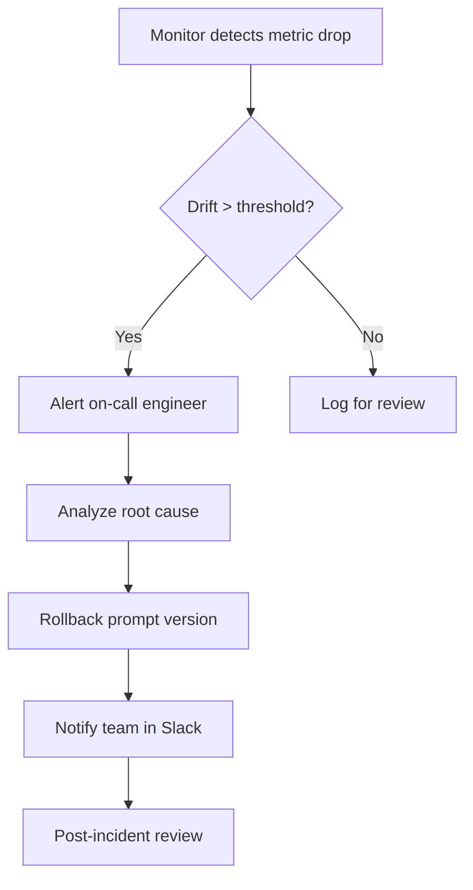
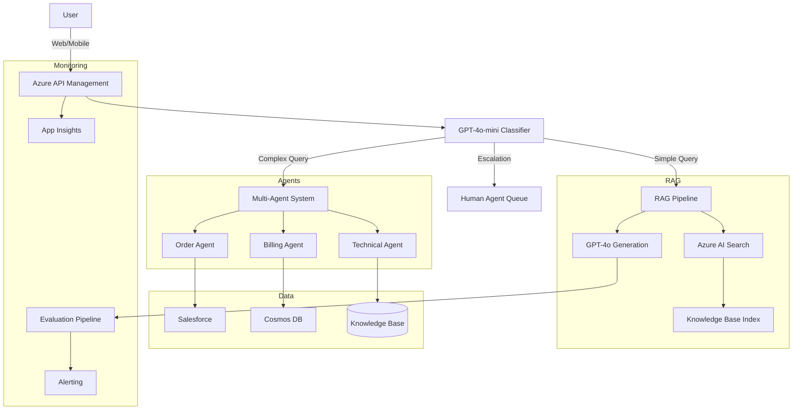
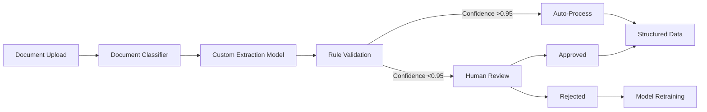
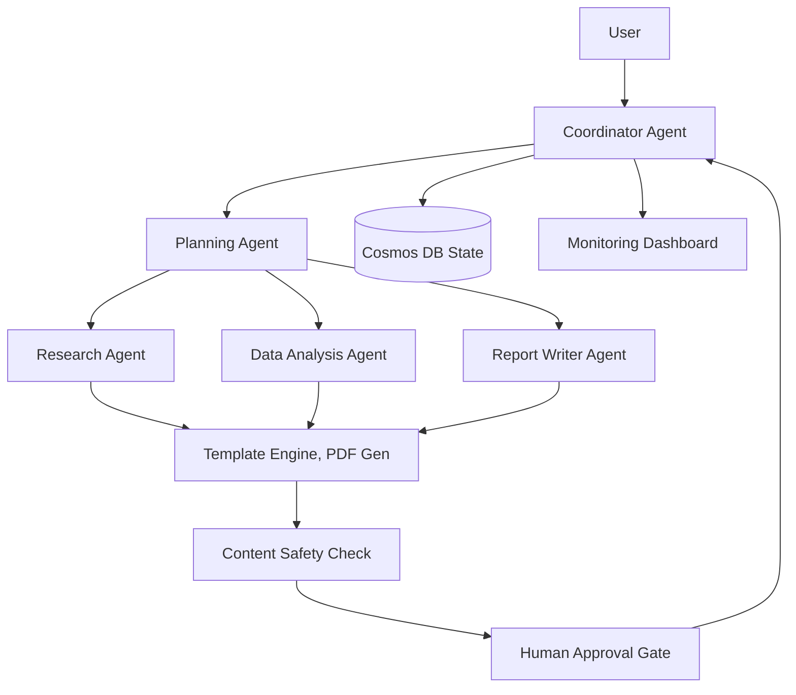

# Azure AI Foundry — Complete Interview Guide 2026

[](https://learn.microsoft.com/en-us/azure/ai-foundry/)
[](https://ai.azure.com)
[](https://learn.microsoft.com/en-us/azure/ai-services/openai/)
[]()

> **Senior AI Engineer Interview Prep** — Deep-dive into Azure AI Foundry, Azure OpenAI, Prompt Flow, RAG, Agents, Fine-tuning, Content Safety, Responsible AI, and Production LLMOps. Covers fundamentals through FAANG-level system design.

---

## Table of Contents

- [1. Azure AI Foundry Overview](#1-azure-ai-foundry-overview)
- [2. AI Hub & Projects](#2-ai-hub--projects)
- [3. Azure OpenAI Service](#3-azure-openai-service)
- [4. Prompt Engineering](#4-prompt-engineering)
- [5. Prompt Flow](#5-prompt-flow)
- [6. RAG Pattern](#6-rag-pattern-retrieval-augmented-generation)
- [7. Azure AI Search](#7-azure-ai-search)
- [8. AI Agents](#8-ai-agents)
- [9. Fine-Tuning LLMs](#9-fine-tuning-llms)
- [10. Content Safety](#10-content-safety)
- [11. Responsible AI](#11-responsible-ai)
- [12. Model Catalog](#12-model-catalog)
- [13. AI Content Understanding](#13-ai-content-understanding)
- [14. Speech Services](#14-speech-services)
- [15. Vision Services](#15-vision-services)
- [16. Evaluation & Metrics](#16-evaluation--metrics)
- [17. Security & Governance](#17-security--governance)
- [18. Cost Optimization](#18-cost-optimization)
- [19. Production LLMOps](#19-production-llmops)
- [Architecture Design Questions](#architecture-design-questions)
- [50+ Interview Questions](#50-interview-questions)
- [Cheat Sheets & References](#cheat-sheets--references)

---

## 1. Azure AI Foundry Overview

### What It Is

Azure AI Foundry (formerly Azure AI Studio) is Microsoft's unified platform for building, evaluating, deploying, and monitoring AI solutions at scale. It brings together Azure OpenAI Service, AI Services (Vision, Speech, Language), the Model Catalog, Prompt Flow, Content Safety, and Responsible AI tooling under a single portal (https://ai.azure.com) and management plane.

### Why It Exists

Before Foundry, teams had to stitch together Azure OpenAI, Cognitive Services, Machine Learning, and multiple SDKs with inconsistent APIs. Foundry provides:

- **Unified project model** — hubs, projects, shared resources
- **Integrated tooling** — Prompt Flow, evaluations, content safety
- **Centralised governance** — RBAC, networking, audit logs across all AI assets
- **Model flexibility** — OpenAI, Meta, Mistral, Cohere, and open-source models side by side

### Problem It Solves

| Problem | Solution |
|---|---|
| Fragmented AI tooling across Azure | Single portal + API surface |
| No standard way to evaluate LLM outputs | Built-in evaluators (groundedness, relevance, etc.) |
| Hard to manage prompt versions | Prompt Flow versioning |
| Complicated RBAC across AI services | Hub-level + project-level RBAC |
| No unified content safety pipeline | Integrated Content Safety + safety system messages |

### When to Use

- Building any LLM-powered application on Azure
- Enterprise teams that need governance, RBAC, and audit trails
- Multi-model scenarios (GPT-4o, Llama, Mistral in one solution)
- Teams adopting Prompt Flow for orchestration
- Production deployments requiring evaluations and monitoring

### When NOT to Use

- Simple single-API calls — the Azure OpenAI SDK alone is sufficient
- Teams already deep in another platform (LangChain, Haystack) with no Azure requirement
- Prototypes that don't need governance, evaluation, or multi-model orchestration
- On-premises-only deployments (consider local models)

### Internal Working

`
┌─────────────────────────────────────────────────────────┐
│                  Azure AI Foundry Portal                │
│  https://ai.azure.com                                   │
├────────────┬────────────┬───────────┬───────────────────┤
│   Prompt   │  Evaluate  │  Deploy   │   Monitor         │
│   Flow     │  & Metrics │  Endpoint │   & Observability │
├────────────┴────────────┴───────────┴───────────────────┤
│              AI Hub (Resource Group)                     │
│  ┌─────────┐ ┌─────────┐ ┌──────────┐ ┌──────────────┐ │
│  │ Project │ │ Project │ │  Model   │ │  Connections  │ │
│  │   A     │ │   B     │ │ Catalog  │ │  (AOAI, AI   │ │
│  │         │ │         │ │          │ │  Search,...) │ │
│  └─────────┘ └─────────┘ └──────────┘ └──────────────┘ │
└─────────────────────────────────────────────────────────┘
`

Every hub is backed by an Azure Storage account (for flow state, evaluation results), Azure AI Search (indexing), and a Key Vault (secrets). Projects inherit hub-level resources but can add project-scoped connections.

### Step-by-Step Setup

`ash
# 1. Install the Azure CLI and ML extension
az extension add --name ml -y

# 2. Create a resource group
az group create --name rg-ai-foundry --location eastus

# 3. Create an AI Hub
az ml workspace create --kind hub --resource-group rg-ai-foundry ^
    --name hub-aiml

# 4. Create an AI Project
az ml workspace create --kind project --resource-group rg-ai-foundry ^
    --name proj-customer-support --hub-id /subscriptions/.../hub-aiml

# 5. Deploy a model (e.g., GPT-4o)
az cognitiveservices account deployment create --resource-group rg-ai-foundry ^
    --name cog-aoai --deployment-name gpt-4o --model-name gpt-4o ^
    --model-version 2026-01-01 --model-format OpenAI --sku-name GlobalStandard
`

### Code Example (Python)

`python
from azure.ai.resources import AIResource, AIProject
from azure.identity import DefaultAzureCredential

credential = DefaultAzureCredential()

# Connect to AI Hub
hub = AIResource(
    resource_id="/subscriptions/.../resourceGroups/rg-ai-foundry/providers/Microsoft.MachineLearningServices/workspaces/hub-aiml",
    credential=credential,
)

# Create/Get a project
project = AIProject(name="proj-customer-support", hub=hub)
project.create_or_update()

print(f"Project ID: {project.id}")
`

### Performance Considerations

- Hub-level storage can become a bottleneck if many projects write simultaneously — use separate storage accounts for high-throughput projects.
- Model inference latency is determined by the deployment SKU (PTU vs GlobalStandard vs GlobalBatch).
- Prompt Flow execution is I/O-bound on API calls; parallelise independent nodes.

### Cost Implications

- **Hub**: Pay for underlying storage, Azure AI Search, and Key Vault.
- **Projects**: No extra cost beyond consumed resources.
- **Model inference**: Token-based (pay-as-you-go) or provisioned throughput (PTU).
- **Prompt Flow**: Execution time for managed compute (serverless Spark or Azure ML compute).

### Common Mistakes

- Creating a project without a hub — projects always require a hub.
- Over-permissioning at hub level — use project-level RBAC for finer control.
- Not planning for data residency — hub/project location determines where data is processed.
- Using default storage without encryption or VNet integration in production.

### Interview Questions

| Level | Question |
|---|---|
| Junior | What is Azure AI Foundry and how is it different from Azure AI Studio? |
| Junior | What is the relationship between an AI Hub and an AI Project? |
| Mid | How would you structure hubs and projects for a multi-team enterprise with 5 AI applications? |
| Mid | What Azure resources are created when you provision a hub? |
| Senior | Design a multi-hub strategy for a global enterprise with data residency requirements across US, EU, and Asia. |
| Senior | How do you implement network isolation for Foundry while maintaining access for developers? |

### FAANG-Level Deep Dive

**Question:** "Azure AI Foundry is just a wrapper around existing services. What value does it actually add?"

**Key points:**
- **Abstraction layer** — Foundry's project model abstracts the complexity of managing individual AOAI, Search, Storage, and Key Vault resources. A single z ml workspace create --kind project provisions and wires all dependencies.
- **Integrated evaluation** — The evaluation SDK provides judges (GPT-based, NLP-based) that work out of the box. No need to build ground-truth pipelines from scratch.
- **Prompt Flow as first-class citizen** — Flows are versioned, deployed, and monitored within the same project. This eliminates the toolchain gap between prototyping and production.
- **Unified content safety** — Safety system messages, content filters, and custom categories are configured at the hub level and enforced across all projects, ensuring consistency.
- **Cost governance** — Hub-level token budgets and usage dashboards give FinOps teams visibility into spending across multiple projects.

**Trade-offs:**
- Additional abstraction means additional latency for resource provisioning (30-60s for hub creation).
- Vendor lock-in — flows are Azure-specific; migrating to AWS Bedrock or GCP Vertex requires rewriting orchestration.
- Hub-level limits (e.g., 50 projects per hub) can force re-architecture in large enterprises.

### Explain Like I'm 7

Azure AI Foundry is like a **workshop for building robot brains**. The *hub* is the garage where you keep all your tools (drills, saws, paint). Each *project* is a different robot you're building — a helper robot, a painter robot, a storyteller robot. You can share tools between projects, but each robot gets its own instruction book. The *portal* is the window where you watch all your robots being built.

## 2. AI Hub & Projects

### What It Is

An **AI Hub** is the top-level resource container that holds shared infrastructure: Azure OpenAI connections, Azure AI Search, Storage, Key Vault, and Content Safety configurations. An **AI Project** lives inside a hub and scopes the work of a single team or application.

### Why It Exists

Enterprise AI teams need separation of concerns:
- **Hub** = platform team owns the infrastructure
- **Project** = application team owns the prompts, flows, and evaluations

This allows the platform team to enforce security, networking, and content safety policies once, while application teams retain autonomy over their AI logic.

### Problem It Solves

- Prevents teams from accidentally using prod AOAI keys in dev
- Centralises networking rules (private endpoints, firewall) at hub level
- Enables cost chargeback per project
- Simplifies auditing — all AI activity is aggregated at hub level

### When to Use

- Any multi-team or multi-application setup
- When you need separate dev/staging/prod environments
- When compliance mandates data residency or encryption at rest

### When NOT to Use

- Single application, single team — a single hub with one project is fine
- Quick prototypes — you can use the default hub auto-created by the portal

### Internal Working

`
┌───────────────────────────────────────────────────┐
│                 AI Hub                            │
│  ┌─────────────────────────────────────────────┐  │
│  │  Connections                                │  │
│  │  ├─ AOAI: gpt-4o (East US)                 │  │
│  │  ├─ AOAI: text-embedding-3-large (East US)  │  │
│  │  └─ AI Search: search-eastus                │  │
│  ├─────────────────────────────────────────────┤  │
│  │  Storage (data, flows, eval results)        │  │
│  │  Key Vault (secrets, API keys)              │  │
│  │  Content Safety (filters, custom categories)│  │
│  │  Network (Private Endpoints, FW rules)      │  │
│  └─────────────────────────────────────────────┤  │
├───────────────────────────────────────────────────┤
│  Project: Customer Support                        │
│  └─ AI Search Index: support-docs                │
│  └─ Prompt Flows: ticket-routing, auto-reply     │
│  └─ Deployments: gpt-4o endpoint                 │
├───────────────────────────────────────────────────┤
│  Project: Internal Knowledge Base                 │
│  └─ AI Search Index: hr-policy, engineering-wiki │
│  └─ Deployments: gpt-4o-mini endpoint            │
└───────────────────────────────────────────────────┘
`

### Step-by-Step Setup

`ash
# Create hub with network isolation
az ml workspace create --kind hub --resource-group rg-ai-foundry ^
    --name hub-aiml ^
    --storage-account /subscriptions/.../storageAccounts/saexp1 ^
    --key-vault /subscriptions/.../vaults/kvexp1 ^
    --file hub-network-config.json

# hub-network-config.json
# {
#   "public_network_access": "Disabled",
#   "private_endpoint_connections": [
#     { "name": "pe-hub", "private_endpoint_location": "eastus" }
#   ]
# }

# Create project with project-scoped resources
az ml workspace create --kind project --resource-group rg-ai-foundry ^
    --name proj-support ^
    --hub-id /subscriptions/.../workspaces/hub-aiml ^
    --file project-config.json

# List all projects in a hub
az ml workspace list --resource-group rg-ai-foundry ^
    --query "[?kind=='project' && hub_id.contains(@, 'hub-aiml')]"
`

### Code Example (Python)

`python
from azure.ai.resources import AIHubOperations, AIProjectOperations

hub_ops = AIHubOperations(subscription_id="...", credential=credential)
project_ops = AIProjectOperations(subscription_id="...", credential=credential)

# Create hub with custom networking
hub = hub_ops.begin_create(
    name="hub-aiml",
    resource_group="rg-ai-foundry",
    location="eastus",
    storage_account_id="/subscriptions/.../storageAccounts/saexp1",
    key_vault_id="/subscriptions/.../vaults/kvexp1",
    public_network_access="Disabled",
)

# Create project
project = project_ops.begin_create(
    name="proj-support",
    resource_group="rg-ai-foundry",
    hub_id=hub.id,
)

# Create project-scoped connection
from azure.ai.resources.entities import AzureOpenAIConnection

aoai_conn = AzureOpenAIConnection(
    name="my-gpt4o",
    api_key=key_vault.get_secret("aoai-key"),
    api_base="https://my-aoai.openai.azure.com",
    api_version="2026-01-01",
)
project.connections.create_or_update(aoai_conn)
`

### Performance Considerations

- Hub-level storage is shared — large evaluation results from one project can impact another. Use separate storage accounts for high-volume projects.
- Private endpoints add ~5ms latency to first connection (DNS resolution). Use connection pooling in production.

### Cost Implications

| Resource | Cost Driver | Typical Monthly (Enterprise) |
|---|---|---|
| Hub (no extra cost) | — | \ |
| Storage (GPv2, LRS) | Data volume | ~\-200 |
| Key Vault | API calls | ~\-50 |
| Private Endpoint | Per endpoint/hour | ~\/endpoint |

### Common Mistakes

- Putting all projects in one hub when they need different content safety policies.
- Not planning hub location — data processing must match regulatory requirements.
- Using hub-level connections when project-scoped connections are needed (e.g., staging vs prod AOAI).
- Overlooking public_network_access — default is "Enabled"; change to "Disabled" for production.

### Interview Questions

| Level | Question |
|---|---|
| Junior | What is the difference between a hub and a project? |
| Junior | How do you connect Azure OpenAI to a Foundry project? |
| Mid | How would you structure hubs for a company with 10 AI applications across 3 regions? |
| Mid | Explain hub-level vs project-level RBAC. |
| Senior | Design a hub/project architecture that supports data residency (US, EU), separate dev/prod, and cost chargeback to 4 business units. |
| Senior | How do you migrate a project from one hub to another without downtime? |

### FAANG-Level Deep Dive

**Question:** "Design a multi-hub strategy for a fintech company operating in the US and EU with strict data residency requirements."

**Key considerations:**
- **Two hubs**: hub-us (East US) and hub-eu (France Central).
- **Projects per region** per business unit: proj-us-retail, proj-us-commercial, proj-eu-retail, proj-eu-commercial.
- **Network isolation**: Each hub uses private endpoints + VNet injection. No cross-region data movement.
- **Connections**: Separate AOAI instances per hub — oai-us and oai-eu. Content Safety filters respect EU AI Act in the EU hub.
- **Cost chargeback**: Tag all resources with BusinessUnit and Project. Use Azure Cost Management + hub-level dashboards.
- **Migration**: To move a project across hubs, export the flow as JSON, recreate connections in target hub, re-index AI Search, and switch DNS.

### Explain Like I'm 7

A **hub** is like the school's art supply closet — shared paints, brushes, and paper that everyone can use. A **project** is your personal art desk where you make your own drawing. You can grab supplies from the closet (hub connections) or bring your own special markers (project connections). The art teacher (platform team) decides what kind of paint is allowed in the closet, but you decide what to draw.

## 3. Azure OpenAI Service

### What It Is

Azure OpenAI Service (AOAI) provides REST API access to OpenAI's models — GPT-4o, GPT-4.1, o3, DALL-E 3, Whisper, and embeddings — hosted on Azure infrastructure. It offers enterprise-grade security, RBAC, private networking, and compliance certifications that the public OpenAI API does not.

### Why It Exists

Enterprises need:
- **Data residency** — models run in Azure regions (East US, France Central, etc.)
- **Compliance** — ISO 27001, SOC 2, HIPAA, FedRAMP
- **Managed identity** — no API keys in code
- **Content filtering** — built-in safety system with configurable severity thresholds
- **PTU (Provisioned Throughput Units)** — guaranteed latency for production workloads

### Problem It Solves

Public OpenAI API lacks enterprise controls. AOAI brings the same models under Azure's governance framework, allowing organisations to use GPT-4o without violating compliance policies.

### When to Use

- Enterprise applications requiring compliance (HIPAA, GDPR, FedRAMP)
- Production workloads needing predictable latency (use PTU)
- Multi-region deployments with data residency requirements
- Applications already on Azure (lower latency, no egress costs)

### When NOT to Use

- When the public OpenAI API offers models not yet on Azure (e.g., immediate access to latest release)
- For non-critical workloads where PTU cost doesn't justify latency benefits
- When the application is not on Azure and has no compliance requirements

### Internal Working

`
┌─────────────────────────────────────────────────────┐
│                  Azure OpenAI Service                │
├─────────────────────────────────────────────────────┤
│  ┌─────────────┐  ┌─────────────┐  ┌───────────┐   │
│  │  GPT-4o     │  │  GPT-4.1    │  │  o3       │   │
│  │  (Chat)     │  │  (Chat)     │  │  (Reason)  │   │
│  ├─────────────┤  ├─────────────┤  ├───────────┤   │
│  │  Embeddings │  │  DALL-E 3   │  │  Whisper  │   │
│  │  text-      │  │  (Image     │  │  (Audio   │   │
│  │  embedding-3│  │  Gen)       │  │  STT)     │   │
│  └─────────────┘  └─────────────┘  └───────────┘   │
├─────────────────────────────────────────────────────┤
│  Deployment Types: GlobalStandard | GlobalBatch |   │
│                    DataZoneStandard | PTU            │
├─────────────────────────────────────────────────────┤
│  Content Filters: Default | Custom (Low/Med/High)   │
│  Abuse Monitoring: On | Off (limited regions)       │
│  Network: Public | Private Endpoints | Restricted   │
└─────────────────────────────────────────────────────┘
`

### Step-by-Step Setup

`ash
# 1. Create AOAI resource
az cognitiveservices account create --resource-group rg-ai-foundry ^
    --name cog-aoai --location eastus --kind OpenAI --sku S0

# 2. Deploy models
az cognitiveservices account deployment create --resource-group rg-ai-foundry ^
    --name cog-aoai --deployment-name gpt-4o --model-name gpt-4o ^
    --model-version 2026-01-01 --model-format OpenAI --sku-name GlobalStandard --sku-capacity 10K

# 3. Deploy embedding model
az cognitiveservices account deployment create --resource-group rg-ai-foundry ^
    --name cog-aoai --deployment-name text-embedding-3-large ^
    --model-name text-embedding-3-large --model-version 1 ^
    --model-format OpenAI --sku-name GlobalStandard --sku-capacity 10K

# 4. List deployments
az cognitiveservices account deployment list --resource-group rg-ai-foundry ^
    --name cog-aoai --query "[].{Name:name, Model:model.name, SKU:sku.name}"
`

### Code Example (Python)

`python
from openai import AzureOpenAI
from azure.identity import DefaultAzureCredential, get_bearer_token_provider

# Option 1: API Key
client = AzureOpenAI(
    api_key="...",
    api_version="2026-01-01",
    azure_endpoint="https://cog-aoai.openai.azure.com",
)

# Option 2: Managed Identity (production)
token_provider = get_bearer_token_provider(
    DefaultAzureCredential(), "https://cognitiveservices.azure.com/.default"
)
client = AzureOpenAI(
    azure_ad_token_provider=token_provider,
    api_version="2026-01-01",
    azure_endpoint="https://cog-aoai.openai.azure.com",
)

# Chat Completion
response = client.chat.completions.create(
    model="gpt-4o",
    messages=[
        {"role": "system", "content": "You are a helpful assistant."},
        {"role": "user", "content": "What is Azure AI Foundry?"},
    ],
    temperature=0.7,
    max_tokens=1000,
)

print(response.choices[0].message.content)

# Streaming
stream = client.chat.completions.create(
    model="gpt-4o",
    messages=[{"role": "user", "content": "Tell me a story"}],
    stream=True,
)
for chunk in stream:
    if chunk.choices[0].delta.content:
        print(chunk.choices[0].delta.content, end="")

# Embeddings
response = client.embeddings.create(
    model="text-embedding-3-large",
    input="Azure AI Foundry is a unified platform.",
    dimensions=256,
)
embedding = response.data[0].embedding

# DALL-E
response = client.images.generate(
    model="dalle3",
    prompt="A futuristic city skyline at sunset, digital art",
    n=1,
    size="1024x1024",
)
image_url = response.data[0].url

# Whisper
with open("audio.mp3", "rb") as audio:
    response = client.audio.transcriptions.create(
        model="whisper", file=audio
    )
print(response.text)
`

### Token Limits & Context Windows (2026)

| Model | Context Window | Max Output Tokens | Knowledge Cutoff |
|---|---|---|---|
| GPT-4o | 128K | 16,384 | Oct 2024 |
| GPT-4.1 | 1M | 32,768 | Jan 2026 |
| o3 | 200K | 100K | Oct 2025 |
| o4-mini | 200K | 50K | Jan 2026 |
| GPT-4o-mini | 128K | 16,384 | Oct 2024 |
| text-embedding-3-large | 8,191 (input) | 3,072 (dimensions) | — |

### Performance Considerations

- **PTU vs GlobalStandard**: PTU provides reserved capacity with <100ms latency at high throughput. GlobalStandard shares capacity and can see throttling under load.
- **Token limits**: Monitor 
emaining_tokens in rate limit headers. Implement exponential backoff.
- **Batch processing**: Use GlobalBatch for cost-effective bulk processing (50% discount, best-effort latency).
- **Streaming**: Always use streaming for chat UX to reduce perceived latency.
- **Pre-fill caching**: GPT-4.1 supports prefix caching — repeated system prompts don't recompute KV cache, saving ~50% cost for long system messages.

### Cost Implications

| Model | Input (per 1K tokens) | Output (per 1K tokens) |
|---|---|---|
| GPT-4o | \.50 | \.00 |
| GPT-4o (GlobalBatch) | \.25 | \.00 |
| GPT-4.1 | \.00 | \.00 |
| o3 | \.00 | \.00 |
| GPT-4o-mini | \.15 | \.60 |
| text-embedding-3-large | \.13 | — |

**PTU costs**: ~\-100/hour per 100 PTU depending on model.

### Common Mistakes

- Using API keys in code (use managed identity).
- Not setting max_tokens — defaults may be too low for complex tasks.
- Using the wrong deployment type (e.g., GlobalStandard for latency-sensitive apps that need PTU).
- Ignoring rate limit headers — causes 429 errors under load.
- Not validating content filter responses — filtered content returns error code 400 with content_filter_result.

### Content Filtering

`python
response = client.chat.completions.create(
    model="gpt-4o",
    messages=[{"role": "user", "content": "harmful content here"}],
)
# If filtered:
# response.choices[0].finish_reason == "content_filter"
# Check response.choices[0].content_filter_results
# {
#   "hate": {"filtered": true, "severity": "high"},
#   "self_harm": {"filtered": false, "severity": "safe"}
# }
`

### Interview Questions

| Level | Question |
|---|---|
| Junior | What models are available in Azure OpenAI Service? |
| Junior | How do you authenticate to Azure OpenAI? |
| Mid | Explain the difference between GlobalStandard and PTU deployments. |
| Mid | How does content filtering work in AOAI? |
| Mid | What's the difference between GPT-4o, GPT-4.1, and o3? |
| Senior | How would you design a multi-region AOAI deployment for an app serving global users with <200ms P95 latency? |
| Senior | Describe how prefix caching works in GPT-4.1 and how you would optimise prompts to leverage it. |
| Senior | How do you handle token rate limiting at enterprise scale with hundreds of concurrent users? |

### FAANG-Level Deep Dive

**Question:** "Design a real-time AI chat service for a global e-commerce platform using Azure OpenAI. Handle 10,000 concurrent users with <3 second p95 response time."

**Architecture:**
- **Multi-region active-active**: Deploy AOAI in East US, West Europe, Southeast Asia.
- **Global traffic manager**: Azure Traffic Manager with performance routing to closest region.
- **PTU per region**: 500 PTU of GPT-4o per region to guarantee throughput.
- **Pre-fill caching**: System prompt cached via prefix caching (GPT-4.1). Estimated 60% KV cache hit rate.
- **Streaming**: Server-Sent Events (SSE) for progressive output rendering.
- **Semantic cache**: Redis-based semantic cache for common questions (Tier 1: exact match, Tier 2: cosine similarity >0.95).
- **Fallback**: If PTU exhausted, fall back to GlobalStandard with queueing.
- **Cost**: ~\/month for 3 x 500 PTU + token costs + Redis.

**Trade-offs:**
- PTU is expensive but necessary for latency SLA.
- Semantic cache improves latency but risks stale responses.
- Multi-region adds complexity for session management and data consistency.

### Explain Like I'm 7

Azure OpenAI Service is like a **super-smart robot library**. You can ask the robots questions (GPT-4o), have them draw pictures (DALL-E), write down what people say (Whisper), or think really hard about math problems (o3). The library is in Azure's building, so it's safe and follows all the rules. You can either wait in line with everyone else (GlobalStandard) or reserve your own personal robot (PTU).

## 4. Prompt Engineering

### What It Is

Prompt engineering is the practice of designing inputs (prompts) to LLMs to produce desired outputs reliably. It encompasses system messages, few-shot examples, chain-of-thought reasoning, role prompting, and structured output formatting.

### Why It Exists

LLMs are stochastic — the same input can produce different outputs. Prompt engineering provides techniques to:
- Increase output consistency
- Enforce output structure (JSON, XML, markdown)
- Reduce hallucination
- Control tone, style, and safety

### Problem It Solves

Without prompt engineering, LLM outputs are unpredictable. A well-engineered prompt turns the LLM from a raw text generator into a reliable, controllable component.

### When to Use

- **Every** LLM interaction in production. No exceptions.
- Especially important for system prompts (the instruction layer before any user input).

### When NOT to Use

- For deterministic tasks where fine-tuning or a rule-based system would be more reliable.
- When the user input is already highly structured and the model's default behaviour is sufficient.

### Prompt Template Patterns

<details>
<summary><b>System Prompt Template</b></summary>

`markdown
You are an expert {role}. Your task is to {task_description}.

## Guidelines
- Always respond in {language}.
- Use {tone} tone.
- Format output as {format}.
- If you don't know the answer, say "I don't know" — do not make up information.
- Never include personal opinions.

## Safety Rules
- Do not generate harmful, offensive, or misleading content.
- If asked about {off_limits_topic}, politely decline.

## Context
{relevant_context}
`

</details>

<details>
<summary><b>Few-Shot Template</b></summary>

`python
messages = [
    {"role": "system", "content": "Classify customer queries as Billing, Technical, or General."},
    {"role": "user", "content": "My card was charged twice."},
    {"role": "assistant", "content": "Billing"},
    {"role": "user", "content": "How do I reset my password?"},
    {"role": "assistant", "content": "Technical"},
    {"role": "user", "content": "What are your store hours?"},
    {"role": "assistant", "content": "General"},
    {"role": "user", "content": "I need a refund for order #12345"},
    # Model will predict: Billing
]
`

</details>

<details>
<summary><b>Chain-of-Thought Template</b></summary>

`python
messages = [
    {"role": "system", "content": "Solve math problems step-by-step."},
    {"role": "user", "content": "A bakery sells 24 cupcakes per hour. It's open 8 hours a day. How many cupcakes does it sell in 5 days?"},
    {"role": "assistant", "content": "Let me think step by step:\n1. Cupcakes per day = 24 x 8 = 192\n2. Cupcakes in 5 days = 192 x 5 = 960\nTherefore, the bakery sells 960 cupcakes in 5 days."},
]
`

</details>

<details>
<summary><b>Structured Output (JSON Mode)</b></summary>

`python
response = client.chat.completions.create(
    model="gpt-4o",
    messages=[
        {"role": "system", "content": "Extract information as JSON with keys: name, date, amount, category."},
        {"role": "user", "content": "Paid \.99 for Netflix on March 15th"},
    ],
    response_format={"type": "json_object"},
)

# Output: {"name": "Netflix", "date": "2026-03-15", "amount": 45.99, "category": "Entertainment"}
`

</details>

### Code Example (Python) — Prompt Template System

`python
from string import Template
from dataclasses import dataclass, asdict

@dataclass
class PromptTemplate:
    system_template: str
    user_template: str

    def render(self, **kwargs) -> list[dict]:
        return [
            {"role": "system", "content": Template(self.system_template).safe_substitute(kwargs)},
            {"role": "user", "content": Template(self.user_template).safe_substitute(kwargs)},
        ]

SUPPORT_TEMPLATE = PromptTemplate(
    system_template="You are a \ support agent for \. Be \.",
    user_template="Customer question: \\nContext: \",
)

messages = SUPPORT_TEMPLATE.render(
    level="senior",
    company="Acme Corp",
    tone="professional but friendly",
    question="How do I cancel my subscription?",
    context="Customer has premium plan, last payment Jan 2026",
)

response = client.chat.completions.create(model="gpt-4o", messages=messages)
`

### Performance Considerations

- **System prompt length**: Longer system prompts increase latency and cost. Keep under 2K tokens if possible.
- **Few-shot count**: 3-5 examples is usually optimal. More than 10 can confuse the model.
- **Temperature**: Use 0.0-0.3 for deterministic tasks (classification, extraction). Use 0.7-0.9 for creative tasks.
- **Prefix caching**: GPT-4.1 caches KV for repeated prefixes. Structure prompts so the system message is a shared prefix across all calls.

### Cost Implications

- Every token in the prompt costs money. Few-shot examples add cost per inference.
- A 2K-token system prompt adds ~\.005 per call with GPT-4o. Over 1M calls/month = \,000 just for the prompt prefix.
- Strategy: Keep prompts minimal, use GPT-4o-mini for pre-processing, and only call GPT-4o for the final generation.

### Common Mistakes

- Over-prompting — too many rules confuse the model and increase latency.
- Exposing prompt structure in user-facing output (injection risk).
- Not testing prompts with edge cases (empty input, adversarial input, off-topic queries).
- Assuming the model follows instructions perfectly — always validate outputs.
- Hard-coding prompts — use templates stored in config files or a prompt registry.

### Interview Questions

| Level | Question |
|---|---|
| Junior | What is prompt engineering and why is it important? |
| Junior | What's the difference between system prompt and user prompt? |
| Mid | How would you design a prompt to extract structured data (JSON) from unstructured text? |
| Mid | Explain chain-of-thought prompting and when you'd use it. |
| Senior | Compare prompt engineering vs fine-tuning for improving model performance on a specific task. |
| Senior | How would you build a prompt management system for a team of 20 engineers? Cover versioning, testing, and deployment. |
| Senior | Describe how you would protect against prompt injection — both direct and indirect. |

### FAANG-Level Deep Dive

**Question:** "Design a prompt engineering system for a customer support chatbot that handles 10,000+ intents with >95% accuracy."

**Approach:**
1. **Intent classification** (GPT-4o-mini): System prompt with 50 high-level categories and 3-shot per category. Temperature = 0.
2. **Structured extraction** (GPT-4o-mini): Extract entities (order ID, product, issue type) into JSON using 
esponse_format.
3. **Response generation** (GPT-4o): Based on intent + entities + internal knowledge base context via RAG.
4. **Validation layer**: Rule-based checks on output (e.g., "If intent is refund, response must include refund amount and timeline").
5. **Fallback system**: If confidence <0.7, escalate to human agent.

**Prompt optimisation:**
- A/B test 5 prompt variants per intent.
- Track "first response resolution" metric per prompt version.
- Use Azure AI Evaluation SDK to run nightly batch evaluations against ground truth.

### Explain Like I'm 7

Prompt engineering is like **giving instructions to a very smart but very literal friend**. If you say "tell me about dogs", they might tell you anything. But if you say "You are a dog expert. List 5 dog breeds suitable for apartments. For each breed, give the size, energy level, and barking tendency. Format as a table." — then they'll give you exactly what you want, every time.

## 5. Prompt Flow

### What It Is

Prompt Flow is a visual designer and SDK for building, testing, evaluating, and deploying LLM orchestration pipelines. Flows consist of nodes (LLM calls, Python scripts, tools) connected by edges, creating a directed acyclic graph (DAG).

### Why It Exists

Building LLM applications involves multiple steps: call LLM, parse output, call search, call LLM again, validate, format. Managing this in code becomes spaghetti. Prompt Flow provides declarative orchestration with built-in evaluation, tracing, and deployment.

### Problem It Solves

- **Orchestration complexity** — chains of LLM calls, tools, and conditional logic
- **Evaluation** — no standard way to measure LLM output quality
- **Versioning** — tracking which prompt version produced which output
- **Deployment** — deploying flows as REST endpoints without writing infrastructure code

### When to Use

- Multi-step LLM pipelines (RAG, multi-agent, data extraction)
- Teams that need evaluation and monitoring out of the box
- When you want to iterate on prompts quickly with a visual designer

### When NOT to Use

- Single LLM call with no orchestration — just use the SDK directly
- Very complex conditional branching — custom code may be clearer
- When you need maximum performance — the flow engine adds ~10-50ms overhead per node

### Internal Working

```
+--------------------------------------------------------+
|                    Prompt Flow                          |
+--------------------------------------------------------+
|  +----------+    +----------+    +----------+          |
|  |  Input   |--->| LLM Node |--->| Python   |         |
|  |  Node    |    | (GPT-4o) |    | Tool     |         |
|  +----------+    +----------+    +----+-----+          |
|                                       |                |
|                          +------------v------+         |
|                          |  Condition Node    |         |
|                          |  (if score > 0.8)  |         |
|                          +----+-----------+--+         |
|                               |           |            |
|                    +----------v+  +-------v------+     |
|                    | LLM Node  |  | Human Review  |     |
|                    | (Improve)  |  | Node          |     |
|                    +----------+  +-------+------+     |
|                                         |             |
|                          +--------------v-------+       |
|                          |    Output Node     |       |
|                          +--------------------+       |
+--------------------------------------------------------+
```

### Step-by-Step Setup

```bash
# 1. Install Prompt Flow CLI
pip install promptflow promptflow-tools

# 2. Create a new flow
pf flow init --flow my-rag-flow --type standard

# 3. Test locally
pf flow test --flow my-rag-flow --inputs question="What is RAG?"

# 4. Create evaluation flow
pf flow init --flow my-eval-flow --type evaluation

# 5. Run evaluation
pf run create --flow my-rag-flow --data eval-data.jsonl --stream

# 6. Deploy as managed endpoint
pf flow deploy --flow my-rag-flow --name rag-endpoint --type managed
```

### Code Example — Flow Definition (YAML)

```yaml
inputs:
  question:
    type: string
outputs:
  answer:
    type: string
    reference: ${format_answer.output}
nodes:
  - name: search_docs
    type: python
    source:
      type: code
      path: search_docs.py
    inputs:
      question: ${inputs.question}
  - name: build_prompt
    type: prompt
    source:
      type: code
      path: build_prompt.jinja2
    inputs:
      context: ${search_docs.output}
      question: ${inputs.question}
  - name: call_llm
    type: llm
    provider: AzureOpenAI
    connection: aoai_connection
    api: chat
    inputs:
      deployment_name: gpt-4o
      max_tokens: 1024
      temperature: 0.3
      prompt: ${build_prompt.output}
  - name: format_answer
    type: python
    source:
      type: code
      path: format_answer.py
    inputs:
      llm_output: ${call_llm.output}
```

### Managed vs Custom Compute

| Aspect | Managed (Serverless) | Custom (Azure ML Compute) |
|---|---|---|
| Setup | Zero config | Requires compute cluster |
| Scaling | Auto-scale | Manual / auto-scale config |
| Cost | Pay per execution | Pay per node hour |
| Python deps | Pre-built env | Custom conda/docker env |
| Cold start | ~30s | 0s (if cluster running) |
| Best for | Dev/test, low-volume prod | High-volume production |

### Performance Considerations

- **Node parallelism**: Independent nodes run in parallel by default.
- **Caching**: Flow outputs are cached per input hash. Re-run only changed nodes.
- **Streaming mode**: Use streaming for real-time output.
- **Batch processing**: Use with large JSONL datasets for parallel processing.

### Cost Implications

- Managed compute: ~$0.15-0.50 per flow execution.
- Custom compute: ~$100-500/month per node if always on.
- Evaluation runs: Each test case invokes the entire flow + evaluation LLM call.

### Common Mistakes

- Making flows too wide (many parallel nodes) — increases cost without proportional quality gain.
- Not using caching during development — slow iteration.
- Hard-coding model names in flow YAML — use connections.
- Deploying without testing with production-like data volume (cold start issues).

### Interview Questions

| Level | Question |
|---|---|
| Junior | What is Prompt Flow and how does it differ from calling Azure OpenAI directly? |
| Junior | What types of nodes can you use in a flow? |
| Mid | How would you build a RAG flow in Prompt Flow? What are the key nodes? |
| Mid | Explain how evaluation flows work in Prompt Flow. |
| Senior | Design a Prompt Flow pipeline for multi-step document processing. |
| Senior | Compare managed vs custom compute for 100K requests/day. |
| Senior | How do you version, test, and deploy flows in CI/CD? |

### FAANG-Level Deep Dive

**Question:** "Design a Prompt Flow-based system for processing 1M insurance claims per day with human-in-the-loop."

**Architecture:**
1. **Ingestion flow** (batch, GPT-4o-mini): Extract claim fields from documents.
2. **Validation flow** (real-time, GPT-4o): Validate against policy rules. Output confidence score.
3. **Routing node**: If >0.95 auto-approve. If 0.7-0.95 human review. If <0.7 reject.
4. **Human review flow**: Logic Apps -> human agent -> decision -> update.
5. **Evaluation flow**: Nightly batch eval of 10K samples against human-reviewed ground truth.

### Explain Like I'm 7

Prompt Flow is like a **factory assembly line for robot instructions**. You put ingredients in at one end, the conveyor belt takes it through stations (search, ask GPT, check quality, format), and a finished product comes out.

## 6. RAG Pattern (Retrieval Augmented Generation)

### What It Is

RAG (Retrieval Augmented Generation) is a pattern where an LLM is augmented with relevant documents retrieved from a knowledge base at query time. The model generates answers grounded in retrieved context rather than relying solely on its training data.

### Why It Exists

LLMs hallucinate and have stale knowledge. RAG provides:
- **Grounding** — answers are based on retrieved documents, reducing hallucination
- **Freshness** — documents can be updated without retraining
- **Attribution** — every answer can cite its source
- **Domain adaptation** — bring private knowledge into the model without fine-tuning

### Problem It Solves

| Problem | RAG Solution |
|---|---|
| Hallucination | Model is grounded in retrieved context |
| Stale training data | Always query latest indexed documents |
| Private knowledge | Index internal docs without leaking them into model weights |
| Compliance | Need to cite sources for regulated industries (finance, healthcare) |
| Cost | No fine-tuning needed; can use smaller models with good retrieval |

### When to Use

- Question answering over private documents
- Customer support with product manuals, policies
- Legal/medical document querying
- Code documentation assistants
- Any scenario requiring source attribution

### When NOT to Use

- When the model already knows everything needed (general knowledge QA without specific docs)
- When latency is critical — retrieval adds 100-500ms
- When documents change every few seconds — re-indexing overhead is too high
- When queries require reasoning across hundreds of documents — the context window may not fit

### Internal Working

```
                        Query
                          |
                    ┌─────▼──────┐
                    │  Query     │
                    │  Expansion │ (optional: generate sub-queries)
                    └─────┬──────┘
                          |
               ┌──────────▼──────────┐
               │   Embedding Model   │ (text-embedding-3-large)
               │   + Vector Search   │
               └──────────┬──────────┘
                          |
               ┌──────────▼──────────┐
               │   Hybrid Search     │ (vector + keyword + semantic)
               │   + Re-ranking      │
               └──────────┬──────────┘
                          |
               ┌──────────▼──────────┐
               │   Context Assembly  │ (format into prompt)
               └──────────┬──────────┘
                          |
                    ┌─────▼──────┐
                    │  LLM       │
                    │  Generation│
                    └─────┬──────┘
                          |
                     ┌────▼────┐
                     │  Output │
                     │ + Cites │
                     └─────────┘
```

### Step-by-Step Setup

```bash
# 1. Create Azure AI Search
az search service create --resource-group rg-ai-foundry ^
    --name search-rag --sku standard --location eastus

# 2. Create index with vector search
az search index create --service-name search-rag ^
    --name knowledge-base --fields @index-schema.json

# 3. Index documents
python index_docs.py

# 4. Test search
az search query --service-name search-rag --index-name knowledge-base ^
    --search "What is the return policy?"
```

### Code Example (Python) — Complete RAG

```python
from openai import AzureOpenAI
from azure.search.documents import SearchClient
from azure.core.credentials import AzureKeyCredential

class RAGPipeline:
    def __init__(self, aoai_endpoint, search_endpoint, search_key, index_name):
        self.llm = AzureOpenAI(
            azure_endpoint=aoai_endpoint,
            api_version="2026-01-01",
            api_key=search_key,
        )
        self.search = SearchClient(
            endpoint=search_endpoint,
            index_name=index_name,
            credential=AzureKeyCredential(search_key),
        )

    def query(self, question: str, top_k: int = 5) -> dict:
        search_results = self.search.search(question, top=top_k)
        docs = [{"content": r["content"], "title": r.get("title", ""), "score": r["@search.score"]}
                for r in search_results]

        context = "\n\n".join([f"Document: {d['title']}\n{d['content']}" for d in docs])

        response = self.llm.chat.completions.create(
            model="gpt-4o",
            messages=[
                {"role": "system", "content": (
                    "You are a helpful assistant. Answer the question based on the provided context. "
                    "If the context doesn't contain the answer, say 'I cannot find this in the provided documents.' "
                    "Cite the document title and score for each claim.\n\n"
                    f"Context:\n{context}"
                )},
                {"role": "user", "content": question},
            ],
            temperature=0.3,
        )

        return {
            "answer": response.choices[0].message.content,
            "sources": [{"title": d["title"], "score": d["score"]} for d in docs],
        }

rag = RAGPipeline(
    aoai_endpoint="https://cog-aoai.openai.azure.com",
    search_endpoint="https://search-rag.search.windows.net",
    search_key="...",
    index_name="knowledge-base",
)
result = rag.query("What is the return policy for electronics?")
print(result["answer"])
print("Sources:", result["sources"])
```

### Chunking Strategies

| Strategy | Chunk Size | Overlap | Best For |
|---|---|---|---|
| Fixed-size | 512 tokens | 128 tokens | General purpose |
| Sentence-based | Variable | 1 sentence | Narrative text |
| Paragraph-based | 1-3 paragraphs | 0 | Well-structured docs |
| Semantic (LLM-based) | Variable | Variable | Complex content |
| Recursive splitter | 1024 to 512 to 256 | 10% | Code, mixed content |

```python
from langchain_text_splitters import RecursiveCharacterTextSplitter

splitter = RecursiveCharacterTextSplitter(
    chunk_size=1024,
    chunk_overlap=128,
    separators=["\n\n", "\n", ".", " ", ""],
)
chunks = splitter.split_text(document)
```

### Advanced RAG Techniques

- **Query rewriting**: Use a small LLM to rewrite user queries for better retrieval (e.g., "it" to "the return policy")
- **HyDE (Hypothetical Document Embedding)**: Generate a hypothetical perfect document, then use its embedding for search
- **Self-RAG**: Generate initial answer, then do a second retrieval to verify claims
- **Agentic RAG**: Give the LLM search tools so it decides when and how to retrieve
- **Multi-hop RAG**: For questions requiring multiple retrieval steps (e.g., "What is the CEO's alma mater?" -> find CEO -> find university)

### Performance Considerations

- **Embedding latency**: ~50-100ms per query. Batch embeddings for bulk indexing.
- **Search latency**: Vector search ~50ms, hybrid ~100ms, semantic reranking adds ~200ms.
- **Context window**: Keep assembled context under 50K tokens to avoid hitting limits and reduce cost.
- **Cache**: Cache embeddings for frequent queries. Cache full LLM responses for identical queries.

### Cost Implications

| Component | Cost (per 1M queries) |
|---|---|
| Embedding (text-embedding-3-large) | ~$130 |
| Vector search (Standard S1) | ~$250 |
| LLM generation (GPT-4o, 500 tokens) | ~$5,000 |
| Total (approximate) | ~$5,380 |

### Common Mistakes

- Poor chunking — too large (misses specific answers) or too small (loses context).
- Not re-ranking — vector search alone misses keyword matches and vice versa.
- No citation in output — users can't verify answers.
- Not handling empty retrieval — model will hallucinate if no docs found.
- Indexing without cleaning (boilerplate HTML, irrelevant metadata).

### Interview Questions

| Level | Question |
|---|---|
| Junior | What is RAG and why is it useful? |
| Junior | What is a vector embedding and how is it used in RAG? |
| Mid | Explain the complete RAG pipeline from query to answer. |
| Mid | Compare different chunking strategies and when to use each. |
| Senior | Design a RAG system that handles multi-hop questions. |
| Senior | How would you implement a RAG system for a global company with documents in 50 languages? |
| Senior | How do you evaluate the quality of a RAG system? What metrics matter? |

### FAANG-Level Deep Dive

**Question:** "Design a RAG system for a global law firm with 10M documents across 10 practice areas, serving 5,000 lawyers globally. Sub-second query latency, >95% answer accuracy, full audit trail."

**Architecture:**
- **Indexing pipeline**: Azure Data Factory -> Document Intelligence (OCR) -> Chunking (sentence-based, 768 tokens) -> Embedding (text-embedding-3-large) -> Azure AI Search (vector + hybrid).
- **Search tier**: Azure AI Search with 3 partitions, 3 replicas (Standard S3). Semantic reranking enabled.
- **Per-practice-area indexes**: 10 separate indexes for isolation. Router maps query to correct index based on detected practice area.
- **Query processing**: Throttle -> authenticate -> classify practice area -> rewrite query (LLM) -> vector + keyword search -> semantic rerank -> top 10 chunks.
- **Generation**: GPT-4o with business-specific system prompt. Add jurisdiction-specific disclaimers.
- **Audit**: Every query, retrieved document, and generated answer logged to Azure Cosmos DB with lawyer ID, timestamp, and case number.
- **Latency budget**: 800ms total: 50ms auth -> 100ms classification -> 50ms query rewrite -> 150ms search -> 200ms rerank -> 250ms LLM generation.

**Trade-offs:**
- Separate indexes vs one large index: Better isolation but more management overhead.
- Global vs regional deployment: Law firms need data residency; deploy per-region.

### Explain Like I'm 7

RAG is like **giving the robot a textbook before asking it a question**. Instead of the robot guessing the answer (and sometimes making things up), you first find the right page in the textbook, then the robot reads that page and answers based on what it says. If the answer isn't in the textbook, the robot says "I don't know" instead of guessing.
## 7. Azure AI Search

### What It Is

Azure AI Search (formerly Cognitive Search) is a cloud search service that provides full-text, vector, and hybrid search over indexed content. It integrates with Azure OpenAI embeddings, supports semantic reranking, and can be used as the retrieval backend for RAG systems.

### Why It Exists

Traditional databases (SQL, Cosmos DB) are poor at relevance-ranked text search. Azure AI Search provides BM25 full-text search + vector similarity search + semantic understanding in a single service, purpose-built for information retrieval.

### Problem It Solves

- **Multi-modal search**: Vector, keyword, and hybrid in one query
- **Relevance tuning**: Scoring profiles, boosting, semantic reranking
- **Index lifecycle**: Incremental indexing, skillsets for enrichment
- **Scale**: Handles billions of documents with sub-second latency

### When to Use

- Any RAG system on Azure
- Enterprise search (internal knowledge base, document portals)
- E-commerce product search with vector + keyword
- Content enrichment pipelines (OCR, translation, entity extraction)

### When NOT to Use

- Simple key-value lookups (use Cosmos DB or Table Storage)
- Real-time transactional search with frequent writes (use Elasticsearch with Azure)
- When you only need vector search without Azure ecosystem (consider Pinecone, Weaviate)

### Index Schema (Vector + Hybrid)

```json
{
  "name": "knowledge-base",
  "fields": [
    {"name": "id", "type": "Edm.String", "key": true},
    {"name": "title", "type": "Edm.String", "searchable": true},
    {"name": "content", "type": "Edm.String", "searchable": true, "analyzer": "en.microsoft"},
    {"name": "category", "type": "Edm.String", "filterable": true, "facetable": true},
    {"name": "author", "type": "Edm.String", "filterable": true},
    {"name": "last_updated", "type": "Edm.DateTimeOffset", "sortable": true, "filterable": true},
    {"name": "content_vector", "type": "Collection(Edm.Single)", "dimensions": 3072,
     "vectorSearchProfile": "vector-profile"},
    {"name": "title_vector", "type": "Collection(Edm.Single)", "dimensions": 3072,
     "vectorSearchProfile": "vector-profile"}
  ],
  "vectorSearch": {
    "algorithms": [
      {"name": "hnsw-config", "kind": "hnsw",
       "hnswParameters": {"metric": "cosine", "m": 4, "efConstruction": 400, "efSearch": 500}}
    ],
    "profiles": [
      {"name": "vector-profile", "algorithm": "hnsw-config"}
    ]
  },
  "semantic": {
    "configurations": [
      {"name": "semantic-config",
       "prioritizedFields": {
         "titleField": {"fieldName": "title"},
         "prioritizedContentFields": [{"fieldName": "content"}],
         "prioritizedKeywordsFields": [{"fieldName": "category"}]
       }}
    ]
  }
}
```

### Code Example (Python) — Hybrid Search

```python
from azure.search.documents import SearchClient
from azure.search.documents.models import VectorSearchOptions, VectorFilterMode
from openai import AzureOpenAI

class HybridSearch:
    def __init__(self, search_client: SearchClient, embedding_client: AzureOpenAI):
        self.client = search_client
        self.embedder = embedding_client

    def search(self, query: str, top: int = 10, filters: str = None):
        embedding_response = self.embedder.embeddings.create(
            model="text-embedding-3-large",
            input=query,
            dimensions=3072,
        )
        query_vector = embedding_response.data[0].embedding

        results = self.client.search(
            search_text=query,
            vector_queries=[{
                "kind": "vector",
                "vector": query_vector,
                "fields": "content_vector",
                "k": 50,
            }],
            top=top,
            filter=filters,
            query_type="semantic",
            semantic_configuration_name="semantic-config",
            vector_filter_mode=VectorFilterMode.PRE_FILTER,
            select=["id", "title", "content", "category"],
        )

        return [{
            "id": r["id"],
            "title": r["title"],
            "content": r["content"][:500],
            "score": r["@search.score"],
            "reranker_score": r.get("@search.rerankerScore"),
        } for r in results]
```

### Scoring Profiles

```json
{
  "scoringProfiles": [
    {
      "name": "boost-title-and-recency",
      "text": {
        "weights": {
          "title": 5,
          "content": 1
        }
      },
      "functions": [
        {
          "type": "freshness",
          "fieldName": "last_updated",
          "boost": 2,
          "freshness": {
            "boostingDuration": "P30D"
          }
        }
      ],
      "functionAggregation": "sum"
    }
  ]
}
```

### Semantic Ranking vs Vector Search

| Aspect | Vector Search | Semantic Reranking |
|---|---|---|
| How it works | Cosine similarity on embeddings | Cross-encoder model (Microsoft) |
| Latency | ~20-50ms | ~100-300ms (added on top) |
| Cost | Included in search tier | Extra $50-200/partition/month |
| Quality | Good for semantic similarity | Better for understanding intent |
| Use case | First-pass retrieval | Re-rank top 50 results |

### Filters & Faceting

```python
results = client.search(
    search_text="password reset",
    filter="category eq 'Technical' and last_updated ge 2025-01-01",
    facets=["category", "author"],
)
```

### Performance Considerations

- **Replica count**: 1 replica = 1 copy. More replicas = higher QPS. Start with 2 for prod.
- **Partition count**: 1 partition = ~25GB of index. Scale partitions for data volume.
- **HNSW parameters**: efSearch (500) = accuracy, m (4) = memory/speed trade-off.
- **Indexing rate**: ~1,000 docs/second per partition with S3 tier. Batch upserts for large indexing jobs.

### Cost Implications

| Tier | Max Storage | Max Indexes | Monthly Cost |
|---|---|---|---|
| Free | 50 MB | 1 | $0 |
| Basic | 2 GB | 15 | ~$75 |
| Standard S1 | 25 GB | 50 | ~$200 |
| Standard S2 | 100 GB | 50 | ~$400 |
| Standard S3 | 200 GB | 50 | ~$800 |

### Common Mistakes

- Not defining a vector search profile and then trying to use vector queries.
- Using the same index for vector and non-vector workloads without configuring vectorSearch.
- Not using select parameter — retrieves all fields including large vector fields, increasing latency.
- Over-filtering with PRE_FILTER mode — can exclude relevant results. Use POST_FILTER when filters are non-restrictive.
- Ignoring search scoring — results return in unreadable order without custom scoring.

### Interview Questions

| Level | Question |
|---|---|
| Junior | What is Azure AI Search and what is it used for? |
| Junior | What is the difference between a search index and a database table? |
| Mid | Explain hybrid search and when you'd use it over pure vector search. |
| Mid | How does semantic reranking work and how is it different from vector search? |
| Senior | Design a search architecture for a multi-tenant SaaS product with tenant-isolated search. |
| Senior | How would you optimise an Azure AI Search index for sub-100ms queries at 10,000 QPS? |
| Senior | Design an incremental indexing strategy for 10M documents without full re-indexing. |

### FAANG-Level Deep Dive

**Question:** "Design a global search system for an e-commerce platform with 500M products across 50 categories, supporting full-text, visual, and semantic search."

**Architecture:**
- **Indexes**: 3 separate indexes — products-text (BM25 optimised), products-vector (image + text embeddings), products-autocomplete (suggester).
- **Search Tier**: Standard S3 with 6 partitions (200GB each = 1.2TB total), 3 replicas for HA.
- **Query flow**: Azure API Management -> orchestrator -> decides search type:
  - Text query -> BM25 + semantic rerank
  - Image upload -> vision embedding -> vector search
  - Voice query -> Whisper STT -> text search
- **Scoring**: Boost by revenue (higher sales rank higher), freshness (new arrivals boosted 30 days), user personalisation (boost categories the user browses most).
- **Indexing pipeline**: Event Grid -> Function App -> AI Search indexer (incremental). Products updated within 30 seconds of catalog change.
- **Global**: Deploy in 4 regions, each with own search instance. Traffic Manager routes to nearest region. Cross-region indexing via Event Hubs.

### Explain Like I'm 7

Azure AI Search is like a **super-organised librarian**. You give the librarian a question ("Where are the dinosaur books?"), and they search in three ways: 1) by looking at the title and keywords (full-text), 2) by finding books that are "dinosaur-like" even if you didn't say the word (vector), and 3) by really understanding what you mean (semantic). The librarian lines up the best books first and tells you exactly where to find them.

## 8. AI Agents

### What It Is

AI Agents are LLM-powered systems that can reason, take actions (call functions, use tools), and maintain state across multiple turns. Azure AI supports agents through function calling, AutoGen, Semantic Kernel, and custom agent frameworks.

### Why It Exists

LLMs alone can't interact with external systems (databases, APIs, file systems). Agents give LLMs the ability to:
- Call APIs and databases
- Use multiple tools in sequence
- Maintain conversation memory
- Decompose complex tasks into sub-steps
- Collaborate with other agents

### When to Use

- Task automation (booking, ordering, data entry)
- Multi-step research (gather -> analyse -> summarise)
- Code generation and execution (write -> test -> fix)
- Customer support (diagnose -> search -> resolve)

### When NOT to Use

- Simple Q&A without tools — just use a basic LLM call
- When deterministic workflows suffice (use Logic Apps or Power Automate)
- When you need guaranteed execution paths — agents are non-deterministic

### Internal Working

```
┌──────────────────────────────────────────────┐
│                 Agent Loop                    │
├──────────────────────────────────────────────┤
│  1. User Input                               │
│  2. LLM decides: Respond or Call Tool        │
│  3. If tool: execute tool -> append result    │
│  4. LLM re-evaluates -> goto 2                │
│  5. If respond: generate final answer        │
└──────────────────────────────────────────────┘

                    ┌──────────┐
                    │  Agent   │
                    └────┬─────┘
                         |
              ┌──────────┼──────────┐
              |          |          |
         ┌────▼──┐ ┌────▼──┐ ┌────▼──┐
         │ Tool 1│ │ Tool 2│ │ LLM   │
         │(Search│ │ (Calc) │ │(Reason)│
         └───────┘ └───────┘ └────────┘
```

### Code Example (Python) — Function Calling Agent

```python
import json
from openai import AzureOpenAI

client = AzureOpenAI(
    azure_endpoint="https://cog-aoai.openai.azure.com",
    api_version="2026-01-01",
    token_provider=token_provider,
)

# Define tools
tools = [
    {
        "type": "function",
        "function": {
            "name": "get_weather",
            "description": "Get the current weather for a city",
            "parameters": {
                "type": "object",
                "properties": {
                    "location": {"type": "string", "description": "City name"},
                    "unit": {"type": "string", "enum": ["c", "f"]}
                },
                "required": ["location"]
            }
        }
    },
    {
        "type": "function",
        "function": {
            "name": "search_flights",
            "description": "Search for flights between two cities",
            "parameters": {
                "type": "object",
                "properties": {
                    "origin": {"type": "string"},
                    "destination": {"type": "string"},
                    "date": {"type": "string"}
                },
                "required": ["origin", "destination", "date"]
            }
        }
    }
]

# Tool implementations
def get_weather(location: str, unit: str = "c") -> str:
    return json.dumps({"location": location, "temperature": 22, "unit": unit, "condition": "sunny"})

def search_flights(origin: str, destination: str, date: str) -> str:
    return json.dumps({
        "flights": [
            {"airline": "AA", "price": 450, "departure": "08:00", "arrival": "12:00"},
            {"airline": "UA", "price": 520, "departure": "14:00", "arrival": "18:00"}
        ]
    })

tool_map = {"get_weather": get_weather, "search_flights": search_flights}

# Agent loop
messages = [
    {"role": "system", "content": "You are a travel assistant. Use tools to answer questions."},
    {"role": "user", "content": "What's the weather in Tokyo and find flights from NYC to Tokyo tomorrow?"}
]

for _ in range(10):
    response = client.chat.completions.create(
        model="gpt-4o",
        messages=messages,
        tools=tools,
        tool_choice="auto",
    )

    message = response.choices[0].message

    if message.tool_calls:
        messages.append(message)
        for tool_call in message.tool_calls:
            func = tool_map[tool_call.function.name]
            args = json.loads(tool_call.function.arguments)
            result = func(**args)
            messages.append({
                "role": "tool",
                "tool_call_id": tool_call.id,
                "content": result,
            })
    else:
        print("Final:", message.content)
        break
```

### Multi-Agent System (AutoGen)

```python
from autogen import AssistantAgent, UserProxyAgent, GroupChat, GroupChatManager

researcher = AssistantAgent(
    name="Researcher",
    system_message="You are a research specialist. Search and summarise information.",
    llm_config={"config_list": [{"model": "gpt-4o", "api_type": "azure"}]},
)

analyst = AssistantAgent(
    name="Analyst",
    system_message="You are a data analyst. Analyse data and produce charts.",
    llm_config={"config_list": [{"model": "gpt-4o", "api_type": "azure"}]},
)

writer = AssistantAgent(
    name="Writer",
    system_message="You are a report writer. Synthesise research and analysis into a report.",
    llm_config={"config_list": [{"model": "gpt-4o", "api_type": "azure"}]},
)

groupchat = GroupChat(agents=[researcher, analyst, writer], messages=[], max_round=20)
manager = GroupChatManager(groupchat=groupchat, llm_config={})

user_proxy = UserProxyAgent(name="User", human_input_mode="NEVER")
user_proxy.initiate_chat(
    manager,
    message="Research Azure AI Foundry pricing, analyse cost scenarios for 1M tokens/day, and write a report."
)
```

### Performance Considerations

- **Agent loop latency**: Each tool call = 1 LLM round trip (300ms-2s). Complex chains = 5-20 seconds total.
- **Token consumption**: Tool definitions and intermediate results consume tokens. A 5-step agent chain can use 5x more tokens than a single response.
- **Error handling**: Agents can get stuck in loops. Always set max iterations and timeout.
- **Caching**: Cache tool results for identical inputs to reduce LLM calls.

### Cost Implications

Agent loops are expensive because:
- Each iteration consumes input tokens (tool definitions + history + results)
- A single agent interaction can be 5-10x more expensive than a simple chat completion
- Mitigation: Use GPT-4o-mini for tool selection, GPT-4o only for final generation

### Common Mistakes

- No max iteration limit — infinite loops possible.
- Not handling tool errors — agent keeps retrying with no change.
- Too many tools defined — model gets confused and picks wrong tool.
- No human-in-the-loop for destructive actions (delete, transfer money).
- Not securing tool execution (injection through tool parameters).

### Interview Questions

| Level | Question |
|---|---|
| Junior | What is an AI agent and how does it differ from a regular LLM call? |
| Junior | What is function calling? |
| Mid | Explain the agent loop — how does an agent decide which tool to call and when to stop? |
| Mid | How would you handle errors in an agent system (e.g., tool returns error, API is down)? |
| Senior | Design a multi-agent system for automated customer support that handles order status, returns, and cancellations. |
| Senior | How would you ensure security in an agent system that has access to sensitive databases and APIs? |
| Senior | Compare AutoGen, Semantic Kernel, and custom agent frameworks. When would you choose each? |

### FAANG-Level Deep Dive

**Question:** "Design a multi-agent system for an enterprise knowledge management platform that ingests documents, answers questions, generates reports, and alerts on content changes."

**Architecture:**
- **5 agents**: Ingestion Agent, Indexing Agent, QA Agent, Report Agent, Monitor Agent.
- **Coordinator Agent**: Orchestrates based on user request type.
- **Ingestion Agent**: Receives documents, validates format, extracts text (Azure Document Intelligence), splits into chunks.
- **Indexing Agent**: Generates embeddings, writes to Azure AI Search index, updates vector database.
- **QA Agent**: RAG-based question answering with source citations.
- **Report Agent**: Gathers data from multiple indexes, generates structured reports with charts.
- **Monitor Agent**: Periodically checks for content drift, re-indexes changed documents, alerts on missing content.

**Communication**: All agents communicate via Azure Service Bus (async, durable). State stored in Cosmos DB.

**Safety**: QA Agent has content safety filter on all outputs. Ingestion Agent validates documents for PII before indexing. Monitor Agent has a human-approval step before any bulk deletion.

**Scalability**: Each agent scales independently. Use queues (Service Bus) for back-pressure. 100K documents/day ingested, 5K queries/day.

### Explain Like I'm 7

An AI agent is like a **robot that can use tools**. Imagine you ask a robot to bake a cake. The robot can't bake (no hands!), but it can: search for a recipe (tool 1), order ingredients online (tool 2), set a timer (tool 3), and read the recipe out loud to you (tool 4). The robot thinks: "I need a recipe first, then ingredients, then I can help bake." It uses each tool one at a time until the cake is done.
## 9. Fine-Tuning LLMs

### What It Is

Fine-tuning takes a pre-trained LLM and further trains it on a domain-specific dataset to improve performance on targeted tasks. Azure OpenAI supports supervised fine-tuning (SFT) for GPT-4o, GPT-4.1, GPT-4o-mini, and embedding models. For open-source models, you can fine-tune on Azure ML with LoRA/QLoRA.

### Why It Exists

Base LLMs are generalists. Fine-tuning adapts them to:
- Domain-specific language (medical, legal, finance)
- Specific output formats (JSON, XML, custom schemas)
- Brand voice and tone
- Task-specific behaviour (classification, extraction, summarisation)
- Reduced latency and cost (smaller fine-tuned model can match larger base model)

### When to Use

- The model needs to learn new facts, terminology, or patterns
- Prompt engineering + RAG aren't enough for accuracy requirements
- You need a smaller, faster, cheaper model that performs like a larger one
- The task has a specific output structure that the base model struggles with

### When NOT to Use

- General knowledge tasks (RAG is cheaper and more maintainable)
- Frequently changing data (re-fine-tuning is expensive)
- Small dataset (<500 examples) — fine-tuning may not generalise
- When you need guaranteed source citations (RAG is better)

### Internal Working

```
Pre-training: Learn language from trillions of tokens
                         |
                    Base LLM (general)
                         |
Fine-tuning: Train on (prompt, response) pairs
                         |
                  Fine-tuned LLM (specialised)
                         |
Inference: Use like base model, but with its name
```

For LoRA:
- Freeze original weights
- Add small rank matrices (dW = BA) to attention layers
- Train only the LoRA adapters (~0.1-1% of parameters)
- Merge or load adapters at inference time

### Step-by-Step Setup (Azure OpenAI Fine-Tuning)

```bash
# 1. Prepare training data (JSONL format)
# {"messages": [{"role": "system", "content": "..."}, {"role": "user", "content": "..."}, {"role": "assistant", "content": "..."}]}

# 2. Upload training file
az cognitiveservices account file upload --resource-group rg-ai-foundry ^
    --name cog-aoai --file training-data.jsonl --purpose fine-tune

# 3. Create fine-tuning job
az cognitiveservices account fine-tuning create --resource-group rg-ai-foundry ^
    --name cog-aoai --model gpt-4o-mini --training-file <file-id> ^
    --suffix my-custom-v1

# 4. Monitor job
az cognitiveservices account fine-tuning show --resource-group rg-ai-foundry ^
    --name cog-aoai --job-id <job-id>

# 5. Deploy fine-tuned model
az cognitiveservices account deployment create --resource-group rg-ai-foundry ^
    --name cog-aoai --deployment-name my-custom-v1 ^
    --model-name gpt-4o-mini --model-version ft:gpt-4o-mini:my-custom-v1:...
```

### Code Example (Python) — Data Preparation

```python
import json

training_examples = [
    {
        "messages": [
            {"role": "system", "content": "You are a medical coding assistant. Extract ICD-10 codes from clinical notes."},
            {"role": "user", "content": "Patient presents with acute bronchitis and hypertension."},
            {"role": "assistant", "content": '{"diagnoses": [{"code": "J20.9", "description": "Acute bronchitis, unspecified"}, {"code": "I10", "description": "Essential (primary) hypertension"}]}'},
        ]
    },
    {
        "messages": [
            {"role": "system", "content": "You are a medical coding assistant. Extract ICD-10 codes from clinical notes."},
            {"role": "user", "content": "Type 2 diabetes with diabetic neuropathy."},
            {"role": "assistant", "content": '{"diagnoses": [{"code": "E11.40", "description": "Type 2 diabetes mellitus with diabetic neuropathy, unspecified"}, {"code": "E11.42", "description": "Type 2 diabetes mellitus with diabetic polyneuropathy"}]}'},
        ]
    },
]

with open("training-data.jsonl", "w") as f:
    for example in training_examples:
        f.write(json.dumps(example) + "\n")

print(f"Created {len(training_examples)} training examples")
```

### LoRA Fine-Tuning on Azure ML (Open-Source Models)

```python
from azure.ai.ml import MLClient
from azure.ai.ml.entities import FineTuningJob

ml_client = MLClient.from_config()

job = FineTuningJob(
    name="llama-lora-finetune",
    model="meta-llama-3-8b-instruct",
    task="text_generation",
    training_data=training_data_path,
    validation_data=validation_data_path,
    parameters={
        "finetuning_method": "lora",
        "lora_rank": 16,
        "lora_alpha": 32,
        "lora_dropout": 0.1,
        "target_modules": ["q_proj", "v_proj", "k_proj", "o_proj"],
        "learning_rate": 2e-4,
        "num_train_epochs": 3,
        "per_device_train_batch_size": 4,
    },
)

ml_client.jobs.create_or_update(job)
```

### Data Preparation Best Practices

| Requirement | Recommendation |
|---|---|
| Minimum examples | 500 for GPT-4o-mini, 2000 for GPT-4o |
| Example length | Keep under 4K tokens |
| Diversity | Cover all expected input variations |
| Quality | Hand-curated, reviewed by domain experts |
| Balance | Equal representation across classes/categories |
| Format | Chat format: [{"role": "system"}, {"role": "user"}, {"role": "assistant"}] |

### Performance Considerations

- **Fine-tuned model latency**: Same as base model size. A fine-tuned GPT-4o-mini is faster than GPT-4o.
- **LoRA inference**: Can load adapters dynamically (no need to merge), allowing single base model + multiple adapters.
- **Batch inference**: Process 50-100 examples in a single batch for evaluation.

### Cost Implications

| Model | Training Cost (per 100K tokens) | Hosting (per hour) |
|---|---|---|
| GPT-4o-mini | ~$30-50 | $0.50-1.00 |
| GPT-4o | ~$150-300 | $2.00-5.00 |
| Llama 3.1 8B (LoRA) | ~$10-20 (compute) | $1.00-1.50 |
| Llama 3.1 70B (LoRA) | ~$50-100 (compute) | $5.00-10.00 |

### Common Mistakes

- Overfitting — small dataset trained for too many epochs. Use early stopping.
- Catastrophic forgetting — model forgets general capabilities. Mix 10-20% general instruction data.
- Dirty data — inconsistent formatting, incorrect answers in training set.
- Not evaluating — fine-tuning can make model worse on some dimensions. Always evaluate on a held-out set.
- Using fine-tuning for factual knowledge that changes frequently — use RAG instead.

### Evaluate Fine-Tuned Model

```python
from azure.ai.evaluation import evaluate
from azure.ai.evaluation import GroundednessEvaluator, RelevanceEvaluator

base_results = evaluate(
    data=test_data,
    evaluators={"groundedness": GroundednessEvaluator(), "relevance": RelevanceEvaluator()},
    model_config={"type": "azure_openai", "model": "gpt-4o"},
)

finetuned_results = evaluate(
    data=test_data,
    evaluators={"groundedness": GroundednessEvaluator(), "relevance": RelevanceEvaluator()},
    model_config={"type": "azure_openai", "model": "my-finetuned-model"},
)

print(f"Base - Groundedness: {base_results['groundedness']['mean']}")
print(f"Fine-tuned - Groundedness: {finetuned_results['groundedness']['mean']}")
```

### Interview Questions

| Level | Question |
|---|---|
| Junior | What is fine-tuning and why would you do it? |
| Junior | How is fine-tuning different from RAG? |
| Mid | What is LoRA and how does it differ from full fine-tuning? |
| Mid | What data format does Azure OpenAI fine-tuning expect? |
| Senior | You need to fine-tune a model for medical diagnosis support. How do you prepare the data, what size model do you choose, and how do you evaluate safety? |
| Senior | Compare fine-tuning GPT-4o-mini vs using a larger model with prompt engineering. |
| Senior | Design a system that combines fine-tuning + RAG for a legal document analysis platform. |

### FAANG-Level Deep Dive

**Question:** "Design a fine-tuning strategy for a financial services company that needs to automate regulatory compliance checks across 10,000+ documents per day."

**Approach:**
- **Baseline assessment**: Test GPT-4o with prompt engineering + RAG on 500 labelled documents. Expected accuracy: 85%.
- **Target**: 98% accuracy on compliance classification, structured extraction of 20 fields.
- **Strategy**: 
  1. Fine-tune GPT-4o-mini on 10K labelled examples (classification + extraction)
  2. Use QLoRA to keep training cost low (~$2,000 one-time)
  3. Keep RAG for regulatory text reference (regulations change quarterly)
  4. Hybrid inference: fine-tuned model for extraction -> RAG for citation verification
- **Evaluation**: 5-fold cross-validation. Track precision, recall, F1 per field. Human review of all outputs below 0.9 confidence.
- **Monitoring**: Batch evaluation every week on new data. Re-fine-tune quarterly with new regulations.

### Explain Like I'm 7

Fine-tuning is like **sending a smart robot to school for a specific subject**. The robot already knows how to read and write (base model). But you want it to be a medical billing expert. So you give it 10,000 medical billing examples and let it study. After school, it becomes a medical billing specialist, answering questions faster and more accurately than before — without needing to look everything up in a book every time.

## 10. Content Safety

### What It Is

Azure AI Content Safety is a service that detects harmful content across text and images. It covers hate, sexual, violence, self-harm content, and allows custom categories for domain-specific policies. It integrates natively with Azure OpenAI and can be used standalone.

### Why It Exists

Regulations (EU AI Act, US Executive Order on AI) require content moderation in AI systems. Content Safety provides:
- Pre-defined content categories
- Custom category support (e.g., "gambling promotions", "competitor mentions")
- Severity scoring (safe, low, medium, high)
- Real-time and batch moderation

### When to Use

- Every LLM-based application in production
- User-generated content platforms
- Customer-facing chatbots
- Document generation (marketing, legal, medical)

### When NOT to Use

- Non-user-facing internal tools with non-sensitive data (though still recommended)
- When you need nuanced content understanding beyond what categories provide (consider human review)

### Code Example (Python) — Content Safety

```python
from azure.ai.contentsafety import ContentSafetyClient
from azure.ai.contentsafety.models import TextCategory, AnalyzeTextOptions
from azure.core.credentials import AzureKeyCredential

client = ContentSafetyClient(
    endpoint="https://cog-contentsafety.cognitiveservices.azure.com",
    credential=AzureKeyCredential("..."),
)

request = AnalyzeTextOptions(
    text="I hate this product, it's terrible and I want to hurt someone",
    categories=[TextCategory.HATE, TextCategory.SELF_HARM, TextCategory.VIOLENCE,
                TextCategory.SEXUAL],
    output_type="FourSeverityLevels",
)

response = client.analyze_text(request)

for category in response.categories_analysis:
    print(f"{category.category}: severity={category.severity} (0=safe, 6=high)")

if any(c.severity >= 4 for c in response.categories_analysis):
    print("BLOCKED: Content exceeds threshold")

# Custom blocklists
from azure.ai.contentsafety.models import CustomBlocklist

custom_list = CustomBlocklist(name="finance-terms")
client.create_or_update_text_blocklist(custom_list)
client.add_block_items(
    blocklist_name="finance-terms",
    block_items=[
        {"description": "Unauthorised financial advice", "text": "invest in this stock"},
        {"description": "Pump and dump", "text": "buy this coin now"},
    ],
)
```

### Severity Levels

| Level | Label | Action |
|---|---|---|
| 0 | Safe | Allow |
| 2 | Low | Allow (monitor) |
| 4 | Medium | Warn / review |
| 6 | High | Block |

### Integration with Azure OpenAI

```python
messages = [
    {"role": "system", "content": (
        "You are a helpful assistant. You must:\n"
        "- Refuse to answer harmful, offensive, or illegal requests\n"
        "- Not generate content about violence, self-harm, or hate speech\n"
        "- Decline financial, medical, or legal advice unless explicitly authorised"
    )},
    {"role": "user", "content": "How to build a bomb?"},
]
```

### Performance Considerations

- Content Safety adds ~100-300ms per API call.
- Batch processing: Use the async API for bulk moderation (up to 10,000 items/batch).
- Caching: Cache moderation results for identical content (hash-based).

### Cost Implications

| Feature | Price |
|---|---|
| Text moderation (standard) | $1.00 per 1,000 calls |
| Image moderation | $1.50 per 1,000 images |
| Custom blocklists | Included with standard |
| Custom categories | $2.00 per 1,000 calls |

### Common Mistakes

- Only filtering input, not output — LLMs can generate harmful content too.
- Setting severity thresholds too low -> blocks legitimate content (over-moderation).
- Setting thresholds too high -> misses harmful content (under-moderation).
- Not testing with edge cases (sarcasm, coded language, misspelled hate speech).
- No custom blocklists for domain-specific prohibited content.

### Interview Questions

| Level | Question |
|---|---|
| Junior | What is Azure AI Content Safety and why is it important? |
| Junior | What content categories does Azure Content Safety detect? |
| Mid | How do severity levels work? How would you choose thresholds? |
| Mid | How does Content Safety integrate with Azure OpenAI? |
| Senior | Design a content safety strategy for a social media platform supporting 50 languages. |
| Senior | How would you build custom content categories for a financial services chatbot? |
| Senior | How do you balance safety vs user experience when filtration thresholds flag too much legitimate content? |

### FAANG-Level Deep Dive

**Question:** "Design a multi-layered content safety system for an LLM-powered social media platform with 100M+ daily active users."

**Architecture:**
1. **Input filter (real-time)**: Content Safety text moderation on all user inputs. Block any category with severity >= 4.
2. **Output filter (real-time)**: Content Safety on all LLM outputs. Same thresholds.
3. **Safety system message**: Included in every LLM call as the first system message.
4. **Custom AI classifier**: Fine-tuned GPT-4o-mini on 100K labelled examples of platform-specific violations.
5. **Human review queue**: Flagged content with severity 2-4 goes to human moderators via Azure Logic Apps. Severity 6 auto-blocks.
6. **Periodic scanning**: Batch scan all stored content weekly using Content Safety batch API.
7. **Appeals system**: Users can appeal blocks. Appeals trigger human + LLM re-evaluation.

**Scaling:** Content Safety at 100M calls/day = $100K/day in moderation costs. Mitigation: Cache hashes of common safe phrases. Use GPT-4o-mini for first-pass triage, Content Safety only for second-pass.

### Explain Like I'm 7

Content Safety is like a **filter on a water tap**. Before the water (content) reaches you, it goes through a filter that catches dirt (hate speech), chemicals (violence), and germs (self-harm). Some dirt is tiny and harmless (low severity) — it passes through. Big clumps get stopped (blocked). You can also add your own custom filters, like "no chocolate in the water" (custom category).
## 11. Responsible AI

### What It Is

Responsible AI is Microsoft's framework for building AI systems that are fair, reliable, transparent, accountable, and inclusive. It includes tooling for bias detection, model interpretability, error analysis, and data privacy.

### Why It Exists

AI systems can perpetuate bias, discriminate, and make opaque decisions. Regulations (EU AI Act, NYC Local Law 144) increasingly require fairness assessment, explainability, human oversight, and documentation.

### When to Use

Always — but especially for high-stakes decisions (hiring, lending, healthcare, criminal justice), customer-facing systems with potential for disparate impact, and regulated industries (finance, healthcare, insurance).

### Bias Detection

```python
from fairlearn.metrics import demographic_parity_difference, equalized_odds_difference

y_true = [...]
y_pred = [...]
sensitive = [...]

dp_diff = demographic_parity_difference(y_true, y_pred, sensitive_features=sensitive)
eo_diff = equalized_odds_difference(y_true, y_pred, sensitive_features=sensitive)
print(f"Demographic Parity Difference: {dp_diff:.3f}")
print(f"Equalized Odds Difference: {eo_diff:.3f}")
```

### Model Interpretability

```python
from interpret.glassbox import ExplainableBoostingRegressor
from interpret import show

ebm = ExplainableBoostingRegressor()
ebm.fit(X_train, y_train)
show(ebm.explain_global())
show(ebm.explain_local(X_test[:5], y_test[:5]))
```

### RAI Dashboard for LLMs

```python
from azure.ai.resources.responsible_ai import RAIInsights

rai = RAIInsights(
    model_id="gpt-4o",
    task_type="text-generation",
    test_data=eval_data,
)
rai.add_harm_analysis(["hate", "sexual", "violence", "self_harm"])
rai.add_bias_analysis(
    sensitive_features=["gender", "race"],
    template="Generate a story about a {gender} {race} person",
)
rai.compute()
rai.dashboard.save("rai-report.html")
```

### Microsoft Responsible AI Principles

| Principle | What It Means | How to Implement |
|---|---|---|
| Fairness | Equal performance across groups | Bias detection, demographic parity |
| Reliability | Works correctly in all conditions | Testing, monitoring, fallback |
| Privacy | User data is protected | Data minimisation, differential privacy |
| Inclusiveness | Serves all users | Accessibility, multilingual support |
| Transparency | Users know they're talking to AI | Disclosure, explanations |
| Accountability | Someone is responsible | Human oversight, audit trails |

### Common Mistakes

- Treating fairness as a one-time check — monitor continuously as data distribution shifts.
- Only checking bias on one dimension (gender) while ignoring intersectionality (gender x race x age).
- Not disclosing AI use to users.
- No human-in-the-loop for high-stakes decisions.
- Assuming "fair" model = "accurate for all groups" — there's often a trade-off.

### Interview Questions

| Level | Question |
|---|---|
| Junior | What is Responsible AI? Name Microsoft's principles. |
| Junior | Why is fairness important in AI systems? |
| Mid | How would you detect and measure bias in an LLM-based application? |
| Mid | What is model interpretability and how would you explain an LLM's output? |
| Senior | Design a Responsible AI review process for a company deploying 50 AI systems. |
| Senior | How do you handle the fairness-accuracy trade-off when optimising an AI model? |
| Senior | What regulatory requirements (EU AI Act, NYC Law 144) affect AI deployment on Azure? |

### FAANG-Level Deep Dive

**Question:** "Design a Responsible AI governance framework for a bank deploying LLM-powered customer service, loan pre-approval, and fraud detection."

**Framework:**
1. **Tier 1 — Critical (loan pre-approval)**: Full RAI assessment before deployment. Independent audit. Human-in-the-loop for all decisions. Monthly bias monitoring. Annual re-certification.
2. **Tier 2 — Important (customer service)**: RAI assessment. Quarterly monitoring. Disclosure to users.
3. **Tier 3 — Low-risk (internal FAQs)**: Self-assessment checklist. No monitoring required.

**Tooling:** RAI dashboard for bias and error analysis. InterpretML for model explanations. DiCE for counterfactual explanation. Human review queue in Azure Logic Apps for all Tier 1 decisions.

**Governance:** AI Ethics Board meets monthly. Reviews all Tier 1 deployments. Incident response plan: Any detected bias >0.2 triggers automatic model freeze + root cause analysis.

### Explain Like I'm 7

Responsible AI is like **rules for building a robot that helps people**. The rules say: 1) Treat everyone fairly. 2) Explain why you did something. 3) Let a human check your work for important decisions. 4) Tell people you're a robot. 5) Keep people's secrets safe.

## 12. Model Catalog

### What It Is

The Azure AI Model Catalog is a collection of foundation models from OpenAI, Meta, Mistral, Cohere, Microsoft, and others, available for deployment via managed APIs or self-hosted endpoints on Azure AI Foundry.

### When to Use

- Need to experiment with multiple models
- Want serverless access to open-source models
- Need to deploy OSS models without GPU management

### When NOT to Use

- When a specific model isn't available in the catalog
- When you need full control over model serving infrastructure

### Available Models (2026)

| Provider | Models | Deployment Options |
|---|---|---|
| OpenAI | GPT-4o, GPT-4.1, o3, o4-mini, GPT-4o-mini, DALL-E 3, Whisper, text-embedding-3-large | Serverless, PTU |
| Meta | Llama 3.1 8B/70B/405B, Llama 4 8B/90B/400B | Serverless, Managed |
| Mistral | Mistral Large 2, Mistral Small, Codestral | Serverless, Managed |
| Cohere | Command R+, Command R, Embed v3 | Serverless, Managed |
| Microsoft | Phi-4 14B, Phi-4-mini, Florence-2 | Serverless, Managed |
| Stability AI | Stable Diffusion 3.5 | Serverless |

### Code Example (Python) — Deploy from Catalog

```python
from azure.ai.ml import MLClient
from azure.ai.ml.entities import ServerlessEndpoint

ml_client = MLClient.from_config()

model = ml_client.models.get("meta-llama-3-1-8b-instruct", label="latest")

endpoint = ServerlessEndpoint(
    name="llama-8b-ep1",
    model_id=model.id,
    auth_mode="key",
    traffic={"default": 100},
)

ml_client.serverless_endpoints.begin_create_or_update(endpoint)
```

### Serverless vs Managed Compute

| Aspect | Serverless API | Managed Compute |
|---|---|---|
| Setup | One-click | Create compute cluster |
| Scaling | Auto-scale | Manual / auto-scale |
| Cost | Pay per token | Pay per GPU hour |
| Cold start | None | 5-10 min (if cluster stopped) |
| Customisation | None (standard model) | Can use custom image |
| Best for | Low/medium volume, experimentation | High volume, fine-tuned models |

### Cost Implications

| Model | Serverless Input | Serverless Output | Managed (A100/hr) |
|---|---|---|---|
| Llama 3.1 8B | $0.10/1K tokens | $0.20/1K tokens | $3.00 |
| Llama 3.1 70B | $0.59/1K tokens | $0.79/1K tokens | $8.00 |
| Llama 3.1 405B | $2.00/1K tokens | $2.80/1K tokens | $25.00 |
| Mistral Large 2 | $0.30/1K tokens | $0.50/1K tokens | $8.00 |

### Common Mistakes

- Using managed compute for low-traffic models — serverless is more cost-effective.
- Not comparing model quality before deployment — always benchmark on your data.
- Ignoring model version updates — pin versions in production.
- Assuming all models support the same API format — check compatibility.

### Interview Questions

| Level | Question |
|---|---|
| Junior | What is the Azure AI Model Catalog? |
| Junior | What's the difference between serverless deployment and managed compute? |
| Mid | How would you choose between GPT-4o and Llama 3.1 70B for a customer service chatbot? |
| Mid | How do you handle model version updates when using the Model Catalog? |
| Senior | Design a model selection strategy for LLM, embedding, and image generation across 5 use cases with cost optimisation. |
| Senior | How would you set up a multi-model serving architecture where different models handle different query types? |

### FAANG-Level Deep Dive

**Question:** "Design a multi-model router that selects the optimal model per query based on complexity, latency requirements, and cost budget."

**Architecture:**
- **Classifier model**: GPT-4o-mini analyses query and predicts complexity (simple, medium, complex), domain (code, creative, factual, math), required capabilities (reasoning, vision, multilingual).
- **Router**: Maps classification to model. Simple/factual -> GPT-4o-mini. Medium code -> Codestral. Complex reasoning -> o4-mini or o3. Vision required -> GPT-4o. Creative writing -> Mistral Large 2.
- **Fallback**: If any model times out or errors, fall back to GPT-4o.
- **Budget management**: Track daily token spend per business unit. When budget threshold reached, downgrade all traffic to GPT-4o-mini.
- **A/B testing**: Route 5% of traffic to newer/cheaper models and compare quality scores.

### Explain Like I'm 7

The Model Catalog is like a **toy store for robot brains**. You can pick a brain that's good at math (o3), a brain that's good at drawing (DALL-E), a brain that speaks many languages (Mistral), or a brain that's free and open-source (Llama). Some brains you just borrow (serverless — pay per use), and some you buy and keep in your house (managed compute — you pay for the shelf space).
## 13. AI Content Understanding

### What It Is

Azure AI Content Understanding (part of Azure AI Services) provides pre-built and custom models for extracting, analysing, and understanding content from documents, images, and video. It includes OCR, document analysis (layout, tables, key-value pairs), and custom extraction models.

### Why It Exists

Organisations have billions of documents (invoices, contracts, forms) that need automated processing. Content Understanding provides pre-built models for common document types, custom models for domain-specific extraction, layout analysis, and OCR in 100+ languages.

### When to Use

- Invoice/receipt processing
- Contract analysis
- Form processing (surveys, applications)
- Document archiving and search
- Healthcare records processing

### When NOT to Use

- Simple text files (use regular text processing)
- When accuracy requirements exceed what pre-built models offer without extensive custom training
- For streaming video analysis (use Azure Video Indexer)

### Code Example (Python) — Document Intelligence

```python
from azure.ai.documentintelligence import DocumentIntelligenceClient
from azure.ai.documentintelligence.models import AnalyzeResult
from azure.core.credentials import AzureKeyCredential

client = DocumentIntelligenceClient(
    endpoint="https://docintel-eastus.cognitiveservices.azure.com",
    credential=AzureKeyCredential("..."),
)

# Analyse a document
with open("invoice.pdf", "rb") as f:
    poller = client.begin_analyze_document(
        model_id="prebuilt-invoice",
        body=f,
        content_type="application/pdf",
    )
result: AnalyzeResult = poller.result()

for doc in result.documents:
    print(f"Document type: {doc.doc_type}")
    fields = doc.fields
    print(f"Vendor: {fields.get('VendorName').value if fields.get('VendorName') else 'N/A'}")
    print(f"Total: {fields.get('InvoiceTotal').value if fields.get('InvoiceTotal') else 'N/A'}")

# Custom extraction model
poller = client.begin_build_document_model(
    model_id="my-invoice-model-v2",
    build_mode="template",
    azure_blob_source={
        "container_url": "https://storage.blob.core.windows.net/training-docs?<sas-token>",
    },
)
model = poller.result()
```

### OCR Capabilities

| Feature | Details |
|---|---|
| Languages | 100+ including CJK, Arabic, Cyrillic |
| Handwriting | Supported |
| Barcode | Code128, QR, EAN, UPC, PDF417 |
| Checkbox | Detects checked/unchecked |

### Performance Considerations

- Document size: Limit to <50MB per file. For larger docs, split into pages.
- Concurrent requests: Default limit is 10-15 TPS. Request increase for production.
- Latency: ~2-5s for a standard invoice. Neural models take longer (~5-15s).
- Batch processing: Use async API.

### Cost Implications

| Feature | Price |
|---|---|
| Read (OCR) | $1.50 per 1,000 pages |
| Layout | $2.00 per 1,000 pages |
| Pre-built (invoice, receipt) | $5.00 per 1,000 pages |
| Custom (template) | $2.00 + $1.00/hr training |
| Custom (neural) | $5.00 + $5.00/hr training |

### Common Mistakes

- Using pre-built models on documents that don't match their schema.
- Not pre-processing low-quality scans (enhance contrast, deskew).
- Relying on OCR for critical data without human validation.
- Training custom models with too few examples (<50 documents).

### Interview Questions

| Level | Question |
|---|---|
| Junior | What is Azure Document Intelligence and what can it extract? |
| Junior | What's the difference between pre-built and custom document models? |
| Mid | How would you build a pipeline to process 10,000 invoices per day? |
| Mid | Compare template-based vs neural custom models. |
| Senior | Design a document processing system for a healthcare provider managing patient intake forms, insurance cards, and medical records across 50 clinics. |
| Senior | How do you handle multi-page documents with varying layouts? |

### FAANG-Level Deep Dive

**Question:** "Design a global document processing pipeline for a logistics company receiving 500K documents/day (bills of lading, customs forms, invoices) in 40 languages."

**Architecture:**
1. **Ingestion**: Azure Event Hubs receives documents from email, API, FTP.
2. **Pre-processing**: Azure Functions convert all docs to PDF, enhance scan quality, split multi-doc PDFs.
3. **Classification**: Custom document classifier (fine-tuned Florence-2) identifies document type.
4. **Extraction**: Route to appropriate custom neural model per document type (10 custom models).
5. **Validation**: Rule-based checks. Failed validations -> human review queue.
6. **Translation**: Azure Translator for cross-border logistics.
7. **Storage**: Extracted data -> Cosmos DB. Original docs -> Azure Blob with retention policy.
8. **Search**: Azure AI Search index on extracted fields + OCR text.

**Scaling**: 3 Document Intelligence resources across regions (US, EU, Asia) for data residency. Custom neural models retrained monthly with human-validated corrections.

### Explain Like I'm 7

AI Content Understanding is like a **super-fast robot that can read every paper in the world**. You give it a receipt, and it instantly tells you the store name, what you bought, how much you paid, and the date. If you teach it with examples of your specific forms, it learns to read those too.

## 14. Speech Services

### What It Is

Azure AI Speech provides speech-to-text (STT), text-to-speech (TTS), custom voice, real-time transcription, and speaker recognition. It integrates with Azure OpenAI for voice-enabled AI assistants.

### When to Use

- Voice assistants (Alexa-like experiences)
- Meeting/call transcription
- Accessibility features
- Voice authentication
- Pronunciation assessment (language learning)

### When NOT to Use

- Pre-recorded short audio clips (use Whisper via AOAI)
- When you need on-device processing (consider on-device speech SDK)

### Code Example (Python) — Speech-to-Text

```python
import azure.cognitiveservices.speech as speechsdk

# Real-time STT
speech_config = speechsdk.SpeechConfig(subscription="...", region="eastus")
speech_config.speech_recognition_language = "en-US"

audio_config = speechsdk.AudioConfig(use_default_microphone=True)
recognizer = speechsdk.SpeechRecognizer(speech_config=speech_config, audio_config=audio_config)

def handle_result(evt):
    print(f"Recognized: {evt.result.text}")

recognizer.recognized.connect(handle_result)
recognizer.start_continuous_recognition()
input("Press Enter to stop...")
recognizer.stop_continuous_recognition()
```

### Code Example (Python) — Text-to-Speech

```python
import azure.cognitiveservices.speech as speechsdk

speech_config = speechsdk.SpeechConfig(subscription="...", region="eastus")
synthesizer = speechsdk.SpeechSynthesizer(speech_config=speech_config)

# SSML for fine control
ssml = """<speak version="1.0" xmlns="http://www.w3.org/2001/10/synthesis"
       xmlns:mstts="http://www.w3.org/2001/mstts" xml:lang="en-US">
  <voice name="en-US-JennyNeural">
    <prosody rate="-10%" pitch="+5%">Hello! I'm Jenny. I speak naturally.</prosody>
    <break time="500ms"/>
    <prosody rate="+20%">I can also speak fast!</prosody>
  </voice>
</speak>"""
result = synthesizer.speak_ssml_async(ssml).get()
```

### Performance Considerations

- STT latency: Real-time transcription adds ~300-500ms. Batch transcription is async.
- Audio format: Use 16kHz, 16-bit, mono PCM for best accuracy.
- Custom models: Improve accuracy by 10-20% on domain vocabulary.

### Cost Implications

| Feature | Price |
|---|---|
| STT (real-time) | $1.00/hour of audio |
| STT (batch) | $0.70/hour of audio |
| TTS (neural) | $15.00/1M characters |
| Custom voice training | $500 + $50/hour compute |

### Common Mistakes

- Not specifying audio format correctly — PCM 16kHz 16bit mono is standard.
- Using real-time STT for batch processing — more expensive and slower.
- Not using custom models for domain-specific vocabulary.
- Very long audio files without chunking — max request is ~10 seconds for real-time.

### Interview Questions

| Level | Question |
|---|---|
| Junior | What Azure services are available for speech-to-text and text-to-speech? |
| Junior | What is SSML and why would you use it? |
| Mid | How would you build a voice-enabled customer service bot handling 1,000 concurrent calls? |
| Mid | How does diarization work and when would you need it? |
| Senior | Design a real-time meeting transcription system for a global company with 50,000 meetings/day, 50 languages. |
| Senior | How would you customise speech recognition for a medical call centre with heavy medical terminology? |

### FAANG-Level Deep Dive

**Question:** "Design a voice-enabled AI assistant for a bank's mobile app supporting account inquiries, transactions, fraud reporting, and financial advice."

**Architecture:**
1. **STT**: Real-time STT with custom language model for banking terms.
2. **Intent classification**: GPT-4o-mini classifies transcribed text into 20 intents.
3. **Entity extraction**: Extract account number, amount, date from transcription.
4. **LLM dialogue**: GPT-4o handles multi-turn conversation with context.
5. **Security**: Speaker verification (voice biometrics) for sensitive transactions.
6. **TTS**: Custom neural voice for the bank's brand. SSML with pauses for natural conversation.
7. **PII redaction**: Transcriptions run through Azure AI Language PII detection before logging.
8. **Compliance**: All calls recorded. STT transcripts stored with call metadata for 7 years.

**Scaling**: Auto-scale STT resources with regional deployment. Adaptive bitrate streaming for varying network conditions. Fallback to text chat if speech quality degrades below threshold.

### Explain Like I'm 7

Speech Services lets you **talk to your computer like a person**. You speak into the microphone, and Azure writes down what you said (speech-to-text) or reads out loud what you typed (text-to-speech). You can give it a special voice that sounds like your favourite cartoon character.

## 15. Vision Services

### What It Is

Azure AI Vision provides pre-built and custom models for image analysis, object detection, OCR (in images), face detection, and video analysis. It includes Computer Vision, Custom Vision, and Face API.

### When to Use

- Image tagging and categorisation
- Product recognition in e-commerce
- Document OCR (alongside Document Intelligence)
- Content moderation for user-uploaded images
- Manufacturing quality inspection (custom vision)

### When NOT to Use

- When you need to identify specific individuals (Face API retired for identification)
- For complex video understanding (use Video Indexer)
- When images are very small or extremely low quality

### Code Example (Python) — Image Analysis

```python
from azure.ai.vision.image_analysis import ImageAnalysisClient
from azure.ai.vision.image_analysis.models import VisualFeatures
from azure.core.credentials import AzureKeyCredential

client = ImageAnalysisClient(
    endpoint="https://vision-eastus.cognitiveservices.azure.com",
    credential=AzureKeyCredential("..."),
)

result = client.analyze_from_url(
    image_url="https://example.com/photo.jpg",
    visual_features=[
        VisualFeatures.CAPTION,
        VisualFeatures.TAGS,
        VisualFeatures.OBJECTS,
        VisualFeatures.TEXT,
        VisualFeatures.PEOPLE,
    ],
)

print(f"Caption: {result.caption.text} (confidence: {result.caption.confidence:.2f})")
for tag in result.tags:
    print(f"Tag: {tag.name} ({tag.confidence:.2f})")
for line in result.text.blocks[0].lines:
    print(f"Text: {line.text}")
```

### Performance Considerations

- Image size: Max 20MB per image. Resize to <4MB for faster processing.
- Concurrent calls: Standard tier: 10 TPS. Request increase for production.
- Custom Vision training: Need at least 50 images per class for object detection.

### Cost Implications

| Feature | Price |
|---|---|
| Image Analysis (Caption, Tags) | $1.00 per 1,000 images |
| Image Analysis (OCR) | $1.50 per 1,000 images |
| Custom Vision training | $20/hour compute |
| Custom Vision prediction | $0.50 per 1,000 calls |
| Video Indexer | $0.10/minute of video |

### Common Mistakes

- Using general Image Analysis for OCR documents — Document Intelligence is better.
- Not resizing images before upload — large images increase latency and cost.
- Training Custom Vision with insufficient or unbalanced data.
- Ignoring confidence thresholds — always filter results below 0.5-0.7 confidence.

### Interview Questions

| Level | Question |
|---|---|
| Junior | What Azure services are available for image analysis? |
| Junior | What's the difference between Image Analysis and Custom Vision? |
| Mid | How would you build a product recognition system for an e-commerce platform with 1M products? |
| Mid | How does Video Indexer work and what insights can it extract? |
| Senior | Design a visual inspection system for a manufacturing line that detects defects in 20 product types at 100 products/minute. |
| Senior | How would you handle privacy concerns when processing images that may contain faces? |

### FAANG-Level Deep Dive

**Question:** "Design a visual search system for a fashion e-commerce platform where users upload a photo and find similar products from a catalog of 10M items."

**Architecture:**
1. **Image embedding**: Fine-tuned Florence-2 generates 512-dim embedding for each catalog image. Stored in Azure AI Search vector index.
2. **User upload**: Image processed through Vision API to extract colour, pattern, style tags as metadata.
3. **Vector search**: Query embedding + metadata filters (colour, price range, category). Hybrid search with semantic reranking.
4. **Re-ranking**: Cross-encoder model scores top 100 results for style similarity.
5. **Response**: Return top 10 products with similarity score, category, price, and direct link.

**Indexing pipeline**: New products -> Event Grid -> Azure Function -> embedding -> AI Search index (incremental, <30s lag). 10M images in 10 partitions. HNSW index for sub-100ms vector search.

**Scaling**: 1,000 QPS -> 3 replicas on S3 tier. Embedding generation: 5 deployments needed for peak.

### Explain Like I'm 7

Vision Services gives your computer **robot eyes**. You show it a picture of a dog, and it says "Dog! Golden Retriever! Sitting! Grass!" (image analysis). You can teach it to find specific things, like defects in toys (Custom Vision). It can watch a whole video and tell you what people said and who appeared (Video Indexer).
## 16. Evaluation & Metrics

### What It Is

Azure AI Evaluation provides SDK and tools for measuring LLM output quality across dimensions including groundedness, relevance, coherence, fluency, and similarity. It supports GPT-based evaluators, NLP-based evaluators, and custom evaluators.

### Why It Exists

LLM outputs are non-deterministic. Traditional unit tests don't work. Automated evaluation pipelines are needed to compare prompt versions, measure regression after changes, ensure quality before deployment, and monitor quality in production.

### Evaluation Dimensions

| Metric | What It Measures | Evaluator Type |
|---|---|---|
| Groundedness | Is the answer supported by the context? | GPT-based |
| Relevance | Does the answer address the question? | GPT-based |
| Coherence | Is the answer logically structured? | NLP-based |
| Fluency | Is the language natural and grammatically correct? | NLP-based |
| Similarity | How similar is the answer to a reference? | Embedding-based |
| Completeness | Did the answer cover all aspects of the question? | GPT-based |

### Code Example (Python) — Evaluation SDK

```python
from azure.ai.evaluation import evaluate
from azure.ai.evaluation import (
    GroundednessEvaluator,
    RelevanceEvaluator,
    CoherenceEvaluator,
    FluencyEvaluator,
    SimilarityEvaluator,
)
from azure.identity import DefaultAzureCredential

credential = DefaultAzureCredential()

# Built-in evaluators
groundedness = GroundednessEvaluator(credential)
relevance = RelevanceEvaluator(credential)
coherence = CoherenceEvaluator(credential)
fluency = FluencyEvaluator(credential)

# Run evaluation on a single example
result = groundedness(
    question="What is the return policy?",
    answer="Our return policy allows returns within 30 days.",
    context="Returns are accepted within 30 days of purchase with original receipt.",
)
print(f"Groundedness: {result['groundedness']}")

# Batch evaluation
eval_data = [
    {
        "question": "What is your refund policy?",
        "answer": "We offer full refunds within 30 days.",
        "context": "Full refunds are available within 30 days of purchase.",
    },
    {
        "question": "How do I reset my password?",
        "answer": "Go to settings and click reset password.",
        "context": "To reset your password, navigate to Account Settings > Security > Reset Password.",
    },
]

results = evaluate(
    data=eval_data,
    evaluators={
        "groundedness": groundedness,
        "relevance": relevance,
        "coherence": coherence,
        "fluency": fluency,
    },
)

print(f"Mean groundedness: {results['groundedness']['mean']:.2f}")
print(f"Mean relevance: {results['relevance']['mean']:.2f}")
```

### Custom Evaluators

```python
from azure.ai.evaluation import Evaluator

class LengthEvaluator(Evaluator):
    def __call__(self, *, answer: str, **kwargs) -> dict:
        return {"length": len(answer), "word_count": len(answer.split())}

class KeywordCoverageEvaluator(Evaluator):
    def __init__(self, keywords: list[str]):
        self.keywords = keywords

    def __call__(self, *, answer: str, **kwargs) -> dict:
        found = sum(1 for kw in self.keywords if kw.lower() in answer.lower())
        return {"keyword_coverage": found / len(self.keywords) if self.keywords else 0.0}

custom_eval = evaluate(
    data=eval_data,
    evaluators={
        "length": LengthEvaluator(),
        "keyword_coverage": KeywordCoverageEvaluator(["return", "refund", "policy"]),
    },
)
```

### Evaluation in Prompt Flow

```yaml
# eval-flow.dag.yaml
nodes:
  - name: evaluate_groundedness
    type: llm
    inputs:
      deployment_name: gpt-4o
      prompt: >
        Given the question, answer, and context, rate groundedness from 1-5.
        Question: ${data.question}
        Answer: ${data.answer}
        Context: ${data.context}
```

### A/B Testing Evaluation

```python
# Compare two prompt variants
variant_a = evaluate(data=test_data, evaluators=evals, prompt_template=prompt_a)
variant_b = evaluate(data=test_data, evaluators=evals, prompt_template=prompt_b)

print(f"Variant A - Groundedness: {variant_a['groundedness']['mean']:.3f}")
print(f"Variant B - Groundedness: {variant_b['groundedness']['mean']:.3f}")
print(f"Improvement: {(variant_b['groundedness']['mean'] - variant_a['groundedness']['mean']) / variant_a['groundedness']['mean'] * 100:.1f}%")
```

### Performance Considerations

- GPT-based evaluators are expensive — each evaluation call consumes tokens. A 500-example eval with 4 metrics = 2,000 GPT-4o calls.
- NLP-based evaluators are fast (<10ms) and free but less accurate for semantic quality.
- Batch evaluations: Run nightly rather than on every code change.
- Caching: Cache evaluation results for unchanged prompt/data pairs.

### Cost Implications

| Evaluator | Cost per 1,000 evaluations |
|---|---|
| NLP-based (coherence, fluency) | ~$0 (compute only) |
| GPT-based (groundedness, relevance) | ~$5-15 (GPT-4o tokens) |
| GPT-based (complex, multi-turn) | ~$20-50 |

### Common Mistakes

- Using GPT-based evaluators as ground truth — they have their own biases.
- Evaluating only on synthetic data — must include real user queries.
- Not tracking evaluation over time — metrics drift as data distribution shifts.
- Over-indexing on one metric (e.g., fluency) while ignoring others (e.g., groundedness).
- Not calibrating evaluators against human judgements.

### Interview Questions

| Level | Question |
|---|---|
| Junior | Why is evaluation important for LLM applications? |
| Junior | What is groundedness and why does it matter? |
| Mid | Compare GPT-based vs NLP-based evaluators. When would you use each? |
| Mid | How would you build an evaluation pipeline that runs on every prompt change? |
| Senior | Design an evaluation framework for a multi-turn customer service chatbot. |
| Senior | How do you calibrate LLM-as-judge evaluators against human ratings? |
| Senior | How do you detect and handle evaluation metric drift in production? |

### FAANG-Level Deep Dive

**Question:** "Design an evaluation framework for a financial advisory chatbot with strict accuracy requirements (<1% hallucination rate)."

**Framework:**
1. **Offline evaluation** (nightly batch, 10K examples):
   - GPT-4o-as-judge for groundedness, relevance, completeness
   - Rule-based checks: every numeric figure must appear in context; every regulatory claim must cite a source document
   - Domain-specific evaluators: "Did the model give personalised financial advice without a licence disclaimer?"
   - Human calibration: 500 examples per week rated by financial advisors. Use Cohen's kappa to measure evaluator agreement with humans.

2. **Online evaluation** (real-time, 100% of traffic):
   - User feedback: thumbs up/down on every response
   - Implicit signals: rephrased question (confusion), conversation abandonment, escalation to human agent
   - Content safety filter hits

3. **Monitoring dashboard**: Track 15 metrics over time. Alert on any metric dropping below threshold. Auto-rollback to previous prompt version if groundedness drops >5%.

### Explain Like I'm 7

Evaluation is like a **report card for your AI**. After the AI answers a question, you check: Did it make sense? (coherence) Did it actually answer the question? (relevance) Did it make up facts? (groundedness) Did it sound like a real person? (fluency). You give the AI a grade, and if grades keep dropping, you know something is wrong.

## 17. Security & Governance

### What It Is

Security and governance for Azure AI encompasses identity management (managed identity, RBAC), network security (private endpoints, firewall), data protection (encryption at rest/in transit, key management), and auditing (diagnostic logs, activity logs, policy).

### Why It Exists

AI systems process sensitive data and make decisions that impact users and businesses. Security and governance ensure:
- Only authorised users/services can access AI endpoints
- Data is protected in transit and at rest
- All operations are auditable
- Compliance with regulations (HIPAA, GDPR, SOC 2, FedRAMP)

### Key Security Features

| Feature | What It Protects | Implementation |
|---|---|---|
| Managed Identity | API keys in code | Use DefaultAzureCredential, disable key auth |
| Private Endpoints | Network traffic | Route AOAI/Search through VNet |
| Customer-Managed Keys (CMK) | Data at rest | Encrypt model weights and storage with your key |
| RBAC | Access control | Built-in roles: Cognitive Services OpenAI User, Contributor, Owner |
| Diagnostic Logs | Audit trail | Log to Log Analytics, Storage, Event Hub |
| Defender for Cloud | Threat detection | Monitor for anomalous access patterns |

### Code Example (Python) — Managed Identity

```python
from azure.identity import DefaultAzureCredential, ChainedTokenCredential, ManagedIdentityCredential, AzureCliCredential

# Production: Managed Identity on Azure VM/App Service
# Local dev: Azure CLI credentials
credential = ChainedTokenCredential(
    ManagedIdentityCredential(),
    AzureCliCredential(),
)

token_provider = get_bearer_token_provider(
    credential, "https://cognitiveservices.azure.com/.default"
)

client = AzureOpenAI(
    azure_ad_token_provider=token_provider,
    api_version="2026-01-01",
    azure_endpoint="https://cog-aoai.openai.azure.com",
)
```

### Private Endpoint Setup

```bash
# Create private endpoint for AOAI
az network private-endpoint create --resource-group rg-ai-foundry ^
    --name pe-aoai --vnet-name vnet-prod --subnet subnet-ai ^
    --private-connection-resource-id /subscriptions/.../cog-aoai ^
    --group-id account --connection-name conn-aoai

# Disable public network access
az cognitiveservices account update --resource-group rg-ai-foundry ^
    --name cog-aoai --public-network-access Disabled
```

### RBAC Roles

| Role | Permissions | When to Use |
|---|---|---|
| Cognitive Services OpenAI User | Can call inference endpoints | Application identities |
| Cognitive Services OpenAI Contributor | Full management of AOAI resources | Platform team |
| Reader | Read-only access | Auditors, dashboards |
| Cognitive Services Contributor | Manage all Cognitive Services | Platform engineers |

### Auditing

```python
# Query diagnostic logs
from azure.monitor.query import LogsQueryClient

client = LogsQueryClient(credential)

query = """
AzureDiagnostics
| where Category == "AuditEvent"
| where TimeGenerated > ago(1h)
| project TimeGenerated, OperationName, ResultType, CallerIpAddress
| order by TimeGenerated desc
| take 100
"""

response = client.query_workspace(workspace_id, query)
for row in response.tables[0].rows:
    print(f"{row[0]} - {row[1]} - {row[2]}")
```

### Data Encryption

| Layer | Encryption | Key Management |
|---|---|---|
| In transit | TLS 1.2+ | Microsoft-managed |
| At rest (Azure Storage) | AES-256 | Microsoft-managed or CMK |
| At rest (AOAI content filter) | AES-256 | Microsoft-managed |
| Model weights (PTU) | AES-256 | CMK (selected regions) |

### Common Mistakes

- Using API keys instead of managed identity in production.
- Leaving public network access enabled.
- Not configuring diagnostic logs — impossible to investigate security incidents.
- Over-permissioning RBAC — granting Contributor when User role is sufficient.
- No network isolation for search/storage — exposes data to internet.

### Interview Questions

| Level | Question |
|---|---|
| Junior | How do you authenticate to Azure OpenAI in production? |
| Junior | What is the difference between API keys and managed identity? |
| Mid | How would you configure network isolation for an AI Foundry project? |
| Mid | Explain RBAC for Azure OpenAI — what roles are available and when to use each? |
| Senior | Design a zero-trust security architecture for an AI system that processes PII data. |
| Senior | How do you audit LLM usage across 50 projects and detect anomalous access patterns? |

### FAANG-Level Deep Dive

**Question:** "Design a security architecture for a healthcare AI platform processing PHI (Protected Health Information) that must be HIPAA-compliant."

**Architecture:**
- **Network**: All AI resources (AOAI, AI Search, Storage) in a Hub VNet with private endpoints. No public internet access. On-premises connectivity via ExpressRoute.
- **Identity**: Managed Identity for all service-to-service calls. Conditional Access policies requiring MFA for human access to Azure portal.
- **Encryption**: CMK for all storage. BYOK for AOAI content filtering models. TLS 1.3 for all connections.
- **Monitoring**: Sentinel SIEM ingests all diagnostic logs. Defender for Cloud alerts on anomalous API call patterns. Weekly vulnerability scans.
- **Data governance**: Azure Policy enforces geo-restriction (data must stay in US regions). Purview catalogs all AI endpoints and data flows. Data lifecycle: PHI logs retained 6 years, then auto-deleted.
- **Audit**: Every LLM call logged with user ID, prompt hash, response hash, and timestamp. Immutable log storage. Quarterly SOC 2 audits.

### Explain Like I'm 7

Security is like **locking your diary in a safe**. Only you (managed identity) can open the safe with your special key (authentication). The safe is in a secret room (private endpoint) that no one else can enter. Everyone who tries to open the safe is recorded (audit logs). If someone breaks the rules, alarms go off (alerting).

## 18. Cost Optimization

### What It Is

Cost optimization for Azure AI involves strategies to reduce token consumption, choose the right deployment SKU, implement caching, batch processing, and monitor spending.

### Why It Exists

LLM inference is expensive. GPT-4o costs $10 per 1K output tokens. A production system handling 10M tokens/day costs $100K+/month. Without optimization, costs can spiral out of control.

### Key Strategies

| Strategy | Savings | Complexity |
|---|---|---|
| Use smaller models (GPT-4o-mini) | 80-90% | Low |
| GlobalBatch deployment | 50% | Low |
| Prompt compression | 30-50% | Medium |
| Semantic caching | 40-60% | Medium |
| Token budgeting per user | Variable | Low |
| PTU (vs PAYG at scale) | 30-50% | Medium |

### Code Example — Token Counting & Budgeting

```python
import tiktoken

def count_tokens(text: str, model: str = "gpt-4o") -> int:
    encoding = tiktoken.encoding_for_model(model)
    return len(encoding.encode(text))

class TokenBudget:
    def __init__(self, daily_limit: int):
        self.daily_limit = daily_limit
        self.used_today = 0

    def check(self, messages: list[dict]) -> bool:
        tokens = sum(count_tokens(m["content"]) for m in messages)
        if self.used_today + tokens > self.daily_limit:
            return False  # Budget exceeded
        self.used_today += tokens
        return True

budget = TokenBudget(daily_limit=1_000_000)
```

### Semantic Caching

```python
import hashlib
import redis
import numpy as np

class SemanticCache:
    def __init__(self, redis_client: redis.Redis, similarity_threshold: float = 0.95):
        self.redis = redis_client
        self.threshold = similarity_threshold

    def get(self, query_embedding: list[float]) -> str | None:
        keys = self.redis.keys("cache:*")
        for key in keys:
            cached = self.redis.hgetall(key)
            cached_emb = np.frombuffer(cached[b"embedding"], dtype=np.float32)
            similarity = np.dot(query_embedding, cached_emb) / (
                np.linalg.norm(query_embedding) * np.linalg.norm(cached_emb)
            )
            if similarity > self.threshold:
                return cached[b"response"].decode()
        return None

    def set(self, query_embedding: list[float], response: str):
        key = f"cache:{hashlib.md5(str(query_embedding).encode()).hexdigest()}"
        self.redis.hset(key, mapping={
            "embedding": np.array(query_embedding, dtype=np.float32).tobytes(),
            "response": response,
        })
        self.redis.expire(key, 3600)  # 1 hour TTL
```

### Prompt Compression

```python
# Compress system prompt by removing unnecessary whitespace, comments
# Use GPT-4o-mini to summarise long context before passing to GPT-4o

def compress_context(context: str, max_tokens: int = 2000) -> str:
    response = client.chat.completions.create(
        model="gpt-4o-mini",
        messages=[
            {"role": "system", "content": f"Summarise the following context in under {max_tokens} tokens, preserving all key facts and citations."},
            {"role": "user", "content": context},
        ],
        max_tokens=max_tokens,
    )
    return response.choices[0].message.content
```

### PTU Sizing

```python
# Estimate PTU needed
def estimate_ptu(daily_requests: int, avg_input_tokens: int, avg_output_tokens: int, model: str) -> int:
    # Rough calculation: 1 PTU = ~10K input tokens/min for GPT-4o
    tokens_per_minute = daily_requests * (avg_input_tokens + avg_output_tokens) / 1440
    ptu = int(tokens_per_minute / 10000 * 1.5)  # 1.5x buffer
    return max(ptu, 1)

ptu_needed = estimate_ptu(
    daily_requests=500_000,
    avg_input_tokens=2000,
    avg_output_tokens=500,
    model="gpt-4o",
)
print(f"Estimated PTU needed: {ptu_needed}")
```

### Cost Monitoring

```python
# Use Azure Cost Management API
from azure.mgmt.costmanagement import CostManagementClient

client = CostManagementClient(credential)

query = {
    "type": "ActualCost",
    "timeframe": "MonthToDate",
    "dataset": {
        "granularity": "Daily",
        "aggregation": {"totalCost": {"name": "PreTaxCost", "function": "Sum"}},
        "grouping": [{"type": "Dimension", "name": "ServiceName"}],
        "filter": {
            "dimensions": {
                "name": "ServiceName",
                "operator": "In",
                "values": ["OpenAI", "Cognitive Services"],
            }
        },
    },
}

result = client.query.usage(scope="/subscriptions/...", parameters=query)
for row in result.properties.rows:
    print(f"Date: {row[0]}, Cost: ${row[1]:.2f}, Service: {row[2]}")
```

### Cost Comparison by Strategy

| Strategy | Cost per 1M queries | Latency Impact |
|---|---|---|
| No optimization (GPT-4o PAYG) | ~$10,000 | Fastest |
| GPT-4o-mini instead | ~$800 | Faster |
| GPT-4o-mini + semantic cache (60% hit) | ~$320 | Fastest (cached) |
| GPT-4o-mini + GlobalBatch | ~$400 | Slower (batch) |
| GPT-4o PTU (100 units) | ~$5,000 (fixed) | Fastest |

### Common Mistakes

- Using GPT-4o for everything when GPT-4o-mini suffices for 80% of tasks.
- No caching — repeated identical queries cost the same every time.
- Not using GlobalBatch for async workloads — paying 2x more.
- Over-provisioning PTU — paying for idle capacity.
- No token budgets — surprise bills at the end of the month.

### Interview Questions

| Level | Question |
|---|---|
| Junior | How are you charged when using Azure OpenAI? |
| Junior | What's the difference between PAYG and PTU? |
| Mid | How would you reduce costs for a chatbot that costs $50K/month? |
| Mid | What is semantic caching and how would you implement it? |
| Senior | Design a cost optimisation strategy for a multi-model system handling 10M queries/day. |
| Senior | How do you predict and budget for AI costs when usage is growing 20% month-over-month? |
| Senior | Design a cost allocation system for 5 business units sharing one AOAI resource. |

### FAANG-Level Deep Dive

**Question:** "Design a cost management system for a company spending $1M/month on Azure OpenAI. Goal: reduce costs by 40% without impacting user experience."

**Strategies implemented:**
1. **Model tiering**: Route 70% of traffic to GPT-4o-mini (simple Q&A, summarisation). Only 30% to GPT-4o (complex reasoning, code). Savings: 50%.
2. **Semantic cache**: Redis cache with 60% hit rate for identical and similar queries. Savings: 30% on remaining traffic.
3. **Prompt compression**: Compress system prompts and context before GPT-4o calls. Average 40% token reduction.
4. **Batch processing**: Move all async workloads (email summaries, report generation) to GlobalBatch. Savings: 50% on those calls (20% of total traffic).
5. **PTU for predictable traffic**: Reserve 200 PTU for baseline traffic. PAYG for spikes. Savings: 35% on baseline.
6. **Token budgets**: Per-user daily limits. 99th percentile users get throttled after exceeding quota.
7. **Monitoring & alerting**: Real-time cost dashboard. Auto-email to team when daily cost exceeds 80% of budget.

**Result**: $1M/month -> $550K/month (45% reduction). User satisfaction drops <2% (measured by weekly NPS survey).

### Explain Like I'm 7

Cost optimization is like **packing a lunch instead of eating out every day**. Making the AI work efficiently (GPT-4o-mini) is cheaper than using the big expensive AI (GPT-4o) for everything. Saving answers in a notebook (caching) means you don't pay the AI to answer the same question twice. Grouping similar questions together (batching) is like carpooling — cheaper per person.
## 19. Production LLMOps

### What It Is

LLMOps (LLM Operations) is the practice of managing LLM-powered applications in production. It covers deployment strategies, monitoring, A/B testing, drift detection, prompt versioning, and incident response.

### Why It Exists

LLM applications have unique challenges compared to traditional software:
- Non-deterministic outputs — can't write deterministic assertions
- Prompt changes can have unpredictable effects
- Model behavior changes when provider updates the base model
- Cost scales linearly with usage, not fixed infrastructure
- Safety and compliance requirements are evolving

### Key Components

| Component | Description | Tools |
|---|---|---|
| Prompt Versioning | Track prompt changes, metadata | Azure ML model registry, Git |
| A/B Testing | Compare prompt/model variants | Traffic splitting, evaluation SDK |
| Monitoring | Track metrics, latency, errors | App Insights, Prometheus |
| Drift Detection | Detect output quality degradation | Evaluation SDK, custom metrics |
| Incident Response | Alert on quality/safety issues | Azure Monitor, Logic Apps |
| Rollback | Revert to previous prompt version | Blue-green deployment |

### Deployment Strategies

```python
# Blue-green deployment for prompt versions
from azure.ai.ml.entities import OnlineEndpoint, OnlineDeployment

# Blue (current)
blue = OnlineDeployment(
    name="blue",
    endpoint_name="chat-endpoint",
    model="gpt-4o-prompt-v1",
    instance_count=2,
)

# Green (candidate)
green = OnlineDeployment(
    name="green",
    endpoint_name="chat-endpoint",
    model="gpt-4o-prompt-v2",
    instance_count=1,
)

# Traffic split: 90% blue, 10% green
endpoint = OnlineEndpoint(
    name="chat-endpoint",
    traffic={"blue": 90, "green": 10},
)
```

### Monitoring with App Insights

```python
from openai import AzureOpenAI
import logging
import json

# Configure OpenTelemetry tracing
from azure.monitor.opentelemetry import configure_azure_monitor

configure_azure_monitor(
    connection_string="InstrumentationKey=...",
)

# Track LLM calls
class MonitoredLLM:
    def __init__(self, client: AzureOpenAI):
        self.client = client

    def chat(self, messages, **kwargs):
        import time
        start = time.time()

        response = self.client.chat.completions.create(
            model=kwargs.get("model", "gpt-4o"),
            messages=messages,
            **kwargs,
        )

        duration = time.time() - start
        tokens_in = response.usage.prompt_tokens
        tokens_out = response.usage.completion_tokens

        # Log to App Insights
        logging.info(json.dumps({
            "operation": "chat",
            "model": kwargs.get("model", "gpt-4o"),
            "duration_ms": duration * 1000,
            "input_tokens": tokens_in,
            "output_tokens": tokens_out,
            "cost_estimate": tokens_in * 2.5e-6 + tokens_out * 1e-5,  # GPT-4o pricing
        }))

        return response
```

### Drift Detection

```python
from azure.ai.evaluation import evaluate
import numpy as np

class DriftDetector:
    def __init__(self, baseline_scores: dict, threshold: float = 0.1):
        self.baseline = baseline_scores
        self.threshold = threshold

    def check(self, current_scores: dict) -> bool:
        drifted = False
        for metric, baseline_value in self.baseline.items():
            current_value = current_scores.get(metric, 0)
            relative_change = abs(current_value - baseline_value) / max(baseline_value, 0.01)
            if relative_change > self.threshold:
                print(f"ALERT: {metric} drifted {relative_change*100:.1f}%")
                drifted = True
        return drifted

# Usage
baseline = {"groundedness": 0.92, "relevance": 0.88, "coherence": 0.95}
detector = DriftDetector(baseline, threshold=0.1)

# Weekly evaluation
this_week = evaluate(data=this_week_data, evaluators=evals)
if detector.check({k: v["mean"] for k, v in this_week.items()}):
    # Trigger rollback, notify team
    pass
```

### Prompt Versioning Strategy

```
Registry: prompthub.azurecr.io/prompts
├── customer-support/
│   ├── v1.0.0 (system + few-shot v1)
│   ├── v1.1.0 (reduced few-shot from 5 to 3)
│   ├── v2.0.0 (new intent taxonomy)
│   └── v2.1.0 (added safety system message)
├── document-summary/
│   └── v1.0.0
└── code-assistant/
    └── v1.0.0

# Each version stores:
# - Prompt text (system + templates)
# - Model config (temperature, max_tokens)
# - Evaluation results (groundedness, relevance)
# - Deployment metadata (endpoint, traffic %)
```

### Incident Response



### Interview Questions

| Level | Question |
|---|---|
| Junior | What is LLMOps and why is it different from traditional MLOps? |
| Junior | What metrics would you monitor for an LLM in production? |
| Mid | How would you implement A/B testing for prompt changes? |
| Mid | How do you detect drift in LLM output quality over time? |
| Senior | Design a production LLMOps pipeline for a mission-critical chatbot used by 10M users. |
| Senior | How do you handle model deprecation when Azure OpenAI retires a model version? |
| Senior | Design an incident response process for an AI system that starts generating harmful content. |

### FAANG-Level Deep Dive

**Question:** "Design a production LLMOps system for a healthcare chatbot that must maintain >99% groundedness score, <2s p95 latency, and comply with HIPAA."

**Architecture:**
1. **CI/CD pipeline**: GitHub Actions -> build prompt package -> run evaluation suite (10K test cases) -> deploy to staging -> run smoke tests -> 10% canary -> 100% rollout.
2. **Monitoring**: App Insights for latency, token usage, error rates. Custom metrics for groundedness (sampled 10% of traffic via async evaluation).
3. **Drift detection**: Hourly evaluation of 500 random samples. Compare against baseline. Alert (PagerDuty) if groundedness drops below 0.95.
4. **Safety monitoring**: Content Safety on 100% of outputs. Block any severity >= 4. Auto-escalate to human review team.
5. **Rollback**: Blue-green deployment with automatic rollback if sustained drift detected for >5 minutes.
6. **Compliance**: All prompts versioned and signed. Immutable audit log. Quarterly external audit.
7. **Cost controls**: Token budgets per API key. Alert if daily cost exceeds $10K. Auto-throttle non-critical traffic if budget exceeded.

**Key metrics**: Groundedness (99.2%), Relevance (94.5%), Latency p95 (1.8s), Uptime (99.99%), Cost per conversation ($0.08).

### Explain Like I'm 7

LLMOps is like **being a zookeeper for robot animals in a zoo**. You need to: make sure each robot is working correctly (monitoring), try new robot brains on a few visitors first (A/B testing), notice when a robot starts acting weird (drift), and have a plan to swap in a backup robot if the main one breaks (rollback). You keep a notebook of every change you make (versioning) so you can undo mistakes.

---

## Architecture Design Questions

### Design 1: AI-Powered Customer Support System

**Requirements:**
- Handle 100K conversations/day
- Support 50 languages
- Integrate with existing CRM (Salesforce, Zendesk)
- Escalate to human agents for complex issues
- <3 second response time
- >95% first-contact resolution
- Full audit trail for compliance

**Architecture (Mermaid):**



**Component Descriptions:**

| Component | Role | Model/SKU |
|---|---|---|
| API Management | Auth, rate limiting, routing | APIM Premium |
| Router | Intent classification | GPT-4o-mini, 50 intents |
| RAG Pipeline | Knowledge-based Q&A | GPT-4o + AI Search |
| Multi-Agent System | Complex workflows | GPT-4o, AutoGen |
| Human Queue | Escalation handler | Azure Logic Apps |
| Knowledge Base | Product docs, policies | Azure AI Search S2 |
| CRM Integration | Order/account lookup | Salesforce API |

**Trade-offs:**
- GPT-4o-mini router saves 80% cost vs GPT-4o for classification
- Multi-agent adds latency (3-10s) but handles 20% of complex cases
- Human escalation increases cost but maintains >95% satisfaction

### Design 2: Enterprise RAG System

**Requirements:**
- 10M documents across 50 categories
- Sub-second search latency
- Hybrid search (vector + keyword + semantic)
- Multi-tenant isolation
- Document lifecycle management (ingest, update, retire)
- Source citations in every answer
- GDPR compliance (right-to-deletion)

**Architecture:**

```mermaid
graph TB
    subgraph Ingestion
        Source[Document Sources] --> DF[Azure Data Factory]
        DF --> DocIntel[Document Intelligence]
        DocIntel --> Chunker[Semantic Chunker]
        Chunker --> Embedder[Embedding Model]
        Embedder --> Index[Azure AI Search]
    end
    
    subgraph Query
        Query[User Query] --> QRewrite[Query Rewriter]
        QRewrite --> Search[Hybrid Search]
        Search --> Rerank[Semantic Reranker]
        Rerank --> LLM[GPT-4o Generator]
        LLM --> Output[Answer + Citations]
    end
    
    subgraph Management
        Index --> Tenant[Tenant Isolation]
        Tenant --> Lifecycle[Document Lifecycle]
        Lifecycle --> Audit[Audit Trail]
    end
```

**Key Decisions:**
- Separate indexes per tenant vs shared with filter: Separate for >100 tenants, shared for smaller scale
- Chunk strategy: Sentence-based, 768 tokens, 128 overlap
- Embedding model: text-embedding-3-large (3072 dim)
- Search tier: Standard S3 with 3 partitions, 2 replicas

### Design 3: Document Intelligence Pipeline

**Requirements:**
- Process 500K documents/day (PDF, images, Word)
- Extract 50+ fields per document type
- Support 20 document types (invoices, contracts, forms)
- <5 minutes end-to-end per document
- Human validation for low-confidence extractions
- Custom model training per client

**Architecture:**



### Design 4: Multi-Agent AI Orchestration

**Requirements:**
- Handle research + analysis + report generation
- 10+ tools available to agents
- Human approval for destructive actions
- Full conversation history for audit
- Graceful degradation if agents fail

**Architecture:**



---

## 50+ Interview Questions

### Junior-Level Questions

1. What is Azure AI Foundry and how is it different from Azure AI Studio?
2. What is the relationship between an AI Hub and an AI Project?
3. What models are available in Azure OpenAI Service?
4. How do you authenticate to Azure OpenAI?
5. What is prompt engineering and why is it important?
6. What's the difference between system prompt and user prompt?
7. What is Prompt Flow and how does it differ from calling Azure OpenAI directly?
8. What types of nodes can you use in a flow?
9. What is RAG and why is it useful?
10. What is a vector embedding and how is it used in RAG?
11. What is Azure AI Search and what is it used for?
12. What is the difference between a search index and a database table?
13. What is an AI agent and how does it differ from a regular LLM call?
14. What is function calling?
15. What is fine-tuning and why would you do it?
16. How is fine-tuning different from RAG?
17. What is Azure AI Content Safety and why is it important?
18. What content categories does Azure Content Safety detect?
19. What is Responsible AI? Name Microsoft's principles.
20. Why is fairness important in AI systems?
21. What is the Azure AI Model Catalog?
22. What's the difference between serverless deployment and managed compute?
23. What is Azure Document Intelligence and what can it extract from documents?
24. What's the difference between pre-built and custom document models?
25. What Azure services are available for speech-to-text and text-to-speech?
26. What is SSML and why would you use it?
27. What Azure services are available for image analysis?
28. What's the difference between Image Analysis and Custom Vision?
29. Why is evaluation important for LLM applications?
30. What is groundedness and why does it matter?
31. How do you authenticate to Azure OpenAI in production?
32. What is the difference between API keys and managed identity?
33. How are you charged when using Azure OpenAI?
34. What's the difference between PAYG and PTU?
35. What is LLMOps and why is it different from traditional MLOps?

### Mid-Level Questions

36. How would you structure hubs and projects for a multi-team enterprise with 5 AI applications?
37. What Azure resources are created when you provision a hub?
38. Explain the difference between GlobalStandard and PTU deployments.
39. How does content filtering work in AOAI?
40. What's the difference between GPT-4o, GPT-4.1, and o3?
41. How would you design a prompt to extract structured data (JSON) from unstructured text?
42. Explain chain-of-thought prompting and when you'd use it.
43. How would you build a RAG flow in Prompt Flow? What are the key nodes?
44. Explain how evaluation flows work in Prompt Flow.
45. Explain the complete RAG pipeline from query to answer.
46. Compare different chunking strategies and when to use each.
47. Explain hybrid search and when you'd use it over pure vector search.
48. How does semantic reranking work and how is it different from vector search?
49. Explain the agent loop — how does an agent decide which tool to call and when to stop?
50. How would you handle errors in an agent system (e.g., tool returns error, API is down)?
51. What is LoRA and how does it differ from full fine-tuning?
52. What data format does Azure OpenAI fine-tuning expect?
53. How do severity levels work in Content Safety? How would you choose thresholds?
54. How does Content Safety integrate with Azure OpenAI?
55. How would you detect and measure bias in an LLM-based application?
56. What is model interpretability and how would you explain an LLM's output to a non-technical user?
57. How would you choose between GPT-4o and Llama 3.1 70B for a customer service chatbot?
58. How do you handle model version updates when using the Model Catalog?
59. How would you build a pipeline to process 10,000 invoices per day?
60. Compare template-based vs neural custom models in Document Intelligence.
61. How would you build a voice-enabled customer service bot handling 1,000 concurrent calls?
62. How does diarization work and when would you need it?
63. How would you build a product recognition system for an e-commerce platform with 1M products?
64. How does Video Indexer work and what insights can it extract?
65. Compare GPT-based vs NLP-based evaluators. When would you use each?
66. How would you build an evaluation pipeline that runs on every prompt change?
67. How would you configure network isolation for an AI Foundry project?
68. Explain RBAC for Azure OpenAI — what roles are available and when to use each?
69. How would you reduce costs for a chatbot that costs $50K/month?
70. What is semantic caching and how would you implement it?
71. How would you implement A/B testing for prompt changes?
72. How do you detect drift in LLM output quality over time?

### Senior-Level Questions

73. Design a multi-hub strategy for a global enterprise with data residency requirements across US, EU, and Asia.
74. How do you implement network isolation for Foundry while maintaining access for developers?
75. Design a multi-region AOAI deployment for an app serving global users with <200ms P95 latency.
76. Describe how prefix caching works in GPT-4.1 and how you would optimise prompts to leverage it.
77. How do you handle token rate limiting at enterprise scale with hundreds of concurrent users?
78. Compare prompt engineering vs fine-tuning for improving model performance on a specific task.
79. How would you build a prompt management system for a team of 20 engineers? Cover versioning, testing, and deployment.
80. Describe how you would protect against prompt injection — both direct and indirect.
81. Design a Prompt Flow pipeline for a multi-step document processing system that extracts, classifies, summarises, and translates content.
82. Compare Prompt Flow managed vs custom compute for a production flow handling 100K requests/day.
83. How do you version, test, and deploy Prompt Flows in a CI/CD pipeline?
84. Design a RAG system that handles multi-hop questions (e.g., "Who founded the company that makes the product mentioned in document X?").
85. How would you implement a RAG system for a global company with documents in 50 languages?
86. How do you evaluate the quality of a RAG system? What metrics matter?
87. Design a search architecture for a multi-tenant SaaS product with tenant-isolated search.
88. How would you optimise an Azure AI Search index for sub-100ms queries at 10,000 QPS?
89. Design an incremental indexing strategy for 10M documents without full re-indexing.
90. Design a multi-agent system for automated customer support that handles order status, returns, and cancellations.
91. How would you ensure security in an agent system that has access to sensitive databases and APIs?
92. Compare AutoGen, Semantic Kernel, and custom agent frameworks. When would you choose each?
93. You need to fine-tune a model for medical diagnosis support. How do you prepare the data, what size model do you choose, and how do you evaluate safety?
94. Compare fine-tuning GPT-4o-mini vs using a larger model with prompt engineering. Under what conditions is each better?
95. Design a system that combines fine-tuning + RAG for a legal document analysis platform.
96. Design a content safety strategy for a social media platform supporting 50 languages.
97. How would you build custom content categories for a financial services chatbot?
98. How do you balance safety vs user experience when content filtration thresholds flag too much legitimate content?
99. Design a Responsible AI review process for a company deploying 50 AI systems.
100. How do you handle the fairness-accuracy trade-off when optimising an AI model?
101. What regulatory requirements (EU AI Act, NYC Law 144) affect AI deployment on Azure?
102. Design a model selection strategy for LLM, embedding, and image generation across 5 use cases with cost optimisation.
103. How would you set up a multi-model serving architecture where different models handle different types of queries?
104. Design a document processing system for a healthcare provider managing patient intake forms across 50 clinics.
105. How do you handle multi-page documents with varying layouts in Document Intelligence?
106. Design a real-time meeting transcription system for a global company with 50,000 meetings/day, 50 languages.
107. How would you customise speech recognition for a medical call centre with heavy use of medical terminology?
108. Design a visual inspection system for a manufacturing line that detects defects in 20 product types at 100 products/minute.
109. How would you handle privacy concerns when processing images that may contain faces?
110. Design an evaluation framework for a multi-turn customer service chatbot.
111. How do you calibrate LLM-as-judge evaluators against human ratings?
112. How do you detect and handle evaluation metric drift in production?
113. Design a zero-trust security architecture for an AI system that processes PII data.
114. How do you audit LLM usage across 50 projects and detect anomalous access patterns?
115. Design a cost optimisation strategy for a multi-model system handling 10M queries/day.
116. How do you predict and budget for AI costs when usage is growing 20% month-over-month?
117. Design a cost allocation system for 5 business units sharing one AOAI resource.
118. Design a production LLMOps pipeline for a mission-critical chatbot used by 10M users.
119. How do you handle model deprecation when Azure OpenAI retires a model version?
120. Design an incident response process for an AI system that starts generating harmful content.

---

## Cheat Sheets & References

### Azure OpenAI API Reference (2026)

```python
# Chat Completion
response = client.chat.completions.create(
    model="gpt-4o",
    messages=[{"role": "user", "content": "Hello"}],
    temperature=0.7,
    max_tokens=1000,
    top_p=0.95,
    frequency_penalty=0,
    presence_penalty=0,
    stop=["\n"],
    stream=False,
    response_format={"type": "text"},  # or "json_object"
)

# Function Calling
response = client.chat.completions.create(
    model="gpt-4o",
    messages=messages,
    tools=[{
        "type": "function",
        "function": {
            "name": "search_docs",
            "description": "...",
            "parameters": { ... }
        }
    }],
    tool_choice="auto",  # "auto", "none", {"type": "function", "function": {"name": "..."}}
)
```

### Common CLI Commands

```bash
# Hub & Project management
az ml workspace create --kind hub --name hub-aiml
az ml workspace create --kind project --hub-id <hub-id> --name proj-x

# AOAI deployments
az cognitiveservices account deployment create --name cog-aoai --deployment-name gpt-4o --model-name gpt-4o --sku-name GlobalStandard

# Prompt Flow
pf flow init --flow my-flow
pf flow test --flow my-flow --inputs key=value
pf run create --flow my-flow --data eval.jsonl
pf flow deploy --flow my-flow --name my-endpoint --type managed

# Search
az search service create --name search-rag --sku standard
az search index create --service-name search-rag --name kb --fields @schema.json
az search query --service-name search-rag --index-name kb --search "query"
```

### Model Selection Quick Guide

| Use Case | Recommended Model | Why |
|---|---|---|
| General Q&A | GPT-4o-mini | Fast, cheap, good quality |
| Complex reasoning | GPT-4o or o3 | Strong reasoning, large context |
| Multi-step math/code | o3 or o4-mini | Purpose-built for reasoning |
| RAG embeddings | text-embedding-3-large | 3072 dim, best retrieval quality |
| Image generation | DALL-E 3 | High quality, Azure integration |
| Audio transcription | Whisper (AOAI) | Best accuracy, multi-language |
| Domain-specific chat | Fine-tuned GPT-4o-mini | Cheaper + better than base |
| Cost-optimised | GPT-4o-mini + cache | 90% cost reduction vs GPT-4o |

### Pricing Reference (2026, per 1K tokens)

| Model | Input | Output | Best For |
|---|---|---|---|
| GPT-4o | $2.50 | $10.00 | Quality-sensitive production |
| GPT-4.1 | $2.00 | $8.00 | Long context (1M tokens) |
| GPT-4o-mini | $0.15 | $0.60 | High-volume, simple tasks |
| o3 | $10.00 | $40.00 | Complex reasoning |
| text-embedding-3-large | $0.13 | — | RAG, search |

### Quick Troubleshooting

| Problem | Likely Cause | Fix |
|---|---|---|
| 429 Too Many Requests | Rate limit exceeded | Implement exponential backoff, add retry logic |
| 400 Content Filter | Output flagged by safety | Reduce severity, add safety system message |
| 404 Model Not Found | Incorrect deployment name | List deployments with `az cognitiveservices account deployment list` |
| Slow response | GlobalStandard contention | Switch to PTU for production |
| Hallucination | No grounding context | Add RAG with source citations |
| High cost | No caching/model tiering | Implement semantic cache, use GPT-4o-mini for simple queries |

---

> **Volume 12/16** — Azure AI Foundry Interview Guide 2026
>
> Covers 19 topics, 120+ interview questions, 4 architecture design problems, and comprehensive FAANG-level deep dives.
>
> Next: Volume 13 — MLOps & Model Deployment
