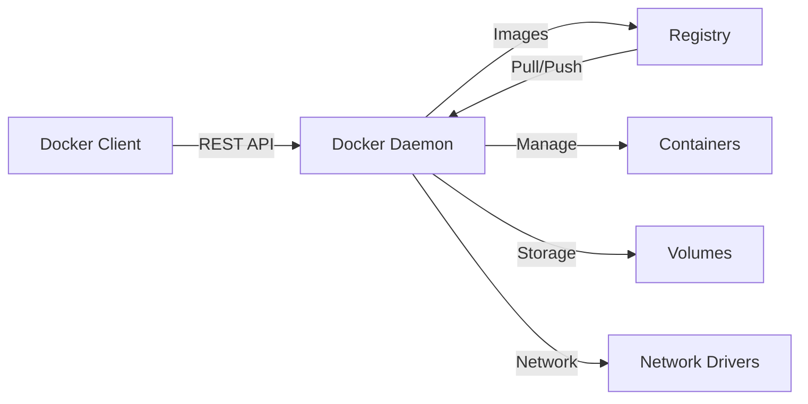

# 📦 Volume 13: DevOps & Site Reliability Engineering

<div align="center">


**Comprehensive Interview Guide | 2026 Edition | Senior FAANG-Level**

</div>

---

## 📑 Table of Contents

1. [Docker](#1-docker)
2. [Kubernetes](#2-kubernetes)
3. [CI/CD](#3-cicd)
4. [Infrastructure as Code](#4-infrastructure-as-code)
5. [Git](#5-git)
6. [Monitoring & SRE](#6-monitoring--sre)
7. [50+ Interview Questions](#7-interview-questions)

---

# 1. Docker

## 1.1 What is Docker?

**Docker** is a containerization platform that packages applications and their dependencies into isolated, lightweight containers that run consistently across any environment.

### Architecture



| Component | Role |
|-----------|------|
| **Docker Daemon (`dockerd`)** | Background service managing containers, images, networks, volumes |
| **Docker Client (`docker`)** | CLI that communicates with daemon via REST API (Unix socket or TCP) |
| **Docker Registry** | Stores/distributes images (Docker Hub, ECR, GCR, ACR) |
| **Images** | Read-only templates (layered filesystem) |
| **Containers** | Runnable instances of images (isolated via namespaces + cgroups) |

### How it Works (Internal)

**Step-by-Step:** `docker run nginx`

1. Client sends `POST /containers/create` to daemon
2. Daemon checks local image cache -> pulls layers from registry if missing
3. Daemon creates container -- sets up namespaces (PID, NET, MNT, UTS, IPC)
4. Applies cgroups for resource limits
5. Mounts rootfs via OverlayFS (merges image layers + container writable layer)
6. Sets up networking (default bridge)
7. Executes entrypoint (e.g., `nginx -g daemon off;`)

### Performance

| Metric | Container | VM |
|--------|-----------|----|
| Boot time | ~100ms | ~30s |
| Overhead | ~5-50MB | ~1-5GB |
| Density | 100+/host | 10-20/host |
| Isolation | Process-level | Hardware-level |

### Common Mistakes

- Running as root inside container
- Using `latest` tag in production
- Not using `.dockerignore`
- Image size bloat (no multi-stage)
- Treating containers as VMs (running multiple processes)

### Interview Questions

- *"How does Docker use namespaces and cgroups?"*
- *"What's the difference between an image and a container?"*
- *"How does OverlayFS work in Docker?"*
- *"Explain the container lifecycle."*

---

## 1.2 Dockerfile Best Practices

### Multi-Stage Builds

```dockerfile
# Stage 1: Build
FROM golang:1.22-alpine AS builder
WORKDIR /app
COPY go.mod go.sum ./
RUN go mod download
COPY . .
RUN CGO_ENABLED=0 GOOS=linux go build -o /app/server .

# Stage 2: Runtime
FROM alpine:3.19
RUN addgroup -S appgroup && adduser -S appuser -G appgroup
COPY --from=builder --chown=appuser:appgroup /app/server /server
USER appuser
EXPOSE 8080
CMD ["/server"]
```

**Why:** Final image is ~10MB vs ~1GB with full Go toolchain.

### Layer Caching

```dockerfile
# GOOD -- dependencies cached separately
COPY requirements.txt .
RUN pip install -r requirements.txt
COPY . .
```

Cache busts on: `ADD` with checksum change, `COPY` content change, build-arg change.

### .dockerignore

```gitignore
node_modules
.git
*.log
.env
dist
.cache
__pycache__
*.md
Dockerfile
.dockerignore
```

### Best Practices Checklist

- [x] Use specific tags (`alpine:3.19` not `alpine:latest`)
- [x] Prefer `COPY` over `ADD`
- [x] Run as non-root user
- [x] Use `WORKDIR` explicitly
- [x] Use `EXPOSE` for documentation
- [x] Combine `RUN` commands to reduce layers
- [x] Use `HEALTHCHECK` instruction
- [x] Pin base image digest

### Interview Questions

- *"How does Docker layer caching work?"*
- *"What are multi-stage builds and when would you use them?"*
- *"Why should you avoid running as root?"*
- *"How do you debug a failed Docker build?"*

---

## 1.3 Docker Compose

### Example `docker-compose.yml`

```yaml
version: "3.9"

services:
  api:
    build:
      context: ./api
      dockerfile: Dockerfile
      target: production
    ports:
      - "8080:8080"
    environment:
      - DB_URL=postgres://user:pass@db:5432/app
    depends_on:
      db:
        condition: service_healthy
      redis:
        condition: service_started
    healthcheck:
      test: ["CMD", "curl", "-f", "http://localhost:8080/health"]
      interval: 30s
      timeout: 10s
      retries: 3
      start_period: 10s
    volumes:
      - ./api:/app:ro
    networks:
      - backend
    restart: unless-stopped

  db:
    image: postgres:16-alpine
    environment:
      POSTGRES_DB: app
      POSTGRES_USER: user
      POSTGRES_PASSWORD: pass
    volumes:
      - pgdata:/var/lib/postgresql/data
    healthcheck:
      test: ["CMD-SHELL", "pg_isready -U user -d app"]
      interval: 10s
      timeout: 5s
      retries: 5
    networks:
      - backend

  redis:
    image: redis:7-alpine
    volumes:
      - redis_data:/data
    networks:
      - backend

volumes:
  pgdata:
  redis_data:

networks:
  backend:
    driver: bridge
```

### Health Checks

- `service_started` -- waits for container start (no health check)
- `service_healthy` -- waits for `HEALTHCHECK` to pass
- `condition: service_completed_successfully` -- waits for exit code 0

### Common Mistakes

- Not using health checks with `depends_on`
- Hardcoding secrets in compose file
- Using `latest` tag
- No volume mounts for databases
- Exposing database ports to host

---

## 1.4 Container Networking

### Network Drivers

| Driver | Scope | Use Case | Isolation |
|--------|-------|----------|-----------|
| **bridge** | Local | Default; single-host communication | High |
| **host** | Local | Performance-sensitive apps | None |
| **overlay** | Swarm | Multi-host communication | Medium |
| **macvlan** | Local | Legacy apps needing MAC addresses | Medium |
| **none** | Local | Isolated containers | Complete |

### Bridge Network (Default)

```bash
docker network create --driver bridge --subnet 172.20.0.0/16 mynet
docker run --network mynet --ip 172.20.0.10 nginx
```

**How it works:**

1. Docker creates `docker0` bridge (or custom bridge)
2. Each container gets a veth pair -- one end in container, one on bridge
3. iptables NAT rules map container ports to host ports
4. Embedded DNS resolves container names to IPs

### Host Network

```bash
docker run --network host nginx
```

- Container shares host network stack (no isolation)
- No port mapping needed -- `localhost:80` works
- **Security:** No network isolation

### Overlay Network (Swarm)

- VXLAN encapsulation (UDP 4789)
- Each overlay network gets a VNI (VXLAN Network Identifier)
- Distributed DNS + load balancing

### Performance Benchmarks

| Network | Latency (us) | Throughput (Gbps) | CPU Overhead |
|---------|-------------|-------------------|--------------|
| Host | 20 | 40 | 0% |
| Bridge | 35 | 38 | 2% |
| Overlay | 60 | 35 | 5% |
| Macvlan | 25 | 39 | 1% |

---

## 1.5 Volumes vs Bind Mounts

| Aspect | Volumes | Bind Mounts |
|--------|---------|-------------|
| **Managed by** | Docker (`/var/lib/docker/volumes/`) | User (any host path) |
| **Backup** | `docker run --volumes-from` | Standard file backup |
| **CLI** | `docker volume` commands | Direct filesystem access |
| **Portability** | High | Low |
| **Use case** | Persistent DB data, configs | Development hot-reload |

### Volume Operations

```bash
# Create
docker volume create --driver local --opt type=tmpfs --opt device=tmpfs myvolume

# Backup
docker run --rm -v myvolume:/source -v $(pwd):/backup alpine tar czf /backup/volume-backup.tar.gz -C /source .

# Restore
docker run --rm -v myvolume:/target -v $(pwd):/backup alpine tar xzf /backup/volume-backup.tar.gz -C /target
```

---

## 1.6 Docker Security

### Rootless Mode

```bash
# Install rootless docker
dockerd-rootless-setuptool.sh install
export DOCKER_HOST=unix:///run/user/$UID/docker.sock
```

**How it works:**
- Daemon runs as non-root user
- Namespaces remap root inside container to non-root outside
- Uses `slirp4netns` for networking

### Security Best Practices Checklist

- [x] Don't run containers as root
- [x] Add `--cap-drop=ALL --cap-add=NEEDED_ONLY`
- [x] Use `--security-opt=no-new-privileges:true`
- [x] Use read-only rootfs with `--read-only`
- [x] Scan images for CVEs
- [x] Pin base image digests
- [x] Enable seccomp + AppArmor profiles
- [x] Run rootless Docker in multi-tenant environments

---

## 1.7 Multi-Architecture Images

### Using Buildx

```bash
docker buildx create --name multiarch --driver docker-container --bootstrap
docker buildx build \
  --platform linux/amd64,linux/arm64,linux/arm/v7 \
  --tag user/app:latest \
  --push .
```

### How it Works

1. `buildx` launches a builder container (runs QEMU for cross-compilation)
2. Builds image for each `--platform` specified
3. Creates a manifest list pointing to each platform-specific image digest
4. Client pulls the correct platform image automatically

---

## 1.8 Docker Swarm vs Kubernetes

| Feature | Docker Swarm | Kubernetes |
|---------|-------------|------------|
| **Setup complexity** | Simple (minutes) | Complex (weeks) |
| **Learning curve** | Low | High |
| **Scaling** | Manual | Auto (HPA, VPA) |
| **Networking** | Built-in (overlay) | CNI plugins (Calico, Cilium) |
| **Service mesh** | Limited | Istio, Linkerd, Consul |
| **Storage** | Volumes + bind mounts | CSI drivers, PV/PVC, StorageClass |
| **Rolling updates** | Simple | Advanced (blue-green, canary) |
| **Self-healing** | Restart only | Probes, rescheduling |
| **Community** | Small | Largest in CNCF |
| **Production use** | Edge/IoT, small deployments | Enterprise, large-scale |

### When to Use Swarm

- Small team, limited Kubernetes expertise
- Simple microservices (<10 services)
- Edge/IoT deployments

### When to Use Kubernetes

- Multi-service architectures
- Need auto-scaling, self-healing
- Complex networking policies
- Enterprise compliance requirements
- Service mesh, operators, CRDs


---

# 2. Kubernetes

## 2.1 Architecture

| Component | Role | High Availability |
|-----------|------|-------------------|
| **API Server** | Central hub -- all communication goes through it | Multiple replicas, round-robin DNS/LB |
| **etcd** | Distributed key-value store (cluster state) | 3, 5, or 7 nodes (RAFT consensus) |
| **Scheduler** | Assigns pods to nodes based on constraints | Leader election |
| **Controller Manager** | Runs controllers (Deployment, ReplicaSet, etc.) | Leader election |
| **kubelet** | Node agent -- manages pods, reports status | One per node |
| **kube-proxy** | Network proxy -- iptables/IPVS rules | One per node |
| **Container Runtime** | Runs containers (containerd, CRI-O) | One per node |

### Control Plane Communication Flow

1. User runs `kubectl apply -f deployment.yaml`
2. API Server authenticates, authorizes, validates, stores in etcd
3. Controller Manager watches `/deployments`, creates ReplicaSet
4. Scheduler watches `/pods` (unscheduled), binds pod to node
5. kubelet watches `/pods` (assigned to it), runs container via CRI
6. kubelet updates pod status back to API server

### Key Concepts

- **List-Watch** -- Clients list resources then watch for changes (reduces API server load)
- **Leader Election** -- Controllers use `k8s.io/client-go/tools/leaderelection` for HA
- **Rate Limiting** -- API server has `--max-requests-inflight` and `--max-mutating-requests-inflight`

### Interview Questions

- *"What happens when you run kubectl apply?"*
- *"How does the scheduler select a node for a pod?"*
- *"Explain the list-watch pattern."*
- *"How does etcd handle consensus?"*

---

## 2.2 Pods

### Pod Lifecycle

| Phase | Description |
|-------|-------------|
| `Pending` | Accepted by cluster but not yet running (pulling image, scheduling) |
| `Running` | All containers started and at least one is running |
| `Succeeded` | All containers exited with code 0 |
| `Failed` | All containers exited, at least one with non-zero |
| `Unknown` | Node lost contact with API server |

### Init Containers

```yaml
apiVersion: v1
kind: Pod
metadata:
  name: app-pod
spec:
  initContainers:
    - name: init-db
      image: busybox:1.36
      command:
        - sh
        - -c
        - |
          until nc -z db-service 5432; do
            echo "Waiting for database..."
            sleep 2
          done
  containers:
    - name: app
      image: myapp:latest
```

### Sidecar Pattern

```yaml
spec:
  containers:
    - name: app
      image: myapp:latest
    - name: sidecar-log
      image: fluent/fluent-bit:3.0
      volumeMounts:
        - name: logs
          mountPath: /var/log/app
  volumes:
    - name: logs
      emptyDir: {}
```

### Resource Requests & Limits

```yaml
resources:
  requests:
    cpu: 250m
    memory: 256Mi
  limits:
    cpu: 500m
    memory: 512Mi
```

### QoS Classes

| Class | Request == Limit? | OOM Priority |
|-------|------------------|--------------|
| **Guaranteed** | Yes (both CPU & memory) | Lowest (best) |
| **Burstable** | Requests < Limits | Medium |
| **BestEffort** | No requests or limits | Highest (killed first) |

### Container Probes

```yaml
livenessProbe:
  httpGet:
    path: /healthz
    port: 8080
  initialDelaySeconds: 5
  periodSeconds: 10
readinessProbe:
  httpGet:
    path: /ready
    port: 8080
  initialDelaySeconds: 3
  periodSeconds: 5
```

| Probe | Purpose | Action on failure |
|-------|---------|-------------------|
| **Liveness** | Is container alive? | Restart container |
| **Readiness** | Is container ready to serve? | Remove from Service endpoints |
| **Startup** | Has app finished initializing? | Delays liveness during startup |

### Common Mistakes

- No resource limits (pods can starve nodes)
- Using `latest` image tag
- Not setting `terminationGracePeriodSeconds`
- No liveness/readiness probes

---

## 2.3 Deployments

### Rolling Update

```yaml
apiVersion: apps/v1
kind: Deployment
metadata:
  name: web-app
spec:
  replicas: 5
  strategy:
    type: RollingUpdate
    rollingUpdate:
      maxSurge: 1
      maxUnavailable: 0
  revisionHistoryLimit: 5
  selector:
    matchLabels:
      app: web
  template:
    metadata:
      labels:
        app: web
    spec:
      containers:
        - name: app
          image: myapp:v2
          ports:
            - containerPort: 8080
```

```bash
# Rolling update
kubectl set image deployment/web-app app=myapp:v2

# Rollback
kubectl rollout undo deployment/web-app

# Check status
kubectl rollout status deployment/web-app
```

### Blue-Green Deployment

```yaml
apiVersion: v1
kind: Service
metadata:
  name: app-svc
spec:
  selector:
    version: blue
  ports:
    - port: 80
      targetPort: 8080
---
apiVersion: apps/v1
kind: Deployment
metadata:
  name: app-green
spec:
  replicas: 5
  selector:
    matchLabels:
      app: myapp
      version: green
  template:
    metadata:
      labels:
        app: myapp
        version: green
```

```bash
# Switch traffic
kubectl patch service app-svc -p '{"spec":{"selector":{"version":"green"}}}'
```

### Canary Deployment

```yaml
apiVersion: apps/v1
kind: Deployment
metadata:
  name: app-stable
spec:
  replicas: 10
  selector:
    matchLabels:
      app: myapp
      track: stable
  template:
    metadata:
      labels:
        app: myapp
        track: stable
---
apiVersion: apps/v1
kind: Deployment
metadata:
  name: app-canary
spec:
  replicas: 1
  selector:
    matchLabels:
      app: myapp
      track: canary
  template:
    metadata:
      labels:
        app: myapp
        track: canary
```

### Recreate Strategy

```yaml
strategy:
  type: Recreate
```

- Terminates ALL old pods before creating new ones
- **Use when:** Database migrations, incompatible versions
- **Downtime:** Expected

### Deployment Strategies Comparison

| Strategy | Rollout Speed | Risk | Zero-Downtime | Rollback |
|----------|--------------|------|---------------|----------|
| Rolling Update | Slow | Low | Yes | Instant |
| Blue-Green | Fast | Medium | Yes | Instant (service switch) |
| Canary | Slow (incremental) | Very Low | Yes | Traffic shift |
| Recreate | Fastest | High | No | Full redeploy |

---

## 2.4 Services

### Service Types

| Type | Accessible | Use Case |
|------|-----------|----------|
| **ClusterIP** | Inside cluster only | Internal microservices |
| **NodePort** | `<NodeIP>:<NodePort>` | Dev/test, direct node access |
| **LoadBalancer** | External LB DNS | Production (cloud) |
| **ExternalName** | CNAME to external DNS | External service abstraction |
| **Headless** | Pod DNS records | StatefulSets, custom discovery |

### ClusterIP

```yaml
apiVersion: v1
kind: Service
metadata:
  name: api-service
spec:
  type: ClusterIP
  clusterIP: 10.96.0.50
  selector:
    app: api
  ports:
    - name: http
      port: 80
      targetPort: 8080
      protocol: TCP
```

### NodePort

```yaml
apiVersion: v1
kind: Service
metadata:
  name: web-external
spec:
  type: NodePort
  ports:
    - port: 80
      targetPort: 8080
      nodePort: 30080
  selector:
    app: web
```

### LoadBalancer

```yaml
apiVersion: v1
kind: Service
metadata:
  name: web-lb
  annotations:
    service.beta.kubernetes.io/aws-load-balancer-type: "nlb"
spec:
  type: LoadBalancer
  externalTrafficPolicy: Local
  ports:
    - port: 443
      targetPort: 8443
  selector:
    app: web
```

### Headless Service

```yaml
apiVersion: v1
kind: Service
metadata:
  name: statefulset-svc
spec:
  clusterIP: None
  selector:
    app: stateful
  ports:
    - port: 80
```

Pod DNS: `pod-name.statefulset-svc.namespace.svc.cluster.local`

### How kube-proxy Works

**Modes:**

| Mode | Algorithm | Performance | Complexity |
|------|-----------|-------------|------------|
| **iptables** | Random | Good (O(n) rules) | Simple |
| **IPVS** | RR, LC, SH, etc. | Better (O(1) hash) | Requires ipvsadm |
| **userspace** (legacy) | Round-robin | Poor (userspace copy) | Simple |

---

## 2.5 Ingress

### NGINX Ingress Controller

```yaml
apiVersion: networking.k8s.io/v1
kind: Ingress
metadata:
  name: main-ingress
  annotations:
    nginx.ingress.kubernetes.io/rewrite-target: /
    nginx.ingress.kubernetes.io/ssl-redirect: "true"
    cert-manager.io/cluster-issuer: letsencrypt-prod
spec:
  ingressClassName: nginx
  tls:
    - hosts:
        - app.example.com
      secretName: app-tls
  rules:
    - host: app.example.com
      http:
        paths:
          - path: /api
            pathType: Prefix
            backend:
              service:
                name: api-service
                port:
                  number: 80
          - path: /
            pathType: Prefix
            backend:
              service:
                name: web-service
                port:
                  number: 80
```

### Ingress Controllers Comparison

| Controller | Pros | Cons |
|-----------|------|------|
| **NGINX** | Most mature, flexible, huge community | Complex config for advanced features |
| **AWS ALB** | Native AWS, WAF integration | Slower than NLB, limited features |
| **Contour** | Envoy-based, dynamic config | Smaller community |
| **Istio Gateway** | Full service mesh integration | Heavy, complex |
| **HAProxy** | Extreme performance | Learning curve |


---

## 2.6 ConfigMaps & Secrets

### ConfigMap

```yaml
apiVersion: v1
kind: ConfigMap
metadata:
  name: app-config
data:
  app.properties: |
    db.host=mysql-service
    db.port=3306
    log.level=INFO
  cache.ttl: "300"
```

```yaml
# Mounted as volume
spec:
  containers:
    - name: app
      volumeMounts:
        - name: config
          mountPath: /etc/config
          readOnly: true
  volumes:
    - name: config
      configMap:
        name: app-config
```

```yaml
# As environment variables
spec:
  containers:
    - name: app
      envFrom:
        - configMapRef:
            name: app-config
```

### Secret

```yaml
apiVersion: v1
kind: Secret
metadata:
  name: db-secret
type: Opaque
stringData:
  username: app_user
  password: supersecret123
```

```yaml
spec:
  containers:
    - name: app
      env:
        - name: DB_PASSWORD
          valueFrom:
            secretKeyRef:
              name: db-secret
              key: password
      volumeMounts:
        - name: secrets
          mountPath: /etc/secrets
          readOnly: true
  volumes:
    - name: secrets
      secret:
        secretName: db-secret
        defaultMode: 0400
```

### Immutable ConfigMaps & Secrets

```yaml
apiVersion: v1
kind: ConfigMap
metadata:
  name: app-config
immutable: true
data:
  ...
```

**Benefits:** Performance (no watch), security (prevents modification), forces redeployment.

### Secrets Encryption at Rest

```bash
kube-apiserver --encryption-provider-config=encryption-config.yaml
```

```yaml
apiVersion: apiserver.config.k8s.io/v1
kind: EncryptionConfiguration
resources:
  - resources:
      - secrets
    providers:
      - aescbc:
          keys:
            - name: key1
              secret: <base64-encoded-32-byte-key>
      - identity: {}
```

### Common Mistakes

- Secrets are base64, not encrypted (by default)
- Committing secrets to git
- ConfigMap updates don't automatically restart pods

---

## 2.7 Persistent Volumes

### StorageClass & PVC

```yaml
apiVersion: storage.k8s.io/v1
kind: StorageClass
metadata:
  name: fast-ssd
provisioner: ebs.csi.aws.com
parameters:
  type: gp3
  iops: "3000"
reclaimPolicy: Retain
allowVolumeExpansion: true
volumeBindingMode: WaitForFirstConsumer
---
apiVersion: v1
kind: PersistentVolumeClaim
metadata:
  name: data-pvc
spec:
  accessModes:
    - ReadWriteOnce
  resources:
    requests:
      storage: 100Gi
  storageClassName: fast-ssd
---
spec:
  containers:
    - name: app
      volumeMounts:
        - name: data
          mountPath: /data
  volumes:
    - name: data
      persistentVolumeClaim:
        claimName: data-pvc
```

### Access Modes

| Mode | Description |
|------|-------------|
| **ReadWriteOnce (RWO)** | Single node read-write |
| **ReadOnlyMany (ROX)** | Multiple nodes read-only |
| **ReadWriteMany (RWX)** | Multiple nodes read-write |
| **ReadWriteOncePod (RWOP)** | Single pod |

### CSI Drivers

| Cloud | CSI Driver | Features |
|-------|-----------|----------|
| AWS | `ebs.csi.aws.com` | Snapshot, resize, encryption |
| GCP | `pd.csi.storage.gke.io` | Snapshot, resize, regional PD |
| Azure | `disk.csi.azure.com` | Snapshot, resize, shared disk |

### StatefulSet with PVC

```yaml
apiVersion: apps/v1
kind: StatefulSet
metadata:
  name: postgres
spec:
  serviceName: postgres
  replicas: 3
  selector:
    matchLabels:
      app: postgres
  template:
    metadata:
      labels:
        app: postgres
    spec:
      containers:
        - name: postgres
          image: postgres:16-alpine
          volumeMounts:
            - name: data
              mountPath: /var/lib/postgresql/data
  volumeClaimTemplates:
    - metadata:
        name: data
      spec:
        accessModes: ["ReadWriteOnce"]
        resources:
          requests:
            storage: 100Gi
        storageClassName: fast-ssd
```

---

## 2.8 Helm

### Chart Structure

```
mychart/
  Chart.yaml
  values.yaml
  values.schema.json
  charts/
  crds/
  templates/
    _helpers.tpl
    deployment.yaml
    service.yaml
    ingress.yaml
    configmap.yaml
    NOTES.txt
  README.md
```

### Chart.yaml

```yaml
apiVersion: v2
name: myapp
description: A production-grade web application
type: application
version: 1.2.3
appVersion: "2.0.0"
kubeVersion: ">=1.27.0-0"
dependencies:
  - name: postgresql
    version: "12.x"
    repository: https://charts.bitnami.com/bitnami
    condition: postgresql.enabled
```

### Template Example

```yaml
apiVersion: apps/v1
kind: Deployment
metadata:
  name: {{ include "myapp.fullname" . }}
  labels:
    {{- include "myapp.labels" . | nindent 4 }}
spec:
  replicas: {{ .Values.replicaCount }}
  selector:
    matchLabels:
      {{- include "myapp.selectorLabels" . | nindent 6 }}
  template:
    metadata:
      labels:
        {{- include "myapp.selectorLabels" . | nindent 8 }}
    spec:
      containers:
        - name: {{ .Chart.Name }}
          image: "{{ .Values.image.repository }}:{{ .Values.image.tag | default .Chart.AppVersion }}"
          ports:
            - containerPort: {{ .Values.service.port }}
```

### values.yaml

```yaml
replicaCount: 3
image:
  repository: nginx
  tag: ""
  pullPolicy: IfNotPresent
service:
  type: ClusterIP
  port: 80
ingress:
  enabled: true
  className: nginx
  hosts:
    - host: app.example.com
      paths:
        - path: /
          pathType: Prefix
resources:
  limits:
    cpu: 500m
    memory: 512Mi
  requests:
    cpu: 250m
    memory: 256Mi
```

### Helm Commands

```bash
# Install/upgrade
helm upgrade --install myapp ./mychart \
  --namespace production \
  --values values-production.yaml \
  --set image.tag=v2.0.0 \
  --atomic --timeout 5m

# Rollback
helm rollback myapp 2

# List releases
helm list --all-namespaces

# Render templates (dry run)
helm template myapp ./mychart --debug

# Package
helm package ./mychart -d ./packages

# Add repo
helm repo add bitnami https://charts.bitnami.com/bitnami
```

### Helm Hooks

```yaml
apiVersion: batch/v1
kind: Job
metadata:
  name: db-migrate
  annotations:
    "helm.sh/hook": pre-upgrade,post-install
    "helm.sh/hook-weight": "-5"
    "helm.sh/hook-delete-policy": hook-succeeded
spec:
  template:
    spec:
      restartPolicy: Never
      containers:
        - name: migration
          image: myapp:latest
          command: ["npm", "run", "migrate"]
```

---

## 2.9 Operators

### Operator Pattern

1. **Custom Resource Definition (CRD)** defines a new resource type (e.g., `PostgresCluster`)
2. **Custom Controller** watches the CRD and reconciles to desired state
3. **Operator** = CRD + Controller + Business Logic

### CRD Example

```yaml
apiVersion: apiextensions.k8s.io/v1
kind: CustomResourceDefinition
metadata:
  name: postgresclusters.acme.com
spec:
  group: acme.com
  names:
    kind: PostgresCluster
    plural: postgresclusters
    singular: postgrescluster
  scope: Namespaced
  versions:
    - name: v1
      served: true
      storage: true
      schema:
        openAPIV3Schema:
          type: object
          properties:
            spec:
              type: object
              properties:
                replicas:
                  type: integer
                  minimum: 1
                  maximum: 10
                version:
                  type: string
```

### Popular Operators

| Operator | Vendor | What it manages |
|----------|--------|----------------|
| **cert-manager** | Jetstack | TLS certificates |
| **External Secrets** | External Secrets | Syncs secrets from AWS/GCP/Azure |
| **PostgreSQL (CNP)** | CloudNativePG | PostgreSQL clusters |
| **Strimzi** | Apache | Kafka on K8s |
| **Crossplane** | Upbound | Infrastructure from K8s |
| **Prometheus Operator** | CoreOS | Prometheus, Alertmanager, ServiceMonitors |
| **Argo CD** | Argo Project | GitOps deployment |

---

## 2.10 Service Mesh

### Istio Architecture

- **Data Plane:** Envoy sidecar proxies (injected into each pod)
- **Control Plane:** `istiod` (Pilot + Citadel + Galley)
- **mTLS:** Automatic mutual TLS between services
- **Traffic Management:** VirtualService, DestinationRule, Gateway

### Istio Installation

```bash
istioctl install --set profile=demo -y
kubectl label namespace default istio-injection=enabled
```

### VirtualService & DestinationRule

```yaml
apiVersion: networking.istio.io/v1beta1
kind: VirtualService
metadata:
  name: reviews
spec:
  hosts:
    - reviews
  http:
    - match:
        - headers:
            end-user:
              exact: jason
      route:
        - destination:
            host: reviews
            subset: v2
    - route:
        - destination:
            host: reviews
            subset: v1
          weight: 80
        - destination:
            host: reviews
            subset: v3
          weight: 20
---
apiVersion: networking.istio.io/v1beta1
kind: DestinationRule
metadata:
  name: reviews
spec:
  host: reviews
  trafficPolicy:
    loadBalancer:
      simple: ROUND_ROBIN
  subsets:
    - name: v1
      labels:
        version: v1
    - name: v2
      labels:
        version: v2
    - name: v3
      labels:
        version: v3
```

### mTLS

```yaml
apiVersion: security.istio.io/v1beta1
kind: PeerAuthentication
metadata:
  name: default
  namespace: istio-system
spec:
  mtls:
    mode: STRICT
```

### Service Mesh Comparison

| Feature | Istio | Linkerd | Consul |
|---------|-------|---------|--------|
| Sidecar proxy | Envoy | Linkerd-proxy | Envoy |
| mTLS | Yes | Yes | Yes |
| Traffic split | Yes | Yes | Yes |
| Resource overhead | High (~100MB/proxy) | Low (~10MB/proxy) | Medium |
| Installation complexity | High | Low | Medium |

---

## 2.11 HPA & VPA

### Horizontal Pod Autoscaler

```yaml
apiVersion: autoscaling/v2
kind: HorizontalPodAutoscaler
metadata:
  name: app-hpa
spec:
  scaleTargetRef:
    apiVersion: apps/v1
    kind: Deployment
    name: web-app
  minReplicas: 3
  maxReplicas: 20
  metrics:
    - type: Resource
      resource:
        name: cpu
        target:
          type: Utilization
          averageUtilization: 70
    - type: Pods
      pods:
        metric:
          name: requests_per_second
        target:
          type: AverageValue
          averageValue: 1000
  behavior:
    scaleDown:
      stabilizationWindowSeconds: 300
      policies:
        - type: Percent
          value: 10
          periodSeconds: 60
    scaleUp:
      stabilizationWindowSeconds: 0
      policies:
        - type: Pods
          value: 4
          periodSeconds: 60
```

### How HPA Works

Loop every 15s:
1. Get HPA object from API server
2. Get pod metrics from Metrics Server
3. `desiredReplicas = ceil(currentUtilization / targetUtilization * currentReplicas)`
4. If different, scale Deployment

### Metrics Server

```bash
kubectl apply -f https://github.com/kubernetes-sigs/metrics-server/releases/latest/download/components.yaml
kubectl top nodes
kubectl top pods
```

### Vertical Pod Autoscaler

```yaml
apiVersion: autoscaling.k8s.io/v1
kind: VerticalPodAutoscaler
metadata:
  name: app-vpa
spec:
  targetRef:
    apiVersion: apps/v1
    kind: Deployment
    name: web-app
  updatePolicy:
    updateMode: "Auto"
  resourcePolicy:
    containerPolicies:
      - containerName: "*"
        minAllowed:
          cpu: 100m
          memory: 128Mi
        maxAllowed:
          cpu: 4
          memory: 4Gi
```

### VPA Modes

| Mode | Behavior |
|------|----------|
| `Off` | Recommendations only (no changes) |
| `Initial` | Sets requests on new pods only |
| `Auto` | Evicts and reschedules pods with new values |

---

## 2.12 RBAC

| Resource | Scope | Description |
|----------|-------|-------------|
| **Role** | Namespace | Permissions within a namespace |
| **ClusterRole** | Cluster | Permissions across all namespaces or cluster-scoped |
| **RoleBinding** | Namespace | Binds Role to users/groups/SA in a namespace |
| **ClusterRoleBinding** | Cluster | Binds ClusterRole cluster-wide |

### Role & RoleBinding

```yaml
apiVersion: rbac.authorization.k8s.io/v1
kind: Role
metadata:
  namespace: default
  name: pod-reader
rules:
  - apiGroups: [""]
    resources: ["pods", "pods/log"]
    verbs: ["get", "list", "watch"]
---
apiVersion: rbac.authorization.k8s.io/v1
kind: RoleBinding
metadata:
  namespace: default
  name: read-pods
subjects:
  - kind: User
    name: alice@example.com
  - kind: ServiceAccount
    name: ci-bot
    namespace: default
roleRef:
  kind: Role
  name: pod-reader
  apiGroup: rbac.authorization.k8s.io
```

### ClusterRole & ClusterRoleBinding

```yaml
apiVersion: rbac.authorization.k8s.io/v1
kind: ClusterRole
metadata:
  name: cluster-admin
rules:
  - apiGroups: [""]
    resources: ["nodes", "persistentvolumes"]
    verbs: ["get", "list", "watch"]
---
apiVersion: rbac.authorization.k8s.io/v1
kind: ClusterRoleBinding
metadata:
  name: admin-users
roleRef:
  apiGroup: rbac.authorization.k8s.io
  kind: ClusterRole
  name: cluster-admin
subjects:
  - kind: User
    name: ops@example.com
```

### ServiceAccount

```yaml
apiVersion: v1
kind: ServiceAccount
metadata:
  name: app-sa
automountServiceAccountToken: false
---
apiVersion: v1
kind: Pod
metadata:
  name: app
spec:
  serviceAccountName: app-sa
```

---

## 2.13 Network Policies

### Default-Deny Ingress

```yaml
apiVersion: networking.k8s.io/v1
kind: NetworkPolicy
metadata:
  name: default-deny-ingress
spec:
  podSelector: {}
  policyTypes:
    - Ingress
```

### Allow Specific Ingress

```yaml
apiVersion: networking.k8s.io/v1
kind: NetworkPolicy
metadata:
  name: api-allow
spec:
  podSelector:
    matchLabels:
      app: api
  policyTypes:
    - Ingress
  ingress:
    - from:
        - podSelector:
            matchLabels:
              app: web
        - namespaceSelector:
            matchLabels:
              kubernetes.io/metadata.name: monitoring
        - ipBlock:
            cidr: 10.0.0.0/8
            except:
              - 10.0.1.0/24
      ports:
        - protocol: TCP
          port: 8080
```

### Egress Policy

```yaml
apiVersion: networking.k8s.io/v1
kind: NetworkPolicy
metadata:
  name: allow-egress-dns
spec:
  podSelector:
    matchLabels:
      app: api
  policyTypes:
    - Egress
  egress:
    - to:
        - namespaceSelector: {}
      ports:
        - protocol: UDP
          port: 53
```

### CNI Comparison

| Feature | Calico | Cilium | Weave |
|---------|--------|--------|-------|
| Base technology | eBPF | eBPF | Overlay |
| Performance | Near-native | Near-native | Moderate |
| L7 policies | No | Yes (HTTP, gRPC) | No |

---

## 2.14 Monitoring (kube-prometheus)

### Installation

```bash
helm repo add prometheus-community https://prometheus-community.github.io/helm-charts
helm upgrade --install kube-prometheus prometheus-community/kube-prometheus-stack \
  --namespace monitoring --create-namespace \
  --set grafana.adminPassword=admin \
  --set prometheus.prometheusSpec.serviceMonitorSelectorNilUsesHelmValues=false
```

### ServiceMonitor Example

```yaml
apiVersion: monitoring.coreos.com/v1
kind: ServiceMonitor
metadata:
  name: app-monitor
spec:
  selector:
    matchLabels:
      app: myapp
  endpoints:
    - port: metrics
      interval: 15s
      path: /metrics
  namespaceSelector:
    any: true
```

### PrometheusRule

```yaml
apiVersion: monitoring.coreos.com/v1
kind: PrometheusRule
metadata:
  name: app-alerts
spec:
  groups:
    - name: app
      rules:
        - alert: HighErrorRate
          expr: |
            rate(http_requests_total{status=~"5.."}[5m])
            /
            rate(http_requests_total[5m])
            > 0.05
          for: 5m
          labels:
            severity: critical
          annotations:
            summary: "High error rate on {{ $labels.pod }}"
            description: "Error rate is {{ $value | humanizePercentage }}"
        - record: pod:cpu_usage_avg
          expr: |
            avg(rate(container_cpu_usage_seconds_total{container!=""}[5m])) by (pod)
```

### Common Mistakes

- No retention policy (default 15d)
- High cardinality labels (user_id, request_id)
- Not using recording rules for expensive queries
- Alertmanager not configured with proper routing

---

## 2.15 Logging (EFK Stack)

### Architecture

- **Fluentd DaemonSet** collects logs from `/var/log/containers/*.log`
- **Elasticsearch** stores and indexes logs
- **Kibana** provides search and visualization

### Fluentd DaemonSet

```yaml
apiVersion: apps/v1
kind: DaemonSet
metadata:
  name: fluentd
  namespace: logging
spec:
  selector:
    matchLabels:
      app: fluentd
  template:
    metadata:
      labels:
        app: fluentd
    spec:
      containers:
        - name: fluentd
          image: fluent/fluentd-kubernetes-daemonset:v1.16-debian-elasticsearch-1
          env:
            - name: FLUENT_ELASTICSEARCH_HOST
              value: "elasticsearch.logging.svc"
          volumeMounts:
            - name: varlog
              mountPath: /var/log
            - name: dockercontainers
              mountPath: /var/lib/docker/containers
              readOnly: true
      volumes:
        - name: varlog
          hostPath:
            path: /var/log
        - name: dockercontainers
          hostPath:
            path: /var/lib/docker/containers
```

### Structured Logging (Best Practice)

```go
// BAD - unstructured
log.Printf("User %s logged in from IP %s", userID, ip)

// GOOD - structured JSON
logger.Info("user login",
    "user_id", userID,
    "ip", ip,
)
```

### Log Management Comparison

| Tool | Search | Scalability | Resource Usage | Setup Complexity |
|------|--------|-------------|----------------|------------------|
| ELK Stack | Excellent | High | High | Complex |
| Loki | Good (index-free) | Very High | Low | Simple |
| Grafana Cloud | Excellent | Managed | None | Very Simple |
| Datadog | Excellent | Managed | Medium | Simple |


---

# 3. CI/CD

## 3.1 GitHub Actions

### Workflow Structure

```yaml
name: CI/CD Pipeline

on:
  push:
    branches: [main, develop]
    paths-ignore:
      - "*.md"
  pull_request:
    branches: [main]
  workflow_dispatch:
    inputs:
      environment:
        description: "Deploy environment"
        required: true
        default: staging
        type: choice
        options:
          - staging
          - production

env:
  REGISTRY: ghcr.io
  IMAGE_NAME: ${{ github.repository }}

jobs:
  lint:
    runs-on: ubuntu-latest
    steps:
      - uses: actions/checkout@v4
      - uses: actions/setup-go@v5
        with:
          go-version: "1.22"
      - run: make lint

  test:
    needs: lint
    runs-on: ubuntu-latest
    strategy:
      matrix:
        go-version: ["1.21", "1.22"]
    services:
      postgres:
        image: postgres:16
        env:
          POSTGRES_PASSWORD: test
        ports:
          - 5432:5432
        options: >-
          --health-cmd pg_isready
          --health-interval 10s
          --health-timeout 5s
          --health-retries 5
    steps:
      - uses: actions/checkout@v4
      - uses: actions/setup-go@v5
        with:
          go-version: ${{ matrix.go-version }}
      - run: go test -race -coverprofile=coverage.out ./...
      - uses: codecov/codecov-action@v4

  build:
    needs: test
    runs-on: ubuntu-latest
    permissions:
      contents: read
      packages: write
      id-token: write
    steps:
      - uses: actions/checkout@v4
      - name: Set up Docker Buildx
        uses: docker/setup-buildx-action@v3
      - name: Log in to Container Registry
        uses: docker/login-action@v3
        with:
          registry: ${{ env.REGISTRY }}
          username: ${{ github.actor }}
          password: ${{ secrets.GITHUB_TOKEN }}
      - name: Extract metadata
        id: meta
        uses: docker/metadata-action@v5
        with:
          images: ${{ env.REGISTRY }}/${{ env.IMAGE_NAME }}
          tags: |
            type=sha,prefix=sha-
            type=ref,event=branch
            type=semver,pattern={{version}}
      - name: Build and push
        uses: docker/build-push-action@v5
        with:
          context: .
          push: true
          tags: ${{ steps.meta.outputs.tags }}
          cache-from: type=gha
          cache-to: type=gha,mode=max

  deploy:
    needs: build
    if: github.ref == 'refs/heads/main'
    runs-on: ubuntu-latest
    environment:
      name: production
      url: https://app.example.com
    steps:
      - name: Configure AWS credentials
        uses: aws-actions/configure-aws-credentials@v4
        with:
          role-to-assume: arn:aws:iam::${{ secrets.AWS_ACCOUNT_ID }}:role/github-actions-role
          aws-region: us-east-1
      - name: Deploy to EKS
        run: |
          aws eks update-kubeconfig --name production-cluster --region us-east-1
          kubectl set image deployment/app app=${{ env.REGISTRY }}/${{ env.IMAGE_NAME }}:sha-${{ github.sha }}
```

### Matrix Builds

```yaml
jobs:
  build:
    strategy:
      matrix:
        os: [ubuntu-latest, windows-latest]
        node: [18, 20, 22]
        exclude:
          - os: windows-latest
            node: 22
    runs-on: ${{ matrix.os }}
    steps:
      - uses: actions/setup-node@v4
        with:
          node-version: ${{ matrix.node }}
      - run: npm test
```

### OIDC Authentication

```yaml
jobs:
  deploy:
    permissions:
      id-token: write
      contents: read
    steps:
      - name: Configure AWS credentials
        uses: aws-actions/configure-aws-credentials@v4
        with:
          role-to-assume: arn:aws:iam::123456789:role/GitHubActionsRole
          aws-region: us-east-1
```

### Reusable Workflows

```yaml
# Caller workflow
jobs:
  call-workflow:
    uses: org/shared-workflows/.github/workflows/deploy.yml@v1
    with:
      environment: production
      image-tag: v1.2.3
    secrets:
      aws-role-arn: ${{ secrets.AWS_DEPLOY_ROLE }}
```

```yaml
# Reusable workflow
on:
  workflow_call:
    inputs:
      environment:
        required: true
        type: string
    secrets:
      aws-role-arn:
        required: true
```

### Common Mistakes

- No caching (Docker layers, npm/yarn)
- Hardcoding secrets
- Not pinning action versions
- No concurrency control

---

## 3.2 Azure DevOps Pipelines

### YAML Pipeline

```yaml
trigger:
  branches:
    include:
      - main
  paths:
    exclude:
      - "*.md"

variables:
  - group: production-variables
  - name: imageTag
    value: $(Build.BuildId)

stages:
  - stage: Build
    jobs:
      - job: BuildAndTest
        pool:
          vmImage: ubuntu-latest
        steps:
          - task: DotNetCoreCLI@2
            inputs:
              command: restore
              projects: "**/*.csproj"
          - task: DotNetCoreCLI@2
            inputs:
              command: build
              projects: "**/*.csproj"
          - task: DotNetCoreCLI@2
            inputs:
              command: test
              projects: "**/*Tests.csproj"
          - task: Docker@2
            inputs:
              containerRegistry: acr-connection
              repository: myapp
              command: buildAndPush
              tags: |
                $(imageTag)
                latest

  - stage: Deploy
    dependsOn: Build
    condition: succeeded()
    jobs:
      - deployment: DeployApp
        environment:
          name: production
        strategy:
          blueGreen:
            deploy:
              steps:
                - task: AzureWebApp@1
                  inputs:
                    azureSubscription: prod-subscription
                    appName: myapp-prod
```

### Variable Groups & Library

```yaml
variables:
  - group: production-variables
  - group: connection-strings
  - name: ENVIRONMENT
    value: production
```

---

## 3.3 Jenkins

### Pipeline as Code (Jenkinsfile)

```groovy
pipeline {
    agent {
        kubernetes {
            label 'build-agent'
            yaml '''
apiVersion: v1
kind: Pod
spec:
  containers:
  - name: maven
    image: maven:3.9-eclipse-temurin-21
    command:
    - cat
    tty: true
  - name: docker
    image: docker:24-cli
    command:
    - cat
    tty: true
    volumeMounts:
    - name: docker-socket
      mountPath: /var/run/docker.sock
  volumes:
  - name: docker-socket
    hostPath:
      path: /var/run/docker.sock
'''
        }
    }

    environment {
        REGISTRY = 'ghcr.io'
        IMAGE_NAME = "${REGISTRY}/${JOB_NAME}"
        IMAGE_TAG = "${BUILD_NUMBER}-${GIT_COMMIT.take(8)}"
    }

    stages {
        stage('Checkout') {
            steps {
                checkout scmGit(
                    branches: [[name: '*/main']],
                    userRemoteConfigs: [[url: 'https://github.com/org/repo.git']]
                )
            }
        }

        stage('Test') {
            steps {
                container('maven') {
                    sh 'mvn clean test'
                }
                junit 'target/surefire-reports/*.xml'
            }
        }

        stage('Build & Push') {
            steps {
                container('docker') {
                    script {
                        docker.withRegistry("https://${REGISTRY}", 'ghcr-credentials') {
                            def app = docker.build("${IMAGE_NAME}:${IMAGE_TAG}", '.')
                            app.push()
                            app.push('latest')
                        }
                    }
                }
            }
        }

        stage('Deploy') {
            steps {
                sh "kubectl set image deployment/app app=${IMAGE_NAME}:${IMAGE_TAG}"
            }
        }
    }

    post {
        failure {
            slackSend(
                channel: '#devops-alerts',
                color: 'danger',
                message: "Build ${env.BUILD_NUMBER} failed"
            )
        }
    }
}
```

### Shared Libraries

```groovy
// vars/deployToK8s.groovy
def call(String environment, String image) {
    sh """
        kubectl --context=${environment} set image deployment/app app=${image}
        kubectl --context=${environment} rollout status deployment/app
    """
}

// Jenkinsfile usage
@Library('my-shared-library') _
pipeline {
    stages {
        stage('Deploy') {
            steps {
                deployToK8s('production', "${IMAGE_NAME}:${IMAGE_TAG}")
            }
        }
    }
}
```

---

## 3.4 GitLab CI

### .gitlab-ci.yml

```yaml
image: alpine:3.19

variables:
  REGISTRY_IMAGE: $CI_REGISTRY_IMAGE
  IMAGE_TAG: $CI_COMMIT_SHORT_SHA

stages:
  - lint
  - test
  - build
  - deploy

cache:
  key: ${CI_COMMIT_REF_SLUG}
  paths:
    - node_modules/

lint:eslint:
  stage: lint
  image: node:22
  script:
    - yarn install --frozen-lockfile
    - yarn lint

test:unit:
  stage: test
  image: node:22
  script:
    - yarn install --frozen-lockfile
    - yarn test --coverage
  artifacts:
    reports:
      coverage_report:
        coverage_format: cobertura
        path: coverage/cobertura-coverage.xml

build:docker:
  stage: build
  image: docker:24-cli
  services:
    - docker:24-dind
  variables:
    DOCKER_DRIVER: overlay2
    DOCKER_TLS_CERTDIR: ""
  script:
    - docker login -u $CI_REGISTRY_USER -p $CI_REGISTRY_PASSWORD $CI_REGISTRY
    - docker build --cache-from $REGISTRY_IMAGE:latest -t $REGISTRY_IMAGE:$IMAGE_TAG .
    - docker tag $REGISTRY_IMAGE:$IMAGE_TAG $REGISTRY_IMAGE:latest
    - docker push $REGISTRY_IMAGE:$IMAGE_TAG
    - docker push $REGISTRY_IMAGE:latest

deploy:production:
  stage: deploy
  image: alpine/k8s:1.29
  script:
    - kubectl set image deployment/app app=$REGISTRY_IMAGE:$IMAGE_TAG
    - kubectl rollout status deployment/app
  environment:
    name: production
  only:
    - main
  when: manual
```

### DIND (Docker-in-Docker)

**How it works:**
- GitLab Runner spins up a job container and a `docker:dind` service container
- Job container talks to `dind` service via TCP
- dind service builds and pushes Docker images

### Runners

```bash
gitlab-runner register \
  --url https://gitlab.com \
  --token $REGISTRATION_TOKEN \
  --executor kubernetes \
  --kubernetes-namespace gitlab-runners \
  --kubernetes-image alpine:3.19
```

---

## 3.5 Deployment Strategies

| Strategy | Rollout Speed | Risk | Cost | Zero-Downtime | Rollback |
|----------|--------------|------|------|---------------|----------|
| **Rolling** | Gradual | Low | None | Yes | Version pin |
| **Blue-Green** | Instant | Medium | 2x infra | Yes | DNS/service switch |
| **Canary** | Controlled | Very Low | +10% infra | Yes | Traffic shift |
| **Feature Flags** | Instant | Minimal | Flag infra | Yes | Flag toggle |
| **A/B Testing** | Variable | Low | +50% infra | Yes | Traffic shift |

### Feature Flags

```yaml
apiVersion: v1
kind: ConfigMap
metadata:
  name: feature-flags
data:
  flags.json: |
    {
      "new-checkout-flow": {
        "variation": "control",
        "rollout": 25
      },
      "dark-mode": {
        "variation": "on"
      }
    }
```


---

# 4. Infrastructure as Code

## 4.1 Terraform

### Configuration Example

```hcl
# versions.tf
terraform {
  required_version = ">= 1.7"
  required_providers {
    aws = {
      source  = "hashicorp/aws"
      version = "~> 5.0"
    }
  }
  backend "s3" {
    bucket         = "mycompany-terraform-state"
    key            = "production/network/terraform.tfstate"
    region         = "us-east-1"
    dynamodb_table = "terraform-state-lock"
    encrypt        = true
  }
}

# providers.tf
provider "aws" {
  region = var.aws_region
  default_tags {
    tags = {
      Environment = var.environment
      ManagedBy   = "terraform"
    }
  }
}

# variables.tf
variable "environment" {
  description = "Deployment environment"
  type        = string
  validation {
    condition     = contains(["dev", "staging", "prod"], var.environment)
    error_message = "Environment must be dev, staging, or prod."
  }
}

variable "vpc_cidr" {
  description = "VPC CIDR block"
  type        = string
  default     = "10.0.0.0/16"
}

# main.tf
module "vpc" {
  source  = "terraform-aws-modules/vpc/aws"
  version = "5.8.1"

  name = "${var.environment}-vpc"
  cidr = var.vpc_cidr
  azs             = ["us-east-1a", "us-east-1b", "us-east-1c"]
  private_subnets = ["10.0.1.0/24", "10.0.2.0/24", "10.0.3.0/24"]
  public_subnets  = ["10.0.101.0/24", "10.0.102.0/24", "10.0.103.0/24"]
  enable_nat_gateway     = true
  enable_dns_hostnames   = true
}

# outputs.tf
output "vpc_id" {
  value = module.vpc.vpc_id
}
output "private_subnet_ids" {
  value = module.vpc.private_subnets
}
```

### Workspaces

```bash
terraform workspace new dev
terraform workspace new staging
terraform workspace new prod

# Use in config
resource "aws_s3_bucket" "app" {
  bucket = "app-${terraform.workspace}-data"
}
```

### State Management Flow

1. Terraform downloads state from backend (S3)
2. Acquires lock via DynamoDB
3. Plans changes against real infrastructure
4. Applies changes, updates state
5. Releases lock

### Terragrunt

```hcl
# terragrunt.hcl
remote_state {
  backend = "s3"
  config = {
    bucket         = "mycompany-terraform-state"
    key            = "${path_relative_to_include()}/terraform.tfstate"
    region         = "us-east-1"
    encrypt        = true
    dynamodb_table = "terraform-state-lock"
  }
}

generate "provider" {
  path      = "provider.tf"
  if_exists = "overwrite_terragrunt"
  contents  = <<EOF
provider "aws" {
  region = "us-east-1"
}
EOF
}
```

```hcl
# dev/terragrunt.hcl
include {
  path = find_in_parent_folders()
}
inputs = {
  environment   = "dev"
  vpc_cidr      = "10.0.0.0/16"
  instance_type = "t3.medium"
}
```

### Common Mistakes

- Storing state locally or without locking
- Hardcoding secrets
- Not using `terraform fmt` / `terraform validate`
- Large monolithic state files
- No state versioning

---

## 4.2 Bicep

### Bicep vs ARM

| Aspect | ARM Templates | Bicep |
|--------|--------------|-------|
| **Syntax** | JSON (verbose) | Declarative DSL (clean) |
| **Readability** | Poor | Excellent |
| **Modularity** | Nested templates | Modules |
| **Type safety** | None | Built-in |
| **Tooling** | Basic | VS Code extension, LSP |

### Example

```bicep
// main.bicep
param environment string
param location string = resourceGroup().location
param appName string = 'app-${environment}'

var tags = {
  Environment: environment
  ManagedBy: 'bicep'
}

resource storageAccount 'Microsoft.Storage/storageAccounts@2023-01-01' = {
  name: '${appName}storage'
  location: location
  kind: 'StorageV2'
  sku: {
    name: 'Standard_GRS'
  }
  tags: tags
}

module appService './modules/app-service.bicep' = {
  name: 'app-service-deployment'
  params: {
    environment: environment
    location: location
    storageAccountId: storageAccount.id
  }
}

output storageEndpoint string = storageAccount.properties.primaryEndpoints.blob
```

### Deployment

```bash
az deployment group create \
  --resource-group prod-rg \
  --template-file main.bicep \
  --parameters environment=prod

az deployment group what-if \
  --resource-group prod-rg \
  --template-file main.bicep \
  --parameters environment=prod
```

---

## 4.3 Pulumi

### Infrastructure as Real Code

```typescript
import * as aws from "@pulumi/aws";
import * as awsx from "@pulumi/awsx";
import * as pulumi from "@pulumi/pulumi";

const config = new pulumi.Config();
const environment = config.require("environment");

const vpc = new awsx.ec2.Vpc("app-vpc", {
    numberOfAvailabilityZones: 3,
    natGateways: { strategy: "Single" },
    tags: { Environment: environment },
});

const cluster = new aws.ecs.Cluster("app-cluster", {
    tags: { Environment: environment },
});

const repo = new aws.ecr.Repository("app-repo", {
    imageScanningConfiguration: { scanOnPush: true },
});

const service = new awsx.ecs.FargateService("app-service", {
    cluster: cluster.arn,
    taskDefinitionArgs: {
        container: {
            image: pulumi.interpolate`${repo.repositoryUrl}:latest`,
            cpu: 512,
            memory: 1024,
            portMappings: [{
                containerPort: 8080,
                targetGroup: { port: 80 },
            }],
        },
    },
    networkConfiguration: {
        subnets: vpc.publicSubnetIds,
        securityGroups: [vpc.securityGroups.application.id],
        assignPublicIp: true,
    },
});

export const url = service.loadBalancer.loadBalancer.dnsName;
```

### Pulumi vs Terraform

| Aspect | Terraform | Pulumi |
|--------|-----------|--------|
| **Language** | HCL (DSL) | TypeScript, Python, Go, C#, Java |
| **State** | JSON state file | JSON state file |
| **Testing** | Terratest | Native (Jest, pytest) |
| **Looping** | count, for_each, dynamic | Loops, conditionals (real code) |
| **Abstraction** | Modules | Classes, functions, packages |

---

# 5. Git

## 5.1 Git Internals

### Object Model

- **Blob** -- File content (stored as `blob <size>\0<content>`, SHA1 hashed)
- **Tree** -- Directory listing (maps filenames to blobs/trees)
- **Commit** -- Snapshot (points to tree, parent commits, author, message)
- **Tag** -- Named reference to a commit (annotated or lightweight)
- **Ref** -- Branch (`refs/heads/main`), tag (`refs/tags/v1.0`), HEAD

### Key Commands

```bash
# Plumbing commands
git hash-object    # Compute object ID
git cat-file       # Display object content
git ls-tree        # List tree object
git write-tree     # Create tree from index
git commit-tree    # Create commit from tree

# Reflog (recovery)
git reflog show HEAD
git checkout HEAD@{2}  # Recover "lost" commit
```

### Git Object Content Format

```
blob <size>\0<content>         -> SHA1 hash
tree <size>\0<mode> <name>\0<SHA1>...  -> SHA1 hash
commit <size>\0tree <SHA1>\nparent <SHA1>\nauthor ...\n\nmessage  -> SHA1 hash
```

---

## 5.2 Branching Strategies

| Strategy | Long-lived Branches | Feature Lifespan | Merge Strategy |
|----------|-------------------|-------------------|----------------|
| **Git Flow** | main, develop, release/*, hotfix/* | Days-weeks | Merge commits |
| **Trunk-Based** | main only | Hours | Squash or rebase |
| **GitHub Flow** | main only | Days | Pull Request + squash |

### Git Flow

| Branch | Purpose | Base | Merges into |
|--------|---------|------|-------------|
| `main` | Production releases | -- | -- |
| `develop` | Integration branch | `main` | `main` |
| `feature/*` | New features | `develop` | `develop` |
| `release/*` | Release prep | `develop` | `main` + `develop` |
| `hotfix/*` | Urgent fixes | `main` | `main` + `develop` |

### Trunk-Based Development

- Single `main` branch, short-lived feature branches (hours)
- Feature flags for incomplete work
- Continuous integration to main

---

## 5.3 Merge vs Rebase vs Squash

| Strategy | History | Use Case |
|----------|---------|----------|
| **Merge** | Preserves all commits + merge commit | Public/shared branches |
| **Rebase** | Linear history, rewrites commits | Private feature branches |
| **Squash** | Single commit for whole feature | Clean main history |

### Interactive Rebase

```bash
# Squash last 3 commits
git rebase -i HEAD~3
# pick abc123 First commit
# squash def456 Second commit
# squash 789ghi Third commit
```

### When NOT to Rebase

- On public/shared branches
- If others have based work on your branch
- After pushing to a shared remote

---

## 5.4 Advanced Git Commands

### Cherry-Pick

```bash
# Pick a specific commit
git cherry-pick abc123

# Without committing
git cherry-pick -n abc123
```

### Bisect

```bash
git bisect start
git bisect bad            # Current commit is bad
git bisect good v1.0      # v1.0 was good
# Git checks out middle commit -- test it
git bisect good           # or bisect bad
# Repeat until found
git bisect reset
```

### Stash

```bash
git stash push -m "WIP: fixing auth bug"
git stash list
git stash apply stash@{0}
git stash pop
git stash branch feature-fix stash@{0}
```

### Worktree

```bash
git worktree add ../hotfix hotfix-branch
git worktree list
git worktree remove ../hotfix
```

---

## 5.5 Git Hooks & Git LFS

### Git Hooks

```bash
# .git/hooks/pre-commit
#!/bin/bash
echo "Running linter..."
if ! npx eslint .; then
    echo "ESLint failed. Commit rejected."
    exit 1
fi

# .git/hooks/commit-msg
#!/bin/bash
# Enforce conventional commit format
if ! head -1 "$1" | grep -qE "^(feat|fix|chore|docs|refactor|test)(\(.+\))?: .+"; then
    echo "Commit message must follow conventional format"
    exit 1
fi
```

### Git LFS

```bash
git lfs install
git lfs track "*.psd"
git lfs track "*.zip"
git lfs track "*.tar.gz"

# Files stored as pointers in Git, actual content in LFS store
# .gitattributes
*.psd filter=lfs diff=lfs merge=lfs -text
```


---

# 6. Monitoring & SRE

## 6.1 The Three Pillars of Observability

| Pillar | Question | Example | Tools |
|--------|----------|---------|-------|
| **Metrics** | What is happening? | CPU 95%, error rate 5% | Prometheus |
| **Logs** | Why is it happening? | Stack trace, error message | Elasticsearch/Loki |
| **Traces** | Where is it happening? | Request path through services | Jaeger/Tempo |

---

## 6.2 Prometheus

### Architecture

- **Prometheus Server** -- Pulls metrics from targets, stores in TSDB
- **Exporters** -- node_exporter (system), blackbox_exporter (endpoints)
- **Pushgateway** -- For batch/short-lived jobs
- **Alertmanager** -- Deduplicates, routes, and sends alerts
- **Service Discovery** -- Kubernetes, Consul, EC2, DNS

### PromQL Examples

```promql
# CPU usage per pod (last 5 min)
sum(rate(container_cpu_usage_seconds_total{container!=""}[5m])) by (pod, namespace)

# Memory usage as percentage of limit
container_memory_working_set_bytes / container_spec_memory_limit_bytes * 100

# Request error rate
sum(rate(http_requests_total{status=~"5.."}[5m])) / sum(rate(http_requests_total[5m]))

# p99 latency
histogram_quantile(0.99, sum(rate(http_request_duration_seconds_bucket[5m])) by (le))
```

### Alerting Rules

```yaml
groups:
  - name: kubernetes
    rules:
      - alert: KubeCPUThrottling
        expr: |
          sum by (container, pod) (
            rate(container_cpu_cfs_throttled_seconds_total{container!=""}[5m])
          ) / sum by (container, pod) (
            rate(container_cpu_cfs_periods_total{container!=""}[5m])
          ) > 0.25
        for: 5m
        labels:
          severity: warning
        annotations:
          summary: "CPU throttling detected in {{ $labels.container }}"

      - alert: HighMemoryUsage
        expr: |
          (container_memory_working_set_bytes / container_spec_memory_limit_bytes) > 0.9
          and on(container) container_spec_memory_limit_bytes > 0
        for: 5m
        labels:
          severity: critical
        annotations:
          summary: "Container memory usage over 90%"
```

### Recording Rules

```yaml
groups:
  - name: recording_rules
    interval: 30s
    rules:
      - record: namespace:container_cpu_usage:sum_rate
        expr: |
          sum(rate(container_cpu_usage_seconds_total{container!=""}[5m])) by (namespace)

      - record: job:http_requests:rate5m
        expr: |
          sum(rate(http_requests_total[5m])) by (job)
```

### Common Mistakes

- Not using recording rules for expensive queries
- High cardinality labels (user_id, session_id)
- No retention policy planning
- Alert fatigue from poorly tuned rules

---

## 6.3 Grafana

### Dashboard as Code

```json
{
  "dashboard": {
    "title": "Production Overview",
    "panels": [
      {
        "title": "CPU Usage by Service",
        "type": "timeseries",
        "datasource": "Prometheus",
        "targets": [
          {
            "expr": "sum(rate(container_cpu_usage_seconds_total[5m])) by (pod)",
            "legendFormat": "{{ pod }}"
          }
        ],
        "fieldConfig": {
          "defaults": {
            "unit": "percent",
            "thresholds": {
              "steps": [
                { "value": null, "color": "green" },
                { "value": 70, "color": "yellow" },
                { "value": 90, "color": "red" }
              ]
            }
          }
        }
      },
      {
        "title": "p99 Latency",
        "type": "stat",
        "datasource": "Prometheus",
        "targets": [
          {
            "expr": "histogram_quantile(0.99, sum(rate(http_request_duration_seconds_bucket[5m])) by (le))"
          }
        ],
        "fieldConfig": {
          "defaults": { "unit": "s" }
        }
      },
      {
        "title": "Error Budget",
        "type": "gauge",
        "datasource": "Prometheus",
        "targets": [
          {
            "expr": "(1 - sum(rate(http_requests_total{status=~\"5..\"}[30d])) / sum(rate(http_requests_total[30d])))"
          }
        ],
        "fieldConfig": {
          "defaults": { "min": 0, "max": 1, "unit": "percentunit" }
        }
      }
    ]
  }
}
```

### Data Sources

| Data Source | Protocol | Use Case |
|-------------|----------|----------|
| Prometheus | HTTP API | Metrics |
| Loki | HTTP API | Logs |
| Tempo | HTTP API | Traces |
| Elasticsearch | HTTP API | Logs |
| CloudWatch | AWS API | AWS metrics |

---

## 6.4 OpenTelemetry

### Architecture

1. **Instrumentation SDK** -- Generates traces, metrics, logs in application
2. **OpenTelemetry Collector** -- Receives, processes, exports telemetry
3. **Backends** -- Prometheus (metrics), Tempo/Jaeger (traces), Loki (logs)

### Auto-Instrumentation

```yaml
apiVersion: opentelemetry.io/v1alpha1
kind: Instrumentation
metadata:
  name: my-instrumentation
spec:
  exporter:
    endpoint: http://otel-collector:4318
  propagators:
    - tracecontext
    - baggage
    - b3
  sampler:
    type: parentbased_traceidratio
    argument: "0.25"
```

```yaml
# Annotate pod for auto-instrumentation
metadata:
  annotations:
    instrumentation.opentelemetry.io/inject-java: "true"
    instrumentation.opentelemetry.io/inject-nodejs: "true"
```

### Manual Instrumentation (Go)

```go
import (
    "go.opentelemetry.io/otel"
    "go.opentelemetry.io/otel/attribute"
    "go.opentelemetry.io/otel/trace"
)

var tracer = otel.Tracer("my-service")

func handleRequest(ctx context.Context, req *http.Request) {
    ctx, span := tracer.Start(ctx, "handleRequest",
        trace.WithAttributes(
            attribute.String("http.method", req.Method),
        ),
    )
    defer span.End()

    if err != nil {
        span.RecordError(err)
        span.SetStatus(codes.Error, err.Error())
    }
}
```

### Collector Configuration

```yaml
receivers:
  otlp:
    protocols:
      grpc:
        endpoint: 0.0.0.0:4317
      http:
        endpoint: 0.0.0.0:4318

processors:
  batch:
    timeout: 1s
    send_batch_size: 1024
  memory_limiter:
    check_interval: 1s
    limit_mib: 512

exporters:
  prometheus:
    endpoint: 0.0.0.0:8889
  otlp/tempo:
    endpoint: tempo:4317
    tls:
      insecure: true
  loki:
    endpoint: http://loki:3100/loki/api/v1/push

service:
  pipelines:
    traces:
      receivers: [otlp]
      processors: [memory_limiter, batch]
      exporters: [otlp/tempo]
    metrics:
      receivers: [otlp]
      processors: [memory_limiter, batch]
      exporters: [prometheus]
    logs:
      receivers: [otlp]
      processors: [memory_limiter, batch]
      exporters: [loki]
```

---

## 6.5 SRE Concepts

### SLI, SLO, SLA

| Term | Definition | Example |
|------|-----------|---------|
| **SLI** (Service Level Indicator) | A specific metric measuring a service aspect | Request latency p99 |
| **SLO** (Service Level Objective) | Target value for an SLI over a time window | p99 latency < 500ms for 99.9% of requests |
| **SLA** (Service Level Agreement) | Contractual commitment with consequences | 99.95% uptime, 5% credit if missed |

### Error Budget

**Error Budget = 100% - SLO**

- If SLO = 99.9%, error budget = 0.1% of total requests
- If burn rate > 1, budget will be exhausted before the window ends
- If budget exhausted, stop all non-critical releases

### Toil Reduction

**Toil:** Manual, repetitive, automatable work that doesn't provide lasting value.

| Toil Category | Example | Automation |
|---------------|---------|------------|
| Manual deployments | SSH into server, pull, restart | CI/CD pipeline |
| Alert fatigue | False positive alerts | Better alert tuning |
| Incident response | Manual runbooks | Automated remediation |
| Capacity planning | Manual scaling | HPA, cluster autoscaler |

### Production Readiness Checklist

- [ ] SLIs defined and measured
- [ ] SLOs set with error budget
- [ ] Runbooks documented and tested
- [ ] On-call rotation established
- [ ] Incident response process defined
- [ ] Load testing performed
- [ ] Disaster recovery tested
- [ ] Security audit completed
- [ ] Monitoring dashboards created
- [ ] Alerting configured
- [ ] Backup/restore procedures tested


---

# 7. Interview Questions

## 7.1 Docker Questions

### Q1: How does Docker use Linux namespaces and cgroups?

**Answer:** Docker uses Linux namespaces for isolation and cgroups for resource limits.

**Namespaces:**

| Namespace | What it isolates |
|-----------|-----------------|
| PID | Process IDs |
| NET | Network stack (interfaces, routing, iptables) |
| MNT | Mount points (filesystem view) |
| UTS | Hostname and domain name |
| IPC | Inter-process communication |
| USER | User and group IDs (UID mapping) |

**Cgroups:**

| Controller | What it limits |
|-----------|----------------|
| `cpu` | CPU shares, quotas, periods |
| `memory` | Memory limit, swap, OOM killer |
| `blkio` | Block I/O |
| `pids` | Number of processes |

**Step-by-step on `docker run`:**

1. Docker daemon creates cgroup under `/sys/fs/cgroup/`
2. Creates new namespaces via `clone()` syscall with namespace flags
3. Sets up rootfs via `pivot_root()` into OverlayFS
4. Configures networking (veth pair, bridge, iptables)
5. Applies cgroup constraints
6. Executes `execve()` on ENTRYPOINT/CMD inside new namespaces

**Follow-up: How does `docker exec` work?**
`docker exec` uses `nsenter` to enter the container namespaces and spawn a new process.

---

### Q2: Explain Docker OverlayFS and Copy-on-Write.

**Answer:** OverlayFS is a union filesystem that merges multiple directories (layers) into a single view.

- **Lower layers** -- Read-only image layers
- **Upper layer** -- Writable container layer
- **Merged view** -- Combined filesystem presented to container

**Copy-on-Write (CoW):** When a container modifies a file from a lower layer, OverlayFS copies the file to the upper layer first, then applies the modification.

**Performance:**
- Reads: Fast (one extra lookup per file)
- Writes: Slower on first write (copy-up penalty)
- Deletes: Creates a "whiteout" file in upper layer

**Follow-up: How would you minimize CoW overhead?**
Use volumes for high-write directories. Place databases, logs on volumes.

---

### Q3: Explain multi-stage builds.

**Answer:** Multi-stage builds use multiple `FROM` statements to produce a small final image.

```dockerfile
FROM golang:1.22 AS builder
WORKDIR /app
COPY . .
RUN CGO_ENABLED=0 go build -o server .

FROM alpine:3.19
COPY --from=builder /app/server /server
CMD ["/server"]
```

**Benefits:** 80-99% size reduction, smaller attack surface, faster pulls.

---

### Q4: Docker volume vs bind mount?

**Answer:**

| Aspect | Volumes | Bind Mounts |
|--------|---------|-------------|
| Managed by | Docker | User |
| CLI | `docker volume` cmds | Direct filesystem |
| Portability | High | Low |
| Backup | `--volumes-from` | Standard backup |
| Use case | DB data, configs | Dev hot-reload |

---

## 7.2 Kubernetes Questions

### Q5: What happens when you run `kubectl apply -f deployment.yaml`?

**Answer:**

1. **kubectl** sends POST to API Server at `/apis/apps/v1/...`
2. **API Server** authenticates, authorizes (RBAC), validates (OpenAPI schema), stores in etcd
3. **etcd** persists Deployment as JSON under `/registry/deployments/...`
4. **Controller Manager** watches `/deployments`, creates ReplicaSet
5. **ReplicaSet Controller** watches `/replicasets`, creates Pod objects
6. **Scheduler** filters nodes, scores them, binds pod to best node
7. **kubelet** on selected node pulls image, creates container via CRI, sets up networking, mounts volumes, starts probes
8. **kubelet** updates pod status (Pending -> Running)

**Follow-up: What if API server is down?**
Existing pods continue running. kubelet caches pod specs. New pods cannot be scheduled.

---

### Q6: How does Kubernetes service discovery work?

**Answer:** Via CoreDNS.

**DNS naming:** `<service>.<namespace>.svc.cluster.local`

**Resolution:**
1. Pod queries CoreDNS for `api-service.default.svc.cluster.local`
2. CoreDNS returns ClusterIP `10.96.0.50`
3. kube-proxy (iptables/IPVS) DNATs to a healthy pod

**kube-proxy modes:**

| Mode | Algorithm | Performance |
|------|-----------|-------------|
| iptables | Random | O(n) rules |
| IPVS | RR, LC, SH | O(1) hash |

---

### Q7: Explain Pod lifecycle and probes.

**Answer:**

**Phases:** Pending -> Running -> Succeeded/Failed/Unknown

| Probe | Purpose | Action on failure |
|-------|---------|-------------------|
| Liveness | Is container alive? | Restart |
| Readiness | Ready to serve? | Remove from Service |
| Startup | Finished init? | Delays liveness |

**QoS Classes:**

| Class | Request == Limit? | OOM Priority |
|-------|------------------|--------------|
| Guaranteed | Yes | Lowest (best) |
| Burstable | Requests < Limits | Medium |
| BestEffort | No requests/limits | Highest (killed first) |

---

### Q8: Describe the rolling update process.

**Answer:**

1. Creates new ReplicaSet with updated pod template
2. Gradually scales up new RS, scales down old RS
3. `maxSurge` controls extra pods above desired
4. `maxUnavailable` controls how many can be down
5. Probes determine when new pods are ready
6. On rollback (`kubectl rollout undo`), reverses the process

---

### Q9: Blue-green vs canary deployments?

**Answer:**

| Aspect | Blue-Green | Canary |
|--------|-----------|--------|
| Instances | 2 full environments | Main + small % new |
| Switch | Instant (service selector) | Gradual traffic shift |
| Risk | Medium (all traffic at once) | Very low |
| Cost | 2x infrastructure | +10-25% infra |
| Rollback | Instant (revert selector) | Traffic shift |

---

### Q10: How does HPA work?

**Answer:**

Loop every 15s:
1. Get current pod metrics from Metrics Server
2. Calculate `desiredReplicas = ceil(currentUtilization / targetUtilization * currentReplicas)`
3. If different from current replicas, scale the Deployment

**Follow-up: How do you prevent HPA thrashing?**
- `--horizontal-pod-autoscaler-tolerance` (default 0.1 or 10%)
- `stabilizationWindowSeconds` on scale down (default 5min)

---

### Q11: How does etcd work in Kubernetes?

**Answer:** etcd is a distributed key-value store using Raft consensus.
- Stores all cluster state
- 3, 5, or 7 nodes for HA
- Writes require majority (quorum)
- Only API server talks to etcd

**Best practice:** Dedicated nodes, fast SSDs, limit db size (2GB default).

---

### Q12: How does the scheduler work?

**Answer:** Two-phase:

**Filtering:** Node has enough resources, satisfies constraints, tolerates taints.
**Scoring:** Least-requested, balanced resource, image locality, affinity.

Winner: Node with highest score gets the pod bound to it.

---

### Q13: Role vs ClusterRole?

**Answer:**

| Aspect | Role | ClusterRole |
|--------|------|-------------|
| Scope | Namespace | Cluster-wide |
| Resources | Namespaced (pods, services) | Namespaced + cluster (nodes, PVs) |
| Binding | RoleBinding | ClusterRoleBinding |

**Best practice:** Use Role + RoleBinding for namespace access. ClusterRole for admin access.

---

### Q14: How does Ingress work?

**Answer:**

1. **Ingress Controller** (NGINX, ALB) runs as a pod
2. **Ingress resource** defines routing rules (host, path, backend)
3. Controller watches Ingress resources and configures the proxy
4. Traffic: Client -> LB -> Ingress Controller -> Service -> Pod

**Path types:** `Exact`, `Prefix`, `ImplementationSpecific`

---

### Q15: StatefulSet vs Deployment?

**Answer:**

| Aspect | Deployment | StatefulSet |
|--------|-----------|-------------|
| Pod identity | Random hash | Ordinal (pod-0, pod-1) |
| Storage | Same PVC template | Unique PVC per pod |
| Networking | Random DNS | Stable network identity |
| Scaling | Any order | Ordered (0, 1, 2...) |
| Use case | Stateless apps | Databases, Kafka |


---

## 7.3 CI/CD Questions

### Q16: What is the difference between CI and CD?

**Answer:**

| Aspect | CI | CD |
|--------|----|----|
| When | On every push/PR | After CI passes |
| What | Build, test, lint, scan | Deploy to environments |
| Gate | Tests pass | Manual approval or auto |
| Goal | Catch bugs early | Ship reliably |

---

### Q17: How does OIDC work in CI/CD pipelines?

**Answer:**

1. CI/CD platform requests a token from its OIDC provider
2. Token contains claims about the workflow (repo, branch, environment)
3. Cloud provider validates the token
4. If claims match trust policy, cloud provider issues short-lived credentials

**Benefits:** No long-lived secrets, automatic rotation, fine-grained permissions.

---

### Q18: How do you handle database migrations in CI/CD?

**Answer:**

| Strategy | How | Risk |
|----------|-----|------|
| Pre-deploy | Run migrations, then deploy | Schema mismatch during deploy |
| Post-deploy | Deploy first, then migrate | Old code with new schema |
| Expand-contract | Additive first, remove old later | Safest but most complex |

**Common:** Run migrations as Helm hook (`pre-upgrade`), ensure backward-compatible changes.

---

## 7.4 IaC Questions

### Q19: What is Terraform state and why is it important?

**Answer:** Terraform state maps real-world infrastructure to your configuration.

**Purpose:**
- Maps resource names to real resource IDs
- Avoids listing all resources on every plan
- Tracks dependencies
- Detects drift

**Backends:** S3 + DynamoDB, GCS, Azure Storage, Terraform Cloud

**Best practices:** Never edit manually, remote state with locking, encrypt at rest.

---

### Q20: How does Terraform handle secrets?

**Answer:**

1. Mark variables as `sensitive = true`
2. Encrypt state backend
3. Never hardcode secrets in `.tf` files
4. Use AWS SSM, Vault, or data sources
5. SOPS / sops-terraform for encrypted files

```hcl
variable "db_password" {
  type      = string
  sensitive = true
}

data "aws_ssm_parameter" "db_password" {
  name = "/production/db/password"
}
```

---

## 7.5 Git Questions

### Q21: Merge vs rebase?

**Answer:**

| Aspect | Merge | Rebase |
|--------|-------|--------|
| History | Preserves all branches | Linear |
| Merge commit | Creates one | No |
| Rewrites history | No | Yes |
| Safety | Safe for shared branches | Danger on shared |
| Use case | Public branches | Private feature branches |

**Golden rule:** Never rebase commits pushed to a shared branch.

---

### Q22: How does git bisect work?

**Answer:** Binary search to find the commit that introduced a bug.

```bash
git bisect start
git bisect bad
git bisect good v1.0
# Git checks out middle commit
# Test... git bisect good/bad
# Repeat ~log2(n) times
git bisect reset
```

**Pro tip:** `git bisect run <script>` where script returns 0 (good) or non-zero (bad).

---

## 7.6 Monitoring & SRE Questions

### Q23: What are the three pillars of observability?

**Answer:**

| Pillar | Question | Description |
|--------|----------|-------------|
| Metrics | What is happening? | Numeric data (CPU, latency) |
| Logs | Why is it happening? | Event records (errors) |
| Traces | Where is it happening? | Request flow across services |

---

### Q24: How would you design monitoring for microservices?

**Answer:**

1. **Four Golden Signals**: Latency, Traffic, Errors, Saturation
2. **USE Method**: Utilization, Saturation, Errors for each resource
3. **RED Method**: Rate, Errors, Duration for each service
4. **Tools**: Prometheus for metrics, Grafana for dashboards, Alertmanager for alerts

---

### Q25: What is an error budget?

**Answer:** Error Budget = 100% - SLO

**Example:** SLO = 99.9%, error budget = 0.1% (~43 min/month).

**Rules:**
- Track SLIs against SLO targets
- If burn rate > 1, budget will be exhausted
- If budget exhausted -> stop feature releases (stability work only)

---

### Q26: How would you reduce toil?

**Answer:**
1. Measure toil (track manual ops time)
2. Automate repetitive tasks (runbooks -> scripts -> automated remediation)
3. Improve monitoring (reduce alert fatigue)
4. Self-service platforms (Backstage)
5. GitOps (declarative config, auto-sync)

**Target:** < 50% of time on toil (Google SRE recommendation).

---

### Q27: How to troubleshoot a pod stuck in CrashLoopBackOff?

**Answer:**

```bash
kubectl describe pod <pod-name>
kubectl logs <pod-name> --previous
kubectl get pod <pod-name> -o yaml
```

**Common causes:** Missing env vars, ConfigMap/Secret not mounted, probe failure, OOMKilled, image pull failure, PV not bound.

**Debug:** `kubectl debug pod/<pod-name> -it --image=busybox`

---

### Q28: Pull vs push monitoring?

**Answer:**

| Aspect | Pull (Prometheus) | Push (Graphite, Datadog) |
|--------|-------------------|--------------------------|
| Targets expose /metrics | Agents send to central server |
| Down targets detected | Buffering on agent |
| Targets must be accessible | Agents can be anywhere |

---

### Q29: OpenTelemetry vs Prometheus?

**Answer:**

| Aspect | OpenTelemetry | Prometheus |
|--------|--------------|------------|
| Purpose | Telemetry framework | Metrics database |
| Data types | Traces, metrics, logs | Metrics only |
| Storage | Exports to backends | TSDB |
| Querying | N/A | PromQL |

**Relationship:** OpenTelemetry can export to Prometheus. They are complementary.

---

### Q30: How to implement GitOps?

**Answer:**

1. Store all K8s manifests in Git (Helm/Kustomize)
2. Install Argo CD or Flux in the cluster
3. Configure app-of-apps pattern
4. Enable auto-sync with prune
5. Set up image updater for new tags
6. PR-based changes go through review + CI

**Benefits:** Audit trail, easy rollback, single source of truth, self-healing clusters.


### Q31: How do you handle scaling databases in Kubernetes?

**Answer:**

| Strategy | How | When |
|----------|-----|------|
| Vertical scaling | Increase PVC + resources | Quick capacity boost |
| Read replicas | StatefulSet with RW volumes | Read-heavy workloads |
| Sharding | Application-level or Vitess | Write-heavy workloads |
| Operator-based | CloudNativePG | Production PostgreSQL |

**Caveats:** StatefulSets scale slowly, need proper backup/restore.

---

### Q32: Explain Admission Controllers.

**Answer:** Admission controllers intercept requests to the API server after auth/authz but before persistence.

**Types:**
- **Mutating** -- Can modify the object (PodNodeSelector, MutatingWebhook)
- **Validating** -- Can reject the object (PodSecurity, ResourceQuota, ValidatingWebhook)

**Built-in:** `NamespaceLifecycle`, `LimitRanger`, `ResourceQuota`, `PodSecurity`, `DefaultStorageClass`

---

### Q33: How to migrate a StatefulSet database without downtime?

**Answer:**

1. Deploy new StatefulSet alongside old
2. Set up replication (streaming, CDC, or dump/restore)
3. Wait for lag to reach near-zero
4. Update application to point to new DB
5. Monitor for errors, keep old DB as rollback target
6. After stable period, decommission old DB

**Tools:** `pglogical` (PostgreSQL), `gh-ost` (MySQL), Debezium (CDC).

---

### Q34: Explain network policies in detail.

**Answer:** Firewall rules for pods at L3/L4.

**Default:** All pods can communicate with all pods.

**Components:**
- `podSelector` -- Which pods the policy applies to
- `policyTypes` -- Ingress, Egress, or both
- `ingress` -- Allowed inbound traffic
- `egress` -- Allowed outbound traffic

**Best practice:**
1. Start with `default-deny-ingress`
2. Add specific allow rules
3. Add `default-deny-egress` for high-security namespaces

**Note:** Requires CNI support (Calico, Cilium). Flannel doesn't support network policies.

---

### Q35: Service vs Ingress?

**Answer:**

| Aspect | Service | Ingress |
|--------|---------|---------|
| Layer | L4 (TCP/UDP) | L7 (HTTP/HTTPS) |
| Routing | Simple round-robin | Path-based, host-based |
| TLS | No (need LB) | Yes (TLS termination) |
| Use case | Internal communication | External HTTP traffic |

---

### Q36: How does Helm manage releases and rollbacks?

**Answer:** Helm stores release metadata as Secrets in the target namespace.

- `helm install` -> Secret `sh.helm.release.v1.<name>.v1`
- `helm upgrade` -> Secret `sh.helm.release.v1.<name>.v2`
- Each version stores full rendered manifests
- `helm rollback <name> <revision>` -> Re-applies previous manifests

**Helm v3:** Removed Tiller (server-side component), more secure.

---

### Q37: What is a sidecar container?

**Answer:** An additional container in a pod that supports the main application.

**Use cases:**
- Log collection (Fluent Bit)
- Service mesh proxy (Envoy)
- Secrets sync (Vault agent)
- Health monitoring

```yaml
spec:
  containers:
    - name: app
      image: myapp:latest
    - name: sidecar
      image: fluent/fluent-bit:3.0
      volumeMounts:
        - name: logs
          mountPath: /var/log/app
  volumes:
    - name: logs
      emptyDir: {}
```

**Key:** Sidecars share pod lifecycle, network namespace, and volumes.

---

### Q38: How to debug a slow Kubernetes API server?

**Answer:**

```bash
kubectl get --raw /metrics | grep apiserver_request_duration
kubectl get --raw /metrics | grep etcd
```

**Common causes:**
- Too many watches (clients not using list-watch properly)
- Large objects in etcd (>1MB)
- etcd disk latency (use SSD)
- API server CPU/memory limits
- Too many concurrent requests

---

### Q39: Cluster autoscaler vs HPA vs VPA?

**Answer:**

| Component | What it scales | How | Typical time |
|-----------|---------------|-----|--------------|
| Cluster Autoscaler | Number of nodes | Adds nodes for unschedulable pods | 2-10 min |
| HPA | Number of pods | Scales replicas based on metrics | 30-60s |
| VPA | Resource requests | Adjusts CPU/memory | Minutes (restart) |

**Interaction:** HPA adds pods -> Cluster Autoscaler adds nodes if needed.

---

### Q40: What is chaos engineering?

**Answer:** Intentionally injecting failures to test system resilience.

**Tools:** Chaos Mesh, LitmusChaos, Gremlin

**Experiments:** Pod failure, network latency, CPU/memory stress, DNS failure, node failure

```yaml
apiVersion: chaos-mesh.org/v1alpha1
kind: PodChaos
metadata:
  name: pod-kill-example
spec:
  action: pod-kill
  mode: one
  selector:
    namespaces:
      - production
    labelSelectors:
      app: web
  duration: 60s
```

---

### Q41: How does DNS resolution work in Kubernetes?

**Answer:** Via CoreDNS in `kube-system`.

**Default names:**
- Service: `<service>.<namespace>.svc.cluster.local`
- Pod: `<pod-ip>.<namespace>.pod.cluster.local`

**Troubleshooting:**
```bash
kubectl run -it --rm debug --image=busybox -- nslookup kubernetes.default
kubectl logs -n kube-system -l k8s-app=kube-dns
```

---

### Q42: Liveness vs readiness probe?

**Answer:**

| Probe | Purpose | Failure action |
|-------|---------|----------------|
| Liveness | Is container healthy? | kubelet restarts container |
| Readiness | Can container serve? | Removed from Service endpoints |
| Startup | Init complete? | Delays liveness during startup |

**Common mistake:** Using same endpoint for both.

---

### Q43: How to secure a Kubernetes cluster in production?

**Answer:**

| Layer | Measure |
|-------|---------|
| API Server | Audit logging, RBAC, OIDC, limit anonymous access |
| etcd | Encrypt at rest, TLS, dedicated nodes |
| Pods | Pod Security Standards, seccomp, AppArmor |
| Networking | Network policies (default-deny), mTLS |
| Secrets | Encryption at rest, External Secrets Operator |
| Nodes | Regular updates, CIS benchmark |
| Images | Scan for CVEs, distroless, sign images |

---

### Q44: What is the CNCF landscape?

**Answer:** A map of cloud-native technologies organized by category.

**Key graduated projects:** Kubernetes, Prometheus, Fluentd, OpenTelemetry, CoreDNS, etcd, Argo CD, cert-manager, Linkerd, Knative

**Why important:** Industry standard for cloud-native tech. CKA, CKAD certifications based on CNCF projects.

---

### Q45: How to implement backup and DR for Kubernetes?

**Answer:** Use Velero.

```bash
velero install --provider aws --bucket k8s-backups --plugins velero/velero-plugin-for-aws:v1.0
velero schedule create daily --schedule="0 1 * * *" --ttl 720h
velero backup create pre-upgrade-backup
velero restore create --from-backup pre-upgrade-backup
```

**DR Strategy:**

| RTO | RPO | Strategy |
|-----|-----|----------|
| < 1h | < 1h | Multi-region active-active |
| < 4h | < 1h | Active-passive with Velero |
| < 24h | < 24h | Daily backups to object storage |


### Q46: How does CRI work?

**Answer:** CRI is a gRPC interface between kubelet and container runtime.

**Flow:**
1. `RuntimeService.RunPodSandbox()` - Create pod sandbox
2. `ImageService.PullImage()` - Pull container image
3. `RuntimeService.CreateContainer()` - Create container
4. `RuntimeService.StartContainer()` - Start container

**Runtimes:** containerd (most popular), CRI-O (security-focused).

```bash
kubectl get nodes -o jsonpath='{.items[0].status.nodeInfo.containerRuntimeVersion}'
```

---

### Q47: Taints/tolerations vs node affinity?

**Answer:**

| Concept | Purpose | Direction |
|---------|---------|-----------|
| Taints | Repel pods from nodes | Node -> Pod |
| Tolerations | Allow pods on tainted nodes | Pod -> Node |
| Node affinity | Attract pods to specific nodes | Pod -> Node |

**Usage:**
- Taints: Dedicate GPU nodes, separate spot instances
- Node affinity: Co-locate services, restrict to zones

---

### Q48: How to handle multi-cluster Kubernetes?

**Answer:**

| Pattern | Tool | Use Case |
|---------|------|----------|
| Hub-and-spoke | Cluster API, Rancher | Central management |
| Federation | KubeFed | Cross-cluster discovery |
| GitOps per cluster | Argo CD AppSet | Different config per cluster |
| Service mesh | Istio mesh | Cross-cluster traffic |

**Argo CD ApplicationSet:**
```yaml
apiVersion: argoproj.io/v1alpha1
kind: ApplicationSet
metadata:
  name: guestbook
spec:
  generators:
    - clusters: {}
  template:
    spec:
      source:
        repoURL: https://github.com/org/app-config
        path: clusters/{{name}}
      destination:
        server: '{{server}}'
```

---

### Q49: Kubernetes control plane DR?

**Answer:** etcd backup is critical.

```bash
ETCDCTL_API=3 etcdctl snapshot save /backup/etcd-snapshot.db \
  --endpoints=https://127.0.0.1:2379 \
  --cacert=/etc/kubernetes/pki/etcd/ca.crt \
  --cert=/etc/kubernetes/pki/etcd/server.crt \
  --key=/etc/kubernetes/pki/etcd/server.key
```

**Recovery:**
1. Stop API server and etcd
2. Restore etcd from snapshot
3. Update API server manifest
4. Start etcd, then API server
5. Verify with `kubectl get nodes`

---

### Q50: Declarative vs imperative in Kubernetes?

**Answer:**

| Aspect | Declarative | Imperative |
|--------|------------|------------|
| What you specify | Desired state | Exact commands |
| Example | `kubectl apply -f file.yaml` | `kubectl create deployment` |
| State management | GitOps, auto-remediation | Manual tracking |
| Repeatability | Yes (idempotent) | No |
| Production | Recommended | Dev/test only |

---

### Q51: How to implement feature flags in Kubernetes?

**Answer:**

**Approaches:**
1. **ConfigMap** - Simple, no external dependencies
2. **LaunchDarkly/Flagsmith** - Feature flag SaaS
3. **Env variables** - Via ConfigMap or deployment env
4. **Flagger** - Progressive delivery with canary analysis

```yaml
apiVersion: flagger.app/v1beta1
kind: Canary
metadata:
  name: app
spec:
  targetRef:
    apiVersion: apps/v1
    kind: Deployment
    name: app
  analysis:
    interval: 1m
    threshold: 10
    maxWeight: 50
    stepWeight: 10
    metrics:
      - name: request-success-rate
        thresholdRange:
          min: 99
        interval: 1m
```

---

### Q52: How to manage certificates in Kubernetes?

**Answer:** Use cert-manager.

```yaml
apiVersion: cert-manager.io/v1
kind: ClusterIssuer
metadata:
  name: letsencrypt-prod
spec:
  acme:
    server: https://acme-v02.api.letsencrypt.org/directory
    email: admin@example.com
    privateKeySecretRef:
      name: letsencrypt-prod
    solvers:
      - http01:
          ingress:
            class: nginx
---
apiVersion: cert-manager.io/v1
kind: Certificate
metadata:
  name: app-cert
spec:
  secretName: app-tls
  issuerRef:
    name: letsencrypt-prod
    kind: ClusterIssuer
  dnsNames:
    - app.example.com
```

**Integration:** Annotate Ingress with `cert-manager.io/cluster-issuer: letsencrypt-prod`.

---

### Q53: How does Kubernetes handle pod-to-pod encryption?

**Answer:**

**Options:**
1. **Service Mesh mTLS** - Automatic mTLS between sidecars
2. **CNI encryption** - Calico with WireGuard, Cilium with IPsec
3. **Node-level** - IPsec/WireGuard between nodes
4. **Application-level** - TLS in app code

**Istio:**
```yaml
apiVersion: security.istio.io/v1beta1
kind: PeerAuthentication
metadata:
  name: default
  namespace: istio-system
spec:
  mtls:
    mode: STRICT
```

---

### Q54: Explain Kubernetes GC.

**Answer:** Parent resources own child resources via `ownerReferences`.

**GC behavior:**
- **Foreground** - Children deleted first (`propagationPolicy: Foreground`)
- **Background** - Default (parent marked deleted, children GC later)
- **Orphan** - Children survive (`propagationPolicy: Orphan`)

**Example:** Deleting a Deployment cascades to ReplicaSet -> Pods.

---

### Q55: Canary deployments with Istio?

**Answer:**

```yaml
apiVersion: networking.istio.io/v1beta1
kind: VirtualService
metadata:
  name: myapp
spec:
  hosts:
    - myapp
  http:
    - route:
        - destination:
            host: myapp
            subset: stable
          weight: 90
        - destination:
            host: myapp
            subset: canary
          weight: 10
---
apiVersion: networking.istio.io/v1beta1
kind: DestinationRule
metadata:
  name: myapp
spec:
  host: myapp
  subsets:
    - name: stable
      labels:
        version: stable
    - name: canary
      labels:
        version: canary
```

**Gradual rollout:** 90/10 -> 75/25 -> 50/50 -> 100/0, rollback on error.

---

### Q56: etcd quorum in Kubernetes?

**Answer:** Raft consensus. Quorum = `(n/2) + 1`

| Cluster size | Quorum | Max failures |
|-------------|--------|--------------|
| 1 | 1 | 0 |
| 3 | 2 | 1 |
| 5 | 3 | 2 |
| 7 | 4 | 3 |

**Lost quorum:** Cluster becomes read-only (no writes).

**Best practice:** 3 or 5 members, dedicated nodes, fast SSDs.

---

### Q57: Migrate a live application between clusters?

**Answer:**

1. Set up replication between clusters (DB, storage)
2. Deploy app to new cluster
3. Use DNS weighting to shift traffic: 0% -> 10% -> 50% -> 100%
4. Monitor both clusters
5. Keep old cluster as rollback for 72h
6. Decommission old cluster

**Tools:** Route53 weighted routing, global HTTP LB, Argo CD multi-cluster.

---

### Q58: Docker Swarm vs Kubernetes networking?

**Answer:**

| Aspect | Swarm | Kubernetes |
|--------|-------|------------|
| Default | Overlay (VXLAN) | Varies by CNI |
| Service discovery | Built-in DNS | CoreDNS |
| LB | Internal LB | kube-proxy (iptables/IPVS) |
| Encryption | IPsec overlay | Varies (Calico, Cilium) |
| Network policies | Limited | Full (CNI dependent) |

---

### Q59: What is a PodDisruptionBudget?

**Answer:** Limits voluntary disruptions of pods.

```yaml
apiVersion: policy/v1
kind: PodDisruptionBudget
metadata:
  name: app-pdb
spec:
  minAvailable: 3
  selector:
    matchLabels:
      app: myapp
```

**Or:** `maxUnavailable: 1`

**Voluntary disruptions:** Node drain, cluster autoscaler scale-down.
**Involuntary:** Hardware failure, network partition (PDB doesn't apply).

---

### Q60: Windows containers in Kubernetes?

**Answer:**

**Requirements:** Windows Server 2019/2022 nodes, containerd runtime.

```yaml
spec:
  nodeSelector:
    kubernetes.io/os: windows
  containers:
    - name: app
      image: mcr.microsoft.com/windows/servercore:ltsc2022
```

**Limitations vs Linux:**
- No privileged containers
- Limited network policy support
- HostNetwork not supported
- No seccomp/AppArmor
- Some volume drivers unavailable

