# 📘 Volume 15: Computer Science Fundamentals — The 2026 Interview Bible

[](#)
[](#)
[](#)
[](#)
[](#)

> **Author:** Principal Engineer (20+ yr, FAANG interviewer)
> **Target:** 2026 SWE interviews — Senior+ IC and Staff
> **Coverage:** Every CS fundamental that FAANG interviewers ask

---

## 📖 Table of Contents

- [SECTION 1: OPERATING SYSTEMS](#section-1-operating-systems)
- [SECTION 2: NETWORKING](#section-2-networking)
- [SECTION 3: HOW COMPUTERS WORK](#section-3-how-computers-work)
- [SECTION 4: HOW APPLICATIONS RUN INTERNALLY](#section-4-how-applications-run-internally)
- [SECTION 5: CONCURRENCY](#section-5-concurrency)
- [SECTION 6: FINAL REVISION](#section-6-final-revision)

---

# SECTION 1: OPERATING SYSTEMS

---

## 1.1 Process vs Thread

### What It Is

A **process** is an instance of a running program with its own virtual address space, file descriptors, and security context. A **thread** is the smallest unit of CPU execution — a lightweight unit within a process that shares its address space.

| Feature | Process | Thread |
|---------|---------|--------|
| Address space | Private (isolated) | Shared with sibling threads |
| Context switch cost | High (TLB flush, page table switch) | Low (same page table) |
| Creation overhead | High (fork + COW setup) | Low (clone with CLONE_VM) |
| Failure isolation | Yes (crash does not affect others) | No (crash kills process) |
| Synchronization | IPC (pipes, sockets, shared mem) | Shared memory + locks |
| Kernel object cost | PCB + page tables + file table | TCB + stack |

### Why It Exists

Processes provide **isolation** — a browser tab crash takes one tab, not the whole browser. Threads provide **efficiency** — serving 10,000 concurrent requests with a thread per request is cheaper than a process per request.

### Internal Working (Step by Step)

**Process creation (`fork`):**

1. Syscall `fork()` traps into kernel mode
2. Kernel allocates a new PCB (task_struct in Linux)
3. Copies parent page table; sets pages as read-only (copy-on-write)
4. Duplicates file descriptor table, signal handlers, resource limits
5. Returns PID 0 to child, child PID to parent

**Thread creation (`pthread_create`):**

1. Syscall `clone()` with flags `CLONE_VM | CLONE_FILES | CLONE_SIGHAND`
2. Kernel allocates a new TCB and a small stack (default 2 MB)
3. Points to the same address space as the creating thread
4. Schedules the new thread on an available core

**Data structures:**

```
PCB (task_struct)
├── PID, PPID, PGID
├── State (running, waiting, zombie, stopped)
├── Priority & scheduling info
├── Pointers to:
│   ├── mm_struct (virtual memory map)
│   ├── files_struct (open file descriptors)
│   ├── fs_struct (root, cwd)
│   ├── signal_struct
│   └── thread_struct (CPU registers)
├── Timers, CPU accounting
└── Children/parent/sibling pointers

TCB (thread_info in Linux)
├── Stack pointer
├── TLS (Thread-Local Storage) pointer
├── CPU affinity mask
├── Scheduler state
└── Pointer to parent task_struct
```

### Memory Impact

- **PCB:** ~1–2 KB per process on Linux (plus thread_info ~60 bytes)
- **Kernel stack:** 8 KB per process/thread (in kernel space)
- **User stack:** 2 MB virtual (typically 8 KB physical with demand paging)
- **Page table:** ~4 MB per process with 4 KB pages on 64-bit (but PTEs are allocated lazily)
- **Thread overhead:** ~8 KB for user stack + ~8 KB kernel stack + TCB

### Performance Impact

- **Process context switch:** 1–10 µs (page table switch + TLB flush + cache misses)
- **Thread context switch:** 0.1–1 µs (no page table switch, TLB may stay warm)
- **fork latency:** ~10–100 µs (depends on process size due to COW setup)
- **pthread_create latency:** ~1–10 µs

### Real-World Example

- **Chrome** uses multi-process architecture — each tab is a separate process. If one tab hangs, the OS can kill it without losing other tabs.
- **Nginx** uses a master process for config + worker processes (each worker handles many connections via epoll). Threads inside each worker are minimal.
- **Node.js** is single-threaded for JS execution but uses a thread pool (libuv) for I/O — the main thread is a process with shared worker threads behind the scenes.

### Common Misconceptions

> "Threads are always faster than processes."

**False.** Because threads share an address space, a buggy thread can corrupt data for all sibling threads. Process isolation prevents this. Also, on NUMA systems, threads pinned to different sockets pay remote memory access penalties that a well-designed multi-process architecture avoids.

> "Context switch time is negligible."

**False.** A context switch trashes L1/L2 caches. At 3 GHz, a 1 µs switch = 3000 lost cycles. Cloudflare reported that context switches consume ~5–15% of CPU in high-throughput servers.

### Interview Questions

**Junior:**
1. What fields does a PCB contain? Draw the struct.
2. What happens when you call `fork()`? Explain COW.

**Mid:**
1. Compare `fork()` vs `pthread_create()` — memory, performance, use cases.
2. How does the kernel decide whether to context switch to a thread in the same process vs a different process? What's the cost difference?

**Senior:**
1. Design a web server that handles 100K concurrent connections. Would you use processes, threads, or async I/O? Why?
2. In a NUMA system, how would you pin threads to cores to minimize remote memory access? What happens to cache coherency?

### FAANG-Level Deep Dive

**Linux O(1) Scheduler & CFS:** The Completely Fair Scheduler (CFS) uses a red-black tree keyed by `vruntime`. Each runqueue has a `min_vruntime`. The scheduler picks the leftmost node (smallest vruntime). When a thread runs, its `vruntime` advances. This ensures **fairness** without the O(n) scan of O(1) scheduler's runqueues.

**Thread group & signal delivery:** In Linux, `getpid()` returns the TGID (thread group ID), not the kernel PID. All threads in a process share the same TGID. When a signal is sent to a PID, it's delivered to **any** thread that does not have the signal blocked. This is why `pthread_kill()` exists for thread-directed signals.

**Zombie vs Orphan:** A **zombie** child has exited but its parent hasn't called `wait()`. The kernel keeps the PCB (to return exit status to the parent). Too many zombies exhaust PID space. An **orphan** child has lost its parent — the kernel reparents it to init (PID 1), which reaps it.

### Explain Like I'm 7

A **process** is like a separate house — you can paint your walls any color without bothering neighbors. A **thread** is like a room inside that house — you share the kitchen and bathroom but have your own bed. Making a new house takes time (permit, foundation). Making a new room is fast. But if you burn down the kitchen, everyone in the house is affected.

---

## 1.2 Context Switching

### What It Is

Context switching is the kernel's mechanism to **suspend a running process/thread and resume another**. It is the foundation of multitasking — giving the illusion that multiple programs run simultaneously on a single CPU.

### Why It Exists

Without context switching, the CPU would run one program to completion before starting the next. This would make interactive systems unusable — typing a character would freeze the machine until the word processor finished formatting the document.

### Internal Working (Step by Step)

1. **Interrupt or syscall occurs** — timer interrupt (preemptive), I/O completion, voluntary yield (`sched_yield`), or blocking syscall (`read`, `sleep`)
2. **CPU saves current context** to the kernel stack of the current thread:
   - Program counter (RIP/EIP)
   - Stack pointer (RSP/ESP)
   - General-purpose registers
   - Segment registers
   - FPU/AVX state (if used)
3. **Switch to kernel stack** — the TSS (Task State Segment) provides the kernel stack pointer
4. **Kernel calls scheduler** — `schedule()` in Linux picks the next task from the runqueue
5. **Switch address space** if the next thread belongs to a different process — CR3 register is updated, which **flushes the TLB** (or sends IPI for TLB shootdown on other cores)
6. **Restore context** of the new thread from its kernel stack:
   - Pop registers, load stack pointer, load program counter
   - If new process, load its page table base
7. **Return to user mode** with `iret` or `sysret`

**Visual flow:**

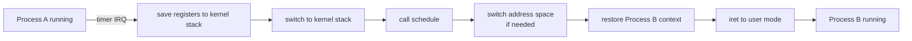

### Memory Impact

- **Per-thread kernel stack:** 8 KB (2 pages) on x86-64 Linux
- **Saved context size:** ~200 bytes (GP regs + FPU/AVX ~500 bytes with vector state)
- **TLB pressure:** On context switch to a different process, the entire TLB is flushed. The next thread will suffer TLB misses until the working set repopulates the TLB.

### Performance Impact

- **Raw switch cost:** 1–10 µs (hardware + kernel overhead)
- **Hidden cost (cache/TLB):** 10–100 µs of additional penalty as caches warm up
- **TLB miss rate spike:** From ~0.1% to 10–50% immediately after switch
- **L1/L2 cache:** ~30–80% of cache lines are cold after a switch to a different process
- **Industry data:** Cloudflare measured ~5–15% CPU overhead from context switches in production at 100K+ RPS

### Real-World Example

**Database transaction processing:** PostgreSQL uses one process per connection. When handling 1000 connections on 16 cores, context switching overhead is significant. This is why connection pooling (PgBouncer) reduces context switches by multiplexing transactions from many clients onto fewer worker processes.

### Common Misconceptions

> "Context switching only costs a few hundred instructions."

The register save/restore is ~100 instructions. But the **indirect costs** dominate: TLB flush, L1/L2 cache misses, branch predictor reset. Total cost can be 10,000–50,000 lost cycles.

> "More cores means less context switching."

**Not necessarily.** If a server has 128 cores but 10,000 threads, the scheduler still does timeslicing. Cores reduce *conflict* switches (preemption), not *voluntary* switches (blocking on I/O).

### Interview Questions

**Junior:**
1. What is saved and restored during a context switch?
2. Why is switching between threads of the same process cheaper than switching between different processes?

**Mid:**
1. Explain the difference between cooperative and preemptive multitasking. Which does Linux use?
2. How does the kernel know when to preempt a running thread?

**Senior:**
1. Design a low-latency trading system. How would you minimize or eliminate context switches?
2. You have a NUMA machine with 4 sockets. Your workload has 200 threads competing for a lock. Explain how context switching interacts with cache coherence and NUMA memory — and how you'd design around it.

### FAANG-Level Deep Dive

**TLB shootdown:** On multi-core systems, when one core changes the page table (e.g., `munmap`), all cores that have cached those PTEs must invalidate them. The kernel sends an **Inter-Processor Interrupt (IPI)** to every core running a thread of that process. Each core runs a handler that flushes its TLB. This is a *blocking operation* — the originating core waits for all ACKs. At scale (100+ cores), TLB shootdown can be a major scalability bottleneck.

**Measuring context switches:** On Linux, `perf stat -e context-switches ./program` reports voluntary and involuntary switches. `/proc/PID/status` shows `voluntary_ctxt_switches` and `nonvoluntary_ctxt_switches`. Use `pidstat -w` to watch in real time.

**`sched_yield` pitfall:** Calling `sched_yield` places the thread at the **back** of the runqueue. If the runqueue has other threads, the yielding thread won't run for the remainder of its timeslice. This can **increase** total context switches if used naively in spin-wait loops.

### Explain Like I'm 7

Imagine you're reading a book and your mom asks you to set the table. You put a bookmark in your book (save your place), set the table (do the other task), then come back and open the bookmark (restore). If you've read two books at once, you also need to remember which book is which. Context switching is the bookmark — but it takes a moment to remember where you were.

---

## 1.3 Scheduling Algorithms

### What It Is

CPU scheduling is the OS policy that decides **which thread runs next** on which core. The scheduler balances fairness, throughput, latency, and energy efficiency.

| Algorithm | Key Idea | Starvation? | Preemptive? | Complexity |
|-----------|----------|-------------|-------------|------------|
| **FIFO (FCFS)** | First come, first served | Convoy effect | No | O(1) |
| **SJF** | Shortest job first | Yes (long jobs) | No (non-preemptive) | O(n) |
| **SRTF** | Preemptive SJF | Yes | Yes | O(n) |
| **Round Robin** | Fixed time quantum | No | Yes | O(1) |
| **Priority** | Higher priority runs first | Yes (low priority) | Usually | O(1)–O(n) |
| **MLFQ** | Multiple queues with feedback | Resolved by aging | Yes | O(1) |
| **CFS** (Linux) | Fair share based on vruntime | No | Yes | O(log n) |

### Why It Exists

Without scheduling, the CPU would run one thread to completion while others starve. Scheduling ensures:
- **Fairness:** every thread gets CPU time
- **Responsiveness:** interactive apps feel snappy
- **Throughput:** batch jobs complete efficiently
- **Real-time guarantees:** media playback doesn't stutter

### Internal Working (Step by Step)

**Linux CFS (Completely Fair Scheduler):**

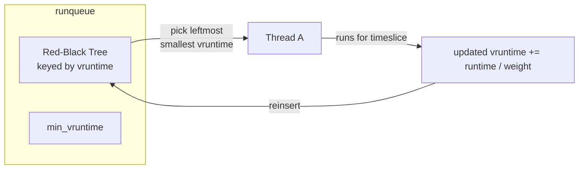

1. Each runqueue has a red-black tree keyed by `vruntime` (virtual runtime in nanoseconds)
2. When a thread runs, its `vruntime` increases: `vruntime += (executed_ns * 1024) / task_weight`
3. The scheduler picks the **leftmost node** (smallest vruntime = most owed CPU time)
4. After running, the thread is reinserted into the tree
5. `min_vruntime` tracks the smallest vruntime on the runqueue — used to prevent overflow

**Timeslice calculation:**

```
target_latency = 20 ms (default for interactive workloads)
nr_running = number of runnable threads
timeslice = target_latency / nr_running
```

If there are 4 runnable threads, each gets 5 ms. Minimum granularity is 1 ms (sysctl_sched_min_granularity).

**Round Robin:**

1. Timer interrupt fires every `quantum` (e.g., 10 ms)
2. Scheduler moves current thread to the **back** of the FIFO runqueue
3. Picks the head of the queue to run next

**MLFQ (Multi-Level Feedback Queue):**

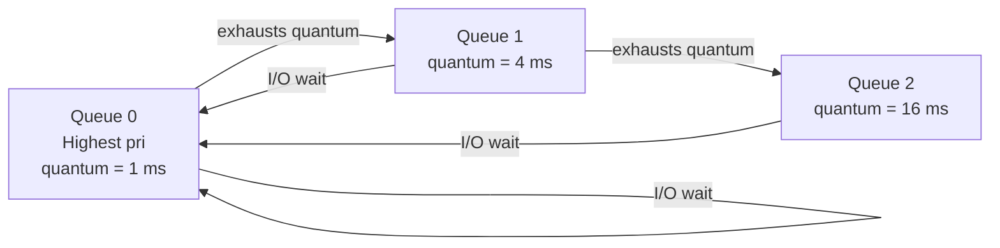

- New threads enter the top queue (highest priority, smallest quantum)
- If a thread uses its entire quantum, it drops to the next lower queue
- If a thread yields before its quantum ends (I/O wait), it stays or moves up
- **Aging** prevents starvation: periodically boost all threads to the top queue

### Memory Impact

- **CFS RB tree:** O(n) memory for n threads — each node is ~40 bytes
- **Runqueue per-core:** Linux keeps a separate runqueue per CPU to avoid locking. 128 cores × 4 bytes per entry = negligible
- **Scheduling data in PCB:** `vruntime`, `weight`, `policy`, `prio` — ~50 bytes

### Performance Impact

| Metric | Round Robin | CFS | MLFQ |
|--------|-------------|-----|------|
| Context switches/sec | High (fixed quantum) | Adaptive | Variable |
| Interactive latency | Poor (fixed quantum) | Good (~1 ms minimum) | Excellent |
| Throughput | OK | Good (tuned for throughput) | Good |
| Overhead | O(1) | O(log n) insert/remove | O(1) |
| Fairness | Perfect | Excellent | Poor without aging |

### Real-World Example

**Android vs iOS:** Android uses CFS (Linux kernel). iOS uses a custom MLFQ-like scheduler. iOS prioritizes touch events aggressively — this is why iOS feels more responsive to touch even on older hardware.

**Cloudflare Workers:** Uses a cooperative scheduler (not preemptive) — each worker runs to completion. No context switching during execution avoids JIT cache thrashing. This is why Cloudflare Workers can be cheaper than VMs or containers for serverless compute.

### Common Misconceptions

> "Round Robin is always fair."

Round Robin is fair in *CPU time allocation per thread*, but not in *work completed*. A thread with heavy L3 cache misses may get the same quantum as a compute-bound thread but do far less useful work.

> "CFS gives equal time to all threads."

CFS gives time proportional to `weight`, which is based on `nice` value. A thread with `nice = 0` gets more CPU than `nice = 19`. CFS is **proportional fair**, not strictly equal.

### Interview Questions

**Junior:**
1. Compare Round Robin with Priority scheduling. What problem does each solve?
2. What is the convoy effect in FCFS?

**Mid:**
1. Explain how Linux CFS decides how long a thread should run before being preempted.
2. If you have 1 CPU-bound thread and 50 I/O-bound threads, how would you schedule them? Justify.

**Senior:**
1. Your latency-sensitive application has a hard requirement of 99.9th percentile latency < 1 ms. How would you configure the Linux scheduler (CFS knobs, cgroups, CPU pinning, real-time priorities)?
2. Design a scheduler for a datacenter that runs mixed workloads: latency-critical search, throughput-optimized batch ML training, and best-effort background tasks.

### FAANG-Level Deep Dive

**SCHED_FIFO and real-time throttling:** `SCHED_FIFO` threads run until they block or yield. A runaway FIFO thread can lock up the system (no `init` runs). Linux uses `sched_rt_runtime_us` (default 950,000 µs per 1,000,000 µs period) — real-time threads get 95% of CPU, leaving 5% for kernel tasks.

**NUMA-aware scheduling:** CFS uses **numa balancing** — the kernel periodically samples memory pages accessed by a thread and migrates them to the NUMA node of the core running that thread. Page access patterns are tracked via the page table's Access and Dirty bits. On the next scan, pages that were accessed remotely are migrated.

**Energy-Aware Scheduling (EAS):** On ARM big.LITTLE and Intel hybrid architectures (P-cores + E-cores), EAS estimates the energy consumed by running a task on each CPU type. Light tasks are placed on E-cores to save power. The energy model is provided via ACPI or devicetree.

### Explain Like I'm 7

Scheduling is like a teacher deciding which student gets to talk next. FIFO means students raise their hands in order. Round Robin means each student gets 30 seconds in a circle. Priority means the teacher always calls on the student with the most urgent question. CFS is like giving more speaking time to the student who has talked the least so far.

---

## 1.4 CPU Architecture

### What It Is

Modern CPUs are complex systems-on-chip with multiple cores, cache hierarchies, memory controllers, and interconnects. Understanding the architecture is critical for performance engineering.

### Why It Exists

Moore's Law (transistor density) has slowed. Performance gains now come from:
- **More cores** (parallelism)
- **Bigger caches** (hide memory latency)
- **Smarter prefetching** (hide DRAM latency)
- **Simultaneous multithreading** (hide pipeline stalls)

### Internal Working

**Cache Hierarchy:**

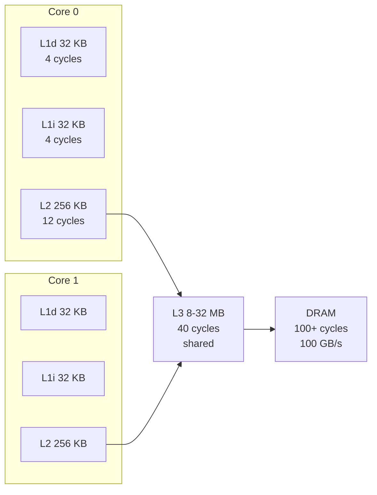

| Level | Size | Latency | Bandwidth | Associativity | Line size |
|-------|------|---------|-----------|---------------|-----------|
| L1d | 32 KB | 4 cycles | 1 TB/s+ | 8-way | 64 B |
| L1i | 32 KB | 4 cycles | — | 8-way | 64 B |
| L2 | 256–512 KB | 12 cycles | >500 GB/s | 8-way | 64 B |
| L3 | 8–32 MB | 40 cycles | 200–400 GB/s | 16–20 way | 64 B |
| RAM | 64 GB+ | 100 ns (~300 cycles) | 50–100 GB/s | — | 64 B |

**MESI Cache Coherency Protocol:**

Every cache line is in one of four states:

| State | Meaning | This core has | Other cores have |
|-------|---------|---------------|------------------|
| **M**odified | Dirty (written) | Exclusive copy | Stale (must invalidate) |
| **E**xclusive | Clean | Exclusive copy | None |
| **S**hared | Clean | Shared copy | Shared copy possible |
| **I**nvalid | Not in cache | None | — |

**Protocol actions:**
- **Read miss:** Send bus read. Other cores snoop. If M found → writeback + transition to S. If S found → transition to S. If none → fetch from L3/RAM.
- **Write hit (S state):** Send bus invalidate. All other cores transition their copy to I. Local copy goes to M.
- **Write hit (E state):** No bus transaction needed. Transition to M.
- **Write hit (M state):** No bus transaction. Data is already exclusive + dirty.
- **Write miss:** Send read-for-ownership (RFO). Other cores invalidate. Fetch cache line into M state.

**NUMA (Non-Uniform Memory Access):**

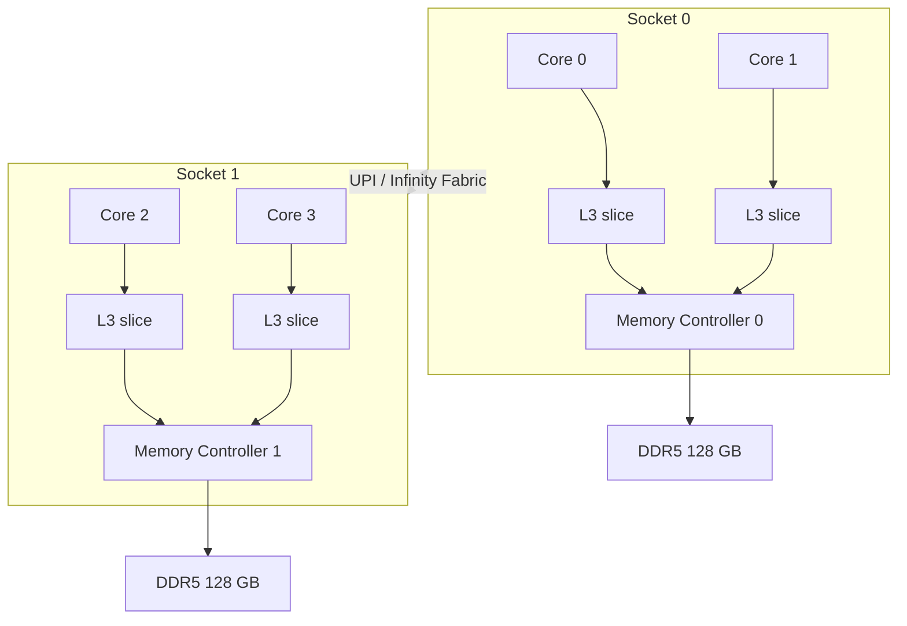

- Access to local memory (same socket) = ~100 ns
- Access to remote memory (different socket) = ~150–180 ns
- **False sharing:** Threads on different cores write to different fields in the same cache line → MESI protocol forces cache line bouncing → dramatic performance collapse

### Memory Impact

- **L1 cache:** 32 KB per core (instruction + data)
- **L2 cache:** 256 KB–1 MB per core
- **L3 cache:** 2–64 MB shared
- **TLB:** L1 TLB (64 entries for 4 KB pages) + L2 TLB (1024+ entries)

### Performance Impact

- **Sequential memory access:** ~50 GB/s
- **Random memory access:** ~5 GB/s (page walks, TLB misses)
- **Remote NUMA access:** 1.5–2× latency vs local
- **False sharing:** Can cause 10–100× performance degradation for contended data

### Real-World Example

**Redis:** Single-threaded, but uses hash tables extensively. Redis relies on pointers (8 bytes) — pointer chasing causes cache misses. With a 16 MB L3 cache and 1M keys, a large hash table fits in L3 but individual nodes are randomly distributed → L2 miss on every pointer dereference.

**Matrix multiplication:** Tiled multiplication with blocks sized to fit in L1 (32 KB) achieves >90% of peak FLOPs. Naive multiplication achieves ~10% because each multiply causes cache misses.

### Common Misconceptions

> "False sharing means two threads accessing the same data."

**No.** False sharing occurs when threads access *different* data that happens to sit on the **same cache line**. The cache coherency protocol treats it as if they're sharing the data.

> "More cache is always better."

**Not exactly.** Larger caches have higher latency (wire delay). An L1 hit is 4 cycles. A large L3 hit is 40+ cycles. Also, larger caches consume more power.

### Interview Questions

**Junior:**
1. Draw a modern CPU core and label L1, L2, L3 caches. What latency does each have?
2. What is cache coherence? Why can't two cores have Modified copies of the same cache line?

**Mid:**
1. Explain the MESI protocol. Walk through what happens when Thread A writes to an address that Thread B on another core has in its L1 cache.
2. What is false sharing? Show a code example that triggers it and explain how to fix it.

**Senior:**
1. Your team's database shows 10× performance improvement when running on a single socket vs dual sockets. What's the root cause? How would you diagnose it?
2. Design a concurrent hash table that minimizes MESI traffic. Consider the tradeoffs between fine-grained locks, lock-free structures, and cache-line padding.

### FAANG-Level Deep Dive

**Hardware prefetching:** Modern CPUs have 4+ prefetchers:
- **Stream prefetcher:** Detects sequential access patterns and prefetches the next cache line
- **Stride prefetcher:** Detects constant-stride access patterns (e.g., `a[i*128]`)
- **Spatial prefetcher:** Fetches adjacent cache lines on L2 miss
- **Region prefetcher (Intel):** Tracks 2 MB regions

Prefetchers can cause **cache pollution** — prefetching data that's never used, evicting useful lines.

**Simultaneous Multithreading (SMT/Hyper-Threading):** Each physical core presents 2 logical cores. They share execution units (ALUs, FPUs, load/store). If one thread stalls on a cache miss, the other thread can use the execution units. SMT overhead is ~5% die area but provides 15–30% throughput gain for multi-threaded workloads. **Security note:** SMT has been implicated in side-channel attacks (PortSmash, MDS).

**Ring Bus vs Mesh:** Intel Skylake uses a ring bus connecting cores, L3 slices, and memory controller. At >12 cores, ring bus latency grows (longer path). Intel Xeon (24+ cores) uses a mesh interconnect — lower latency at scale but higher complexity.

### Explain Like I'm 7

Your CPU is like a library. L1 cache is the book on your desk (instant to read). L2 is the bookshelf next to you (fast). L3 is the whole room (a bit slower). RAM is the library warehouse across the street (slow). If two people want the same book, they share. But if one person wants to write in it, the other person's copy becomes invalid.

---

## 1.5 Virtual Memory

### What It Is

Virtual memory is an **abstraction** that gives each process its own contiguous address space (0x0 to 0x7FFFFFFFFFFF on 64-bit Linux), backed by physical pages managed by the OS.

### Why It Exists

1. **Isolation:** Process A cannot read or corrupt Process B's memory
2. **Simplification:** Each process thinks it has the entire address space — no need to coordinate physical memory layout
3. **Overcommit:** A program can allocate more virtual memory than physical RAM exists; physical pages are committed on first access
4. **Demand paging:** Only actively used pages need to be in RAM; unused pages can be swapped to disk

### Internal Working (Step by Step)

**x86-64 4-level paging (48-bit virtual address):**

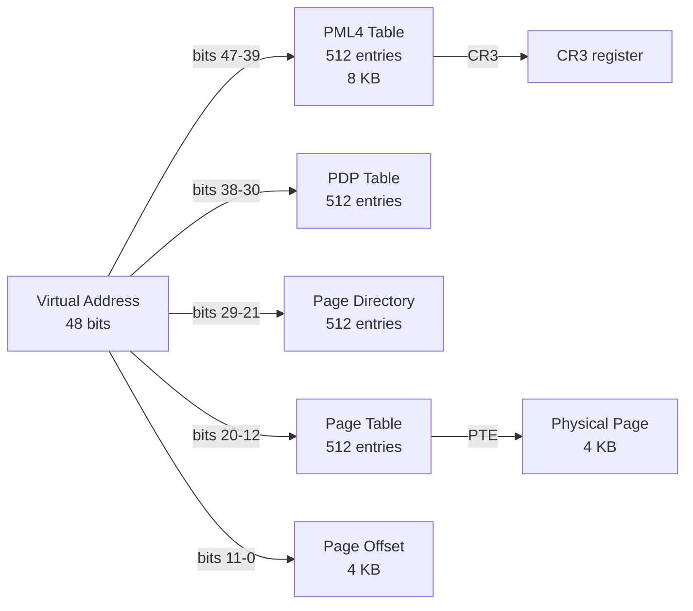

**Step-by-step page walk:**

1. CPU receives virtual address (e.g., `0x7F003A4B2000`)
2. MMU extracts PML4 index (bits 47-39) → looks up entry in PML4 table (pointed to by CR3)
3. PML4 entry points to PDP table base → extract PDP index (bits 38-30) → look up entry
4. PDP entry points to Page Directory → extract PD index (bits 29-21) → look up entry
5. PD entry points to Page Table → extract PT index (bits 20-12) → look up PTE
6. PTE contains physical page frame number (PFN)
7. Physical address = PFN << 12 + page offset (bits 11-0)

**Page Fault Handling:**

When the PTE has **Present = 0**, the CPU raises a page fault (#PF):

```mermaid
flowchart TD
    A[Access virtual address<br>PTE.Present = 0] --> B[CPU pushes fault address<br>to kernel stack]
    B --> C[Page fault handler<br>do_page_fault]
    C --> D{Reason?}
    D -->|Invalid access<br>(segfault)| E[send SIGSEGV]
    D -->|Minor fault<br>(page not resident<br>but in swap cache)| F[Allocate page<br>Read from swap cache<br>Update PTE]
    D -->|Major fault<br>(page on disk)| G[Allocate page<br>Submit disk I/O<br>Sleep until I/O completes]
    D -->|COW fault| H[Copy page<br>Update both PTEs<br>Mark writable]
    D -->|Demand zero| I[Allocate zero-filled page]
    F --> J[Return to instruction<br>Retry access]
    G --> J
    H --> J
    I --> J
```

**TLB (Translation Lookaside Buffer):**

- Small, fast cache of recent page table entries (PTEs)
- **L1 TLB:** 64 entries for data, 64 for instructions (4 KB pages)
- **L2 TLB (STLB):** 1024–2048 entries, unified
- **TLB reach = TLB entries × page size**
  - 64 entries × 4 KB = 256 KB (tiny!)
  - 64 entries × 2 MB (huge pages) = 128 MB (much better)

### Memory Impact

- **Page table overhead (4 KB pages):** 4 KB per 2 MB of virtual address = ~0.2% overhead
- **Per process:**
  - PML4: 4 KB (one table, 512 entries)
  - PDPT: 4 KB per used region
  - PD, PT: grows with memory usage
  - 1 GB RSS = ~2 MB of page table
- **Huge pages (2 MB):** One PTE covers 2 MB → 512× fewer page table entries

### Performance Impact

- **TLB hit:** 1–2 cycles (L1 TLB)
- **TLB miss (L2 TLB hit):** ~10 cycles
- **TLB miss (page walk):** 50–200 cycles — walks 4 memory levels
- **Minor page fault:** ~1 µs (just allocate page, no I/O)
- **Major page fault:** 1–10 ms (disk I/O!) — catastrophic for latency

### Real-World Example

**Database buffer pool:** PostgreSQL uses its own buffer pool (`shared_buffers`) to cache database pages in a fixed-size memory region. This bypasses the OS page cache to avoid double caching and to control eviction policy (LRU instead of the OS's clock algorithm). But the OS still manages virtual memory — `shared_buffers` is backed by a file on disk, and the OS can swap it if the system is overcommitted.

**Chrome's per-tab process isolation:** Each tab is a separate process with its own page table. Chrome can have 50+ processes → 50+ page tables → significant memory overhead for PTEs. This is one reason Chrome's memory usage is high.

### Common Misconceptions

> "Swap makes the system run out of memory slower."

**Barely.** Swap hides the problem but performance collapses once the working set exceeds RAM. The system may spend 99% of CPU time in the page reclaim code. This is called **thrashing**.

> "Allocating memory with malloc actually gives you physical memory."

**No.** `malloc` calls `brk` or `mmap`, which reserves **virtual** address space. Physical pages are allocated on **first access** (demand paging). You can allocate 10 GB and use only 100 MB of physical RAM.

### Interview Questions

**Junior:**
1. What is a page fault? Describe the difference between a minor and major page fault.
2. How does virtual address translation work on x86-64? Name the 4 levels.

**Mid:**
1. Explain the tradeoffs between 4 KB pages and 2 MB huge pages. When would you use each?
2. How does mmap() work? What happens when you access an mmap'd file?

**Senior:**
1. Your production database server is suffering from TLB misses. How would you diagnose and fix it?
2. Design an operating system's page replacement algorithm. Compare LRU, Clock (Second Chance), and LFU. Which one does Linux use (roughly)?

### FAANG-Level Deep Dive

**Linux Page Cache & Readahead:** When you read a file sequentially, the kernel detects the pattern and prefetches pages ahead (readahead). Default readahead window = 128 KB, adaptive up to 512 KB. For random access patterns, readahead is harmful — it pollutes the page cache. Use `posix_fadvise(POSIX_FADV_RANDOM)` to disable it.

**Transparent Huge Pages (THP):** Linux automatically promotes contiguous groups of 4 KB pages to 2 MB huge pages. But promotion requires memory compaction (moving pages to create contiguous 2 MB regions). This can introduce latency spikes. Databases (MongoDB, PostgreSQL) often disable THP because of these spikes.

**KSM (Kernel Same-page Merging):** Used by KVM (virtualization). Kernel scans pages and merges identical pages into single copy-on-write mappings. KVM deduplicates identical guest memory pages. Saves memory at the cost of CPU for scanning.

**OOM Killer:** When the kernel runs out of memory (overcommit + allocation pressure), it selects a process to kill. Selection is based on `oom_score` (memory size × parent's oom_score_adj). The victim is chosen by a heuristic: largest memory footprint, oldest process, etc.

### Explain Like I'm 7

Virtual memory is like having a huge imaginary toy box (the virtual address space) but only a small real toy box (physical RAM). You put toys you're playing with in the real box. When you want a different toy, you swap it. The real box only holds what you need right now. Each person gets their own imaginary box that doesn't overlap with anyone else's.

---

## 1.6 Memory Allocation

### What It Is

Memory allocation manages how user-space programs acquire and release memory. Two primary arenas: the **stack** (automatic, LIFO) and the **heap** (manual, arbitrary order).

### Why It Exists

Without an allocator, every program would need to manage physical memory directly — impossible for multi-process, multi-threaded environments. The allocator abstracts the kernel's page-level allocation into byte-granularity chunks usable by programs.

### Internal Working

**Stack allocation:**

```asm
; x86-64: allocating 32 bytes on stack
sub rsp, 32     ; decrement stack pointer
; access via [rsp+0], [rsp+8], etc.
add rsp, 32     ; restore
```

- O(1) allocation — just decrement RSP
- O(1) deallocation — just increment RSP
- **Stack overflow:** touching the guard page below RSP → SIGSEGV
- Per-thread: each thread has its own stack (default 2 MB virtual, 8 KB committed)

**Heap allocation (`malloc` / `free`):**

```mermaid
flowchart TD
    M[malloc(32)] --> S{Small?}
    S -->|<= 128 KB| T[thread-local cache<br>tcache]
    S -->|<= 1 MB| F[fastbin / smallbin]
    S -->|> 1 MB| L[`mmap` system call]
    T -->|hit| P[Return chunk]
    T -->|miss| F
    F -->|hit| P
    F -->|miss| A[top chunk / sbrk]
    A -->|not enough| K[`brk` syscall<br>to grow heap]
    K --> P
    L --> MM[`mmap` syscall<br>returns page-aligned region]
```

**glibc malloc (ptmalloc) internals:**

1. **Arena:** Each arena is a large region (heap) managed by ptmalloc. Main arena uses `sbrk`. Additional arenas use `mmap`.
2. **tcache (thread-local cache):** Per-thread cache of small chunks (up to ~100 KB). No locking required. 64 bins, each holding up to 7 chunks of the same size.
3. **Fastbin:** Singly-linked list of recently freed small chunks. LIFO. No coalescing.
4. **Smallbin:** Doubly-linked list of chunks (coalesced). FIFO.
5. **Unsorted bin:** Recently freed chunks waiting to be sorted.
6. **Top chunk:** The last chunk in the arena — can be extended via `brk`.
7. **Chunk header:** 8 bytes preceding each allocation:

```
| prev_size (8) | size (8) | ... user data ... |
                 ^-- returned pointer

size field includes flags:
  bit 0: PREV_INUSE (1 = previous chunk in use)
  bit 1: IS_MMAPPED
  bit 2: NON_MAIN_ARENA
```

**Free operation:**

1. User calls `free(ptr)`
2. ptmalloc gets the chunk header from `ptr - 8`
3. Checks if it's mmap'd → if so, `munmap`
4. Otherwise: stores in tcache (if space), else fastbin/smallbin
5. Coalesces adjacent free chunks into larger free chunks

**Fragmentation:**

| Type | What | Example |
|------|------|---------|
| **Internal** | Allocated block is larger than requested | malloc(1) returns a 32-byte chunk → 31 bytes wasted |
| **External** | Free blocks too small to satisfy requests | 1000 bytes free but split into 500 + 500 → malloc(600) fails |

**slab allocator (kernel):**

Used for kernel objects (inodes, PCB, file descriptors) — avoids fragmentation by allocating fixed-size object caches:

```
kmem_cache_create("task_struct", sizeof(struct task_struct), ...)
  → kmem_cache_alloc(cache)   // O(1)
  → kmem_cache_free(cache, obj) // O(1)
```

Each slab is one or more contiguous pages divided into equal-sized objects. Objects can be: **full**, **partial**, or **free**.

### Memory Impact

- **Malloc overhead:** 8–16 bytes per allocation (header + alignment padding)
- **Stack:** 8 KB + 2 MB virtual per thread (usually overcommitted)
- **Internal fragmentation:** 25–50% for small allocations in glibc malloc
- **External fragmentation:** Can cause OOM even when total free memory > requested

### Performance Impact

- **Stack alloc/free:** 1–3 cycles (just RSP arithmetic)
- **tcache alloc:** ~20 cycles (thread-local, no lock)
- **Small malloc (new arena):** ~100 cycles
- **Large malloc (mmap):** ~1000 cycles (page table updates, TLB effects)
- **brk syscall:** ~500 ns (mode switch + kernel heap management)

### Real-World Example

**Redis avoids malloc fragmentation.** Redis uses `jemalloc` (arena-based, compacting allocator) to reduce fragmentation. After heavy load, Redis may show 30–50% of allocated memory as fragmentation. `INFO memory` reports `used_memory_rss` vs `used_memory` to track this.

**Google's TCMalloc** uses per-thread caches and per-CPU caches. It's designed to minimize lock contention in multi-threaded workloads. Abseil's `Cord` and other structures depend on TCMalloc's efficiency.

### Common Misconceptions

> "free() returns memory to the OS immediately."

**No.** Most allocators (glibc, jemalloc, tcmalloc) keep freed memory in internal caches for future reuse. `free()` only releases to the OS when a large enough contiguous region becomes free (typically >128 KB via `madvise(MADV_DONTNEED)`).

> "Stack overflow always crashes immediately."

Stack overflow on a thread typically hits the guard page (the last page of the stack's virtual address range). The kernel sends SIGSEGV. But large stack frames that skip over the guard page can corrupt heap memory silently.

### Interview Questions

**Junior:**
1. Explain the difference between stack and heap allocation.
2. What is memory fragmentation? Give an example.

**Mid:**
1. How does `malloc` work internally in glibc? What are tcache, fastbins, and the top chunk?
2. Compare glibc malloc, jemalloc, and tcmalloc. When would you choose each?

**Senior:**
1. A production service uses 64 GB RAM but `malloc` fails at 45 GB. Debug the issue.
2. Design a real-time memory allocator for a game engine that must allocate and free thousands of small objects per frame without pauses.

### FAANG-Level Deep Dive

**`madvise` for memory management:**
- `MADV_DONTNEED`: OS releases physical pages. Next access causes page fault (zero-filled). This is how jemalloc returns memory to the OS.
- `MADV_FREE` (Linux 4.5+): OS may free pages but doesn't guarantee. Lazy release — faster than DONTNEED but memory isn't reclaimed until pressure.
- `MADV_COLD`: Hint that pages will not be used soon — kernel moves them to the end of LRU (swap candidate).
- `MADV_PAGEOUT`: Hint to swap out pages immediately.

**Memory compaction:** Linux kernel can compact memory to create contiguous 2 MB regions (for THP). Moves pages around — this is why THP can introduce latency spikes. Compaction threads scan pages, migrate them, and update PTEs.

**ASLR (Address Space Layout Randomization):** Randomizes the base address of heap, stack, mmap regions, and shared libraries. Mitigates buffer overflow exploits by making it harder to guess addresses. On 64-bit, 28 bits of entropy for the heap, 22 bits for the stack.

### Explain Like I'm 7

The **stack** is like a stack of plates — you put a new plate on top (push) and take from the top (pop). Fast and neat. The **heap** is like a pile of differently sized blocks — you grab one when you need it and put it back when done. Over time, the pile has holes between blocks — that's fragmentation.

---

## 1.7 Paging vs Segmentation

### What It Is

**Paging** divides virtual memory into fixed-size pages (4 KB, 2 MB, 1 GB). **Segmentation** divides virtual memory into variable-sized segments (code, data, stack). Modern OSes use **paging** almost exclusively (x86-64 in long mode has segmentation largely disabled).

### Why It Exists

Paging solves the **external fragmentation** problem of segmentation — with fixed-size pages, there's no need to find a contiguous region of the right size. Segmentation was the 8086/80286 approach where memory was divided into 64 KB segments with an offset. Modern x86-64 uses segments only for TLS (FS/GS segment registers pointing to thread-local storage).

### Internal Working

**Paging (x86-64):**

Already covered in Virtual Memory (1.5) — 4-level page tables, 48-bit virtual address.

**Huge pages:**

| Page size | Use case | TLB entries for 2 GB |
|-----------|----------|----------------------|
| 4 KB | General purpose | 524,288 |
| 2 MB | Database buffers, JVM heaps | 1,024 |
| 1 GB | Virtualization (hypervisor) | 2 |

**TLB reach example:**

```
TLB entries: 64 (L1 data TLB)
Page size: 4 KB
TLB reach = 64 × 4 KB = 256 KB

With 2 MB pages:
TLB reach = 64 × 2 MB = 128 MB
```

A working set of 100 MB would miss the L1 TLB 400× per iteration with 4 KB pages, but fit entirely in the TLB with 2 MB pages.

**Segmentation (x86 legacy):**

```
Logical address = Segment Selector + Offset
                  ↓
              Segment Descriptor (in GDT/LDT)
                  ↓
              Base + Limit + Type (code/data, ring)
                  ↓
              Linear address (≈ virtual address)
```

In protected mode, CS (code segment) determines privilege level (CPL 0 = kernel, CPL 3 = user). DS, ES, FS, GS are data segments. FS is used for TLS on Linux x86-64.

### Memory Impact

- **4 KB pages:** High page table overhead (~0.2% of virtual memory)
- **2 MB pages:** 512× less page table memory
- **Segmentation:** No internal fragmentation (variable sizes), but external fragmentation requires compaction

### Performance Impact

| Metric | 4 KB pages | 2 MB huge pages | 1 GB huge pages |
|--------|-----------|-----------------|-----------------|
| TLB reach | 256 KB | 128 MB | 64 GB |
| Page walk cost | 4 levels | 3 levels | 2 levels |
| Allocation latency | Low | High (must find 2 MB contiguous) | Very high |
| Overhead for small allocs | Low | Very high (512 KB waste if 2 KB used) | N/A |

### Real-World Example

**PostgreSQL** recommends explicit huge pages (`huge_pages = on`). The 16 GB shared buffer fits in 8192 huge pages (2 MB) → only 8192 TLB entries → L2 TLB can cache them all. With 4 KB pages, 4 million TLB entries → cache miss storm.

**JVM (Java):** `-XX:+UseTransparentHugePages` enables THP for the JVM heap. Java heaps are typically GB-sized — huge pages reduce TLB misses significantly. In benchmarks, huge pages improve throughput by 5–15% for memory-intensive workloads.

### Common Misconceptions

> "Huge pages are always faster."

**No.** Huge pages waste memory if only a small portion of the 2 MB is used (internal fragmentation). Also, allocating 2 MB contiguous memory is harder — the allocator may stall while compacting memory. THP can cause latency spikes.

> "Segmentation is obsolete."

**Partially.** Segmentation for memory protection is obsolete in 64-bit mode. But FS/GS segment registers are still used for Thread-Local Storage on all modern x86-64 systems.

### Interview Questions

**Junior:**
1. What is a page? What is a page table?
2. What is the difference between paging and segmentation?

**Mid:**
1. Explain TLB reach. Why do databases benefit from huge pages?
2. How does the kernel provide 2 MB huge pages? What is the difference between explicit huge pages (hugetlbfs) and THP?

**Senior:**
1. Your JVM application shows high TLB miss rates. How would you diagnose and fix this without code changes?
2. Design a hybrid page-size scheme that uses 4 KB for sparse allocations and 2 MB for dense regions. How would the OS decide?

### FAANG-Level Deep Dive

**Linux `hugetlbfs`:** Explicit huge pages are reserved at boot or via `/proc/sys/vm/nr_hugepages`. They are locked in RAM (cannot be swapped). Applications `mmap` files in `/hugetlbfs` or use `MAP_HUGETLB`. This gives deterministic performance (no compaction stalls) but wastes memory if underutilized.

**Five-level paging (57-bit):** Intel introduced 5-level paging in Ice Lake (2019). With 4 KB pages and 4-level paging, you can address 256 TB (48 bits). With 5-level paging, 128 PB (57 bits). Adds one more page walk level but allows larger systems.

**Inverted page tables (PowerPC, IA-64):** Instead of per-process page tables, an inverted page table has one entry per physical frame. The virtual address is hashed to find the entry. Uses less memory for many processes but hashing collision means O(1) typical but O(n) worst case.

### Explain Like I'm 7

Paging is like storing LEGOs in fixed-size boxes. A 2 MB box holds a lot, a 4 KB box holds a little. You use big boxes for big things and small boxes for small things. If you use only big boxes but have tiny things, you waste space. If you use only small boxes, you spend ages finding things.

---

## 1.8 Interrupts & System Calls

### What It Is

**Interrupts** are signals from hardware or software that cause the CPU to pause the current instruction stream and execute an **interrupt handler** (in kernel mode). **System calls** are software-generated interrupts (or `syscall` instructions) that transition from user to kernel mode.

### Why It Exists

- User mode code cannot access hardware, page tables, or kernel data structures. System calls are the **controlled entry point** for privileged operations.
- Hardware interrupts allow devices (disk, NIC, keyboard) to notify the CPU without polling — critical for performance.

### Internal Working

**System call flow (x86-64, Linux):**

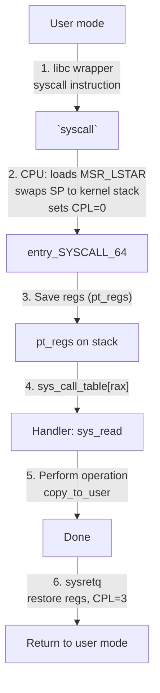

**Interrupt flow:**

1. Device asserts interrupt line (or writes MSI-X message)
2. CPU completes current instruction, checks for pending interrupts
3. CPU saves: SS, RSP, RFLAGS, CS, RIP (on kernel stack)
4. CPU loads interrupt handler address from IDT (Interrupt Descriptor Table)
5. Handler runs (with interrupts disabled or enabled depending on IF flag)
6. Handler acknowledges the interrupt (EOI) to the PIC/APIC
7. `iretq` restores saved regs and returns to interrupted code

**IDT entry (x86-64):**

```
struct idt_entry {
    uint16_t offset_low;
    uint16_t selector;       // code segment selector
    uint8_t  ist;            // interrupt stack table index
    uint8_t  type_attr;      // type, DPL, present
    uint16_t offset_mid;
    uint32_t offset_high;
    uint32_t reserved;
} __attribute__((packed));
```

**Interrupt types:**

| Type | Source | Example | Can Be Masked? |
|------|--------|---------|----------------|
| Hardware | Device | Disk, NIC, timer | Yes (IF flag) |
| Software | `int n` instruction | `int 0x80` (legacy syscall) | No (trap) |
| Exception | CPU | Page fault, divide by zero | No (fault/abort/trap) |

### Memory Impact

- **IDT:** 256 entries × 16 bytes = 4 KB per CPU
- **Kernel stack per thread:** 8 KB
- **Interrupt stacks (IST):** 4 stacks per CPU — 16 KB each
- **pt_regs on stack per syscall:** ~120 bytes

### Performance Impact

- **`syscall` instruction latency:** ~50–70 cycles (CPU hardware path)
- **Total syscall overhead (Linux):** ~150–300 cycles on modern hardware
- **Interrupt handling:** 500–2000 cycles depending on handler complexity
- **Cost of `getpid()`:** ~200 ns → 600 cycles at 3 GHz
- **io_uring:** Reduces syscall overhead by batching

### Real-World Example

**io_uring (Linux 5.1+):** A new async I/O interface that drastically reduces syscall overhead. The application allocates a shared ring buffer (kernel + user space) to submit I/O requests and reap completions. No syscall needed for submission or completion in many cases.

**eBPF (extended Berkeley Packet Filter):** Allows running user-defined programs in kernel space without syscalls. eBPF programs are verified for safety and JIT-compiled. Eliminates the need to copy packets to user space.

### Common Misconceptions

> "System calls are slow because of mode switch."

The mode switch itself is fast (~70 cycles). The real cost is TLB/cache misses (kernel lives in different addresses), Spectre mitigations (retpolines, STIBP, IBRS), and security checks (LSM hooks).

> "Interrupt handlers run to completion."

**Not always.** Linux uses **top-half / bottom-half** model. The **top-half** (ISR) runs with interrupts disabled. The **bottom-half** (softirq/tasklet/workqueue) runs with interrupts enabled.

### Interview Questions

**Junior:**
1. What happens when the user calls `read()`? Walk through the steps.
2. What is the difference between a hardware interrupt and a software interrupt?

**Mid:**
1. Explain top-half vs bottom-half interrupt processing in Linux.
2. Compare `syscall` vs `int 0x80`. Why was `syscall` introduced?

**Senior:**
1. Your application spends 30% of CPU time in the kernel (syscalls). How would you reduce this?
2. Design a kernel bypass mechanism for a high-frequency trading application.

### FAANG-Level Deep Dive

**Kernel bypass:** DPDK and SPDK allow user-space drivers to directly control hardware. The application mmaps device registers and DMA buffers, polls for completions in user space (busy-waiting). No syscalls, no interrupts, no context switches. Latency: 1–5 µs instead of 10–50 µs.

**Spectre & Meltdown mitigations:** Kernel Page Table Isolation (KPTI) — user mode page tables no longer map kernel pages. On syscall, the kernel switches to a page table that maps the kernel. KPTI added 5–30% overhead to syscalls.

**seccomp-bpf:** A security mechanism that filters allowed syscalls. Chromium's sandbox uses seccomp to restrict renderer processes to ~30 out of 400+ syscalls.

### Explain Like I'm 7

System calls are like asking a teacher for permission. You're a student (user mode) and you want to use the special scissors (hardware). You raise your hand (syscall), the teacher handles the scissors, gives you the result, then returns to teaching other students.

---

## 1.9 Deadlock

### What It Is

A deadlock is a state where two or more threads are each waiting for the other to release a resource, and none can proceed.

### Why It Exists

Deadlock arises from **cyclic dependency** on shared resources. With fine-grained locking (multiple locks per operation), programmers can accidentally create cycles.

### Internal Working

**Coffman conditions (all four must hold):**

1. **Mutual exclusion:** Resources cannot be shared
2. **Hold and wait:** A thread holds at least one resource while waiting for another
3. **No preemption:** Resources cannot be forcibly taken away
4. **Circular wait:** A cycle exists in the resource allocation graph

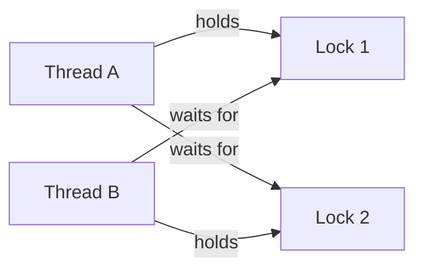

**Deadlock Prevention (break one condition):**

| Condition | Prevention Strategy | Cost |
|-----------|-------------------|------|
| Mutual exclusion | Use lock-free structures (CAS) | Not always possible |
| Hold and wait | Acquire all locks atomically | Reduces concurrency |
| No preemption | Try-lock with backoff | Wasted CPU (spinning) |
| Circular wait | Lock ordering (always acquire A before B) | Requires discipline |

**Deadlock Avoidance — Banker's Algorithm:**

Check if a resource allocation leaves the system in a **safe state** (there exists a sequence where all threads can complete). For each request: check if request exceeds available → if not, temporarily allocate; run safety algorithm; if safe → grant.

### Memory Impact

- **Resource allocation graph:** O(n + m) where n = threads, m = resources
- **Banker's algorithm:** O(n² × m) matrix operations
- **Lock metadata:** ~40 bytes per lock in pthread_mutex_t

### Performance Impact

- **Deadlock detection:** Cycle detection is O(V + E) in wait-for graph
- **Try-lock costs:** `pthread_mutex_trylock` avoids blocking but adds CAS overhead
- **Lock ordering discipline:** Zero runtime cost (compile-time policy)

### Real-World Example

**Database deadlocks:** Two transactions updating the same two rows in opposite order cause a deadlock. DBMS detects the wait-for cycle and chooses a **victim** (rolls back one transaction). PostgreSQL uses `deadlock_timeout` (default 1s).

**The Dining Philosophers:** 5 philosophers, 5 forks, each picks up left fork first → all hold left fork, all wait for right fork → deadlock.

### Common Misconceptions

> "Deadlocks only happen with mutexes."

**False.** Deadlocks can happen with any resource: file locks (`flock`), database row locks, network connections, memory (if allocation fails while holding locks).

### Interview Questions

**Junior:**
1. What are the four necessary conditions for deadlock?
2. How would you prevent deadlock when using two locks?

**Mid:**
1. Explain the Banker's algorithm. When would you use it in practice?
2. Compare deadlock prevention, avoidance, detection, and recovery.

**Senior:**
1. Design a lock hierarchy for a database buffer pool manager that accesses page locks and B-tree node locks without deadlock.
2. How does the Linux kernel handle deadlocks? Look at lockdep.

### FAANG-Level Deep Dive

**Linux lockdep:** A runtime lock dependency validator. It tracks lock classes and their acquisition order. If lockdep sees lock A → lock B in one path and lock B → lock A in another, it reports a **possible deadlock**.

**Two-phase locking (2PL) in databases:** Growing phase (acquire locks) → Shrinking phase (release locks). 2PL ensures serializability. Strict 2PL holds all locks until commit.

### Explain Like I'm 7

Two cars facing each other on a one-lane road. Each driver honks and waits for the other to back up. Nobody moves. That's a deadlock.

---

## 1.10 Inter-Process Communication (IPC)

### What It Is

IPC allows processes to exchange data and synchronize. Mechanisms range from simple signals to high-performance shared memory.

### Why It Exists

Processes are isolated (different address spaces). For them to cooperate, the kernel must provide channels for data exchange.

### Internal Working

| Mechanism | Data Copy | Sync Mode | Throughput | Latency | Scope |
|-----------|-----------|-----------|------------|---------|-------|
| **Pipe** | Kernel buffer (copy twice) | Blocking | ~1 GB/s | µs | Related processes |
| **Named pipe (FIFO)** | Kernel buffer | Blocking | ~1 GB/s | µs | Any same host |
| **Socket** | Kernel buffer | Blocking / non-blocking | ~1–10 GB/s | µs–ms | Same host or network |
| **Shared memory** | Zero copy (direct access) | Manual (futex/semaphore) | >10 GB/s | ns | Same host |
| **Message queue** | Kernel buffer | Blocking / non-blocking | ~100 MB/s | µs | Same host |
| **Signal** | No data (just notification) | Async | — | — | Same host |

**Pipe internals:**

```mermaid
flowchart LR
    P1[Process A<br>writer] -->|write(fd[1], buf, n)| PIPE[Pipe buffer<br>65,536 bytes<br>kernel space]
    PIPE -->|read(fd[0], buf, n)| P2[Process B<br>reader]
```

- Created with `pipe(int fd[2])` — `fd[0]` = read end, `fd[1]` = write end
- Pipe buffer: 65,536 bytes (Linux default)
- If pipe is full → write blocks; if empty → read blocks

**Shared memory (POSIX):**

```
Process A:                          Process B:
shm_open("/myshm", ...)             shm_open("/myshm", ...)
ftruncate(fd, SIZE)                 mmap(NULL, SIZE, PROT_READ|PROT_WRITE, MAP_SHARED, fd, 0)
mmap(...)                           → access same memory
→ access same memory
```

**Socket (Unix domain):**

```c
int fd = socket(AF_UNIX, SOCK_STREAM, 0);
bind(fd, "/tmp/mysock", ...);
listen(fd, 128);
```

**Signals:**
- `SIGKILL`: Cannot be caught or ignored
- `SIGTERM`: Graceful termination request
- `SIGINT`: Ctrl+C
- `SIGPIPE`: Writing to a pipe with no reader

### Memory Impact

- **Pipe buffer:** 64 KB per pipe (kernel memory)
- **Shared memory:** No kernel buffer — uses process page tables
- **Socket send buffer:** 16–256 KB per socket

### Performance Impact

- **Pipe latency (same core):** ~1–2 µs round trip
- **Unix socket latency:** ~1–3 µs round trip
- **TCP loopback latency:** ~10–30 µs
- **Shared memory latency:** ~100 ns (just memory barrier)

### Real-World Example

**PostgreSQL uses Unix sockets** for local connections. Shared memory is used for the buffer pool (`shared_buffers`) — all backends on the same host map the same pages.

**Linux journald** uses `eventfd` and `memfd` for logging — processes write log messages to shared memory.

### Common Misconceptions

> "Shared memory is always faster than sockets."

**True for throughput.** But shared memory requires explicit synchronization (barriers, semaphores). Sockets provide implicit synchronization and work across networks.

### Interview Questions

**Junior:**
1. Compare pipes vs sockets. When would you use each?
2. How does shared memory work? What synchronization do you need?

**Mid:**
1. Explain how to pass a file descriptor from one process to another (sendmsg/SCM_RIGHTS).
2. Design an IPC mechanism for 100,000 messages/second with <1 µs latency.

**Senior:**
1. Design an IPC layer that transparently chooses between shared memory and sockets.
2. How does gRPC handle inter-process communication? Compare with Mojo IPC.

### FAANG-Level Deep Dive

**`eventfd`:** A lightweight file descriptor used for event notification. Can be used with `poll`/`epoll`. Does not buffer data — just a counter. Used by `io_uring` for completion notification.

**`memfd_create`:** Creates an anonymous file backed by memory. Can be used for shared memory (`mmap` + `fork`) or sealing to prevent resizing.

**seccomp + IPC security:** Chrome's sandbox prevents renderer processes from using SysV IPC completely.

### Explain Like I'm 7

IPC is like passing notes in class. A **pipe** is a tube connecting two desks. **Shared memory** is a shared whiteboard. **Signals** are like tapping someone's shoulder.

---

## 1.11 File Systems

### What It Is

A file system controls how data is stored, organized, and retrieved on storage devices.

### Why It Exists

Without a file system, accessing a disk would require knowing exact block addresses, handling fragmentation, and managing free space.

### Internal Working

**Inode-based file system (ext4):**

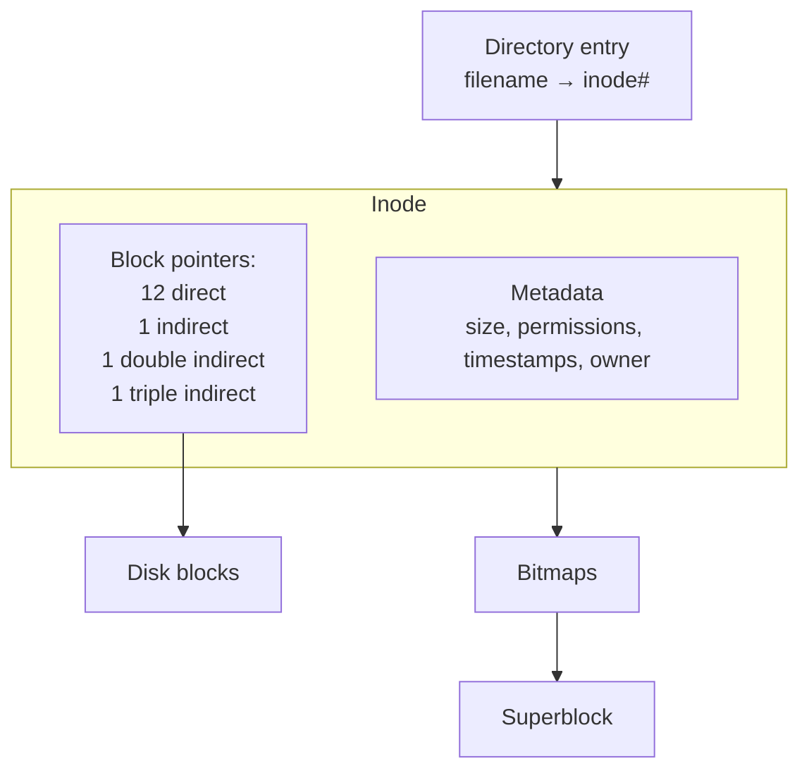

**VFS (Virtual File System):**

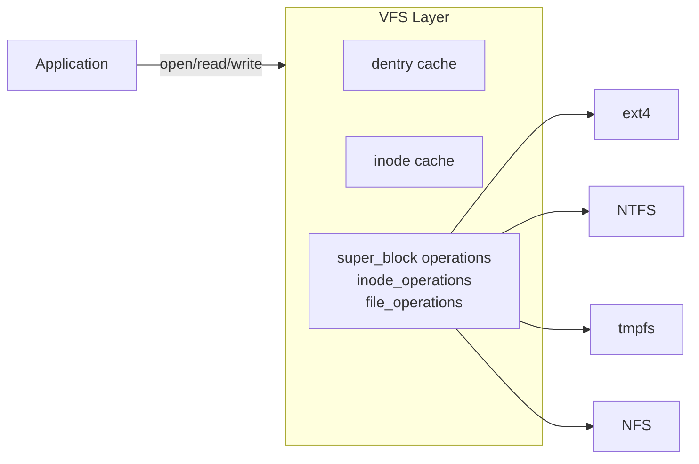

**Journaling (ext4, ordered mode):**

1. Begin transaction: Record intent to modify metadata in journal
2. Write metadata to journal (commit block)
3. Write data to actual filesystem location
4. Checkpoint: Mark journal entries as complete

On crash: replay journal (redo committed transactions, skip incomplete ones).

**Hard vs Symbolic links:**

| Feature | Hard link | Symbolic link |
|---------|-----------|---------------|
| Inode | Same inode as target | New inode |
| Target file removal | File still accessible | Link becomes dangling |
| Cross-filesystem | No | Yes |
| Directory links | No | Yes |

### Memory Impact

- **Inode:** 256 bytes each (ext4, default)
- **Dentry cache:** Kernel caches directory entries for lookup performance
- **Page cache:** Caches file data pages (uses available RAM)

### Performance Impact

- **Sequential read (SSD):** ~1–7 GB/s
- **Random read (SSD):** ~100 MB–1 GB/s
- **Sequential read (HDD):** ~150–250 MB/s
- **Random read (HDD):** ~0.5–2 MB/s
- **Metadata ops (stat, mkdir):** ~1–10 µs on SSD

### Real-World Example

**Database uses raw block device vs filesystem:**
- **Option A:** Raw partition — bypass filesystem entirely
- **Option B:** ext4/XFS with direct I/O — skips page cache
- **Option C:** Filesystem with buffered I/O — double caching

### Common Misconceptions

> "Deleting a file overwrites the data."

**No.** `unlink` removes the directory entry and decrements the inode's link count. Actual data remains until overwritten.

### Interview Questions

**Junior:**
1. What is an inode? What does it store?
2. Compare hard links and symbolic links.

**Mid:**
1. How does ext4 journaling work? What are the three journaling modes?
2. Explain the Linux VFS layer.

**Senior:**
1. Design a filesystem for an SSD. How would you handle write endurance and TRIM?
2. Your database shows 30% iowait on ext4. Diagnose and fix.

### FAANG-Level Deep Dive

**Btrfs:** Uses copy-on-write B-trees for all metadata. Features: snapshots, compression, RAID, checksums, subvolumes.

**ext4 extent trees:** Uses extents `[logical block, physical block, length]` instead of block pointers. One extent can reference up to 128 MB contiguous blocks.

**io_uring + filesystem:** Linux 5.1+ allows async filesystem operations via io_uring.

### Explain Like I'm 7

A filesystem is like a library. Inodes are book IDs. Directory entries are the signs. Journaling is a log of what you're about to do — so if the power goes out, you can finish the job.

---

## 1.12 I/O Models

### What It Is

I/O models define how a program interacts with the kernel to perform input/output operations.

### Why It Exists

I/O is the slowest operation in computing. The CPU must not block waiting for I/O.

### Internal Working

**Blocking I/O:** Thread sleeps until data is available. Simple but wastes thread resources.

**Non-blocking I/O:** Thread continues executing if data not ready. Must call `poll/select/epoll` to check readiness.

**I/O Multiplexing (select/poll/epoll):**

| Feature | select | poll | epoll |
|---------|--------|------|-------|
| Max fds | 1024 | No limit | No limit |
| Data structure | Bitmask | Array of pollfd | Event table in kernel |
| Registration | Each call | Each call | Once (epoll_ctl) |
| Scalability | O(n) | O(n) | O(1) ready list |

**epoll internals (Linux):**

```
epoll_create1(0) → epfd
epoll_ctl(epfd, EPOLL_CTL_ADD, fd, &event)
  → kernel creates epitem linked to fd's wait queue
epoll_wait(epfd, events, maxevents, timeout)
  → copy ready list to user space
```

**Async I/O (io_uring):**

| Feature | Linux AIO (libaio) | io_uring |
|---------|-------------------|----------|
| Submission | Syscall per op (`io_submit`) | Shared ring (sqe) |
| Completion | Syscall per poll (`io_getevents`) | Shared ring (cqe) |
| Buffered I/O | No (must use O_DIRECT) | Yes |

**I/O Completion Ports (Windows IOCP):**

```c
CreateIoCompletionPort(hFile, hIOCP, key, numThreads);
while (GetQueuedCompletionStatus(hIOCP, &bytes, &key, &overlapped, INFINITE)) {
    process(overlapped);
}
```

### Memory Impact

- **epoll fd:** ~100 bytes per monitored fd
- **io_uring rings:** 2–8 MB for submission + completion queue

### Performance Impact

- **select latency:** 10 µs per 1000 fds
- **epoll (1000 fds, 1 ready):** ~0.1 µs
- **io_uring vs AIO:** io_uring reduces syscalls by 10–100×

### Real-World Example

**Nginx:** Uses epoll (Linux) / kqueue (macOS) / IOCP (Windows). Single-threaded event loop handles thousands of connections.

**Redis:** Single-threaded event loop using epoll. All commands are non-blocking.

### Common Misconceptions

> "Non-blocking I/O is always faster than blocking I/O."

**No.** For a single connection doing sequential reads, blocking I/O is faster. Non-blocking wins when there are **many concurrent connections**.

### Interview Questions

**Junior:**
1. What is the difference between blocking and non-blocking I/O?
2. How does `select` work? What are its limitations?

**Mid:**
1. Compare epoll edge-triggered vs level-triggered.
2. How does io_uring differ from traditional AIO?

**Senior:**
1. Design a TCP server that handles 100K concurrent connections.
2. Your trading engine uses io_uring. The 99.99th percentile latency is 1 ms. Analyze and mitigate.

### FAANG-Level Deep Dive

**io_uring registered buffers + fixed files:** Pins memory and pre-maps it for DMA. Pre-allocates file table entries. Per-operation overhead drops from ~1 µs to ~100 ns.

**XDP (eXpress Data Path):** BPF program runs when the NIC driver receives a packet. Can redirect, drop, or pass to user space via AF_XDP socket. Latency: <1 µs.

**RDMA (Remote Direct Memory Access):** An RDMA NIC can read/write memory on a remote machine without involving the remote CPU. Latency: <2 µs for remote memory read.

### Explain Like I'm 7

**Blocking I/O** is like ordering food and standing at the counter until it's ready. **Non-blocking** is ordering, getting a buzzer, and sitting down. **epoll** is a waiter who tells you when your food is ready. **io_uring** is like a sushi conveyor belt — put your order on the belt and grab the plate when it comes.

---

# SECTION 2: NETWORKING

---

## 2.1 OSI & TCP/IP Models

### What It Is

The **OSI Model** is a 7-layer conceptual framework for network communication. The **TCP/IP Model** is the 4-layer model used in practice (the Internet).

### Why It Exists

Layering **separates concerns** — each layer handles a specific aspect of communication.

### Internal Working

**OSI 7-Layer Model:**

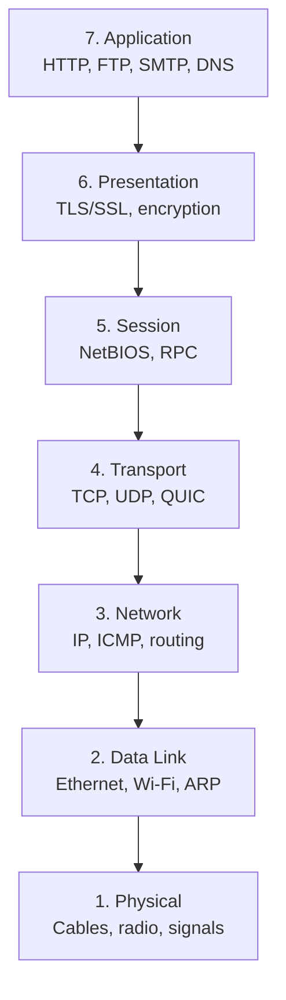

**TCP/IP 4-Layer Model:**

| Layer | Protocols | PDU |
|-------|-----------|-----|
| **Application** | HTTP, DNS, SMTP, SSH | Message |
| **Transport** | TCP, UDP, QUIC | Segment / Datagram |
| **Internet** | IP, ICMP, ARP | Packet |
| **Link** | Ethernet, Wi-Fi | Frame |

**Encapsulation:**

```
[ HTTP GET /index.html ]                              ← Application
  ↓
[ TCP | HTTP GET... ]                                 ← Transport
  ↓
[ IP | TCP | HTTP ]                                   ← Network
  ↓
[ Ethernet | IP | TCP | HTTP | CRC ]                  ← Link
  ↓
[ Bits on wire ]                                       ← Physical
```

### Memory Impact

- **TCP socket:** ~1 KB kernel memory
- **IP packet:** 1500 bytes MTU
- **UDP socket:** ~0.5 KB kernel memory

### Performance Impact

- **Per-packet overhead (Ethernet + IP + TCP):** 54 bytes
- **Efficiency (1500 MTU):** 1448/1500 = 96.5% payload
- **TCP segmentation offload (TSO):** NIC segments large TCP packets in hardware

### Real-World Example

**`tcpdump` output:**
```
14:12:34.567890 IP 10.0.0.1.443 > 10.0.0.2.54321:
    Flags [P.], seq 1:1001, ack 2001, win 65535, length 1000
```

### Common Misconceptions

> "The OSI model is how the Internet actually works."

**No.** The Internet uses TCP/IP. OSI is a teaching/reference model.

### Interview Questions

**Junior:**
1. Name the 7 layers of OSI. What does each do?
2. What is encapsulation? Draw the packet structure.

**Mid:**
1. Compare OSI vs TCP/IP. Why is OSI not used in practice?
2. What headers are added and stripped as data travels?

**Senior:**
1. Design a new transport protocol for a data center. Which layers would you change?
2. Explain how a VPN fits into the OSI model.

### FAANG-Level Deep Dive

**MPLS:** Sits between L2 and L3 — often called "Layer 2.5". Uses labels instead of IP routing. Used in ISP backbones and VPNs.

**GUE/Geneve tunneling:** Encapsulates L2 frames inside UDP packets over IP. Used in overlay networks (VXLAN, GENEVE) for network virtualization.

**QUIC:** A transport protocol built on UDP that implements its own packet protection — essentially merging TLS with transport. A "layer 4.5" protocol.

### Explain Like I'm 7

Think of shipping a package. Application is what you're sending. Transport is picking the shipping method. Network is writing the destination address. Link is the truck/plane. Physical is the road/air.

---

## 2.2 TCP

### What It Is

TCP is a **connection-oriented, reliable, stream-oriented** transport protocol providing ordered delivery, error detection, flow control, and congestion control.

### Why It Exists

IP provides only **best-effort delivery** — packets can be lost, duplicated, reordered, or corrupted. TCP adds reliability and rate control.

### Internal Working

**3-Way Handshake:**

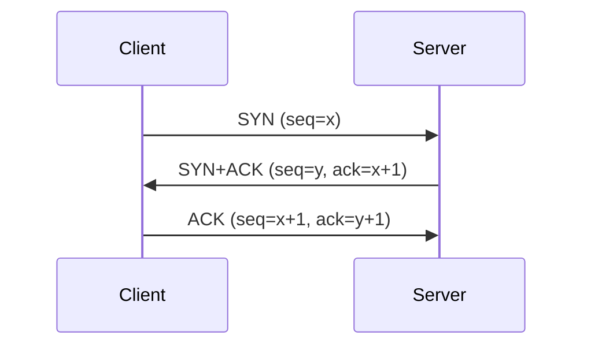

- Minimum handshake RTT: 1 RTT

**4-Way Teardown:**

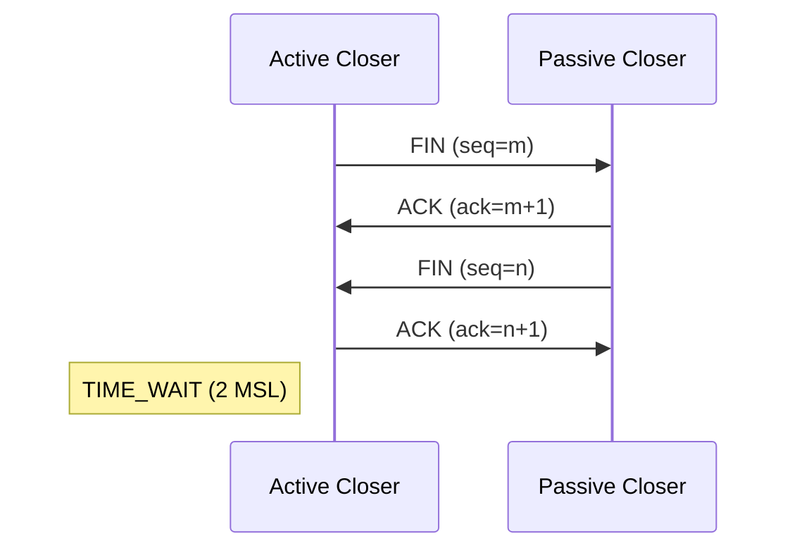

**Flow Control (Sliding Window):**

- Receiver advertises `rcv_wnd` in every TCP header
- Sender must not send more than `rcv_wnd` unacknowledged bytes
- **Window scaling** (RFC 7323): scales window from 64 KB to 1 GB

**Congestion Control:**

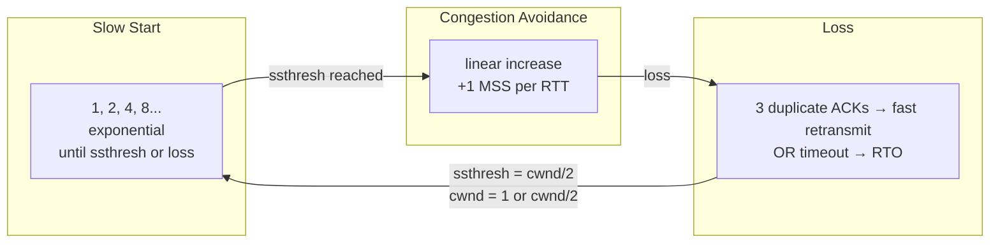

**Key variables:** `cwnd` (congestion window), `ssthresh` (slow start threshold), `RTT` (Round Trip Time), `RTO` (Retransmission Timeout: SRTT + 4 × RTTVAR, min 200ms).

**CUBIC (Linux default):**

```
cwnd = C * (t - K)^3 + Wmax
```
- Cubic function of time (independent of RTT)
- After loss, cwnd drops to Wmax × 0.7, grows slowly near Wmax

**BBR (Bottleneck Bandwidth and Round-trip propagation time):**
- Model-based: estimates `BtlBw` and `RTprop`
- Pacing rate = 1.25 × BtlBw
- Does **not** rely on packet loss — uses delay increase

### Memory Impact

- **TCP send buffer:** 16–256 KB per socket
- **TCP receive buffer:** 87 KB–6 MB per socket (auto-tuning)
- **TIME_WAIT socket:** ~500 bytes for 60 seconds — can exhaust memory

### Performance Impact

- **Bandwidth-delay product (BDP):** RTT × bandwidth. Window must be ≥ BDP.
- **TCP throughput:** ∼ (MSS × 8) / (RTT × √(loss_rate))
- **CUBIC vs BBR:** BBR achieves higher throughput on lossy links

### Real-World Example

**YouTube streaming:** Uses TCP/QUIC. BBR mitigates buffer bloat by measuring RTprop.

**Load balancer TIME_WAIT exhaustion:** Mitigations: `SO_REUSEADDR`, `tcp_tw_reuse`, increase port range.

### Common Misconceptions

> "TCP guarantees delivery."

**No.** TCP guarantees **in-order, reliable delivery of bytes** only while the connection remains established.

> "Nagle's algorithm is always bad."

Nagle's algorithm delays small segments to coalesce them. For interactive apps (SSH), disable with `TCP_NODELAY`. For bulk transfers, it reduces packet count by 40×.

### Interview Questions

**Junior:**
1. Walk through the TCP 3-way handshake. Why is it 3 ways?
2. What is TCP flow control? How does the receiver tell the sender to slow down?

**Mid:**
1. Explain TCP congestion control. Compare AIMD, CUBIC, and BBR.
2. What is the difference between slow start and congestion avoidance?

**Senior:**
1. Your distributed database achieves 1 Gbps but the link is 40 Gbps. Latency is 1 ms. Diagnose and fix.
2. Design a TCP optimization for mobile clients with changing networks.

### FAANG-Level Deep Dive

**TCP fast open (TFO):** Allows data in SYN packet. Eliminates 1 RTT for repeat connections. Used by Google. Improves page load time by 10–15%.

**Multipath TCP (MPTCP):** Uses multiple paths simultaneously (WiFi + cellular). Used by iOS Siri for seamless handover.

**ECN (Explicit Congestion Notification):** Routers mark packets with CE bit when queue is building. Receiver echoes via ACK. Sender reduces cwnd.

**DCTCP (Data Center TCP):** Uses ECN + threshold-based control. Achieves: 10× lower queue buildup, 0 latency for short flows.

### Explain Like I'm 7

TCP is like a phone call. You dial (SYN), the other person answers (SYN+ACK), you say "hi" (ACK). Everything you say gets a "got it" (ACK). If they don't hear you, you repeat. If they speak too fast, you say "slow down."

---

## 2.3 UDP

### What It Is

UDP is a **connectionless, unreliable, datagram-oriented** transport protocol.

### Why It Exists

TCP's reliability has overhead: handshake, ACKs, retransmission, ordering. For many applications (streaming, gaming, DNS), losing a packet is acceptable.

### Internal Working

**UDP header (8 bytes):**

```
 0                   1                   2                   3
+-+-+-+-+-+-+-+-+-+-+-+-+-+-+-+-+-+-+-+-+-+-+-+-+-+-+-+-+-+-+-+-+
|          Source Port          |       Destination Port        |
+-+-+-+-+-+-+-+-+-+-+-+-+-+-+-+-+-+-+-+-+-+-+-+-+-+-+-+-+-+-+-+-+
|            Length             |           Checksum            |
+-+-+-+-+-+-+-+-+-+-+-+-+-+-+-+-+-+-+-+-+-+-+-+-+-+-+-+-+-+-+-+-+
```

### Memory Impact

- **UDP socket:** ~0.5 KB kernel memory
- **Receive buffer:** ~208 KB default
- **Datagram max size:** 65535 bytes (practical: ~1472 over Ethernet)

### Performance Impact

- **No handshake:** 0 RTT setup
- **No ACK overhead:** No delayed ACK, no cumulative ACK processing
- **No congestion control:** Can saturate a link

### Real-World Example

| Protocol | Transport | Why UDP |
|----------|-----------|---------|
| DNS | UDP (default) | Single request-response; retry on timeout |
| VoIP (RTP) | UDP | Late packets are useless |
| Video streaming (WebRTC) | UDP | Real-time — 200 ms delay budget |
| QUIC | UDP | Application-layer reliability with 0-RTT |
| DHCP | UDP | Broadcast-based discovery |
| NTP | UDP | Latest value matters most |

### Common Misconceptions

> "UDP has no error detection."

**False.** UDP has a 16-bit checksum covering header + payload + pseudo IP header. Corrupted datagrams are silently dropped.

### Interview Questions

**Junior:**
1. Compare TCP vs UDP. When would you use each?
2. What is in the UDP header? Why is it so small?

**Mid:**
1. How does DNS use UDP? When does it fall back to TCP?
2. Design a reliable protocol on top of UDP for a multiplayer game.

**Senior:**
1. Why did Google choose UDP for QUIC instead of extending TCP?
2. Your WebRTC app has high packet loss. Design application-layer FEC vs retransmission.

### FAANG-Level Deep Dive

**UDP encapsulation for tunnels:** WireGuard, OpenVPN, VXLAN encapsulate inside UDP. Allows ECMP load balancing and NAT traversal.

**UDP GRO/GSO:** NIC can coalesce multiple UDP packets (GRO) or segment large packets (GSO). Can double throughput for high-UDP workloads.

**QUIC reliability (simplified):** Assigns packet number, encrypts, sends over UDP. On ACK timeout: retransmit with NEW packet number. No TCP HOL blocking.

### Explain Like I'm 7

UDP is like sending postcards. You write a message, drop it in the mailbox, and hope it arrives. No return receipt.

---

## 2.4 DNS

### What It Is

The Domain Name System translates domain names to IP addresses. It's a **distributed, hierarchical** database.

### Why It Exists

Humans can't remember IP addresses. DNS provides human-friendly naming + load distribution (multiple A records) + service discovery (SRV records).

### Internal Working

**DNS Hierarchy:**

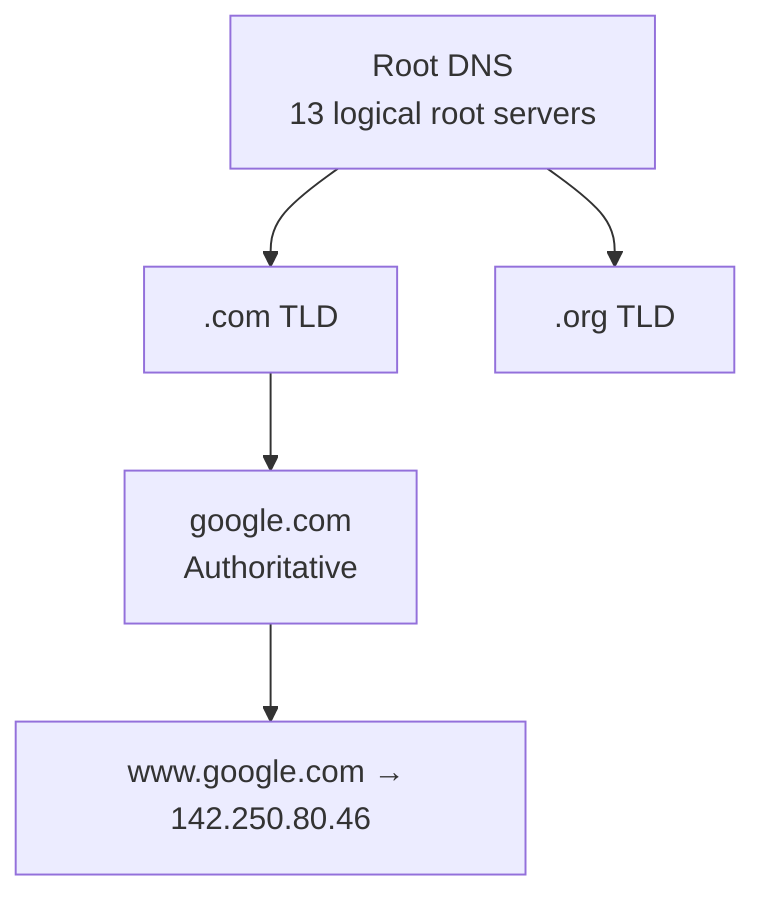

**Recursive Resolution:**

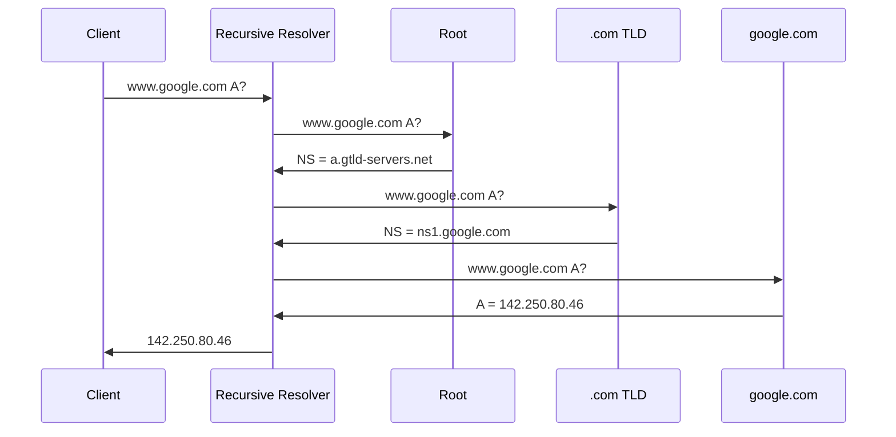

**DNS Record Types:**

| Type | Meaning | Example |
|------|---------|---------|
| A | IPv4 address | `google.com A 142.250.80.46` |
| AAAA | IPv6 address | `google.com AAAA 2607:f8b0:4000:804::200e` |
| CNAME | Canonical name | `www.google.com CNAME google.com` |
| MX | Mail exchange | `google.com MX 10 aspmx.l.google.com` |
| NS | Name server | `google.com NS ns1.google.com` |
| TXT | Arbitrary text | `google.com TXT \"v=spf1 include:_spf.google.com ~all\"` |

**Anycast:**

Multiple servers share the same IP address. BGP routing sends each client to the nearest server. Used by 8.8.8.8 (Google DNS).

### Memory Impact

- **DNS response:** Typically 200–500 bytes
- **DNS cache (recursive resolver):** 100 MB–10 GB

### Performance Impact

- **DNS resolution (warm cache):** 1–5 ms
- **DNS resolution (cold cache):** 10–200 ms
- **DoH:** Slower initial resolution but better privacy

### Real-World Example

**CDN routing via GeoDNS:**
- Client in New York → `198.51.100.10` (NYC edge)
- Client in London → `203.0.113.20` (London edge)

### Common Misconceptions

> "Changing TTL instantly propagates DNS changes."

**No.** Old TTL must expire. Lower TTL to 60–300s before planned changes.

### Interview Questions

**Junior:**
1. What happens when you type `google.com`? Walk through DNS.
2. What is the difference between recursive and iterative resolution?

**Mid:**
1. Explain DNS anycast. How does it improve performance?
2. What is DNS caching? How does TTL affect behavior?

**Senior:**
1. Design a global DNS system for 1B users.
2. How would you implement GeoDNS for a CDN?

### FAANG-Level Deep Dive

**DoH and DoT:** DNS over TLS (DoT, port 853) and DNS over HTTPS (DoH, port 443). Prevents ISP tracking. DoH looks like HTTPS — harder to block.

**DNSSEC:** Signs DNS records with cryptographic signatures. Chain of trust: Root → TLD → Authoritative. Prevents cache poisoning.

**EDNS:** Allows UDP DNS messages larger than 512 bytes. Used for DNSSEC responses.

### Explain Like I'm 7

DNS is the phonebook of the Internet. You ask the operator (recursive resolver), who asks the central directory (root), who says "look in the G section" (.com TLD).

---

## 2.5 HTTP/1.1, HTTP/2, HTTP/3

### What It Is

HTTP is the application-layer protocol of the Web. Three major versions.

### Why It Exists

HTTP/1.1 became a bottleneck for modern web pages (100+ resources). HTTP/2 and HTTP/3 address **head-of-line blocking**, latency, and multiplexing.

### Internal Working

**HTTP/1.1 (1997):**

```
GET /index.html HTTP/1.1
Host: example.com
```

- Persistent connections (keep-alive)
- Pipelining rarely used (HOL blocking)
- **HOL blocking:** One slow response blocks subsequent responses
- Workaround: 6 parallel TCP connections per domain

**HTTP/2 (2015):**

- **Binary framing:** HEADERS, DATA, SETTINGS frames
- **Multiplexing:** Multiple streams on one TCP connection
- **HPACK header compression:** Huffman + static/dynamic table
- **Server push:** Server sends resources before client requests
- **HOL blocking:** TCP-level — a lost packet blocks ALL streams

**HTTP/2 framing:**

```
Frame header (9 bytes):
  Length | Type | Flags | Stream ID
```

**HTTP/3 (2022):**

- **Transport:** QUIC (over UDP) instead of TCP
- **QPACK header compression:** Adapts HPACK for out-of-order delivery
- **0-RTT handshake:** Repeat connections send data immediately
- **Connection migration:** Client changes IP without breaking connection
- **No TCP HOL blocking:** Lost packet blocks only its stream

### Performance Impact

| Metric | HTTP/1.1 | HTTP/2 | HTTP/3 |
|--------|----------|--------|--------|
| Head-of-line blocking | HTTP-level | TCP-level | None |
| Handshake RTT | 2+ (TCP + TLS) | 2+ | 0–1 (0-RTT or 1-RTT) |
| Header overhead | 500–1000 bytes | ~50 bytes (HPACK) | ~50 bytes (QPACK) |

### Real-World Example

**Google:** HTTP/3 for 75%+ of traffic. On mobile, QUIC's 0-RTT and connection migration reduce page load by 15–30%.

**Netflix:** Uses HTTP/2 for streaming — multiplexing for video chunks and manifest.

### Common Misconceptions

> "HTTP/2 is always faster than HTTP/1.1."

**Not for single-resource pages.** HTTP/2 overhead adds latency for a single GET.

### Interview Questions

**Junior:**
1. Compare HTTP/1.1 and HTTP/2. What problems does HTTP/2 solve?
2. What is HTTP/2 multiplexing?

**Mid:**
1. Explain HOL blocking in HTTP/2 and how HTTP/3 solves it.
2. Compare HPACK and QPACK. Why couldn't HTTP/3 reuse HPACK?

**Senior:**
1. Your e-commerce site loads 200 resources. HTTP/2 shows 30% slower on 4G. Diagnose and fix.
2. Design a protocol for real-time collaborative editing.

### FAANG-Level Deep Dive

**HTTP/2 server push issues:** Chrome started ignoring server push. **103 Early Hints** is a better alternative — server hints at resources for the client to request.

**0-RTT replay attacks:** QUIC 0-RTT data can be replayed. Applications must be idempotent. QUIC uses anti-replay (server rejects replayed packets based on time windows).

### Explain Like I'm 7

- **HTTP/1.1:** A single-file line at the DMV.
- **HTTP/2:** Multiple windows but one door. If the door jams, everyone waits.
- **HTTP/3:** Each person has their own door.

---

## 2.6 HTTPS/TLS

### What It Is

TLS provides **encryption, authentication, and integrity** for network communications.

### Why It Exists

Without TLS, HTTP traffic is plaintext — anyone on the network can read/modify it.

### Internal Working

**TLS 1.3 Handshake:**

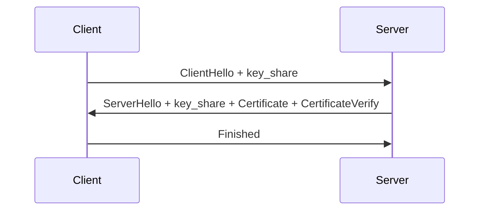

**Key exchange (ECDHE):**

```
Client: a = random(), pubA = a*G
Server: b = random(), pubB = b*G
Shared = a*pubB = b*pubA = a*b*G
```

**Forward secrecy:** Session key is ephemeral (ECDHE). Compromising long-term key doesn't decrypt past sessions.

**Certificate chain:**

```
Root CA → Intermediate CA → Server cert → CN = www.example.com
```

**TLS 1.2 vs 1.3:**

| Feature | TLS 1.2 | TLS 1.3 |
|---------|---------|---------|
| Handshake RTT | 2 RTT | 1 RTT (0-RTT) |
| Cipher suites | Many (RSA, DHE, ECDHE) | AEAD only (AES-GCM, ChaCha20) |
| Key exchange | Separate negotiation | Mandatory ECDHE |
| Session resumption | Session ID / Ticket | PSK |

### Memory Impact

- **TLS session state:** ~2–5 KB per connection
- **Certificate chain:** 2–5 KB
- **Session ticket:** ~200 bytes

### Performance Impact

- **TLS 1.3 handshake:** 1 RTT ≈ 20–100 ms
- **CPU overhead (AES-GCM):** ~1–5% (AES-NI)
- **CPU overhead (ChaCha20-Poly1305):** ~2–10% (no hardware accel)

### Real-World Example

**Cloudflare:** TLS 1.3 for all connections. ChaCha20-Poly1305 on mobile. OCSP stapling. Session tickets with 6-hour lifetime.

### Common Misconceptions

> "RSA key exchange provides forward secrecy."

**No.** If the server's private key is later compromised, all recorded sessions can be decrypted. TLS 1.3 removed RSA key exchange.

### Interview Questions

**Junior:**
1. Walk through the TLS 1.3 handshake.
2. What is forward secrecy? How does ECDHE achieve it?

**Mid:**
1. Compare TLS 1.2 and TLS 1.3. Why was RSA key exchange removed?
2. How does certificate chain validation work?

**Senior:**
1. Design a TLS termination layer for 1M concurrent connections.
2. How would you implement a QUIC-based TLS handshake?

### FAANG-Level Deep Dive

**TLS False Start:** Client sends HTTP request immediately after ChangeCipherSpec. Saves 1 RTT in TLS 1.2.

**Session resumption:** Session ID, Session Ticket, PSK (TLS 1.3). PSK enables 0-RTT.

**ALPN:** Client lists protocols (h2, http/1.1, h3) in ClientHello. Server picks highest mutual.

**ECH (Encrypted Client Hello):** Encrypts SNI in ClientHello. Prevents eavesdroppers from seeing visited sites.

### Explain Like I'm 7

TLS is a sealed envelope with a lock. You and the post office agree on a combination (handshake). After that, nobody can read your letter (encryption) or change it (integrity).

---

## 2.7 WebSockets

### What It Is

WebSocket provides **full-duplex, persistent** communication over a single TCP connection.

### Why It Exists

HTTP is request-response. WebSocket allows the server to push data in real time.

### Internal Working

**Upgrade handshake:**

```
Client → Server:
GET /chat HTTP/1.1
Upgrade: websocket
Sec-WebSocket-Key: dGhlIHNhbXBsZSBub25jZQ==
Sec-WebSocket-Version: 13

Server → Client:
HTTP/1.1 101 Switching Protocols
Sec-WebSocket-Accept: s3pPLMBiTxaQ9kYGzzhZRbK+xOo=
```

**Framing:**

```
 0                   1                   2                   3
+-+-+-+-+-+-+-+-+-+-+-+-+-+-+-+-+-+-+-+-+-+-+-+-+-+-+-+-+-+-+-+-+
|F|R|R|R| opcode|M| Payload len |    Extended payload length    |
|I|S|S|S|  (4)  |A|     (7)     |             (16/64)           |
|N|V|V|V|       |S|             |                               |
| |1|2|3|       |K|             |                               |
+-+-+-+-+-+-+-+-+-+-+-+-+-+-+-+-+-+-+-+-+-+-+-+-+-+-+-+-+-+-+-+-+
|                     Payload Data (variable)                    |
+-+-+-+-+-+-+-+-+-+-+-+-+-+-+-+-+-+-+-+-+-+-+-+-+-+-+-+-+-+-+-+-+
```

- **Opcode:** 0x1 = text, 0x2 = binary, 0x8 = close, 0x9 = ping, 0xA = pong
- Masking: Client frames must be masked (key = 4 bytes)

### Memory Impact

- **WebSocket connection:** ~5 KB (HTTP upgrade struct + frame buffers)

### Performance Impact

- **Initial latency:** 1 RTT for HTTP upgrade
- **Per-message overhead:** ~2–14 bytes (frame header)
- **vs HTTP/2 multiplexing:** WebSocket has lower per-message overhead for real-time messages

### Real-World Example

**Slack:** Uses WebSocket for real-time messaging. When a message arrives, the server pushes it to all connected clients in the channel.

**Trading platforms:** WebSocket streams stock tick data at 1000+ messages/second per symbol.

### Common Misconceptions

> "WebSocket replaces HTTP."

**No.** WebSocket starts as HTTP (upgrade handshake) and switches protocol. It's complementary, not a replacement.

### Interview Questions

**Junior:**
1. How does a WebSocket connection start? What is the upgrade handshake?
2. Compare WebSocket vs HTTP polling.

**Mid:**
1. Compare WebSocket, SSE (Server-Sent Events), and HTTP/2 server push.
2. What is the WebSocket frame format? How is masking used?

**Senior:**
1. Design a real-time collaboration system (like Google Docs) using WebSocket vs WebRTC data channels.
2. How would you handle 1M concurrent WebSocket connections on a single server?

### FAANG-Level Deep Dive

**WebSocket over HTTP/2 (RFC 8441):** WebSocket can run over a multiplexed HTTP/2 stream. Avoids separate TCP connections for WebSocket.

**WSS (WebSocket Secure):** WebSocket over TLS. Same security properties as HTTPS.

**Backpressure:** If a WebSocket client is slow to read, the server's send buffer grows. Applications must implement flow control or drop messages.

### Explain Like I'm 7

WebSocket is like a walkie-talkie. You say "over" once (handshake), then both people can talk anytime. No more "over and out" after every message.

---

## 2.8 Load Balancing

### What It Is

Load balancing distributes incoming traffic across multiple backend servers to improve availability, scalability, and performance.

### Why It Exists

A single server has finite capacity. Load balancing enables horizontal scaling, health-aware routing, and fault tolerance.

### Internal Working

**Algorithms:**

| Algorithm | How it works | Pros | Cons |
|-----------|-------------|------|------|
| **Round Robin** | Distributes sequentially | Simple, fair | No server weight awareness |
| **Weighted RR** | Weighted distribution | Accounts for server capacity | Still static |
| **Least Connections** | Sends to server with fewest active connections | Good for variable request duration | Overhead tracking connections |
| **IP Hash** | Hash(client IP) → server | Session persistence without state | Uneven if few IPs |
| **Consistent Hash** | Hash on ring → server | Minimal redistribution on add/remove | More complex |
| **Random** | Pick randomly | Very simple | Uneven distribution possible |

**Layer 4 (Transport Layer) LB:**

- Operates on TCP/UDP (IP + port)
- NAT: changes destination IP to backend IP
- DSR (Direct Server Return): backend responds directly to client
- Faster, less CPU than L7
- Cannot inspect HTTP headers

**Layer 7 (Application Layer) LB:**

- Full HTTP/HTTPS understanding
- Can route based on: URL path, headers, cookies, method
- Can terminate TLS, inspect payloads, rate limit per URL
- Higher latency (proxy mode)

**Health Checks:**

```
LB → Backend: GET /health
Backend → LB: 200 OK (healthy)
LB → Backend: GET /health
Backend → LB: (timeout or 503)
LB marks backend as unhealthy, stops routing traffic
```

**Session Persistence (Sticky Sessions):**

- Source IP hash
- Cookie injection (LB sets a cookie, routes based on it)
- No session persistence for stateless apps (preferred)

### Memory Impact

- **LB connection table:** ~100 bytes per active connection
- **For 10M connections:** ~1 GB memory

### Performance Impact

- **L4 LB latency:** ~1–10 µs (kernel space)
- **L7 LB latency:** ~100–1000 µs (TLS termination + HTTP parsing)
- **DPDK-based LB:** < 10 µs (kernel bypass)

### Real-World Example

**AWS ALB (Application Load Balancer):** L7, supports path-based routing, host-based routing, WebSocket, HTTP/2.

**Google's Maglev:** L4 load balancer using consistent hashing + connection tracking. Handles 1+ Tbps. Uses ECMP + BGP for high availability.

**Envoy Proxy:** L7 proxy used in service meshes (Istio). Supports advanced routing, circuit breaking, retries, rate limiting.

### Common Misconceptions

> "More load balancer instances always improve availability."

**No.** LB must be highly available — typically active-passive with health checks. Without redundancy, the LB is a single point of failure.

### Interview Questions

**Junior:**
1. What is load balancing? What problem does it solve?
2. Compare Round Robin vs Least Connections.

**Mid:**
1. Compare Layer 4 vs Layer 7 load balancing. When would you use each?
2. What is session persistence? Why is it sometimes necessary?

**Senior:**
1. Design a global load balancing system with multiple regions.
2. How does Google's Maglev achieve 1+ Tbps throughput?

### FAANG-Level Deep Dive

**BPF-based load balancing (Cilium):** Uses eBPF + XDP for load balancing directly in the kernel. Faster than iptables-based kube-proxy. Uses BPF maps for backend lookup. Latency: 1–5 µs.

**Consistent Hashing with Virtual Nodes:** To handle uneven distribution, each real node is represented by N virtual nodes on the hash ring. When a node fails, its load is evenly distributed across all remaining nodes.

**Maglev Hashing:** Google's consistent hash table uses a preference list per server. Each lookup takes O(1). Hash table size is a large prime. Connection tracking ensures packets from one flow go to the same backend.

### Explain Like I'm 7

Load balancing is like a pizza shop with multiple delivery drivers. The manager (LB) decides which driver gets each order. If one driver is slow, the manager sends fewer orders that way.

---

## 2.9 CDN

### What It Is

A Content Delivery Network (CDN) is a distributed network of edge servers that cache and deliver content from locations close to users.

### Why It Exists

Latency is proportional to distance. A user in Tokyo downloading from a server in New York experiences 150+ ms latency. A CDN edge server in Tokyo serves the same content in 5 ms.

### Internal Working

```mermaid
flowchart LR
    U[User in Tokyo] -->|DNS resolves to<br>nearest edge| E1[CDN Edge Server<br>Tokyo]
    E1 -->|cache hit| R[Return cached content]
    E1 -->|cache miss| O[Origin Server]
    O --> E1
    U2[User in London] -->|DNS resolves to<br>nearest edge| E2[CDN Edge Server<br>London]
    E2 -->|cache hit| R2[Return cached content]
```

**Caching strategies:**

- **Pull (origin pull):** Edge fetches from origin on cache miss
- **Push:** Content is pre-warmed on edge servers
- **TTL-based invalidation:** Cache-Control headers control duration
- **Purge:** API request to invalidate cached content immediately

**DNS routing (GeoDNS):** CDN authoritative DNS returns different IP based on client source IP → nearest edge.

**Anycast routing:** Edge servers in different locations share the same IP. BGP routes client to nearest server.

**DDoS protection:**

- Traffic absorption: CDN's massive capacity absorbs volumetric attacks
- WAF rules at edge: SQLi, XSS filtering before reaching origin
- Rate limiting per IP/region
- Challenge/response (CAPTCHA, JS challenge)

### Memory Impact

- **Edge cache:** Typically 100 GB–10 TB per server (SSD + RAM)
- **Cached object metadata:** ~100 bytes per object

### Performance Impact

- **Without CDN:** 100–300 ms (origin in another continent)
- **With CDN (cache hit):** 5–30 ms
- **Cache hit ratio:** 70–95% for static assets
- **DDoS absorption:** 10+ Tbps capacity (Cloudflare, Akamai)

### Real-World Example

**Cloudflare:** Reverse proxy + CDN. Serves 20% of all web traffic. Free tier includes DDoS protection, WAF, SSL termination.

**Netflix Open Connect:** Netflix deploys CDN appliances inside ISP networks. 95%+ of traffic served from edge, <10 ms latency.

### Common Misconceptions

> "CDN caches only static content."

**No.** Modern CDNs (Cloudflare Workers, Fastly Compute@Edge) run serverless code at edge, enabling dynamic content assembly near users.

### Interview Questions

**Junior:**
1. What is a CDN? How does it reduce latency?
2. What is the difference between origin pull and push?

**Mid:**
1. How does CDN use DNS for routing users to the nearest edge?
2. Explain how a CDN protects against DDoS attacks.

**Senior:**
1. Design a CDN for streaming video with 4K quality. Consider caching, origin offload, and adaptive bitrate.
2. How would you implement real-time content invalidation across a global CDN?

### FAANG-Level Deep Dive

**Edge Workers (Cloudflare Workers, Fastly Compute@Edge):** JavaScript/WASM execution at the edge. Route requests, modify headers, assemble pages, run A/B tests — all at the edge. No cold start (isolates start in ~5 ms).

**Cache partitioning:** CDNs partition cache based on headers (Accept-Encoding, Vary). Each variant is cached separately → cache efficiency drops with many variants.

**Stale-while-revalidate:** Serve stale cached content while fetching a fresh version in background. Eliminates cache miss latency spikes.

### Explain Like I'm 7

A CDN is like having a local warehouse near every city. Instead of shipping every package from one central warehouse across the world, you ship one truckload to each local warehouse once, then deliver locally.

---

## 2.10 API Gateway

### What It Is

An API Gateway is a reverse proxy that sits between clients and microservices, handling authentication, rate limiting, routing, and aggregation.

### Why It Exists

In a microservice architecture, each service might need auth, rate limiting, logging, and tracing. Implementing these in every service is redundant. The gateway centralizes cross-cutting concerns.

### Internal Working

```mermaid
flowchart LR
    C[Client] --> G[API Gateway]
    G -->|"GET /users/123"| S1[User Service]
    G -->|"GET /orders?user=123"| S2[Order Service]
    G -->|"POST /search"| S3[Search Service]
    G --> Auth[Auth Service]
    G --> RL[Rate Limiter<br>Redis-backed]
    G --> Cache[Response Cache<br>Redis]
```

**Features:**

| Feature | Description |
|---------|-------------|
| **Authentication** | Validate JWT, API keys, OAuth tokens before routing |
| **Rate Limiting** | Token bucket / sliding window per API key/IP/user |
| **Routing** | Path-based (e.g., `/users/*` → user service) |
| **Response Aggregation** | Combine multiple backend responses (e.g., user + orders) |
| **TLS Termination** | Handle HTTPS, forward HTTP internally |
| **Request Transformation** | Modify headers, query params, body |
| **Circuit Breaking** | Stop routing to failing services |
| **Observability** | Logging, metrics, distributed tracing |

**Rate Limiting (Token Bucket algorithm):**

```
rate = 100 requests/second
burst = 200

For each request:
  now = current_time
  tokens += (now - last_refill) * rate
  tokens = min(tokens, burst)
  if tokens >= 1:
    tokens -= 1
    allow request
  else:
    reject (429 Too Many Requests)
```

### Memory Impact

- **Rate limiter state:** ~50 bytes per API key (in Redis)
- **Connection pooling:** ~10 KB per backend connection

### Performance Impact

- **Gateway latency overhead:** 1–10 ms (depends on features)
- **Rate limiting check:** <1 ms (local, or ~1 ms for Redis)
- **Auth token validation (JWT):** ~10–50 µs

### Real-World Example

**AWS API Gateway:** Managed service. Supports REST, HTTP, and WebSocket APIs. Integrates with Lambda, DynamoDB, Step Functions.

**Kong:** Open-source API Gateway built on OpenResty (Nginx + Lua). Plugins for auth, rate limiting, logging, caching.

**Kubernetes Ingress + Gateway API:** Ingress controllers (NGINX, Traefik, Contour) provide gateway functionality for K8s.

### Common Misconceptions

> "API Gateway is a single point of failure."

**Not if designed correctly.** Gateways should be stateless and horizontally scalable behind a load balancer.

### Interview Questions

**Junior:**
1. What is an API Gateway? What problems does it solve?
2. Compare API Gateway vs Load Balancer.

**Mid:**
1. How would you implement rate limiting in an API Gateway?
2. Explain how an API Gateway can aggregate responses from multiple services.

**Senior:**
1. Design an API Gateway for a platform with 10K APIs and 100K RPS.
2. Compare API Gateway vs Service Mesh (e.g., Istio). When would you use each?

### FAANG-Level Deep Dive

**GraphQL Federation:** Instead of a REST gateway, use a GraphQL federation gateway (Apollo). Each service exposes a subgraph; the gateway composes a unified schema and resolves queries across services.

**Backend for Frontend (BFF):** Instead of one gateway for all clients, each client type (mobile, web, IoT) has its own gateway. Mobile BFF may aggregate differently than web BFF — optimizing payload size, reducing round trips.

**Idempotency support:** Gateway detects duplicate requests (via idempotency key header). Stores idempotency key + response in Redis. Duplicate requests get the cached response instead of re-execution.

### Explain Like I'm 7

An API Gateway is like a receptionist at a company. Visitors (clients) tell the receptionist who they want to see. The receptionist checks ID (auth), makes sure the visitor isn't coming too often (rate limit), and directs them to the right office (routing).

---

## 2.11 Network Security

### What It Is

Network security encompasses technologies that protect network infrastructure and data in transit: Firewalls, IDS/IPS, WAF, DDoS mitigation, and Zero Trust.

### Why It Exists

Networks are inherently vulnerable — any device connected to a network can potentially attack or be attacked. Security controls establish boundaries, detect threats, and prevent unauthorized access.

### Internal Working

**Firewall (Packet Filter):**

```
Rule table:
  src IP    | dst IP    | port | action
  10.0.0.0/8 | any       | 80   | ALLOW
  any        | 10.0.0.5  | 22   | ALLOW
  any        | any       | any  | DENY
```

- **Stateless (ACL):** Checks each packet individually against rules
- **Stateful:** Tracks connection state (ESTABLISHED, NEW, RELATED, INVALID). Allows return traffic for established connections automatically.

**IDS/IPS (Intrusion Detection/Prevention System):**

- **Signature-based:** Match packets against known attack patterns (Snort rules)
- **Anomaly-based:** Baseline normal traffic, flag deviations
- **Protocol analysis:** Detect protocol violations (malformed HTTP, TCP out-of-window)
- **IPS** actively blocks; **IDS** only alerts

**WAF (Web Application Firewall):**

Operates at Layer 7. Inspects HTTP/HTTPS requests for:

| Attack Type | What It Does | WAF Detection |
|-------------|-------------|---------------|
| SQLi | `SELECT * FROM users WHERE id=1 OR 1=1` | Regex/regex rules on query params |
| XSS | `<script>alert('xss')</script>` in form input | Input sanitization patterns |
| CSRF | Cross-site request forgery | Token validation, origin header check |
| Path traversal | `GET /../../etc/passwd` | Block patterns with `../` |
| LFI/RFI | Include local/remote files | Block `file://`, `php://` schemes |

**DDoS Mitigation:**

```mermaid
flowchart LR
    A[Attacker<br>Botnet: 100K IPs] -->|100 Gbps traffic| E[Edge Router]
    E -->|BGP blackhole / RTBH| NULL[Null route / discard]
    E -->|scrubbing| SCRUB[Scrubber: clean traffic]
    SCRUB --> LB[Load Balancer]
    LB --> APP[Application]
    LEGIT[Legitimate User] -->|normal traffic| E
    LEGIT --> SCRUB
```

**Zero Trust:**

```
Never trust, always verify.

Core tenets:
  1. Verify explicitly: Authenticate + authorize every request
  2. Least privilege: Minimal access per identity
  3. Assume breach: Encrypt all traffic, micro-segment

Implementation:
  Identity-aware proxy (Google IAP)
  mTLS for service-to-service (Istio)
  Micro-segmentation per workload (K8s NetworkPolicies)
  Continuous monitoring and logging
```

### Memory Impact

- **Firewall state table:** ~200 bytes per connection
- **IDS rule set:** 10–100 MB (10K+ rules)
- **WAF rule set:** 5–50 MB
- **DDoS scrubbing:** GB-scale buffers for traffic inspection

### Performance Impact

- **Packet filter (stateless):** <1 µs per packet
- **Stateful firewall:** 1–5 µs per packet (connection tracking)
- **WAF (L7 inspection):** 100–500 µs per HTTP request
- **DDoS scrubber:** Adds 1–10 ms latency for scrubbed traffic

### Real-World Example

**Cloudflare's DDoS mitigation:** Processes 50+ Tbps globally. Uses Anycast to absorb traffic at edge. BPF-based filtering drops attack traffic in the kernel before it reaches applications.

**Google BeyondCorp:** Zero Trust implementation. No VPN needed. Access based on device posture + user identity. All traffic goes through an identity-aware proxy.

### Common Misconceptions

> "Firewalls make the network secure."

**No.** Firewalls are a single layer. Defense-in-depth includes: firewall + IDS/IPS + WAF + endpoint protection + encryption + access control + monitoring.

### Interview Questions

**Junior:**
1. What is the difference between a stateless and stateful firewall?
2. What is a WAF? What attacks does it prevent?

**Mid:**
1. Explain how DDoS mitigation works. What is BGP blackholing?
2. Compare IDS vs IPS. When would you use each?

**Senior:**
1. Design a Zero Trust architecture for a company with 10K employees and 500 microservices.
2. How would you mitigate a 1 Tbps DDoS attack targeting your API?

### FAANG-Level Deep Dive

**eBPF for security (Cilium, Falco):** eBPF programs attached to kernel tracepoints can monitor every syscall, network packet, and file access. Cilium uses eBPF for L3–L7 network policies (replaces kube-proxy). Falco detects container breakouts via syscall monitoring.

**TCP SYN flood mitigation:** SYN cookies — instead of allocating a TCB for every SYN, the server encodes connection parameters in the SYN+ACK sequence number. Client ACK must include (seq - 1) to decode. No state stored until ACK received.

**mTLS in service mesh:** Every service-to-service call is authenticated (client cert) and encrypted (TLS). Sidecar proxy (Envoy) handles mTLS transparently. Spire/SPIFFE issues identity certificates to each workload.

### Explain Like I'm 7

Network security is like a castle. The firewall is the outer wall. IDS/IPS is the guard watching for attackers. WAF is the guard checking visitors at the gate for weapons. DDoS is like 10,000 people trying to enter at once — the guards block the bridge. Zero Trust means every visitor must show ID every time, even inside the castle.

---

# SECTION 3: HOW COMPUTERS WORK

---

## 3.1 The Boot Process

### What It Is

The boot process is the sequence of events from power-on to the operating system being ready for user interaction.

### Why It Exists

The CPU doesn't know what to run when powered on. The boot process provides a deterministic, secure path from hardware initialization to OS execution.

### Internal Working (Step by Step)

```mermaid
flowchart TD
    P[Power On] -->|RESET vector| B[BIOS/UEFI Firmware]
    B -->|POST| POST[Power-On Self-Test<br>CPU, RAM, devices]
    POST -->|boot device order| BOOT[Find bootable device<br>MBR / GPT / EFI partition]
    BOOT -->|UEFI: load bootloader.efi| BL[Bootloader<br>GRUB2 / systemd-boot]
    BL -->|load kernel + initramfs into RAM| K[Kernel: vmlinuz]
    K -->|decompress, init| INIT[init process<br>PID 1]
    INIT -->|systemd / SysV init| SERVICES[Start system services<br>networking, dbus, udev, cron]
    SERVICES -->|getty| LOGIN[Login prompt ready]
```

1. **Power-on:** CPU's RESET vector (0xFFFFFFF0 on x86) loads the BIOS/UEFI firmware
2. **POST (Power-On Self-Test):** Firmware tests CPU, memory, and discovers devices
3. **Boot device selection:** Firmware checks boot order (USB, SSD, PXE). UEFI looks for EFI System Partition (ESP) with FAT32
4. **Bootloader (GRUB2):** Reads `/boot/grub/grub.cfg`, presents menu (optional), loads kernel + initramfs into memory
5. **Kernel startup:** Decompresses itself (vmlinuz → vmlinux), sets up page tables, initializes CPU subsystems, mounts rootfs from initramfs
6. **init (PID 1):** systemd executes default.target → starts services: networking, udev, dbus, sshd, getty
7. **Login prompt/system ready**

**UEFI vs Legacy BIOS:**

| Feature | Legacy BIOS | UEFI |
|---------|-------------|------|
| Interface | 16-bit real mode | 64-bit protected mode |
| Partition table | MBR (2 TB max) | GPT (9.4 ZB max) |
| Boot speed | Slower | Faster (secure boot) |
| Secure Boot | No | Yes (cryptographic verification) |
| Driver model | Option ROMs | UEFI drivers |

### Memory Impact

- **initramfs:** 5–50 MB loaded into RAM (temporary rootfs)
- **Kernel image:** 5–15 MB compressed (vmlinuz)
- **RAM disk for early boot:** ~10–100 MB
- **Page tables at boot:** ~4 MB (identity mapping of physical RAM)

### Performance Impact

- **Total boot time (Linux SSD):** 3–15 seconds
- **POST + firmware:** 1–5 seconds (can be optimized with fast boot)
- **Kernel init:** 0.5–2 seconds
- **systemd service startup:** 1–10 seconds (parallelizable)
- **UEFI vs BIOS:** UEFI reduces boot time by ~1–3 seconds (parallel device init)

### Real-World Example

**Google's Chromebook boot:** Custom firmware (depthcharge) + verified boot. Boots in ~3 seconds. Kernel is signed and measured. Rootfs is verified with dm-verity. No GRUB — direct UEFI → kernel execution.

**Cloud VM boot:** When a container or VM boots in the cloud, the boot process is accelerated by using PV drivers (paravirtualized), stripping unnecessary kernel modules, and using a minimal initramfs.

### Common Misconceptions

> "UEFI is just a pretty BIOS."

**No.** UEFI is a full OS-like environment with network stack, graphics, file system drivers, and cryptographic verification (Secure Boot).

### Interview Questions

**Junior:**
1. What happens from power-on to OS? Walk through the boot process.
2. What is the difference between BIOS and UEFI?

**Mid:**
1. What is Secure Boot? How does it protect against bootkits?
2. How does GRUB load the Linux kernel? What is initramfs?

**Senior:**
1. Design a secure boot chain for a cloud server that must be tamper-proof from power-on to application start.
2. Your server boots 60 seconds slower after a firmware update. Diagnose and fix.

### FAANG-Level Deep Dive

**Measured Boot (TPM):** The TPM (Trusted Platform Module) measures each boot stage by hashing it and extending PCR (Platform Configuration Register) values. At stage N+1, Stage N's PCR is extended. The final PCR value proves the boot chain integrity. Used for remote attestation (Is this machine running untampered software?).

**UEFI + GRUB + kernel + initrd verification chain:**
1. UEFI verifies GRUB's signature (shim.efi signed by Microsoft)
2. GRUB verifies kernel's signature (signed by distro)
3. Kernel verifies initramfs' signature (or uses dm-verity for rootfs)

**Coreboot + Depthcharge:** Coreboot initializes hardware minimally, then jumps to Depthcharge (a UEFI-like payload). Used in Chromebooks. Boot time: ~200 ms to kernel.

### Explain Like I'm 7

Booting is like starting a car. You turn the key (power on). The car checks its systems (POST). It decides which key to use (bootloader). The engine starts (kernel loads). The dashboard lights turn on (services start). You put it in gear and drive (login).

---

## 3.2 CPU Execution

### What It Is

CPU execution is the cycle of fetching instructions from memory, decoding them, executing operations, and writing results.

### Why It Exists

Every program is a sequence of instructions. The CPU must systematically process them to produce results.

### Internal Working

**Instruction Cycle (5 stages):**

```mermaid
flowchart LR
    F[Fetch<br>Read instruction<br>from I-cache<br>PC → address] --> D[Decode<br>Identify opcode,<br>registers, immediates]
    D --> E[Execute<br>ALU operation,<br>address calculation]
    E --> M[Memory Access<br>Load from / store to<br>D-cache]
    M --> WB[Writeback<br>Write result<br>to register file]
```

**Pipeline stages (modern CPU, ~10-20 stages):**

```
Modern x86-64 pipeline (simplified):
  Fetch → Predecode → Decode → Rename → Schedule → Dispatch → Execute → Writeback → Retire
```

**Branch Prediction:**

```
Branch predictor types:
  1. Static: always taken, always not taken (1 bit)
  2. Dynamic:
     a. Bimodal (2-bit saturating counter)
     b. Two-level (global history + pattern table)
     c. TAGE (TAgged GEometric history length) — modern CPUs
     d. Neural predictors (Perceptron-based)

Branch Target Buffer (BTB): Caches target address of recent branches
Return Stack Buffer (RSB): Predicts return addresses (LIFO)
```

**Out-of-Order Execution:**

```
In-order program:       Out-of-order execution:
  ld r1, [mem1]          ld r1, [mem1]
  add r2, r1, 5          mul r4, r5, 6
  mul r4, r5, 6          add r2, r1, 5
  st r4, [mem2]          st r4, [mem2]

(mul is independent of ld/add → can execute first)
```

- **Register renaming:** Eliminates WAW/WAR hazards by mapping architectural registers to physical registers
- **Reorder Buffer (ROB):** Commits instructions in original program order despite out-of-order execution
- **Reservation Stations:** Hold instructions waiting for operands

**SIMD (Single Instruction Multiple Data):**

```
Scalar:  a[0] + b[0], a[1] + b[1], ... (4 operations)
SIMD:    addps xmm0, xmm1  (4 floats in one instruction)

Widths:  MMX (64-bit), SSE (128-bit), AVX (256-bit), AVX-512 (512-bit)
```

### Memory Impact

- **Pipeline registers:** ~500 bytes per pipeline stage
- **Reorder Buffer:** ~200 entries × 64 bytes = 12 KB
- **Physical register file:** ~300 registers × 8 bytes = 2.4 KB
- **Branch predictor:** 10–100 KB (TAGE predictor)
- **BTB:** 1–10 KB

### Performance Impact

- **CPI (Cycles Per Instruction):** Theoretical = 1 (pipelined ideal), ~0.5–2 in practice
- **Branch misprediction penalty:** 15–25 cycles (pipeline flush + fetch from correct target)
- **Cache miss penalty:** L1 hit = 4 cycles, L2 hit = 12, L3 hit = 40, RAM = 300+
- **Out-of-order window:** ~200 instructions (can find parallelism within this window)
- **SIMD speedup:** Up to 16× (AVX-512) for data-parallel workloads

### Real-World Example

**Matrix multiplication:** Hand-tuned with AVX-512 + loop unrolling + cache tiling achieves >90% of theoretical FLOPs. Naive C compiled code achieves ~10%.

**Database hash join:** Uses SIMD for hash computation (CRC32, AES-NI), gathering, and comparisons. PostgreSQL JIT uses SIMD for filter expressions.

### Common Misconceptions

> "A higher clock speed always means faster execution."

**No.** IPC (Instructions Per Cycle) matters as much as clock speed. A 3 GHz CPU with 2 IPC = 6 BIPS. A 4 GHz CPU with 1 IPC = 4 BIPS. Modern CPUs improve IPC, not just clock.

### Interview Questions

**Junior:**
1. Draw the CPU instruction cycle (fetch-decode-execute).
2. What is a pipeline hazard? Name three types.

**Mid:**
1. Explain branch prediction. What happens on a misprediction?
2. What is out-of-order execution? How does register renaming help?

**Senior:**
1. Design a branch predictor for a CPU. Compare TAGE with neural predictors.
2. Your workload achieves 5% of peak FLOPs. Analyze the bottlenecks and propose mitigations.

### FAANG-Level Deep Dive

**Speculative execution & Spectre:** The CPU speculatively executes instructions after a branch prediction. If the prediction is wrong, the CPU discards the results — but microarchitectural state (caches, TLB) may be modified. Spectre variant 1: bounds check bypass. Variant 2: branch target injection. Mitigations: serializing instructions (lfence), retpoline, STIBP, IBRS.

**Front-end bottlenecks:** Many workloads are limited by the instruction fetch bandwidth, not compute. Loop stream detector (LSD) caches small loops in the front-end, avoiding fetch from I-cache. This is why hot loops should fit in the LSD (~28-64 µops).

**Micro-op cache:** Modern CPUs decode complex x86 instructions into simpler µops. The µop cache stores decoded µops (avoids re-decoding on L1 I-cache hits). Intel's µop cache is ~1.5K µops. AMD's is ~4K µops.

### Explain Like I'm 7

The CPU is like a factory assembly line. Fetch is getting the part (instruction). Decode is reading the blueprint. Execute is doing the work. Memory is getting materials from storage. Writeback is putting the finished piece in the box. Branch prediction is guessing which product the next order will be for — if you guess wrong, you waste time.

---

## 3.3 Memory Hierarchy

### What It Is

The memory hierarchy arranges storage technologies by speed and size: faster/smaller near the CPU, slower/larger further away.

### Why It Exists

No single memory technology is both fast and large. SRAM (cache) is fast but expensive. DRAM (RAM) is slower but cheaper. SSD is slow but dense. The hierarchy exploits **temporal locality** (recently accessed data likely accessed again) and **spatial locality** (nearby data likely accessed).

### Internal Working

**Latency Table (2026 hardware):**

| Level | Size | Latency (cycles) | Latency (ns) | Bandwidth |
|-------|------|-----------------|-------------|-----------|
| CPU Register | ~500 bytes | 0 | ~0.3 ns | — |
| L1 Cache | 32 KB (data) + 32 KB (instr) | 4 | ~1 ns | 1 TB/s+ |
| L2 Cache | 256–512 KB per core | 12 | ~3 ns | 500 GB/s+ |
| L3 Cache | 8–32 MB shared | 40 | ~10 ns | 200–400 GB/s |
| RAM (DDR5) | 32–256 GB | 300 | ~100 ns | 50–100 GB/s |
| SSD (NVMe) | 1–8 TB | — | ~5 µs | 7 GB/s |
| SSD (SATA) | 1–8 TB | — | ~50 µs | 500 MB/s |
| HDD | 1–20 TB | — | ~5 ms | 200 MB/s |
| Network (within DC) | ∞ | — | ~500 µs | 25–400 Gbps |
| Network (cross-continent) | ∞ | — | ~100 ms | 10–100 Gbps |

**Temporal vs Spatial locality:**

```
// Temporal locality: 'sum' is accessed repeatedly
for (int i = 0; i < N; i++) {
    sum += a[i];    // sum has temporal locality
}

// Spatial locality: a[i], a[i+1], a[i+2] are adjacent
for (int i = 0; i < N; i++) {
    sum += a[i];    // a[] has spatial locality
}
```

**Locality quality by access pattern:**

```
Sequential:        Excellent spatial locality (prefetcher-friendly)
Stride:            Good (stride prefetcher detects pattern)
Random:            Poor (no locality, TLB miss every access)
Pointer chase:     Poor (linked list, tree traversal)
```

### Memory Impact

- **Cache line size:** 64 bytes (most modern CPUs)
- **Page size:** 4 KB (base), 2 MB/1 GB (huge pages)
- **TLB coverage:** 256 KB (4 KB pages, 64-entry L1 TLB) → 128 MB (2 MB huge pages)

### Performance Impact

- **1,000 sequential iterations (array):** ~1 µs (L1 hits)
- **1,000 random pointer chases:** ~50–200 µs (RAM latency)
- **1,000 random SSD reads:** ~5 ms (vs 1 µs for RAM — 5000× slower!)
- **Cache miss cost:** Hiding latency through prefetching is critical for performance

### Real-World Example

**Multimedia processing:** Video encoding accesses frames sequentially — excellent spatial locality. L1 cache lines are filled with 64 bytes of frame data. The next pixel is 1-4 bytes away → almost always in the same cache line.

**Databases:** Random access to B-tree nodes causes cache misses. PostgreSQL's buffer pool (shared_buffers) caches pages in RAM, but pointer chasing within a page (index tuple → heap tuple) causes L2/L3 misses.

### Common Misconceptions

> "RAM is fast enough that cache doesn't matter."

**No.** RAM latency is ~100 ns = ~300 cycles. At 3 GHz, that's 300 lost instructions. L1 latency is 1 ns = 3 instructions. The difference is 100×.

### Interview Questions

**Junior:**
1. Draw the memory hierarchy pyramid. Label each level with size and latency.
2. What is spatial locality? Give an example.

**Mid:**
1. Explain how the cache hierarchy exploits temporal and spatial locality.
2. Why are pointer-heavy data structures (linked lists) bad for cache?

**Senior:**
1. Design a B-tree for a database that minimizes cache misses at every level of the hierarchy.
2. Your algorithm is bound by memory bandwidth (not compute). How do you redesign it?

### FAANG-Level Deep Dive

**Cache-oblivious algorithms:** Designed to work well at all cache levels without knowing cache size or line length. Example: **tiled matrix multiplication** — partition into tiles that fit in L1. The tile size is chosen independent of L1 size but performs well on all architectures.

**Direct cache access (DDIO):** Intel's technology allows network/storage devices to DMA data directly into L3 cache (bypassing RAM). Reduces latency for I/O-bound workloads (NVMe, 100 GbE). Data arrives pre-warmed in L3.

**Non-temporal loads/stores:** SSE/AVX instructions with non-temporal hint (`_mm_stream_si32`) bypass the cache hierarchy. Used for copying large buffers that won't be re-read. Prevents cache pollution.

### Explain Like I'm 7

Memory is like your desk (L1 — instant), bookshelf (L2 — fast), filing cabinet across the room (L3 — slower), library across campus (RAM — slow), and a warehouse in another city (SSD — very slow). You keep what you're working on right now on your desk. When you need something else, you walk to the bookshelf. If it's not there, you go to the filing cabinet, and so on.

---

## 3.4 How Programs Execute

### What It Is

The journey from source code to running process involves compilation, linking, loading, and runtime execution.

### Why It Exists

Source code is human-readable text. The CPU executes machine code. The translation pipeline bridges this gap while enabling modular software development (separate compilation, shared libraries).

### Internal Working

```mermaid
flowchart LR
    SRC[source.c] -->|Preprocessor| PP[source.i<br>#include expanded,<br>macros resolved]
    PP -->|Compiler| ASM[source.s<br>Assembly code]
    ASM -->|Assembler| OBJ[source.o<br>Object file<br>machine code + relocations]
    OBJ -->|Linker| EXE[a.out / program.exe<br>Executable / PE / ELF]
    EXE -->|Loader| PROC[Running process<br>in virtual address space]
```

**Executable format (ELF on Linux, PE on Windows):**

```
ELF Header:
  Magic:          0x7f 'ELF'
  Class:          64-bit
  Endianness:     Little endian
  Entry point:    0x401000
  Section table offset
  Program header offset

Sections:
  .text:          Machine code (read-only, executable)
  .data:          Initialized global variables (read-write)
  .bss:           Uninitialized globals (zero-initialized, no file space)
  .rodata:        Read-only data (strings, constants)
  .plt:           Procedure Linkage Table (dynamic linking stubs)
  .got:           Global Offset Table (dynamic linking)

Segments (Program headers):
  LOAD (R|X):     Maps .text to virtual address (e.g., 0x400000)
  LOAD (R|W):     Maps .data + .bss to virtual address
  DYNAMIC:        Dynamic linking info
```

**Linking process:**

```
Static linking (ld):
  Object files → combine .text, .data, .bss
  Resolve symbol references (relocations)
  Produces standalone executable

Dynamic linking (ld.so):
  Executable records NEEDED libraries (libc.so.6)
  At load time: ld.so resolves symbols, maps shared libraries
  Lazy binding: PLT stubs resolved on first call
```

**Loading (execve on Linux):**

1. Kernel reads ELF/PE header
2. Creates virtual address space (mm_struct)
3. Maps segments from file to virtual addresses (LOAD segments)
4. Maps interpreter (ld.so) for dynamic linking
5. Sets up stack (argv, envp, auxv)
6. Starts execution at entry point (or interpreter)

### Memory Impact

- **ELF header:** 64–200 bytes
- **Section headers:** 64 bytes each, ~50–200 sections
- **Symbol table:** Variable — can be stripped (strip command)
- **Debug info (DWARF):** Often larger than the code itself (can be removed)
- **PLT/GOT per shared library call:** 16 bytes (PLT stub) + 8 bytes (GOT entry)

### Performance Impact

- **Startup time (static linked):** ~1–10 ms (no symbol resolution at runtime)
- **Startup time (dynamic linked, 50 libs):** ~10–100 ms (ld.so resolves symbols)
- **Lazy binding vs eager:** Lazy saves startup time but adds latency on first call to each function
- **Position Independent Code (PIC):** ~5–10% slower than non-PIC (indirection through GOT)

### Real-World Example

**Go executables:** Go is statically linked by default. A "Hello World" binary is ~2 MB (includes entire runtime, GC, scheduler). No libc dependency. No dynamic linking overhead.

**Systemd on Linux:** Uses extensive shared library dependencies (glib, libselinux, libpam, libcap, etc.). Startup time is dominated by ld.so resolving symbols and mapping libraries.

### Common Misconceptions

> "A compiler produces machine code directly."

**No.** Most compilers produce assembly code, which the assembler converts to machine code. Some (like MSVC) produce object files directly. LLVM can emit machine code, assembly, LLVM IR, or bitcode.

### Interview Questions

**Junior:**
1. Describe the steps from source code to a running program.
2. What is the difference between static and dynamic linking?

**Mid:**
1. Explain the ELF format. What are sections vs segments?
2. How does `execve` work? What does the kernel do?

**Senior:**
1. Design a fast program loader for a serverless platform. How would you reduce cold start latency?
2. Compare static linking vs dynamic linking for a microservices deployment.

### FAANG-Level Deep Dive

**LTO (Link-Time Optimization):** The compiler emits LLVM IR or GIMPLE in object files. The linker performs cross-module optimizations: inlining across translation units, dead code elimination, interprocedural constant propagation. Can reduce code size by 10–20% and improve performance by 5–15%.

**FAT binaries (Apple Universal):** Combine multiple architectures (x86-64 + arm64) in one executable. The loader selects the appropriate slice. File size roughly doubles.

**PIE (Position Independent Executable):** ASLR requires PIE. The executable can be loaded at any base address. All absolute addresses are relocated at load time. PIE adds ~5% overhead vs fixed-address (non-PIE).

### Explain Like I'm 7

Source code is like a recipe written in English. The compiler translates it to a language the chef understands (assembly). The assembler writes it down step-by-step (machine code). The linker combines all the recipes (your code + library recipes) into one cookbook. The loader reads the cookbook and tells the chef to start cooking.

---

## 3.5 Endianness

### What It Is

Endianness defines the byte order of multi-byte values in memory.

### Why It Exists

There's no universal standard for byte ordering — CPU architectures chose differently. When exchanging data over networks or between different architectures, byte order must be considered.

### Internal Working

**Little-endian (x86, x86-64):**

```
Value: 0x12345678 (4 bytes)

Memory address:  0x00  0x01  0x02  0x03
Bytes:           0x78  0x56  0x34  0x12
                  ↑ LSB         ↑ MSB
```

**Big-endian (network byte order, some RISC):**

```
Value: 0x12345678

Memory address:  0x00  0x01  0x02  0x03
Bytes:           0x12  0x34  0x56  0x78
                  ↑ MSB         ↑ LSB
```

**Mixed-endian (quasi-big endian, ARM before v3):**

```
Value: 0x12345678
Memory address:  0x00  0x01  0x02  0x03
Bytes:           0x34  0x12  0x78  0x56
```

**Detecting endianness in C:**

```c
int x = 1;
if (*(char*)&x == 1) {
    // little-endian (LSB at lowest address)
} else {
    // big-endian
}
```

**Network byte order:** Always big-endian. Use `htonl`, `htons`, `ntohl`, `ntohs` to convert.

### Memory Impact

- **No direct memory cost** — endianness is an interpretation convention
- **Performance cost on conversion:** `htonl` is a single BSWAP instruction (x86) — 1 cycle, negligible

### Performance Impact

- **Little-endian advantage:** Casting a 32-bit value to 16-bit (truncation) reads the same address. In big-endian, you read address+2.
- **Big-endian advantage:** String comparison of network prefixes is natural (first byte is most significant).
- **BSWAP instruction:** 1 cycle on modern x86 — essentially free

### Real-World Example

**Network protocol parsing:** TCP/IP headers are big-endian. Every packet must have bytes swapped on x86. `tcpdump` shows hex dumps in network byte order.

**File formats:** JPEG, PNG, MP4 use big-endian. WAV, BMP use little-endian. When reading these formats on a different-endian system, bytes must be swapped.

### Common Misconceptions

> "Endianness doesn't matter in high-level languages."

**False.** Any program that reads binary files, network packets, or uses unions with multi-byte types must consider endianness.

### Interview Questions

**Junior:**
1. What is endianness? Show how `0x12345678` is stored in little vs big endian.
2. When would you need to convert byte order?

**Mid:**
1. Why is network byte order big-endian? What functions convert it?
2. How would you read a big-endian integer from a file on an x86 system?

**Senior:**
1. Design a cross-platform data serialization format. How do you handle endianness?
2. How does the kernel handle endianness when different architectures share filesystems over NFS?

### FAANG-Level Deep Dive

**TCP/IP checksum calculation:** The IP checksum sums 16-bit words in network byte order. The x86 `BSWAP` instruction can be pipelined with addition — zero extra cost in practice.

**Endianness in the kernel:** Linux kernel handles endianness via `__le32`, `__be32` types (sparse annotations). These are compile-time annotations that prevent accidentally mixing byte orders.

### Explain Like I'm 7

Endianness is like reading a phone number: little-endian is 456-789-0123 (smallest part first). Big-endian is 012-345-6789 (largest part first). Both represent the same number, just in different order.

---

## 3.6 Floating Point

### What It Is

Floating point is a method of representing real numbers in binary: sign × mantissa × 2^exponent. IEEE 754 is the universal standard.

### Why It Exists

Integers can't represent fractions or very large/small numbers. Fixed-point has limited range. Floating point provides a trade-off between range and precision.

### Internal Working

**IEEE 754 single precision (32-bit):**

```
 0                   1                   2                   3
 0 1 2 3 4 5 6 7 8 9 0 1 2 3 4 5 6 7 8 9 0 1 2 3 4 5 6 7 8 9 0 1
+-+-+-+-+-+-+-+-+-+-+-+-+-+-+-+-+-+-+-+-+-+-+-+-+-+-+-+-+-+-+-+-+
|S|   Exponent (8) |           Mantissa (23 bits)                |
+-+-+-+-+-+-+-+-+-+-+-+-+-+-+-+-+-+-+-+-+-+-+-+-+-+-+-+-+-+-+-+-+

Value = (-1)^S × 2^(E-127) × 1.M

S = sign (1 bit)
E = biased exponent (8 bits, bias = 127)
M = mantissa (23 bits, implied leading 1)

Largest normal: 3.4028235×10^38
Smallest normal: 1.1754944×10^-38
```

**Double precision (64-bit):**

```
|S| Exponent (11) | Mantissa (52 bits)

Value = (-1)^S × 2^(E-1023) × 1.M

Largest: 1.7976931348623157×10^308
Smallest: 2.2250738585072014×10^-308
```

**Special values:**

| Value | Exponent | Mantissa | Sign | Meaning |
|-------|----------|----------|------|---------|
| Zero | 0 | 0 | 0/1 | +0 / -0 |
| Denormalized | 0 | ≠ 0 | — | Subnormal numbers (gradual underflow) |
| Infinity | 255/2047 | 0 | 0/1 | +Inf / -Inf |
| NaN | 255/2047 | ≠ 0 | — | Not a Number (signaling/quiet) |

**Common operations and errors:**

```
0.1 + 0.2 = 0.30000000000000004
  → 0.1 and 0.2 cannot be exactly represented in binary

(0.1 + 0.2) == 0.3 → FALSE!
  → Never compare floats with ==

1.0 / 0.0 = +Inf
  → Positive infinity, not a crash

0.0 / 0.0 = NaN
  → Not a Number

1e200 * 1e200 = +Inf
  → Overflow to infinity

1e-200 / 1e200 = 0.0
  → Underflow to zero
```

**FMA (Fused Multiply-Add):**

```
// Normal:  round(a * b) then round(result + c) → two roundings
// FMA:     round(a * b + c) → one rounding, more accurate

result = fma(a, b, c);  // a*b + c with single rounding
```

### Memory Impact

- **float (32-bit):** 4 bytes
- **double (64-bit):** 8 bytes
- **long double (x86 extended precision):** 10 bytes stored, 12–16 bytes aligned
- **SIMD registers:** 128–512 bits (4–16 floats)

### Performance Impact

- **float add/mul:** ~3–5 cycles latency, 1 cycle throughput (pipelined)
- **double add/mul:** ~3–5 cycles latency, 1 cycle throughput
- **float division:** ~10–15 cycles
- **double division:** ~15–20 cycles
- **sqrt:** ~10–20 cycles
- **FMA:** Same latency as mul + add combined (saves one operation)

### Real-World Example

**Machine learning training:** ML models primarily use **mixed precision**: store weights as FP16 (half precision, 16-bit), accumulate in FP32. NVIDIA Tensor Cores perform FP16 matrix multiply with FP32 accumulation in 1 cycle, achieving >100 TFLOPS.

**Scientific computing:** Double precision is required for weather forecasting, CFD, and N-body simulations. Accumulation of rounding errors over millions of time steps requires the extra precision.

### Common Misconceptions

> "Floating point math is exact."

**No.** Most decimal fractions cannot be exactly represented in binary. Every float operation rounds the result. Over many operations, rounding errors accumulate.

> "NaN == NaN is true."

**No.** IEEE 754 specifies NaN ≠ NaN. You must use `isnan(x)` to check.

### Interview Questions

**Junior:**
1. Draw IEEE 754 single precision format. What does each field represent?
2. Why does `0.1 + 0.2 != 0.3` in most languages?

**Mid:**
1. What is denormalized (subnormal) number? Why does it matter for performance?
2. How would you compare two floating-point numbers for approximate equality?

**Senior:**
1. Your ML training shows NaN loss after 10K iterations. Debug the issue.
2. Design a custom floating-point format for wire transmission that uses 8 bits. What trade-offs do you make?

### FAANG-Level Deep Dive

**Denormalized floating point:** Numbers between zero and the smallest normal (∼1.17×10^-38 for float). The implicit leading bit is 0 instead of 1. Handling denormals can be 50–100× slower than normal numbers. Flush-to-zero (FTZ) mode sets denormals to zero — common in game engines.

**Fast inverse square root (Quake III):**

```c
float Q_rsqrt(float number) {
    long i;
    float x2, y;
    x2 = number * 0.5F;
    y  = number;
    i  = *(long*)&y;           // evil floating point bit level hacking
    i  = 0x5f3759df - (i >> 1); // what the f***?
    y  = *(float*)&i;
    y  = y * (1.5F - (x2 * y * y)); // Newton's method iteration
    return y;
}
```

Uses the floating-point representation to compute an initial approximation of 1/√x. One Newton iteration for precision. ~4× faster than using `sqrt` + division on 1990s hardware.

**Posit (Type III unum):** An alternative to IEEE 754 with variable precision. More accurate for the same bit width. Uses tapered precision — more bits for values near 1, fewer for very large/small. Adopted by some DSPs and AI accelerators.

### Explain Like I'm 7

Floating point is like writing big numbers with scientific notation. 1.23 × 10^5. The sign (+/-), the exponent (5), and the fraction (1.23) are stored separately. Because computers use binary, some simple decimal numbers like 0.1 can't be exact — like how 1/3 = 0.333... can't be exact in decimal.

---

## 3.7 Number Systems

### What It Is

Number systems define how computers represent and manipulate numeric values in binary, octal, and hexadecimal.

### Why It Exists

Computers use binary (2 states: 0/1). Programmers use hex/octal as compact human-readable representations. Two's complement is the standard for signed integers.

### Internal Working

**Base conversions:**

```
Decimal 42:
  Binary:  101010  (32 + 8 + 2)
  Octal:   52      (5×8 + 2)
  Hex:     0x2A    (2×16 + 10)

Binary → Hex:
  1010 1010 1111 0001
  ↓    ↓    ↓    ↓
  A    A    F    1
  = 0xAAF1
```

**Two's complement (signed integers):**

```
8-bit signed range: -128 to 127

Positive: MSB = 0
  +42 = 00101010

Negative: Invert all bits + 1
  -42 = ~00101010 + 1 = 11010101 + 1 = 11010110

Key property: Addition works the same for signed and unsigned
  11111111 = -1 (signed) = 255 (unsigned)
  10000000 = -128 (signed) = 128 (unsigned)
```

**Signed vs Unsigned:**

| Type | 8-bit range | 16-bit range | 32-bit range | 64-bit range |
|------|-------------|--------------|--------------|--------------|
| Unsigned | 0–255 | 0–65535 | 0–4.29×10^9 | 0–1.84×10^19 |
| Signed | -128–127 | -32768–32767 | -2.14×10^9–2.14×10^9 | -9.22×10^18–9.22×10^18 |

**Common pitfalls:**

```c
// Signed/unsigned comparison
unsigned int a = 10;
int b = -1;
if (a > b) {  // FALSE! b is promoted to unsigned → 4294967295
    // This branch is not taken!
}

// Overflow (undefined behavior for signed)
int x = INT_MAX;
x + 1;  // undefined behavior (signed overflow)

// Wrapping (defined for unsigned)
unsigned int y = UINT_MAX;
y + 1;  // wraps to 0 (defined behavior)
```

**Binary arithmetic:**

```
Addition:              Subtraction (using two's complement):
  0101  (+5)            0101  (+5)
+ 0011  (+3)          + 1101  (-3)  [two's complement of 3]
= 1000  (+8)          = 0010  (+2)  [carry out discarded]
```

### Memory Impact

- **No additional overhead** beyond the value size (1, 2, 4, 8 bytes)

### Performance Impact

- **Binary operations (AND, OR, XOR, SHIFT):** 1 cycle, fully pipelined
- **Multiplication/division by power of 2:** Optimized to shift (if compiler detects)
- **Signed vs unsigned division:** Unsigned division is slightly faster (no sign handling)

### Real-World Example

**Bit flags:** Using individual bits as boolean flags:

```c
enum Permissions {
    READ   = 1 << 0,  // 001
    WRITE  = 1 << 1,  // 010
    EXEC   = 1 << 2,  // 100
};

perms = READ | EXEC;                   // 101
can_read = perms & READ;               // true
can_write = perms & WRITE;             // false
perms &= ~EXEC;                        // remove EXEC
```

**IP address representation:** Stored as a 32-bit integer. `127.0.0.1` = `0x7F000001` = `2130706433`.

### Common Misconceptions

> "Signed overflow wraps around like unsigned."

**No.** Signed overflow is **undefined behavior** in C/C++. The compiler can assume it never happens. Always use unsigned for bit-level operations.

### Interview Questions

**Junior:**
1. Convert decimal 42 to binary, octal, and hex.
2. What is two's complement? How do you represent -5 in binary?

**Mid:**
1. Why does `(a > b)` fail when `a` is unsigned and `b` is negative?
2. Explain the difference between signed and unsigned integer overflow.

**Senior:**
1. Design a hash function using only bitwise operations.
2. Your embedded system needs to multiply two 64-bit numbers and store the 128-bit result. How would you do it?

### FAANG-Level Deep Dive

**Integer overflow in security:** Integer overflow in `malloc(n * sizeof(t))` can allocate a small buffer, but `n` elements are copied, causing heap overflow. Mitigations: checked arithmetic builtins (`__builtin_add_overflow`), language-level checks (Rust checked arithmetic, Python arbitrary precision).

**Carry-less multiplication (CLMUL):** `PCLMULQDQ` instruction performs carry-less multiplication (GF(2) polynomial multiplication). Used in: CRC computation, GCM mode encryption, Reed-Solomon coding.

**POPCNT & LZCNT:** Population count (count set bits) and leading zero count. Single instruction on modern CPUs. Used in: bitmap operations, sparse array indexing, binary search, chess engines (bitboards).

### Explain Like I'm 7

Binary is like counting with only 0 and 1. It's like a light switch — on or off. Hexadecimal (0-9, A-F) is like a shorter way to write binary. Four binary digits = one hex digit. Two's complement is like a clock: after 11 comes 0 (wrapping). Signed numbers use half the clock for negative numbers.

---

## 3.8 RISC vs CISC

### What It Is

RISC (Reduced Instruction Set Computer) and CISC (Complex Instruction Set Computer) are two CPU design philosophies.

### Why It Exists

Early CPUs had limited transistors — they needed complex instructions to do useful work with few cycles. As transistors became abundant, simpler, faster instructions + more registers proved more efficient.

### Internal Working

**CISC (x86, x86-64):**

```
// Complex instruction: single instruction does memory + ALU + memory
MUL EAX, [mem]     // Load from memory, multiply, store to EAX
                   // Micro-coded: broken into ~10 µops internally

// Variable-length instructions: 1-15 bytes
// Few registers: 8 GPRs (x86-32), 16 (x86-64)
// Addressing modes: register, immediate, direct, indirect, indexed, scaled
```

**RISC (ARM, RISC-V):**

```
// Simple instructions: one operation per instruction
LD  R1, [R2 + 0]   // Load from memory
MUL R1, R1, R3     // Multiply (register to register)
ST  R1, [R2 + 4]   // Store to memory

// Fixed-length instructions: 32-bit (ARM), 16-bit (Thumb)
// Many registers: 16-32 GPRs
// Few addressing modes: register, immediate, register+offset
// Load-store architecture: only load/store touch memory
```

**Comparison:**

| Feature | CISC (x86) | RISC (ARM v8, RISC-V) |
|---------|------------|----------------------|
| Instruction length | Variable (1–15 bytes) | Fixed (32-bit / 16-bit) |
| Register count | 16 GPRs | 32 GPRs |
| Memory operands | ALU can operate on memory | Load-store only |
| Micro-coded | Yes (hard-to-pipeline) | No (hardwired, easier to pipeline) |
| Instruction count for program | Fewer instructions | More instructions (25–30% more) |
| Code density | Better (variable length) | Worse (fixed 32-bit) |
| Power efficiency | Lower | Higher |
| Die area per core | Larger | Smaller |
| Peak IPC | Lower (decode bottleneck) | Higher (simplified decode) |

**ARM vs x86 (modern):**

```mermaid
flowchart TB
    subgraph x86[CISC x86]
        FETCH[Fetch variable-length] -->|complex| DECODE[Decode → µops]
        DECODE -->|µop cache| EXEC[Execute µops]
    end
    subgraph ARM[RISC ARM]
        FETCH2[Fetch fixed-length 32-bit] -->|simple| DECODE2[Decode]
        DECODE2 --> EXEC2[Execute]
    end
```

Modern x86 CPUs (Intel Core, AMD Zen) are **internally RISC**: they decode x86 instructions into micro-operations (µops) which are then executed by a RISC-like out-of-order engine. The µop cache stores recently decoded µops, avoiding re-decode.

**Addressing modes (x86):**

```
[ base + index * scale + displacement ]

Examples:
  mov eax, [ebx]               ; register indirect
  mov eax, [ebx + 4]           ; base + displacement
  mov eax, [ebx + ecx*4]       ; base + index * scale
  mov eax, [ebx + ecx*4 + 16]  ; base + index * scale + disp
```

### Memory Impact

- **Code size (CISC):** ~25% smaller than RISC (variable-length instructions)
- **Register file (RISC):** 32 × 8 bytes = 256 bytes (vs 16 × 8 = 128 for x86-64)
- **Decode logic:** x86 decode is complex (~10% of core area). ARM decode is simple (~2%)

### Performance Impact

- **x86 advantage:** High single-thread performance (aggressive out-of-order, large caches, ring bus)
- **ARM advantage:** Higher perf/watt (simpler decode, lower power, big.LITTLE)
- **Apple M-series:** ARM with massive µop cache, ROB, and out-of-order window — competitive with top x86 on single-thread performance at half the power
- **RISC-V advantage:** Open standard, extensible (custom instructions), no licensing fees

### Real-World Example

**Apple M1/M2/M3:** ARM v8.5-A. ~4-wide decode, 630+ ROB entries, 9-wide dispatch. Within 10% of Intel's single-thread performance at ~40% of the power. Used in Mac, iPad, iPhone.

**AWS Graviton:** ARM-based processors for cloud workloads. Graviton 3 offers 25% better perf/watt than comparable x86 instances. Used for: web servers, microservices, video encoding.

### Common Misconceptions

> "RISC is always more power efficient than CISC."

**Not inherently.** A modern x86 core with power gating and optimized process nodes can be very efficient. The difference comes from design choices (wide decode, large caches, SMT) rather than architecture type.

### Interview Questions

**Junior:**
1. What is the difference between RISC and CISC?
2. Give an example of a RISC and a CISC instruction.

**Mid:**
1. How does a modern x86 CPU internally work like a RISC?
2. Compare ARM vs x86 for server workloads. What are the trade-offs?

**Senior:**
1. Design a custom instruction for a specialized accelerator (AI/ML). Would you use RISC-V extension or a custom x86 instruction?
2. Why did Apple transition from x86 to ARM? What made it feasible?

### FAANG-Level Deep Dive

**Macro-fusion (x86):** The CPU fuses common instruction pairs (CMP + JCC, TEST + JCC) into a single µop. Fused µops use fewer pipeline resources. Up to 30% of dynamic instruction count can be fused.

**Micro-fusion (x86):** Fuses a memory operation with an ALU operation (e.g., `add eax, [mem]`) into one µop. The µop has a load micro-op and an ALU micro-op that share the same scheduler entry.

**RISC-V vector extension (V):** Standardized SIMD for RISC-V. Variable vector length (VLEN) from 128 to 65536 bits. Code is portable across implementations (same binary works on 128-bit and 512-bit implementations). Unlike x86 AVX, where code must be written for each width.

### Explain Like I'm 7

CISC is like a Swiss Army knife — one tool does many things, but each tool is complex. RISC is like a set of individual tools — a screwdriver, a hammer, a saw. You need more tools to do the same job, but each tool is simpler and faster to use.

---

# SECTION 4: HOW APPLICATIONS RUN INTERNALLY

---

## 4.1 From Code to Execution

### What It Is

The full pipeline from source code to running application: parsing, AST, IL/bytecode, JIT/AOT compilation, machine code.

### Why It Exists

High-level languages abstract away machine details. The pipeline translates high-level abstractions (classes, generics, closures) into efficient machine code.

### Internal Working

```mermaid
flowchart LR
    SRC[Source Code<br>*.cs, *.java, *.ts] -->|Lexer| TOK[Tokens<br>keywords, identifiers,<br>literals, operators]
    TOK -->|Parser| AST[Abstract Syntax Tree<br>grammar structure]
    AST -->|Semantic Analysis| SAST[Annotated AST<br>types resolved,<br>symbols bound]
    SAST -->|IL/Bytecode Gen| IL[Intermediate Language<br>MSIL / Java bytecode / LLVM IR]
    IL -->|JIT or AOT| MC[Machine Code<br>x86-64 / ARM64]
    MC -->|Execute| RUN[Running Program]
```

**Intermediate representations (IRs):**

| Language | IR | Description |
|----------|----|-------------|
| C/C++ (LLVM) | LLVM IR | SSA form, platform-independent |
| C# (.NET) | MSIL (CIL) | Stack-based bytecode |
| Java | JVM bytecode | Stack-based, class files (.class) |
| Go | SSA IR | Go compiler internal SSA |
| Rust (LLVM) | LLVM IR | Same as C++ via LLVM |
| JavaScript (V8) | Ignition bytecode | Register-based, interpreted |
| TypeScript | TypeScript AST → JS | Transpiled to JavaScript first |

**LLVM IR example:**

```
@msg = constant [13 x i8] c"Hello, World\00"

define i32 @main() {
entry:
  %call = call i32 @puts(ptr @msg)
  ret i32 0
}
```

**Optimization pipeline (LLVM):**

```
IR → -O1, -O2, -O3 passes:
  1. Inlining: Replace function calls with body
  2. GVN (Global Value Numbering): Eliminate redundant computations
  3. LICM: Loop-invariant code motion
  4. DCE: Dead code elimination
  5. SCCP: Sparse conditional constant propagation
  6. Loop unrolling: Duplicate loop body for fewer iterations
  7. Vectorization: Convert scalar to SIMD
  8. Inliner heuristics: Decide which functions to inline
```

### Memory Impact

- **AST:** Typically 10–20× the source code size
- **IL/bytecode:** Comparable to source (1–2×)
- **Debug info (PDB/DWARF):** Often 2–5× the machine code size
- **Metadata (generics, attributes):** Significant for .NET/Java (reflection)

### Performance Impact

- **Parse time:** ~10–50 MB/s for most languages
- **JIT compilation overhead:** ~1–10 ms per hot method
- **AOT compilation:** Slow (minutes for large codebases) but zero runtime overhead
- **Optimization level -O2 vs -O0:** 2–5× faster code
- **Profile-guided optimization (PGO):** +10–20% throughput

### Real-World Example

**.NET Native AOT:** Compiles C# directly to machine code with no JIT. No IL, no GC (optionally), no runtime dependency. Startup: ~1 ms vs ~100 ms for JIT. Used in: AWS Lambda, game plugins.

**V8 JavaScript pipeline:**
1. Parser → AST → Ignition bytecode (interpreter)
2. Hot code → TurboFan (JIT) → optimized machine code
3. If optimization assumptions fail → deoptimize back to interpreter

### Common Misconceptions

> "Interpreted languages are always slower than compiled languages."

**No.** Modern JIT compilers (V8, HotSpot, .NET RyuJIT) achieve peak performance within ~50% of native C++ for well-typed code. The JIT can use runtime type feedback that a static compiler cannot.

### Interview Questions

**Junior:**
1. Describe the compilation pipeline from source to machine code.
2. What is an intermediate representation (IR)? Why is it useful?

**Mid:**
1. Compare JIT vs AOT compilation. When would you use each?
2. What optimizations does a compiler perform? Give three examples.

**Senior:**
1. Design a JIT compiler for a dynamically-typed language. How do you handle polymorphic inline caching?
2. Your application is 20% slower after switching from -O2 to -Os. Why? What code patterns cause this?

### FAANG-Level Deep Dive

**Tiered compilation (.NET, V8):**
- Tier 0: Quick JIT (no optimizations) → fast startup
- Tier 1: Optimized JIT (full optimization) → peak performance
- Tier 2 (V8): TurboFan with type feedback
Transition is based on method call count or execution time.

**OSR (On-Stack Replacement):** When a long-running loop becomes hot, the JIT must compile the loop and **replace the currently executing stack frame** mid-execution. OSR handles the transition from interpreted to compiled code for the active loop iteration.

**Deoptimization:** When the JIT makes an assumption (e.g., variable is always an integer) that later breaks, it must **deoptimize** — revert to the interpreter for that method and reconstruct the interpreter state from the optimized frame. This is why V8 has a "bailout" mechanism.

### Explain Like I'm 7

Source code is like a recipe in English. The chef (compiler) translates it to French (bytecode/IL), then to step-by-step actions (machine code). JIT is like a chef who reads the recipe as they cook — after cooking the same dish a few times, they memorize it and cook faster. AOT is like pre-memorizing the recipe before anyone orders.

---

## 4.2 .NET CLR Internals

### What It Is

The Common Language Runtime (CLR) is the virtual machine for .NET applications: JIT compilation, garbage collection, type safety, and security.

### Why It Exists

CLR provides: cross-language interoperability (C#, F#, VB.NET), memory safety (GC, bounds checking), platform independence (IL → machine code), and rich runtime services (reflection, threading).

### Internal Working

**Compilation pipeline:**

```mermaid
flowchart LR
    CS[C# Source] -->|C# Compiler| ASS[Assembly (.exe /.dll)<br>MSIL + Metadata + Manifest]
    ASS -->|JIT / RyuJIT| MC[x86-64 Machine Code]
    ASS -->|NGen / CrossGen| MC2[Precompiled Native Image<br>(.ni.dll)]
    ASS -->|Native AOT| MC3[Standalone Native Binary<br>(no CLR needed)]
```

**CLR structure:**

```
Process
  └── CLR Host (mscoree.dll / coreclr.dll)
      ├── JIT Compiler (RyuJIT)
      ├── GC (Workstation / Server)
      ├── Type System (Loader + Method Table)
      ├── Security (CAS, Code Access Security, or modern sandboxing)
      ├── Thread Pool
      ├── AppDomains (Legacy .NET Framework)
      └── Assembly Loader (AssemblyLoadContext in .NET Core+)
```

**Type loading:**

```
Class MyClass is referenced for the first time:

1. Loader reads metadata from assembly
2. Creates MethodTable (vtable) with slot entries
3. For each method:
   a. Entry point points to JIT stub (precompile)
   b. First call → JIT compiles IL → machine code → backfill entry point
4. EEClass: Static type information (fields, interfaces, base type)
5. GC info: Which fields are references (for GC scanning)
```

**Method dispatch (virtual call):**

```
object.ToString()  →  object's MethodTable
                  →  slot[0] (ToString is always slot 0)
                  →  JIT-compiled or precompiled code
```

### Memory Impact

- **MethodTable:** ~40 bytes + slots (8 bytes per virtual method)
- **EEClass:** ~60 bytes
- **Type handle:** 8 bytes per instance pointer
- **Sync block:** ~24 bytes per object (allocated lazily for lock/GetHashCode)
- **Object header:** 8 bytes (sync block index + GC flags)

### Performance Impact

- **JIT compilation:** ~10–100 ms per 10K IL bytes (cold start)
- **Tiered JIT:** 0->1 improves startup by ~30%, 1->1 improves peak by ~15%
- **Inlining in RyuJIT:** Methods < 32 IL bytes are inlined greedily
- **Virtual call overhead (non-interface):** ~5 cycles (indirect call via MethodTable)
- **Interface dispatch:** ~15–30 cycles (virtual stub dispatch)

### Real-World Example

**ASP.NET Core:** Uses CLR's tiered JIT and GC in Server mode. Request latency: <1 ms for simple endpoints. Startup time: ~100 ms with tiered compilation. Memory: ~50 MB baseline for a minimal API.

**Unity game engine:** Uses .NET for game logic. Uses IL2CPP (ahead-of-time, converts IL to C++, then compiled to native) to avoid JIT on iOS (no JIT allowed).

### Common Misconceptions

> ".NET Framework and .NET Core use the same CLR."

**No.** .NET Framework uses the original CLR (mscoree.dll, Windows only). .NET Core/5+ uses CoreCLR (cross-platform, redesigned). Differences: GC (Server GC on non-Windows), assembly loading (AssemblyLoadContext), JIT (RyuJIT on all platforms).

### Interview Questions

**Junior:**
1. What is the CLR? What does it do?
2. How does a virtual method call work in .NET?

**Mid:**
1. Explain how the CLR loads a type. What are MethodTable and EEClass?
2. Compare .NET Framework vs .NET Core assembly loading.

**Senior:**
1. Design a high-performance .NET application that avoids GC pauses. What CLR settings and coding patterns do you use?
2. How does RyuJIT handle generic method specialization? What is the dictionary explosion problem?

### FAANG-Level Deep Dive

**Virtual Stub Dispatch (VSD)** : .NET's interface dispatch mechanism. Instead of a universal vtable (which would be huge), each call site has a stub that checks the MethodTable of `this`. If it's the expected type, dispatch is direct. If not, the stub falls back to a lookup cache. VSD compiles to ~3–4 instructions for the common case.

**Generics dictionary explosion:** Each generic instantiation (e.g., `List<int>`, `List<string>`) generates new code. For reference types, the same code is shared (just different MethodTable pointers). For value types, new code must be generated per type (different sizes, GC info). `Dictionary<K,V>` with K=ValueType creates O(K×V) instantiations in extreme cases.

**GCInfo (GC encoding):** The JIT produces a table for each method indicating which stack slots and registers contain object references at each instruction pointer. The GC uses this to find roots during collections. Highly compressed — 3–5 bits per instruction.

### Explain Like I'm 7

The CLR is like a translator who speaks many languages. Your C# program is written in English. CLR reads it, translates to a universal script (IL), then to the language the computer understands (machine code). It also cleans up after you (garbage collector) and keeps things safe (type safety).

---

## 4.3 Garbage Collection

### What It Is

Garbage Collection (GC) is automatic memory management — the runtime reclaims memory that is no longer reachable, eliminating manual `free`/`delete`.

### Why It Exists

Manual memory management causes: use-after-free bugs, double-free bugs, memory leaks. GC eliminates entire classes of bugs at the cost of pause times and overhead.

### Internal Working

**GC Roots (objects still alive):**

```
GC Root types:
  1. Static fields (global objects)
  2. Thread stack locals and temporaries
  3. CPU registers (references held in registers)
  4. GC handles (pinning, weak refs)
  5. Finalizer queue (objects with pending finalizers)
```

**Mark & Sweep (basic algorithm):**

```
Phase 1 - Mark:
  foreach root in GC_Roots:
    MarkObject(root) // recursive DFS/BFS tracing

MarkObject(obj):
  if obj.mark == 0:           // not yet visited
    obj.mark = 1              // mark as reachable
    foreach ref in obj.fields:
      MarkObject(ref)

Phase 2 - Sweep:
  foreach object in Heap:
    if object.mark == 0:
      FreeObject(object)
    else:
      object.mark = 0         // reset for next GC
```

**Generational GC (.NET, Java HotSpot):**

```mermaid
flowchart LR
    N[Gen 0<br>New objects<br>~256 KB - 2 MB] -->|survive| G1[Gen 1<br>~2-10 MB<br>buffer between G0 & G2]
    G1 -->|survive| G2[Gen 2<br>All old objects<br>Full GC collects here]
    N -->|collect| FREQ[Frequent collections<br>~1-10 ms pause]
    G2 -->|collect| RARE[Rare collections<br>~100 ms - 1s pause]
    LOH[Large Object Heap<br>> 85 KB objects<br>Gen 2 equivalent] -->|collect| RARE
```

**Generational hypothesis:** Most objects die young (90%+ die in Gen 0).

**Compacting:**

After marking, live objects are **relocated** to eliminate gaps between them. Compacting:
- Eliminates external fragmentation
- Improves cache locality (live objects grouped together)
- Updates all references to moved objects (cost)
- .NET GC compacts Gen 0/1; Gen 2 may or may not compact depending on fragmentation

**GC pause types:**

| Type | What | Duration |
|------|------|----------|
| **GC0** (Gen 0 collect) | Small, frequent | < 1 ms |
| **GC1** (Gen 1 collect) | Medium | ~1–5 ms |
| **GC2** (Gen 2, full) | Large | ~10–500 ms |
| **Background GC** (.NET Server GC) | Concurrent with mutator | Low latency |
| **BGC (Background GC)** | Concurrent mark + sweep, compacting in background | ~100 µs pauses |

### Memory Impact

- **GC metadata per object (header):** 8 bytes (sync block index + GC info)
- **Mark bits:** 1 bit per word of heap → 3.125% overhead for 64-bit
- **Card table (.NET generational):** 1 byte per 64 bytes of heap → ~1.5% overhead
- **Large Object Heap:** No compaction — fragmentation can increase memory

### Performance Impact

- **Allocation:** ~10–20 ns (bump pointer in Gen 0 — as fast as stack allocation)
- **GC0 pause:** ~1 ms per 10 MB allocated
- **Full GC pause:** ~100 ms per GB
- **GC CPU overhead:** ~5–15% of total CPU for managed applications
- **Pause impact on tail latency:** Full GC can cause 99.9th percentile latency spikes

### Real-World Example

**ASP.NET Core:** Uses Server GC. Each CPU core has its own heap. BGC runs concurrently to reduce pauses. For 99th percentile latency < 100 ms, tune: `gcServer=true`, `gcConcurrent=true`, `gcTrimCommitOnLowMemory=true`.

**Google's Go GC:** Non-generational, concurrent mark-sweep. Pause target: < 500 µs. Trades throughput for latency. Go 1.5+ GC achieves < 2 ms pauses even on 100+ GB heaps.

### Common Misconceptions

> "GC pauses are unpredictable and unbounded."

**Modern GCs are highly tunable.** .NET's Server GC with BGC keeps pauses < 1 ms for most collections. Go's GC targets < 500 µs. Real-time GCs exist (Shenandoah, ZGC for Java) with sub-millisecond max pauses.

### Interview Questions

**Junior:**
1. What is garbage collection? How does mark-and-sweep work?
2. What are GC roots? List four examples.

**Mid:**
1. Explain generational GC. Why does the generational hypothesis hold?
2. Compare workstation GC vs server GC (.NET).

**Senior:**
1. Your trading application has 10 ms latency spikes every 5 minutes. The spikes correlate with GC pauses. How do you fix it?
2. Design a real-time GC for an audio synthesis application. What trade-offs do you make?

### FAANG-Level Deep Dive

**Write barrier:** A small code snippet executed on every object reference write. In generational GCs, the write barrier records when an object in Gen 2 gains a reference to an object in Gen 0/1. This way, the GC doesn't need to scan Gen 2 objects during Gen 0 collections (unless a card table entry is set). Write barrier overhead: ~5–15% of time for pointer-heavy workloads.

**Card table (modern generational GC):**
```
Heap divided into 512-byte cards. Each card = 1 byte in card table.
When a Gen 2 object is modified to point to a Gen 0/1 object:
  Card table[(address - heap_start) / 512] = 1 (dirty)
During Gen 0 collect, only dirty cards are scanned.
```

**`gcAllowVeryLargeObjects` (.NET):** Objects can be > 2 GB on 64-bit. Arrays of bytes can be up to 4 GB. But modifying such objects causes card table scanning overhead proportional to size.

**Pinning:** When a .NET object is passed to native code, it must be **pinned** (address must not change during GC compaction). Pinning fragments the heap. Too many pinned objects force Gen 2 to stop compacting, leading to OOM.

### Explain Like I'm 7

A garbage collector is like a janitor in a Lego room. The janitor checks which Legos are being played with (GC roots) and which are on the floor (unreachable). The ones on the floor get thrown away (sweep). The janitor also organizes the remaining Legos neatly (compact). Young children (Gen 0) often leave Legos on the floor. Teenagers (Gen 2) keep theirs longer.

---

## 4.4 JIT Compilation

### What It Is

Just-In-Time compilation translates intermediate language (bytecode/IL) to machine code at runtime, immediately before execution.

### Why It Exists

JIT provides: **startup speed** (only hot methods are compiled), **adaptive optimization** (use runtime profiling data), **platform independence** (compile to target CPU at runtime), and **deoptimization** (revert assumptions if they break).

### Internal Working

```mermaid
flowchart TD
    M[Method called] --> IC{Is it hot?<br>call count > threshold?}
    IC -->|No| INT[Interpret or<br>quick JIT (Tier 0)]
    INT -->|call count increases| IC
    IC -->|Yes| OPT[JIT Compile (Tier 1)<br>Full optimization]
    OPT -->|profiling data| PGO[Profile-Guided Optimization<br>recompile with<br>type feedback]
    PGO -->|assumption invalid| DEO[Deoptimization<br>revert to interpreter]
    DEO --> IC
```

**Tiered compilation (.NET Core):**

| Tier | Name | Description | Code quality | Compile time |
|------|------|-------------|--------------|--------------|
| 0 | Quick JIT | Minimal optimizations | Low | ~1 ms per method |
| 1 | Optimized JIT | Full RyuJIT optimizations | High | ~10 ms per method |
| 2 | PGO JIT | Recompiled with profile data | Highest | ~20 ms per method |

**Hot method detection:**

```
// .NET: Method called > N times (default ~30 for Tier 0→1)
// Java (HotSpot): Method called > N, or loop iterated > M × N
// V8: Function called > N, or hot loop counter
```

**JIT optimizations (RyuJIT):**

```
• Inlining       : Replace call with method body (< 32 IL bytes greedily)
• Constant folding: Replace 3 + 5 with 8 at compile time
• Loop unrolling : Duplicate loop body for fewer iterations
• Bounds checking: Remove array bounds checks (when provably safe)
• Null check elision: Remove redundant null checks
• Devirtualization: Replace virtual call with direct call (when type is known)
• Inlinee cloning: Specialize method for specific call site types
```

**JIT compilation steps:**

```
1. Get IL bytes for method
2. Determine method signature, locals, exception clauses
3. Create IR (tree-based in RyuJIT)
4. Apply optimizations (inlining, constant propagation)
5. Lowering: IR → target-specific instructions
6. Register allocation (linear scan)
7. Emit machine code (x86-64/ARM64)
8. Install code (atomic pointer swap in MethodTable)
```

### Memory Impact

- **JIT compiler code:** RyuJIT ~2 MB (loaded once)
- **JIT compiled code:** ~10–100 bytes per IL byte (average 2–4× expansion)
- **JIT data structures:** ~100 KB for compilation state (per thread during compilation)
- **PGO data:** ~10 MB for profile data across the process

### Performance Impact

- **Tier 0 compile time:** ~1 ms per 100 IL bytes
- **Tier 1 compile time:** ~5–10 ms per 100 IL bytes
- **Cold start (Tier 0 only):** ~50–100 MB/s allocation + JIT throughput
- **Peak performance:** 80–95% of native C++ performance
- **JIT warmup time (to peak):** 1–30 seconds (depends on code paths executed)

### Real-World Example

**ASP.NET Core startup:** Thousands of methods are JIT-compiled during the first request. Tiered JIT compiles Tier 0 for all methods (fast), then Tier 1 recompiles hot methods (after first response). First request: ~100 ms. Subsequent: < 1 ms.

**Rider/IntelliJ (Java):** HotSpot server compiler compiles hot methods with aggressive optimizations. After ~10K method invocations, profile-guided recompilation can inline polymorphic call sites, improving performance by 2–5× for the hot path.

### Common Misconceptions

> "JIT compilation slows down the entire application."

**No.** Only hot methods are fully compiled. Cold code runs as Tier 0 (quick JIT) or is interpreted. The JIT compiles < 1% of all methods (most code runs only a few times).

### Interview Questions

**Junior:**
1. What is JIT compilation? How does it differ from AOT?
2. What is tiered compilation? Why is it useful?

**Mid:**
1. What optimizations does a JIT compiler perform? Give three examples with specific benefits.
2. How does the JIT know which methods to compile and when?

**Senior:**
1. Your .NET service takes 30 seconds to reach peak throughput. How would you reduce warmup time?
2. Design a custom JIT for a domain-specific language. What IR would you use?

### FAANG-Level Deep Dive

**On-Stack Replacement (OSR):** When a loop becomes hot but the method hasn't been called enough times, OSR compiles the loop body and switches execution from the interpreted/Tier 0 loop to the optimized code **mid-loop**. The OSR entry point is different from the standard entry — it saves the loop's induction variable and local state.

**Deoptimization trap:** The JIT makes optimistic assumptions (e.g., "this variable is an int"). If a string is passed, the JIT must **bail out** — revert to the interpreter. The deoptimization handler reconstructs the interpreter frame from the JIT frame (mapping registers to locals). This requires the JIT to emit auxiliary data (GC maps + deopt maps) for every instruction.

**Profile-guided optimization (PGO):** During Tier 0 execution, the runtime instruments method calls, type tests, and branch outcomes. When recompiling at Tier 1, this profile data guides: inlining decisions, branch layout, and type checks. PGO improves performance by 10–20% in practice.

### Explain Like I'm 7

JIT is like a translator who listens to you speak, then translates your words instantly (Tier 0). When you say the same sentence many times, they memorize the translation and say it faster (Tier 1). If you change your sentence, they go back to instant translation.

---

## 4.5 AOT Compilation

### What It Is

Ahead-of-Time compilation translates IL/bytecode to machine code at build time, before execution.

### Why It Exists

AOT eliminates JIT warmup (no compile-time pauses), reduces memory (no JIT compiler loaded), improves startup time (milliseconds vs seconds), and enables deployment on platforms without JIT (iOS).

### Internal Working

**.NET Native AOT (CoreCLR AOT):**

```mermaid
flowchart LR
    CS[C# Source] -->|C# Compiler| IL[Assembly (.dll)<br>MSIL + Metadata]
    IL -->|IL Linker| TRIMMED[Trimmed Assembly<br>Removes unused code]
    TRIMMED -->|RyuJIT AOT| OBJ[Object files<br>Machine code + GC info]
    OBJ -->|Native Linker| EXE[Standalone executable<br>No runtime/CLR needed]
```

**Go AOT:**

```
Go source → Go compiler → linker → static executable
No IL, no VM. Direct to machine code. Whole-program optimization.
```

**LLVM-based AOT (Rust, Swift, Clang):**

```
Source → Clang/frontend → LLVM IR → LLVM opt → LLVM codegen → .o
→ Linker → executable or shared library
```

**AOT vs JIT comparison:**

| Feature | JIT | AOT |
|---------|-----|-----|
| Startup time | Slow (warmup) | Fast (instant) |
| Peak performance | High (PGO, runtime feedback) | High (whole-program optimization) |
| Code size | Smaller (only hot code compiled) | Larger (everything compiled) |
| Platform flexibility | Write once, run anywhere | Per-platform binary |
| Runtime feedback | Yes (PGO, deopt) | No (static analysis only) |
| Memory (compiler) | JIT compiler loaded (~2 MB) | No compiler at runtime |

### Memory Impact

- **AOT binary:** 2–10 MB for a trimmed .NET app (vs 50+ MB with runtime)
- **No JIT compiler at runtime:** Saves ~2 MB
- **No IL metadata:** Can be stripped (saves 20–50% of assembly size)

### Performance Impact

- **Startup time:** 1–5 ms (vs 50–500 ms for JIT)
- **Peak performance:** Typically 5–15% slower than JIT-PGO (no runtime feedback)
- **Memory (working set):** 30–50% less (no JIT, no IL, no metadata)
- **Binary size:** 2–5× larger than the original assembly (but standalone)

### Real-World Example

**AWS Lambda .NET Custom Runtime:** Using Native AOT reduces cold start from ~3 seconds to < 100 ms. The binary is standalone (no .NET runtime needed), so the function can start immediately.

**Unity IL2CPP:** Converts .NET IL to C++, then compiles with platform-native compiler (MSVC, Clang). No JIT allowed on iOS. IL2CPP adds ~20% binary size overhead but enables .NET on all platforms.

### Common Misconceptions

> "AOT is always faster than JIT."

**Not at peak.** JIT with PGO can use runtime type feedback to make better inlining decisions than any static AOT compiler. However, AOT has better startup and consistency (no compile-time pauses).

### Interview Questions

**Junior:**
1. What is AOT compilation? How does it differ from JIT?
2. When would you use AOT instead of JIT?

**Mid:**
1. Compare .NET Native AOT vs regular .NET JIT. Trade-offs?
2. How does Go's compilation model differ from C#'s?

**Senior:**
1. Design a deployment strategy for a microservice that needs < 10 ms cold start. Compare JIT vs AOT.
2. How would you implement PGO for an AOT compiler?

### FAANG-Level Deep Dive

**Link-time optimization (LTO) with AOT:** The linker can re-optimize across compilation units after inlining. LTO for .NET Native AOT can remove 90%+ of unused code (tree-shaking). For C++/Rust, LTO can inline across shared library boundaries.

**Cross-compilation AOT:** Compile for ARM64 on an x86 machine. The code generator targets the ARM64 instruction set. .NET Native AOT supports cross-compilation for: win-x64, win-arm64, linux-x64, linux-arm64, osx-x64, osx-arm64.

**ReadyToRun (R2R, .NET):** A compromise between JIT and full AOT. R2R images contain precompiled machine code **plus** the original IL. Most methods use the precompiled code (instant startup). Hot methods can be re-JITed with optimizations later. R2R blends the startup of AOT with the peak performance of JIT.

### Explain Like I'm 7

AOT is like preparing dinner the night before. When guests arrive, you just heat it up — instant! JIT is like cooking when guests arrive. If they're the same guests every week, you know their preferences (PGO). AOT needs you to know the guests' tastes before you cook.

---

## 4.6 Assembly Loading

### What It Is

Assembly loading is the process of locating, reading, validating, and loading compiled code (assemblies) into the runtime for execution.

### Why It Exists

Modern applications consist of many components (NuGet packages, framework assemblies). Assembly loading provides: **lazy loading** (load only what's needed), **versioning** (side-by-side versions), **isolation** (separate contexts), and **discovery** (find assemblies by name/version).

### Internal Working

**Assembly structure (.NET):**

```
Assembly (manifest):
  │
  ├── Identity: Name, Version (e.g., 1.0.0.0), Culture, PublicKeyToken
  ├── Module (typically one .dll):
  │   ├── IL code (method bodies)
  │   ├── Metadata (type definitions, references, method signatures)
  │   └── Resources (strings, images, embedded files)
  ├── Referenced assemblies list
  ├── Entry point (for executables)
  └── Security permissions (legacy CAS)
```

**Assembly loading flow (.NET):**

```
Application requests: typeof(MyClass) or new MyClass()

1. CLR checks: Is this type already loaded?
2. No → Determine assembly: System.Runtime.dll
3. AssemblyLoadContext.Load(assemblyName):
   a. Default context: Check GAC (Framework), check app directory, check TPA (Tiered Publish Assemblies list)
   b. Custom context: Run user's Load handler
4. Found? → Open assembly file, read metadata + IL
5. Verify: Strong name signature (if enabled), PE structure
6. Create Assembly object in the load context
7. Type resolution: Find type in assembly, create MethodTable
8. First call → JIT compile (or use precompiled R2R code)

Binding policy:
  assembly: MyLib, Version=1.0.0.0, PublicKeyToken=ab1234
  → config may redirect to 2.0.0.0 (binding redirect)
  → publisher policy (serviced component)
```

**AssemblyLoadContext (.NET Core+):**

```csharp
// Custom load context to isolate plugins
public class PluginLoadContext : AssemblyLoadContext
{
    protected override Assembly Load(AssemblyName assemblyName)
    {
        // Load plugin assemblies from plugin directory
        string path = Path.Combine(_pluginPath, assemblyName.Name + ".dll");
        return LoadFromAssemblyPath(path);
    }
}

// Each ALC isolates assemblies:
//   MyPlugin.dll type "Logger" ≠ MainApp.dll type "Logger"
//   They are different types!
```

**Strong naming (.NET Framework):**

```
Assembly signed with private key:
  PublicKeyToken = hash(public key)[last 8 bytes]
  
Delay signing: Development uses public key only, full signing at build time.

GAC (Global Assembly Cache): C:\Windows\assembly
  • Multiple versions of same assembly can coexist
  • Strong name uniquely identifies version
  • NGEN images stored alongside
```

### Memory Impact

- **Assembly object:** ~1 KB per loaded assembly
- **MethodTables:** ~40 bytes + virtual slot array per type
- **IL code:** Kept in memory only for JIT scenarios; freed after JIT (unless reflection required)
- **Metadata retained:** For reflection support (types, methods, fields, attributes)
- **Typical ASP.NET Core application: ~200 assemblies loaded → ~50 MB baseline**

### Performance Impact

- **Assembly load time (small .dll, ~50 KB):** ~1–3 ms
- **Assembly load time (large .dll, ~5 MB):** ~50–200 ms
- **Assembly load time (JIT compilation):** ~5–20 ms per 100 KB IL
- **GAC lookup:** ~100 µs
- **ALC resolution:** ~10 µs (dictionary lookup)

### Real-World Example

**Visual Studio plugins (MEF/MEF2):** Each extension is a separate assembly loaded in a custom ALC. Extensions can declare dependencies. The MEF container resolves imports by type: the host application provides `ILogger`, and the plugin gets the host's logger instance without referencing the host assembly.

**Plugin isolation in .NET Core:** Each plugin loaded in its own ALC. Plugins can't directly reference each other's types. Communication via interfaces defined in a shared "Contracts" assembly. This prevents version conflicts (Plugin A uses Newtonsoft.Json 12, Plugin B uses Newtonsoft.Json 13 — both load in their own contexts).

### Common Misconceptions

> "All assemblies in the same process share the same types."

**No.** In .NET Core+, each AssemblyLoadContext has its own type identity. `typeof(MyType)` in ALC1 is a different type from `typeof(MyType)` in ALC2, even if the same assembly file is used. They can be cast only through shared interfaces.

### Interview Questions

**Junior:**
1. What is an assembly? What does it contain?
2. How does the .NET runtime find and load assemblies?

**Mid:**
1. Explain AssemblyLoadContext. How does it enable plugin isolation?
2. What is the GAC in .NET Framework? Why was it removed in .NET Core?

**Senior:**
1. Design a plugin system that isolates plugins from each other and from the host. How do you handle shared dependencies?
2. Your application loads 300 assemblies on startup, taking 2 seconds. How would you optimize this?

### FAANG-Level Deep Dive

**Assembly loading in Native AOT:** In .NET Native AOT, there is no assembly loading at runtime. All code is linked into a single binary. Reflection is limited (types must be preserved by the linker via RD.XML or attributes). The DynamicLanguage support allows runtime code generation with limitations.

**NGEN (Native Image Generator, .NET Framework):** Precompiled images (.ni.dll) stored in the GAC. The CLR checks for an NGEN image before JITing. NGEN images have two issues: Windows OS updates can invalidate them (need re-ngen), and they don't support PGO.

**Assembly unloading (ALC.Unload):** .NET Core supports unloading entire ALCs. All assemblies, types, and JIT code in the context are collected by the GC (requires no outstanding references, no running threads, no delegates from the context). Used in: REPL environments, hot-reload systems, plugin sandboxes.

### Explain Like I'm 7

Assembly loading is like checking out books from a library. The runtime has a librarian (AssemblyLoadContext). When your program says "I need the Dictionary (System.Collections.Generics)," the librarian goes to the shelf (app directory), checks if it's the right edition (version), and brings it to you. If you need a special dictionary from your personal collection (plugin), you use a different librarian (custom ALC).

---

## 4.7 Exception Handling Internals

### What It Is

Exception handling is the language/runtime mechanism for transferring control when an error occurs. It involves: raising (throw), unrolling the stack, running finally blocks, and catching.

### Why It Exists

Without exceptions, every function call must check and propagate error codes. Exceptions **separate error handling from normal flow**. SEH (Structured Exception Handling) provides OS-level support.

### Internal Working

**SEH (Structured Exception Handling, Windows):**

```mermaid
flowchart TD
    THROW[throw new Exception] --> S[CPU: raise exception<br>or OS: raise SEH]
    S --> D{Dispatcher:<br>Find handler}
    D -->|Frame 1: try-catch| FR1{Matches type?}
    FR1 -->|No| FR2[Frame 2: try-finally]
    FR2 -->|finally runs| FR3[Frame 3: try-catch]
    FR3 -->|Yes| CATCH[Jump to catch block]
    CATCH --> UNWIND[Unwind stack to catch frame]
    UNWIND -->|run finally blocks| CONT[Continue execution after catch]
    FR1 -->|Yes| CATCH
    FR3 -->|No match| UH[Unhandled exception<br>→ process terminates]
```

**Exception frame layout (.NET):**

```
Method prologue:
  push rbp
  mov rbp, rsp
  ; Register EH handler in thread's SEH chain

Exception handling clause (CLR):
  try { ... }                    // protected region
  catch (IOException e) { ... }  // handler block (type-filtered)
  catch                          // general handler
  finally { ... }                // always executes
  fault { ... }                  // executes only on exception (not normal exit)
```

**Stack unwinding (x86-64):**

```
Each function has a FunctionTable entry (runtime functions table):
  BeginAddress, EndAddress, UnwindInfo

UnwindInfo describes:
  - How to restore non-volatile registers
  - Where the parent frame's RBP is
  - EH handler address

On exception:
  1. RtlLookupFunctionEntry(CurrentIP) → UnwindInfo
  2. RtlVirtualUnwind: Simulate return by restoring registers + RSP, RBP
  3. Check if IP is in a try block → if so, check handler type
  4. If handler found: actually unwind (update registers) to handler frame
  5. If not: continue unwinding (step 2 with parent IP)
```

**finally blocks during unwinding:**

```
During unwinding (before reaching catch):
  foreach frame between throw and catch:
    if frame has finally block:
      execute finally

finally blocks are invoked even if no catch matches:
  → finally always runs (guarantee)

finally + catch + fault precedence:
  try region may have: catch, finally, fault, or any combination
  finally runs BEFORE the catch (during unwinding)
```

**Exception filters (.NET):**

```csharp
try {
    DoSomething();
} catch (Exception ex) when (ex.InnerException != null) {
    // Filter: runs at throw location (before unwinding!)
    // If filter returns false → continue searching for handler
    // If filter returns true → unwind to this handler
}
```

Exception filters execute **at the throw location**, before any stack unwinding. The filter can access local variables of the throw method. This is different from the catch block, which runs after unwinding to the catch frame.

### Memory Impact

- **SEH chain entry:** ~8 bytes per try block (on thread stack)
- **FunctionTable entry:** 32 bytes per function (unwind info allocation)
- **Exception object:** ~1 KB for `System.Exception` (base)
- **Stack trace:** ~100 bytes per frame (file names, line numbers — lazily allocated)
- **First-chance exception overhead:** ~1000 cycles per exception thrown (before any catch)

### Performance Impact

- **try { } block (no exception):** Zero cost (no overhead in 64-bit .NET/Windows)
- **throw exception:** ~10,000–50,000 cycles (~3–15 µs)
- **Stack trace collection:** ~100 cycles per frame
- **catch hit:** ~5,000 cycles (unwind + handler invocation)
- **finally (no exception):** Zero cost (executed as normal code)
- **finally (on exception):** Included in the throw cost

### Real-World Example

**ASP.NET Core middleware pipeline:** Exception handling middleware wraps the entire pipeline:

```csharp
app.Use(async (ctx, next) => {
    try {
        await next(); // runs inner middleware + endpoint
    } catch (IOException ex) when (ctx.RequestAborted.IsCancellationRequested) {
        // Client disconnected — log and swallow
    } catch (Exception ex) {
        // Log exception, return 500
        ctx.Response.StatusCode = 500;
        await ctx.Response.WriteAsync("Internal Server Error");
    }
});
```

**Google's Go error model:** Go doesn't use exceptions. Functions return errors as values. The calling code checks the error. No stack unwinding, no try/catch overhead. Go's approach is explicit but verbose. Panic/Recover is the closest to exceptions, used sparingly.

### Common Misconceptions

> "try/catch/finally adds overhead even when no exception is thrown."

**Not in modern 64-bit runtimes.** The try/catch Metadata is in the FunctionTable (looked up on exception only). Normal execution doesn't touch it. On x86 (32-bit), the SEH chain was modified on entry/exit — small overhead.

### Interview Questions

**Junior:**
1. What happens when you throw an exception? Walk through the mechanism.
2. Why does `finally` always execute? When does it NOT execute?

**Mid:**
1. How does stack unwinding work on x86-64?
2. Compare exception handling in C# vs Go. Why are there different philosophies?

**Senior:**
1. Your high-throughput trading system uses exceptions for error handling. The 99.9th percentile latency spikes. Diagnose and fix.
2. Design a zero-overhead error handling mechanism for a C++ game engine.

### FAANG-Level Deep Dive

**User-mode vs kernel-mode SEH:** SEH can cross user/kernel boundary. A kernel-mode exception (access violation) can be caught by a user-mode handler via vectored exception handling (VEH). This is used by debuggers and JIT compilers. VEH runs before SEH and can handle any exception.

**Hardware exceptions (access violation, integer division by zero):** These are raised by the CPU as interrupts (#PF, #DE). The OS translates them to SEH exceptions. A debugger can catch the first-chance exception before the application.

**`fail-fast` (.NET)/`__fastfail` (C++):** Terminates the process immediately without any exception handling. Used when process state is corrupt beyond recovery (GC heap corruption, stack corruption). The OS generates a specific crash dump (no catch handlers run).

### Explain Like I'm 7

Exception handling is like a fire alarm system. When a fire starts (throw), the alarm goes off. Each floor of the building checks: can we handle this here (catch)? Before leaving each floor, we close the windows (finally). If no floor can handle it, the building burns down (process crash). The fire alarm inspection doesn't cost anything when there's no fire.

---

# SECTION 5: CONCURRENCY

---

## 5.1 Lock-based Concurrency

### What It Is

Lock-based concurrency uses synchronization primitives (mutexes, semaphores, spinlocks) to protect shared state from concurrent access.

### Why It Exists

Without synchronization, concurrent reads/writes cause **data races** — undefined behavior, corrupted data. Locks ensure **mutual exclusion**: only one thread accesses protected data at a time.

### Internal Working

**Mutex (Mutual Exclusion):**

```c
pthread_mutex_t mutex = PTHREAD_MUTEX_INITIALIZER;

pthread_mutex_lock(&mutex);   // Acquire (block if held)
// ... critical section ...
pthread_mutex_unlock(&mutex); // Release (wake waiting threads)

// Internals (Linux fast path):
// 1. atomic cmpxchg(&mutex->__lock, 0, 1)
// 2. If success: lock acquired (no syscall) → fast path
// 3. If contested: futex syscall (FUTEX_WAIT)
// 4. On unlock: atomic store 0, then futex(FUTEX_WAKE) if waiters
```

**Semaphore:**

```c
sem_t sem;
sem_init(&sem, 0, 3);  // 3 permits available

sem_wait(&sem);         // Decrement (block if 0)
// ... use limited resource ...
sem_post(&sem);         // Increment (wake a waiter)

// Difference from mutex:
//   Mutex: ownership — only the locker can unlock
//   Semaphore: no ownership — any thread can post
```

**Spinlock:**

```c
// Busy-wait (no context switch):
while (atomic_exchange(&lock, 1) == 1) {
    // PAUSE instruction (x86) — hint to CPU: spin-wait loop
    // Reduces power consumption + improves SMT fairness
    _mm_pause();
}
// ... critical section ...
atomic_store(&lock, 0);
```

**Reader-Writer Lock (RWLock):**

```c
pthread_rwlock_t rwlock = PTHREAD_RWLOCK_INITIALIZER;

pthread_rwlock_rdlock(&rwlock);  // Multiple readers allowed
// ... read shared data ...
pthread_rwlock_unlock(&rwlock);

pthread_rwlock_wrlock(&rwlock);  // Exclusive (waits for readers)
// ... write shared data ...
pthread_rwlock_unlock(&rwlock);
```

**Lock granularity trade-off:**

| Lock type | Concurrency | Overhead | Use case |
|-----------|-------------|----------|----------|
| Global lock (big kernel lock) | None | Low | Rare contention |
| Coarse-grained | Low | Low-Moderate | Moderate contention |
| Fine-grained | High | Moderate-High | High contention |
| Lock-free (CAS) | Very high | High per op | Very high contention |

**Futex (Fast userspace mutex, Linux):**

```
fast path (no contention):
  1. atomic cmpxchg(lock, 0, 1) → success in ~5 ns, no syscall

slow path (contention):
  1. cmpxchg fails → set lock value to 2 (indicating waiters)
  2. futex(FUTEX_WAIT, lock, 2) → blocks (~300 ns syscall)
  3. On wake: futex(FUTEX_WAKE, lock, 1) → wakes one waiter
```

### Memory Impact

- **pthread_mutex_t:** 40 bytes (Linux, 64-bit)
- **pthread_rwlock_t:** 56 bytes
- **sem_t:** 32 bytes
- **Spinlock (std::atomic flag):** 1 byte (actually 4 bytes aligned)
- **Contention overhead:** Wait queues (kernel) — ~100 bytes per waiting thread

### Performance Impact

- **Uncontended mutex lock/unlock:** ~5–25 ns (atomic + memory barrier)
- **Contended mutex lock (futex wait):** ~300 ns + context switch (~1–5 µs)
- **Spinlock lock (no contention):** ~2–5 ns (just atomic exchange)
- **Spinlock lock (contention):** 1000+ cycles (busy-waiting, no context switch)
- **RWLock (read, no contention):** ~5–10 ns
- **RWLock (write, no contention):** ~10–25 ns

### Real-World Example

**Database buffer pool:** Each buffer page has its own latch (lightweight lock). A read latch allows multiple concurrent readers. A write latch (exclusive) waits for all readers to complete. This is why PostgreSQL's buffer manager uses fine-grained locking — 1000 pages = 1000 latches.

**ConcurrentDictionary (.NET):** Uses fine-grained locking: the table is divided into strips of 32 buckets each. Each strip has its own lock. Insert/update locks only the relevant strip. Uncontended operations don't need to lock other strips.

### Common Misconceptions

> "A spinlock is always faster than a mutex."

**No.** Spinlock is only faster when the critical section is very short (< 100 cycles) and contention is low. If the lock is held for even a modest time, the spinning thread wastes CPU that could be doing useful work.

### Interview Questions

**Junior:**
1. What is a mutex? How does it differ from a semaphore?
2. What is a data race? How do locks prevent it?

**Mid:**
1. Compare mutex vs spinlock. When would you use each?
2. What is a reader-writer lock? When is it beneficial?

**Senior:**
1. Design a concurrent hash table. Compare fine-grained locking vs lock-free.
2. Your multi-threaded application has 50% lock contention. How do you diagnose and fix it?

### FAANG-Level Deep Dive

**Priority inversion:** A low-priority thread holds a lock needed by a high-priority thread. The high-priority thread blocks. A medium-priority thread preempts the low-priority thread (it holds the lock) — the high-priority thread is effectively delayed by the medium. Fix: **priority inheritance** — the low-priority thread temporarily inherits the high-priority thread's priority until the lock is released. Linux: `pthread_mutexattr_setprotocol(mutexattr, PTHREAD_PRIO_INHERIT)`.

**Lock elision (Transactional Memory):** Modern x86 CPUs (Haswell+) can elide locks using TSX (Transactional Synchronization Extensions). The CPU speculatively executes the critical section without acquiring the lock. If no conflict occurs, the transaction commits — zero lock overhead. If a conflict occurs, the CPU retries with the actual lock. TSX was buggy (Haswell errata) and disabled by microcode updates.

**NUMA-aware locking:** On NUMA systems, threads on the same socket acquire locks faster (cache line stays local). A lock that bounces between sockets causes expensive coherence traffic. Solutions: **lock cohorting** (per-NUMA-node sub-locks + a global lock for cross-node), or **ticket locks** where threads spin on their own cache line.

### Explain Like I'm 7

A mutex is like a bathroom key. One person takes the key, goes inside, locks the door. Others wait until the key is returned. A semaphore is like a parking lot with 10 spaces — 10 cars can park, the 11th waits. A spinlock is like checking if the bathroom is free by trying the door handle every second — you don't wait in line, you keep checking.

---

## 5.2 Lock-free Programming

### What It Is

Lock-free programming uses atomic operations (CAS, memory barriers) to coordinate threads without mutual exclusion locks. It avoids deadlock, priority inversion, and convoying.

### Why It Exists

Locks have problems: deadlock, priority inversion, convoying (all threads wait for the lock), and poor scalability on many cores. Lock-free algorithms can scale better but are harder to prove correct.

### Internal Working

**CAS (Compare and Swap) — the fundamental primitive:**

```c
// Atomically: if *ptr == expected, set *ptr = desired, return true
// otherwise: return false
bool CAS(void* ptr, void* expected, void* desired);

// x86-64: CMPXCHG instruction (lock prefix for atomicity)
// ARM64: LDXR/STXR exclusive pair
```

**Atomic operations (C++20 std::atomic):**

```cpp
std::atomic<int> counter{0};

counter.fetch_add(1);           // atomic increment → x86: lock xadd
counter.load();                 // atomic read
counter.store(42);              // atomic write
counter.exchange(0);            // atomic swap
counter.compare_exchange_weak(old, new);  // CAS

// Memory ordering:
counter.fetch_add(1, std::memory_order_relaxed);   // no ordering
counter.fetch_add(1, std::memory_order_acquire);    // reads after → see
counter.fetch_add(1, std::memory_order_release);    // writes before → visible
counter.fetch_add(1, std::memory_order_acq_rel);    // acquire + release
counter.fetch_add(1, std::memory_order_seq_cst);    // total order (default)
```

**Memory barrier (fence):**

```cpp
// Ensure visibility across threads:
std::atomic_thread_fence(std::memory_order_release);
// All previous writes are visible to a thread that acquires after this fence

std::atomic_thread_fence(std::memory_order_acquire);
// All subsequent reads see writes from threads that released before this fence
```

**Interlocked operations (Windows):**

```c
InterlockedIncrement(&counter);         // atomic ++
InterlockedDecrement(&counter);         // atomic --
InterlockedCompareExchange(&ptr, new, old);  // CAS
InterlockedExchange(&ptr, value);       // atomic store
```

**Lock-free stack (Treiber stack):**

```cpp
template<typename T>
class TreiberStack {
    struct Node { T value; Node* next; };
    std::atomic<Node*> head{nullptr};

public:
    void push(T value) {
        Node* node = new Node{value, nullptr};
        node->next = head.load();
        while (!head.compare_exchange_weak(node->next, node)) {
            // CAS failed (another thread pushed) → retry with updated node->next
        }
    }

    bool pop(T& result) {
        Node* old_head = head.load();
        while (old_head && !head.compare_exchange_weak(old_head, old_head->next)) {
            // CAS failed → retry
        }
        if (!old_head) return false;
        result = old_head->value;
        delete old_head;
        return true;
    }
};
```

**ABA Problem:**

```cpp
// Thread 1 reads: head → Node A
// Thread 1 is preempted
// Thread 2 pops Node A (frees it)
// Thread 2 pushes a new Node (reuses Node A's address!)

// Thread 1 resumes: CAS(head, Node A, Node B)
//   CAS succeeds! But Node A is freed → use-after-free!

// Solutions:
// 1. Hazard pointers: Each thread records which pointers it's accessing.
//    Free only when no thread has the pointer as hazard.
// 2. RCU (Read-Copy-Update): Defer free until all readers complete.
// 3. ABA-tagged pointers: ABATag (uint64) = pointer(48) + counter(16).
//    CAS compares both pointer and counter.
```

**Hazard pointers:**

```cpp
// Each thread has a hazard pointer array (thread-local)
Thread t1: hazard_ptr = &A   // reading A

// Before freeing, check all threads' hazard pointers
// If any thread holds a hazard pointer to A → defer free
// RetireList: freed pointers that are safe to delete later
```

### Memory Impact

- **std::atomic:** Same size as the underlying type (no overhead on x86-64 for int/ptr)
- **Hazard pointers:** ~100 bytes per thread (per `protected` slot)
- **Retired list (RCU):** O(n) where n is the number of deferred frees

### Performance Impact

- **CAS (locked cmpxchg):** ~20–50 cycles (contended cases slower)
- **Atomic load (x86):** ~1 cycle (no lock prefix needed)
- **Atomic store:** ~1 cycle (x86 has strong memory model)
- **lock-free push/pop:** ~50–100 ns (CAS retries)
- **Mutex (uncontended):** ~5–25 ns (CAS + futex check)

### Real-World Example

**Linux kernel's lock-free data structures:** The kernel uses RCU for: the directory entry cache (dcache), the routing table (FIB), the process ID hash table. RCU allows readers to access without locking — no atomic operations, no cache line bouncing for readers. Writers create a new copy and swap the pointer. Old copy is freed after all readers finish.

**Crossbeam (Rust):** Lock-free data structures for Rust. Uses epoch-based reclamation (similar to RCU). Provides: `SegQueue` (MPMC), `ArrayQueue` (SPSC), `TreiberStack`, `deque` (work-stealing). Epoch management ensures memory is reclaimed safely.

### Common Misconceptions

> "Lock-free is always faster than locking."

**No.** Lock-free typically has higher per-operation overhead (CAS retries). It excels under **high contention** where locks cause context switching and convoying. Under low contention, a simple mutex is faster.

### Interview Questions

**Junior:**
1. What is CAS? How does it work?
2. What is a memory barrier? Why is it needed?

**Mid:**
1. Explain the ABA problem. How would you solve it?
2. Compare lock-free vs lock-based queue. When would you choose each?

**Senior:**
1. Design a lock-free hash table. How do you handle resizing?
2. Your lock-free queue shows 100% CPU usage under low load. Debug.

### FAANG-Level Deep Dive

**RCU (Read-Copy-Update):** Used extensively in the Linux kernel. Reader: accesses shared data without any locking (just ensures compiler doesn't reorder the read). Writer: creates a new copy, updates pointers atomically, waits for all readers to finish using the old copy (grace period), then frees it.

```
Reader path (no locks, no atomics!):
  rcu_read_lock();       // disable preemption
  ptr = rcu_dereference(g_ptr);
  // use ptr...
  rcu_read_unlock();

Writer path:
  new_ptr = kmalloc(...);
  *new_ptr = *old_ptr;   // copy
  new_ptr->field = new_value;
  rcu_assign_pointer(g_ptr, new_ptr);
  synchronize_rcu();     // wait for all readers on ALL cores
  kfree(old_ptr);
```

**DSC (Double-word CAS) / DCAS:** CAS on two unrelated memory locations atomically. Used in: lock-free doubly-linked lists, lock-free deque. Not widely available on x86-64 (CMPXCHG16B with `lock` prefix).

**Transactional Lock Elision (TLE):** The runtime speculatively executes a critical section without locking. If no conflict, the transaction commits (no lock acquired). If conflict, the transaction aborts and the actual lock is acquired. The CPU's L1 cache tracks the read/write set. TLE improves throughput for low-contention scenarios.

### Explain Like I'm 7

Lock-free programming is like a group of people sharing a whiteboard. Instead of one person holding the marker (lock), everyone can write — but they use a rule: "If someone else wrote something while you weren't looking, erase and rewrite" (CAS retry). Most of the time it works. Sometimes you write, look away, and someone else changed it — you rewrite.

---

## 5.3 Actor Model

### What It Is

The Actor model is a concurrency paradigm where **actors** are the universal primitives of computation. Each actor has: **mailbox** (message queue), **behavior** (how to process messages), and **state** (internal, not shared).

### Why It Exists

Shared-memory concurrency (locks, CAS) is error-prone: data races, deadlocks, subtle ordering bugs. The Actor model provides **isolation** — actors never share state. Communication is **asynchronous message passing**. This eliminates entire classes of bugs.

### Internal Working

```mermaid
flowchart LR
    A[Actor A<br>State: 42] -->|send msg| B[Actor B<br>Mailbox: [msg1, msg2]]
    A -->|send msg| C[Actor C<br>Mailbox: [msg3]]
    B -->|send msg| A
    S[System Supervisor] -->|monitor| A
    S -->|monitor| B
    S -->|restart if crash| A
    S -->|restart if crash| B
```

**Actor lifecycle:**

```
Created → receive_messages → [message received] → process → send messages →
  create new actors → update state → done → wait for next message

On crash → supervisor applies strategy:
  one-for-one: restart only the crashed actor
  one-for-all: restart all actors in the supervision tree
  rest-for-one: restart the crashed actor and those started after
```

**Message delivery guarantees:**

| Guarantee | Description | Implementation cost |
|-----------|-------------|---------------------|
| **At-most-once** | Message delivered 0 or 1 times (default, best effort) | None |
| **At-least-once** | Message delivered 1+ times (duplicates possible) | Ack + retry |
| **Exactly-once** | Message delivered exactly once | Ack + dedup + coordination |

**Erlang/OTP actor implementation:**

```erlang
% Define a counter actor
counter(Count) ->
    receive
        {increment, Amount} ->
            NewCount = Count + Amount,
            counter(NewCount);         % recurse with new state
        {get_count, Sender} ->
            Sender ! {count, Count},   % send response
            counter(Count);
        stop ->
            ok                         % terminate
    end.

% Usage:
Pid = spawn(fun() -> counter(0) end).
Pid ! {increment, 5}.                  % send message (asynchronous!)
Pid ! {get_count, self()}.
receive {count, C} -> io:format("~p", [C]) end.
```

### Memory Impact

- **Actor mailbox (empty):** ~100 bytes (queue header + pointer)
- **Mailbox per message:** ~32–64 bytes + message content
- **Process (Erlang):** ~300 words (~2.4 KB on 64-bit) for an idle actor
- **Supervision tree:** ~100 bytes per actor (monitor links)

### Performance Impact

- **Message send (same node, process):** ~0.5–2 µs (Erlang/OTP)
- **Message send (different node):** ~50–500 µs (network latency)
- **Actor scheduler (Erlang):** Preemptive — each actor gets ~1000 reductions (~1ms)
- **Throughput (Erlang):** ~1–5M messages/sec per core
- **Context switches:** Actor scheduler uses cooperative multitasking

### Real-World Example

**Erlang/OTP (Ericsson):** Built for telecom switches — 99.999999% uptime (less than 1 second downtime per 15 years). WhatsApp used Erlang to handle 2B+ users with ~50 engineers. Each chat session is an actor. Server hot-swaps code without downtime.

**Akka.NET/Java:** Actor model on the JVM/.NET. Used in: distributed systems, streaming, IoT. Each actor is a lightweight object (~300 bytes). Actors are managed by the ActorSystem. Cluster support enables location-transparent messaging across nodes.

**Microsoft Orleans (Virtual Actors):** Each "grain" (actor) is always available (virtual) — the runtime activates/deactivates grains automatically. Grains have persistent state. Orleans handles: activation, deactivation, placement, and message routing.

### Common Misconceptions

> "Actor model is only for distributed systems."

**No.** The Actor model is useful for any concurrent system. Erlang actors are used within a single node — the same model works locally and distributed. The isolation guarantee is valuable even on a single machine.

### Interview Questions

**Junior:**
1. What is the Actor model? What are the three properties of an actor?
2. How do actors communicate? Why is message passing better than shared memory?

**Mid:**
1. Explain the supervision tree in the Actor model. How does fault tolerance work?
2. Compare Actor model vs shared-memory concurrency. When would you use each?

**Senior:**
1. Design a real-time chat system using the Actor model. Handle 10M concurrent users.
2. How would you implement exactly-once delivery for actor messages in a distributed system?

### FAANG-Level Deep Dive

**Location transparency:** In the Actor model, actor references can point to local or remote actors. The message send API is the same. The runtime handles serialization, network transport, and routing. This is why Akka can seamlessly scale from a single process to a 100-node cluster.

**Reactive Streams (backpressure):** Actors can push messages faster than the receiver can process. Backpressure allows the receiver to signal the sender to slow down. Akka Streams implements Reactive Streams — bounded mailboxes with backpressure. If mailbox is full, the sender blocks (or drops/messages).

**Erlang scheduler preemption:** Each actor is given a reduction budget (~1000 reductions). A reduction is roughly a function call. If the actor exceeds its budget (infinite loop), the scheduler preempts it and schedules another actor. This ensures that a misbehaving actor doesn't starve other actors on the same scheduler thread.

### Explain Like I'm 7

The Actor model is like an office with workers in separate cubicles. Workers don't share desks or files — they communicate by sending memos (messages). If a worker makes a mistake (crashes), the manager (supervisor) replaces them. Nobody can mess up anyone else's desk because they don't share one.

---

## 5.4 Thread Pools

### What It Is

A thread pool is a collection of worker threads that execute tasks from a shared queue. Threads are reused to avoid the overhead of creating/destroying threads.

### Why It Exists

Creating a thread costs ~1–10 µs (kernel object allocation, stack commit). For a short-lived task, the thread creation overhead exceeds the task execution time. Thread pools keep threads alive and recycle them.

### Internal Working

```mermaid
flowchart LR
    T[Task Queue<br>ConcurrentQueue / Channel] --> W1[Worker 1]
    T --> W2[Worker 2]
    T --> W3[Worker 3]
    T --> WN[Worker N]
    W1 -->|task dequeued| EXEC[Execute task]
    EXEC -->|complete| W1
    EXEC -->|blocking op| THREAD_INJECT[Inject new thread]
    THREAD_INJECT --> T
```

**Thread pool algorithm (.NET ThreadPool):**

```
Initial thread count = 1 per CPU core (minimum)

Heuristics for thread injection:
  1. If a queued task has been waiting > 500ms and no thread is available → inject
  2. If all threads are busy and throughput is dropping → inject
  3. If completion rate < submission rate and threads are all busy → inject

Heuristics for thread retirement:
  1. Thread completes a task and finds no work → idle
  2. Idle thread for 1 second → retired (terminated)
  3. Minimum thread pool size maintained
```

**Work-stealing (ForkJoinPool, .NET Task Parallel Library):**

```mermaid
flowchart LR
    subgraph T1[Thread 1]
        Q1[Local queue: A, B, C]
    end
    subgraph T2[Thread 2]
        Q2[Local queue: D, E]
    end
    subgraph T3[Thread 3]
        Q3[Local queue: F]
    end
    T3 -->|steals task C| T1
```

Each thread has a local double-ended queue (deque). The thread pushes/pops from one end (LIFO — better cache locality). Idle threads **steal** from the other end of another thread's deque (FIFO — reduces contention).

**I/O threads vs Worker threads (.NET):**

```
ThreadPool has two types:
  - Worker threads (CPU-bound tasks)
  - I/O completion threads (overlapped I/O)

Worker threads:
  QueueUserWorkItem, Task.Run

I/O threads:
  RegisteredWaitHandle, overlapped I/O
  ThreadPool.BindHandle(stream) → I/O completions callback on I/O thread
  
Separation prevents I/O completions from being delayed by CPU-bound tasks.
```

### Memory Impact

- **Thread pool thread:** ~1 MB (default stack size) + TCB (~2 KB kernel)
- **Task object:** ~40 bytes (state machine in .NET)
- **Thread-local deque:** ~256 KB (configurable)
- **Idle thread:** ~1 MB resident (stack is committed, mostly paged out)

### Performance Impact

- **Task submission (to existing idle thread):** ~50–100 ns (lock-free queue)
- **Task submission (wake a sleeping thread):** ~3–5 µs (context switch + signal)
- **Thread injection:** ~1–10 ms (create + stack commit + first context switch)
- **Work-stealing overhead:** ~100–500 ns per steal (CAS on remote deque)
- **Throughput:** ~1–10M tasks/sec (depends on task size)

### Real-World Example

**ASP.NET Core:** Uses .NET ThreadPool. Each incoming HTTP request is processed as a task. The Kestrel web server receives the request, dispatches to a worker thread from the pool. If the request does async I/O (database, file), the thread returns to the pool — no thread parked per connection.

**Go runtime:** Go's goroutines are **multiplexed onto OS threads** by the Go scheduler. M:N scheduling — M goroutines on N OS threads. The scheduler runs on each OS thread, picking goroutines from the runqueue. Goroutines are much cheaper (~4 KB vs 1 MB). This is why Go can handle 1M+ concurrent goroutines.

### Common Misconceptions

> "More threads means more throughput."

**No.** Beyond the number of CPU cores, additional threads add context switching overhead, not parallelism. For CPU-bound work, optimal thread count ≈ number of CPU cores. For I/O-bound work, more threads can help, but async I/O is better.

### Interview Questions

**Junior:**
1. What is a thread pool? Why is it better than creating threads on demand?
2. How does the thread pool handle a long-running task?

**Mid:**
1. Explain work-stealing. Why do local queues use LIFO while stealing uses FIFO?
2. Compare thread pools across .NET, Java, and Go (goroutines).

**Senior:**
1. Design a thread pool for a database server that handles 10K connections and must avoid context switching overhead.
2. Your application shows thread pool starvation — tasks are queuing but no threads are executing. Diagnose and fix.

### FAANG-Level Deep Dive

**I/O thread pool starvation:** If the thread pool is full of blocking tasks, I/O completion threads may be delayed. This causes timeouts. The async I/O completion cannot run because no thread is available. The fix: use `Task.Run` with `TaskCreationOptions.LongRunning` for blocking work, or use async I/O throughout.

**Hill-climbing (ThreadPool injection heuristic):** .NET ThreadPool uses a hill-climbing algorithm to determine the optimal thread count. It periodically adjusts the thread count and measures throughput. If increasing threads increases throughput, it continues. If throughput drops, it reduces threads. This adapts to changing workload patterns.

**CLR ThreadPool vs Custom pools:** The CLR ThreadPool is a single, process-wide pool. It's designed for generic workloads. High-frequency trading systems use **dedicated thread pools** (one pool per core, pinned to NUMA nodes) to minimize cache misses and NUMA effects. Pinned threads avoid migration between cores.

### Explain Like I'm 7

A thread pool is like a taxi company. Instead of buying a new car for every passenger (creating a thread), the company keeps a fleet of cars (threads) ready. When a passenger arrives, a car picks them up. When the trip ends, the car returns to the garage and waits for the next passenger. If all cars are busy, the passenger waits (queues). If many passengers arrive, the company buys more cars (injects threads).

---

# SECTION 6: FINAL REVISION

---

## 6.1 One-Page Quick Reference — Operating Systems

| Concept | Key Points |
|---------|------------|
| **Process vs Thread** | Process: own address space, PCB, high context switch cost. Thread: shared address space, TCB, low cost. |
| **Context Switch** | Save/restore registers + program counter. TLB flush if different process. Cost: 1–10 µs + cache misses. |
| **Scheduling** | CFS: red-black tree keyed by vruntime. MLFQ: multiple queues with aging. Round Robin: fixed quantum. |
| **CPU Cache** | L1: 32 KB, 4 cycles. L2: 256 KB, 12 cycles. L3: 8–32 MB, 40 cycles. RAM: 100 ns ~300 cycles. |
| **MESI** | Modified, Exclusive, Shared, Invalid. Cache coherence protocol. False sharing causes cache line bouncing. |
| **Virtual Memory** | 4-level page tables (x86-64). TLB caches PTEs. Page faults: minor (no I/O), major (I/O). |
| **Huge Pages** | 2 MB / 1 GB pages. Larger TLB reach. Reduce page walk overhead. THP causes compaction stalls. |
| **Memory Allocation** | Stack: O(1), per-thread. Heap: malloc uses tcache → fastbin → top chunk → brk/mmap. |
| **Deadlock** | 4 conditions: mutual exclusion, hold & wait, no preemption, circular wait. Prevention: lock ordering. |
| **IPC** | Pipe (kernel buffer), shared memory (zero-copy + sync), Unix socket, signal. |
| **File Systems** | Inode: metadata + block pointers. VFS: dentry cache + inode cache + filesystem ops. Journaling. |
| **I/O Models** | Blocking, non-blocking, epoll (O(1) ready list), io_uring (shared rings). |
| **Interrupts** | Top-half (ISR, fast, interrupts disabled) → bottom-half (softirq/tasklet/workqueue). |

## 6.2 One-Page Quick Reference — Networking

| Concept | Key Points |
|---------|------------|
| **TCP** | 3-way handshake (SYN, SYN+ACK, ACK). Flow control (sliding window). Congestion: AIMD, CUBIC, BBR. |
| **UDP** | Minimal (8 bytes). No handshake, no reliability, no ordering. Checksum is mandatory. |
| **HTTP/1.1** | Text-based. HOL blocking. 6 connections per domain. Keep-alive. |
| **HTTP/2** | Binary framing, multiplexing, HPACK header compression. TCP-level HOL (lost packet blocks all). |
| **HTTP/3** | QUIC over UDP. No TCP HOL. 0-RTT. Connection migration. QPACK. |
| **TLS 1.3** | 1-RTT handshake (0-RTT for repeat). ECDHE mandatory. AEAD ciphers only. Forward secrecy. |
| **DNS** | Hierarchical (root → TLD → authoritative). Recursive resolution. Caching via TTL. Anycast. |
| **WebSocket** | HTTP upgrade handshake → full-duplex. Frame: opcode + payload + masking. |
| **CDN** | Edge servers cache content. GeoDNS → nearest edge. DDoS absorption. |
| **API Gateway** | Auth, rate limiting, routing, aggregation, circuit breaking. |
| **Network Security** | Firewall (L3/4), WAF (L7), IDS/IPS, DDoS mitigation, Zero Trust. |

## 6.3 Common Interview Traps

**Trap 1: "HashMap operations are O(1)"**

**Reality:** O(1) average case, O(n) worst case (hash collisions). Hash function performance matters. Memory access for pointer chasing can dominate actual latency.

**Trap 2: "My code uses O(n) memory — it's fine"**

**Reality:** O(n) matters when n = 10^9. A 4 GB hash table doesn't fit in L3 cache (8–32 MB). Performance collapses due to cache misses.

**Trap 3: "Adding CPUs will make it faster"**

**Reality:** Amdahl's Law: speedup = 1 / ((1 - P) + P/N). If 10% is sequential, max speedup is 10× regardless of cores. Memory bandwidth, cache coherence, and lock contention also limit scaling.

**Trap 4: "TCP is reliable, so I don't need to handle failures"**

**Reality:** TCP ensures in-order delivery, but the connection can break. Applications must handle: partial writes, connection reset, timeouts. "TCP is reliable" means no bit errors/ordering changes, not that the connection never fails.

**Trap 5: "Asynchronous means non-blocking"**

**Reality:** `async/await` doesn't make CPU-bound operations non-blocking. It makes I/O-bound operations efficient. `Task.Run(() => ComputePrime())` still blocks a thread pool thread.

**Trap 6: "malloc returns memory to the OS on free"**

**Reality:** Most allocators (glibc, jemalloc) keep freed memory in caches for reuse. Physical memory is returned to the OS only for large, page-aligned allocations when `madvise(MADV_DONTNEED)` is called.

**Trap 7: "HashMap iteration is unordered"**

**Reality:** In many languages (Java, .NET, Rust's std::collections::HashMap), iteration order is **not guaranteed** and can change between runs or between insertions. Never rely on insertion order unless using a LinkedHashMap/OrderedDictionary.

**Trap 8: "EVERYTHING should be async"**

**Reality:** Async I/O is excellent for I/O-bound scenarios. For CPU-bound work, async adds overhead (state machine allocation, task scheduling) with zero benefit. Use `async` for I/O, use `Task.Run` for CPU work on the thread pool.

## 6.4 Memory Latency Numbers — MUST MEMORIZE (2026)

```
L1 cache reference ....................... 1 ns     (4 cycles)
L2 cache reference ....................... 3 ns     (12 cycles)
L3 cache reference ....................... 10 ns    (40 cycles)
Main memory reference .................... 100 ns   (300 cycles)
SSD (NVMe) random read ................... 5 µs     (15,000 cycles)
SSD (SATA) random read .................. 50 µs    (150,000 cycles)
HDD random seek .......................... 5 ms     (15,000,000 cycles)

Intra-datacenter round-trip .............. 500 µs
Cross-continent round-trip .............. 100 ms

Mutex lock/unlock (uncontended) ......... 10-25 ns
CAS (atomic compare-and-swap) ........... 5-20 ns
System call (syscall) .................... 150-300 ns
Context switch ........................... 1-10 µs
TCP round trip (same datacenter) ........ 100-500 µs
TLS handshake (1-RTT) ................... 10-100 ms

Memory bandwidth (DDR5) ................ 50-100 GB/s
SSD bandwidth (NVMe Gen4) .............. 5-7 GB/s
Network bandwidth (100 GbE) ............ ~11.5 GB/s
```

**Formulas to know:**
- **Latency × Bandwidth = Data in Flight** (BDP: Bandwidth-Delay Product)
  - Example: 100 Gbps × 100 ms RTT = 1.25 GB in flight
- **Amdahl's Law:** Speedup = 1 / ((1 - P) + P/N)
- **Little's Law:** L = λ × W (Concurrency = Throughput × Latency)
- **TCP Throughput:** ~ (MSS × 8) / (RTT × √(loss_rate))
- **TLB Reach:** TLB entries × Page size

---

> *"Understanding the fundamentals is what separates a developer who knows a framework from an engineer who can build any system."*

